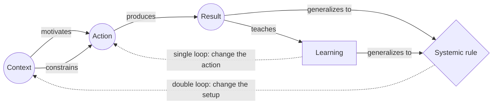

# CARL

> Takes a completed episode apart into the Context it happened in, the Action taken, the Result that followed and the Learning drawn from it, then forces a fifth question: which governing rule has to change so that the failure class cannot recur. Category: Narrative & Statement Decomposition. Reference: [Double-loop learning](https://en.wikipedia.org/wiki/Double-loop_learning). [Open the 3D graph](./index.html) (needs internet for Three.js; on GitHub open via Pages or clone).

## What it decomposes

CARL takes apart a completed episode that somebody is looking back on: a nurse's written reflection on a shift, a competency-interview answer, a founder's account of why the company closed. The four letters are Context, Action, Result, Learning. It is a teaching device from nursing and allied-health reflective practice, taught beside Gibbs's cycle and Rolfe's what / so what / now what, and used in competency interviews where the point is what an episode taught rather than what it earned. It is STAR with a different fourth question: Task checks that the actor owned the objective, Learning checks that they took something away.

This library adds a fifth slot, the systemic rule, which is why the reference above is not a page about CARL. CARL has no encyclopedia entry of its own; the page linked is Argyris and Schoen's double-loop learning (*Organizational Learning*, 1978; Chris Argyris, "Double Loop Learning in Organizations", *Harvard Business Review*, 1977), which is what the fifth slot holds. Single-loop learning corrects the action while the governing variables stay fixed: the thermostat turns the heat down when the room passes twenty degrees. Double-loop learning asks whether twenty is the right setting. CARL's Learning slot is single-loop by construction, since "what would I do differently next time" holds the setup fixed, so a library meant to pull transferable rules out of episodes needs a place for the other loop.

Without the fifth slot two failures recur: the Learning restates the Result ("the lesson is that we had to shut down"), or a single-loop resolution is written into the rule slot ("be more careful"), and nothing comes out of the episode that transfers to anyone who was not in it. Both examples below are built on that contrast. The nurse resolves to read every label twice and the ward instead changes where the drugs are stored, which works whether or not anyone reads carefully. In the TBPN example the operating loop succeeded on every measure the founder gives and the company still died, so there is no better action to resolve on: the correction has to be made to jurisdiction, financing mix and ownership model.

## The slots



The solid arrows are the five relations the graph stores. The dotted arrows are the loops themselves, not edges: the single loop returns a lesson to conduct inside an unchanged setting, the double loop returns a rule to the setting itself.

| Slot | What goes here | Typical provenance | Why that provenance |
|---|---|---|---|
| Context | The setting, and which rules, markets or structures bounded the actor. | fact | Accounts open with it; only a constraint nobody names is inferred. |
| Action | What was done, as concrete steps in order. | fact | The narrator's moves are on record; what was carried rather than done is inferred. |
| Result | What followed, measured where possible, including outcomes that contradict one another. | fact | Outcomes get stated; the mechanism joining them does not. |
| Learning | The single-loop lesson: what to do differently next time inside the same setup. | either | Reflective genres state it; that the stated lesson is wrong is a separate, derived node. |
| Systemic rule | The double-loop lesson: the governing assumption, policy or structure that must change so the failure class cannot recur. | derived | Almost never stated as a rule. A speaker may state a change; the rule behind it still has to be named. |

Relations: `motivates` (context or earlier step to what is done next), `constrains` (a context condition bounding what an action can achieve, up to preventing it), `produces` (action or earlier outcome to what followed), `teaches` (result to lesson), `generalizes_to` (a lesson or an observed recurrence to a standing rule), and the implicit `supported_by` from a derived node to its facts.

## Example 1: A medication near miss on a ward (reflective account)

The reflective-practice setting CARL was written for: a nurse writes up a near miss, draws the obvious lesson about her own care, and the ward changes something she never proposed. The graph separates the stated account from the inferences that turn a personal resolution into a systemic rule.

### Source text

> On a late shift in February I was the only registered nurse covering sixteen beds, working with one healthcare assistant and an agency nurse who had never worked on the ward before. At about nine in the evening a patient was prescribed 1 mg of intravenous morphine for breakthrough pain. I went to the controlled-drugs cupboard, took an ampoule from the tray, drew up the dose, and asked the agency nurse to check it with me before I gave it. She read the label back and stopped me: the ampoule was 10 mg in 1 ml, not 1 mg in 1 ml. The two strengths are kept in the same drawer in almost identical boxes. No morphine reached the patient, and I recorded the event as a near miss before the end of the shift. My first reaction was that I had been careless, and I decided that I would slow down and read every label twice. When the team reviewed the incident the following week, we found that the same two ampoules had been confused twice already that year, by two other nurses. Because it had now happened three times to three different people, the ward changed where the drugs live: the two strengths are stored in separate cupboards and the 10 mg ampoule is released only against a second signature in the controlled-drugs register. I still read every label twice, but I no longer think that is what makes the next dose safe.

Written for this library in the genre CARL is taught in (nursing and allied-health reflective practice); the ward, the shift and the figures are invented, the look-alike-ampoule failure mode is a standard patient-safety case.

### Decomposition

**Context**

- `c1` **Sole RN for sixteen beds** [fact] On a late shift the author was the only registered nurse for sixteen beds, with a healthcare assistant and an agency nurse who did not know the ward. "I was the only registered nurse covering sixteen beds, working with one healthcare assistant and an agency nurse who had never worked on the ward before" (sentence 1)
- `c2` **1 mg IV morphine prescribed** [fact] A patient was prescribed 1 mg of intravenous morphine for breakthrough pain at about nine in the evening. "a patient was prescribed 1 mg of intravenous morphine for breakthrough pain" (sentence 2)
- `c3` **Look-alikes in one drawer** [fact] The 1 mg and 10 mg morphine ampoules are kept in the same drawer in almost identical boxes. "The two strengths are kept in the same drawer in almost identical boxes" (sentence 5)
- `c4` **Only small print separates 10x** [derived 0.85] Nothing but the printed strength on a near-identical box separates a dose from ten times that dose. Rationale: The account states that the two strengths sit in one drawer in almost identical boxes and that the ampoules are 1 mg and 10 mg in the same volume; that the small print is the only discriminator is the inference joining those two statements.

**Action**

- `a1` **Drew up the dose from the tray** [fact] She went to the controlled-drugs cupboard, took an ampoule from the tray and drew up the dose. "I went to the controlled-drugs cupboard, took an ampoule from the tray, drew up the dose" (sentence 3)
- `a2` **Asked for a second check** [fact] She asked the agency nurse to check the drawn-up dose with her before administering it. "asked the agency nurse to check it with me before I gave it" (sentence 3)
- `a3` **Logged it as a near miss** [fact] She recorded the event as a near miss before the end of the shift. "I recorded the event as a near miss before the end of the shift" (sentence 6)
- `a4` **Team reviewed it a week later** [fact] The team reviewed the incident at its meeting the following week. "the team reviewed the incident the following week" (sentence 8)

**Result**

- `r1` **Caught: 10 mg, not 1 mg** [fact] The agency nurse read the label back and stopped her: the ampoule was 10 mg in 1 ml, not 1 mg in 1 ml. "She read the label back and stopped me: the ampoule was 10 mg in 1 ml, not 1 mg in 1 ml" (sentence 4)
- `r2` **No morphine reached the patient** [fact] No morphine reached the patient. "No morphine reached the patient" (sentence 6)
- `r3` **Same swap twice before** [fact] The review found that the same two ampoules had been confused twice already that year, by two other nurses. "the same two ampoules had been confused twice already that year, by two other nurses" (sentence 8)
- `r4` **The barrier that held: the check** [derived 0.80] The error was stopped by a second person reading the label, not by the care taken in drawing the dose up. Rationale: The same nurse both selected the wrong ampoule and asked for the check; identifying the check rather than her own attention as the barrier that actually worked is a reading of that sequence, not a statement in it.

**Learning**

- `l1` **Resolved to read labels twice** [fact] Her first lesson was that she had been careless and would slow down and read every label twice. "I would slow down and read every label twice" (sentence 7)
- `l2` **Vigilance was not what failed** [derived 0.85] Three different nurses made the same mistake, so the variable that failed is not individual attention but the arrangement that requires it. Rationale: The recurrence across two other nurses is stated; concluding from it that attention is the wrong variable to correct is the move from a single-loop resolution to a double-loop diagnosis, and the account gestures at it without naming it.

**Systemic rule**

- `u1` **Split cupboards, 2nd signature** [fact] The ward now stores the two strengths in separate cupboards and releases the 10 mg ampoule only against a second signature in the controlled-drugs register. "the two strengths are stored in separate cupboards and the 10 mg ampoule is released only against a second signature in the controlled-drugs register" (sentence 9)
- `u2` **Design ambiguity out of storage** [derived 0.80] The governing rule moves from asking people to read more carefully to removing the situation in which a misread is possible at all. Rationale: The ward's change and the closing sentence both point at this principle, but the account states the new arrangement rather than the rule behind it; naming the rule is what makes the lesson transfer to every other look-alike pair on the ward.

Fact edges. Three, each joining two fact nodes with a connective the account states in one span:

- `ce7` `a4` produces `r3` [fact] "When the team reviewed the incident the following week, we found that the same two ampoules had been confused twice already that year, by two other nurses" (sentence 8)
- `ce8` `r1` teaches `l1` [fact] "My first reaction was that I had been careless, and I decided that I would slow down and read every label twice" (sentence 7)
- `ce9` `r3` generalizes to `u1` [fact] "Because it had now happened three times to three different people, the ward changed where the drugs live" (sentence 9)

Derived edges. Ten carry a framework relation:

- `ce1` `c2` motivates `a1` [derived 0.90] Rationale: The prescription is what sent her to the cupboard; the account gives the two in sequence without stating the link.
- `ce2` `c1` motivates `a2` [derived 0.60] Rationale: With no second registered nurse on the ward the check could only fall to the agency nurse; the account states the staffing and the request but never connects them.
- `ce3` `c3` constrains `a1` [derived 0.80] Rationale: Taking the wrong strength was possible because both sit in one drawer in almost identical boxes; the arrangement is stated separately from the act.
- `ce4` `a2` produces `r1` [derived 0.90] Rationale: The catch follows the request to check in the next sentence, but no connective is stated; narrative order is doing the work.
- `ce5` `r1` produces `r2` [derived 0.90] Rationale: Nothing reaching the patient is the consequence of the ampoule being stopped; the two are reported as separate facts.
- `ce6` `a3` motivates `a4` [derived 0.70] Rationale: The logged near miss is what put the event on the team meeting's agenda; the account states both without joining them.
- `ce10` `r3` teaches `l2` [derived 0.85] Rationale: Reading the recurrence as evidence about the system rather than about three careless individuals is the inference the ward acted on but the author does not write down.
- `ce11` `l1` generalizes to `l2` [derived 0.70] Rationale: The single-loop resolution is superseded rather than confirmed once the recurrence is known; the account keeps both without ranking them.
- `ce12` `l2` generalizes to `u1` [derived 0.80] Rationale: The stated rule change follows from the diagnosis that attention is the wrong variable; the ward states the new arrangement, never the diagnosis.
- `ce13` `l2` generalizes to `u2` [derived 0.85] Rationale: Once vigilance is ruled out as the failing variable, the only remaining lever is the storage design, which is the governing rule the ward actually changed.

Seven are grounding links, every one derived: `ce14` `c4` to `c3` (0.85); `ce15` `c4` to `r1` (0.80); `ce16` `r4` to `a2` (0.80); `ce17` `r4` to `r1` (0.85); `ce18` `l2` to `r3` (0.85); `ce19` `u2` to `u1` (0.80); `ce20` `u2` to `c3` (0.80).

### What the LLM added and why it helps

Hide the derived layer and what remains is the written account: twelve fact nodes and three stated links. That skeleton already contains the double-loop change, because `u1` is a fact: the ward really did move the drugs, and the author reports it. What it lacks is the reasoning between the recurrence and the change. `ce9` says the ward acted because it had happened three times; nothing says why three occurrences point at the cupboard rather than at three careless nurses.

The four derived nodes fill that gap. `c4` (0.85) states the hazard the storage arrangement creates. `r4` (0.80) credits the save to the check rather than to the author's care, the attribution she declines to make about herself. `l2` (0.85) is the pivot: it sits in the Learning slot beside her resolution `l1` and contradicts it, and `ce11` (0.70) records the relation as `generalizes_to` rather than agreement, so the graph carries the superseded lesson and its replacement instead of dropping one. `u2` (0.80) names the governing rule the ward acted on without stating, which lets the lesson reach every other look-alike pair rather than morphine alone.

The derived edges do the narrative work: `ce1` and `ce4` (0.90) turn adjacency into sequence, `ce3` (0.80) makes the storage arrangement a constraint on the act rather than background, `ce2` (0.60) is the weakest link and says so, and `ce12` and `ce13` (0.80, 0.85) route the ward's change through the diagnosis rather than straight from the recurrence. The reader gains a claim the account only implies: the barrier that held was the second person, the barrier installed was the separation, and neither is what the author resolved to do.

## Example 2: from the TBPN transcripts: Cala: profitable restaurants, terminal structure

Episode "Apple Goes Full Throttle on F1, Meme Stocks Make a Comeback, Amazon's New Wearable AI Device (Christina Cacioppo, Deena Shakir, Davide Asnaghi, Ylan Richard)", 2025-07-23, [transcript](../../../tbpn-transcripts/transcripts/2025-07-23_apple-goes-full-throttle-on-f1-meme-stocks-make-a-comeback-amazons-new-wearable-ai-device-christina-cacioppo-deena-shakir-davide-asnaghi-ylan-richard.md); line numbers refer to it. The speaker is Ylan Richard, co-founder of Cala, interviewed from roughly L5844 to L6320. The transcript is not diarised and renders his first name as "Elan" (L5844); the episode carries other guests, Davide Asnaghi among them, and none of this segment is theirs, so `source_ref` names Richard from the surrounding turns.

Why it fits: an eight-year episode told two months after the shutdown, with outcome, mechanism and lessons all stated out loud, and with a rare property. The actions succeeded on every operating measure the speaker gives while the company still died, so the correction has to happen one loop up. He even names the governing assumption that failed, that they did not understand the European financing cliff when they structured the business.

### Facts (quoted)

Twenty-one of the twenty-seven nodes and seven of the thirty-four edges are facts, none paraphrased. Quotes keep the transcript's errors ("Cali" for Cala, "a product that work"); `source_ref` is the speaker plus the line range.

**Context**

- `ct1` **Robotics to cut restaurant costs** [fact] Cala's mission was to make real food more affordable by using robotics and AI to automate back-kitchen operations. "The vision and the mission was to basically make real food more affordable by using robotics and AI to automate the back kitchen operations" (Ylan Richard, L5898-L5902)
- `ct2` **Ten million raised from VCs** [fact] By the time the first restaurants were working the company had raised ten million dollars from venture investors. "We had raised 10 million up to that point from VCs" (Ylan Richard, L5948-L5950)
- `ct3` **European Series A/B cliff** [fact] European venture has a structural financing gap at the Series A to Series B moment: a gigantic cliff rather than a next rung. "there's a big financing gap when you get to the Series A slash Series B moment, where basically there's just a gigantic cliff of funding there" (Ylan Richard, L5950-L5954)
- `ct4` **French insolvency severance** [fact] French law gives employees high severance when a company goes bankrupt, with further state-backed protections on top. "what the regulation actually says is just that when a company goes bankrupt, the employee gets pretty high severance" (Ylan Richard, L6148-L6151)
- `ct5` **Cliff unknown at incorporation** [fact] The founders did not know about the financing cliff when they created and structured the business. "we did not understand that when we created the business and structured the business" (Ylan Richard, L5954-L5956)

**Action**

- `a1` **Ran the company eight years** [fact] The founders ran Cala for eight years, making, in the speaker's words, an ungodly amount of mistakes along the way. "We basically ran the company for eight years, did a bunch, like an ungodly amount of mistakes along the way" (Ylan Richard, L5928-L5932)
- `a2` **Decided to scale on first results** [fact] On the strength of the first profitable restaurants the team decided to start scaling. "we have kept those great first results with the restaurants, let's start scaling" (Ylan Richard, L5946-L5948)
- `a3` **Tried to restructure to break even** [fact] With scaling blocked, the team tried to restructure away from a handful of profitable restaurants carrying a very high HQ cost. "restructuring the business to go from those hands full of restaurants that were very profitable and a very high HQ cost" (Ylan Richard, L5978-L5982)
- `a4` **Asked regulators for a workaround** [fact] The founders went to regulators, the government and any structure around them looking for a workaround. "we basically tried to talk to the regulators, to the government, to any structure that was around us to try and find a workaround" (Ylan Richard, L6012-L6014)

**Result**

- `r1` **Five very profitable restaurants** [fact] The eight years produced five very, very, very profitable restaurants. "managed to have five very, very, very profitable restaurants" (Ylan Richard, L5932-L5934)
- `r2` **60% retention, 95% satisfaction** [fact] Sixty per cent of customers came back more than once a week and customer satisfaction was ninety-five per cent. "but like 60% retention, customers coming more than once a week, 95% customer satisfaction" (Ylan Richard, L5938-L5942)
- `r3` **Only payback on the robot install** [fact] Cala was, with the possible exception of Sweetgreen, the only restaurant business to have proven an incrementally positive return on the whole investment including the machines. "we are the only business that had, and technically Sweetgreen does as well, but had proven, let's say, incrementally positive return investment on the whole investment of a restaurant" (Ylan Richard, L6078-L6082)
- `r4` **Severance liability exceeded cash** [fact] The severance liability alone was higher than the cash the company held at the time. "Like the purely the severance liability was higher than the cash on the hands we have at the time" (Ylan Richard, L6000-L6002)
- `r5` **Shut down two months earlier** [fact] The business was shut down a bit more than two months before the interview. "we had to shut down the business around a bit more than two months ago" (Ylan Richard, L6018-L6020)
- `r6` **Product worked, scaling did not** [fact] The product worked and the economics were there; what the company could not do was keep scaling. "we actually had a product that work and, and the economics were there. We just couldn't keep on scaling" (Ylan Richard, L6207-L6211)

**Learning**

- `l1` **Mistake was building in France** [fact] The biggest mistake was starting the business in Europe, and in France specifically. "the biggest mistakes we made was definitely starting the business in Europe, in France specifically" (Ylan Richard, L6108-L6110)
- `l2` **Should have seen it years earlier** [fact] They should have understood two or three years earlier that they could not keep scaling, and been far more conservative in structuring the business. "we should have understood that maybe two or three years earlier and just, uh, been a lot more conservative on the structuring of the business" (Ylan Richard, L6210-L6214)

**Systemic rule**

- `u1` **Finance with VC and retail PE** [fact] The financing strategy has to combine venture capital with private equity that handles retail and restaurants naturally, and the business must be tailored to both. "you have to build a strategy around your financing that's both VC but also private equity that does retail and restaurants more naturally" (Ylan Richard, L6222-L6225)
- `u2` **Keep HQ cost low and lean** [fact] The new company keeps a low HQ cost and lean HQ operations, with the other structuring elements changed to match. "that means low HQ cost, more lean HQ operations" (Ylan Richard, L6228)
- `u3` **Franchise rather than own stores** [fact] Franchising is under serious consideration as the path to scale, more aggressively and more capital-efficiently than owning every restaurant as Cala did. "pretty highly considering franchising as kind of a path to scale a lot more aggressively than and a lot more efficiently, capital efficiently than we did with Cali where we own every single restaurant" (Ylan Richard, L6299-L6305)
- `u4` **Next company starts in New York** [fact] The roadmap is to launch the first store of the new company in New York around the middle of next year. "The higher level roadmap is to launch the first store in New York, middle of next year" (Ylan Richard, L6289)

Fact edges. Seven, each joining two fact nodes in a span where Richard states the connection himself:

- `te2` `a1` produces `r1` [fact] "We basically ran the company for eight years, did a bunch, like an ungodly amount of mistakes along the way, but in the end, managed to have five very, very, very profitable restaurants" (Ylan Richard, L5928-L5934)
- `te4` `r1` motivates `a2` [fact] "And so the thinking from there was, okay, we have kept those great first results with the restaurants, let's start scaling" (Ylan Richard, L5946-L5948)
- `te5` `ct3` constrains `a2` [fact] "let's start scaling. We had raised 10 million up to that point from VCs and we kind of got hung on a very structural problem of Europe" (Ylan Richard, L5948-L5951)
- `te7` `ct4` constrains `a3` [fact] "We could have cut down cost enough to make the business profitable, but just pure French regulation prevented us from doing that" (Ylan Richard, L5990-L5994)
- `te9` `a4` produces `r5` [fact] "we basically tried to talk to the regulators, to the government, to any structure that was around us to try and find a workaround. But in the end, we couldn't really go beyond what the laws and rules allowed. And so ultimately, we had to shut down the business around a bit more than two months ago" (Ylan Richard, L6012-L6020)
- `te11` `r5` teaches `l1` [fact] "But yeah, in the end, couldn't really get there with Cala. And I think in the end, the biggest mistakes we made was definitely starting the business in Europe, in France specifically" (Ylan Richard, L6104-L6110)
- `te12` `r6` teaches `l2` [fact] "we actually had a product that work and, and the economics were there. We just couldn't keep on scaling and we should have understood that maybe two or three years earlier and just, uh, been a lot more conservative on the structuring of the business" (Ylan Richard, L6207-L6214)

### Decomposition

Six derived nodes, and twenty-seven derived edges carrying every link Richard does not make in words. Fact nodes are referenced by id.

**Context**

- `ct6` **Plan needed capital Europe lacks** [derived 0.70] The scaling plan required a round of a size European venture does not supply for capital-intensive physical businesses. Rationale: The speaker states the cliff and states that ten million had been raised just as scaling began; the mismatch between the plan's capital requirement and the market's supply is a reading of those two facts and is never put that way. Supported by `ct2`, `ct3`.

**Action**

- `a5` **Kept HQ sized for the big plan** [derived 0.70] Through those years the company carried a headquarters sized for the ambitious plan rather than for the five restaurants it operated. Rationale: He describes a very high HQ cost against a handful of restaurants and says they had kept a much more ambitious vision than what was achievable in Europe; that the HQ was sized to the plan rather than to the estate is the inference joining those statements. Supported by `a3`, `r1`.

**Result**

- `r7` **Regulation priced the fix out** [derived 0.80] Insolvency protection turned a solvable cost problem into an unsolvable one: the cheapest legal route back to profitability cost more cash than the company held. Rationale: He says the restructuring was possible on paper, that French regulation prevented it, and that the severance liability alone exceeded cash on hand; naming that combination as the failure mechanism joins three separate statements into one. Supported by `r4`, `ct4`.

**Learning**

- `l3` **No single-loop fix could save it** [derived 0.80] What failed was not how the restaurants were run but how the company was structured, so no improvement inside the existing setup could have changed the outcome. Rationale: The stated results show the operating loop working (profitable stores, weekly retention, payback on the machines) while the outcome was still terminal; diagnosing the failure as sitting in the governing structure rather than in execution is the double-loop reading the speaker approaches but never states. Supported by `r6`, `r1`, `r3`.

**Systemic rule**

- `u5` **Structure is a design variable** [derived 0.75] Jurisdiction, financing mix and ownership model are design variables to be chosen at incorporation and tested against the wind-down case, not only against the growth case. Rationale: Each of the four rules he states changes something that was fixed before the first restaurant opened; the governing rule they share, that structure is chosen and testable rather than inherited from where you happen to live, is the generalisation over them and is what makes the lesson portable. Supported by `ct5`, `u1`, `u4`. Carries an `idea` field, quoted under "Where the opportunity shows up".
- `u6` **The A/B cliff is an open market** [derived 0.60] Proven, capital-intensive consumer businesses in Europe have no natural capital source between venture and retail private equity, which is why an operationally successful company had to stop. Rationale: Generalising one founder's account into a claim about a whole capital market is contestable: the cliff and the financing mix he now prescribes are stated, but the market-level gap and its size are inferred from a single case. Supported by `ct3`, `r6`. Carries an `idea` field, quoted under "Where the opportunity shows up".

Derived edges. Thirteen carry a framework relation:

- `te1` `ct1` motivates `a1` [derived 0.85] Rationale: The mission is what the eight years of operating pursued; the speaker states them in sequence rather than as a cause.
- `te3` `a1` produces `r2` [derived 0.80] Rationale: Retention and satisfaction are offered as the numbers behind the profitable restaurants, but the attribution to the eight years of operating is not made in a single span.
- `te6` `ct3` motivates `a3` [derived 0.80] Rationale: He describes hitting the funding wall and then the attempt to restructure to a break-even business; the link is adjacent in the narrative but never stated.
- `te8` `a3` produces `r4` [derived 0.85] Rationale: The severance liability is what the restructuring ran into; he names the regulation and then the liability in consecutive sentences without joining them.
- `te10` `r4` produces `r5` [derived 0.85] Rationale: The liability exceeding cash is why the shutdown was unavoidable, but the two are separated in his account by the attempt to find a workaround.
- `te13` `l2` generalizes to `l3` [derived 0.75] Rationale: Being more conservative about structuring is a step towards the diagnosis but stops short of it; naming the governing structure as the thing that failed is the analyst's move.
- `te14` `l1` generalizes to `u4` [derived 0.80] Rationale: The new company's first store is in New York; reading that as acting on the France lesson is a link the speaker leaves the listener to make, though he states the two minutes apart.
- `te15` `l2` generalizes to `u1` [derived 0.85] Rationale: The financing strategy is offered as the key lesson from the collapse, but the step from being more conservative to combining VC with retail private equity is a generalisation.
- `te16` `l2` generalizes to `u2` [derived 0.80] Rationale: A lean HQ is the operational form of being more conservative on structuring; he states both as lessons without connecting them.
- `te17` `l3` generalizes to `u3` [derived 0.70] Rationale: Franchising changes the ownership model rather than the operation, which follows from the diagnosis that the operation was not the problem.
- `te18` `l3` generalizes to `u5` [derived 0.75] Rationale: If single-loop fixes could not save it, the correction has to be made where the governing variables are set, which is the rule stated at u5.
- `te19` `l3` generalizes to `u6` [derived 0.60] Rationale: Turning one company's structural failure into a claim about a missing capital market is the widest step in the graph and the most contestable.
- `te20` `ct6` constrains `a2` [derived 0.70] Rationale: If the plan needed more capital than the market supplies, the decision to scale was already unfundable when it was taken; the speaker states the cliff but not this consequence.

Fourteen are grounding links, every one derived and hidden behind the viewer's grounding toggle: `te21` `ct6` to `ct2` (0.70); `te22` `ct6` to `ct3` (0.75); `te23` `a5` to `a3` (0.70); `te24` `a5` to `r1` (0.65); `te25` `r7` to `r4` (0.80); `te26` `r7` to `ct4` (0.80); `te27` `l3` to `r6` (0.80); `te28` `l3` to `r1` (0.80); `te29` `l3` to `r3` (0.75); `te30` `u5` to `ct5` (0.80); `te31` `u5` to `u1` (0.75); `te32` `u5` to `u4` (0.75); `te33` `u6` to `ct3` (0.60); `te34` `u6` to `r6` (0.60).

### What the LLM added

Hide the derived layer and twenty-one facts remain, joined by the seven stated links above: an operating chain from the eight years to the shutdown, plus two `teaches` edges carrying outcomes to his lessons. For a live interview that is an unusually complete skeleton, since most narrators leave the step from outcome to lesson unstated. What it lacks is the mechanism of death and the diagnosis: nothing joins the restructuring attempt to the liability, the liability to the shutdown, or the failure to the structure rather than the operation.

The derived nodes supply those. `r7` (0.80) is the mechanism: insolvency protection turned a solvable cost problem into an unsolvable one, joining three statements he makes in a row and never connects. `ct6` (0.70) names the mismatch between what the scaling plan needed and what European venture supplies, and `te20` (0.70) carries that onto the decision as a `constrains` edge, saying the plan was unfundable when adopted. `a5` (0.70) is the one Action node the transcript does not narrate as an act. `l3` (0.80) is the hinge, the diagnosis that the operating loop worked while the outcome was still terminal.

The rule slot behaves unusually here: four of its six nodes are facts, against a typical provenance of derived. Richard is not reflecting in the abstract, he is incorporating the next company, so his corrections are already decisions: venture capital plus retail private equity (`u1`), a lean HQ (`u2`), franchising rather than owning (`u3`), New York (`u4`). Each is a specific change and none is a rule. `u5` (0.75) generalises over all four; `u6` (0.60) is the widest step in the graph.

The `generalizes_to` edges are where the loops separate. `te15` and `te16` (0.85, 0.80) run from his own lesson `l2` to the corrections he states; `te17`, `te18` and `te19` (0.70, 0.75, 0.60) run from the derived diagnosis `l3` to the rules that follow only once execution has been ruled out. Two links a careless extraction would mark as facts are derived: `te8` and `te10` (both 0.85), where he names the regulation, the liability, the search for a workaround and the shutdown in that order and never in one causal span.

### Where the opportunity shows up

The idea-bearing slot is the systemic rule (`idea_bearing_slot: "rule"`). A governing rule that had to change describes something the world did not supply, so each derived rule node reads as a candidate market: what, had it existed, would have kept the episode from ending as it did. Two nodes carry an `idea` field, both derived, both reaching past what Richard says.

- `u5` **Structure is a design variable**, derived, confidence 0.75. Idea: *The formation stack has no tool that prices jurisdiction, severance exposure and wind-down cost at incorporation the way a cap table is modelled, which is the diligence primitive this failure asks for.*
- `u6` **The A/B cliff is an open market**, derived, confidence 0.60. Idea: *A growth vehicle that underwrites unit-economics-proven physical businesses across Europe's Series A to B gap, with retail private-equity discipline and venture speed, addresses a market the speaker describes as a gigantic cliff of funding.*

Read `u5` from the shape of the four corrections rather than any one of them: each changes something fixed before the first restaurant opened, and `ct5` is his own statement that the cliff was not understood when the business was structured. What is missing is not advice but instrumentation: founders model dilution at incorporation and nobody models the cost of stopping, although here the severance liability alone exceeded cash on hand (`r4`) and decided the outcome. Read `u6` from `ct3` and `r6`: a company with proven unit economics that cannot raise its next round at home is a financing gap by definition, and the mix he prescribes describes the vehicle that does not exist there.

The confidences say how far each reading reaches. `u5` sits at 0.75, one step over four stated corrections. `u6` sits at 0.60, plausible but contestable, because it turns one account into a claim about a capital market; its grounding links (`te33`, `te34`, both 0.60) record that. The four stated rules carry no `idea` field: they stay corrections a founder made to his own next company, which keeps the graph an account of this episode rather than a pitch deck.

## Building a knowledge graph with this framework

### Node and edge types

Five node types, one per slot: `context`, `action`, `result`, `learning`, `rule`. One episode is one connected chain, context to action to result to learning to rule, with `constrains` as the off-chain relation for a context condition that bounds an action rather than prompting it (`ce3`, `te5`, `te7`, `te20`). Three relations also run inside a slot where the narrative chains: `produces` result to result (`ce5`, `te10`), `motivates` action to action (`ce6`), `generalizes_to` learning to learning when a stated lesson is superseded (`ce11`); `generalizes_to` also runs result to rule when a recurrence rather than a lesson forces the change (`ce9`). Fact nodes carry `source_quote` and `source_ref`, derived nodes `confidence` and `rationale`, and `supported_by` runs derived to fact, always derived. `entities` use the extractions' spellings (Cala, Sweetgreen).

The rule slot admits fact nodes, and the TBPN example is the case to learn from. A correction a speaker states is a fact (`u1` to `u4`); the governing rule behind it is a separate derived node reached by `supported_by` (`u5` to `u1`, `u4`). Never merge the two: collapsing them either invents a quote for the rule or discards the speaker's words, and the point of the fifth slot is that the rule is the part nobody says.

### Fact or derived: rules of thumb

- **Context.** Extracted: accounts open with the setting, the staffing, the money raised, the regulation. Inferred: the constraint nobody names, usually a mismatch between two stated facts (`c4`, the small print as the only discriminator; `ct6`, a plan needing capital the market does not supply). Worth making because an unstated constraint reappears later as an unexplained failure. Empty: derive nothing and lower every `constrains` edge.
- **Action.** Extracted: the actor's own steps, one node each, in order. Inferred only for what was carried rather than done, a standing arrangement or cost base held across the period (`a5`). Worth making because a failure of standing structure never appears in a list of steps, and a result would otherwise have no antecedent. Empty: the passage is a description, not an episode; use Minto SCQA instead.
- **Result.** Extracted: the outcomes, measured where the speaker measures them, including outcomes that contradict each other, the pattern CARL is best at (`r1` to `r3` against `r4` and `r5`). Inferred: the mechanism joining them into an explanation (`r4`, `r7`). Worth making because the mechanism is what the Learning is tested against; without it a lesson attaches to any outcome. Empty: no results, no episode.
- **Learning.** Extracted whenever the genre calls for it, which is most of the time: reflective accounts and founder post-mortems both state lessons. Inferred as a second node in the same slot when the stated lesson does not survive the results (`l2`, `l3`), linked from the stated one by `generalizes_to` rather than replacing it. This is the inference most worth making, the boundary between the loops, and the graph should show the superseded lesson beside its replacement. Empty: derive one at 0.70 or below, supported by results, and never phrase it as a rule.
- **Systemic rule.** Extracted when the speaker states a specific change, which happens once they have acted on it (`u1` in the classic example, `u1` to `u4` in the TBPN one). Inferred otherwise, and inferred as well when changes are stated, because the rule is the generalisation over them (`u2`, `u5`). Worth making because it is the only part of the episode that transfers to somebody who was not in it, and because it is the idea-bearing slot. Empty: say so; an episode with no rule change available is single-loop.

### Extraction recipe

```text
Decompose ONE completed episode from <file>, lines <a>-<b>, with CARL plus the
systemic-rule slot. The episode must have an outcome already known to the speaker.
1. Context: the setting and each constraint the actor operated inside (fact, 5+ word
   verbatim span each). Add a derived context node ONLY for a constraint that two
   stated facts imply and nobody names.
2. Action: what was done, one node per step, in order (fact). Add a derived action
   node for a standing arrangement carried through the period, if a result depends
   on it and no step describes it.
3. Result: every outcome, with its numbers (fact). List outcomes that contradict
   each other separately; do not average them into a verdict. Add a derived result
   node for the mechanism joining outcomes, with the facts it joins.
4. Learning (single loop): the lesson as the speaker states it (fact if stated).
   Then test it against the results: if the results show the lesson could not have
   changed the outcome, add a derived learning node saying what actually failed,
   and link stated -> derived with generalizes_to. Both stay in the graph.
5. Systemic rule (double loop): each specific change the speaker states (fact),
   then ONE derived node naming the governing variable they share - jurisdiction,
   ownership, storage, financing mix, who signs. Test: could somebody other than
   this actor apply it, and would it hold if the actor were less careful? If not,
   it is a Learning, not a rule. Put the market reading in the node's `idea`
   field, never in the rationale and never in a node of its own.
6. Edges motivates / constrains / produces / teaches / generalizes_to. An edge is
   fact ONLY when both endpoints are facts AND one turn states the connection,
   quoted verbatim with a source_ref. Adjacency, narrative order, links across
   speakers and anything touching a derived node are derived with a confidence.
   supported_by from every derived node to the facts it rests on, always derived.
Output one graph.json example: {id, kind, title, summary, source, why_this_episode,
idea_bearing_slot "rule", layout, nodes [{id, slot, label <=40 chars, text,
provenance, source_quote+source_ref | confidence+rationale, idea?, entities}],
edges [{id, from, to, relation, provenance, confidence? | source_quote+source_ref,
rationale?}]}; 8-30 nodes, at least nodes-1 edges.
```

Afterwards: `node _meta/validate.mjs <dir>` checks quotes, the paraphrase cap, confidences and rationales, fact-edge endpoints, `supported_by` direction, line ranges and the presence of an `idea` in the idea-bearing slot. Four checks it cannot make: every rule node names a variable somebody could change without the actor present; every derived learning node is supported by a result, not by another learning node alone; no `teaches` edge is marked fact unless the quoted span holds both outcome and lesson; and every rule reaches a fact through `supported_by`.

### Failure modes

| Failure | What it looks like | Guard |
|---|---|---|
| Learning restates the Result | "The lesson is that we had to shut down." | A learning node must be writable as "next time, do X instead of Y"; if the result's words alone suffice, it is a result. |
| Single-loop resolution in the rule slot | "Be more careful", "read every label twice". | The rule must name a governing variable someone could change without the actor present, and must hold even if the actor is careless. `l1` stays in Learning. |
| Rule with no episode under it | A general principle supported by nothing in the source. | Every rule node needs a `supported_by` path to a fact (`u5` to `u1`, `u4`). |
| Hindsight causation marked as fact | The shutdown chain read back as one causal statement. | Fact edges need both endpoints stated and the connective quoted; `te8` and `te10` are derived at 0.85 because the chain spans four sentences. |
| Blaming the environment | "France is bad for startups" as the systemic rule. | That is a Learning (`l1`, and a fact). The rule is what the actor changes in response: jurisdiction, financing mix, ownership model. |
| Over-confident generalisation | A market-level claim from one episode at 0.85. | The 0.50-0.65 band, with grounding confidences to match (`u6`, `te33`, `te34`, all 0.60). |
| Success story run through CARL | The rule slot fills with self-congratulation. | Require an outcome the actor calls a mistake, or two stated results that contradict each other; otherwise leave the slot empty and record that. |
| Idea written into the rationale | The rationale argues for an opportunity, not the inference. | The rationale says only why the inference follows from the quoted facts; the opportunity goes in the node's `idea` field. |

## Related frameworks

- [STAR / PAR](../star-par/README.md): the same completed event without either learning slot; prefer STAR when the question is what the actor did and got, CARL when it is what the episode should change.
- [5 Whys](../../02-strategic-and-business/five-whys/README.md): a chain of causes drilled under one failure; prefer it when the mechanism is unknown, CARL when the mechanism is on the record and the question is which rule to change.
- [PDCA / Deming Cycle](../../04-sensemaking-and-complex-systems/pdca-deming/README.md): the same loop run forward as a standing process; CARL is one turn of it reconstructed afterwards from an account.
- [Systems Thinking](../../04-sensemaking-and-complex-systems/systems-thinking/README.md): where a systemic rule points once named; prefer it when the governing variable sits inside a feedback structure rather than a single policy.

[Library root](../../README.md).
