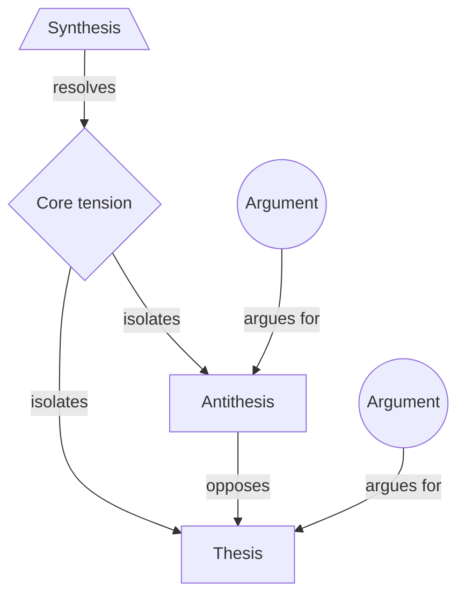

# Dialectical Decomposition

> Sets an orthodoxy against the critique that actually opposes it, isolates the proposition the two really contest once the slogans are stripped away, and derives a higher-order position that keeps what is true in both instead of splitting the difference. Category: Narrative & Statement Decomposition. Reference: [Thesis, antithesis, synthesis](https://en.wikipedia.org/wiki/Thesis,_antithesis,_synthesis). [Open the 3D graph](./index.html) (needs internet for Three.js; on GitHub open via Pages or clone).

## What it decomposes

Its object is a disagreement: two positions, held by different people, each with its own reasons. Not one argument, which is Toulmin's object, but the space between two that will not reconcile. The vocabulary is not Hegel's: thesis, antithesis and synthesis is Fichte's (1794), made the standard summary of Hegel by Chalybaus in 1837. Hegel's own triad was abstract, negative, concrete, and his operative concept was *Aufhebung*, sublation: cancel a position, preserve what was true in it, lift it to where the contradiction no longer arises. That third sense is what the framework runs on and what a compromise lacks.

Three things get forced open: each side as its own holders state it, audited by the `argument` slot, since a side with no arguments has been caricatured; the proposition the two actually contest, usually an assumption they share without noticing rather than the one being shouted; and whether a synthesis exists at all, which it does only if both sides' best arguments are left standing rather than each granted half of what it asked for.

Without it a disagreement is filed as a scoreboard (two lists and a winner) or as balance (both sides have a point), and both lose the assumption underneath that made the dispute look exclusive. Management rediscovered the method twice: Mason and Mitroff's dialectical inquiry (1969, 1981) argues a plan against a counterplan built on opposite assumptions about the same data, and Roger Martin's integrative thinking (2007) builds a third model from the best of two opposing ones. In investor argument that third position is one nobody's product occupies, which is why the synthesis slot is where this framework's ideas live.

## The slots



| Slot | What goes here | Typical provenance | Why that provenance |
|---|---|---|---|
| `thesis` | The orthodoxy or first position, in its own proponents' words. Steelmanned, never caricatured. | fact | A position is something a person holds; reconstructing one from its opponent's description is how strawmen get in. |
| `antithesis` | The opposing position as its holders put it, with its own reasons. Not the thesis negated. | fact | The negation of a thesis is a sentence, not a position; only a quote from a holder proves the opposition is real. |
| `argument` | A supporting point offered for one side; `argues_for` records which. | fact | Speakers say their arguments out loud, so they extract cleanly and audit the two slots above; a derived one is legitimate only as declared steelmanning. |
| `tension` | The proposition the two really contest once the slogans go: an assumption they share, or two different questions. | derived | Almost nobody states the real disagreement; being able to would have ended it. When a source states a framing, as the TBPN host does, keep that as a fact node and derive the real tension beside it. |
| `synthesis` | A higher-order position that preserves what is true in each side rather than averaging them; *Aufhebung*, not compromise. | derived | If it were in the source the argument would be over. Its confidence measures how much is being claimed on the sources' behalf. |

## Example 1: Rationalism against empiricism, and what Kant did with it

The textbook dialectic of modern philosophy. The passage states both positions in their proponents' own terms and gives each side its two best arguments, then stops in 1770, before Kant, so that the core tension and the synthesis are genuinely derived rather than reported.

### Source text

> Two schools divided European philosophy for a century and a half over a single question: where does knowledge come from?
>
> The rationalists - Descartes, Spinoza, Leibniz - hold that the foundations of knowledge are innate, and that reason alone, working from ideas the mind already contains, can reach truths that are certain and universal. Their strongest argument is mathematics: a single proof settles a question for every case at once, and no amount of looking at triangles could ever establish that the angles of every triangle must sum to two right angles. They add that the senses deceive us constantly, so nothing certain can rest on them alone.
>
> The empiricists - Locke, Berkeley, Hume - deny it. The mind at birth is a blank sheet, and every idea in it is ultimately a copy of an impression received through the senses. Their strongest argument is that no rationalist has ever exhibited an innate idea that an infant possesses before any experience. Hume adds that the necessity claimed for mathematics is only a relation between our own ideas, and that when we hunt for the impression behind an idea such as causal necessity we find nothing but habit.
>
> Neither side ever answered the other's best argument, and by 1770 the dispute had gone quiet without being settled.

### Decomposition

Ten nodes, six facts; nineteen edges, five facts.

Thesis

- `th` **Knowledge is founded in reason** [fact] Rationalism: the foundations of knowledge are innate, and reason alone, working from ideas the mind already contains, reaches truths that are certain and universal. "hold that the foundations of knowledge are innate, and that reason alone, working from ideas the mind already contains, can reach truths that are certain and universal" (sentence 2; Descartes, Spinoza, Leibniz)

Antithesis

- `an` **Every idea is a copy of an impression** [fact] Empiricism: the mind at birth is a blank sheet, and every idea in it is ultimately a copy of an impression received through the senses. "The mind at birth is a blank sheet, and every idea in it is ultimately a copy of an impression received through the senses." (sentence 6; Locke, Berkeley, Hume)

Arguments for the thesis

- `a1` **Mathematics settles every case at once** [fact] A single proof settles a question for every case at once, and no amount of looking at triangles could establish that every triangle's angles must sum to two right angles. "a single proof settles a question for every case at once, and no amount of looking at triangles could ever establish that the angles of every triangle must sum to two right angles" (sentence 3)
- `a2` **The senses deceive us constantly** [fact] The senses deceive us constantly, so nothing certain can rest on them alone. "the senses deceive us constantly, so nothing certain can rest on them alone" (sentence 4)

Arguments for the antithesis

- `a3` **No innate idea has ever been shown** [fact] No rationalist has ever exhibited an innate idea that an infant possesses before any experience. "no rationalist has ever exhibited an innate idea that an infant possesses before any experience" (sentence 7)
- `a4` **Necessity is only a relation of ideas** [fact] The necessity claimed for mathematics is only a relation between our own ideas, and behind an idea such as causal necessity there is no impression, only habit. "the necessity claimed for mathematics is only a relation between our own ideas, and that when we hunt for the impression behind an idea such as causal necessity we find nothing but habit" (sentence 8; Hume)

Core tension

- `t1` **Which single source: reason or sense?** [derived 0.85] The surface contest: does knowledge originate in reason or in sense experience? Stated this way the question is a straight either/or, and each side's best argument is an attack on the other's candidate source. Rationale: Both stated positions answer the same question named in sentence 1 with a different single source, and each quoted argument attacks the rival source rather than defending its own; the either/or reading is nearly forced by the text. Supported by `a2`, `a4`.
- `t2` **One source, and a passive mind** [derived 0.70] The assumption neither side examines: that knowledge has exactly one source and that the mind receives rather than shapes what it knows. Granted that, the argument cannot end, because each side's best case is an objection the other cannot absorb. Rationale: Nothing in the text states this, but it is what makes both quoted arguments valid at once: a1 shows sense experience cannot yield necessity and a3 shows reason cannot exhibit its innate content, which is only a contradiction if a single passive source must supply both. Supported by `a1`, `a3`.

Synthesis

- `sy1` **Mind supplies form, experience content** [derived 0.75] Kant's move: experience supplies the content of knowledge and the mind supplies its form, so both sides are right about their half. Thoughts without content are empty; intuitions without concepts are blind. Rationale: This is the standard historical resolution, and it is the position that leaves both quoted best arguments standing: the empiricist is right that no idea arrives with its content already in the mind, the rationalist right that necessity cannot be read off any number of observations. Supported by `a1`, `a3`.
- `sy2` **Necessity comes from the form, not luck** [derived 0.65] The corollary, and the reason this is not a compromise: universal and necessary truths are possible precisely because they describe the form the mind imposes, so Hume's objection is granted in full and answered rather than split with. Rationale: Follows from sy1 applied to a4: if necessity belongs to the form the mind contributes, then Hume is correct that no impression underwrites it and the rationalist is still entitled to it. A split-the-difference answer, some knowledge from each source, would leave a4 unanswered. Supported by `a4`.

Edges. Five are facts, each quoting the passage's own connective:

- `c1` `an` opposes `th` [fact] "The empiricists - Locke, Berkeley, Hume - deny it." (sentence 5)
- `c2` `a1` argues for `th` [fact] "Their strongest argument is mathematics: a single proof settles a question for every case at once" (sentence 3)
- `c3` `a2` argues for `th` [fact] "They add that the senses deceive us constantly, so nothing certain can rest on them alone." (sentence 4)
- `c4` `a3` argues for `an` [fact] "Their strongest argument is that no rationalist has ever exhibited an innate idea" (sentence 7)
- `c5` `a4` argues for `an` [fact] "Hume adds that the necessity claimed for mathematics is only a relation between our own ideas" (sentence 8)

Fourteen are derived. Seven carry a framework relation: `c6` `t1` -> `th` (isolates, 0.85), rationale "The thesis is the 'reason' answer to the question sentence 1 poses."; `c7` `t1` -> `an` (isolates, 0.85), rationale "The antithesis is the 'sense experience' answer to the same question."; `c8` `t2` -> `t1` (isolates, 0.70), rationale "The either/or form of the surface contest is what the shared assumption produces; remove the assumption and the question stops being exclusive."; `c13` `sy1` -> `t1` (resolves, 0.75), rationale "Answers the either/or by denying that the question has a single-source answer."; `c14` `sy1` -> `t2` (resolves, 0.75), rationale "Rejects the shared assumption directly: the mind is not passive, it contributes the form."; `c17` `sy2` -> `t2` (resolves, 0.65), rationale "Shows why the synthesis is not an average of the two positions but a rejection of the assumption under them."; `c19` `sy2` -> `sy1` (resolves, 0.70), rationale "The corollary that makes the synthesis do work Hume's objection would otherwise block." The other seven are grounding links: `c11`, `c12` from `t1` to `a2`, `a4` (0.80); `c9`, `c10` from `t2` to `a1`, `a3` (0.70); `c15`, `c16` from `sy1` to `a1`, `a3` (0.80); `c18` from `sy2` to `a4` (0.65).

### What the LLM added and why it helps

Hide the derived layer and the graph is the passage: two positions, four arguments, and the five connectives the text supplies, from "deny it" to "Hume adds that". That skeleton is complete, and stuck, which is what the source's last sentence says.

Two tension nodes get it unstuck, and their confidences separate two kinds of reading. `t1` (0.85) is close to reportage: sentence 1 names the question and each side answers it with a different single source. `t2` (0.70) is the real inference, since nothing in the passage mentions a shared assumption and only one explains why both best arguments can be sound at once: `a1` and `a3` conflict only if a single passive source must supply both necessity and content.

The synthesis nodes are the payoff and are deliberately not an average. `sy1` (0.75) splits form from content, leaving both quoted arguments standing: the empiricist keeps `a3`, the rationalist keeps `a1`. `sy2` (0.65) is the harder half, because a compromise would leave `a4` unanswered, and it answers Hume by granting him in full. The edge `c19` (0.70) is the framework's own stress test, one synthesis checking another. The gain is a position the text says nobody reached, at a stated price: 0.65 to 0.75, not 1.0.

## Example 2: from the TBPN transcripts: Slop versus Steel: Everett Randle and Delian Asparouhov on where power comes from

Episode "Slop vs Steel Showdown w/ Delian & Everett, GPT-5 Backlash, Trump Eyes Intel Stake", 2025-08-15, [transcript](../../../tbpn-transcripts/transcripts/2025-08-15_slop-vs-steel-showdown-w-delian-everett-gpt-5-backlash-trump-eyes-intel-stake-bill-bishop-jimmy-goodrich-lennart-heim-david-stout-cameron-schiller-cyr.md); line numbers refer to it.

Why it fits: a staged debate between two former Founders Fund colleagues over whether software or re-industrialisation makes the better business, and the rare TBPN moment where one proposition is put to two people who genuinely disagree, each states his own position in his own terms, and each rebuts the other on air. Thesis and antithesis are therefore facts rather than one speaker's characterisation of an absent opponent, each side supplies five or six arguments of its own, and no synthesis is reached before the segment ends. The transcript is machine-made and not diarised; quotes keep its errors ("Roik" for ROIC, "Adams" for atoms, "EBITO" for EBITDA), and `entities` use the extractions' spellings ("Everett Randall", "Delian Asperuhov"), not the men's actual names.

### Facts (quoted)

Fourteen of the nineteen nodes and five of the thirty-nine edges are facts, none paraphrases. `source_ref` is the speaker plus the line range in the file.

Thesis

- `th` **Digital form factor creates power** [fact] Everett Randle's position: a digital product's form factor and the way it is distributed lend themselves to accumulating power, and therefore to earning above-market returns on invested capital for longer, more than most atoms-based businesses do. "The advantage that digital businesses have is that in this process of producing above market Roik for a long time is that their product form factor and the way that the distribute their product lends itself more to the process of creating power, I'd argue, than most Adams-based businesses." (Everett Randall, L196-L202)

Antithesis

- `an` **Gross margin is the wrong metric** [fact] Delian Asparouhov's position: gross margin is not the right thing to focus on, especially early. What matters is terminal EBITDA margin, which is why he will fund negative-gross-margin, capex-heavy businesses. "I'm not sure that, you know, sort of gross margin is actually like the right thing to focus on in a business, especially either sort of early on. What you want to be thinking about is obviously EBITDA margin, in particular terminal, you know, EBITO margin." (Delian Asperuhov, L76-L84)

Arguments for the thesis

- `at1` **Network effects live in digital markets** [fact] The best place to create network effects is a digital marketplace, and digital products scale further than physical ones, so the forms of power an investor wants naturally attach to software. "So if you think about like network effects, the best place to create network effects is in a digital marketplace like an Uber and Airbnb or a DoorDash." (Everett Randall, L204-L206)
- `at2` **Good and bad exist on both sides** [fact] There are great and terrible atoms businesses and great and terrible digital ones; on Everett's own account the contest is not atoms versus SaaS but whether a given business accumulates power. "There are great Adams-based businesses that do this. There are terrible atom-based businesses that don't do this. There are great digital businesses that do this. There's terrible digital businesses that don't do this. I mean, you want to hear about a great Adams-based business that does this, listen to the acquired pod on Costco. Like, it's certainly not like a Adams versus SaaS thing necessarily." (Everett Randall, L188-L196)
- `at3` **ChatGPT is an application, not a model** [fact] Most of OpenAI's and Anthropic's reported revenue run rate is ChatGPT, which despite being served by a foundation-model company is a consumer subscription with enormous brand power; swap the model underneath and users would not leave. "the majority of all that or at least the plurality of all of that is chat GPT and chat GPT even though it is served by a foundation model company is an application it is a consumer subscription that has an immense amount of power" (Everett Randall, L640-L646)
- `at4` **Two tests: pricing power, frontier share** [fact] Whether a software company survives depends on two things: whether it has enough power to price above the marginal token price of the model providers, and how much of its inference genuinely needs to be at the frontier. "if you've actually built a company that has enough power where you have pricing power, where you can price above the kind of marginal token price from the actual model providers. And then two, like how much of your inference actually needs to be at the frontier?" (Everett Randall, L538-L544)
- `at5` **Mom test: tasks left the frontier** [fact] A growing subset of economic and knowledge tasks no longer needs frontier intelligence, and off-frontier inference keeps falling off a price cliff through open source and distillation. "there's like the mom test of models where like there's a growing subset of tasks like economic or knowledge tasks that the models are tasked to do that no longer need frontier intelligence" (Everett Randall, L520-L520)

Arguments for the antithesis

- `aa0` **Terminal EBITDA follows monopoly** [fact] Terminal EBITDA margin is mostly determined by how much of a monopoly the company can become in the long run, which is the mechanism the antithesis rests on. "terminal EBITDA margin, mostly is determined by ultimately how much of a monopoly your company can be in the long term." (Delian Asperuhov, L90-L92)
- `aa1` **The best EBITDA in mag 7 is hardware** [fact] Among the mag 7, the company at the biggest scale with the best EBITDA margins is the most hardware-oriented one, not the most software-oriented one. "If you look at the one that is at the biggest scale and has the best EBITO margins, it's the one that is the most, you know, basically hardware oriented." (Delian Asperuhov, L96-L102)
- `aa2` **SaaS margins hide sales and marketing** [fact] People quote SaaS gross margin without burdening it with cost of sales and marketing, so the headline number flatters businesses that have to keep buying their customers. "And so my general characterization of, you know, sort of SaaS is people always, you know, sort of study their original, you sort of gross margin, but weren't burdening in the, you know, sort of cost of sales, marketing, et cetera." (Delian Asperuhov, L116-L120)
- `aa3` **Two Stanford grads could rebuild it** [fact] Handed $100 million, two Stanford graduates could plausibly replicate an AI captioning company: the models are available and distribution can be bought on TikTok. "When I think about, you know, handing, you know, sort of two Stanford grads and $100 million to go try and, you know, sort of replicate that, Yeah, it feels like, you know, they could, you know, go do something like that." (Delian Asperuhov, L400-L404)
- `aa4` **They could not rebuild a space factory** [fact] The same two graduates with $200 million could not replicate a manufacturing facility building satellites, reentry vehicles and bioreactors that survive space; and that company has faced no significant competition even though space factories are the hot new thing. "Now, you know, if you take, you know, sort of two Stanford grads in $200 million and tell them, hey, I need you to go replicate this manufacturing facility. and go start building a bunch of, you know, sort of satellites, reentry vehicles, you know, bioreactors that can actually survive the environment of space. Most, you know, sort of stand for grads, you know, can't go, you know, as chat, GPT, how to go do that. And yet, yet, yet, hasn't really faced significant competition, irrespective of the fact that, you know, all things space factories are thought to be, you know, sort of the hot new thing." (Delian Asperuhov, L420-L430)
- `aa5` **Revenue went to the frontier, not apps** [fact] In practice the companies that captured the most revenue growth and market share are the ones pushing the true frontier, not the application layer the thesis predicts value would accrue to. "But in reality, that's not what's played out. The places that have captured the most revenue growth, the most market share have been the ones that are actually pushing the true frontier, you know, of the, you know, so technology forward." (Delian Asperuhov, L616-L620)

Core tension

- `t0` **Stated: software or re-industrialisation** [fact] The tension as the show frames it on air: which is the better business, high-margin software or capex-intensive re-industrialisation? This is the question both guests are asked to defend a side of. "We're going to settle it today on the stream. The Slop versus Steel debate, which is better high margin software or capex intensive re-industrialization efforts." (Host, L22-L24)

Fact edges. Five, each joining two fact nodes and quoting the turn where a speaker states the connection.

- `e1` `an` opposes `th` [fact] "But my sort of counter to you would be, you've made this argument that it seems to imply, hey, you know, things will accrue to the AI application layer" (Delian Asperuhov, L612-L614)
- `e2` `at3` opposes `an` [fact] "I was going to say that, that basically what Delian said was just wrong, because" (Everett Randall, L636-L636)
- `e3` `aa5` opposes `th` [fact] "And so far, at least in last 18 months, your thesis is not playing out at all." (Delian Asperuhov, L622-L622)
- `e4` `at1` argues for `th` [fact] "And so there's a lot of these forms of power that naturally lend themselves to digital products and the scalability of digital products tends to be a lot a lot greater than than physical products" (Everett Randall, L208-L212)
- `e5` `aa2` argues for `an` [fact] "And because you just have much less of monopoly typically in SaaS, that ends up totally, you know, hurting your ebidot, you know, margin profile." (Delian Asperuhov, L122-L124)

### Decomposition

Five derived nodes and thirty-four derived edges. Fact nodes are referenced by id.

Argument (all others are facts)

- `aa6` **App-layer power may rest on capex** [derived 0.55] The strongest form of the antithesis, which nobody states: ChatGPT's brand power was bought with the largest compute position in the industry, so the best example of application-layer power is not independent of the capex thesis it is used to refute. Rationale: Neither speaker says this, but it is the reply the antithesis needs to at3, and it is consistent with aa5: the frontier position that captured the revenue is the same position that produced the consumer brand. Contestable because brand and distribution advantages could have been bought more cheaply. Supported by `at3`, `aa5`.

Core tension (`t0` is the stated one)

- `t1` **Real contest: what makes copying costly** [derived 0.70] Once the slogans go, the two are contesting what makes a business expensive to copy: Delian prices durability by what a funded imitator would have to rebuild, Everett by what a user would have to give up to switch. Neither is a claim about gross margin. Rationale: Delian's two arguments are the same thought experiment run twice with the capital held constant, and Everett's rebuttal answers with substitutability, not with margins. The contested proposition is therefore the source of replication cost, which is narrower and more testable than the framing in t0. Supported by `aa3`, `aa4`, `at3`.
- `t2` **False axis: neither side believes it** [derived 0.65] The atoms-versus-bits axis the debate is staged on is one both sides abandon in argument: Everett says outright that great and terrible businesses exist on both sides, and Delian's test is about replication cost, which cuts across the axis rather than along it. Rationale: Read from at2, where the thesis holder denies the dichotomy in his own words, together with aa3 and aa4, where the antithesis holder separates two businesses by rebuild cost rather than by asset class. Contestable because both men still accept the framing rhetorically. Supported by `at2`, `aa3`.

Synthesis

- `sy1` **Power sits with the scarcest input** [derived 0.60] Both rules are right about their own layer: durable pricing power belongs to whoever controls the scarcest input at the layer they occupy. Everett's cases are ones where distribution and brand are scarce, Delian's are ones where fabrication capability is scarce, and in 2025 the scarcest input moved to frontier inference and the capital behind it, which is why revenue concentrated at the model layer without refuting either rule. Rationale: Preserves what each side established rather than averaging them: it keeps Delian's replication test and Everett's substitution test intact while explaining aa5, the observation that broke the thesis's prediction, as a change in which input is scarce rather than as a verdict on asset class. Supported by `at4`, `at5`, `aa5`, `aa1`. Carries an `idea` field, quoted under "Where the opportunity shows up".
- `sy2` **Two durability tests, one question** [derived 0.55] The replication test and the substitution test are two instruments measuring one quantity: how much of the customer's willingness to pay survives a well-funded imitator. A business needs to pass one of them, and day-one gross margin predicts neither, which is why the debate's own metric was never the disagreement. Rationale: Both tests as stated by their authors ask what an imitator with capital cannot take away, one from the supply side and one from the demand side. Contestable because the two tests can disagree about the same company, which the sources never test. Supported by `aa3`, `aa4`, `at3`, `aa2`. Carries an `idea` field, quoted under "Where the opportunity shows up".

Derived edges. Nineteen carry a framework relation; the other fifteen are grounding links, listed after them.

- `e6` `aa3` argues for `an` [derived 0.75] Rationale: Delian follows the Stanford-grads thought experiment with the Founders Fund slogan 'competition is for losers' (L412) and then 'I think I was a loser for investing in food' (L414). The slogan names a value, not a link between the replication test and the terminal-margin position; that the thought experiment argues for the antithesis is read from its placement inside Delian's own answer, so the edge is a reading of adjacency and not a quoted connective.
- `e7` `at2` argues for `th` [derived 0.70] Rationale: Everett offers the both-sides observation as the setup for his own claim about form factor in the next breath, so it functions as a premise of the thesis rather than a concession to the antithesis.
- `e8` `at4` argues for `th` [derived 0.75] Rationale: The two tests are the conditions under which the thesis still holds for a software company; adjacent to the thesis in the same answer but never linked out loud.
- `e9` `at5` argues for `th` [derived 0.70] Rationale: If most tasks no longer need frontier intelligence, application companies can buy inference cheaply and keep their margin, which is what the thesis requires.
- `e10` `aa0` argues for `an` [derived 0.85] Rationale: Stated in the same turn as the antithesis as its mechanism, but the sentence is a definition rather than an explicit 'because', so the link is read from adjacency.
- `e11` `aa1` argues for `an` [derived 0.80] Rationale: The Nvidia observation is offered as evidence that hardware orientation and monopoly, not gross margin, predict terminal EBITDA.
- `e12` `aa4` argues for `an` [derived 0.80] Rationale: The contrast case exists to show that capex-heavy businesses are the ones competition cannot reach, which is the antithesis's claim about monopoly.
- `e13` `aa5` argues for `an` [derived 0.85] Rationale: Delian presents the revenue observation as confirmation of his own position immediately after stating his counter.
- `e14` `aa6` argues for `an` [derived 0.55] Rationale: The steelmanned reply is constructed for the antithesis, not offered by it.
- `e15` `t0` isolates `th` [derived 0.85] Rationale: The host asks Everett for the bull case for software, which assigns him the first half of the framed question.
- `e16` `t0` isolates `an` [derived 0.85] Rationale: The host asks Delian to justify why he likes negative-gross-margin businesses, which assigns him the second half.
- `e17` `t1` isolates `th` [derived 0.70] Rationale: Everett's answer to the rebuttal is that a user would not switch away from ChatGPT, which is a claim about substitution cost, not about margins.
- `e18` `t1` isolates `an` [derived 0.75] Rationale: Delian's two thought experiments hold capital constant and vary only what has to be rebuilt, which is a claim about replication cost.
- `e19` `t2` isolates `t0` [derived 0.65] Rationale: The framed dichotomy is the thing the derived tension says neither side actually defends.
- `e20` `t1` isolates `t0` [derived 0.70] Rationale: Restates the staged question as the narrower proposition the arguments actually address.
- `e21` `sy1` resolves `t1` [derived 0.60] Rationale: Keeps both replication cost and substitution cost as real sources of power and explains when each one binds.
- `e22` `sy1` resolves `t2` [derived 0.60] Rationale: Replaces the atoms/bits axis with scarcity of the controlling input, which is the axis both men actually argue on.
- `e23` `sy2` resolves `t1` [derived 0.55] Rationale: Identifies the two tests as measuring one quantity, so the contest over which test to use dissolves into a question about which side of the market is tight.
- `e24` `sy2` resolves `t0` [derived 0.55] Rationale: Explains why the metric the debate was staged on, gross margin, predicts neither test's result.

Grounding links, every one a derived `supported_by` edge: `g1`, `g2` from `t1` to `aa3`, `aa4` (0.75) and `g3` to `at3` (0.70); `g4` from `t2` to `at2` (0.80) and `g5` to `aa3` (0.65); `g6` from `sy1` to `at4` (0.65), `g7`, `g8`, `g9` to `at5`, `aa5`, `aa1` (0.60); `g10`, `g11` from `sy2` to `aa3`, `aa4` (0.60), `g12`, `g13` to `at3`, `aa2` (0.55); `g14`, `g15` from `aa6` to `at3`, `aa5` (0.55).

### What the LLM added

The instructive thing here is the split inside the tension slot. `t0` is a **fact**: the show states the dichotomy in its cold open and assigns each guest a side of it, so the staged framing is data, not something the model reconstructed. `t1` (0.70) and `t2` (0.65) are the derived tensions that dismantle it, `t1` naming the contested proposition as replication cost against switching cost, `t2` reading the atoms-versus-bits axis as one neither man defends, since `at2` has the thesis holder denying the dichotomy in his own words and `aa3` and `aa4` have the antithesis holder separating two companies by rebuild cost. Two `isolates` edges record the demolition, `e20` (0.70) and `e19` (0.65), both pointing back at `t0`: the stated dichotomy is data, the real contested proposition is inference, and the graph keeps them apart.

`aa6` (0.55) is the only derived node outside the tension and synthesis slots, and it is declared steelmanning: the reply the antithesis needs to `at3` but never gives, that ChatGPT's brand power was bought with the largest compute position in the industry. Its rationale says so in the first clause and `e14` carries the same 0.55. Without it the graph leaves Everett's strongest point unanswered, a fact about the conversation and not about the positions.

Only two of the eleven `argues_for` edges are facts: a speaker rarely says "and this supports my position", he says the next thing. `e6` is derived at 0.75 because the line that follows the Stanford-grads thought experiment, "competition is for losers", is a slogan rather than a connective. `e10` is derived at 0.85 because its sentence defines terminal EBITDA rather than saying why the position holds. Adjacency is inference however obvious, and the confidence records how close it is: 0.85 same turn, 0.70 for a point made minutes earlier and joined by topic.

### Where the opportunity shows up

The idea-bearing slot is the synthesis (`idea_bearing_slot: "synthesis"`): a position both sides are entitled to and neither occupies, and in a market a position nobody occupies is either a product that does not exist or a need nobody prices. Both synthesis nodes carry an `idea` field.

- `sy1` **Power sits with the scarcest input**, derived, confidence 0.60. Idea: "If margin now leaks to whoever owns the scarce input, the underserved product is margin-aware inference routing tied to the application's own pricing: model routers exist, but none decides per request which tier a given customer's price point can afford, which is the spread Everett describes and no application company yet captures as a product." Read from the node: Everett names the two conditions (`at4`) and observes that a growing share of tasks has left the frontier (`at5`), while Delian's evidence is that revenue went to the frontier anyway (`aa5`). The gap between what the thesis holder says is possible and what the antithesis holder observes happening is an execution gap, and execution gaps are products.
- `sy2` **Two durability tests, one question**, derived, confidence 0.55. Idea: "An underwriting and diligence product that scores a company on rebuild cost and on switching cost instead of day-one gross margin would price exactly the thing two of the sharpest investors in the market argue about with anecdotes." Read from the node: the two tests are the only durability instruments either man uses, both are applied as thought experiments and anecdotes (`aa3`, `aa4`, `at3`), and the metric the debate was staged on predicts neither.

Both sit in the 0.50 to 0.65 band, plausible but contestable, for the same reason: each joins two speakers who conceded nothing to one another, and each rests on a synthesis nobody on air proposed. `sy2` is the lower because, as its own rationale says, the two tests can disagree about the same company and the sources never test that. These are candidate ideas whose first job is to be falsified cheaply; the confidence says so.

## Building a knowledge graph with this framework

### Node and edge types

Node types are the five slots, edge types the four relations plus the reserved grounding link. One dialectic is one connected component: exactly one `thesis` and one `antithesis`, any number of `argument` nodes attached by `argues_for`, and one or more `tension` and `synthesis` nodes. `opposes` runs from the antithesis to the thesis, and from an argument to the opposing side when it is aimed there directly (`at3` -> `an`, `aa5` -> `th`); `argues_for` from an argument to the side it serves; `isolates` from a tension to each side whose real commitment it names, chaining when a derived tension dismantles a shallower one (`c8`, and `e19` and `e20` onto the fact tension `t0`); `resolves` from a synthesis to the tension it dissolves, and in the classic example from one synthesis to another (`c19`), the corollary that keeps the first from becoming a compromise. `supported_by` runs from every derived node to the arguments it reads and is always derived.

Facts carry `source_quote` and `source_ref`, derived nodes `confidence` and `rationale`, and `entities` use the extractions' spellings. An edge is a fact only when both endpoints are fact nodes and one turn states the link in quotable words, which is why eight of the eleven `argues_for` edges in the TBPN example are derived even though every argument they carry is a verbatim quote.

### Fact or derived: rules of thumb

- **Thesis.** Extracted, always: a position stated by the person who holds it. Inferred only when a position is visible solely through its critic's description; then say so in the node text and cap every confidence hanging off it, the strawman case in its purest form. Empty: one position and no opposition is not a dialectic; use Toulmin instead.
- **Antithesis.** Same rule, harder to satisfy. The test is not "does someone disagree" but "does someone state a position of his own"; a speaker who only pokes holes is supplying arguments. Empty: no dialectic, and do not manufacture the opposing side; the framework that manufactures one on purpose is the pre-mortem.
- **Argument.** Extracted, always, with a verbatim span. It is also the audit: count before going further, because a side with zero arguments has been strawmanned and the decomposition should be thrown away. Inferred only as declared steelmanning, when one side's strongest available reply is missing (`aa6`, 0.55). Worth making because the synthesis must answer the best version of each side, not the version that happened to be spoken; the rationale must say it was constructed for that side, and the confidence belongs in the contestable band.
- **Core tension.** Usually inferred: the framework's first real inference. Extracted when the source states a framing out loud, as a debate show does: keep it as a fact node (`t0`) and derive the real tension beside it. Worth inferring because the stated framing is usually what keeps the argument going, and naming the shared assumption changes the shape of the dispute. Empty is the normal case. If no tension can be derived that both sides' arguments bear on, that is the finding: the two are not disagreeing about the same thing.
- **Synthesis.** Almost always inferred; extracted only where someone reaches it on air. Worth inferring because it names a position both sides' arguments entitle someone to hold and nobody holds, which is the opening this library is looking for. Empty is a legitimate outcome and must stay empty in two cases: when one side is factually wrong, so the disagreement is a dispute to settle rather than a tension to lift, and when the only third position available is an average. Say which case it is in the tension's rationale.

### Extraction recipe

```text
Decompose ONE disagreement from <file>, lines <a>-<b>, dialectically.
1. Thesis: the first position, quoted from the person who holds it (fact).
   Label <=40 chars, text 1-3 sentences. If only its opponent describes it,
   say so in the text and cap every confidence that depends on it.
2. Antithesis: the opposing position, quoted from ITS holder (fact). The
   negation of the thesis is a sentence, not a position; if no one states a
   position of his own, stop - this is not a dialectic.
3. Arguments: every supporting point either side offers, as a verbatim span of
   5+ words, with an `argues_for` edge naming the side. An argument aimed at
   the other side also gets an `opposes` edge to it. Do not continue until both
   sides have at least two. A steelman neither side gave is derived, and its
   rationale must open by saying it was constructed for that side.
4. Core tension: if the source states a framing (a host's question, the
   segment title), record it as a FACT tension node. Then derive the
   proposition the arguments actually contest - the assumption both sides
   share, or the two different questions they answer - in one sentence neither
   side would recognise as its own slogan. Add `isolates` edges to each side,
   and to the stated framing if there is one.
5. Synthesis: a position that leaves BOTH sides' quoted best arguments standing
   (derived). Test it by naming the argument from each side it preserves. If it
   works only by weakening one, it is a compromise: lower the confidence or drop
   it. If one side is factually wrong, write no synthesis and say so in the
   tension's rationale. Put the market reading in the node's `idea` field,
   never in the rationale.
6. Edges opposes / argues_for / isolates / resolves, with provenance. An edge is
   fact only if both endpoints are facts AND one turn states the link, quoted
   verbatim ("deny it", "my counter to you would be", "your thesis is not
   playing out"). Adjacency in the same turn is derived, however obvious.
   `supported_by` from every derived node to the arguments it reads, always
   derived.
Output one graph.json example: nodes [{id, slot, label <=40 chars, text,
provenance, source_quote+source_ref | confidence+rationale, idea?, entities}],
edges [{id, from, to, relation, provenance, confidence?, source_quote?,
source_ref?, rationale?}], idea_bearing_slot "synthesis".
```

Afterwards run `node _meta/validate.mjs <dir>` for quotes, the paraphrase cap and derived-to-fact connectivity, then four checks it cannot make. Count `argues_for` edges per side and reject any decomposition where a side has fewer than two. Read every synthesis rationale for the arguments it claims to preserve, and check both are real ids on opposite sides. Confirm every tension node reaches arguments on both sides through `supported_by`, and every fact edge's quote contains an actual connective, not two facts in one sentence.

### Failure modes

- **Strawmanning one side, so the synthesis is the author's original view in a hat.** The commonest misuse of the triad. Guard: each side needs at least one `argument` node quoted from its own holder; if a position's only source is its opponent's characterisation, the node text must say so and every `argues_for` into it stays below 0.60.
- **Synthesis as split-the-difference.** "Some knowledge comes from each source"; "invest in both software and hardware". Guard: the rationale must name, by id, the argument from each side the synthesis leaves standing. The classic `sy2` (0.65) demonstrates this: a compromise would leave `a4`, Hume's objection, unanswered.
- **A tension neither side holds.** The model invents a deep-sounding disagreement, then resolves it brilliantly. Guard: every tension node needs `supported_by` edges to arguments on both sides (`t1` reaches `aa3`, `aa4` and `at3`) and a rationale naming them.
- **Assuming every disagreement has a synthesis.** Some disputes are factual and one side is wrong; a fabricated third position launders the error. Guard: ask whether both sides' claims could be true at once. If not, leave the slot empty and say why in the tension's rationale; an empty slot beats a 0.4 one.
- **Promoting an argument to the antithesis.** A rebuttal to one point becomes "the opposing position". Guard: the antithesis is what its holder would say if asked what he believes; anything answering a specific point is an `argument` with an `opposes` edge (`at3`, `aa5`), keeping the position count at two.
- **Fact edges read off adjacency.** Two quoted facts in consecutive sentences look connected, and the model marks the link a fact. Guard: the quote must contain the connective. `e10` sits at 0.85 and is still derived.
- **The market reading written into the rationale, so inference and opportunity blur.** Guard: the rationale explains only why the inference follows from the quoted arguments; the reading goes in the node's `idea` field, and only in the synthesis slot.

## Related frameworks

- [Toulmin Model](../toulmin-model/README.md): the internals of one argument, warrant and rebuttal included. Toulmin when only one side has spoken, dialectic when both positions are on the record.
- [Inversion & Pre-Mortem](../../03-engineering-and-cognitive/inversion-premortem/README.md): manufactures the opposing case when the source contains none; dialectic refuses to, because an invented antithesis is a strawman.
- [First Principles](../../03-engineering-and-cognitive/first-principles/README.md): both dig beneath stated positions to unexamined assumptions, but first principles rebuilds from one position's assumptions, dialectic from the assumption two positions share.
- [MECE](../../02-strategic-and-business/mece/README.md): tests whether a split is exhaustive and non-overlapping; a false dichotomy, the `tension` slot's commonest finding, is the same failure caught from the other direction.

[Library root](../../README.md).
