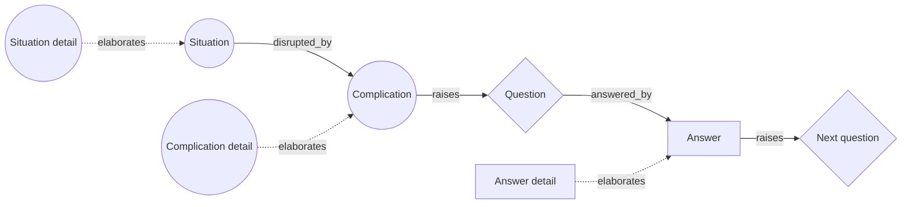

# Minto SCQA

> Frames a problem statement as Situation, Complication, Question and Answer, so that the audience arrives at the main point already holding the question that the point answers. Category: Narrative & Statement Decomposition. Reference: [Barbara Minto](https://en.wikipedia.org/wiki/Barbara_Minto). [Open the 3D graph](./index.html) (needs internet for Three.js; on GitHub open via Pages or clone).

## What it decomposes

Barbara Minto taught the pattern at McKinsey from the early 1970s and published it in *The Pyramid Principle* (1987). Its object is small and specific: the introduction, the few sentences before the argument begins. Its job is to leave the audience holding a question, so that the main point lands as an answer rather than an assertion, and Minto's claim is that this takes three moves and no more. Here is what you already accept (Situation), here is what happened to it (Complication), and therefore here is the question you are now asking (Question). The Answer is the governing thought that resolves it, and in the finished document it goes first.

The framework forces discipline about the first slot and honesty about the third. The Situation may contain nothing the audience would argue with; a sentence that needs defending has become the complication or the answer in disguise. The Question must be singular, and it must be written down even though the source almost never says it, because a decomposition that skips it cannot tell whether the answer on offer answers what the complication raised. The Answer must be a point and not a topic: "the route to market" is a heading, while "stop selling through the field force alone" can be accepted or rejected.

Skip that discipline and you get the memo that opens with a topic, or the pile of true complications supporting no single question, closed by an answer to a question nobody asked. For extraction the consequence is unusual: the slot the source almost never contains is the slot that carries the opportunity. A question a complication forces and nobody has answered is the shape of an underserved need, which is why the idea-bearing slot here is the question and not the answer a founder is already pitching.

## The slots



| Slot | What goes here | Typical provenance | Why that provenance |
|---|---|---|---|
| Situation | The stable, agreed baseline: what the audience already knows and accepts about the subject, stated so that nobody argues with it. | fact | A baseline only works if the audience has heard it, so speakers state it. Never assert common ground on their behalf. |
| Complication | What happened in that situation to disturb it: something changed, broke, arrived or fell short, and created the need to act. | fact | The change is the news, and news gets said aloud. Inferred only for the compound: several changes read as one disturbance. |
| Question | The single question the complication raises in the audience's mind. In speech it is almost never asked out loud, and when a question is asked out loud it is usually not this one. | derived | The audience supplies it. Spoken questions enter as facts, but are usually a different question, answered by something other than the Answer. |
| Answer | The governing thought that resolves the question: a point, not a topic. It sits at the top of the pyramid and immediately raises the next question. | either | Fact when the speaker is pitching, since the pitch is the point. Derived when the governing thought sits a level above what was said. |

## Example 1: The memo about the sales force

Minto's introduction pattern in its everyday habitat: a division head writes to a board that already accepts the baseline, states the two changes that broke it, and opens with a point rather than a topic. The question is never written down, because the reader is already asking it.

### Source text

> Fielding Instruments has sold its laboratory instruments through a direct field sales force for the past ten years. Everyone on the board already knows this, and nobody disputes it: the eighty-person field force has been the division's main advantage over the distributors it competes with. Since the board last reviewed the channel, two things have changed. The division's twenty largest customers have moved their purchasing onto an online marketplace that the field force does not serve, and the cost of a single field visit has doubled. The division head has to write the board a memo. She does not head it 'some thoughts on the sales force'. She writes: the division should stop selling through the field force alone and put half of the sales budget behind the marketplace channel within twelve months. Nowhere in the memo does she put the question on the page. She does not have to; by the time the board reaches her sentence, it is already asking it.

*Written for this page in the pattern of Barbara Minto, The Pyramid Principle (1987): the S-C-Q-A introduction of a business memo.*

### Decomposition

Ten nodes: seven facts and three inferences. The scenario is written so that the Question is genuinely absent from it; the narration says only that the memo never puts it on the page.

Situation

- `s1` **Ten years of direct field selling** [fact] For the past ten years the division has sold its laboratory instruments through a direct field sales force. "has sold its laboratory instruments through a direct field sales force for the past ten years" (sentence 1)
- `s2` **The force is the main advantage** [fact] The eighty-person field force has been the division's main advantage over the distributors it competes with. "the eighty-person field force has been the division's main advantage over the distributors it competes with" (sentence 2)
- `s3` **The board already accepts this** [fact] The baseline is common ground rather than an argument: everyone on the board already knows it and nobody disputes it. "Everyone on the board already knows this, and nobody disputes it" (sentence 2)

Complication

- `c1` **Top customers moved to a marketplace** [fact] The division's twenty largest customers have moved their purchasing onto an online marketplace that the field force does not serve. "The division's twenty largest customers have moved their purchasing onto an online marketplace that the field force does not serve" (sentence 4)
- `c2` **Cost of a field visit has doubled** [fact] The cost of a single field visit has doubled. "the cost of a single field visit has doubled" (sentence 4)
- `c3` **The force is now a shrinking asset** [derived 0.80] Taken together the two changes turn the field force from the division's advantage into a shrinking asset: dearer per call and blind to the accounts that matter most. Rationale: The scenario states the two changes separately; that they compound - a channel costing twice as much per call while the largest buyers leave it - is the reading that makes the situation a complication rather than two unrelated facts.

Question

- `q1` **What should we do about the channel?** [derived 0.90] The question the board is already asking and the memo never writes: what should the division do about its route to market? Rationale: Sentence 8 says the question is never put on the page, and the complication leaves exactly one open decision - what to do about the channel - which the answer in sentence 7 addresses directly, so the question is nearly forced by the stated facts.
- `q2` **How, without losing the accounts?** [derived 0.65] The new question the answer itself raises, and the point where the pyramid under the introduction begins: how do you move half the budget without losing the accounts the field force holds? Rationale: Minto's rule is that the answer becomes the next question in the reader's mind (why? or how?). The scenario states the commitment but nothing about execution, so the follow-on question is a structural inference, not a reading of the text.

Answer

- `a1` **Stop selling through the force alone** [fact] The memo's governing thought, stated as a point rather than a topic: the division should stop selling through the field force alone. "the division should stop selling through the field force alone" (sentence 7)
- `a2` **Half the budget to the marketplace** [fact] Half of the sales budget goes behind the marketplace channel within twelve months. "put half of the sales budget behind the marketplace channel within twelve months" (sentence 7)

Edges. Four are facts, each joining two fact nodes and quoting the scenario's own connective.

- `ce1` `s1` -> `c1` (disrupted_by) [fact] "Since the board last reviewed the channel, two things have changed" (sentence 3)
- `ce2` `s1` -> `c2` (disrupted_by) [fact] "Since the board last reviewed the channel, two things have changed" (sentence 3)
- `ce4` `s2` -> `s3` (elaborates) [fact] "Everyone on the board already knows this, and nobody disputes it: the eighty-person field force has been the division's main advantage" (sentence 2)
- `ce10` `a2` -> `a1` (elaborates) [fact] "the division should stop selling through the field force alone and put half of the sales budget behind the marketplace channel within twelve months" (sentence 7)

Ten are derived. Six carry a framework relation.

- `ce3` `s2` -> `c3` (disrupted_by) [derived 0.80] Rationale: The advantage named in sentence 2 is exactly what the two changes erode.
- `ce5` `c1` -> `q1` (raises) [derived 0.90] Rationale: Losing the largest buyers from the only channel forces the channel question.
- `ce6` `c2` -> `q1` (raises) [derived 0.85] Rationale: A doubled cost per visit makes the same question a budget question.
- `ce7` `c3` -> `q1` (raises) [derived 0.80] Rationale: The compounded reading is what makes the question urgent rather than routine.
- `ce8` `q1` -> `a1` (answered_by) [derived 0.90] Rationale: Sentence 7 is a direct answer to the unwritten question and to nothing else in the scenario.
- `ce9` `a1` -> `q2` (raises) [derived 0.65] Rationale: Minto's introduction hands off to the pyramid: the answer raises the next question.

The other four are grounding links, every one a derived `supported_by` edge: `ce11` `c3` to `c1` (0.80); `ce12` `c3` to `c2` (0.80); `ce13` `q1` to `c1` (0.90); `ce14` `q2` to `a1` (0.65).

### What the LLM added and why it helps

Hide the derived layer and the scenario survives intact: a baseline, an advantage, two changes, a two-part instruction. What disappears is the middle of the arc, because the memo's connective tissue was never on the page; it was in the board's head. That hole is the framework's teaching, and it is why the Question is an inference here rather than a slot someone forgot to fill.

`q1` (0.90) is the question the board is already asking, and its confidence is high because the complication leaves exactly one open decision and the answer in sentence 7 addresses that decision and nothing else. `c3` (0.80) is the other inference the introduction depends on: reading the two changes as compounding, a channel costing twice as much per call while its largest buyers leave it, is what makes them one complication rather than two pieces of trivia. `q2` (0.65) applies the framework's expectation that an answer raises the next question to a text that says nothing about execution, so it sits in the lower band honestly.

The three `raises` edges into `q1` and the `answered_by` edge into `a1` are inferences too, since no sentence says that a change raises a question or that the instruction answers one. The four fact edges are where the prose itself joins: "two things have changed" ties the baseline to both changes, a colon ties the advantage to the board's acceptance of it, an "and" ties the halves of the answer together. Facts alone leave a stable company and an abrupt instruction; the derived layer is what makes the memo checkable.

## Example 2: from the TBPN transcripts: Poseidon: from a hundred-year-old freight market to flying boats

Episode "xAI merges with X, Isomorphic Labs raises $600M (Aaron Levie, Alexis Ohanian, RJ Halperin, Cristobal Valenzuela, David Zagaynov, Sam Lessin)", 2025-03-31, [transcript](../../../tbpn-transcripts/transcripts/2025-03-31_aaron-levie-alexis-ohanian-rj-halperin-cristobal-valenzuela-david-zagaynov-sam-lessin-xai-merges-with-x-isomorphic-labs-raises-600m.md); line numbers refer to it. David Zagaynov, a co-founder of Poseidon, is asked how the company started and narrates a complete Minto introduction in one contiguous passage (L5614-L5698): a logistics market unchanged for a hundred years, then the Soviet ekranoplan and what ground effect buys, then the two things that have changed since, then a single governing sentence. Later a host presses for the why-now breakdown (L5802-L5808) and the rest of the complication and the concrete plans follow (L5814-L5926).

Why this episode: the founder tells the whole introduction in sequence, so the Situation, the Complication and the Answer are all quotable facts. Two questions are asked out loud and neither is the one the answer answers, which is the provenance point this framework exists to make: the Minto question has to be derived even when a transcript is full of question marks.

### Facts (quoted)

Sixteen of the twenty-one nodes and four of the thirty-three edges are facts, none of them paraphrases. Quotes preserve the transcript's mishearings ("Echronoplaans" for ekranoplans, "EV toll" for eVTOL, "the FA" for the FAA); `source_ref` is the speaker plus the line range.

Situation

- `s1` **Logistics unchanged for 100 years** [fact] Logistics has been a market largely unchanged for the past hundred years; it is where the founders started looking. "And so we were, I think ideating about like logistics and aerospace and I think like logistics, especially has been a market that's been largely unchanged for the past hundred years." (David Zagaynov (guest), L5614-L5620)
- `s2` **Same planes, containerized hub model** [fact] The same 737s and Cessnas still fly the freight, and ship cargo is containerised on a hub-and-spoke model. "The types of planes that we're flying are like largely the same, same 737, same like Cessna's and on the ship cargo side has been pretty much like containerized cargo with very much like spoken hub model." (David Zagaynov (guest), L5624-L5628)
- `s3` **Soviet ekranoplans, 60s and 70s** [fact] Ekranoplans were built in the Soviet Union in the 1960s and 70s and were at the time the highest cargo-capacity planes ever built: flying ships. "So Echronoplaans were like types of vehicles that were built in the Soviet Union in the 60s and 70s. And at the time they were like the highest cargo capacity, like planes ever built, like they're like flying ships essentially." (David Zagaynov (guest), L5640-L5646)
- `s4` **Ground effect: lift-drag up 30-50%** [fact] Flying in ground effect, extremely close to the water, cuts drag and adds lift: an increase in the lift-to-drag ratio of 30 to 50 percent. "A largely reduces your drag and it increases your lift. So you can carry a lot more and spend a lot less fuel. So it's like increase of your lift drag ratio by 30 to 50%." (David Zagaynov (guest), L5654-L5658)

Complication

- `c1` **Soviet-era blockers now solved** [fact] In the modern age most of the problems the Soviets had are solved: it was a controls problem and a materials-science problem, and composites answer the second. "the really crazy thing about ground effect vehicles in the modern age is like a lot of the problems that the Soviets had are solved for the most part. So it's really done a controls issue and a material science problem and composites are incredible material science." (David Zagaynov (guest), L5662-L5668)
- `c2` **Coast Guard certifies, not the FAA** [fact] Ground-effect vehicles are not regulated by the FAA but by the Coast Guard, and Coast Guard certification is significantly easier. "And so but the really cool thing is like the ground fake vehicles are not regulated by the FAA, they're regulated by the Coast Guard. And so Coast Guard certification is significantly easier than FAA." (David Zagaynov (guest), L5674-L5678)
- `c3` **FAA path: a decade plus, no flights** [fact] Companies that built eVTOL aircraft IPO'd or SPAC'd for billions without ever flying a commercial flight, because FAA certification takes a decade or more. "So you have like really great companies that have built cool like EV toll stuff and like they've IPO'd or SPAC'd or whatever for billions of dollars, but they've never actually had a commercial flight because the FA regulatory process is so long. So it's like a decade plus to get certified." (David Zagaynov (guest), L5680-L5686)
- `c4` **Composites matured in 10-15 years** [fact] Composites have come into their own over the past ten to fifteen years with good manufacturing nearby; Poseidon buys all of its composites from ATV Composites. "Like composites are really coming to their own in the past 10, 15 years in some terms of being able to, actually very good, there's very good manufacturing here. So like, ATV composites is where we get all of ours, and that's in the labor more." (David Zagaynov (guest), L5814-L5822)
- `c5` **Hobbyist RC parts got extremely good** [fact] As gamer GPUs enabled machine learning, hobbyist-grade RC hardware has become extremely good: motors, electronic systems and sensors small enough to fit on the aircraft. "And so then like on the electronic side, I think like there's in the same way that like GPUs for like gamers like enabled machine learning, they're just like the hobbyist grade RC stuff has gotten extremely good. And so just like really move forward like the quality of motors available, the quality of like electronic systems, sensors, the types of sensors that are available right now have gone small enough that we can fit them on here." (David Zagaynov (guest), L5840-L5858)
- `c6` **Regulatory arbitrage moved to hard tech** [fact] A host names the pattern on air: regulatory arbitrage, previously the domain of crypto, is now being used in hard tech. "A good Regarb just gets you going. It's previously the domain of crypto stuff, but now in hard tech, we're taking advantage of Regarb." (host, L5712-L5716)

Question

- `q0` **What could we build to disrupt this?** [fact] The founders' own question, voiced in the narration: what could they build to disrupt a logistics market that had not changed in a hundred years? "And so we were going through a bunch of ideas of like what we could build to disrupt this," (David Zagaynov (guest), L5630-L5630)
- `q1` **Why now and not decades ago?** [fact] A host asks the why-now question: what in the regulatory picture and in the tech tree has enabled this now rather than decades ago? "The question is really just like why now but I want like more of a breakdown of like all the different things from the regulatory to the tech tree that's enabled this to happen now and not earlier because at the same time like this feels like something that could have happened decades ago but why are we just why are we just breaking through with this now?" (host, L5802-L5808)

Answer

- `a1` **We are building flying boats** [fact] Flying below 150 metres, and internationally under the IMO, the craft is certified as what is technically a boat: so what they are building are flying boats. "But if you're going through the Coast Guard, and so it's if you're flying sub 150 meters and it's the same thing internationally, you're up under the IMO, you get certified as like what is technically a boat. So what we're building are flying boats." (David Zagaynov (guest), L5688-L5698)
- `a2` **Seagull: quarter scale of a 2-ton craft** [fact] The Seagull started as a quarter-scale prototype of a full-scale vehicle that will be 50 feet long with a two-ton capacity. "And really the Seagull has started as like a quarter scale prototype of a full scale vehicle, which is gonna be a 50 foot, two ton capacity vehicle." (David Zagaynov (guest), L5862-L5866)
- `a3` **A third of air-freight price per kg-mile** [fact] Commercial operations start with medical deliveries to remote islands; at full scale, carrying two tons, the aim is to compete with air freight for coastal and island cargo at roughly a quarter to a third of the price per kilogram per mile. "mostly like medical deliveries to remote islands. And then at the full scale carrying two tons, the idea is to be able to compete with air freight for coastal and island logistics and cargo and through a bunch of things we are gonna be able to get to roughly a quarter or third the price per kilogram per mile." (David Zagaynov (guest), L5920-L5926)
- `a4` **DoD mission profiles for the Seagull** [fact] Poseidon took the Seagull to the DoD, specifically the Naval Surface Warfare Center and SOCOM, who each had their own mission profiles for a large payload in the marine domain. "So we reached out to the DoD, specifically like the Naval Surface Warfare Center people and SOCOM, and they all had their own specifically mission profiles that they were interested in with the Seagull. So it's pretty large payload capacity relative to size and being able to operate in marine domains." (David Zagaynov (guest), L5898-L5908)

Fact edges. Four, each joining two fact nodes inside a single contiguous span in which one speaker states the connection himself.

- `e1` `s3` -> `c1` (disrupted_by) [fact] "And so we started looking at those and the really crazy thing about ground effect vehicles in the modern age" (David Zagaynov (guest), L5662-L5662)
- `e5` `c3` -> `c2` (elaborates) [fact] "And so Coast Guard certification is significantly easier than FAA. So you have like really great companies that have built cool like EV toll stuff and like they've IPO'd or SPAC'd or whatever for billions of dollars, but they've never actually had a commercial flight because the FA regulatory process is so long. So it's like a decade plus to get certified." (David Zagaynov (guest), L5678-L5686)
- `e14` `s2` -> `q0` (raises) [fact] "very much like spoken hub model. And so we were going through a bunch of ideas of like what we could build to disrupt this," (David Zagaynov (guest), L5628-L5630)
- `e21` `a3` -> `a2` (elaborates) [fact] "And then at the full scale carrying two tons, the idea is to be able to compete with air freight for coastal and island logistics and cargo and through a bunch of things we are gonna be able to get to roughly a quarter or third the price per" (David Zagaynov (guest), L5920-L5924)

### Decomposition

Five derived nodes and twenty-nine derived edges. Fact nodes are referenced by id above.

Complication

- `c7` **Constraint moved: physics to paperwork** [derived 0.75] The binding constraint on coastal and island air freight is no longer aerodynamics or materials but the cost and duration of certification. Rationale: c1 says the physics and materials problems are solved while c2 and c3 say certification is what keeps well-funded competitors from ever flying commercially; taken together the blocking constraint has moved from the vehicle to the regulator. Supported by `c1`, `c3`.

Question

- `q2` **Cheapest way to move coastal freight?** [derived 0.85] The question the complication actually forces and nobody asks: now that ground effect works and the craft can be certified as a boat, what is the cheapest way to move freight along coasts and between islands? Rationale: Minto's question is the one the complication raises in the listener's mind, and it is never spoken here. c1 (the physics is solved), c2 (a cheaper certifier already has jurisdiction) and c7 fix it almost completely: the only variable left open is the vehicle, which is exactly what a1 answers. Supported by `c2`, `a1`. Carries an `idea` field, quoted under "Where the opportunity shows up".
- `q3` **Which markets could switch regulators?** [derived 0.60] The general question the moment raises for anyone scanning for opportunities: which physically-ready hard-tech markets are frozen under an expensive certifier when a cheaper regulator already has jurisdiction over the same physics? Rationale: A generalisation one step above the episode: c6 states that regulatory arbitrage has moved from crypto into hard tech and c2 gives one worked instance, but nothing in the transcript claims the pattern repeats, so the reading is plausible and contestable rather than forced. Supported by `c6`, `c2`. Carries an `idea` field, quoted under "Where the opportunity shows up".

Answer

- `a5` **Design to the regulatory boundary** [derived 0.70] The governing thought one level up, never stated: let the certification boundary set the specification. Stay under 150 metres and inside the Coast Guard's jurisdiction, and take the cost advantage that follows. Rationale: a1 states the boundary (sub-150 metres, certified as a boat) and c2 and c3 state what the boundary is worth (a decade of FAA certification avoided), but the design rule itself - build to the regulator rather than to the mission - is never put into words. Supported by `a1`, `c3`.
- `a6` **Defense first, then island logistics** [derived 0.55] Defense is the beachhead: DoD mission profiles fund the vehicle while the commercial answer starts small with medical deliveries and scales to coastal cargo. Rationale: The founder gives defense interest as already concrete (a4) and describes the commercial programme as starting with medical deliveries before the two-ton full scale (a3); the sequencing is a reading of that ordering, not a stated strategy. Supported by `a4`, `a3`.

Derived edges. Nineteen carry a framework relation.

- `e2` `s4` -> `c1` (disrupted_by) [derived 0.80] Rationale: The aerodynamic prize described in s4 is what the solved controls and materials problems finally make buildable.
- `e3` `s1` -> `c7` (disrupted_by) [derived 0.75] Rationale: A hundred-year-stable market is the baseline that the moved constraint disturbs.
- `e4` `s2` -> `c7` (disrupted_by) [derived 0.70] Rationale: The hub-and-spoke, same-airframe status quo is what a cheaper certification path reopens.
- `e6` `c4` -> `c1` (elaborates) [derived 0.85] Rationale: The founder introduces the composites answer as 'the material science side', the anaphor pointing back at the materials problem he said was solved in c1.
- `e7` `c5` -> `c1` (elaborates) [derived 0.80] Rationale: The electronics half of the same why-now answer: it is what makes the controls problem in c1 solvable in practice.
- `e8` `c2` -> `q1` (raises) [derived 0.85] Rationale: The host asks his why-now question immediately after the regulatory and technical story, and names 'the regulatory' in it; the link crosses speakers, so it is inferred rather than stated.
- `e9` `c1` -> `q2` (raises) [derived 0.85] Rationale: Once the physics is no longer the obstacle, what to build becomes the open question.
- `e10` `c2` -> `q2` (raises) [derived 0.90] Rationale: The cheaper certifier is what makes the question a live commercial one rather than an engineering daydream.
- `e11` `c7` -> `q2` (raises) [derived 0.80] Rationale: A constraint that has moved from physics to paperwork is precisely the complication that forces the question.
- `e12` `c6` -> `q3` (raises) [derived 0.60] Rationale: The host's generalisation about regulatory arbitrage in hard tech is what lifts the question above this one company.
- `e13` `c2` -> `q3` (raises) [derived 0.60] Rationale: The Coast Guard case is the single worked instance the general question is read off.
- `e15` `q2` -> `a1` (answered_by) [derived 0.85] Rationale: 'So what we're building are flying boats' is a direct answer to the unasked question and follows the regulatory sentence without a break.
- `e16` `q2` -> `a5` (answered_by) [derived 0.70] Rationale: The design rule is the general form of the same answer.
- `e17` `q0` -> `a1` (answered_by) [derived 0.60] Rationale: The founders' original search question is eventually answered by the same sentence, but only after the complication has narrowed it; on its own it was too broad to have an answer.
- `e18` `q3` -> `a5` (answered_by) [derived 0.55] Rationale: The design rule is the transferable answer to the general question.
- `e19` `q1` -> `c4` (answered_by) [derived 0.85] Rationale: The host's spoken question is answered by two more complication facts, not by the Answer: composites are the first half of his why-now.
- `e20` `q1` -> `c5` (answered_by) [derived 0.85] Rationale: The electronics side is the second half of the founder's reply to the why-now question.
- `e22` `a2` -> `a1` (elaborates) [derived 0.85] Rationale: The Seagull is the first instance of the flying boat the answer names.
- `e23` `a4` -> `a1` (elaborates) [derived 0.75] Rationale: The defense mission profiles are applications of the same vehicle, described later in the same answer.

The remaining ten are grounding links, every one a derived `supported_by` edge: `e24` `c7` to `c1` (0.75); `e25` `c7` to `c3` (0.75); `e26` `q2` to `c2` (0.85); `e27` `q2` to `a1` (0.80); `e28` `q3` to `c6` (0.60); `e29` `q3` to `c2` (0.60); `e30` `a5` to `a1` (0.70); `e31` `a5` to `c3` (0.70); `e32` `a6` to `a4` (0.55); `e33` `a6` to `a3` (0.55).

### What the LLM added

What the derived layer adds is not a missing fact but a missing reading. `c7` (0.75) says the binding constraint on coastal and island air freight has moved from aerodynamics to paperwork. Every ingredient is quoted: the controls and materials problems are solved (`c1`), a cheaper certifier already has jurisdiction (`c2`), billion-dollar eVTOL companies have never flown commercially (`c3`). Nobody puts them together, and until they are put together the passage is a founder telling a story about the 1960s. Once they are, it contains a market.

`q2` (0.85) is the Minto question, and this episode was chosen because two other questions are spoken out loud and neither is it. `q0` is the founders' own search question, raised by the situation before any complication had narrowed it; the graph answers it with the same sentence as `q2` but at 0.60 (`e17`), because on its own it was too broad to have an answer. `q1` is a host asking why now, and it is answered by two more complication facts (`e19`, `e20`, both 0.85), not by the Answer at all. The one question the Answer answers had to be inferred: a transcript full of question marks contains no Minto question. Above the episode, `q3` (0.60) turns the same complication into a screen anyone could run, `a5` (0.70) states the design rule the founder never articulates, and `a6` (0.55) reads the ordering of the stated plans as a go-to-market sequence, which is why it is the least confident node in the graph.

Twenty-nine of the thirty-three edges are inferred. The four that clear the fact bar are spans where one speaker runs both statements together (`e1`, `e5`, `e14`, `e21`); everything else is the LLM's, including every `raises` edge into the derived question and the cross-speaker link to the host's why-now question (`e8`, 0.85).

### Where the opportunity shows up

The idea-bearing slot is the question (`idea_bearing_slot: "question"`). In a founder interview the answer is almost always stated, and a fact node may not carry an `idea`; more to the point, the answer belongs to one company while the question belongs to the market. Two derived question nodes carry an `idea` field.

- `q2` **Cheapest way to move coastal freight?**, derived, confidence 0.85. Idea: "Coastal and island freight is an underserved lane where a boat-certified ground-effect craft undercuts air freight by three to four times on price per kilogram-mile." Read from the node: with the physics solved (`c1`) and a cheaper certifier holding jurisdiction (`c2`), the open question is what vehicle serves that lane, and the stated answer prices it (`a3`).
- `q3` **Which markets could switch regulators?**, derived, confidence 0.60. Idea: "A screen for hard-tech opportunities: enumerate categories where a cheaper certifier already has jurisdiction over the same physics, and back the teams that design to that boundary." Read from the node: regulatory arbitrage has moved from crypto into hard tech (`c6`) and the Coast Guard case (`c2`) is the one worked instance, so the question is which other categories are physically ready and frozen under an expensive certifier.

The confidences say how far each has travelled from the transcript. `q2` sits at the top of the 0.70 to 0.85 band: the complication constrains it almost completely and the answer follows without a break. `q3` sits at 0.60, plausible but contestable, because nothing in the episode claims the pattern repeats; it is a hypothesis to test against other episodes, not a finding. `a5` (0.70) carries no `idea` but is the same opening from the answer side, and a transferable design rule outlives the company following it.

## Building a knowledge graph with this framework

### Node and edge types

Node types are the four slots, and one SCQA is a chain rather than a tree. A slot holds several statements, not one, which is what the fourth relation is for.

- `disrupted_by`: the stable situation is disrupted by the complication. The only relation crossing those two slots.
- `raises`: raises the question in the audience's mind: normally the complication, though the answer raises the next one. Answer to next question is the hand-off to the pyramid below the introduction (`ce9`); a situation can also raise a premature question before any complication has narrowed it (`e14`).
- `answered_by`: the question is answered by the answer, the governing thought. Plus one diagnostic case: a spoken question answered by complication facts keeps its `answered_by` edges pointing into the complication slot (`e19`, `e20`), which is what marks it as not the Minto question.
- `elaborates`: one statement adds detail to another statement in the same slot. Added to the registry's three because SCQA slots hold several statements each and detail has nowhere else to go: `c3` says what `c2` is worth, `a2` and `a3` are the same answer at two scales. It is the only relation whose endpoints share a slot, so it is trivially checkable, and without it a graph flattens or abuses `disrupted_by`.
- `supported_by`: reserved and implicit, always derived, derived node to fact node. Every inference in both examples has two.

Facts carry `source_quote` and `source_ref`, derived nodes `confidence` and `rationale`, and `entities` use the spellings in `tbpn-transcripts/extractions/`. An edge is a fact only when both endpoints are facts and one turn states the connection in a quotable span, which is how a well-told story ends up almost entirely derived at the edge level.

### Fact or derived: rules of thumb

- **Situation**: extracted, nearly always, usually as several nodes, because speakers establish the baseline in order to have it believed. Inferred only for the audience's acceptance of it, and then in the low band. If the source states no baseline the speaker assumed one: leave the slot empty and note it rather than writing the audience's beliefs for them, remembering that the emptiness weakens every downstream confidence.
- **Complication**: extracted per change, one node per stated change. Inferred for the compound reading that turns several changes into one disturbance (`c3` at 0.80, `c7` at 0.75), and that is the inference worth making, because a list of changes raises a list of questions while a single disturbance raises one. If nothing changed there is no SCQA: the passage is description, and forcing the frame on it invents a complication.
- **Question**: inferred, nearly always; this is the slot the framework exists to expose. Confidence tracks how far the complication constrains it: 0.85 to 0.95 when exactly one decision is left open and the answer addresses that decision and nothing else (`q1` classic, `q2` tbpn); 0.50 to 0.65 when the question generalises above the source (`q3`) or is read off the framework rather than the text (`q2` classic). Extracted when a speaker asks a question, but that node stays a fact with its own edges; do not promote it without checking that the Answer answers it.
- **Answer**: extracted whenever the speaker is pitching, which in this corpus is most of the time; the governing thought is one quotable sentence with the rest of the slot elaborating it. Inferred when the point sits a level above what was said (`a5`) or when a discussion closed without anyone stating the resolution. If the source has a live complication and no answer, leave the slot empty and keep the question: an unanswered forced question is the most valuable state for opportunity mining, and writing the answer yourself destroys the finding.

### Extraction recipe

```text
Decompose ONE narrative passage from <file>, lines <a>-<b>, with Minto SCQA.
1. Situation: every statement of the stable baseline the speaker expects the
   audience to accept without argument, as a verbatim span of 5+ words (fact).
   A sentence that needs defending is not situation. No span, no node.
2. Complication: every stated change, break, arrival or shortfall that disturbs
   that baseline (fact, verbatim). Then ONE derived node, if warranted, saying
   what the changes amount to together; confidence 0.70-0.85, rationale naming
   the facts it compounds.
3. Question: write the single question the complication raises and the Answer
   answers (derived). Confidence = how completely the complication constrains
   it. Then search the passage for spoken questions: each is a FACT node in the
   same slot, and its `answered_by` edge must point at whatever actually
   answered it, complication facts included. Optionally add one derived question
   one level above the passage (confidence <= 0.65).
4. Answer: the governing thought, a point and not a topic, verbatim if the
   speaker states it (fact); its detail, numbers and applications as further
   nodes joined by `elaborates`. Add a derived answer only for a governing
   thought one level up that was never put into words.
5. Edges: disrupted_by (situation -> complication), raises (complication ->
   question; answer -> next question), answered_by (question -> answer),
   elaborates (same slot only). An edge is fact ONLY if both endpoints are facts
   AND one contiguous span states the link; quote that span. Everything else is
   derived with a confidence. Add `supported_by` from every derived node to the
   facts it rests on.
6. Ideas: on derived question nodes only, one sentence in `idea` naming the
   underserved need or market shift the question implies. The rationale stays
   about why the inference follows; the business reading stays in `idea`.
Output one graph.json example: nodes [{id, slot, label <=40 chars, text,
provenance, source_quote+source_ref | confidence+rationale, idea?, entities}],
edges [{id, from, to, relation, provenance, confidence?, source_quote?,
source_ref?, rationale?}], idea_bearing_slot "question".
```

Afterwards run `node _meta/validate.mjs <dir>` for quotes, the paraphrase cap, derived-node connectivity and the idea rule, then four checks it cannot make: the situation contains nothing contestable; exactly one derived question is `answered_by` the Answer, and every other question node says in its edges what it is; every `elaborates` edge has both endpoints in the same slot; no edge is marked fact unless both endpoints are facts and the quoted span really contains the connection.

### Failure modes

- **The situation smuggles in the complication.** "Logistics is a broken market that has not changed in a hundred years" is a baseline plus a verdict. Guard: the situation must be a sentence the audience would nod at; a "but", a valuation or a problem word belongs in the complication.
- **The spoken question is taken as the Minto question.** Interviewers ask good questions, none of which need be the one the complication raised. Guard: a question node is the Minto question only if the Answer answers it; keep spoken questions as facts and let their `answered_by` edges point at whatever answered them.
- **Several questions with nothing to distinguish them.** Guard: exactly one derived question may be `answered_by` the Answer, and every other question node must say in its text what it is, a premature search question, a why-now question, a generalisation.
- **Over-confident question.** A question that could have been worded three other ways at the same level is not a 0.90. Guard: cap at 0.65 unless the complication leaves exactly one decision open and the answer addresses that decision and nothing else.
- **Answer as topic.** "Their go-to-market" fills the slot while saying nothing. Guard: the answer must have a verb and be refusable; if nobody could disagree with it, the real answer has not been found.
- **Narrative order read as causation, or ordering read as strategy.** Saying A and then B is not saying that A raised B, and describing defense work before commercial work is not a stated beachhead plan (`a6`, 0.55). Guard: sequence is always derived, a fact edge needs the connective inside the quoted span, and the rationale must say the sequence was read off the ordering.
- **Invented or tidied quotes.** Guard: quote verbatim, mishearings included, because a tidied quote is not a quote; anything assembled across turns is `paraphrase: true` within the 30 percent cap.
- **The idea written into the rationale.** Once the opportunity and the inference share a field, neither can be audited. Guard: the rationale says only why the inference follows from the facts; the `idea` field carries the business reading, only on derived nodes, only in the idea-bearing slot.

## Related frameworks

- [Pyramid Principle](../pyramid-principle/README.md): the same author's other half. SCQA is the introduction that produces the governing thought; the pyramid is the body answering the next question that thought raises.
- [STAR / PAR](../star-par/README.md): also narrates a disturbance and a response, but from the actor's side and with a result. Prefer STAR for a completed episode and what someone did, SCQA for a case being made and what the audience should now think.
- [Toulmin Model](../toulmin-model/README.md): takes the SCQA Answer as a claim and asks whether the grounds and the unstated warrant carry it. SCQA says why the claim is made at all; Toulmin says whether it holds.
- [Rumelt's Strategy Kernel](../../02-strategic-and-business/rumelt-strategy-kernel/README.md): diagnosis, guiding policy, coherent action. The SCQA Answer is a guiding policy in one sentence; the kernel checks whether actions follow from it.

[Library root](../../README.md).
