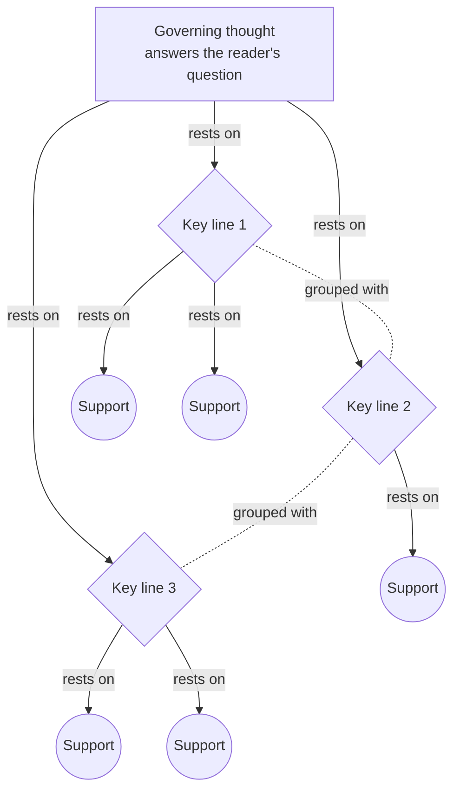

# Pyramid Principle

> Arranges a piece of reasoning as a pyramid - one governing thought on top, a mutually exclusive and collectively exhaustive set of key lines beneath it, data underneath those - so the reader gets the answer first and every level summarises the level below. Category: Narrative & Statement Decomposition. Reference: [Barbara Minto](https://en.wikipedia.org/wiki/Barbara_Minto). [Open the 3D graph](./index.html) (needs internet for Three.js; on GitHub open via Pages or clone).

## What it decomposes

Barbara Minto worked the structure out at McKinsey and published it as *The Pyramid Principle* in 1987. Its object is not an argument's validity but the order in which reasoning reaches a reader: a memo, a report, a spoken answer. The rules are few. Ideas at any level must summarise the ideas grouped beneath them, and ideas in a group must be the same kind of idea, logically ordered. The structure is a dialogue: the governing thought answers the question the reader came with and raises a new one in the reader's mind (Why? How? How do you know?), which the key line answers. Everything below the key line is data.

What it forces into the open is the sentence nobody wrote. People narrate in the order the information arrived, which is how the classic example below was written: three phone calls, a room booking, and a request at the end. Every fact the reader needs is there and the structure is absent, so the reader has to do the intersection, the eliminations and the arithmetic. The summarising rule breaks as often in speech. A speaker who says "there are two or three things that are underappreciated" has produced a grouping label, not a governing thought: it announces a set without saying what the set adds up to, and Minto's test - could a reader disagree with this sentence? - fails on it. When the apex is a label, nothing holds the pillars together except the speaker's ordinals.

That absence is why the governing thought is the idea-bearing slot here. In transcripts the pillars are often quotable and the data beneath them almost always is; the sentence saying what the pillars mean together has to be written, and writing it commits to a claim the speaker never made. Stating it also exposes what is missing: the key line can then be tested for exhaustiveness, and the pillar the speaker never filed under his own group turns up as the thing the set left out.

## The slots



| Slot | What goes here | Typical provenance | Why that provenance |
|---|---|---|---|
| Governing thought | The single sentence that answers the reader's question and summarises the key lines. | derived | Speakers deliver conclusions late, or put a label on the group instead of a summary; the synthesis normally has to be written. |
| Key line | Two to five pillars answering the question the apex raises; MECE, one kind of idea, deductive chain or inductive group. | either | Quoted when a speaker enumerates his own pillars; inferred when the pillars have to be read out of the data. |
| Support | Data, numbers, examples and quotations under the pillar they evidence. | fact | This is what a source actually contains; a support with no quote is an invented number. A support may itself be an inference when it summarises several stated facts. |

## Example 1: The rescheduling note

Minto's opening illustration, written out as a short scenario so that facts can quote it. Adapted from *The Pyramid Principle* (1987), the rescheduling-message case used in chapter 1 to contrast a narrated message with its pyramid.

### Source text

> A note is on your desk at twenty to ten on Tuesday morning, written in the order the calls came in. John Collins telephoned to say he cannot make the meeting at three o'clock today, because he is on a train to Manchester until six. Hal Johnson does not mind meeting later, or even tomorrow, but not before half past ten, since he has a board call every morning. Don Clifford's assistant rang to say Don cannot come before Thursday. The conference room is booked tomorrow for the auditors, but it is free on Thursday. Could we change the meeting to Thursday at eleven?

### Decomposition

Eleven nodes: seven facts, four inferences. Two of the eighteen edges are facts.

Governing thought

- `gt` **Move the meeting to Thursday at 11** [fact] The meeting should be moved to Thursday at eleven o'clock. In the note this is the last line; in a pyramid it is the first. "Could we change the meeting to Thursday at eleven?" (sentence 6, the last line of the note)

Key line

- `k1` **Thursday: first day all can meet** [derived 0.90] Thursday is the earliest day on which all three attendees are free: today is impossible for two of them and tomorrow is impossible for Don Clifford. Rationale: Intersecting the three stated constraints leaves Thursday as the first free day; the note reports the three calls but never states the intersection, which is the whole point of the message.
- `k2` **The room is free on Thursday** [fact] The conference room is booked tomorrow for the auditors, but it is free on Thursday. "The conference room is booked tomorrow for the auditors, but it is free on Thursday" (sentence 5)
- `k3` **Eleven is the earliest hour** [derived 0.80] Eleven o'clock is the earliest hour on Thursday that clears the attendees' own constraints, because Hal Johnson cannot start before half past ten. Rationale: The note gives an earliest-start constraint of half past ten and then proposes eleven; the step from the constraint to the hour is arithmetic the reader has to do.

Support

- `s1` **Collins: not at three** [fact] John Collins telephoned to say he cannot make the meeting at three o'clock today. "John Collins telephoned to say he cannot make the meeting at three o'clock today" (sentence 2)
- `s2` **Collins on a train until six** [fact] Collins is on a train to Manchester until six, which is why he cannot make the three o'clock. "because he is on a train to Manchester until six" (sentence 2)
- `s3` **Johnson: not before 10:30** [fact] Hal Johnson does not mind meeting later today or tomorrow, but not before half past ten. "Hal Johnson does not mind meeting later, or even tomorrow, but not before half past ten" (sentence 3)
- `s4` **Board call every morning** [fact] Johnson's earliest-start constraint has a reason: he has a board call every morning. "since he has a board call every morning" (sentence 3)
- `s5` **Clifford: not before Thursday** [fact] Don Clifford's assistant rang to say Don cannot come before Thursday. "Don Clifford's assistant rang to say Don cannot come before Thursday" (sentence 4)
- `d1` **Today is impossible** [derived 0.95] Today is impossible: Collins is on a train until six and Clifford cannot come before Thursday. Rationale: Two of the three stated constraints exclude today outright; the elimination is forced by the quoted facts but is never written down. Supported by `s2`, `s5`.
- `d2` **Tomorrow is impossible** [derived 0.90] Tomorrow is impossible: Clifford cannot come before Thursday, and the room is taken by the auditors. Rationale: Tomorrow is the option the note leaves open for Johnson; two stated facts close it, and the reader has to combine an attendee constraint with a room constraint to see it. Supported by `s5`, `k2`.

Edges. Two are facts, and both are local: a support and the reason the same sentence gives for it.

- `ce10` `s1` -> `s2` (rests on) [fact] "he cannot make the meeting at three o'clock today, because he is on a train to Manchester until six" (sentence 2)
- `ce11` `s3` -> `s4` (rests on) [fact] "but not before half past ten, since he has a board call every morning" (sentence 3)

Sixteen are derived. Nine carry the pyramid's own relation: `ce1` `gt` -> `k1` (0.90), rationale "The note never says why Thursday; the pillar that carries the request is supplied by the reader."; `ce2` `gt` -> `k2` (0.85), rationale "Both statements are in the note, but nothing in it attaches the room's availability to the proposal; the attachment is the reader's."; `ce3` `gt` -> `k3` (0.80); `ce4` `k1` -> `s1` (0.90); `ce5` `k1` -> `s3` (0.90); `ce6` `k1` -> `s5` (0.95, "Clifford's constraint is the binding one: it is what makes Thursday the earliest possible day."); `ce7` `k1` -> `d1` (0.90); `ce8` `k1` -> `d2` (0.90); `ce9` `k3` -> `s3` (0.85). Two are `grouped_with`: `ce12` `k1` - `k2` (0.80, "People and room are the two conditions a meeting has to satisfy; read as a set they are mutually exclusive and, with the hour, collectively exhaustive.") and `ce13` `k2` - `k3` (0.75, "Day and hour are separate questions; keeping them in one group is what makes the set exhaustive rather than merely plural."). Five are grounding links: `ce14`, `ce15` from `d1` to `s2`, `s5` (0.95); `ce16`, `ce17` from `d2` to `s5`, `k2` (0.90); `ce18` from `k3` to `s4` (0.80).

### What the LLM added and why it helps

Hide the derived layer and the graph is the note as it was left on the desk: seven statements and two connectives. `gt` survives, because the request really is written down, but it hangs above the facts attached to nothing, since every edge out of the apex is an inference - as are sixteen of the eighteen. Almost every fact is stated here and almost none of the structure is.

The reasoning is of three kinds. `d1` (0.95) and `d2` (0.90) are eliminations, forced by the quoted constraints and never written: supports that are themselves inferences, which the slot allows. `k1` (0.90) is the pillar those eliminations produce, the sentence answering "why Thursday" - the question the request raises and the note ignores - and `k3` (0.80) does the arithmetic from Johnson's half-past-ten floor to the proposed hour. `k2` is the only stated pillar, and even it becomes one through `ce2`: the note mentions the room, it never offers it as a reason.

The gain is a message that can be checked rather than re-derived: one line and three tests - are all three free that day, is the room free, is eleven late enough. Confidence tracks how forced each step is, from the eliminations at 0.95 to the group's exhaustiveness at 0.75 (`ce13`), the one judgment a careful reader could argue with.

## Example 2: from the TBPN transcripts: Elad Gil: the three underappreciated things about the AI wave

Episode "Sam Altman live on Sora, Hollywood, the future of ads (Bill Peebles, Dylan Patel, Elad Gil, Robby Stein, Morgan Housel, Misha Laskin)", 2025-10-10, [transcript](../../../tbpn-transcripts/transcripts/2025-10-10_sam-altman-live-on-sora-hollywood-the-future-of-ads-bill-peebles-dylan-patel-elad-gil-robby-stein-morgan-housel-misha-laskin.md); line numbers refer to it.

The passage fits because the speaker enumerates his own key lines with ordinals ("the first thing... a second thing... and then the third thing", L3116-L3128), so pillar membership is a quoted fact rather than an inference, and yet the apex is empty: the label on top is the intellectually blank "two or three things that are underappreciated", and his conclusion arrives after the pillars. It shows both of the framework's failure modes at once - a grouping that does not synthesise, an answer delivered bottom-up - while giving numbers under every pillar and, fifty lines later, the timing pillar the stated set omits.

### Facts (quoted)

Seventeen of the twenty-one nodes and eight of the thirty edges are facts, none of them paraphrases. Quotes keep the transcript's speech-to-text errors ("Zendaz" for Zendesk, "RV" for the legal vendor's name); `source_ref` is the speaker plus the line range.

Governing thought

- `gt_stated` **You're going to miss the size** [fact] The speaker's own summary line, delivered after the three pillars rather than before them: market size for these things is very underappreciated and people will miss how big the markets are. "And I think that's very underappreciated when you think about market size for some of these things. You're really going to miss the size of these markets and how big they are." (Elad Gil, L3140-L3142)
- `gt_group` **2-3 underappreciated things** [fact] The label the speaker actually puts on top of his group: there are two or three underappreciated things about this AI wave. It announces a set without saying what the set adds up to, and without settling how many members it has. "I think there's two or three things that are underappreciated about this AI wave" (Elad Gil, L3116-L3116)

Key line

- `k1` **Capability: one API call** [fact] The first pillar: the capability set has shifted dramatically, and not only in what the models can do - they can be reached with an API call, which puts the capability in everybody's hands. "I think that the first thing is that the capability set has shifted dramatically, not just in terms of what these models can do, but the fact that you can just ping them with an API and something's accessible to everybody." (Elad Gil, L3118-L3120)
- `k2` **Closed markets are open** [fact] The second pillar: markets that were closed to software are open. Legal never bought any software and was hard to sell into, and now a vendor can exist there. "I think a second thing is that the markets are oddly open. Like legal never bought any software." (Elad Gil, L3124-L3126)
- `k3` **TAMs: seats to labour** [fact] The third pillar: the addressable markets are shifting from seat-based pricing and seat-based value to labour, because the product replaces human work rather than equipping a worker. "And then the third thing is that a lot of this is about what you're saying, which is the tams of markets are shifting from seat-based pricing or seat-based value to labor. You're replacing human labor." (Elad Gil, L3128-L3132)

Support

- `s12` **Revenue already booked** [fact] Both things can be true at once, the speaker says: real revenue is being booked by these companies today. "And I think both things can be true simultaneously, which is we're seeing real revenue for these companies, right?" (Elad Gil, L3168-L3170)
- `s1` **Cursor: hundreds of $M** [fact] Cursor is rumoured to be at high hundreds of millions of revenue. "Cursor is rumored to be in the high hundreds of millions of revenue." (Elad Gil, L3172-L3172)
- `s2` **Azure: +$2-3B a quarter** [fact] Azure added something like two or three billion dollars of AI revenue per quarter, from a cold start two or three years ago. "Azure added something like two or three billion of the AI revenue per quarter from sort of a cold start two or three years ago" (Elad Gil, L3174-L3176)
- `s3` **Distribution everywhere** [fact] The distribution for these products already exists and is massive; it is everywhere in some sense. "But to your point, we have massive distribution. It's already everywhere in some sense, right?" (Elad Gil, L3210-L3212)
- `s4` **Legal bought no software** [fact] Legal was hard to sell software into and bought almost none, and because of AI a vendor can suddenly exist there. ('RV' in the transcript is a speech-to-text error for the vendor's name.) "It was really hard to sell into legal, but because of AI, suddenly RV can exist, right?" (Elad Gil, L3126-L3126)
- `s5` **Not seats, how much work** [fact] Customer support is the worked example: the question is not how many seats you can sell to customer-support reps, as with a seat-priced incumbent, but how much of their work you can do. "And so you're looking at, for example, customer support. It's not Zendaz, How many seats can you sell the customer support reps? It's how much can you augment and do work for customer support reps?" (Elad Gil, L3132-L3136)
- `s6` **Labour vs software market** [fact] The comparison stated flatly: it is the labour market versus the software market. "It's the labor market versus the software market." (Elad Gil, L3138-L3138)
- `s7` **$5T of services spend** [fact] The speaker's team sized the services economy where AI could intervene at about $5 trillion, a large share of GDP. "The services economy that we looked at on my team in terms of where AI could intervene is about $5 trillion. So it's a lot of GDP is accessible to this." (Elad Gil, L3144-L3146)
- `s11` **3%, 5% or 1% of revenue?** [fact] The host's framing immediately before the pyramid: a seat-based incumbent such as an HR platform could transition to value-based pricing on the value of running the function - three, five or one percent of revenue. "I could see them transitioning to kind of value-based pricing around what is it, what's the value of like running your HR department, right? Is it 3% of revenue? Is it 5% of revenue? Is it 1% of revenue?" (host, L3106-L3112)
- `s8` **Probably takes a decade** [fact] The flip side, in the speaker's own words: it will probably take a decade. "But the flip side of it is it'll probably take a decade, right?" (Elad Gil, L3186-L3186)
- `s9` **The impediment is not tech** [fact] The biggest impediment to adoption is not the technology, which could already do a great deal, but organisational process and workflow management. "And I think the biggest impediment to adoption isn't the technology. We could do so much stuff with the technology right now. It's organizational process. It's workflow management." (Elad Gil, L3190-L3196)
- `s10` **The internet took 15 years** [fact] The precedent the host brings in from a Ken Griffin talk: in 1999 and 2000 it was obvious the internet would change the world, and it still took fifteen years to have an impact. "ken griffin gave a talk earlier this week and he was saying that in 1999 and 2000 it was very obvious that the internet was going to change the world change the way that our economies run yet it still took 15 years for it to actually have an impact" (host, L3154-L3158)

Fact edges. Eight, each joining two fact nodes and quoting the words in which the speaker states the link himself. The first three are the ordinals, which is what makes pillar membership a fact in this example rather than an inference.

- `fe1` `gt_group` -> `k1` (rests on) [fact] "I think there's two or three things that are underappreciated about this AI wave. I think that the first thing is that the capability set has shifted dramatically" (Elad Gil, L3116-L3118)
- `fe2` `gt_group` -> `k2` (rests on) [fact] "I think a second thing is that the markets are oddly open" (Elad Gil, L3124-L3124)
- `fe3` `gt_group` -> `k3` (rests on) [fact] "And then the third thing is that a lot of this is about what you're saying" (Elad Gil, L3128-L3128)
- `fe4` `k2` -> `s4` (rests on) [fact] "Like legal never bought any software. It was really hard to sell into legal, but because of AI, suddenly RV can exist, right?" (Elad Gil, L3124-L3126)
- `fe5` `k3` -> `s5` (rests on) [fact] "You're replacing human labor. And so you're looking at, for example, customer support." (Elad Gil, L3130-L3132)
- `fe6` `s12` -> `s1` (rests on) [fact] "we're seeing real revenue for these companies, right? Cursor is rumored to be in the high hundreds of millions of revenue." (Elad Gil, L3170-L3172)
- `fe7` `s12` -> `s2` (rests on) [fact] "Cursor is rumored to be in the high hundreds of millions of revenue. You know, Azure added something like two or three billion of the AI revenue per quarter" (Elad Gil, L3172-L3174)
- `fe8` `s8` -> `s9` (rests on) [fact] "It's all the stuff that happens when a big enterprise uses anything. And they're like, you want me to change my tooling? You want me to change my people. You want me to, you know, my processes. And that's what's going to slow it down." (Elad Gil, L3198-L3206)

### Decomposition

Four derived nodes and twenty-two derived edges. Fact nodes are referenced by id above.

Governing thought (`gt_stated` and `gt_group` are the stated ones)

- `gt` **AI markets sized as software** [derived 0.75] The one-sentence answer the passage never states: the AI wave is being under-sized because three things moved at once - the capability became a call away, buyers who never bought software opened up, and the budget in play is labour rather than seats - so a market measured with software instincts will be measured wrong. Rationale: Each of the three stated pillars is about a different half of the same mis-measurement: supply (capability is now callable), demand (closed markets opened), and the unit of value (labour, not seats). The speaker states the consequence late ('you're really going to miss the size of these markets') but never the sentence that summarises the group, which is what the Pyramid Principle requires at the apex. Supported by `gt_stated`, `gt_group`, `s7`. Carries an `idea` field, quoted under "Where the opportunity shows up".

Key line (`k1`, `k2` and `k3` are the stated ones)

- `k4` **Org process sets the rate** [derived 0.70] A fourth pillar the speaker never files under his group: whatever the size, it is reached only at the speed enterprises change process, so the market is large and slow rather than large and imminent. Rationale: Fifty lines later, answering a different question, the speaker says the value will take about a decade and that the impediment is organisational process rather than technology. Under this governing thought those statements are a pillar, not an aside: without it the stated set of three answers 'how big' and leaves 'how fast' unanswered, which is where the group stops being collectively exhaustive. Rests directly on the facts `s8`, `s9` and `s10`, so it needs no separate grounding link. Carries an `idea` field, quoted under "Where the opportunity shows up".

Support

- `d1` **No software line item** [derived 0.75] The screen the legal example implies but the speaker does not state: the open markets are the professions with almost no software line item and a large payroll line, because there is no incumbent to displace and the budget being competed for is wages. Rationale: The speaker offers legal as an instance ('legal never bought any software') and draws no rule from it. The rule is the only thing that makes the pillar usable by anyone else: it turns one anecdote into a test that can be run across professions. Supported by `s4`.
- `d2` **A share of function cost** [derived 0.70] What the seat-to-labour shift implies for the price tag, once the host's framing and the speaker's are put together: the unit of pricing becomes a share of what the function costs to run, not a per-user fee. Rationale: The host proposes value-based pricing at some percent of revenue for running a function; the speaker, answering, moves the whole TAM from seats to labour. Neither states the mechanism that joins them, and it is the operative one for anyone building here: the invoice has to be denominated in the function's cost. Supported by `s11`, `s6`.

Derived edges. Thirteen carry `rests_on`, three carry `grouped_with`, six are grounding links.

- `de1` `gt` -> `k1` (0.75), rationale "The synthesis rests on the supply half of the argument: capability that can be reached with an API call."
- `de2` `gt` -> `k2` (0.75), rationale "The synthesis rests on the demand half: buyers who never bought software are now reachable."
- `de3` `gt` -> `k3` (0.80), rationale "The synthesis rests on the change in the unit of value, which is the pillar that actually moves the market size."
- `de4` `gt` -> `k4` (0.60), rationale "An answer-first sentence that claims size has to carry the timing pillar too, or it overstates what the speaker himself concedes later."
- `de8` `k1` -> `s12` (0.60), rationale "The revenue evidence arrives thirty lines later in answer to a different question; attaching it to the capability pillar is the analyst's placement, made because it is what shows the newly callable capability is being bought."
- `de9` `k1` -> `s3` (0.80), rationale "'Accessible to everybody' and 'we have massive distribution' are the same claim stated twice in the passage, minutes apart."
- `de10` `k2` -> `d1` (0.75), rationale "A pillar needs a support that generalises, not only an instance; the rule stands between the legal anecdote and the pillar."
- `de12` `k3` -> `s6` (0.85), rationale "The one-line contrast is the compressed form of the pillar and follows it directly."
- `de13` `k3` -> `s7` (0.80), rationale "The $5 trillion figure is the size of the labour budget the pillar claims is in play; the speaker gives it two lines later without naming the link."
- `de14` `k3` -> `d2` (0.70), rationale "The pricing mechanism is what the pillar means in practice, and it joins the host's framing to the speaker's."
- `de17` `k4` -> `s8` (0.90), rationale "The decade estimate is the timing claim the pillar summarises."
- `de18` `k4` -> `s9` (0.90), rationale "The organisational-process impediment is the reason behind the timing claim."
- `de19` `k4` -> `s10` (0.70), rationale "The precedent comes from the host quoting Ken Griffin rather than from the speaker, so the link crosses speakers; it is the backing for the decade rather than evidence for it."
- `de20` `k1` - `k2` (grouped with, 0.80), rationale "Supply and demand are different kinds of reason but the same kind of idea - a condition of the wave that is underappreciated - so they belong in one inductive group."
- `de21` `k2` - `k3` (grouped with, 0.80), rationale "Read as supply, demand and unit of value, the three stated pillars are mutually exclusive; the speaker's own uncertainty about whether there are two or three of them shows the set was never tested."
- `de22` `k3` - `k4` (grouped with, 0.55), rationale "The fourth pillar is the contested member: it is the same kind of idea about the same wave, but it answers how fast rather than how big, so a stricter reading would split the group in two."

Grounding links, every one a derived `supported_by` edge: `de5`, `de6`, `de7` from `gt` to `gt_stated` (0.85), `gt_group` (0.70) and `s7` (0.70); `de11` from `d1` to `s4` (0.80); `de15`, `de16` from `d2` to `s11` (0.70) and `s6` (0.75).

### What the LLM added

The apex, first. `gt` (0.75) is the sentence the passage never contains, and the two fact nodes beside it show what was said instead: `gt_group` is the label put on top of the group, `gt_stated` the conclusion delivered after it. The grounding edges record the difference in kind, `de5` to the stated conclusion at 0.85 and `de6` to the label at 0.70, because a conclusion at least asserts something while a label only counts. Splitting the slot keeps the fact layer honest: hide the derived nodes and the graph still reports a set announced but never summarised, and a size claim that came last.

Then the missing pillar. `k4` (0.70) collects the decade estimate, the organisational-process impediment and the internet precedent into the pillar the stated group leaves out, and the edges around it carry the strain: `de4` is the weakest of the apex's four supports at 0.60, and `de22` at 0.55 says outright that a stricter reading would split the group, because "how fast" is not the same question as "how big". That is the exhaustiveness test doing its work on a set whose author's own count was "two or three".

The derived supports do smaller jobs: `d1` (0.75) turns one anecdote into a screen anyone can run, `d2` (0.70) joins the host's percentage-of-revenue framing to the speaker's seat-to-labour pillar. Two derived `rests_on` edges are placements rather than readings - `de8` (0.60) files revenue evidence given thirty lines later under the capability pillar, `de19` (0.70) crosses to the host's Ken Griffin precedent - and neither could be a fact edge, which needs one turn stating the connection.

The provenance profile is the classic's inverted: seven facts there carried four inferences over sixteen inferred edges, while here seventeen facts carry four inferences and eight of thirty edges are quoted, three of them the ordinals. Hide the derived layer and a real three-pillar pyramid remains, with a blank label on top. How much of a pyramid can be extracted depends almost entirely on whether the speaker was already using one.

### Where the opportunity shows up

The idea-bearing slot is the governing thought (`idea_bearing_slot: "governing_thought"`): when a speaker leaves the apex empty, the sentence that would fill it is the market claim nobody has committed to. Two nodes carry an `idea` field.

- `gt` **AI markets sized as software**, derived, confidence 0.75, in the governing thought. Idea: "Price and size AI products against the labour budget they displace rather than the software budget they sit in, and the missing infrastructure - outcome metering, attribution and billing for work performed rather than seats occupied - becomes a market of its own." Read from the node: if the unit of value moves from seats to work performed, every commercial system built for seats - pricing, metering, attribution, invoicing, quota - is aimed at the wrong denominator, and the speaker's own $5 trillion figure (`s7`) is the size of the budget that would be metered.
- `k4` **Org process sets the rate**, derived, confidence 0.70, in the key line. Idea: "If the binding constraint on a $5T reallocation is process change rather than model quality, the scarce good is the deployment layer - workflow re-mapping, change management and integration sold as a product - and it is being priced today as consulting rather than as software." Read from the node: the speaker names the impediment himself (`s9`, "It's organizational process. It's workflow management.") and puts a decade on it (`s8`), which makes the constraint an addressable market rather than a caveat.

Both sit in the 0.70 to 0.85 band, a standard reading rather than a forced one, and they are read from different heights: the apex idea is how the market is measured, the pillar idea what gates it. `d2` (0.70) carries no `idea` field but points at the same opening from the support layer - if the invoice is denominated in the function's cost, someone has to compute that cost - and `d1` (0.75) is the screen for finding the next legal.

## Building a knowledge graph with this framework

### Node and edge types

Three node types, one per slot: `governing_thought`, `key_line`, `support`. Two relations plus the reserved grounding link: `rests_on` (a higher node to each node beneath it, which together must summarise to it), `grouped_with` (siblings forming one MECE set, drawn between adjacent members rather than as a clique), `supported_by` (derived node to fact node, always derived).

Two structural points the examples make. First, `support` is a level, not a leaf: supports nest, so `s12` rests on `s1` and `s2`. Depth below the key line is data hierarchy, not extra pillars. Second, the `governing_thought` slot can hold more than one node. SPEC section 3 splits a slot that is partly stated and partly inferred, and the apex is where that happens constantly: the derived synthesis (`gt`), the stated conclusion (`gt_stated`) and the grouping label (`gt_group`) are three different objects, joined by `supported_by` from the synthesis to each stated part. Keeping them apart is what lets the fact-only view show a set announced and never summarised.

Facts carry `source_quote` and `source_ref`; derived nodes carry `confidence` and `rationale`; `entities` use the spellings in `tbpn-transcripts/extractions/`. An edge is a fact only when both endpoints are fact nodes and one turn states the connection in quotable words, which is why `fe1` to `fe3` are facts (the ordinals state membership) and `de13` is not (the number is given two lines after the pillar with no connective).

### Fact or derived: rules of thumb

The governing rule of thumb comes from comparing the two examples: **provenance depends on whether the speaker already used the pyramid.** An enumerating speaker hands you the key line and the membership edges as quotes; a narrating speaker hands you nothing but supports. Per slot:

- Governing thought. Extracted only when a speaker states a sentence that genuinely summarises his own group; usually he states a conclusion in the wrong place (`gt_stated`, after the pillars) or a label announcing the group (`gt_group`). Capture both as fact nodes: the gap between them and the synthesis is the finding. Inferred otherwise, and worth inferring because the apex is the claim the framework exists to extract, the sentence a reader can agree or disagree with, and the idea-bearing slot. Confidence should not exceed the weakest pillar the sentence needs. Empty with no pillars either: no pyramid, only data; skip the passage.
- Key line. Extracted when the speaker enumerates ("the first thing", "a second thing"), gives a list, or answers a "why" with parallel reasons; the ordinals make the `rests_on` edges facts too. Inferred when the passage is a narration and the pillars have to be built by grouping supports into the two to five answers the apex requires (`k1` and `k3` in the classic). Also inferred when a pillar sits in the source but outside the speaker's own group: worth doing, because a set whose missing member is fifty lines away is the commonest defect in spoken reasoning, and naming it makes the set testable (`k4`, 0.70). Empty: with supports but no pillars, derive them; a single key line is a chain, not a group, and stays one pillar rather than being padded to three.
- Support. Extracted, always: numbers, examples, comparisons and quotations are what the source actually contains, and a support without a quote is an invented fact. Inferred only when it summarises several stated facts (eliminations in the classic; a generalisation and a mechanism in the TBPN example), which is worth doing when the pillar needs a rule rather than an instance, or when the step from data to pillar is arithmetic the reader would otherwise redo. Empty under a pillar: lower the pillar's confidence rather than import data the speaker did not give; a pillar with no support is what the diagram should show.
- Edges. `rests_on` is a fact only with a quoted ordinal, "because", "which is why", or a similar connective in one turn. `grouped_with` is essentially always derived: MECE-ness is the analyst's judgment even when the speaker numbered his points, and its confidence is the honest place to record a strained group (0.55 for a pillar that answers a different question).

### Extraction recipe

```text
Decompose ONE passage from <file>, lines <a>-<b>, with the Pyramid Principle.
0. First decide: does the speaker already use a pyramid? Search the span for
   ordinals ("the first thing", "second", "and then the third"), for "there are
   N things", and for a conclusion sentence. Record what you find; it decides
   how much of the structure can be quoted.
1. Support: every number, example, comparison and named datum in the span, each
   as a verbatim span of 5+ words (fact). No span, no node. Nest a support under
   another support when the second is the evidence for the first.
2. Key line: the 2-5 answers to the question the passage's conclusion raises
   (Why? How? How do you know?). Quote the pillar when the speaker states it
   (fact); otherwise write it from the supports it summarises (derived), and say
   in the rationale which supports forced it.
3. Test the set: same kind of idea, mutually exclusive, collectively exhaustive.
   If a pillar-shaped statement sits outside the speaker's own group elsewhere in
   the source, add it as a derived key line and lower the `grouped_with`
   confidence to record the strain. Do not pad the set to three.
4. Governing thought: write the one sentence that summarises the key lines and
   answers the reader's question (derived). Separately capture, as fact nodes in
   the same slot, any conclusion the speaker stated (even if late) and any label
   he put on the group. Link the synthesis to each with `supported_by`.
   Put the business reading in the derived apex's `idea` field, not in its
   rationale.
5. Edges: `rests_on` from each node to the nodes beneath it, `grouped_with`
   between adjacent siblings. An edge is fact only if both endpoints are facts
   AND one turn states the link, quoted verbatim; everything else is derived
   with a confidence. `supported_by` from every derived node to its facts.
Output one graph.json example: nodes [{id, slot, label <=40 chars, text,
provenance, source_quote+source_ref | confidence+rationale, idea?, entities}],
edges [{id, from, to, relation, provenance, confidence?, source_quote?,
source_ref?, rationale?}], idea_bearing_slot "governing_thought".
```

Afterwards: `node _meta/validate.mjs <dir>` (quotes present in the source, paraphrase cap, derived nodes connected to facts, labels within 40 characters), then four checks it cannot do. Read the apex alone: does it say something a reader could dispute, and does every clause trace down a `rests_on` edge to a pillar? Read the key line alone: does it answer the question the apex raises, does any pillar merely restate the apex, and would the reader need a pillar that is not there? Check that every fact `rests_on` edge quotes a connective rather than two adjacent sentences. Check that each `supported_by` from the synthesis points at something the speaker actually said, so the fact-only view is a true report of the record.

### Failure modes

- **A label accepted as the governing thought.** "Two or three things that are underappreciated". Guard: the apex needs a subject and a predicate a reader could disagree with; if deleting the pillars leaves the sentence contentless, it is a grouping label. Keep it as a fact node and derive the synthesis beside it.
- **An apex that smuggles in a claim no pillar carries**, typically a timing or a magnitude. Guard: every clause of the apex must reach a pillar through `rests_on`; if one cannot, either derive the pillar it needs and accept the low edge confidence (`de4`, 0.60) or delete the clause.
- **Padding to three.** LLMs like triples and will invent a pillar to complete the shape. Guard: pillar count follows the data, and two is a legitimate answer. A speaker's own "two or three" belongs in a rationale rather than being silently resolved.
- **Pillars that are not the same kind of idea**, a how-big pillar beside a how-fast one. Guard: `grouped_with` confidence records the strain (0.55 here) and the rationale names the two different questions being answered.
- **A pillar that restates the apex.** Guard: each pillar answers the apex's question differently; two pillars sharing all their supports are one pillar.
- **Supports filed under the pillar they best illustrate rather than where they were said.** Guard: placement across a conversation is an inference - a derived `rests_on` whose rationale names it as the analyst's placement (`de8`, 0.60), never a fact edge.
- **Ordinals treated as free fact edges.** Guard: the edge's `source_quote` must contain both the group and the ordinal, and the validator checks it against the file.
- **Cleaned-up quotes.** Transcripts carry speech-to-text errors ("Zendaz", "RV") that an LLM will silently correct, breaking the verbatim check. Guard: quote exactly and explain the error in the node's `text`.
- **Confidence inflation at the apex.** Guard: cap the apex at the weakest pillar edge it genuinely needs, and treat a pillar imported from elsewhere in the source as a discount, not a bonus.
- **The business reading written into the rationale.** Guard: the rationale says only why the inference follows from the quoted facts; the opportunity goes in the node's `idea` field, normally in the idea-bearing slot.

## Related frameworks

- [Minto SCQA](../minto-scqa/README.md): the same author's introduction structure, which sets up the question the apex answers; SCQA when the problem framing is missing, the pyramid when the answer's structure is.
- [MECE Principle](../../02-strategic-and-business/mece/README.md): the test the key line has to pass; MECE alone to partition a space, the pyramid when the partition must hold up a conclusion.
- [Toulmin Model](../toulmin-model/README.md): asks whether the pillars actually carry the apex by making the warrant explicit; the pyramid arranges an argument for a reader, Toulmin audits its validity.
- [Issue & Hypothesis Trees](../../02-strategic-and-business/issue-hypothesis-trees/README.md): the same tree shape used before the answer exists, branches to be tested rather than pillars to be presented.

[Library root](../../README.md).
