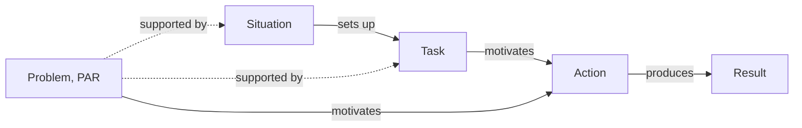

# STAR / PAR

> Takes a completed event apart into the Situation the actor faced, the Task they owned, the Actions they took and the Result those actions produced, so that agency and causal attribution have to be stated rather than implied. Category: Narrative & Statement Decomposition. Reference: [Situation, task, action, result](https://en.wikipedia.org/wiki/Situation,_task,_action,_result). [Open the 3D graph](./index.html) (needs internet for Three.js; on GitHub open via Pages or clone).

## What it decomposes

STAR takes apart a completed event with an actor: an interview answer, a resume bullet, a post-mortem, a founder telling how a deal got done. It forces four things to be stated separately: the state of the world before the actor moved (Situation), the objective the actor owned (Task), what the actor personally did, in order (Action), and what changed afterwards and which action gets the credit (Result). PAR, the resume form, folds Situation and Task into one Problem.

Without it, "we" blurs who acted, the task goes unstated so the actions cannot be judged against an objective, and results listed after actions invite the listener to infer a cause the speaker never claimed. That last defect is the one a graph must not hide: the `produces` edge from action to result is what narrators leave to implication, and the framework makes the graph say whether that edge is stated or inferred.

## The slots



| Slot | What goes here | Typical provenance | Why that provenance |
|---|---|---|---|
| Situation | Who, where, what had just happened, what was at stake. | fact | Narrators open with it and give figures; only computed stakes (ratios, gaps) are derived. |
| Task | The objective the actor owned: what, by when, why. | either | Stated only as "I was asked to" or "my priority was"; otherwise inferred from situation plus actions. |
| Action | What the actor did, as first-person steps in order. | fact | The narrator's own steps are on record; only the agency behind a "we" needs inference. |
| Result | What happened afterwards, measured, and which action gets the credit. | fact | The outcome is stated; the attribution usually is not, so `produces` edges are often derived. |
| Problem (PAR) | Situation and Task collapsed into one statement. | either | The analyst's compression of stated facts, hence derived, unless the speaker states the problem in one line. |

Relations: `sets_up` (situation to task), `motivates` (task or problem to action), `produces` (action to result), `causes` (any pair), and the implicit `supported_by` from a derived node to its facts.

## Example 1: Clearing a support backlog before renewals (interview answer)

### Source text

> In my second year as support team lead at a mid-sized software company, we shipped a billing update in March that double-charged about four hundred customers. Within two days, complaints about the charge had pushed the ticket queue from a normal sixty open tickets to over nine hundred, and our average first response time went from four hours to three days. Two of my six agents were on leave that month. I was asked to get the queue back under control before the quarterly renewals in April. First, I wrote a one-page macro that explained the bug and the refund timeline, and I had it sent proactively to all four hundred affected accounts before they wrote in; new tickets fell by half the next day. Second, I split the queue so that the two most experienced agents took only refund cases and the rest handled everything else. Third, I asked finance to process the refunds in one batch instead of case by case. By the end of the third week the queue was back under eighty tickets and the first response time was under five hours. Our renewal rate in April was 94 percent, one point higher than the previous quarter. Afterwards we made the proactive notice a standard step for any billing incident.

Written for this library as a behavioural-interview answer; company and figures are invented.

### Decomposition

**Situation**

- `s1` [fact] **Billing update double-charged ~400**: A billing update shipped in March double-charged about four hundred customers. "we shipped a billing update in March that double-charged about four hundred customers" (sentence 1)
- `s2` [fact] **Queue: 60 to over 900 in two days**: Within two days, complaints about the charge pushed the open-ticket queue from a normal sixty to over nine hundred. "complaints about the charge had pushed the ticket queue from a normal sixty open tickets to over nine hundred" (sentence 2)
- `s3` [fact] **First response: 4 hours to 3 days**: Average first response time went from four hours to three days. "our average first response time went from four hours to three days" (sentence 2)
- `s4` [fact] **Two of six agents on leave**: Two of the six support agents were on leave that month. "Two of my six agents were on leave that month" (sentence 3)
- `s5` [derived 0.90] **Demand 15x, capacity two-thirds**: Ticket volume rose roughly fifteen-fold while the team ran at two-thirds of its normal capacity. Rationale: Arithmetic on stated figures (900 against 60 tickets, four of six agents); the speaker never states the ratio, but it is what makes the situation critical rather than merely busy.

**Task**

- `t1` [fact] **Control the queue before renewals**: The lead was asked to get the queue back under control before the quarterly renewals in April. "I was asked to get the queue back under control before the quarterly renewals in April" (sentence 4)
- `t2` [derived 0.80] **Real objective: protect renewals**: The underlying objective was to protect April renewal revenue from the affected customers, not merely to shrink the queue. Rationale: The deadline is tied to renewals and the speaker reports the renewal rate as a result; the text never states retention as the goal, only the queue.

**Problem (PAR)**

- `p1` [derived 0.80] **Incident, short staff, renewals**: PAR compression: a self-inflicted billing incident flooded a short-staffed support team a few weeks before quarterly renewals. Rationale: PAR collapses Situation and Task into one problem statement; choosing which facts constitute the problem (the incident, the staffing gap, the renewal deadline) is the analyst's framing, not the speaker's words. 0.80 is the 0.70-0.85 band of the shared confidence scale and means: not that this compression is the only possible one, but that most careful readers given these sentences would draw the problem boundary here.

**Action**

- `a1` [fact] **Macro sent proactively to 400 accounts**: Wrote a one-page macro explaining the bug and the refund timeline and had it sent proactively to all four hundred affected accounts before they wrote in. "I wrote a one-page macro that explained the bug and the refund timeline, and I had it sent proactively to all four hundred affected accounts before they wrote in" (sentence 5)
- `a2` [fact] **Split queue: experts take refunds**: Split the queue so that the two most experienced agents took only refund cases and the rest handled everything else. "I split the queue so that the two most experienced agents took only refund cases and the rest handled everything else" (sentence 6)
- `a3` [fact] **Asked finance to batch refunds**: Asked finance to process the refunds in one batch instead of case by case. "I asked finance to process the refunds in one batch instead of case by case" (sentence 7)

**Result**

- `r0` [fact] **New tickets halved next day**: New tickets fell by half the day after the proactive notice went out. "new tickets fell by half the next day" (sentence 5)
- `r1` [fact] **Queue under 80 by week three**: By the end of the third week the queue was back under eighty tickets. "By the end of the third week the queue was back under eighty tickets" (sentence 8)
- `r2` [fact] **First response under five hours**: By the end of the third week the first response time was under five hours. "the first response time was under five hours" (sentence 8)
- `r3` [fact] **April renewals 94%, up one point**: The renewal rate in April was 94 percent, one point higher than the previous quarter. "Our renewal rate in April was 94 percent, one point higher than the previous quarter" (sentence 9)
- `r4` [fact] **Proactive notice made standard**: The proactive notice became a standard step for any billing incident. "we made the proactive notice a standard step for any billing incident" (sentence 10)
- `r5` [derived 0.40] **Uplift attributable to response?**: The part of the April renewal uplift that the incident response produced, if any; the attribution is the speaker's implication, not a stated measurement. Rationale: The speaker places the renewal figure after the actions, inviting the listener to credit them, but gives no base rate or comparison; a one-point move could be normal quarter-to-quarter noise. Kept below 0.50 because STAR requires every Result to be attributed to an Action, so the slot has to be filled even where the answer leaves the attribution speculative.

Fact edges. An edge is a fact only when both endpoints are facts and the speaker states the connection in one span, quoted here with the sentence it comes from:

- `c1` `s1` causes `s2`: "complaints about the charge had pushed the ticket queue" (sentence 2)
- `c2` `s2` sets up `t1`: "I was asked to get the queue back under control" (sentence 4)
- `c3` `t1` motivates `a1`: "First, I wrote a one-page macro" (sentence 5)
- `c4` `t1` motivates `a2`: "Second, I split the queue" (sentence 6)
- `c5` `t1` motivates `a3`: "Third, I asked finance to process the refunds" (sentence 7)
- `c6` `a1` produces `r0`: "before they wrote in; new tickets fell by half the next day" (sentence 5)
- `c7` `a1` produces `r4`: "Afterwards we made the proactive notice a standard step" (sentence 10)

### What the LLM added and why it helps

Derived nodes: the capacity arithmetic `s5` (0.90), the real objective `t2` (0.80), the PAR compression `p1` (0.80) and the doubtful renewal attribution `r5` (0.40). Derived edges: s3 sets up t1 (0.70), s5 sets up t1 (0.60), s4 causes a2 (0.50), t2 motivates a1 (0.65), p1 motivates a1 (0.70), r0 causes r1 (0.75), a2 produces r2 (0.60), a3 produces r1 (0.50), a1 produces r5 (0.40, kept below the 0.50 floor because the framework requires the Result attributed to an Action, as its rationale says); eight `supported_by` edges ground the derived nodes.

The gain is explicit attribution. The speaker links only the macro to a result (inbound halved, practice made standard); the week-three queue, the response time and the renewal rate have no stated cause. The graph proposes one candidate cause per result with a confidence, and the 0.40 on `r5` marks where an interviewer should ask a follow-up rather than accept the implication.

## Example 2: from the TBPN transcripts: Windsurf's wild weekend: selling the company Google left behind

Episode "Windsurf's Wild Weekend, SpaceX Invests $2B into xAI, Zuck's AI Data Supercluster (Jeff Huber, Scott Wu, Jeff Wang, Carl Pei, Garrett McCurrach)", 2025-07-14, [transcript](../../../tbpn-transcripts/transcripts/2025-07-14_windsurfs-wild-weekend-spacex-invests-2b-into-xai-zucks-ai-data-supercluster-jeff-huber-scott-wu-jeff-wang-carl-pei-garrett-mccurrach.md); line numbers refer to it. A completed 72-hour event narrated three days later by the two people who did it: Windsurf's interim CEO Jeff Wang and Cognition's CEO Scott Wu, interviewed live (L5340-L5700), with the announcement and the hosts' framing read earlier in the show (L78-L360).

Why it fits: the Situation is on the record (founders and engineers hired by Google DeepMind, a commercial team left behind and being poached, hundreds of angry employees), Wang states his Task in so many words, the Actions are timed (24 hours of calls, a next-day meeting with a paper agreement, signing two hours before the announcement) and the Results are read from the announcement and confirmed on air. Seven connections are stated by a speaker and the rest are not, which is the distinction STAR exists to force.

### Facts (quoted)

Twenty of the twenty-three nodes are facts, none paraphrased. The transcript is not diarised, so the speaker is read from the surrounding turns; quotes keep its errors and interruptions ("Devon" for Devin, "waves" for waived, and the host's interjected "what" inside the announcement).

**Situation**

- `s1` [fact] **Founders, engineers hired by DeepMind**: Google DeepMind hired Windsurf's founders Varun Mohan and Douglas Chen and part of its engineering team, in a deal that left the rest of the company behind. "very excited to welcome Windsurf AI founders, Mohan and Douglas Chen, and some of the brilliant Windsurf engineering team to Google DeepMind" (host reading Demis Hassabis's post, L78-L84)
- `s2` [fact] **Left behind: sales, enterprise, GTM**: What remained at Windsurf after the founders left was the commercial organisation: sales, enterprise, account management and go-to-market. "the people that got left behind at Windsurf were sales, enterprise, account management, GTM" (host, L348-L350)
- `s3` [fact] **Hundreds of angry employees**: Jeff Wang was now running a company of hundreds of employees who were angry about what had just happened. "you now run a company with hundreds of employees that are angry about what just happened" (host to Jeff Wang, L2158-L2160)
- `s4` [fact] **A tough Friday; nobody wanted his shoes**: Wang calls the Friday of the founders' departure a tough one; nobody would have wanted to be in his position. "It was a tough it was a tough Friday, I'll say. I don't think anybody would want to be in my shoes on Friday." (Jeff Wang, L5398-L5400)
- `s5` [fact] **'Just a shell' vs code, product, team**: Outsiders said what was left was just a shell; Cognition looked and saw the code, the product, the customers and, most importantly, the whole team. "people were saying, well, the thing that's left is just a shell. And we looked at it and we said, well, actually, I don't know if that's right. There's the code, there's the product, there's the customers, and most importantly, there's the whole team" (Scott Wu, L5428-L5434)
- `s6` [fact] **Cognition over-focused on engineers**: Scott Wu says Cognition tends to over-focus on software engineers because that is who they are and how they think. "we tend to over-focus on software engineers because it's just who we are and how we think about it" (Scott Wu, L5498-L5502)
- `s7` [fact] **Windsurf had built out all functions**: Windsurf's team had built out sales, deployed engineering, enterprise work, infrastructure, marketing, operations and finance. "the whole team have built out a really great kind of suite of all the different kinds different functions, right? Sales, deployed engineering, enterprise work, infrastructure, marketing, operations, and so on, finance, et cetera." (Scott Wu, L5510-L5518)
- `s8` [fact] **Teams circling the GTM team**: Over the weekend other companies were circling, wanting to hire away Windsurf's go-to-market team. "over the weekend, I'd heard other teams that were kind of circling, wanting to hoover up their GTM team" (host, L352-L356)

**Task**

- `t1` [fact] **Priority: many options, paths forward**: Wang's immediate priority was to get many options on the table and have many paths forward, and to give the team a path immediately because it was happening now. "My immediate priority was just to get a lot of options on the table and to have a lot of paths forward. I had to tell the team like, this is the path forward immediately because this is happening now." (Jeff Wang, L5546-L5554)

**Action**

- `a1` [fact] **Talked to many AI companies**: Windsurf talked to a lot of teams, among them many AI and foundation-model companies. Wang says 'we talked', without saying who made which call. "we talked to a lot of teams out there. There's a lot of AI companies, foundational companies." (Jeff Wang, L5402-L5404)
- `a2` [fact] **24 hours on the phone after all-hands**: After the all-hands, Wang was on the phone for roughly 24 hours nonstop. "I was on the phone for pretty much 24 hours, nonstop on my phone after the all hands" (Jeff Wang, L5562-L5564)
- `a3` [fact] **Met Scott next day; paper agreement**: Wang and Wu worked fast: they met at Windsurf's office the next day and Wu brought the agreement on paper to sign. "me and Scott, we worked really fast. We met at our office the next day. He even brought in everything on a piece of paper to sign." (Jeff Wang, L5566-L5570)
- `a4` [fact] **Signed 1-2 hours before announcing**: The documents were signed one or two hours before the announcement went out. The speaker says 'we got things signed', without naming the signatories. "we got things signed like one or two hours before we were able to put out the announcement" (Scott Wu, L5588-L5590)
- `a5` [fact] **Chose Cognition: 'done in my mind'**: After talking to Scott Wu and the Cognition team the decision was made; Wang adds that Cognition was the only other team they thought was smarter than their own. "after talking to Scott and the Cognition team, it was done in my mind. There's a done deal. I don't know if you guys know this, but Cognition was probably the only other team that we thought was smarter than our team, actually." (Jeff Wang, L5406-L5412)
- `a6` [fact] **Made the deal deliberately generous**: Wang, Wu and the team went out of their way to make the acquisition very generous to employees. "So me and Scott and the team, we really went out of our way to make this a very generous acquisition" (Jeff Wang, L5664-L5666)

**Result**

- `r1` [fact] **Acquired by Cognition**: Windsurf is being acquired by Cognition in what Wang calls a real acquisition. "this is a this is a real acquisition. Okay, we are being acquired by cognition" (Jeff Wang, L5392-L5394)
- `r2` [fact] **100% participate; cliffs waived**: All Windsurf employees participate financially, vesting cliffs are waived and, per the same announcement, vesting is fully accelerated. "100% of windsurf employees will participate financially they will also have all their vesting cliffs waves what and will receive fully accelerated vesting for their work today" (host reading Cognition's announcement, L278-L282)
- `r3` [fact] **Standing ovation; sentiment shifted**: At the Monday all-hands the team cheered with something like a standing ovation; the sentiment has shifted and the team is more fired up. "They kind of cheered for like a standing ovation or something. So I think the sentiment has shifted. The team is even more fired up to go." (Jeff Wang, L5676-L5680)
- `r4` [fact] **Product and GTM intact, plus Devin**: The whole product and the GTM team are still there, and the team now also has Devin to sell. "The whole product is still there. All the things we had and the GTM team is still there. And now they also have Devon to sell as well." (Jeff Wang, L5682-L5686)
- `r5` [fact] **Deal done in a couple of days**: The deal was done in just a couple of days. "the fact that they were able to get this deal done in just a couple of days is fantastic" (host, L358-L360)

Fact edges. Both endpoints are facts and one speaker's turn states the connection, quoted here:

- `e1` `s1` sets up `t1`: "this is the path forward immediately because this is happening now" (Jeff Wang, L5552-L5554)
- `e3` `t1` motivates `a1`: "My immediate priority was just to get a lot of options on the table" (Jeff Wang, L5546-L5548)
- `e4` `t1` motivates `a2`: "What is the best use of my time? I can tell you I was on the phone for pretty much 24 hours" (Jeff Wang, L5560-L5562)
- `e5` `a1` causes `a5`: "after talking to Scott and the Cognition team, it was done in my mind. There's a done deal." (Jeff Wang, L5406-L5408)
- `e6` `a4` produces `r1`: "we got things signed like one or two hours before we were able to put out the announcement" (Scott Wu, L5588-L5590)
- `e7` `a6` produces `r2`: "So me and Scott and the team, we really went out of our way to make this a very generous acquisition" (Jeff Wang, L5664-L5666)
- `e10` `r1` causes `r4`: "All the things we had and the GTM team is still there. And now they also have Devon to sell as well" (Jeff Wang, L5684-L5686)

### Decomposition

Three derived nodes, referencing the facts above by id.

**Task**

- `t2` [derived 0.75] **Keep team, customers from scattering**: The objective behind the options was to find a home for the whole company before the sales and go-to-market staff accepted the offers circling them. Rationale: Follows from the stated facts that other teams were trying to hire away the GTM team and that hundreds of employees were angry; Wang states his priority as options and paths, never as retention. Supported by `s8`, `s3`, `s2` for its text and by `s6`, `s7`, `r2` for the idea it carries (see "Where the opportunity shows up").

**Problem (PAR)**

- `p1` [derived 0.80] **No founders, poachers, no time**: PAR framing: a funded company with product, customers and a commercial team but no founders, an angry staff and competitors poaching, with days rather than weeks to find an answer. Rationale: Collapses the stated situation and Wang's stated priority into one problem statement; which facts count as the problem and the time bound are the analyst's framing. 0.80 is the 0.70-0.85 band of the shared confidence scale: most careful readers given these quotes would draw the same boundary, though 'days rather than weeks' is read from the sequence and stated by nobody. Supported by `s2`, `s3`, `s8`, `t1`.

**Result**

- `r6` [derived 0.65] **Speed kept the GTM team from leaving**: Closing within days is what preserved the go-to-market team as an asset; a slower process would have lost people to the teams circling them. Rationale: Combines three stated facts (competitors circling, a couple-of-days close, the team still there); the counterfactual that a slow process would have lost them is nobody's statement. Supported by `s8`, `r5`, `r4`.

Derived edges. Three of them look like fact edges and are not:

- `e2` `s3` sets up `t1` (0.70): the connective is the host's question ("you were all of a sudden managing a team of hundreds of people that probably all wanted your time and attention"), not Wang's answer, so the link across the two speakers is a reading.
- `e8` `a3` produces `r5` (0.70): Wang says he and Scott worked really fast; the host, in a different segment, says the deal was done in a couple of days. Barely contestable, but no single turn joins them.
- `e9` `s2` causes `s8` (0.70): both facts are the host's and adjacent, but joined only by "And"; that the team left behind is the team the others were circling for is co-reference the reader completes.

The rest add sequence, motive and attribution:

- `e11` `s4` sets up `t1` (0.70), narrative order only. `e12` `a5` causes `a3` (0.85) and `e13` `a3` causes `a4` (0.80): sequence the speakers state as order, not cause. `e13` also carries `a4`'s agency, reading the unnamed signatories as the two who met over the paper agreement in `a3`.
- `e40` `a2` causes `a1` (0.70): the agency claim for `a1`. Wang says "we talked to a lot of teams" but, in the same answer, "I was on the phone for pretty much 24 hours"; reading the marathon as the act behind the plural "we" credits him with the outreach.
- `e14` `s8` sets up `t2` (0.75); `e15` `t2` motivates `a2` (0.70) and `e16` `t2` motivates `a6` (0.70): the pace and the generosity get the motive Wang never gives them. `e25` `p1` motivates `a1` (0.75) is the PAR reading of the same move.
- `e17` `a6` causes `r3` (0.70), the ovation credited to the generous terms Wang juxtaposes with it. `e18` `r5` causes `r6` (0.65) and `e19` `r6` causes `r4` (0.60) carry the counterfactual.
- `e20` `s5` causes `r1` (0.60), `e41` `s6` causes `r1` (0.50) and `e42` `s7` causes `r1` (0.55): three readings of why a buyer existed at all, none of them stated. Wu declines the causal claim himself ("I wouldn't say it was intentional").
- Thirteen `supported_by` links ground the three derived nodes; they are hidden behind the grounding toggle in the viewer.

### What the LLM added

Hide the derived layer and seven fact edges remain over twenty fact nodes: the priority answers the DeepMind hire and motivates the calls, the calls end in the decision, the signature produces the acquisition, the generosity produces the terms, and the acquisition brings Devin. Everything else floats. The situation facts do not connect to the task, the meeting does not connect to the two-day close, and the ovation is attached to nothing. That is an accurate picture of what two founders on a live show actually asserted, and it is unusable as a causal account, which is the point of running STAR over it.

Shown, the derived layer supplies exactly what narration leaves out: a motive (`t2`, and `p1` in PAR form), a counterfactual (`r6`), the sequence links the speakers gave as order rather than cause, one agency attribution (`e40`), and three competing explanations of why the company was buyable at all (`e20`, `e41`, `e42`) that the graph refuses to collapse into one. The confidences say how far each is from the transcript: 0.85 for a sequence, 0.70 for a standard reading, 0.50 to 0.65 for anything that joins two speakers, generalises, or asks what would have happened otherwise.

### Where the opportunity shows up

The idea-bearing slot is Task: the objective the actor owned is where the unmet need shows, because the actor's problem is somebody's market. One node carries an `idea` field:

- `t2` (0.75), "Keep team, customers from scattering": *The gap this weekend exposed is a market on two sides: research-heavy AI labs that over-index on engineers can buy a built-out commercial organisation whole instead of growing one, and the employees a founder-only hire strands have no default protection until an acquirer improvises it.*

Read from three facts, and no further. `s6` is Wu conceding that Cognition over-focuses on software engineers "because it's just who we are"; `s7` is his list of what Windsurf had instead (sales, deployed engineering, enterprise work, infrastructure, marketing, operations, finance). Together they describe a lab short of a commercial organisation buying one intact, which suggests a market in placing or building go-to-market organisations for research-heavy labs, and a second in the commercial teams stranded by founder acqui-hires. `r2` is the other side: 100% participation, waived cliffs and accelerated vesting had to be written into this particular deal because nothing makes them a default, which suggests standard terms, tooling or advisory for employees left behind when founders are hired away.

Both readings generalise from a single deal whose participants call the fit unintentional, so they stay a reading of `t2` at 0.75 rather than nodes of their own: an idea is not a fact about this event, and the graph does not carry idea-only nodes. The grounding links `t2` to `s6`, `s7` (0.55) and `r2` (0.50) record how far the reading reaches beyond the objective the node states.

## Building a knowledge graph with this framework

### Node and edge types

One node type per slot: `situation`, `task`, `action`, `result`, `problem`. Edges: `sets_up` (situation to task), `motivates` (task or problem to action), `produces` (action to result), `causes` (any pair, including situation to situation and result to result), `supported_by` (derived to fact, always derived). In the viewer both examples are drawn on a plane with four labelled bands, Situation, Task, Action and Result, read left to right, and a Problem (PAR) band spanning the first two; the relation names sit in the gaps. `entities` carry company and person names as the extractions spell them, for the future merge.

### Fact or derived: rules of thumb

- **Situation.** Extracted: narrators open with who, where and what happened, with figures. Inferred: the stake computed from the figures (fifteen-fold demand at two-thirds capacity), worth adding because it says why the situation is critical, which raw figures leave to the reader. Empty: leave it empty and lower every downstream confidence; never backfill context from the actions.
- **Task.** Extracted only when the actor says so ("I was asked to", "my immediate priority was"). Otherwise inferred by asking what objective makes these actions rational; the inference most worth making, because the task names the need and is the idea-bearing slot. Even beside a stated task, a derived node for the objective behind it is legitimate when the results reveal it (renewals, retention). The market reading of that objective belongs in the node's `idea` field, not in a node of its own: a task node must still be the objective this actor owned in this event, or the slot fills with generalisations and the graph stops being about the event. Empty: derive one task at 0.75 or lower, supported by situation facts and actions.
- **Action.** Extracted: the actor's own steps, one node each, in order. Inferred only when the speaker says "we" and the graph must decide who acted: keep the act as fact and put the agency claim in a derived edge's rationale. Empty: the passage is not a STAR event; do not manufacture actions from results.
- **Result.** The outcome is extracted; the attribution is inferred. `produces` is a fact edge only when the speaker links action and result with a connective ("before they wrote in; new tickets fell by half"); otherwise a derived edge, and a result that exists only as an implication (a renewal uplift, a team preserved by speed) is a derived node. Empty: say so in the summary; a STAR graph without results is a plan, not an event.
- **Problem (PAR).** Derived by default: one node compressing situation and task, supported by two to four facts. Worth making because it is the one-line handle a merged graph will index on. A problem the speaker states in one sentence may be a fact instead.

### Extraction recipe

```text
Input: one transcript chunk with speaker labels; the slots and relations above.
1. Find a completed event with a named actor who narrates it. No actor or no outcome: return no example.
2. Nodes: id, slot, label (40 chars max), text (1-3 sentences), provenance.
   fact    -> source_quote copied verbatim (5+ words) and source_ref "Speaker, L<start>-L<end>".
   derived -> confidence 0-1 and rationale naming the facts it rests on.
3. situation = state before the first action. task = the actor's own objective: fact only if
   the actor states it, else derived from situation + actions. action = first-person steps in
   order, one node each. result = state after, measured where possible. problem = one derived
   node compressing situation + task.
4. Edges sets_up, motivates, produces, causes: fact only when both endpoints are fact nodes
   AND one speaker's turn states the connection; quote that connective and give it a
   source_ref. A link across two speakers, a link built from co-reference or adjacency, and
   any link touching a derived node are derived with confidence. supported_by from every
   derived node to its facts.
5. idea_bearing_slot = "task". The market reading goes in the task node's `idea` field; never
   emit a node whose only content is an idea. Emit {id, kind, title, summary, source,
   why_this_episode, idea_bearing_slot, layout, nodes, edges}; 8-30 nodes, at least nodes-1
   edges; entities as spelled in the extractions.
```

Checks: `node _meta/validate.mjs <dir>` (quotes found in the file, paraphrases under 30%, confidences and rationales present, fact edges joining two facts with a quoted connective, `supported_by` direction, line ranges in transcript refs, counts). By hand: every action either names its actor or hands the agency to a derived edge; every result has an incoming `produces` or `causes` edge; the task slot is non-empty and holds objectives, not ideas; no derived edge above 0.85 unless it is a stated sequence; derived task nodes read as needs, not restatements of the situation.

### Failure modes

| Failure | What it looks like | Guard |
|---|---|---|
| Invented quotes | A fact node with a tidy quote the transcript never says. | Validator string match; anything not found becomes derived or is dropped. |
| Post hoc attribution as fact | "Renewals rose" after "I sent the notice" becomes a fact `produces` edge. | Fact only with a stated connective; otherwise derived, capped at 0.75. |
| Agency blur | "We closed the deal" credited to the narrator alone. | Name the actor in the node text; a "we" gets a derived edge with rationale for the agency claim. |
| Task copied from situation | The task restates the crisis instead of an objective. | A task must contain an owned objective with a verb and, where stated, a deadline. |
| Idea smuggled in as a node | The Task slot fills with generalised market needs ("labs need GTM organisations") that no actor owned. | The reading goes in the `idea` field of a task node that still states this actor's objective; the graph carries no idea-only nodes. |
| Result restating action | "Sent the notice" appears again as the result. | A result describes a state after the action, measured or observed, distinct from the action text. |
| Hypothetical or ongoing event | A plan or prediction decomposed as if completed. | Require a past-tense outcome; otherwise use Minto SCQA. |
| Over-confident inference | Counterfactuals and generalised needs at 0.9. | Stated sequence at most 0.85; counterfactuals at most 0.65; a need generalised from one case is recorded by the grounding confidences under the idea (0.50 to 0.60 here), not by the node's. |
| PAR that swallows the graph | The problem node absorbs every fact and every edge starts from it. | Two to four `supported_by` edges and at most one `motivates` edge per problem node. |

## Related frameworks

- [CARL](../carl/README.md): STAR plus a Learning slot; prefer it when the point of the story is the rule extracted, not the event.
- [Minto SCQA](../minto-scqa/README.md): frames a problem not yet solved; prefer it for pitches and open questions, STAR for completed events.
- [Toulmin Model](../toulmin-model/README.md): prefer it when the attribution itself (this action produced that result) is contested and needs a warrant.
- [5 Whys](../../02-strategic-and-business/five-whys/README.md): prefer it when the cause of the situation matters more than the actor's response.

[Library root](../../README.md).
