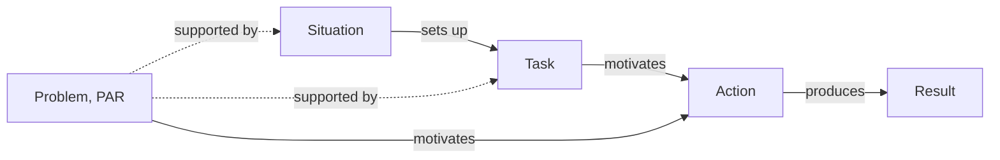

# STAR / PAR

> Takes a completed event apart into the Situation the actor faced, the Task they owned, the Actions they took and the Result those actions produced, so that agency and causal attribution have to be stated rather than implied. Category: Narrative and statement. Reference: [Wikipedia](https://en.wikipedia.org/wiki/Situation,_task,_action,_result). [Open the 3D graph](./index.html) (needs internet for Three.js; on GitHub open via Pages or clone). Library root: [README](../../README.md).

## What it decomposes

STAR takes apart a completed event with an actor: an interview answer, a resume bullet, a post-mortem, a founder telling how a deal got done. It forces four things to be stated separately: the state of the world before the actor moved (Situation), the objective the actor owned (Task), what the actor personally did, in order (Action), and what changed afterwards and which action gets the credit (Result). PAR, the resume form, folds Situation and Task into one Problem.

Without it, "we" blurs who acted, the task goes unstated so the actions cannot be judged against an objective, and results listed after actions invite the listener to infer a cause the speaker never claimed. That last defect is the one a graph must not hide: the `produces` edge from action to result is what narrators leave to implication, and the framework makes the graph say whether that edge is stated or inferred.

## The slots



| Slot | What goes here | Typical provenance | Why that provenance |
|---|---|---|---|
| Situation | Who, where, what had just happened, what was at stake. | fact | Narrators open with it and give figures; only computed stakes (ratios, gaps) are derived. |
| Task | The objective the actor owned: what, by when, why. | either | Stated only as "I was asked to" or "my priority was"; otherwise inferred from situation plus actions. |
| Action | What the actor did, as first-person steps in order. | fact | The narrator's own steps are on record; only the agency behind a "we" needs inference. |
| Result | What happened afterwards, measured, and which action gets the credit. | fact | The outcome is stated; the attribution usually is not, so `produces` edges are often derived. |
| Problem (PAR) | Situation and Task collapsed into one statement. | either | The analyst's compression of stated facts, hence derived, unless the speaker states the problem in one line. |

Relations: `sets_up` (situation to task), `motivates` (task or problem to action), `produces` (action to result), `causes` (any pair), and the implicit `supported_by` from a derived node to its facts.

## Example 1: Clearing a support backlog before renewals (interview answer)

### Source text

> In my second year as support team lead at a mid-sized software company, we shipped a billing update in March that double-charged about four hundred customers. Within two days, complaints about the charge had pushed the ticket queue from a normal sixty open tickets to over nine hundred, and our average first response time went from four hours to three days. Two of my six agents were on leave that month. I was asked to get the queue back under control before the quarterly renewals in April. First, I wrote a one-page macro that explained the bug and the refund timeline, and I had it sent proactively to all four hundred affected accounts before they wrote in; new tickets fell by half the next day. Second, I split the queue so that the two most experienced agents took only refund cases and the rest handled everything else. Third, I asked finance to process the refunds in one batch instead of case by case. By the end of the third week the queue was back under eighty tickets and the first response time was under five hours. Our renewal rate in April was 94 percent, one point higher than the previous quarter. Afterwards we made the proactive notice a standard step for any billing incident.

Written for this library as a behavioural-interview answer; company and figures are invented.

### Decomposition

**Situation**

- `s1` [fact] A billing update shipped in March double-charged about four hundred customers. "we shipped a billing update in March that double-charged about four hundred customers" (sentence 1)
- `s2` [fact] Within two days, complaints about the charge pushed the open-ticket queue from a normal sixty to over nine hundred. "complaints about the charge had pushed the ticket queue from a normal sixty open tickets to over nine hundred" (sentence 2)
- `s3` [fact] Average first response time went from four hours to three days. "our average first response time went from four hours to three days" (sentence 2)
- `s4` [fact] Two of the six support agents were on leave that month. "Two of my six agents were on leave that month" (sentence 3)
- `s5` [derived 0.90] Ticket volume rose roughly fifteen-fold while the team ran at two-thirds of its normal capacity. Rationale: Arithmetic on stated figures (900 against 60 tickets, four of six agents); the speaker never states the ratio, but it is what makes the situation critical rather than merely busy.

**Task**

- `t1` [fact] The lead was asked to get the queue back under control before the quarterly renewals in April. "I was asked to get the queue back under control before the quarterly renewals in April" (sentence 4)
- `t2` [derived 0.80] The underlying objective was to protect April renewal revenue from the affected customers, not merely to shrink the queue. Rationale: The deadline is tied to renewals and the speaker reports the renewal rate as a result; the text never states retention as the goal, only the queue.

**Problem (PAR)**

- `p1` [derived 0.85] PAR compression: a self-inflicted billing incident flooded a short-staffed support team a few weeks before quarterly renewals. Rationale: PAR collapses Situation and Task into one problem statement; choosing which facts constitute the problem (the incident, the staffing gap, the renewal deadline) is the analyst's framing, not the speaker's words.

**Action**

- `a1` [fact] Wrote a one-page macro explaining the bug and the refund timeline and had it sent proactively to all four hundred affected accounts before they wrote in. "I wrote a one-page macro that explained the bug and the refund timeline, and I had it sent proactively to all four hundred affected accounts before they wrote in" (sentence 5)
- `a2` [fact] Split the queue so that the two most experienced agents took only refund cases and the rest handled everything else. "I split the queue so that the two most experienced agents took only refund cases and the rest handled everything else" (sentence 6)
- `a3` [fact] Asked finance to process the refunds in one batch instead of case by case. "I asked finance to process the refunds in one batch instead of case by case" (sentence 7)

**Result**

- `r0` [fact] New tickets fell by half the day after the proactive notice went out. "new tickets fell by half the next day" (sentence 5)
- `r1` [fact] By the end of the third week the queue was back under eighty tickets. "By the end of the third week the queue was back under eighty tickets" (sentence 8)
- `r2` [fact] By the end of the third week the first response time was under five hours. "the first response time was under five hours" (sentence 8)
- `r3` [fact] The renewal rate in April was 94 percent, one point higher than the previous quarter. "Our renewal rate in April was 94 percent, one point higher than the previous quarter" (sentence 9)
- `r4` [fact] The proactive notice became a standard step for any billing incident. "we made the proactive notice a standard step for any billing incident" (sentence 10)
- `r5` [derived 0.40] The part of the April renewal uplift that the incident response produced, if any; the attribution is the speaker's implication, not a stated measurement. Rationale: The speaker places the renewal figure after the actions, inviting the listener to credit them, but gives no base rate or comparison; a one-point move could be normal quarter-to-quarter noise.

Fact edges (the speaker states the connection): s1 causes s2; s2 sets up t1; t1 motivates a1, a2, a3; a1 produces r0 and r4.

### What the LLM added and why it helps

Derived nodes: the capacity arithmetic `s5` (0.90), the real objective `t2` (0.80), the PAR compression `p1` (0.85) and the doubtful renewal attribution `r5` (0.40). Derived edges: s3 sets up t1 (0.70), s5 sets up t1 (0.60), s4 causes a2 (0.50), t2 motivates a1 (0.65), p1 motivates a1 (0.70), r0 causes r1 (0.75), a2 produces r2 (0.60), a3 produces r1 (0.50), a1 produces r5 (0.40); eight `supported_by` edges ground the derived nodes.

The gain is explicit attribution. The speaker links only the macro to a result (inbound halved, practice made standard); the week-three queue, the response time and the renewal rate have no stated cause. The graph proposes one candidate cause per result with a confidence, and the 0.40 on `r5` marks where an interviewer should ask a follow-up rather than accept the implication.

## Example 2: from the TBPN transcripts: Windsurf's wild weekend: selling the company Google left behind

Episode: Windsurf's Wild Weekend, SpaceX Invests $2B into xAI, Zuck's AI Data Supercluster (Jeff Huber, Scott Wu, Jeff Wang, Carl Pei, Garrett McCurrach), 2025-07-14. Transcript: [2025-07-14_windsurfs-wild-weekend...md](../../../tbpn-transcripts/transcripts/2025-07-14_windsurfs-wild-weekend-spacex-invests-2b-into-xai-zucks-ai-data-supercluster-jeff-huber-scott-wu-jeff-wang-carl-pei-garrett-mccurrach.md).

Why it fits: a completed 72-hour event narrated three days later by the two people who did it. The Situation is on the record (founders and engineers hired by Google DeepMind, a commercial team left behind and being poached, hundreds of angry employees), Wang states his Task in so many words, the Actions are timed (24 hours of calls, a next-day meeting with a paper agreement, signing two hours before the announcement) and the Results are read from the announcement and confirmed on air. Some causal links are stated and some are not, which is the distinction STAR exists to force.

### Facts (quoted)

- `s1` (host reading Demis Hassabis's post, ~line 78): "very excited to welcome Windsurf AI founders, Mohan and Douglas Chen, and some of the brilliant Windsurf engineering team to Google DeepMind"
- `s2` (host, ~line 348): "the people that got left behind at Windsurf were sales, enterprise, account management, GTM"
- `s3` (host to Jeff Wang, ~line 2158): "you now run a company with hundreds of employees that are angry about what just happened"
- `s4` (Jeff Wang, ~line 5398): "It was a tough it was a tough Friday, I'll say. I don't think anybody would want to be in my shoes on Friday."
- `s5` (Scott Wu, ~line 5428): "people were saying, well, the thing that's left is just a shell. And we looked at it and we said, well, actually, I don't know if that's right. There's the code, there's the product, there's the customers, and most importantly, there's the whole team"
- `s6` (Scott Wu, ~line 5498): "we tend to over-focus on software engineers because it's just who we are and how we think about it"
- `s7` (Scott Wu, ~line 5510): "the whole team have built out a really great kind of suite of all the different kinds different functions, right? Sales, deployed engineering, enterprise work, infrastructure, marketing, operations, and so on, finance, et cetera."
- `s8` (host, ~line 352): "over the weekend, I'd heard other teams that were kind of circling, wanting to hoover up their GTM team"
- `t1` (Jeff Wang, ~line 5546): "My immediate priority was just to get a lot of options on the table and to have a lot of paths forward. I had to tell the team like, this is the path forward immediately because this is happening now."
- `a1` (Jeff Wang, ~line 5402): "we talked to a lot of teams out there. There's a lot of AI companies, foundational companies."
- `a2` (Jeff Wang, ~line 5562): "I was on the phone for pretty much 24 hours, nonstop on my phone after the all hands"
- `a3` (Jeff Wang, ~line 5566): "me and Scott, we worked really fast. We met at our office the next day. He even brought in everything on a piece of paper to sign."
- `a4` (Scott Wu, ~line 5588): "we got things signed like one or two hours before we were able to put out the announcement"
- `a5` (Jeff Wang, ~line 5406): "after talking to Scott and the Cognition team, it was done in my mind"
- `a6` (Jeff Wang, ~line 5664): "we really went out of our way to make this a very generous acquisition"
- `r1` (Jeff Wang, ~line 5392): "this is a this is a real acquisition. Okay, we are being acquired by cognition"
- `r2` (Cognition's announcement read on air, ~line 280): "100% of windsurf employees will participate financially they will also have all their vesting cliffs waves"
- `r3` (Jeff Wang, ~line 5676): "They kind of cheered for like a standing ovation or something. So I think the sentiment has shifted. The team is even more fired up to go."
- `r4` (Jeff Wang, ~line 5682): "The whole product is still there. All the things we had and the GTM team is still there. And now they also have Devon to sell as well."
- `r5` (host, ~line 358): "the fact that they were able to get this deal done in just a couple of days is fantastic"

### Decomposition

**Situation**

- `s1` [fact] Google DeepMind hired Windsurf's founders Varun Mohan and Douglas Chen and part of its engineering team, in a deal that left the rest of the company behind.
- `s2` [fact] What remained at Windsurf after the founders left was the commercial organisation: sales, enterprise, account management and go-to-market.
- `s3` [fact] Jeff Wang was now running a company of hundreds of employees who were angry about what had just happened.
- `s4` [fact] Wang calls the Friday of the founders' departure a tough one; nobody would have wanted to be in his position.
- `s5` [fact] Outsiders said what was left was just a shell; Cognition looked and saw the code, the product, the customers and, most importantly, the whole team.
- `s6` [fact] Scott Wu says Cognition tends to over-focus on software engineers because that is who they are and how they think.
- `s7` [fact] Windsurf's team had built out sales, deployed engineering, enterprise work, infrastructure, marketing, operations and finance.
- `s8` [fact] Over the weekend other companies were circling, wanting to hire away Windsurf's go-to-market team.

**Task**

- `t1` [fact] Wang's immediate priority was to get many options on the table and have many paths forward, and to give the team a path immediately because it was happening now.
- `t2` [derived 0.75] The objective behind the options was to find a home for the whole company before the sales and go-to-market staff accepted the offers circling them. Rationale: Follows from the stated facts that other teams were trying to hire away the GTM team and that hundreds of employees were angry; Wang states his priority as options and paths, never as retention.
- `t3` [derived 0.55] Research-heavy AI labs that over-index on engineers need complete go-to-market organisations and may buy them whole rather than build them; supplying or building GTM organisations for labs is an underserved need. Rationale: Generalises Wu's admission that Cognition over-focuses on engineers and his list of the functions Windsurf had built; one deal is the evidence, and Wu calls the fit unintentional.
- `t4` [derived 0.50] Employees left behind when founders are hired away need protection terms (accelerated vesting, waived cliffs) by default rather than an improvised rescue; deal-structure norms or tooling for this are an underserved need. Rationale: The angry team and the terms Cognition had to invent within days show the gap; the hosts debate leaving money for unvested options as a norm elsewhere in the episode, but nobody states it as a product or market.

**Problem (PAR)**

- `p1` [derived 0.80] PAR framing: a funded company with product, customers and a commercial team but no founders, an angry staff and competitors poaching, with days rather than weeks to find an answer. Rationale: Collapses the stated situation and Wang's stated priority into one problem statement; which facts count as the problem and the time bound are the analyst's framing.

**Action**

- `a1` [fact] Wang talked to a lot of teams, among them many AI and foundation-model companies.
- `a2` [fact] After the all-hands, Wang was on the phone for roughly 24 hours nonstop.
- `a3` [fact] Wang and Wu worked fast: they met at Windsurf's office the next day and Wu brought the agreement on paper to sign.
- `a4` [fact] The documents were signed one or two hours before the announcement went out.
- `a5` [fact] After talking to Scott Wu and the Cognition team the decision was made; Wang adds that Cognition was the only other team they thought was smarter than their own.
- `a6` [fact] Wang, Wu and the team went out of their way to make the acquisition very generous to employees.

**Result**

- `r1` [fact] Windsurf is being acquired by Cognition in what Wang calls a real acquisition.
- `r2` [fact] All Windsurf employees participate financially, vesting cliffs are waived and, per the same announcement, vesting is fully accelerated.
- `r3` [fact] At the Monday all-hands the team cheered with something like a standing ovation; the sentiment has shifted and the team is more fired up.
- `r4` [fact] The whole product and the GTM team are still there, and the team now also has Devin to sell.
- `r5` [fact] The deal was done in just a couple of days.
- `r6` [derived 0.65] Closing within days is what preserved the go-to-market team as an asset; a slower process would have lost people to the teams circling them. Rationale: Combines three stated facts (competitors circling, a couple-of-days close, the team still there); the counterfactual that a slow process would have lost them is nobody's statement.

Fact edges: s1 and s3 set up t1; t1 motivates a1 and a2; a1 causes a5; a4 produces r1; a6 produces r2; a3 produces r5; s2 causes s8; r1 causes r4.

### What the LLM added

Five derived nodes (`t2`, `t3`, `t4`, `p1`, `r6`) and fifteen derived edges: s4 sets up t1 (0.70); a5 causes a3 (0.85) and a3 causes a4 (0.85), sequence the speakers state as order, not cause; s8 sets up t2 (0.75); t2 motivates a2 (0.70) and a6 (0.70); a6 causes r3 (0.70); r5 causes r6 (0.65); r6 causes r4 (0.60); s5 causes r1 (0.60); s6 and s7 set up t3 (0.55); s3 and s1 set up t4 (0.50); p1 motivates a1 (0.75); fourteen `supported_by` edges.

Wang states his priority but never why the pace or the generosity; `t2` supplies the motive both share and makes the 24-hour phone marathon legible as a race against attrition. The claim that speed kept the team together (`r6`) is a counterfactual nobody voiced; the graph carries it at 0.65 instead of letting it pass as reported fact.

### Where the opportunity shows up

The idea-bearing slot is Task: the need the actor had to meet is where a market gap shows. Its derived nodes read as candidates:

- `t3` (0.55): research-heavy AI labs need complete go-to-market organisations and may buy them whole. Candidate ideas: a service that builds or places GTM teams for labs; a market for commercial organisations stranded by founder acqui-hires. One deal is the evidence and Wu calls the fit unintentional, hence the middle confidence.
- `t4` (0.50): employees left behind by founder hires need default protection terms (accelerated vesting, waived cliffs). Candidate ideas: standard deal terms, tooling or advisory for stranded-employee outcomes. Nobody in the episode frames it as a product, hence 0.50.
- `t2` (0.75) is not an idea but the real objective; it is what makes `t3` and `t4` needs rather than anecdotes.

## Building a knowledge graph with this framework

### Node and edge types

One node type per slot: `situation`, `task`, `action`, `result`, `problem`. Edges: `sets_up` (situation to task), `motivates` (task or problem to action), `produces` (action to result), `causes` (any pair, including situation to situation and result to result), `supported_by` (derived to fact, always derived). Layout is a left-to-right tree: situation and problem at level 0, task 1, action 2, result 3. `entities` carry company and person names as the extractions spell them, for the future merge.

### Fact or derived: rules of thumb

- **Situation.** Extracted: narrators open with who, where and what happened, with figures. Inferred: the stake computed from the figures (fifteen-fold demand at two-thirds capacity), worth adding because it says why the situation is critical, which raw figures leave to the reader. Empty: leave it empty and lower every downstream confidence; never backfill context from the actions.
- **Task.** Extracted only when the actor says so ("I was asked to", "my immediate priority was"). Otherwise inferred by asking what objective makes these actions rational; the inference most worth making, because the task names the need and is the idea-bearing slot. Even beside a stated task, a derived node for the objective behind it is legitimate when the results reveal it (renewals, retention). Empty: derive one task at 0.75 or lower, supported by situation facts and actions.
- **Action.** Extracted: the actor's own steps, one node each, in order. Inferred only when the speaker says "we" and the graph must decide who acted: keep the act as fact and put the agency claim in a derived edge's rationale. Empty: the passage is not a STAR event; do not manufacture actions from results.
- **Result.** The outcome is extracted; the attribution is inferred. `produces` is a fact edge only when the speaker links action and result with a connective ("before they wrote in; new tickets fell by half"); otherwise a derived edge, and a result that exists only as an implication (a renewal uplift, a team preserved by speed) is a derived node. Empty: say so in the summary; a STAR graph without results is a plan, not an event.
- **Problem (PAR).** Derived by default: one node compressing situation and task, supported by two to four facts. Worth making because it is the one-line handle a merged graph will index on. A problem the speaker states in one sentence may be a fact instead.

### Extraction recipe

```text
Input: one transcript chunk with speaker labels; the slots and relations above.
1. Find a completed event with a named actor who narrates it. No actor or no outcome: return no example.
2. Nodes: id, slot, label (40 chars max), text (1-3 sentences), provenance.
   fact    -> source_quote copied verbatim (5+ words) and source_ref (speaker, ~line).
   derived -> confidence 0-1 and rationale naming the facts it rests on.
3. situation = state before the first action. task = the actor's own objective: fact only if
   the actor states it, else derived from situation + actions. action = first-person steps in
   order, one node each. result = state after, measured where possible. problem = one derived
   node compressing situation + task.
4. Edges sets_up, motivates, produces, causes: fact only if the speaker states the connection
   (because, so, that is why); else derived with confidence. supported_by from every derived
   node to its facts.
5. idea_bearing_slot = "task". Emit {id, kind, title, summary, source, why_this_episode,
   idea_bearing_slot, layout, nodes, edges}; 8-30 nodes, at least nodes-1 edges; entities as
   spelled in the extractions.
```

Checks: `node _meta/validate.mjs <dir>` (quotes found in the file, paraphrases under 30%, confidences and rationales present, `supported_by` direction, counts). By hand: every action names its actor; every result has an incoming `produces` or `causes` edge; the task slot is non-empty; no derived edge above 0.85 unless it is a stated sequence; derived task nodes read as needs, not restatements of the situation.

### Failure modes

| Failure | What it looks like | Guard |
|---|---|---|
| Invented quotes | A fact node with a tidy quote the transcript never says. | Validator string match; anything not found becomes derived or is dropped. |
| Post hoc attribution as fact | "Renewals rose" after "I sent the notice" becomes a fact `produces` edge. | Fact only with a stated connective; otherwise derived, capped at 0.75. |
| Agency blur | "We closed the deal" credited to the narrator alone. | Name the actor in the node text; a "we" gets a derived edge with rationale for the agency claim. |
| Task copied from situation | The task restates the crisis instead of an objective. | A task must contain an owned objective with a verb and, where stated, a deadline. |
| Result restating action | "Sent the notice" appears again as the result. | A result describes a state after the action, measured or observed, distinct from the action text. |
| Hypothetical or ongoing event | A plan or prediction decomposed as if completed. | Require a past-tense outcome; otherwise use Minto SCQA. |
| Over-confident inference | Counterfactuals and generalised needs at 0.9. | Stated sequence at most 0.85; counterfactuals at most 0.65; needs generalised from one case at most 0.60. |
| PAR that swallows the graph | The problem node absorbs every fact and every edge starts from it. | Two to four `supported_by` edges and at most one `motivates` edge per problem node. |

## Related frameworks

- [CARL](../carl/README.md): STAR plus a Learning slot; prefer it when the point of the story is the rule extracted, not the event.
- [Minto SCQA](../minto-scqa/README.md): frames a problem not yet solved; prefer it for pitches and open questions, STAR for completed events.
- [Toulmin Model](../toulmin-model/README.md): prefer it when the attribution itself (this action produced that result) is contested and needs a warrant.
- [5 Whys](../../02-strategic-and-business/five-whys/README.md): prefer it when the cause of the situation matters more than the actor's response.
