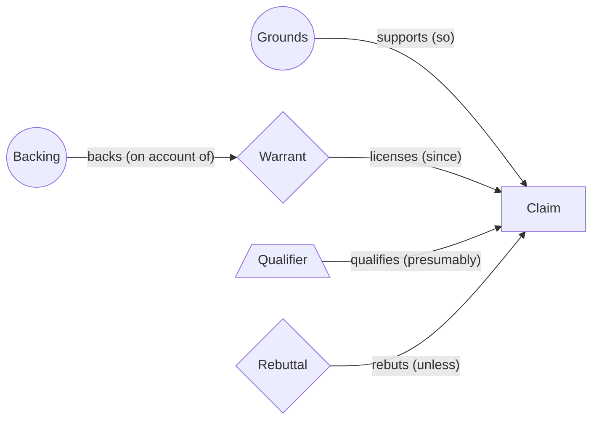

# Toulmin Model

> Takes one argument apart into claim, grounds, warrant, backing, qualifier and rebuttal, so that the unstated rule carrying the evidence to the conclusion, and the conditions under which it fails, are made explicit. Category: Narrative & Statement Decomposition. Reference: [Stephen Toulmin](https://en.wikipedia.org/wiki/Stephen_Toulmin). [Open the 3D graph](./index.html) (needs internet for Three.js; on GitHub open via Pages or clone).

## What it decomposes

Toulmin's *The Uses of Argument* (1958) describes how practical arguments run, as against the syllogism. Its object is one argument: a claim and the case made for it. Grounds are the facts appealed to; the warrant is the general rule licensing the step from grounds to claim; backing is the field-specific assurance behind the warrant; the qualifier is how strongly the claim is held; the rebuttal is the conditions under which the warrant does not carry the claim.

It forces into the open the two parts speakers omit: the warrant, obvious to the speaker and open to challenge once stated, and the rebuttal, which an honest argument names and most do not. Without it an argument is a list of points and a conclusion, taken or left wholesale; the hosts below answer a well-made one with "That's a really good point. I haven't considered that." Decomposed, it shows one unstated rule doing all the work, one exemplar standing for a class of counterparties, and a rebuttal another guest supplied without anyone connecting it. Each unmanaged exception is an unpriced risk, which makes the rebuttal the idea-bearing slot.

## The slots



| Slot | What goes here | Typical provenance | Why that provenance |
|---|---|---|---|
| Claim | The assertion to be accepted. | either | Usually stated; a narrow stated claim often serves a broader implied one. |
| Grounds | The specific facts offered for the claim. | fact | Invented grounds mean no argument to decompose. |
| Warrant | The general rule licensing grounds to claim. | derived | Almost never stated; its confidence is the argument's real strength. |
| Backing | The assurance behind the warrant, not the claim. | either | Stated under challenge; the principle making it relevant is inferred. |
| Qualifier | How strongly, for what population, the claim holds. | derived | A hedge is a fact; the strength earned is inferred. |
| Rebuttal | Conditions under which the warrant fails ("unless"). | derived | Speakers rarely name exceptions; that another speaker's point is one is an inference. |

## Example 1: Harry was born in Bermuda

Toulmin's own textbook case, written as a short scenario so that facts can quote it; the rule that does the work is never stated.

### Source text

> At the passport office a clerk is asked whether Harry may hold a British passport. The file shows one relevant fact: Harry was born in Bermuda. The clerk writes on the form: so, presumably, Harry is a British subject. When Harry's employer asks why a birthplace should settle a question of nationality, the clerk replies that the office relies on the relevant statutes and other legal provisions, and that the presumption would not hold if both of Harry's parents were aliens at the time of his birth, or if Harry has since become a naturalised citizen of another country. The employer points out that nobody has checked the parents' nationality, and the clerk agrees to hold the passport until the birth record is examined.

### Decomposition

Grounds

- `g` [fact] Harry was born in Bermuda. "Harry was born in Bermuda" (sentence 2)

Claim

- `c` [fact] Harry is a British subject. "Harry is a British subject" (sentence 3)

Qualifier

- `q1` [fact] The claim is held presumptively, not with certainty: the clerk writes 'so, presumably'. "so, presumably, Harry is a British subject" (sentence 3)
- `q2` [derived 0.60] 'Presumably' encodes that the two exceptions are rare but unverified: the claim is strong in the absence of evidence about the parents, and would become certain only once both exceptions are excluded. Rationale: Reads the stated qualifier against the stated exceptions. The text gives the word 'presumably' but not what strength it encodes or what would raise it to certainty.

Warrant

- `w1` [derived 0.90] A person born in Bermuda will generally be a British subject. Rationale: Nowhere stated. It is the general, bridge-like rule that alone carries the step from the birthplace to the nationality claim; the employer's question (why should a birthplace settle nationality) is exactly a demand for it.

Backing

- `b1` [fact] The office relies on the relevant statutes and other legal provisions. "the office relies on the relevant statutes and other legal provisions" (sentence 4)
- `b2` [derived 0.75] The statutes make birth in a British territory such as Bermuda a ground of British nationality, subject to listed exceptions; that is why the birthplace rule can be relied on. Rationale: The clerk cites the statutes but not their content. The inference that they contain a birthright rule with exceptions is what makes the citation count as backing for the warrant rather than a bare appeal to authority.

Rebuttal

- `r1` [fact] The presumption would not hold if both of Harry's parents were aliens at the time of his birth. "if both of Harry's parents were aliens at the time of his birth" (sentence 4)
- `r2` [fact] The presumption would not hold if Harry has since become a naturalised citizen of another country. "if Harry has since become a naturalised citizen of another country" (sentence 4)
- `r3` [fact] Nobody has checked the parents' nationality. "nobody has checked the parents' nationality" (sentence 5)
- `r4` [derived 0.70] Because the parents' nationality has not been checked, the first exception cannot be ruled out; the claim should stay presumptive until the birth record is examined. Rationale: Combines the stated exception with the stated gap in the file. The text says the passport is held until the record is examined but does not say which exception is the live one.

### What the LLM added and why it helps

With the derived layer hidden the graph is exactly the scenario. `w1` (0.90) is the rule the employer asked for and never got; without it the fact layer holds a birthplace and a nationality with nothing between them. `b2` (0.75) says what the statutes must contain for citing them to be backing rather than appeal to authority. `r4` (0.70) joins exception `r1` to gap `r3`. Derived edges: `licenses` from `w1` (0.90), `backs` from `b1` (0.85: the statutes were offered for the rule, not the claim), and `supported_by` from each inference to its sentence; the fact edges are the text's own "so", "presumably" and "would not hold if". The gain is a decision: the claim stays presumptive because one exception is unexcluded, and the record check would close it.

## Example 2: from the TBPN transcripts: Glenn Hutchins: the AI data-center build-out is not the CLEC bubble

Episode "Gemini 3 reactions, Cloudflare outage, the upsides of bubbles (Byrne Hobart, Glenn Hutchins, Yogi Goel, Sam Jones, Ali Madani, Amit Jain)", 2025-11-19, [transcript](../../../tbpn-transcripts/transcripts/2025-11-19_gemini-3-reactions-cloudflare-outage-the-upsides-of-bubbles-byrne-hobart-glenn-hutchins-yogi-goel-sam-jones-ali-madani-amit-jain.md); line numbers refer to it. Asked whether debt-financing AI infrastructure can be done responsibly, Hutchins gives one complete argument (lines 4720-4890): a claim by disanalogy, five grounds, backing by credit rating and the TSMC/Taiwan precedent, a self-supplied hedge, and a rule never stated yet carrying the whole step. The hosts do not contest it; an earlier guest, Byrne Hobart, states the obsolescence condition that undercuts one ground, and Hutchins's involvement with CoreWeave, the exemplar he cites, makes the backing itself worth a Toulmin look.

### Facts (quoted)

Fourteen of twenty nodes, none paraphrased; quotes keep transcription errors such as "CLEX".

Claim

- `c1` [fact] Today's AI data-center build-out is not analogous to the dot-com CLEC fiber build, where money went into the ground before the customers existed; it is a very different kind of financing structure. "it's not analogous. all to the CLEX where they put a bunch of money in the ground and then went to get the customers and the customer weren't there." (Hutchins, L4880-4886)
- `c2` [fact] Financing the AI build-out with debt, Blue Owl-style, can be done responsibly. "It can be done responsibly, yeah." (Hutchins, L4634-4636)

Grounds

- `g1` [fact] Almost every data center being built has a solvent counterparty contracted to take all of its output. "every one of these data centers, almost all of them, has a counterparty, a solvent counterparty that is contracted to take all the output." (Hutchins, L4788-4798)
- `g2` [fact] The data centers are built to suit a contracted customer, not on the 'if you build it, they will come' model. "They're built to suit, not if you build it, they will come." (Hutchins, L4800-4802)
- `g5` [fact] During the dot-com build the CLECs constructed fiber networks all around the country before the customers existed; they all went to zero and people lost their money. "the fiber optic networks were getting constructed all around the country, the CLECs, and those all went to zero and people lost their money on it." (Hutchins, L4772-4780)
- `g3` [fact] Each deal, so far as Hutchins understands it, generates about a two-times multiple of money over the four-to-five-year contract on the cost of buying the GPUs and standing up the data center. "in the four to five-year period of the deal, generates about a two-time multiple of money on the cost of buying the GPUs and standing up the data centers." (Hutchins, L4826-4836)
- `g4` [fact] After the contract the owner of the GPUs holds an embedded option on the value of the used GPUs, which will be worth something. "the owner of the GPUs in the data center has an embedded option, on the value of the used GPUs, which will be worth something." (Hutchins, L4852-4856)

Warrant

- `w0` [fact] Each contract and build has a commercial proposition in it; done well, as at CoreWeave, they stack like bricks in a wall. "each of the contracts and builds right now has a commercial proposition in it. And when done well, these companies that are doing this, like CoreWeave, are putting one of building a wall with one of those bricks on top of the other." (Hutchins, L4866-4872)

Backing

- `b1` [fact] Microsoft has, in Hutchins's view, the world's best credit rating, and will survive even if the sector collapses before it recovers. "Microsoft has, I think, the world's best credit rating." (Hutchins, L4810-4820)
- `b2` [fact] TSMC succeeded largely because Taiwan was willing to lend it the national credit rating; capital at fab scale was only approachable that way, and the data-center build needs financing at a similar scale. "TSMC succeeded largely because the country of Taiwan was willing to, essentially, to lend them the credit rating." (Hutchins, L4666-4680)
- `b3` [fact] Used hardware keeps value: a five-year-old iPhone is still worth something even though people are buying the new ones. "I mean, your five-year-old iPhone is still worth something." (Hutchins, L4858)

Qualifier

- `q1` [fact] The claim is held in the '1999 internet' sense, not the '2008 subprime' sense: of course some companies will fail, some capital will be lost, and scoundrels will be attracted by the money moving around. "I am more in the internet camp which means that of course there will be companies that will be formed that won't be successful" (Hutchins, L4746-4760)

Rebuttal

- `r0` [fact] The host notes how capital-consumptive OpenAI will be before profit or cash flow comes, unlike Google, which threw off cash well before its IPO. "you look at how capital consumptive Open AI will be before profit comes or cash flow comes" (host, L4896-4900)
- `r1` [fact] A GPU that produces fewer tokens per watt than newer ones can be economically worthless even though it can still do something useful. "if the GPU is producing fewer tokens per watt and that just relative to newer ones, it can be economically worthless, even though it can still actually do something useful." (Hobart, L3300)

### Decomposition

Fact edges follow Hutchins's own connectives: `supports` from each ground to `c1`, `licenses` from `w0` ("So it's not, it's not analogous."), `backs` from `b1` and `b2` to `w1` and from `b3` to `w2`, `qualifies` from `q1`. The derived nodes fill the slots he left empty.

Warrant (with `w0`)

- `w1` [derived 0.80] If a solvent counterparty has contracted to take all of a data center's output, the demand risk that sank the CLECs sits on that counterparty's balance sheet, so the build can be financed like a leased asset rather than a speculation. Rationale: Never stated. It is the only general rule that carries 'solvent counterparty contracted to take all the output' and 'built to suit' across to 'not analogous to the CLECs'. Contestable: it holds only while the counterparty stays solvent for the whole contract term.
- `w2` [derived 0.70] If a four-to-five-year contract returns about twice the capital and the hardware keeps resale value afterwards, the downside of each build is bounded even if AI demand cools. Rationale: Hutchins gives the 2x multiple and the embedded option as data but never says why they make the build safe; the bridging rule is that contracted cash flows plus residual value bound the loss. It depends on the contracts performing and on used GPUs holding value.

Backing (with `b1`, `b2`, `b3`)

- `b4` [derived 0.70] Lending against contracted offtake rather than merchant demand is the standard project-finance structure for pipelines and power plants; a strong balance sheet behind the offtake is what makes capital-intensive builds bankable. Rationale: Hutchins invokes a financing structure and a credit-rating backstop (Microsoft, TSMC and Taiwan) but never names the project-finance principle that makes those assurances relevant to the warrant. Field knowledge, not stated in the transcript.

Qualifier (with `q1`)

- `q2` [derived 0.65] The claim holds in aggregate for builds whose offtaker is a hyperscaler-grade credit; it is weaker for builds contracted to labs or neoclouds whose solvency depends on continued fundraising. Rationale: Hutchins's backing is a single exemplar (Microsoft) and his grounds say 'almost all', not all. Bounding the claim to counterparty quality follows from what he offers and from the host's remark about OpenAI's capital consumption.

Rebuttal (with `r0`, `r1`)

- `r2` [derived 0.70] Unless the contracted counterparty is not Microsoft-grade: a large share of offtake is contracted by OpenAI and other labs that burn capital for years, so the 'solvent counterparty' premise depends on their continued funding. Rationale: The host observes that OpenAI will be capital consumptive before cash flow comes; Hutchins's solvency backing names only Microsoft. If the offtaker cannot pay through a downturn, the warrant's transfer of demand risk fails. Underserved need: counterparty-risk rating or insurance for compute offtake contracts.
- `r3` [derived 0.55] Unless the residual value of used GPUs is far below what the 2x math assumes: nobody prices the embedded option, and a newer chip that produces more tokens per watt can make an older fleet economically worthless while it still runs. Rationale: Hobart's economic-obsolescence point, made earlier in the same episode, contradicts the iPhone analogy; the deal math Hutchins cites is stated 'so far as I understand it' and depends on this unpriced option. Underserved need: a priced residual-value benchmark or guarantee market for used accelerators.

Grounding links: `w1` rests on `g1`, `g2`, `w0`; `w2` on `g3`, `g4`; `b4` on `b1`, `b2`; `q2` on `g1`, `b1`; `r2` on `r0`, `g1`; `r3` on `r1`, `g4`.

### What the LLM added

Inside the argument, `w1` and `w2` state the rules that carry five grounds to the claim (`licenses`, 0.80 and 0.70), `b4` names the project-finance principle that makes a credit rating relevant to a warrant about demand risk (`backs`, 0.70), and `q2` bounds the claim to the population the backing covers (`qualifies`, 0.65). Hidden, they leave a faithful but inert fact layer; shown, each rule can be asked whether it holds for a given data center and offtaker. From outside the passage, `r0` and `r1` are facts with derived `rebuts` edges: the host offered OpenAI's capital consumption as a contrast, not an objection (0.60), and Hobart was answering a different question (0.70). `r2` and `r3` restate them as "unless" conditions (0.70, 0.55), and `c1` supports `c2` (0.70) records that the disanalogy was Hutchins's answer to whether debt can be done responsibly, a link he implies rather than states.

### Where the opportunity shows up

The idea-bearing slot is the rebuttal: each derived exception is a condition under which the financing argument fails, and where the argument is acted on at scale an unmanaged failure condition is an underserved need.

- `r2` (0.70): the solvent-counterparty premise is untested for labs and neoclouds that fund offtake by raising capital, and nobody rates or insures that risk. Candidate: a counterparty-risk rating or insurance product for compute offtake contracts, priced per offtaker and term, that a lender or Blue Owl-style financier could underwrite against.
- `r3` (0.55): the 2x math includes an embedded option on used GPUs that nobody prices, and Hobart's tokens-per-watt point says it can go to zero while the hardware still runs. Candidate: a priced residual-value benchmark or guarantee market for used accelerators, the analogue of the residual curves that make car leasing financeable.

`r3` is lower because it joins two speakers who never addressed each other and rests on Hutchins's "so far as I understand it". `q2` (0.65) is the same finding from the qualifier side: the gap between "almost all" and "all" is the market.

## Building a knowledge graph with this framework

### Node and edge types

Node types are the six slots; one argument is one connected component headed by one or two `claim` nodes, and a segment arguing several claims gives several components that may share grounds. Edges: `supports` (grounds to claim; also a stated claim to the broader claim it serves, `c1` to `c2`), `licenses` (warrant to claim), `backs` (backing to warrant, never to a claim), `qualifies` (qualifier to claim), `rebuts` (rebuttal to claim as the registry defines it; Toulmin hangs it off the qualifier, recoverable through `qualifies`), `supported_by` (derived to fact, always derived). Facts carry `source_quote` and `source_ref`, derived nodes `confidence` and `rationale`; `entities` use the transcript extractions' spellings.

### Fact or derived: rules of thumb

- Claim: extracted when stated, which is usual (the sentence with the "so"). Inferred when a narrow stated claim serves a broader one never said (`c1` stated, its link to `c2` not); worth it because the broad claim is what a decision rests on. Empty: description, not argument; skip.
- Grounds: extracted, always; a ground without a quote is an invented fact. Empty: keep the claim, leave grounds empty, lower the warrant's confidence.
- Warrant: inferred, almost always, as a general conditional that would carry any similar grounds to any similar claim; a restatement of these grounds and this claim is not one. Worth it because it is the contestable part and its confidence is the argument's honest strength. Extracted only when the speaker gives the rule (`w0`, weaker than the rule the argument needs).
- Backing: extracted when the speaker cites an authority, precedent or number for the rule; inferred, flagged as field knowledge, when the citation needs a principle to be relevant (`b2`, `b4`). Empty: lower the warrant's confidence; do not supply backing the speaker did not offer.
- Qualifier: extracted from hedges ("I think", "almost all", "presumably"); inferred for the population the claim actually holds for, usually narrower, because that gap is where over-generalisation hides. Empty: the claim is held as certain; derive a qualifier if the grounds do not support that.
- Rebuttal: extracted when the speaker says "unless", or when another speaker in the same source undercuts a ground (`r1`: fact node, derived `rebuts` edge). Inferred as the "unless" form of every ground and backing the argument depends on; worth it because it is the idea-bearing slot. Empty almost always, and that emptiness is the finding.

### Extraction recipe

```text
Decompose ONE argument from <file>, lines <a>-<b>, with the Toulmin model.
1. Claim: the conclusion a speaker wants accepted (fact). If it serves a broader
   implied claim, add that as derived with a derived `supports` between them.
2. Grounds: each specific fact or number offered for the claim, as a verbatim
   span of 5+ words. No span, no node.
3. Warrant: the general rule "if <grounds of this kind> then <claim of this
   kind>" (derived; confidence = how much of the step it carries). A rule the
   speaker states is a fact warrant.
4. Backing: what the speaker cites for the rule (fact); the principle needed to
   make it relevant (derived, flagged as field knowledge).
5. Qualifier: any hedge, verbatim (fact); the population the claim holds for
   (derived).
6. Rebuttal: per ground and backing, the "unless" condition under which it stops
   carrying the claim (derived; end the rationale with the need it implies).
   Search the whole source for a speaker stating such a condition: fact node,
   derived `rebuts` edge, rationale on the edge.
7. Edges supports/licenses/backs/qualifies/rebuts with provenance; fact edges
   quote the connective; `supported_by` from every derived node to its facts.
Output one graph.json example: nodes [{id, slot, label <=40 chars, text,
provenance, source_quote+source_ref | confidence+rationale, entities}], edges
[{id, from, to, relation, provenance, confidence?, source_quote?, rationale?}],
idea_bearing_slot "rebuttal".
```

Afterwards: `node _meta/validate.mjs <dir>` (quotes, paraphrase cap, derived-to-fact connectivity), then three checks it cannot do: every warrant is general, naming no speaker or company; no `backs` edge targets a claim; every derived rebuttal traces through `supported_by` to the ground or backing it negates, or it is a counter-argument imported from nowhere.

### Failure modes

- Warrant restated as the claim ("the data centers are safe because they have solvent counterparties"). Guard: conditional form, no proper nouns; if it cannot be written generally, `licenses` gets a low confidence.
- Backing attached to the claim (Microsoft's rating `supports` the claim). Guard: `backs` is the only relation out of a backing node and must target a warrant.
- Rebuttal as counter-claim ("actually it is a bubble"). Guard: every rebuttal must be writable as "unless ..." and name the ground or backing it turns off.
- Invented grounds: a plausible number the speaker did not say. Guard: the validator's quote check; anything assembled across turns is `paraphrase: true`, within the 30% cap.
- Dropped qualifier: every claim certain. Guard: search for hedges first; if the grounds say "almost all", the claim is not about all.
- Over-confidence from one exemplar: one counterparty becomes a rule for all. Guard: warrant and qualifier confidence track the number and variety of grounds; one exemplar caps them (here 0.65 to 0.80).
- Cross-segment rebuttals recorded as facts about the argument (Hobart's point is a fact; that it rebuts Hutchins is not). Guard: fact node, derived edge, rationale on the edge.

## Related frameworks

- [Pyramid Principle](../pyramid-principle/README.md): a conclusion and its pillars arranged for a reader; Toulmin asks whether the pillars carry it.
- [Dialectical Decomposition](../dialectical-decomposition/README.md): a whole position against its critique; Toulmin's rebuttal is a condition inside one argument, for when only one side has spoken.
- [Issue & Hypothesis Trees](../../02-strategic-and-business/issue-hypothesis-trees/README.md): hypotheses with falsification conditions are claims with rebuttals; the tree for many hypotheses, Toulmin for one argument's warrant.
- [Inversion & Pre-Mortem](../../03-engineering-and-cognitive/inversion-premortem/README.md): failure pathways for a plan; the rebuttal slot does the same for the argument behind the plan.

[Library root](../../README.md).
