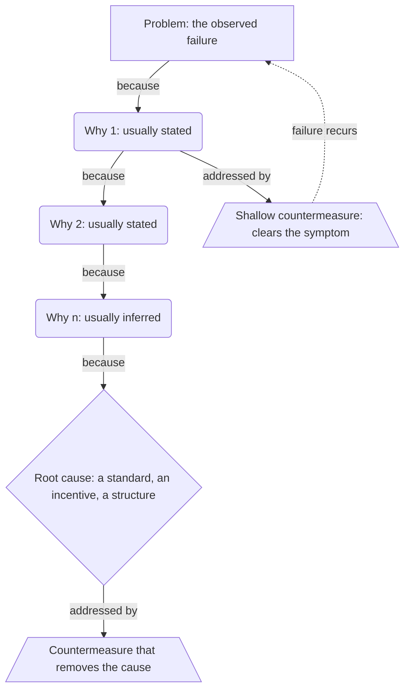

# 5 Whys

> Traces one observed failure down successive layers of cause until the answer is a standard, an incentive or a structure rather than a person, then names the countermeasure that removes it. Category: Strategic & Business Decomposition. Reference: [Five whys](https://en.wikipedia.org/wiki/Five_whys). [Open the 3D graph](./index.html) (needs internet for Three.js; on GitHub open via Pages or clone).

## What it decomposes

Sakichi Toyoda's question, made a standing habit by Taiichi Ohno and written down in *Toyota Production System* (1978), takes apart one observed failure: a single event with a date and a witness, not a class of failure and not a topic. The structure is a chain. Each layer answers "why did the layer above happen?", the chain ends in a root cause, and a countermeasure hangs off the layer it actually removes. Depth is the whole of the shape; the framework has no way to say "and also", which is its cost and the reason its cousins exist.

What it forces explicit is the distance between the cause you can see and the cause that put it there, and its rule about where the chain may stop is what makes it a method rather than a trick: a good chain ends at a process, a standard, an incentive or a structure, never at a person's error. "The operator forgot" and "the agent took the bribe" are comfortable stopping points, often literally true and useless, because they explain the instance and predict nothing. Five is a heuristic for how far that usually takes: the classic example below needs seven whys before the root cause, the transcript example four.

Without the chain the countermeasure attaches at the top, where clearing the failure is cheapest, and the failure returns. Stop too early and you get the symptom-clearing fix: replacing the fuse (`cm0`, derived 0.70), already done twice in a year by the plant's own records, or relocating the support operations (`c1`, a fact, and what Coinbase did), of which Armstrong says in the same breath that it does not solve the problem. Go too deep and you get a cause nobody can act on -- outsourcing, capitalism -- unfalsifiable and therefore free. The stopping rule is operational: descend to the deepest layer the organisation owns and could change. The confidences in `graph.json` are bets about where that boundary falls.

## The slots



| Slot | What goes here | Typical provenance | Why that provenance |
|---|---|---|---|
| Problem | The observed failure, concrete enough to check: what happened, to whom, how often. Evidence that it happened before belongs here. | fact | No stated failure, no chain. Recurrence is a record, not a reading, and the best evidence that an earlier chain stopped too high. |
| Why | One causal layer, the answer to why the layer above happened. Levels 1..n. | either | Upper layers are usually stated: they are mechanical and blame nobody. The layer where the answer becomes a standard or an incentive is not. |
| Root cause | The systemic cause whose removal prevents the class of failure, not this instance. | derived | Almost never stated: naming it is an admission, and it holds several separately stated facts together rather than restating one. |
| Countermeasure | What removes a cause, or clears its symptom. | either | The fix for a shallow why is normally stated and already taken; the one reaching the root cause must be inferred, and is where the opportunity shows up. |

## Example 1: Ohno's machine stoppage: the missing strainer

Ohno's own demonstration, written out as a short scenario so that fact nodes can quote it, and extended with two records his telling implies: the machine's maintenance sheet and the plant's fuse-replacement history. Because the five whys are asked and answered in the text, the whole stated chain is fact edges. The sixth why is nobody's.

### Source text

> A machine on the assembly line stopped in the middle of the shift. The supervisor did not send for a new fuse; he asked why, and kept asking.
>
> Why did the machine stop? There was an overload and the fuse blew.
>
> Why was there an overload? The bearing was not sufficiently lubricated.
>
> Why was it not lubricated sufficiently? The lubrication pump was not pumping sufficiently.
>
> Why was it not pumping sufficiently? The shaft of the pump was worn and rattling.
>
> Why was the shaft worn out? There was no strainer attached and metal scrap got in.
>
> The team fitted a strainer to the pump inlet and the line restarted. The maintenance sheet for this machine listed a single item, a monthly oil top-up, and the same sheet was in use on the four other machines of this type on the line. The plant's records showed that the fuse on this machine had been replaced twice in the previous year.

Adapted from Taiichi Ohno, *Toyota Production System: Beyond Large-Scale Production* (1978; English edition 1988), the machine-stoppage example that introduces asking why five times.

### Decomposition

Problem

- `p` **Machine stopped mid-shift** [fact] A machine on the assembly line stopped in the middle of the shift. "A machine on the assembly line stopped in the middle of the shift" (narrator, sentence 1)
- `p2` **Fuse replaced twice this year** [fact] The plant's records showed the fuse on this machine had been replaced twice in the previous year: the same stoppage had already occurred and been cleared twice. "the fuse on this machine had been replaced twice in the previous year" (narrator, sentence 15, the plant records)

Why

- `w1` **Overload blew the fuse** [fact] There was an overload and the fuse blew. "There was an overload and the fuse blew" (the team, answer to why 1, sentence 4)
- `w2` **Bearing under-lubricated** [fact] The bearing was not sufficiently lubricated. "The bearing was not sufficiently lubricated" (the team, answer to why 2, sentence 6)
- `w3` **Lubrication pump not pumping** [fact] The lubrication pump was not pumping sufficiently. "The lubrication pump was not pumping sufficiently" (the team, answer to why 3, sentence 8)
- `w4` **Pump shaft worn and rattling** [fact] The shaft of the pump was worn and rattling. "The shaft of the pump was worn and rattling" (the team, answer to why 4, sentence 10)
- `w5` **No strainer, metal scrap got in** [fact] There was no strainer attached and metal scrap got in. "There was no strainer attached and metal scrap got in" (the team, answer to why 5, sentence 12)
- `w6` **One-item sheet, 5 machines** [fact] The maintenance sheet for this machine listed a single item, a monthly oil top-up, and the same sheet was in use on the four other machines of this type on the line. "The maintenance sheet for this machine listed a single item, a monthly oil top-up, and the same sheet was in use on the four other machines of this type on the line" (narrator, sentence 14, the maintenance sheet)
- `w7` **Routine cannot see filtration** [derived 0.80] Nothing in the maintenance routine could detect a missing strainer: a sheet whose only item is an oil top-up inspects the oil, not the filtration, so the omission could persist from installation until the shaft failed. Rationale: The contents of the sheet are stated; that a one-item sheet cannot catch a missing filter, and that the omission was therefore invisible to the routine rather than overlooked by an operator, is the step from the stated condition to its consequence. Supported by `w6`.

Root cause

- `rc` **The standard omits filtration** [derived 0.75] The root cause is a standard, not a part: the machine was accepted into service and maintained under a sheet that never mentions filtration, so a missing strainer was not something the routine could ever catch, and the same gap is live on the four sibling machines running the same sheet. Rationale: Follows from three stated facts held together: no strainer was attached, the sheet's only item is an oil top-up, and that sheet covers four more machines. The missing part explains one stoppage; only the standard explains why the omission survived from installation and why the failure is latent elsewhere. Supported by `w5`, `w6`.

Countermeasure

- `cm0` **Replace the fuse (shallow fix)** [derived 0.70] Replacing the fuse is the countermeasure you reach by stopping at the first why; the record of two replacements in a year shows it had already been taken twice, clearing the symptom without touching the cause. Rationale: The scenario states the two replacements but never calls them a countermeasure. Reading the record as two earlier stops at why one is what makes the recurrence meaningful, and it is the inference the framework exists to force. Supported by `p2`, `w1`.
- `cm1` **Fit a strainer to the pump** [fact] The team fitted a strainer to the pump inlet and the line restarted. "The team fitted a strainer to the pump inlet and the line restarted" (narrator, sentence 13)
- `cm2` **Put filtration in the standard** [derived 0.75] The countermeasure that matches the root cause changes the standard rather than the pump: a filtration item on the maintenance sheet, a strainer check at installation acceptance, and an audit of the four sibling machines running the same sheet. Rationale: If the cause is the standard then only the standard can be the remedy, and the shared sheet makes the same failure latent on four other machines, so the countermeasure has to reach them. The scenario states the fix on one pump and nothing beyond it. Supported by `w6`.

Edges. Five are facts, and they are the five whys themselves: the scenario asks the question and gives the answer in one breath, so the connective can be quoted whole.

- `ce1` `p` -> `w1` (because) [fact] "Why did the machine stop? There was an overload and the fuse blew" (the first why, sentences 3-4)
- `ce2` `w1` -> `w2` (because) [fact] "Why was there an overload? The bearing was not sufficiently lubricated" (the second why, sentences 5-6)
- `ce3` `w2` -> `w3` (because) [fact] "Why was it not lubricated sufficiently? The lubrication pump was not pumping sufficiently" (the third why, sentences 7-8)
- `ce4` `w3` -> `w4` (because) [fact] "Why was it not pumping sufficiently? The shaft of the pump was worn and rattling" (the fourth why, sentences 9-10)
- `ce5` `w4` -> `w5` (because) [fact] "Why was the shaft worn out? There was no strainer attached and metal scrap got in" (the fifth why, sentences 11-12)

Twelve are derived. Three continue the chain below the fifth why: `ce6` `w5` -> `w6` (because, 0.60), rationale "The scenario states the missing strainer and, separately, what the sheet contains; that the sheet is why the strainer was missing and stayed missing is a sixth why nobody in the scenario asks."; `ce7` `w6` -> `w7` (because, 0.80); `ce8` `w7` -> `rc` (because, 0.75). Three attach a countermeasure: `ce9` `rc` -> `cm2` (addressed_by, 0.75); `ce10` `w5` -> `cm1` (addressed_by, 0.90), rationale "The scenario reports the strainer being fitted immediately after the missing strainer is found, but never states one as the remedy for the other; the step is close to forced."; `ce11` `w1` -> `cm0` (addressed_by, 0.70). Six are grounding links: `cs1` from `w7` to `w6` (0.80); `cs2`, `cs3` from `rc` to `w5`, `w6` (0.75); `cs4` from `cm2` to `w6` (0.75); `cs5`, `cs6` from `cm0` to `p2`, `w1` (0.70).

### What the LLM added and why it helps

The boundary between what the source says and what the model supplies falls at a single edge, `ce6`, one step below the last answer anybody gave. Hide the derived layer and what remains is Ohno's session verbatim: nine fact nodes, five fact edges, a chain from the stopped machine to the missing strainer, and the strainer fitted. Two fact nodes stay visible and unattached, `w6` and `p2`: the scenario reports the maintenance sheet and the replacement record without connecting either to anything.

Underneath that is the sixth why. `ce6` carries the example's lowest confidence, 0.60, and should: the missing strainer and the sheet's contents are both stated, and joining them is a causal claim no participant makes. `w7` (0.80) reads a consequence off the sheet -- a routine whose only item is an oil top-up cannot see filtration -- and `rc` (0.75) names the standard, the first node that satisfies the framework's own stopping rule: not a part, not a person, and it predicts the four sibling machines.

The countermeasure slot is where this pays. `cm1` is a fact and a good fix, but `ce10` (0.90) attaches it to the fifth why: it repairs one pump. `cm2` (0.75) is what the root cause implies and the scenario never mentions -- filtration on the sheet, a strainer check at acceptance, an audit of the machines sharing it -- and the difference between them is one machine running again versus the class of failure closing. `cm0` (0.70) runs the argument backwards, reading the two fuse replacements as the countermeasure of a chain that stopped at why one, which is what makes `p2` evidence rather than trivia. The fact layer shows a fixed machine; the derived layer shows four machines still exposed and a failure mis-solved twice.

## Example 2: from the TBPN transcripts: Brian Armstrong on the Coinbase support-bribery breach

Episode "Crypto Day (Brian Armstrong, Balaji, Chris Dixon, Katie Haun and more)", 2025-05-28, [transcript](../../../tbpn-transcripts/transcripts/2025-05-28_crypto-day-brian-armstrong-balaji-chris-dixon-katie-haun-more.md); line numbers refer to it. Post-mortems in this corpus are usually one layer deep. Here the CEO of the breached company, asked how he handled the extortion attack, answers with six causal layers in sequence -- customers socially engineered, agents bribed for name and address, the agents targeted most being overseas contractors, bribes large enough to move someone in the United States too, a 24/7 coverage requirement that keeps the staffing model in place, and controls that limited the scope but "obviously" did not do enough -- none of which blames the bribed agents, plus four countermeasures taken or offered. A host then asks the framework's own question aloud, whether this is a technology, talent, oversight or policy issue (L7610-L7616), which is the fork 5 Whys exists to resolve.

### Facts (quoted)

Fourteen of the nineteen nodes and six of the thirty edges are facts, none of them paraphrases. Quotes keep the transcript's spoken repetitions; `source_ref` is the speaker plus the line range in the file.

Problem

- `p1` **Customers phished out of money** [fact] A handful of Coinbase customers were successfully socially engineered into sending their money; Coinbase reimbursed them 100%. "they were able to successfully do that with a handful of customers, which we've reimbursed 100% at this point" (Brian Armstrong, L7520-L7522)
- `p2` **$20M extortion demand** [fact] Once the attackers realised they had been found out, they demanded $20 million or they would release the stolen customer information. "they sent us this demand for $20 million, or we're going to release all this information" (Brian Armstrong, L7526-L7528)
- `p3` **No keys or funds touched** [fact] No private keys and no funds were accessed directly by the attacker: the failure was in the support and identity layer, not in custody. "we didn't see any private keys or funds accessed directly by the attacker" (Brian Armstrong, L7508-L7510)

Why

- `y1` **Attackers held customer PII** [fact] The attackers held personal information on Coinbase customers: name, address, et cetera. "personal information on, on customers, like name, address, et cetera" (Brian Armstrong, L7512-L7514)
- `y2` **Support agents were bribed** [fact] The attackers bribed some of Coinbase's customer support agents to share that customer information with them. "able to bribe some of our customer support agents" (Brian Armstrong, L7512)
- `y3` **Overseas contractors targeted most** [fact] The support agents targeted most were overseas contractors. "The ones that got targeted the most were these overseas contractors and things like that" (Brian Armstrong, L7680-L7682)
- `y4` **Bribe outweighs the wage** [fact] The money offered as bribes would have been impactful even if the agents had been in the United States. "some of the money being offered as bribes would have been pretty impactful even in the United States if people were there" (Brian Armstrong, L7684-L7688)
- `y5` **24/7 coverage forces the model** [fact] Coinbase needs 24/7 support coverage, so moving all of it into the United States and paying people more is not a perfect solution and does not fully solve the problem. "We need to have 24-7 coverage, et cetera. So it's not perfect solution to like just move it all in the US and pay people more." (Brian Armstrong, L7690)
- `y7` **Vendors held the same access** [fact] The exposure was not only in Coinbase's own systems: third-party vendors it works with had to be pushed to hit a higher security bar. "There's vendors that we work with that we needed to push them to hit a higher bar as well" (Brian Armstrong, L7672-L7676)
- `y8` **Controls limited scope, not access** [fact] Coinbase already had controls that limited the scope of what the bribed agents could reach, but, in Armstrong's words, it obviously did not do enough. "luckily we had, we had some good controls already, which limited the scope of it, but we obviously didn't do enough" (Brian Armstrong, L7696-L7698)

Countermeasure

- `c0` **Host: CX entirely code** [fact] A host proposes that a more secure customer-experience function would in future be entirely code, or at least carry AI oversight of every interaction. "is there's a world in the future where a more secure CX function would be entirely code" (Host, L7630-L7632; the AI-oversight clause at L7640)
- `c1` **Relocate support operations** [fact] Coinbase relocated some of its customer support operations. "We did relocate some of our customer support operations" (Brian Armstrong, L7678)
- `c2` **$20M bounty as deterrent** [fact] Coinbase flipped the extortion demand and put out a $20 million bounty for information leading to the attackers' arrest and conviction. "we put out a 20 million dollar bounty for any information leading to their arrest" (Brian Armstrong, L7550)
- `c3` **60% of inquiries answered by AI** [fact] About 60% of Coinbase's customer support inquiries are now answered by AI. "Our customer support, I think maybe 60% of inquiries are being answered by AI now" (Brian Armstrong, L7366)

Fact edges. Six, each joining two fact nodes and quoting the turn in which Armstrong states the connection. Only the first three are chain steps; the other three attach a countermeasure to the layer it clears.

- `t1` `p1` -> `y1` (because) [fact] "Attackers want this information because they want to text people, call people, try to socially engineer them and to get them to send their money" (Brian Armstrong, L7516-L7518)
- `t2` `y1` -> `y2` (because) [fact] "able to bribe some of our customer support agents and to share with them like personal information on, on customers" (Brian Armstrong, L7512-L7514)
- `t3` `y2` -> `y3` (because) [fact] "The ones that got targeted the most were these overseas contractors and things like that" (Brian Armstrong, L7680-L7682)
- `t13` `y3` -> `c1` (addressed_by) [fact] "We did relocate some of our customer support operations. The ones that got targeted the most were these overseas contractors" (Brian Armstrong, L7678-L7682)
- `t14` `p2` -> `c2` (addressed_by) [fact] "We decided to flip it and as you probably saw, we put out a $20 million bounty for any" (Brian Armstrong, L7548-L7550)
- `t15` `y2` -> `c3` (addressed_by) [fact] "the 60% of inquiries being answered by AI now, I mean, they're not going to get bribed" (Brian Armstrong, L7646-L7648)

### Decomposition

Five derived nodes and twenty-four derived edges. Fact nodes are referenced by id.

Why

- `y6` **Agents must read PII to work** [derived 0.70] Resolving a support ticket requires reading the customer's identity, so every agent, in-house or contracted, holds standing read access to that data; a bribe buys an ordinary lookup rather than an intrusion. Rationale: Armstrong describes agents sharing name and address, not any system being broken into, and says the controls limited the scope of what was reached rather than preventing the reads. Standing task-level access is the only arrangement in which bribery alone yields customer identity data, and it is nowhere stated. Supported by `y1`, `y2`.

Root cause

- `rc` **Data worth more than its custodian** [derived 0.65] The root cause is a standing mismatch rather than a bribed individual: a 24/7, partly outsourced support function must hold customer identity data whose value to an attacker is orders of magnitude above the wage of the person holding it, and access is granted to people rather than to tasks. Relocating the people changes the price of a bribe; it does not remove the exposure. Rationale: Holds together four stated facts that no speaker joins: the 24/7 constraint that keeps support distributed, the bribe-versus-wage economics, the vendor gap, and the admission that scope-limiting controls were not enough. None of them alone is the cause; the arrangement that makes all four true at once is the layer below the last stated why. Supported by `p3`, `y4`, `y5`, `y8`.

Countermeasure

- `c4` **Take PII out of the human path** [derived 0.60] The countermeasure that matches the root cause removes identity data from the human path: tickets resolved against tokenised references with per-ticket, time-boxed grants, so an agent, contractor or vendor can act on an account without ever reading name and address, and the bribe buys nothing worth paying for. Rationale: Follows from the root cause: if the exposure is standing human access to plaintext identity data, only removing that access removes it. The transcript states the scope-limiting controls and the vendor gap but never names access redesign, which is what the countermeasure slot forces you to write down. Supported by `y1`, `y8`. Carries an `idea` field, quoted under "Where the opportunity shows up".
- `c5` **AI support as a security control** [derived 0.65] The 60% AI resolution rate is already a security control and not only a margin story: an agent that cannot be bribed removes part of the human surface, and the human-in-the-loop cases that remain carry the whole residual risk. Rationale: Armstrong answers a security question with the automation number and the remark that the AI is not going to get bribed, which makes automation rate a control metric. That reframing, and the corollary that the remaining human cases concentrate the risk, is not stated. Supported by `c0`, `c3`. Carries an `idea` field.
- `c6` **Continuous vendor attestation** [derived 0.55] Because a vendor's controls are in practice the company's controls, the countermeasure extends past a contractual bar to continuous evidence: standing proof of which vendor staff can read which customer fields, rather than a point-in-time attestation. Rationale: Armstrong states that vendors had to be pushed to a higher bar but not how a bar is kept once pushed. The step from a one-off push to continuous verification is an inference, and a contestable one, since a contractual bar plus an annual audit is the industry's current answer. Supported by `y7`. Carries an `idea` field.

Derived edges. Nine continue the chain below the third why, using facts the speaker states without ever stating their place in it:

- `t4` `y3` -> `y4` (because) [derived 0.75] Rationale: Armstrong gives the size of the bribes immediately after saying which agents were targeted most, but never states the first as the reason for the second; that the wage gap is what made those agents the ones approached is the standard reading of the two lines together.
- `t5` `y3` -> `y5` (because) [derived 0.70] Rationale: The 24/7 requirement is given as the reason support cannot simply move to the United States, which implies it is also why the work sits with overseas contractors in the first place. The constraint is stated; this causal step is not.
- `t6` `y2` -> `y6` (because) [derived 0.70] Rationale: The bribe produced name and address with no system broken into, which only works if the agents can read that data as a matter of routine.
- `t7` `y6` -> `y8` (because) [derived 0.65] Rationale: Controls that limit the scope of a breach without removing the access are exactly what standing read access looks like from the inside; joining the admission to the mechanism is the inference.
- `t8` `y6` -> `y7` (because) [derived 0.60] Rationale: Armstrong says the exposure was not only in Coinbase's own systems. That vendor staff hold the same standing access, and that this is why the vendors had to be pushed, is the reading, not the statement.
- `t9` `y5` -> `rc` (because) [derived 0.65] Rationale: The staffing model that 24/7 coverage forces is one of the four conditions the root cause names.
- `t10` `y8` -> `rc` (because) [derived 0.70] Rationale: Scope-limiting controls that were not enough is the access half of the root cause, stated by the person who owns it.
- `t11` `y7` -> `rc` (because) [derived 0.60] Rationale: The vendor perimeter extends the same mismatch to people Coinbase does not employ.
- `t12` `y4` -> `rc` (because) [derived 0.65] Rationale: The bribe-versus-wage economics is the value half of the mismatch: the data is worth far more to the attacker than the custodian is paid.

Four attach a countermeasure: `t16` `y2` -> `c0` (addressed_by, 0.65), rationale "The host offers an all-code CX function in answer to the security question; that it is a countermeasure to bribery specifically, because a code path has nobody to bribe, is the reading of it."; `t17` `rc` -> `c4` (addressed_by, 0.60), rationale "Removing standing human access to identity data is the only countermeasure that acts on the mismatch itself rather than on its price."; `t18` `rc` -> `c5` (addressed_by, 0.60), rationale "Every inquiry resolved without a human removes a custodian from the population that can be bribed."; `t19` `rc` -> `c6` (addressed_by, 0.55), rationale "The mismatch reaches vendor staff, so a countermeasure that stops at Coinbase's own systems leaves it in place.". Eleven are grounding links: `ts1`, `ts2` from `y6` to `y2`, `y1` (0.70); `ts3`, `ts4`, `ts5` from `rc` to `y5`, `y8`, `y4` (0.65) and `ts6` from `rc` to `p3` (0.60); `ts7`, `ts8` from `c4` to `y8`, `y1` (0.60); `ts9`, `ts10` from `c5` to `c3`, `c0` (0.65); `ts11` from `c6` to `y7` (0.55).

### What the LLM added

Here the boundary between stated and inferred cause falls at the third why, and it falls raggedly. Hide the derived layer and fourteen fact nodes survive with six fact edges: a problem in three parts, a chain three steps down from phished customers through held data and bribed agents to overseas contractors, and four countermeasures. Everything Armstrong says below that -- the bribe economics (`y4`), the 24/7 constraint (`y5`), the vendor gap (`y7`), the admission about the controls (`y8`) -- stays visible and stays loose. He supplies the material for two more layers and never says any of it caused anything: he is answering "how did you handle it", not "why". Fact content, no fact connection: that gap is the extraction's real finding.

Set against the classic example, this is the clearest thing in either graph about what a fact edge is. In Ohno's scenario the method *is* the source's structure -- somebody asks why, somebody answers -- so the connective sits on the page and `ce1` through `ce5` quote it whole. In the interview nobody asks why at all, and only three connectives are spoken: Armstrong's own "because" in `t1`, the bribe-and-share clause in `t2`, the identification of who was targeted in `t3`. Every step below them is the model reading adjacency as causation. `t4` (0.75) is the strongest such reading -- the bribe sizes come in the sentence immediately after the contractors are named -- and it is still derived: two facts in sequence are two facts.

The derived chain does not run in a line. `y6` (0.70) inserts a layer no speaker offers -- resolving a ticket requires reading the customer's identity, so a bribe buys an ordinary lookup rather than a break-in -- and from it the graph fans out before four layers converge on `rc` (`t9` to `t12`). That convergence is what a working root cause looks like: `rc` at 0.65 is not deeper than `y5`, it is what holds `y4`, `y5`, `y7`, `y8` and `p3` true at once, and it sits in the contestable band because joining five things nobody joined is contestable. It also sits where the stopping rule puts it: one layer lower is outsourcing itself, which Coinbase does not own.

The countermeasure layer turns that depth into different action. `c2`, the $20 million bounty, is a fact and a good decision and answers `p2`, the extortion demand, not any cause of the breach. `c1`, relocating support, is the shallow fix, and unusually the source says so itself: the sentence describing it (`y5`) ends by noting that moving the work and paying more does not solve it. Against those, `c4` (0.60) and `c6` (0.55) are what `rc` implies and the transcript never names, and `c5` (0.65) re-reads a number volunteered as a margin story into a control metric.

### Where the opportunity shows up

The idea-bearing slot is the countermeasure (`idea_bearing_slot: "countermeasure"`). 5 Whys puts its opportunity there by construction: everything above it is diagnosis, and a fix reached only after the layer nobody wanted to name is close to a definition of what nobody is selling. Three derived nodes carry an `idea` field; none of the four stated countermeasures does.

- `c4` **Take PII out of the human path**, derived, confidence 0.60. Idea: "Insider-threat tooling for outsourced support: a PII-redacting agent console with per-ticket, time-boxed access grants, sold to fintechs whose BPO vendors are in practice their security perimeter." Read from the node: the product is whatever lets the job be done without the read.
- `c5` **AI support as a security control**, derived, confidence 0.65. Idea: "Sell AI customer support to regulated fintechs as an insider-threat control with an audited automation rate rather than as a cost saving: the buyer is the security owner, not the support budget." Read from the node: automation rate becomes a control metric, which moves the purchase to a different buyer.
- `c6` **Continuous vendor attestation**, derived, confidence 0.55. Idea: "Continuous vendor-access attestation for support BPOs: live evidence of which vendor staff can read which customer fields, priced as a control that the regulator and the enterprise customer can both see." Read from the node: a bar was raised once, and nothing says how it stays raised.

All three sit in the 0.50-0.65 band, plausible but contestable, for the same reason: each hangs off `rc`, the graph's largest inference. Confidence here does not measure whether the idea is good; it measures how far the reading has travelled from what Armstrong said.

## Building a knowledge graph with this framework

### Node and edge types

Four node types, one per slot: `problem` at `level` 0, each `why` at its depth, `root_cause` at the bottom, `countermeasure` on its own layer below. The layout is a tree rooted at the problem. The shape is a chain but not a line: a problem can need several nodes (`p1`, `p2`, `p3` cover the loss, the extortion and what was not touched), and one depth can hold several parallel conditions (`y4`, `y5`, `y7`, `y8` all sit at level 4 because each is a separate answer at the same layer, not an alternative to the others).

Three edge types. `because` runs from a layer to the one beneath it and is the chain itself; it is a fact edge only when both endpoints are fact nodes *and* one turn states the link in quotable words -- an asked-and-answered why (`ce1` to `ce5`) or a spoken "because" (`t1`). `addressed_by` runs from a cause to a countermeasure and may leave any layer, not only the root: which layer it leaves is the diagnosis, which makes `t13` and `ce10` the most informative edges in their examples. `supported_by` runs from a derived node to the facts that force it, is always derived, and does real work here: a root cause typically rests on facts scattered across the source rather than on the node above it (`rc` is grounded on `p3`, `y4`, `y5` and `y8`).

### Fact or derived: rules of thumb

- **Problem**: extracted, always; a failure nobody states is one you invented. Recurrence evidence is extracted too, never inferred: "this has happened before" without a quoted record is the most tempting invented fact here, and the one the shallow-countermeasure reading hangs off (`p2` is what makes `cm0` mean anything). Empty: a complaint with no event gives no chain; skip the passage.
- **Why**: extracted for as many layers as the source gives, inferred below that. The case to watch is a fact node under a derived edge: `y4`, `y5`, `y7` and `y8` are quoted verbatim and their position in the chain is entirely the model's. Keep the node a fact and take the confidence hit on the edge; never promote the edge because the node is solid. Inferring a whole layer (`y6`, 0.70) is worth it when the stated layers cannot be joined without it. Empty: a problem with no stated cause gives one low-confidence derived layer, rarely worth extracting.
- **Root cause**: inferred, essentially always, and for a structural reason: naming the standard or the incentive is an admission, so the people who own it do not say it. Armstrong comes closest with "we obviously didn't do enough" (`y8`), which admits insufficiency without naming a cause and stays a fact `why`. Empty is not an option: fill the slot, say in the rationale which facts you had to hold together, and let the confidence carry the doubt (0.75 classic, 0.65 here).
- **Countermeasure**: both, and the split is the useful part. Everything the source says was done or proposed is a fact node (`cm1`; `c0` to `c3`), attached by `addressed_by` to the layer it really clears, not the one it was offered for. The fix matching the root cause is inferred, carries the `idea` field, and is usually the only node nobody in the source thought of. Empty: with no stated fix the derived countermeasure stands alone and should drop a band.

### Extraction recipe

```text
Decompose ONE reported failure in <file>, lines <a>-<b>, with 5 Whys.
1. Problem: the observed failure as a verbatim span of 5+ words: what happened,
   to whom. Add a separate problem node for any stated evidence that it has
   happened before; that record is what proves an earlier chain stopped short.
2. Chain: from the problem, ask "why did the layer above happen?" and answer
   only from the source. A stated layer is a fact node with its quote. Stop
   adding fact layers the moment you would have to supply the answer yourself.
3. Fact edges: a `because` edge is fact ONLY if both endpoints are fact nodes
   AND one turn states the link, quoted verbatim (an asked-and-answered why, or
   a spoken "because"). Two facts stated in sequence are NOT a stated cause:
   that is a derived edge, confidence 0.60-0.80 by how forced the reading is.
4. Continue as derived layers until the answer is a process, a standard, an
   incentive or a structure. Each derived layer: confidence + rationale naming
   the stated facts that force it.
5. Root cause: the one layer whose removal prevents the class of failure, not
   this instance. Test it three ways before writing it:
   - it names no person, no role and no act of forgetting;
   - it explains the recurrence evidence from step 1;
   - the organisation owns it and could change it. If not, you are one layer
     too deep: use the layer above.
6. Countermeasures: every fix stated in the source is a fact node, attached by
   `addressed_by` to the layer it actually clears (usually a shallow why, not
   the root cause). Then write the derived countermeasure that removes the root
   cause and put the underserved need or product it implies in that node's
   `idea` field, never in its rationale.
7. `supported_by` from every derived node to the fact nodes that force it,
   always derived. A root cause grounded on one fact is usually a restatement.
Output one graph.json example: nodes [{id, slot, label <=40 chars, text,
provenance, source_quote+source_ref | confidence+rationale, idea?, entities,
level}], edges [{id, from, to, relation, provenance, confidence?,
source_quote?, source_ref?, rationale?}], idea_bearing_slot "countermeasure".
```

Afterwards: `node _meta/validate.mjs <dir>` for quotes, the paraphrase cap and derived-to-fact connectivity, then four checks it cannot make. Every fact `because` edge's quote must contain the connective, not merely both endpoints. The root cause must name no person. Every `addressed_by` edge must point at the layer its fix really clears, which for a stated fix is usually not the root cause. And a derived node's confidence must come from the facts it is `supported_by`, not from its depth.

### Failure modes

- **The chain ends at a person.** "The agents took the bribe", "the operator forgot the strainer": the most comfortable stopping point in any source, and the reason the method exists. Guard: a `root_cause` may not name a person, a role or an act of forgetting; require it to be writable as "the standard, incentive or structure that made this the rational or invisible thing to do", and add a layer if it cannot be. It is what carries `y2` down to `rc`, a mismatch that would hold for a wholly honest set of agents.
- **Stopping at the first why the source answers**, which yields the symptom-clearing fix. Guard: look for recurrence evidence, and ask what would have to be true for the failure to happen again. Two fuse replacements in a year (`p2`), and "it doesn't 100% solve it" said of relocation (inside `y5`), are the source telling you the chain stopped too high.
- **Going one layer too deep.** Beneath a real root cause lies an unfalsifiable one -- outsourcing, capitalism -- which costs nothing, since no countermeasure can be written for it. Guard: the ownership test, plus a floor: an inference below 0.50 here almost always means the chain has left the ground the facts supply.
- **Adjacency read as causation, then marked fact.** Guard: both endpoints fact nodes and the connective quotable, applied mechanically; here that demotes nine `because` edges in the transcript example, including readings not seriously in doubt, which is the point.
- **The root cause restates the last why.** Guard: it must predict something the last why does not. `rc` in the classic example earns its place by predicting the four sibling machines, `rc` here by holding for vendor staff Coinbase does not employ.
- **Inventing the fix**: a countermeasure the model finds sensible, written as though the source proposed it. Guard: the quote check, plus the rule that anything unsaid is derived, whatever its merit.
- **One chain where the failure had several causes.** 5 Whys can only say "and then", so two independent contributing causes get flattened into one sentence with an "and" in it. Guard: keep answers at the same depth as separate nodes (`y4`, `y5`, `y7`, `y8`) converging on the root cause; if they do not converge, this is a fishbone, not a five whys.
- **The business reading written into the rationale**, so that inference and opportunity cannot be told apart. Guard: the rationale says only why the inference follows from the quoted facts; the need or product goes in the node's `idea` field.

## Related frameworks

- [Ishikawa / Fishbone](../ishikawa-fishbone/README.md): the same question asked for breadth instead of depth. Use the fishbone when several causes contribute at once, 5 Whys when one failure is understood well enough to descend.
- [Theory of Constraints](../theory-of-constraints/README.md): finds the one constraint limiting a system's throughput rather than the cause of an event. Prefer it when nothing has failed and the complaint is that everything is slow.
- [Systems Thinking](../../04-sensemaking-and-complex-systems/systems-thinking/README.md): the standing critique of this framework: where the cause loops back into the effect, a chain cannot represent it. Treat 5 Whys as the first pass.
- [Inversion & Pre-Mortem](../../03-engineering-and-cognitive/inversion-premortem/README.md): the same descent run before the failure rather than after, trading verbatim evidence for the chance to act in time.

[Library root](../../README.md).
