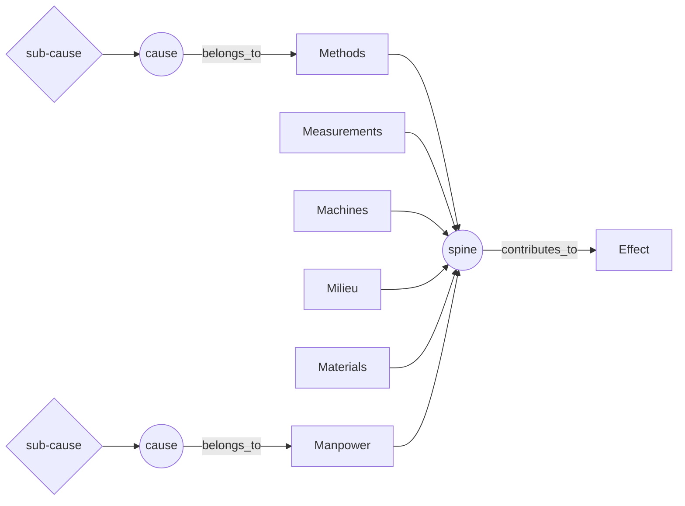

# Ishikawa (Fishbone) Diagram

> Files every candidate cause of one named effect onto six fixed ribs - Methods, Machines, Materials, Measurements, Milieu, Manpower - so a team searches the whole space of causes instead of the corner it already knows. Category: Strategic & Business Decomposition. Reference: [Ishikawa diagram](https://en.wikipedia.org/wiki/Ishikawa_diagram). [Open the 3D graph](./index.html) (needs internet for Three.js; on GitHub open via Pages or clone).

## What it decomposes

Kaoru Ishikawa taught this diagram to quality circles at Kawasaki Heavy Industries in the 1960s, and its object is narrow on purpose: one named effect. Not a plan, not an argument, not a system - a single observed bad outcome, stated as what was measured rather than as a diagnosis ("the scrap rate went from two per cent to nine per cent", not "the resin is wet"). What it takes apart is the space of that effect's possible causes, partitioned six ways before anyone has said anything about this particular problem. Causes hang on ribs, finer causes hang on causes, and every arrow runs toward the head of the fish.

The six ribs are the framework's whole move, and they are drawn before the meeting starts. That makes Ishikawa a breadth device rather than a depth device: it takes a team that already believes it knows the cause and marches it past five categories it did not intend to visit. Without the fixed partition a group lists causes in the order they occur to it, which is the order of who is in the room and what they own; the first plausible cause becomes the cause, and the categories nobody represents are never searched. Ishikawa's answer is not better reasoning, it is a fixed set of boxes that makes an absence visible.

That is also the whole provenance story of this framework, and it is unusual. The six 6M categories are **schema, not provenance**: they carry `provenance: "schema"`, need no quote, no confidence and no rationale, are drawn as neutral grey markers, stay visible when the LLM-derived layer is hidden, and are excluded from the fact/derived counts. They exist before anyone reads a word of the source, so calling them facts would be false and calling them inferences would be flattery. What the source decides is which ribs end up carrying causes and which stay bare - and the bare rib is the finding. In the classic example below, five ribs fill straight out of the minutes and the Machines rib does not, because nobody from maintenance came to the meeting.

## The slots



| Slot | What goes here | Typical provenance | Why that provenance |
|---|---|---|---|
| Effect | The one problem at the head of the fish, stated as an observed outcome, not a diagnosis. | fact | Someone said the thing was wrong. An effect that has to be inferred means there is no complaint to decompose. |
| Category (6M) | One of Methods, Machines, Materials, Measurements, Milieu, Manpower. | schema | The ribs exist before anyone reads a word of the source, so they are neither stated nor inferred: no quote, no confidence, no rationale, grey markers, outside the fact/derived counts, still drawn when derived items are hidden. Which ribs fill and which stay bare is the only part the source decides. |
| Cause | A candidate cause hanging on one category rib. | either | Mostly extracted: on a fishbone the causes are what people in the room say out loud. Derived when a bare rib has to be filled anyway, or when several stated causes turn out to share one mechanism. |
| Sub-cause | A finer cause under a cause: the reason behind the reason. | either | The level at which a source usually stops talking. Extracted while the speaker keeps going, inferred at the tip - which is why `idea_bearing_slot` is `subcause`. |

Two relations do the drawing. `belongs_to` runs cause to category, `contributes_to` runs cause to cause, sub-cause to cause, and category to effect along the spine. Both of the structural uses - the nine `belongs_to` bones and the six category-to-effect spine edges in each example - carry `provenance: "schema"` for the same reason the category nodes do: they are the fish, not a claim about the world. The consequence is the point. Hide the LLM-derived layer and the fish is still a fish: a spine, six ribs, and whichever causes were actually stated. That is exactly what a facts-only fishbone should look like, and it is what a paper one drawn from the minutes would have looked like.

Filing a given cause onto a given rib is still a judgment, and this graph does not pretend otherwise; it records the contestable ones in prose here rather than burying them in an edge confidence that no reader would ever inspect. Two live cases. In the TBPN example, `c_measure_nodata` ("no public manufacturing corpus") is filed on Measurements because the absence is a records failure - nothing was ever written down - but it could be argued onto Materials, since a training corpus is a missing input to everything Hadrian's software has to do. In the classic, `c_measure_lots` comes out of a sentence spoken by purchasing about drums of resin, which invites Materials; it sits on Measurements because what has failed is the record, not the supply. Both filings change which rib looks thin, and a reader who disagrees should move them.

## Example 1: Quality circle, Line 3: the scrap rate on the moulded housings

A synthetic scenario in the genre Ishikawa used at Kawasaki Heavy Industries: one defect, a circle of the people who touch the line, and a cause offered by each of them.

### Source text

> Minutes of the Thursday quality circle, moulding department.
>
> The scrap rate on the Line 3 housings has risen from two per cent to nine per cent over the last six weeks, and every rejected part shows the same surface defect, a cloudy streak near the gate.
>
> Ito, night shift: the two operators who joined in July were shown the job by a colleague on their first night, and nobody walked them through the written procedure.
>
> Sato, purchasing: we qualified a second resin supplier in the spring. We have been drawing from both suppliers' drums without recording which lot went into which run.
>
> Nakamura, process engineering: when the schedule tightened in August we cut the drying time on the resin from four hours to two, so that the line would not sit idle.
>
> Watanabe, inspection: the gauge at final inspection was last calibrated fourteen months ago, and the standard is twelve months.
>
> Kato, facilities: the dehumidifier in the material store failed at the start of the summer and has not been repaired, so the store has been running humid since June.
>
> Nobody from maintenance attended the circle, and the mould tool was not discussed.

### Decomposition

Nineteen nodes: 9 facts, 4 derived, and 6 schema categories that are counted as neither. No paraphrases.

Effect

- `effect` **Line 3 scrap rate 2% to 9%** [fact] The scrap rate on the Line 3 housings has gone from two per cent to nine per cent in six weeks, and every rejected part carries the same defect: a cloudy streak near the gate. "the scrap rate on the Line 3 housings has risen from two per cent to nine per cent over the last six weeks, and every rejected part shows the same surface defect, a cloudy streak near the gate" (sentence 2)

Category (6M) - the six ribs, `provenance: "schema"`, no quote and no confidence, drawn before the minutes were read

- `cat_methods` **Methods** [schema] Methods: the procedures, settings and written work instructions by which the job is done.
- `cat_measurements` **Measurements** [schema] Measurements: the gauges, calibrations and records by which the process is known.
- `cat_machines` **Machines** [schema] Machines: the press, the mould tool, the dryer and every other piece of equipment the job runs on.
- `cat_milieu` **Milieu** [schema] Milieu: the surrounding conditions - temperature, humidity, storage, season, the plant around the line.
- `cat_materials` **Materials** [schema] Materials: the resin, the colourant and every other physical input the line consumes.
- `cat_manpower` **Manpower** [schema] Manpower: the operators and inspectors, their training, experience and shift patterns.

Cause - nine, each filed on one rib by a `belongs_to` bone

- `c_methods_drying` (Methods) **Drying time cut from 4h to 2h** [fact] Process engineering halved the resin drying time, from four hours to two, in August. "we cut the drying time on the resin from four hours to two" (Nakamura, process engineering, sentence 6)
- `c_measure_gauge` (Measurements) **Gauge 14 months since calibration** [fact] The gauge used at final inspection was last calibrated fourteen months ago against a twelve-month standard. "the gauge at final inspection was last calibrated fourteen months ago, and the standard is twelve months" (Watanabe, inspection, sentence 7)
- `c_measure_lots` (Measurements) **No lot traceability per run** [fact] Resin is drawn from both suppliers' drums without any record of which lot went into which run, so no run can be traced back to its material. "We have been drawing from both suppliers' drums without recording which lot went into which run" (Sato, purchasing, sentence 5)
- `c_measure_drift` (Measurements) **Some of the 9% may be gauge drift** [derived 0.60] An uncalibrated gauge fails good parts as readily as it passes bad ones, so part of the rise from two per cent to nine per cent may be the instrument moving rather than the process. Rationale: The scrap rate is a number produced by the very gauge the circle has just reported as two months past its calibration interval. Nothing in the minutes separates a change in the process from a change in the measurement of it.
- `c_machines_tool` (Machines) **Mould tool never examined** [derived 0.50] The mould tool and its gate have not been inspected for wear, deposit or a temperature-control fault, any of which would put a defect exactly where this one appears. Rationale: The minutes end by recording that nobody from maintenance attended and the mould tool was not discussed. The Machines rib is empty because no one in the room owned it, not because the tool has been cleared; the defect's location at the gate is precisely where tool condition would show.
- `c_milieu_humid` (Milieu) **Material store humid since June** [fact] The material store has been running humid since June, so the resin sits in damp air before it reaches the dryer. "the store has been running humid since June" (Kato, facilities, sentence 8)
- `c_materials_supplier` (Materials) **Second resin supplier qualified** [fact] A second resin supplier was qualified in the spring and both suppliers' drums are now in use on the line. "we qualified a second resin supplier in the spring" (Sato, purchasing, sentence 4)
- `c_materials_moisture` (Materials) **Moisture in the resin at the gate** [derived 0.80] Resin carrying too much water into the mould flashes to steam at the gate and leaves a cloudy streak. Three of the reported causes - a second supplier of unknown drying behaviour, a drying step cut in half, and a store that has been damp since June - all move the same variable in the same direction. Rationale: The defect is specific: a cloudy streak at the gate is the standard signature of moisture in a moulded part. Three independently reported causes each raise the water the resin carries, and no other reported cause explains why every reject shows the same mark rather than a scatter of defects.
- `c_manpower_shadow` (Manpower) **July operators trained by shadowing** [fact] The two operators who joined in July were shown the job by a colleague on their first night, and nobody took them through the written procedure. "the two operators who joined in July were shown the job by a colleague on their first night, and nobody walked them through the written procedure" (Ito, night shift, sentence 3)

Sub-cause - three, each hanging off a cause rather than off a rib

- `sc_methods_schedule` (under `c_methods_drying`) **Schedule pressure in August** [fact] The change was made because the production schedule tightened in August and the line would otherwise have stood idle. "when the schedule tightened in August" (Nakamura, process engineering, sentence 6)
- `sc_milieu_dehumidifier` (under `c_milieu_humid`) **Store dehumidifier failed, unrepaired** [fact] The dehumidifier in the material store failed at the start of the summer and has still not been repaired. "the dehumidifier in the material store failed at the start of the summer and has not been repaired" (Kato, facilities, sentence 8)
- `sc_manpower_noonboarding` (under `c_manpower_shadow`) **No onboarding step uses the procedure** [derived 0.60] Being shown the job by whoever is on shift is the department's normal way of starting someone, not an exception made in July, so the written procedure is not the thing anyone is actually taught. Rationale: Ito reports the shadowing without qualification or apology and offers it as a standing condition of the night shift, which reads as routine practice rather than a one-off lapse. A single lapse would not be worth bringing to the circle.

Edges: 26, of which 15 are schema, 2 fact and 9 derived.

The 15 schema edges are the fish itself: six spine edges `sp_methods`, `sp_measurements`, `sp_machines`, `sp_milieu`, `sp_materials`, `sp_manpower`, each `contributes_to` from a category to `effect`; and nine `belongs_to` bones, one per cause - `b_methods_drying`, `b_measure_gauge`, `b_measure_lots`, `b_measure_drift`, `b_machines_tool`, `b_milieu_humid`, `b_materials_supplier`, `b_materials_moisture`, `b_manpower_shadow`.

Two edges are facts, each quoting the connective the speaker actually said:

- `f_schedule_drying` `sc_methods_schedule` -> `c_methods_drying` (contributes_to) [fact] "when the schedule tightened in August we cut the drying time on the resin from four hours to two" (Nakamura, process engineering, sentence 6)
- `f_dehum_humid` `sc_milieu_dehumidifier` -> `c_milieu_humid` (contributes_to) [fact] "the dehumidifier in the material store failed at the start of the summer and has not been repaired, so the store has been running humid since June" (Kato, facilities, sentence 8)

Seven derived edges carry `contributes_to`: `d_noonboarding_shadow` `sc_manpower_noonboarding` -> `c_manpower_shadow` (0.60); `d_supplier_moisture` `c_materials_supplier` -> `c_materials_moisture` (0.70); `d_drying_moisture` `c_methods_drying` -> `c_materials_moisture` (0.80); `d_humid_moisture` `c_milieu_humid` -> `c_materials_moisture` (0.75); `d_moisture_effect` `c_materials_moisture` -> `effect` (0.80); `d_drift_effect` `c_measure_drift` -> `effect` (0.60); `d_tool_effect` `c_machines_tool` -> `effect` (0.50). Two are grounding links: `g_drift_gauge` `c_measure_drift` -> `c_measure_gauge` (supported_by, 0.80) and `g_moisture_lots` `c_materials_moisture` -> `c_measure_lots` (supported_by, 0.65), whose rationale notes that the missing lot records are precisely why the moisture reading cannot be confirmed from the existing data.

### What the LLM added and why it helps

Hide the derived layer and the page shows the meeting: a spine, six ribs, and the five causes and two sub-causes five departments reported, each with its quote. The Machines rib is drawn - grey, attached, arrowed at the spine - and carries nothing. That bare bone is the diagram's best output and it costs no inference at all. The minutes say why: "Nobody from maintenance attended the circle, and the mould tool was not discussed." A rib is empty because nobody in the room owned it, not because the category has been cleared, and the category nobody represents is exactly where a cause sits undisturbed for six weeks. A fishbone whose Machines rib is bare after a moulding defect at the gate has not exonerated the tool; it has never asked. `c_machines_tool` [derived 0.50] is the only node on that rib, and its confidence sits deliberately at the bottom of the scale: it is a placeholder for an unasked question, not a finding, kept because the framework requires the category to be considered.

The other three inferences do work the minutes cannot. `c_materials_moisture` [derived 0.80] is the mechanism nobody stated: three causes reported by three departments - a new supplier (Materials), a halved dry (Methods), a damp store (Milieu) - all raise the water the resin carries, and moisture flashing at the gate produces the one defect every reject shows. Three derived `contributes_to` edges converge on it from three ribs (0.70, 0.80, 0.75) and one runs on to the effect (0.80). This is the first of two things a paper fishbone cannot draw: on paper, causes on different bones never meet, so a mechanism assembled from three ribs has nowhere to live and gets argued about verbally instead of recorded.

`c_measure_drift` [derived 0.60] turns the diagram on the effect itself: the scrap rate is a number produced by the gauge inspection has just reported as two months past calibration, so part of the rise may be the instrument rather than the process (`g_drift_gauge` grounds it on `c_measure_gauge`). `sc_manpower_noonboarding` [derived 0.60] promotes a July incident into a standing practice, changing the fix from retraining two operators to changing how anyone is started. The reader gains three things the source did not give: one mechanism explaining why every reject looks the same, a doubt about the number itself, and a named rib where nobody has looked.

## Example 2: from the TBPN transcripts: Chris Power of Hadrian: why the United States has no industrial base

Episode "defense-tech-day-reindustrialization-tariffs", 2025-03-27, [transcript](../../../tbpn-transcripts/transcripts/2025-03-27_defense-tech-day-delian-asparouhov-dhruva-rajendra-steven-simoni-chris-power-aaron-slodov-aj-piplica-connor-love-cameron-mccord.md); line numbers refer to it. Ishikawa needs one named bad outcome and several causes of it that are different in kind, not one cause chased down through five whys. Asked for the high-level pitch for Hadrian, Chris Power names the effect flatly at L5254 - "So we really don't have an industrial base anymore." - and then spends the next four hundred lines supplying a cause on every one of the six ribs: aging machinists, 1950s plant, no domestic machine tools, CAM software that emits bad code, no public process data, offshoring and export control. Every cause-level fact is his own, in the framework's home domain of manufacturing quality, and each is concrete enough to quote.

### Facts (quoted)

Thirteen of the twenty-four nodes and five of the thirty-three edges are facts; none are paraphrases. Quotes keep the transcript's errors - it renders ITAR as "high tire" - and `source_ref` is the speaker plus the line range in the file.

Effect

- `effect` **No US industrial base left** [fact] The United States no longer has an industrial base: the plant and the people needed to make high-precision machined and cast parts at scale are gone. "So we really don't have an industrial base anymore." (Chris Power, L5254-L5256)

Category (6M) - the same six ribs, `provenance: "schema"`, worded for this domain and drawn before the episode was read

- `cat_methods` **Methods** [schema] Methods: the processes, software workflows and programming steps by which parts are made.
- `cat_measurements` **Measurements** [schema] Measurements: the instruments, records and data by which the process is known - including whether any record of it exists at all.
- `cat_machines` **Machines** [schema] Machines: the machine tools, plant and capital equipment the work runs on.
- `cat_milieu` **Milieu** [schema] Milieu: the surrounding environment - trade policy, export control, the decisions the country made about where things get made.
- `cat_materials` **Materials** [schema] Materials: the physical inputs the system consumes - here the machine tools themselves, which a factory has to buy before it can make anything.
- `cat_manpower` **Manpower** [schema] Manpower: the people, their skills, their training and who they will take direction from.

Cause (fact)

- `c_methods_cam` (Methods) **CAM tools emit bad machine code** [fact] The digital manufacturing tools are hard to use, require an expert to drive, and generate poor assembly code for the machines to run. "all of those digital manufacturing tools, which are super hard to use and you need to be an expert, generate basically terrible assembly code that the machines run on" (Chris Power, L5406-L5414). Entities: Hadrian.
- `c_measure_nodata` (Measurements) **No public manufacturing corpus** [fact] There is no Stack Overflow for manufacturing data, so no off-the-shelf model has ever been trained on how these parts are actually made. "There is no stack overflow for manufacturing data. So none of the off-the-shelf models actually have ever been trained on any of this." (Chris Power, L5426-L5428). Entities: Hadrian.
- `c_machines_old` (Machines) **Installed plant is 1950s to 1980s** [fact] The capital equipment in naval facilities and in machine shops generally dates from somewhere between the 1950s and the 1980s. "a lot of the capital equipment in all of the naval facilities or, you know, everywhere in machine shops is, you know, somewhere between from the 1950s to the 1980s" (Chris Power, L5580-L5584)
- `c_milieu_itar` (Milieu) **Export control keeps the data offline** [fact] Because American manufacturing is largely export-controlled, none of its process data reaches the public internet. (The transcript renders ITAR as 'high tire'.) "because American manufacturing is largely regulated in high tire, there is no training data on the internet" (Chris Power, L5418-L5420)
- `c_milieu_offshore` (Milieu) **Offshored the base to China, 70s-90s** [fact] From the 1970s through the 1990s the country de-industrialised deliberately and handed its industrial power to China. "we de-industrialize the country from the 70s through the 90s and gave all our industrial power to China" (Chris Power, L5250-L5252)
- `c_materials_nocnc` (Materials) **US no longer makes CNC machines** [fact] The Air Force invented the CNC machine and the United States no longer manufactures CNC machines at all. "we invented, Air Force invented CNC machine, and we no longer make CNC machines in the US" (Chris Power, L5612-L5616)
- `c_manpower_aging` (Manpower) **Skilled machinists aging out** [fact] The people who do high-precision machining and castings are retiring, and no comparable cohort is coming up behind them. "the incredibly skilled workforce that does incredible technical things in high-precision machining or castings are all aging out" (Chris Power, L5252-L5256)
- `c_manpower_mba` (Manpower) **Machinists will not follow an MBA** [fact] A master machinist or welder will not take direction from an outside manager in a suit with a Harvard MBA, which is why buying up existing shops and running them from the top does not work. "no master machinist or welder is going to respect a kid who's got a suit and a Harvard MBA on coming and telling him what to do" (Chris Power, L5532-L5536)

Sub-cause (fact)

- `sc_methods_nocursor` (under `c_methods_cam`) **No Cursor for CAM exists** [fact] There is no AI assistant sitting on top of CAM programming the way Cursor sits on top of software code; Hadrian had to build that stack itself. "there's no cursor for cam that you're like on top of and just plugging in to speed things up" (John Coogan, L5398-L5400). Entities: Cursor, Hadrian. The one node in this example quoted from a host rather than from Power.
- `sc_machines_nocomputers` (under `c_machines_old`) **No computers on the old machines** [fact] That equipment cannot be automated at all, because most of it has no computer on it in the first place. "it's just impossible to automate it because often none of them have computers on them in the first place" (Chris Power, L5584-L5586)
- `sc_materials_china` (under `c_materials_nocnc`) **Chinese machine tools carry spyware** [fact] China is the largest machine-tool market, but its machines are not bought because of spyware, which leaves Germany, South Korea and Japan as the only sources. "the main manufacturing markets where we buy from is China's number one. We don't buy for them because they got spyware all over this stuff" (Chris Power, L5620-L5624). Entities: Haas.
- `sc_materials_conflict` (under `c_materials_nocnc`) **A conflict would cut off the capex** [fact] If a conflict starts, the country may not be able to buy the capital equipment to fill its factories, because it does not make that equipment itself. "can we even buy the amount of capital equipment to put in the factories because we don't produce that capital equipment in the US anymore" (Chris Power, L5632-L5634)

Fact edges. Five, each joining two fact nodes and quoting the span in which Power states the connection himself:

- `f_aging_effect` `c_manpower_aging` -> `effect` (contributes_to) [fact] "castings are all aging out. So we really don't have an industrial base anymore." (Chris Power, L5254-L5256)
- `f_offshore_aging` `c_milieu_offshore` -> `c_manpower_aging` (contributes_to) [fact] "we de-industrialize the country from the 70s through the 90s and gave all our industrial power to China. And now the incredibly skilled workforce that does incredible technical things in high-precision machining or castings are all aging out" (Chris Power, L5250-L5256)
- `f_itar_nodata` `c_milieu_itar` -> `c_measure_nodata` (contributes_to) [fact] "because American manufacturing is largely regulated in high tire, there is no training data on the internet" (Chris Power, L5418-L5420)
- `f_nocomputers_old` `sc_machines_nocomputers` -> `c_machines_old` (contributes_to) [fact] "somewhere between from the 1950s to the 1980s. And it's just impossible to automate it because often none of them have computers on them in the first place" (Chris Power, L5582-L5586)
- `f_conflict_nocnc` `sc_materials_conflict` -> `c_materials_nocnc` (contributes_to) [fact] "if the balloon goes up with the conflict you know can we even buy the amount of capital equipment to put in the factories because we don't produce that capital equipment in the US anymore" (Chris Power, L5630-L5634)

The fifteen schema edges are the same fish as before: six spine edges (`sp_methods`, `sp_measurements`, `sp_machines`, `sp_milieu`, `sp_materials`, `sp_manpower`) and nine `belongs_to` bones (`b_methods_cam`, `b_measure_nodata`, `b_machines_old`, `b_milieu_itar`, `b_milieu_offshore`, `b_materials_nocnc`, `b_manpower_aging`, `b_manpower_mba`, `b_manpower_loop`).

### Decomposition

Five derived nodes and thirteen derived edges. Fact nodes are referenced by id.

Cause

- `c_manpower_loop` (Manpower) **The skills gap is self-reinforcing** [derived 0.60] Offshoring removed the factories in which machinists were trained, so the cohort that would have replaced the retiring one was never made. The missing base and the missing workforce now each keep the other missing. Rationale: Power states both facts in adjacent clauses - the country gave its industrial power away from the 70s to the 90s, and the skilled cohort is now aging out - but asserts only that they happened, not that each sustains the other. The circularity is the reader's addition and it is what makes the effect stable rather than merely bad. Supported by `c_milieu_offshore`, `c_manpower_aging`.

Sub-cause - the idea-bearing slot

- `sc_methods_nofeedback` (under `c_methods_cam`) **Toolchain never sees its own output** [derived 0.55] Nothing carries the result of a cut back to the program that produced it, so the code that comes out of CAM is never scored against the part that came out of the machine. The tools stay bad because nothing measures them. Rationale: Power states both halves separately: the tools emit terrible assembly code, and no process data from American manufacturing reaches any model. If no run data returns to the toolchain, there is no mechanism by which the code could have improved; the connection between the two statements is the reader's. Supported by `c_measure_nodata`.
- `sc_measure_corpus_moat` (under `c_measure_nodata`) **The corpus only exists inside a factory** [derived 0.75] The only labelled manufacturing data that exists is what a running factory records day by day, and that record stays inside the company that owns the factory. The public shortage is therefore structural: the data is not missing, it is private. Rationale: Power gives both halves in one passage: export control keeps the data off the internet, and his own models work only because his factory is the one creating a labelled data set daily. The general rule follows directly from the pair he states. Supported by `c_milieu_itar`. Entities: Hadrian. Carries an `idea` field, quoted under "Where the opportunity shows up".
- `sc_machines_brownfield` (under `c_machines_old`) **Nobody sells a retrofit for it** [derived 0.60] Because the installed base has no controller to talk to, automation is sold only to new factories, and the existing plant is written off rather than upgraded - which is why it is still 1950s equipment. Rationale: Power's own conclusion from the old plant is that you have to build factories from scratch with new technology; he treats the installed base as impossible rather than as a market, which implies no retrofit path is on offer to the shops that own it. Supported by `sc_machines_nocomputers`. Carries an `idea` field.
- `sc_materials_nomaker` (under `c_materials_nocnc`) **No one is rebuilding machine tools** [derived 0.60] Nobody has restarted domestic machine-tool manufacturing, so the gap is not closing on its own; the working answer on offer is to buy faster from allied partners, which keeps the dependency in place. Rationale: Power names the absence, calls it a very hard question the country has to answer, and then describes his own response as growing fast and buying all the capital expenditure from allied partners. Treating the supply itself as fixed, rather than as something to rebuild, is the reader's inference from that workaround. Supported by `sc_materials_conflict`. Entities: Hadrian. Carries an `idea` field.

Derived edges. Seven carry `contributes_to`:

- `d_nocursor_cam` `sc_methods_nocursor` -> `c_methods_cam` [derived 0.75] Rationale: The host names the missing assistant and Power answers with the main reason the tools are bad. The link is stated across two speakers' turns rather than inside one, so it is a reading rather than a quotation.
- `d_nofeedback_cam` `sc_methods_nofeedback` -> `c_methods_cam` [derived 0.55] Rationale: A toolchain with no return path from the machine to the program cannot improve its own output; this explains persistence rather than origin.
- `d_corpus_nodata` `sc_measure_corpus_moat` -> `c_measure_nodata` [derived 0.70] Rationale: If the only corpus is generated privately inside working factories, the public absence is a consequence of where the data is made, not an accident of collection.
- `d_brownfield_old` `sc_machines_brownfield` -> `c_machines_old` [derived 0.60] Rationale: Plant stays at 1950s vintage partly because no supplier offers an upgrade path for it; the absence of a retrofit market is a cause of the age, not only a consequence.
- `d_china_nocnc` `sc_materials_china` -> `c_materials_nocnc` [derived 0.80] Rationale: Power lists the security exclusion of Chinese machines immediately after stating that the US makes none, inside one answer about where machine tools come from; the two are adjacent in the same argument but he never states the connective.
- `d_nomaker_nocnc` `sc_materials_nomaker` -> `c_materials_nocnc` [derived 0.60] Rationale: The absence persists because no one is rebuilding the capability; the workaround Power describes routes around the gap instead of closing it.
- `d_loop_effect` `c_manpower_loop` -> `effect` [derived 0.60] Rationale: A self-reinforcing loop is what turns a historical decision into a standing condition, which is why the effect is stated in the present tense.

Six are grounding links, every one derived: `g_loop_offshore` `c_manpower_loop` -> `c_milieu_offshore` (0.80); `g_loop_aging` `c_manpower_loop` -> `c_manpower_aging` (0.80); `g_brownfield_nocomputers` `sc_machines_brownfield` -> `sc_machines_nocomputers` (0.75); `g_corpus_itar` `sc_measure_corpus_moat` -> `c_milieu_itar` (0.80); `g_nofeedback_nodata` `sc_methods_nofeedback` -> `c_measure_nodata` (0.60); `g_nomaker_conflict` `sc_materials_nomaker` -> `sc_materials_conflict` (0.65).

### What the LLM added

This example shows how extraction-heavy Ishikawa is. Thirteen of eighteen content nodes and five of eighteen content edges are facts, because a speaker diagnosing his own industry names causes out loud - that is what the pitch is made of. The derived layer does not fill ribs: four of the five derived nodes are sub-causes sitting at the tips where Power stopped talking, and the fifth is the loop.

The facts alone already give more than a paper fishbone would. `f_itar_nodata` runs from `c_milieu_itar` on Milieu to `c_measure_nodata` on Measurements and is a **fact** edge - Power states the connective verbatim, export control to no training data - and `f_offshore_aging` crosses from Milieu to Manpower the same way. On paper neither link can be drawn, because bones do not touch. So this graph records cross-rib causation here without inferring anything at all, where the classic example had to infer it (`c_materials_moisture`).

The second thing a paper fishbone cannot draw is a loop, and `c_manpower_loop` [derived 0.60] is one. Power says the country offshored its industrial power in the 70s to 90s and says the skilled cohort is aging out; he never says each keeps the other in place. The inference closes the circle: the factories in which the next cohort would have been trained are the ones that left, so the effect is not a historical injury but a standing equilibrium, which is what justifies stating it in the present tense and why `d_loop_effect` points at the head of the fish. The framework still has no notation for it - the arrow runs one way and the circularity lives in the node's text - which is a real limit of Ishikawa and the reason to reach for [Systems Thinking](../../04-sensemaking-and-complex-systems/systems-thinking/README.md) when loops are the substance rather than a detail.

`sc_methods_nofeedback` [derived 0.55] joins two ribs the same way: bad CAM output (Methods) and no process corpus (Measurements) are both stated, and the inference is that the second is why the first never improves. Its confidence is low because "no data reaches models" and "no data returns to the toolchain" are not the same claim, and Power makes only the first.

### Where the opportunity shows up

The idea-bearing slot is the sub-cause (`idea_bearing_slot: "subcause"`), and the reason is structural rather than stylistic: on a fishbone the causes are the part the source says out loud, so the causes are mostly quotation. The tip of the bone - the reason behind the stated reason - is where the speaker stops and the reader continues, and an unstated reason behind a widely-agreed problem is the shape an underserved need usually takes. Three of the four derived sub-causes carry an `idea` field.

- `sc_measure_corpus_moat` **The corpus only exists inside a factory**, derived, confidence 0.75. Idea: "In any export-controlled or privacy-walled vertical - ITAR machining, clinical operations, utility field work - the defensible asset is the instrumented operation that generates a proprietary corpus, not a model fine-tuned on public text." Read from the node: the public data shortage is not an accident of collection but a consequence of where the data is made, so owning the operation is the only way to own the corpus. The highest confidence of the three, because Power states both halves of the argument in one passage.
- `sc_machines_brownfield` **Nobody sells a retrofit for it**, derived, confidence 0.60. Idea: "A retrofit layer - sensing, motion capture and closed-loop control bolted onto machine tools that have no computer - would open the 1950s-to-1980s installed base that every automation vendor currently writes off as unreachable." Read from the node: an installed base that every vendor treats as impossible is an unserved market described as a technical constraint.
- `sc_materials_nomaker` **No one is rebuilding machine tools**, derived, confidence 0.60. Idea: "A domestic machine-tool builder, or a financing vehicle that pre-buys allied capital equipment and leases it into US factories, sits upstream of every re-industrialisation plan and is not being built." Read from the node: Power routes around the gap by buying faster from allied partners, which is a workaround, not a closure, and the gap sits upstream of everyone else doing the same thing.

The two 0.60 readings sit in the plausible-but-contestable band for the same reason: each turns an absence the speaker reports into an absence of supply, and a market may be missing because it does not work rather than because nobody tried. `sc_methods_nofeedback` (0.55) carries no idea and should not be forced into one; `c_manpower_loop` (0.60) is derived but sits in the `cause` slot, and a loop is a diagnosis rather than an opening.

## Building a knowledge graph with this framework

### Node and edge types

Four node types, one per slot. `effect` is the root and there is exactly one per graph - a second effect is a second fishbone, not another node. `category` is fixed at six, always `provenance: "schema"`, created before extraction and never created from the text. `cause` and `subcause` are the content, distinguished only by what they attach to: a cause attaches to a rib, a sub-cause to a cause or to another sub-cause.

Two edge types. `belongs_to` runs cause to category and is always `provenance: "schema"` - it is the bone, and the only place the 6M filing decision is expressed. `contributes_to` does everything else and takes all three provenances: `schema` for the six category-to-effect spine edges; `fact` when both endpoints are fact nodes and one speaker states the link in quotable words (`f_itar_nodata`, `f_offshore_aging`); `derived` with a confidence for everything else, including every edge touching a derived node. `supported_by` runs derived to fact and is always derived. Fact nodes carry `source_quote` and `source_ref`, derived nodes `confidence` and `rationale`; schema nodes and schema edges carry none of those.

One counting convention decides what the viewer's stats line means: schema nodes and edges are excluded from the fact/derived counts. This set is 9 fact / 4 derived nodes for the classic and 13 fact / 5 derived for the TBPN one, plus 6 schema categories and 15 schema edges each.

### Fact or derived: rules of thumb

The honest summary is that **the effect and most causes are extracted; sub-causes and cross-rib links are inferred**. Ishikawa is not a coin flip per slot the way Toulmin is - causes on a fishbone are usually said out loud, which is why both examples here are roughly two-thirds fact.

- **Effect**: extracted, essentially always, in the speaker's own words. If you cannot quote it you have chosen a topic, not an effect. Empty means there is nothing to decompose; do not manufacture a bad outcome so the ribs have something to point at.
- **Category**: never extracted and never inferred. All six are created up front, worded for the domain (both examples reword them for their industry) and left standing whether or not anything hangs on them. Never drop a rib because the source is silent - the silence is the output.
- **Cause**: extracted by default. Every clause of the form "X is why", "we cut", "it hasn't been", "nobody does" is a cause node with a quote. Inferred in two cases, both worth it. A bare rib: one low-confidence cause naming the unasked question (`c_machines_tool`, 0.50), with a rationale saying the rib is unexamined rather than cleared. A shared mechanism: when several stated causes on different ribs move one variable, the variable is a derived cause (`c_materials_moisture`, 0.80) and the stated ones point at it.
- **Sub-cause**: extracted while the speaker keeps going one level down ("we cut the drying time *because* the schedule tightened"), inferred at the tip. Spend the inference budget here: it is where the framework runs past its source and where the ideas are. Confidence tracks whether the speaker supplied both halves of the reasoning (0.75) or one (0.55).
- **When a rib is empty**: leave it empty in the fact layer and record why, if the source says. Fill it, if at all, with one derived cause below 0.60 whose text is a question about the category, not an assertion about the world. A rib nobody owned is this framework's best diagnostic; overwriting it with a confident inference destroys the thing you drew the diagram to see.

### Extraction recipe

```text
Build ONE Ishikawa fishbone from <file>, lines <a>-<b>.

0. Create the six category nodes first, before reading for content:
   Methods, Machines, Materials, Measurements, Milieu, Manpower.
   provenance "schema". No quote, no confidence, no rationale.
   Add the six spine edges category -> effect, relation contributes_to,
   provenance "schema". Do this even if you expect a rib to stay empty.
1. Effect: the single bad outcome, quoted verbatim (5+ words), stated as what
   was observed, not as a diagnosis. Exactly one per graph.
2. Causes: every clause offered as a reason for the effect. Fact node with
   source_quote + source_ref. File each on ONE rib with a belongs_to edge,
   provenance "schema". If the filing is arguable, file it and note the
   alternative in prose - do not encode the doubt as an edge confidence.
3. Sub-causes: the reason behind each cause. Fact when the speaker gives it;
   derived (confidence + rationale) when you supply it. Attach to the cause
   with contributes_to, never to the rib.
4. Sweep the six ribs. For each rib with no cause, ask why: does the source
   say nobody covered it, or was it simply not raised? If a cause belongs
   there, add ONE derived cause below 0.60 whose rationale says the rib is
   unexamined, not cleared. Otherwise leave the rib bare.
5. Cross-rib links: where one cause causes another on a different rib, add a
   contributes_to edge. fact only if one speaker states the link and you can
   quote the connective; otherwise derived with a confidence.
6. Loops: if two causes sustain each other, say so in ONE derived node's text
   and point it at the effect. The notation has no cycle; the loop lives in
   the node.
7. supported_by from every derived node to the fact nodes it rests on, always
   derived.
Output one graph.json example: nodes [{id, slot, label <=40 chars, text,
provenance, source_quote+source_ref | confidence+rationale, idea?, entities}],
edges [{id, from, to, relation, provenance, confidence?, source_quote?,
source_ref?, rationale?}], idea_bearing_slot "subcause".
```

Afterwards run `node _meta/validate.mjs <dir>` for quotes, the paraphrase cap and derived-to-fact connectivity, then five checks it cannot make: exactly six category nodes exist and all are `schema`; every `belongs_to` and every category-to-effect edge is `schema`, so hiding derived items leaves a complete fish; every cause has exactly one `belongs_to`; no cause node's text is a restatement of the effect; and hide the derived layer by hand and confirm the remaining skeleton is still what the source said, bare ribs included.

### Failure modes

- **Ribs treated as findings.** The model writes rationales or confidences on the category nodes, or reports "six causal categories identified". Guard: the six are created in step 0 before any reading; schema nodes take no confidence, and the validator rejects `schema` outside a slot marked `structural: true`.
- **Empty ribs filled to look complete.** The strongest pull here: a model that has drawn six bones wants six bones populated, so it invents a plausible Machines cause. Guard: a bare rib may only be filled by a derived node below 0.60 whose text is a question about the category and whose rationale names the rib as unexamined. If the source gives nothing, the rib stays bare and that is the result.
- **Everything filed on Manpower.** The 6M partition is not mutually exclusive, and human error can be read into any cause, collapsing the diagram into one fat bone. Guard: file by what would have to change to fix it. A person following a bad procedure is Methods; an absent training step is Manpower.
- **Causes at the wrong depth.** "Bad process" as a cause, with everything real underneath it. Guard: a cause must be quotable and falsifiable as written; if it needs a sub-cause to mean anything, promote the sub-cause.
- **Five Whys smuggled in.** The model chases one cause down five levels and leaves the other ribs empty. Guard: breadth before depth - finish the rib sweep at cause level before adding any sub-cause, and stop two levels below the rib unless the source keeps going.
- **Cross-rib links marked as facts.** Adjacency in a transcript is not a stated connective. Guard: a `contributes_to` edge is fact only when the quote contains the link itself ("because ... there is no training data"); `d_china_nocnc` (0.80) is derived precisely because the two statements are adjacent but unjoined.
- **The effect restated as a cause.** "No industrial base" appearing on the Milieu rib as well as at the head. Guard: one effect node, and no cause may paraphrase it; a loop is handled by a node about the mechanism (`c_manpower_loop`), not a second copy of the effect.
- **The business reading written into the rationale**, so the inference and the opportunity cannot be told apart. Guard: the rationale says only why the inference follows from the quoted facts; the need or idea goes in the node's `idea` field, and only on sub-causes.

## Related frameworks

- [5 Whys](../five-whys/README.md): the depth twin. **Ishikawa is breadth, 5 Whys is depth** - six ribs and many candidate causes a level or two deep, against one cause driven to its root. Use the fishbone to find which cause is worth the ladder, then 5 Whys on that one.
- [MECE](../mece/README.md): the fishbone is a MECE-ish partition of cause space that is deliberately not mutually exclusive. The six ribs aim at collective exhaustiveness; the overlap between Methods and Manpower is tolerated because forcing exclusivity costs more argument than it saves. Reach for MECE when the partition itself must be defensible.
- [Theory of Constraints](../theory-of-constraints/README.md): the fishbone lists candidate causes and stops, with no ranking. TOC insists only one constraint binds at a time. Fishbone to enumerate, TOC to decide which one to act on.
- [Systems Thinking](../../04-sensemaking-and-complex-systems/systems-thinking/README.md): the fishbone cannot draw a feedback loop - every arrow runs one way to the head - which is exactly what `c_manpower_loop` is. When the loops are the substance rather than a detail, change frameworks.

[Library root](../../README.md).
