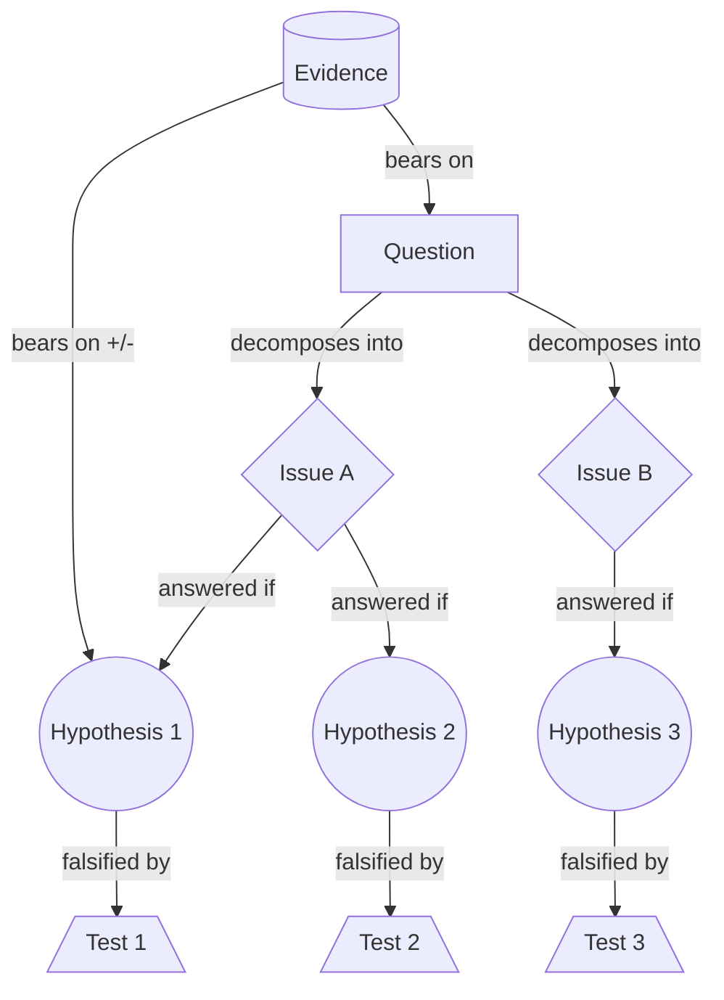

# Issue & Hypothesis Trees

> Breaks a decision question into MECE sub-questions, hangs a falsifiable candidate answer under each, and makes every hypothesis name the observation that would kill it. Category: Strategic & Business Decomposition. Reference: [Issue tree](https://en.wikipedia.org/wiki/Issue_tree). [Open the 3D graph](./index.html) (needs internet for Three.js; on GitHub open via Pages or clone).

## What this graph derived

Given that TBPN's hosts, on the 2025-08-09 recap, relayed the Wall Street Journal's report that Azure grew 39 percent with non-AI core infrastructure as the driver and volunteered five explanations for why infrastructure is outgrowing tokens-as-a-service, applying Issue & Hypothesis Trees we derived that two of those explanations really say the AI versus non-AI split is mismeasured, that a demand-side branch exists which nobody on air opened, and that four of the five came without the observation that would kill them; the opportunity that falls out is a workload-attribution layer reporting a defensible AI share from usage telemetry, and deployment tooling for the gap between announced enterprise AI programmes and inference in production.

Given that Northline Freight's chief executive asked the March board why operating profit fell 22 percent on flat revenue, with loads up, driver pay up 9 percent and empty miles up from 14 to 19 percent, and that sales blamed rate cuts against a new entrant while operations blamed the wage settlement, applying Issue & Hypothesis Trees we derived that the fall can only have come through revenue per load or cost per load, that a third explanation nobody raised fits the numbers best, deadhead eating the margin, and that each explanation can be killed by one cheap calculation; the reader gains the hypothesis the room never said and the tests it never proposed.

## What it decomposes

The object is one decision-relevant question, not a topic. The issue tree, also called a logic tree or a diagnostic tree, splits that question into sub-questions that are mutually exclusive and collectively exhaustive, and those into finer ones, until the leaves are things you could go and find out. It is the same MECE grouping Barbara Minto arranges top-down as an assertion, read instead as a question; Ethan Rasiel's *The McKinsey Way* popularised it and Conn and McLean's *Bulletproof Problem Solving* gives it its modern textbook form.

Two structures share that one diagram. **The `test` slot is what separates a hypothesis tree from a wish list.** An issue tree that stops at sub-questions is a map of what you would have to know: complete, tidy, and an invitation to gather everything. A hypothesis tree goes further: it hangs a falsifiable candidate answer under each branch and names, in advance, the observation that would kill it. Without the test slot you get the two failures the method was invented against: boil-the-ocean data gathering, because a tree of questions gives no reason to collect one number before another, and confirmation-seeking analysis, because in a large enough data set every explanation has something that looks like support. A test is a commitment made before looking; a hypothesis carrying none is a preference with a diagram around it.

The issue layer earns its keep differently: it tells you which candidate answers are missing. Speakers volunteer explanations in whatever order they think of them, and the set is whatever the room found sayable. A partition built from the structure of the question has branches whether or not anyone filled them, so an empty branch is visible as an empty branch rather than as nothing at all. That is why `hypothesis` is the idea-bearing slot: the answer nobody was willing to say out loud is the one worth writing down.

## The slots



| Slot | What goes here | Typical provenance | Why that provenance |
|---|---|---|---|
| Question | One decision-relevant question, not a topic. | either | Routinely stated: somebody asks it out loud. |
| Issue | A sub-question; siblings mutually exclusive and collectively exhaustive. | derived | Speakers jump from question to answers; the partition between is rarely spoken. |
| Hypothesis | A candidate answer, stated so that it could be wrong. | either | Volunteered freely; the sibling nobody would say has to be constructed. |
| Test | The observation, with its threshold, that would kill the hypothesis. | derived | Sources offer explanations and almost never offer what would refute their own. |
| Evidence | An observation already in hand, kept apart from the reading placed on it. | fact | A number without a quote is an invented number. |

## Example 1: Northline Freight: why did profit fall 22% on flat revenue?

The textbook profitability diagnostic, written so the two volunteered explanations arrive without tests and the minute records that nobody proposed a way to tell them apart.

### Source text

> Northline Freight hauls palletised goods for grocery wholesalers across four states. At the March board meeting the chief executive put one question on the table: operating profit fell 22 percent last year while revenue was flat, and the board wants to know why before it approves next year's budget.
>
> The finance pack in front of the directors gave the numbers. Revenue was $214 million, within one percent of the previous year. Loads delivered rose 4 percent, so average revenue per load fell. Driver pay rose 9 percent after the spring wage settlement. Fuel cost per mile was unchanged. Empty miles, meaning miles driven with no freight aboard, rose from 14 percent to 19 percent of total miles.
>
> Two explanations were offered at the table. The vice-president of sales said the freight market had softened and that Northline had cut rates to hold volume against a new low-cost entrant. The operations director said the problem was the wage settlement, and that no carrier could absorb a 9 percent increase in its largest cost line in one year.
>
> Nobody at the table proposed a way to tell the two apart, and the meeting moved on to the budget.

### Decomposition

Eighteen nodes, eight of them facts; all four tests are derived.

Question

- `q` **Why did profit fall 22%?** [fact] Operating profit fell 22 percent last year while revenue was flat, and the board wants to know why before it approves next year's budget. "operating profit fell 22 percent last year while revenue was flat, and the board wants to know why before it approves next year's budget" (chief executive, sentence 2)

Issue

- `i_rev` **Did revenue per load fall?** [derived 0.90] Revenue side: did the company earn less per unit of work delivered? Revenue was flat while loads rose, so revenue per load fell arithmetically; the open question is by how much and on which lanes. Rationale: Profit equals price per load times loads, minus cost per load times loads. With revenue and loads both stated, the price branch is forced as one of the two top-level places the fall can come from; the direction is arithmetic from e_rev and e_loads.
- `i_cost` **Did cost per load rise?** [derived 0.90] Cost side: did it cost more to deliver a load than it did the year before? Everything that is not a revenue-per-load effect lands here. Rationale: The mirror of i_rev in the same identity. Together the two are collectively exhaustive for a profit fall on flat revenue and mutually exclusive because one is measured per unit of revenue and the other per unit of cost.
- `i_price` **Did input prices rise?** [derived 0.85] Cost sub-branch one: did the price of an input go up while the amount consumed stayed the same? Wages, fuel, tolls, insurance. Rationale: Unit cost is a price times a quantity of input consumed, so splitting cost per load into price and consumption is the standard MECE cut and is the split that decides whether the fix is commercial or operational.
- `i_use` **More input used per load?** [derived 0.85] Cost sub-branch two: at unchanged input prices, did each load consume more driver hours, more miles or more equipment time than before? Rationale: The complement of i_price under i_cost. It is the branch the source's own numbers point at, since fuel cost per mile is stated as unchanged while empty miles rose, but nobody at the table opened it.

Hypothesis

- `h_rate` **Rates cut to hold volume** [fact] The freight market softened and Northline cut rates to hold volume against a new low-cost entrant, so the same work now earns less. "The vice-president of sales said the freight market had softened and that Northline had cut rates to hold volume against a new low-cost entrant." (vice-president of sales, sentence 10)
- `h_wage` **The 9% wage settlement did it** [fact] The spring wage settlement is the cause: no carrier can absorb a 9 percent increase in its largest cost line in a single year. "The operations director said the problem was the wage settlement, and that no carrier could absorb a 9 percent increase in its largest cost line in one year." (operations director, sentence 11)
- `h_empty` **Empty miles eat the margin** [derived 0.80] Deadhead is the cause: empty miles went from 14 to 19 percent of the total, so roughly one mile in five now earns nothing while still burning fuel and paid driver hours. Rationale: Nobody at the table raised this. It follows from two stated numbers that point the same way: fuel cost per mile is unchanged, so a rise in total cost per load has to come from miles or hours rather than input prices, and the deadhead share rose five points in the same year.
- `h_mix` **The extra loads are worse loads** [derived 0.60] The incremental freight is smaller and harder to route: loads rose 4 percent on flat revenue, so the marginal load is cheaper, and small scattered drops raise deadhead at the same time as they cut revenue per load. Rationale: A single mechanism that would make the rate story and the deadhead story the same story, which is what makes it worth testing before either is accepted. Contestable because the source gives no load-size or lane data at all; it is an inference from the arithmetic of flat revenue on rising volume.

Test

- `t_rate` **Rate per load, entrant lanes** [derived 0.85] Compare revenue per load on lanes where the new entrant bids against Northline with lanes where it does not. If rates fell by the same amount on both, the entrant is not what cut the rates. Rationale: The hypothesis names a specific cause, a competitor, so the falsifier is the natural control group: lanes the competitor does not touch. It is the cheapest observation that can kill the branch, and the data already exists in the rating system.
- `t_wage` **Profit at last year's wage** [derived 0.90] Recompute last year's operating profit holding driver pay at the previous rate. If the restated profit is still materially below the prior year, the settlement is not sufficient to explain a 22 percent fall. Rationale: For a cost-price hypothesis the falsification is arithmetic: hold the price constant and see whether the gap closes. Nearly forced by the structure of the claim, and it settles the branch in an afternoon with data already in the ledger.
- `t_empty` **Loaded-mile cost, both years** [derived 0.85] Compute cost per loaded mile in both years, excluding empty miles. If that number is flat, the extra cost is not being created by routing and the deadhead branch is dead. Rationale: Stripping empty miles out of the denominator isolates the claim: if the loaded work costs the same as it did, then the increase lives entirely in the miles that earn nothing, and if it does not, deadhead is not the mechanism.
- `t_mix` **Revenue, deadhead by load size** [derived 0.70] Split revenue per mile and empty miles per load by load-size decile. If the smallest loads show the same revenue per mile and the same deadhead as the largest, the mix story fails. Rationale: The hypothesis claims two effects arise from one cause, so the falsifier has to check both on the same cut of the data. Lower confidence than the other tests because load-size deciles may not be recorded and a proxy would weaken the result.

Evidence

- `e_rev` **Revenue $214m, flat YoY** [fact] Revenue was $214 million, within one percent of the previous year. "Revenue was $214 million, within one percent of the previous year." (finance pack, sentence 4)
- `e_loads` **Loads delivered rose 4%** [fact] Loads delivered rose 4 percent, so average revenue per load fell. "Loads delivered rose 4 percent, so average revenue per load fell." (finance pack, sentence 5)
- `e_pay` **Driver pay rose 9%** [fact] Driver pay rose 9 percent after the spring wage settlement. "Driver pay rose 9 percent after the spring wage settlement." (finance pack, sentence 6)
- `e_fuel` **Fuel cost per mile flat** [fact] Fuel cost per mile was unchanged. "Fuel cost per mile was unchanged." (finance pack, sentence 7)
- `e_dead` **Empty miles up 14% to 19%** [fact] Empty miles, meaning miles driven with no freight aboard, rose from 14 percent to 19 percent of total miles. "Empty miles, meaning miles driven with no freight aboard, rose from 14 percent to 19 percent of total miles." (finance pack, sentence 8)

Edges. Four are facts, each quoting the minute's own connective:

- `c1` `e_rev` -> `q` (bears_on) [fact] "operating profit fell 22 percent last year while revenue was flat" (chief executive, sentence 2)
- `c2` `q` -> `h_rate` (answered_if) [fact] "Two explanations were offered at the table. The vice-president of sales said the freight market had softened" (board minute, sentences 9-10)
- `c3` `q` -> `h_wage` (answered_if) [fact] "The operations director said the problem was the wage settlement" (operations director, sentence 11)
- `c4` `e_pay` -> `h_wage` (bears_on, label `+`) [fact] "no carrier could absorb a 9 percent increase in its largest cost line in one year" (operations director, sentence 11)

Twenty-one are derived.

- `c5` `q` -> `i_rev` and `c6` `q` -> `i_cost` (decomposes_into) [0.90 each], the two halves of the profit identity; `c7` `i_cost` -> `i_price` and `c8` `i_cost` -> `i_use` [0.85 each], price against consumption.
- `c9` `i_rev` -> `h_rate` [0.85], `c10` `i_rev` -> `h_mix` [0.60], `c11` `i_price` -> `h_wage` [0.90] ("A wage settlement is an input price change by definition, so the operations director's claim sits under the price branch"), `c12` `i_use` -> `h_empty` [0.85], all answered_if: each explanation filed under exactly one issue.
- `c13` `h_rate` -> `t_rate` [0.85], `c14` `h_wage` -> `t_wage` [0.90], `c15` `h_empty` -> `t_empty` [0.85], `c16` `h_mix` -> `t_mix` [0.70], all falsified_by: one falsifier per hypothesis, none of them stated in the minute.
- `c17` `e_dead` -> `h_empty` [0.85, `+`], `c18` `e_fuel` -> `h_empty` [0.75, `+`], `c19` `e_pay` -> `h_empty` [0.60, `+`], `c20` `e_loads` -> `h_mix` [0.65, `+`], `c21` `e_rev` -> `h_rate` [0.70, `+`], `c22` `e_loads` -> `h_rate` [0.70, `+`], all bears_on: the finance pack read for and against each branch.
- `c23` `i_use` -> `e_dead` [0.85], `c24` `t_empty` -> `e_dead` [0.80], `c25` `t_mix` -> `e_loads` [0.65], grounding links.

### What the LLM added and why it helps

Hide the derived layer and the graph is the meeting: a question, two explanations attached to it by the minute's own "two explanations were offered at the table", five numbers, and one number linked to one explanation by the operations director. Nothing says whether the two explanations compete or compound, and nothing would settle either. That is the wish list, and the source names it in its last sentence.

The derived layer supplies the partition first. `i_rev` and `i_cost` (0.90 each) are not categories chosen for tidiness; they are the two terms of profit = price per load x loads - cost per load x loads, so together they exhaust a profit fall on flat revenue, and `i_cost` splits again into the price of an input (`i_price`) and the amount consumed per load (`i_use`), the split that decides whether the answer is commercial or operational. Filed against that scaffold, the two volunteered explanations land in different branches. It also exposes `i_use`, empty in the minute and the branch the finance pack points at: fuel cost per mile is flat while deadhead rose five points, so cost per load can only have moved through miles or hours. `h_empty` (0.80) fills it; `h_mix` (0.60) joins `i_rev` as the one mechanism that would make the rate story and the deadhead story a single story.

Then the tests, all four derived, one per hypothesis, each written to kill rather than to confirm. `t_wage` (0.90) restates last year at the old wage: if the gap is still there, the loudest explanation in the room is finished, on data already in the ledger. `t_rate` (0.85) uses lanes the entrant does not bid as a control; `t_empty` (0.85) strips empty miles out of the denominator, so a flat loaded-mile cost kills the deadhead claim; `t_mix` (0.70) is lower because the load-size cut may not exist. What the reader gains is an order of work: two of the four branches can be closed this week.

## Example 2: from the TBPN transcripts: Azure grew 39% and the driver was the non-AI business

Episode "Weekly Recap: GPT-5, Apple Sitting on $100B, Disney Enters the AI Race, Marc Andreessen", 2025-08-09, [transcript](../../../tbpn-transcripts/transcripts/2025-08-09_weekly-recap-gpt-5-apple-sitting-on-100b-disney-enters-the-ai-race-marc-andreessen.md); line numbers refer to it. Reading the Wall Street Journal on Microsoft's June quarter, a host flags the number and says outright that it admits several readings (L108-L112). The diagnostic question follows in one sentence (L264-L266), and the hosts then volunteer five answers, each with its own stated connective back to the question. Not one arrives with a way to tell it from the others, and the segment's only falsification condition is thrown away 200 lines later, attached to nothing.

### Facts (quoted)

Thirteen of the twenty-six nodes and six of the thirty-six edges are facts, no paraphrases. Quotes keep the transcript's own errors; `source_ref` gives speaker and line range.

Question

- `q` **Why is IaaS outgrowing tokens?** [fact] Why is Azure's infrastructure-as-a-service business growing faster than its tokens-as-a-service product, when the expectation was that enterprises buying AI would show up as API revenue? "so the question is like, why is their infrastructure as a service growing faster than their tokens as a service product?" (host, L264-L266)

Hypothesis

- `h_mig` **Firms go to cloud for AI** [fact] Companies decide that AI is going to matter, and the first thing they do about it is get their data and workloads onto the cloud, exactly as companies bought a computer when they heard about the internet. "and now you could see something you know where companies say hey this AI thing might be big we should get on the cloud" (host, L194-L198)
- `h_comp` **AI pulls ordinary IT with it** [fact] An AI programme is not only inference: the same customer needs more databases, more data in them and more CPU workloads, and Microsoft has no trouble serving any of that. "Well, we're also going to need more databases. We're going to need more data in those databases. We're going to need more CPU workloads. We're going to need more of everything." (host, L292-L296)
- `h_gpu` **The AI line is supply capped** [fact] Microsoft is massively supply constrained on the GPU side and carries a backlog in the tens or hundreds of billions that it cannot fulfil, so the tokens business cannot grow at the rate demand would allow. "couldn't the other factor here be that they are massively supply constrained on the GPU side, and they have this, you know, multi-tens of billions or hundreds of billions of dollars of backlog that they can't fulfill." (host, L272-L276)
- `h_bucket` **AI booked as core infra** [fact] Plenty of genuine AI activity sits inside the core infrastructure bucket and cannot be seen from outside: a customer renting GPU virtual machines, storage for training data and networking to move it is doing AI, and none of it is booked as an AI service. "There's also an interesting thing where tons of AI stuff can technically be happening inside the core infrastructure bucket. You just don't necessarily know what's in there." (host, L300-L304)
- `h_oai` **ChatGPT lands in core infra** [fact] OpenAI is not served through the Azure AI API, so ChatGPT's own consumption may be reported as Azure core infrastructure, and the single largest AI workload on the platform would then be counted as non-AI. "And then I also saw a post that potentially chat GPT count. as Azure core infrastructure, because they're not, they're not serving chat GPT through the Azure AI API." (host, L324-L328)

Test

- `t_oai` **Unless growth is all OpenAI** [fact] The stated falsifier: none of the reassurance about diversified non-AI revenue means anything if all of the growth is coming from OpenAI. "Of course, none of that means anything if all of the growth is coming from Open AI." (host, L488-L490)

Evidence

- `e_driver` **Core infra drove the 39%** [fact] Microsoft did not give a comparable AI and non-AI breakdown for the cloud unit's 39 percent growth in the June quarter, but said the core infrastructure business, its term for the non-AI cloud, was the driver. "While the company didn't give a comparable breakdown, a comparable breakdown of the cloud unit's 39% growth in its June quarter, it said that the core infrastructure business, Microsoft's lingo for its non-AI cloud business, was the driver." (host reading the Wall Street Journal, L124-L126)
- `e_margin` **Non-AI margin 73% vs 30-40%** [fact] Non-AI gross margins within Azure were around 73 percent, against 30 to 40 percent for AI, because of the cost of setting up AI infrastructure. "non-AI gross margins within Azure were around 73%. Wow. That compares to 30 to 40% gross margin for AI." (host reading the Wall Street Journal, L530-L532)
- `e_aws` **AWS grew 17.5% that quarter** [fact] Amazon said its cloud unit grew at 17.5 percent in the June quarter, less than half Azure's rate in the same three months. "Amazon on Thursday said its cloud unit grew at 17.5% in the June quarter," (host reading the Wall Street Journal, L760)
- `e_m365` **Microsoft 365 grew 16%** [fact] The Microsoft 365 commercial cloud business, which houses the remotely accessed versions of Word and Excel, grew 16 percent from a year earlier. "So Microsoft 365 commercial cloud business, which houses remotely access versions of Word, Excel, other productivity software. That grew at 16% from a year earlier." (host, L406-L408)
- `e_chatgpt` **ChatGPT at about $1bn a month** [fact] ChatGPT is generating something like a billion dollars a month in revenue, everyone uses the app and it is installed everywhere. "like they're generating what a billion dollars a month in revenue at this point everyone uses the app it's installed everywhere" (host, L492-L494)
- `e_pe` **Stock up 40%, P/E over 33** [fact] Microsoft's stock is up nearly 40 percent since the beginning of April, pushing its forward price to earnings multiple above 33. "The company's stock is up nearly 40% since the beginning of April, pushing its forward price earnings multiple above 33." (host reading the Wall Street Journal, L788)

Fact edges. Six, each joining two fact nodes and quoting the turn in which a host states the connection: one attaches the anomaly to the question, the other five attach a volunteered explanation to it.

- `x1` `e_driver` -> `q` (bears_on) [fact] "So this is the key stat from the earnings call that the Wall Street Journal is highlighting, and then we'll kind of dig into this number and what it means because there's a lot of different explanations for what could be going on." (host, L108-L112)
- `x2` `q` -> `h_mig` (answered_if) [fact] "And so the integration that comes from being in the Azure ecosystem, that could be a driver." (host, L218-L220)
- `x3` `q` -> `h_gpu` (answered_if) [fact] "Meanwhile, they had a, you know, more kind of like predictability on the traditional data center cloud side that they were able to scale up to. So that feels like a potentially like a pretty big driver here." (host, L278-L282)
- `x4` `q` -> `h_bucket` (answered_if) [fact] "I'm going to need a bunch of networking to move that data around when I do a training run. So that could be driving core infra up." (host, L310-L314)
- `x5` `q` -> `h_oai` (answered_if) [fact] "It's like, opening I just came and said, give us a whole bunch of them. The headline itself ends up becoming pretty misleading." (host, L328-L330)
- `x6` `q` -> `h_comp` (answered_if) [fact] "And Microsoft's like, yeah, of course, we can definitely get you a whole bunch more hard drives and a whole bunch more CPUs. We're not constrained on that at all. And the KAPX is keeping up so they're able to service that." (host, L296-L300)

### Decomposition

Thirteen derived nodes and thirty derived edges; fact nodes are referenced by id.

Issue (all derived; the source has no partition)

- `i_meas` **Is the split measured right?** [derived 0.85] Measurement branch: does the reported boundary between core infrastructure and AI services track the workload, or only the SKU the customer happened to buy? Rationale: The observation is a ratio between two reported buckets, so before any demand story is entertained the first branch has to be whether the buckets mean what their names say. Two of the volunteered explanations turn out to live here, which is what a MECE cut is supposed to reveal. Attaches directly to the fact node `q`.
- `i_iaas` **Did non-AI demand rise?** [derived 0.85] Numerator branch: is something genuinely pulling infrastructure-as-a-service up, independently of anything happening on the AI side? Rationale: A ratio can move because the numerator rose for reasons of its own. This branch is exclusive of the measurement branch because it concerns real workloads rather than how they are booked. Attaches directly to `q`.
- `i_supply` **Is AI capped by supply?** [derived 0.85] Denominator branch, supply side: is the tokens business growing slowly because Microsoft cannot serve more, rather than because customers do not want more? Rationale: The other way a ratio moves is that the denominator is held down, and a held-down denominator is either a supply or a demand story. Separating the two is the cut that matters commercially, because one resolves with capital and the other does not. Attaches directly to `q`.
- `i_demand` **Is enterprise AI demand low?** [derived 0.80] Denominator branch, demand side: is enterprise appetite for bought inference simply smaller than the capex implies, whatever Microsoft is able to serve? Rationale: The complement of the supply branch, and the branch nobody on air was willing to open: across the whole segment five explanations are volunteered and none of them is that the demand is not there. Its emptiness in the source is the strongest evidence that the tree was never made MECE. Attaches directly to `q`.

Hypothesis (five are facts; these two were never stated)

- `h_blind` **AI revenue is unmeasurable** [derived 0.60] If AI work is billed as storage, networking and raw GPU capacity, then the AI versus non-AI split every hyperscaler reports is an artefact of which SKU the customer bought, and no outside party can separate AI spend from ordinary IT spend at all. Rationale: This is the sibling the two measurement hypotheses imply but nobody states: h_bucket and h_oai each describe a specific leak, and taken together they say the reported category is not a measurement of anything. Contestable because Microsoft has internal telemetry it simply chooses not to publish, so the problem may be disclosure rather than measurement. Supported by `e_driver`; `e_margin` bears on it. Carries an `idea` field, quoted under "Where the opportunity shows up".
- `h_pilot` **Enterprise AI mostly pilots** [derived 0.55] The tokens line lags because enterprise AI is mostly still pilots that consume very little inference, while the same buyers provision the storage and CPU for programmes they have announced but not shipped. Rationale: The only candidate answer under the demand branch, constructed because that branch is empty in the source. It reconciles two stated facts that otherwise conflict: infrastructure bought in anticipation of AI, and an AI services line that does not grow with it. Speculative because the source contains no enterprise deployment data whatsoever. Supported by `e_m365`; `e_chatgpt` bears on it, negatively. Carries an `idea` field, quoted under "Where the opportunity shows up".

Test (seven of the eight; only `t_oai` was spoken)

- `t_mig` **Infra growth by cohort** [derived 0.75] Split core infrastructure growth by customer cohort. If it is concentrated in accounts that were already cloud-native, the story about on-premise enterprises migrating in anticipation of AI is not what is driving the number. Rationale: The hypothesis is specifically about newly migrating enterprises, so the falsifier is the cohort cut that separates them from existing cloud customers expanding. Distinct from t_oai, which kills the same branch only in the extreme single-customer case. Attaches to the fact node `h_mig`.
- `t_comp` **Non-AI account growth** [derived 0.75] Compare core infrastructure growth in accounts that also buy AI services with growth in accounts that buy none. If the two grow at the same rate, ordinary IT demand is rising for its own reasons and AI is not pulling it. Rationale: The claim is one of complementarity between two purchases, so the falsifier is the account-level split that breaks the pairing. It is the cleanest available observation because it holds the macro environment constant across both groups. Attaches to `h_comp`.
- `t_gpu` **AI flat as backlog clears** [derived 0.85] Track the AI services line against reported GPU fleet growth and backlog. If the fleet expands and the backlog shrinks while AI revenue growth stays flat, supply was not the binding constraint. Rationale: A supply-constraint claim predicts that revenue moves when the constraint loosens, so watching revenue while the constraint demonstrably loosens is the direct refutation. Both quantities are disclosed at least qualitatively on the earnings call. Attaches to `h_gpu`.
- `t_bucket` **GPU VMs, training storage** [derived 0.80] Ask for the core infrastructure bucket broken out by SKU. If GPU virtual machines and training-adjacent storage are flat while the bucket grows, AI work leaking into core infrastructure is not what is moving it. Rationale: The hypothesis names the exact SKUs through which the leak would occur, so the falsifier is those SKUs holding still while the total rises. The data exists inside Microsoft; only the disclosure is missing. Attaches to `h_bucket`.
- `t_disclose` **Where OpenAI is booked** [derived 0.85] One disclosure settles it: if Microsoft states that OpenAI's consumption is reported inside Azure AI services rather than core infrastructure, the hypothesis dies outright. Rationale: A claim about accounting classification is falsified by the classification itself, so this is a single-question test rather than an analysis. Its confidence is high because the answer is unambiguous once given, which is also why the segment notes it was not given. Attaches to `h_oai`.
- `t_blind` **Two estimates agree** [derived 0.70] Have two independent estimates of Azure's AI revenue built by different methods, a customer survey and SKU-level telemetry, land within a few points of each other. If they agree, the category is measurable after all and only the disclosure is missing. Rationale: A claim that a quantity is unmeasurable is refuted by two unrelated measurement routes converging on it. Confidence is held below the arithmetic band because agreement between two methods can also be coincidence at a single point in time. Supported by `e_margin`.
- `t_pilot` **Inference vs storage** [derived 0.65] Follow the ratio of inference spend to storage spend inside the same enterprise accounts over four quarters. If inference rises in step with storage, the workloads are in production and the pilot-stall reading is wrong. Rationale: The hypothesis predicts a divergence between two spend lines in the same account, so the falsifier is those lines moving together. Confidence is modest because the ratio would also move if customers ran production inference outside Azure. Supported by `e_chatgpt`.

Derived edges, thirty of the thirty-six.

Four build the issue layer under the question, all `decomposes_into`:

- `x7` `q` -> `i_meas` [0.85] Rationale: First branch for any question about a ratio between two reported categories: whether the categories measure what their names claim.
- `x8` `q` -> `i_iaas` [0.85] Rationale: The numerator branch: the ratio can move because infrastructure demand genuinely rose.
- `x9` `q` -> `i_supply` [0.85] Rationale: The denominator branch on the supply side: the tokens line may be capped by what can be served.
- `x10` `q` -> `i_demand` [0.80] Rationale: The denominator branch on the demand side, and the complement that makes the four collectively exhaustive; the source never opens it.

Seven re-file the hypotheses under the issues they answer, all `answered_if`:

- `x11` `i_meas` -> `h_bucket` [0.90] Rationale: The hypothesis is explicitly about work landing in the wrong bucket, so it answers the measurement issue and nothing else.
- `x12` `i_meas` -> `h_oai` [0.85] Rationale: A claim about where one customer's consumption is booked is a classification claim, so it sits beside h_bucket rather than under a demand branch.
- `x13` `i_meas` -> `h_blind` [0.60] Rationale: The general form of the same branch: not one leak but the category failing to measure anything.
- `x14` `i_iaas` -> `h_mig` [0.85] Rationale: Enterprises moving on-premise workloads to the cloud is a real increase in infrastructure demand, which is what this issue asks about.
- `x15` `i_iaas` -> `h_comp` [0.85] Rationale: Complementary demand is also a genuine rise in the numerator, distinguished from h_mig by whether the customer is new to the cloud or already on it.
- `x16` `i_supply` -> `h_gpu` [0.90] Rationale: A stated GPU constraint with an unfulfillable backlog is precisely the supply-side answer this issue calls for.
- `x17` `i_demand` -> `h_pilot` [0.55] Rationale: The only candidate answer available under the demand branch, and it had to be constructed because no speaker offered one.

Eight hang a falsifier, all `falsified_by`; `x18` is derived although both endpoints are facts, because nobody joined them:

- `x18` `h_mig` -> `t_oai` [0.70] Rationale: The speaker states the falsifier but never attaches it to a hypothesis. It kills this branch in the limit: if one AI-native account is the whole of the growth, no enterprise migration is happening in the number.
- `x19` `h_mig` -> `t_mig` [0.75] Rationale: The cohort cut refutes the migration story in the general case, not only in the single-customer extreme t_oai covers.
- `x20` `h_comp` -> `t_comp` [0.75] Rationale: A complementarity claim is refuted by the two purchases moving independently across accounts.
- `x21` `h_gpu` -> `t_gpu` [0.85] Rationale: A binding constraint predicts revenue moves when it loosens; revenue not moving refutes it.
- `x22` `h_bucket` -> `t_bucket` [0.80] Rationale: The hypothesis names the SKUs the leak runs through, so those SKUs holding flat while the bucket grows refutes it.
- `x23` `h_oai` -> `t_disclose` [0.85] Rationale: A classification claim is settled by the classification, so a single disclosure is the whole test.
- `x24` `h_blind` -> `t_blind` [0.70] Rationale: A claim of unmeasurability is refuted by two independent measurement methods agreeing.
- `x25` `h_pilot` -> `t_pilot` [0.65] Rationale: The hypothesis predicts inference and storage spend diverge inside the same account; them moving together refutes it.

Seven read a number for or against a branch, all `bears_on`; two are negative:

- `x26` `e_aws` -> `h_mig` [0.60, label `-`] Rationale: If a broad enterprise migration to cloud were the driver, the largest infrastructure vendor should be catching the same wave; AWS grew at less than half Azure's rate in the same quarter, which points to something specific to Microsoft.
- `x27` `e_m365` -> `h_comp` [0.65, label `+`] Rationale: Sixteen percent growth in a mature productivity suite is consistent with a broad expansion of every technology line rather than an AI-specific one, which is the mechanism this hypothesis claims.
- `x28` `e_driver` -> `h_bucket` [0.55, label `+`] Rationale: Microsoft declining to give the AI and non-AI breakdown for the quarter is weakly consistent with a boundary that is awkward to defend, though refusing to disclose has many other explanations.
- `x29` `e_chatgpt` -> `h_oai` [0.65, label `+`] Rationale: At roughly a billion dollars a month of consumer revenue, ChatGPT's own infrastructure consumption is large enough that where it is booked materially moves the reported split.
- `x30` `e_chatgpt` -> `h_pilot` [0.60, label `-`] Rationale: Inference demand at that scale is not weak in the market as a whole, so the pilot-stall reading can only be about enterprises, which narrows the hypothesis and lowers what it explains.
- `x31` `e_margin` -> `h_blind` [0.60, label `+`] Rationale: A 73 percent against 30 to 40 percent margin gap means the AI and non-AI mix changes what the business is worth, which turns an inability to measure the split from a definitional quibble into a priced problem.
- `x32` `e_pe` -> `q` [0.70] Rationale: The question is decision-relevant because the multiple is being paid for an AI growth story; if the growth is ordinary IT at 33 times forward earnings, the price is set on the wrong driver.

Four are grounding links, all `supported_by`:

- `x33` `h_blind` -> `e_driver` [0.60], `x34` `h_pilot` -> `e_m365` [0.50], `x35` `t_blind` -> `e_margin` [0.60], `x36` `t_pilot` -> `e_chatgpt` [0.55].

### What the LLM added

Count the provenance and the pattern is stark. Of the seven hypotheses, five are fact nodes quoted from the hosts. Of the eight tests, exactly one is a fact — `t_oai` — and it is not a test as spoken: it arrives 200 lines after the hypotheses, in a subordinate clause, attached to nothing. Even hanging it on `h_mig` is an inference (`x18`, 0.70). **Sources volunteer hypotheses freely and almost never volunteer tests.** Turn the derived layer off and what remains is exactly the wish list: a question, five explanations joined to it by the hosts' own "that could be a driver", six numbers, and no way to tell any from any other.

Above the hypotheses the derived layer builds an issue layer that exists nowhere in the source. The cut is not a taste in categories: the observation is a ratio between two reported buckets, so it can move for exactly four reasons — the measurement misassigns work (`i_meas`), the numerator genuinely rose (`i_iaas`), the denominator is capped by supply (`i_supply`), or the denominator is capped by demand (`i_demand`). They are exclusive because a booking question is not a workload question and a supply cap is not a demand cap, and exhaustive because a ratio has only a numerator, a denominator and a definition. Re-filed against it, `h_bucket` and `h_oai` collapse into one branch (`x11` 0.90, `x12` 0.85), which is why `h_blind` (0.60) earns a node as their general form.

The sharpest finding is what the partition shows to be missing. **`i_demand` is empty in the source.** Five explanations were volunteered on air and not one was that enterprise demand for bought inference is simply weaker than the capex implies. `h_pilot` (0.55) had to be constructed to fill it, and it carries an `idea`. That is the return on a MECE issue layer: it exposes the branch nobody was willing to open.

Below the hypotheses the layer supplies seven falsifiers, each written to kill: `t_disclose` (0.85) is one question to investor relations; `t_gpu` (0.85) watches the AI line while the constraint demonstrably loosens, which is what a supply-cap claim predicts; `t_comp` and `t_mig` (0.75) are account-level cuts that break the pairing each story depends on. Confidence tracks how cleanly an observation would settle a branch, not how likely the hypothesis is: `t_pilot` sits at 0.65 because the same ratio would move if a customer ran inference outside Azure. And `x32` (0.70) attaches the forward multiple to the question itself, which makes it decision-relevant rather than interesting.

### Where the opportunity shows up

The idea-bearing slot is `hypothesis`, and both nodes carrying an `idea` are derived: the two candidate answers the room did not supply.

- `h_blind` **AI revenue is unmeasurable**, derived, confidence 0.60. Idea: "Cloud bills cannot currently distinguish AI spend from ordinary IT spend, so an independent workload-attribution layer that reads usage telemetry and reports a defensible AI share is an underserved need for CFOs justifying budgets and for analysts pricing these companies." Read from the node: if the reported split is an artefact of which SKU a customer bought, then nobody inside or outside the company has the number, and `e_margin` (73 percent against 30 to 40 percent) is what makes the missing number expensive rather than academic.
- `h_pilot` **Enterprise AI mostly pilots**, derived, confidence 0.55. Idea: "The gap between an announced AI programme and inference actually in production is where enterprise budget is stranding, so evaluation, data plumbing and procurement-ready deployment tooling may address a larger near-term market than the model APIs themselves." Read from the node: infrastructure is being provisioned for programmes that are not yet serving traffic, which is the same observation the tokens line makes from the other side.

Both sit in the 0.50-0.65 band, plausible but contestable. `h_blind` is contestable because Microsoft plainly has the telemetry and may simply not publish it, so the problem could be disclosure rather than measurement — which is what `t_blind` (0.70) would decide. `h_pilot` is the more speculative at 0.55 because the transcript holds no enterprise deployment data at all; it was constructed to fill an empty MECE branch, and its confidence says so. That is the intended pattern: the branch nobody opened is where the idea is, and the low confidence is the price of it being there at all.

## Building a knowledge graph with this framework

### Node and edge types

Node types are the five slots. One tree is one connected component headed by exactly one `question` node; `issue` nodes form the internal layer, `hypothesis` nodes are the leaves of the logic, `test` nodes hang below them, and `evidence` nodes sit outside the tree and point into it. Edge types are the four relations plus the reserved grounding link: `decomposes_into` (question to issue, or issue to sub-issue, never to a hypothesis), `answered_if` (issue to hypothesis, or question to hypothesis where a speaker attaches an explanation directly and no issue layer was spoken, as `c2`, `c3` and `x2`-`x6` do), `falsified_by` (hypothesis to test, and only that pair), `bears_on` (evidence to hypothesis, or to the question the observation makes a puzzle, with `label` `+` or `-`), and `supported_by` (derived to fact, always derived).

Facts carry `source_quote` and `source_ref`; derived nodes carry `confidence` and `rationale`; `entities` use the spellings in `tbpn-transcripts/extractions/`. An edge is a fact only when both endpoints are facts and one turn states the connection in quotable words — a rule that bites hardest on `falsified_by`: `x18` joins two facts and is still derived, because the host who said the falsifier never said what it falsified.

### Fact or derived: rules of thumb

The first rule is the framework's whole point. **A test node is essentially always derived, and a hypothesis without a test node should not be in the tree at all.** Eleven of the twelve tests across both examples are inferred, and the exception was spoken without being attached to anything. When a hypothesis has no volunteered falsifier, never skip the test node and leave the hypothesis bare: construct the observation that would kill it, or conclude the claim is not falsifiable as stated and take it out. A bare hypothesis is a wish, and it will read as a finding later.

- **Question**: extracted, usually — the one slot routinely a fact, because somebody asks it out loud (`q` in both examples). Inferred when a segment circles an anomaly without anyone forming the question; worth it because every other slot's placement depends on the wording. Empty: no tree — do not build one over a topic.
- **Issue**: inferred, nearly always; the layer is derived in both examples and belongs between the question and the volunteered hypotheses, not instead of them. Derive it from the structure of the quantity the question asks about — an accounting identity, the terms of a ratio, a funnel's stages — not from the answers you already have, or you will relabel the explanations as branches and lose the test for exhaustiveness. Empty: without a defensible partition you have a list, not a tree; say so rather than invent categories.
- **Hypothesis**: extracted whenever a speaker volunteers a candidate answer, which they do freely (five of seven in the TBPN example, two of four in the classic). Two cases need inference. The generalising sibling: two stated hypotheses that are instances of one broader claim earn a node for that claim (`h_blind`, 0.60). And, more important: **when a branch has no volunteered hypothesis, do not leave the branch out.** Dropping an empty branch is how a tree stops being MECE, and it hides the finding. Construct a candidate answer, mark it derived, let the low confidence carry the uncertainty (`h_pilot`, 0.55, under `i_demand`). If you cannot construct one, keep the issue node childless; the empty branch is itself a result.
- **Test**: derived, per the rule above. Extracted only when a speaker names a condition that would make an explanation wrong (`t_oai`), and even then the `falsified_by` edge is derived unless the same turn says which hypothesis it kills. Write it as an observation with a direction and, where the source supports one, a threshold: "look at the lane data" is not a test, "if rates fell equally on lanes the entrant does not bid, the entrant is not the cause" is.
- **Evidence**: extracted, always; a number without a quote is an invented number. Keep the observation apart from the reading placed on it — `e_dead` is the deadhead percentage, `h_empty` is the claim built on it — and put the reading in the `bears_on` edge with a `+` or `-` label. Empty: the tree floats; expect every `bears_on` to be derived and every hypothesis confidence to drop, and say so in the rationales.

### Extraction recipe

```text
Build ONE issue-and-hypothesis tree from <file>, lines <a>-<b>.

1. QUESTION. Find the one decision-relevant question a speaker asks about the
   passage's anomaly, as a verbatim span of 5+ words (fact). If nobody asks it,
   write it (derived) and say in the rationale what it is reconstructed from.
   One question per tree. A topic ("Microsoft earnings") is not a question.
2. EVIDENCE. Every observation in hand that bears on the question: numbers,
   comparisons, disclosures. Verbatim spans only (fact). Do not attach a reading
   to them yet.
3. HYPOTHESIS (stated). Every candidate answer a speaker volunteers, quoted
   (fact). Keep the speaker's mechanism; do not tidy it into a category.
4. ISSUE. Ignore the hypotheses for a moment and decompose the QUESTION from the
   structure of the quantity it asks about (identity, ratio terms, funnel
   stages) into 2-4 sub-questions that are mutually exclusive and collectively
   exhaustive (derived). State in each rationale why the siblings exhaust the
   space. Only then file each stated hypothesis under exactly one issue with an
   `answered_if` edge.
5. EMPTY BRANCHES. For every issue with no hypothesis under it, construct one
   (derived, low confidence, rationale saying it was constructed because the
   branch is empty in the source) and consider an `idea` field on it. Never
   delete the branch to make the tree look full.
6. TEST. For EVERY hypothesis, fact or derived, one test node: the observation
   that would make this hypothesis FALSE, with a direction and, if the source
   supports one, a threshold (derived, unless a speaker states it). Do not write
   a test that would confirm. A hypothesis you cannot falsify does not stay.
7. BEARS_ON. Link each evidence node to the hypotheses it supports (+) or
   undercuts (-). An edge is fact ONLY if both endpoints are facts and one turn
   states the link, quoted verbatim; otherwise derived with a confidence.
8. `supported_by` from every derived node to the fact nodes it rests on.

Output one graph.json example: nodes [{id, slot, label <=40 chars, text,
provenance, source_quote+source_ref | confidence+rationale, idea?, entities}],
edges [{id, from, to, relation, provenance, confidence?, label? ("+"/"-"),
source_quote?, source_ref?, rationale?}], idea_bearing_slot "hypothesis".
```

Afterwards: `node _meta/validate.mjs <dir>` for quotes, the paraphrase cap, derived confidences and derived-to-fact connectivity. Then five checks it cannot make. Every hypothesis has at least one `falsified_by` edge. Every test names an observation that would make its hypothesis false, not true. Every issue's siblings are defensible as exhaustive, with the reason in a rationale. No `decomposes_into` edge points at a hypothesis, and no `falsified_by` edge at anything but a test. No test states a threshold the source cannot support.

### Failure modes

- **Hypotheses too vague to be wrong.** "Marketing is weak", "there are headwinds". Guard: a hypothesis needs a mechanism and a direction, and its test must be writable in one sentence. If step 6 produces nothing, the node is a heading: put it in the issue layer or drop it.
- **Confirmation-seeking tests.** A test that looks for data consistent with the hypothesis ("pull the deadhead numbers and see if they support it") rather than the observation that would end it. Guard: **a test must name what would make the hypothesis false, not what would make it true.** Write it as "if X, this branch is dead", as `t_empty` and `t_gpu` do.
- **Sibling overlap.** Two branches containing the same cause, so evidence is counted twice and the tree never closes. Guard: for each pair of siblings, try to name an answer belonging to both; if you can, the cut is wrong. `i_rev` and `i_cost` pass: one is measured per unit of revenue, the other per unit of cost.
- **Sibling gaps.** The branch nobody raised silently missing — the more expensive failure. Guard: derive the partition from the question before reading the volunteered answers, check every stated hypothesis lands in exactly one branch, and treat a branch with no volunteer as a finding rather than a mistake to tidy away (`i_demand`).
- **The tree as a work plan.** Nodes become tasks: "interview sales", "pull the rate file". Guard: every node reads as a claim or a question, never an activity; the work lives inside a test node's text as the observation to make.
- **Depth without observation.** Three levels of ever more abstract sub-questions and no leaf you could go and check. Guard: every path from the root ends in a test naming a specific observable, and none runs longer than question, issue, sub-issue, hypothesis, test.
- **Invented thresholds.** "If churn exceeds 4.2 percent", when the source mentions neither churn nor any number near it. Guard: a threshold must trace to a quoted evidence node, or be a comparison rather than a level ("the same on both lanes", "flat while the bucket grows"). Where one is needed and no number exists, lower the test's confidence and name the missing measurement, as `t_mix` (0.70) does.
- **Reading pasted into the rationale.** The opportunity written into a derived node's `rationale`, so inference and idea cannot be told apart. Guard: the rationale says only why the inference follows from the facts; the opportunity goes in the `idea` field, in the idea-bearing slot only.

## Related frameworks

- [MECE Principle](../mece/README.md): the discipline the issue layer depends on. Prefer it when the job is only to partition and no candidate answers are on the table.
- [5 Whys](../five-whys/README.md): a single causal chain, not a branching space of answers. Prefer it when one cause is suspected and the chain from symptom to system is the point.
- [Ishikawa (Fishbone) Diagram](../ishikawa-fishbone/README.md): fixed cause categories instead of a partition derived from the question. Prefer it for a broad sweep when the quantity gives no natural cut.
- [Pyramid Principle](../../01-narrative-and-statement/pyramid-principle/README.md): the same MECE grouping read top-down as an assertion rather than a question. Prefer it once the tree is resolved and the answer must be argued to a reader.

[Library root](../../README.md).
