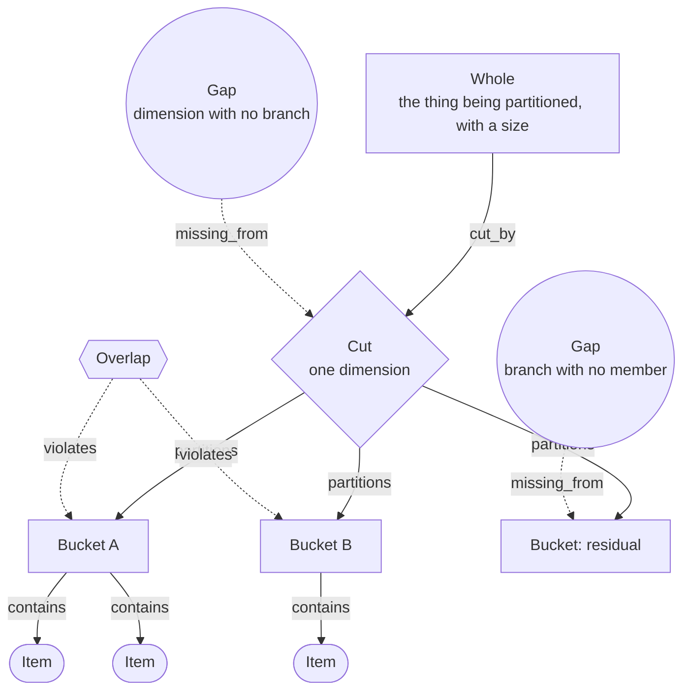

# MECE Principle

> Cuts a whole into branches on one dimension so that nothing overlaps and nothing is left out; the branch that comes back empty is the underserved market. Category: Strategic & Business Decomposition. Reference: [MECE principle](https://en.wikipedia.org/wiki/MECE_principle). [Open the 3D graph](./index.html) (needs internet for Three.js; on GitHub open via Pages or clone).

## What this graph derived

Given that Elad Gil, asked on TBPN on 10 October 2025 about AI companies in vertical markets, named the finalists in foundation models, coding and healthcare, called financial tooling, sales enablement and accounting crowded with no winner, and sized the services economy AI can enter at about $5 trillion, applying the MECE Principle we derived that the labs sit inside every vertical bucket, that the named verticals cover a sliver of the whole, that labor spend sits in no branch, and that a crowded branch is not an empty one; the opportunity that falls out is the service lines nobody can name, screened for near-zero software spend and high payroll, priced as work delivered rather than seats.

Given that a bottled-drinks company's finance director read out 4.1 million cases shipped last year across supermarkets, convenience stores, the company's own website, vending operators and a German wholesaler booked by country, and the head of marketing noted the ledger has never had a line for restaurants, canteens or hotels, applying the MECE Principle we derived that channel is the one dimension to cut on, that 0.6 million cases, one in seven, sit in no branch at all, that the German line smuggles a second dimension into the cut and breaks exclusivity, and that on-premise is the branch the partition requires and nobody has opened; the reader gains the empty branch made visible: no number, no salesperson, no ledger line.

## What it decomposes

MECE — mutually exclusive, collectively exhaustive — is Barbara Minto's grouping test, worked out at McKinsey in the 1960s and 70s as the discipline underneath the Pyramid Principle. Its object is a whole with a size: a revenue base, a cost line, a population, a market. It splits that whole into branches under two conditions. Mutually exclusive: no member falls in two branches. Collectively exhaustive: every member falls in one.

What it forces into the open is the dimension you cut on. A list of categories can be written down without anyone deciding what makes them categories, which is the normal state of a market map: supermarkets, convenience, vending, Germany. Read as a partition the list fails at once — Germany is a country and the rest are channels, so the German cases sit in two places and nobody notices. MECE is not a rule about tidiness. It says a decomposition is only a decomposition if one question can be asked of every member and gets exactly one answer.

Two things go wrong without it, and they are opposites. Overlap counts work and money twice. Omission leaves a branch nobody opened, invisible precisely because an absent ledger line looks exactly like a line that does not exist. For this library omission is the point — the branch the analysis requires and the source never fills — which is why `gap` is the idea-bearing slot, and why the hardest work below is telling an empty branch from a crowded one.

## The slots



| Slot | What goes here | Typical provenance | Why that provenance |
|---|---|---|---|
| Whole | The thing being partitioned; its size is what the branches must add up to. | either | Usually stated with a number; inferred when a speaker maps a space without bounding it. |
| Cut | The single dimension the whole is cut on. Choosing it is the whole of MECE. | derived | Almost never stated as a dimension; when stated at all it is an instruction, not a choice of which way. |
| Bucket | A branch of the partition, usually the analyst's construction even when the source names the members. | derived | Naming a class claims it exists and excludes its siblings; a ledger line is not a branch until someone says so. |
| Item | An observed member placed in a bucket: a company, a ledger line, a customer type. | fact | The members are what the source reports; an item with no quote is an invented fact. |
| Gap | A branch left empty or thin: no member, or no member that counts. | derived | An absence cannot be quoted, and it exists only relative to a cut. |
| Overlap | An item or branch that lands in two buckets at once. | derived | The source may state the ambiguity; naming it as two dimensions in one cut is the diagnosis. |

The graph keeps all five registry slot ids and adds a sixth, `cut`, because MECE is not a claim about buckets but about the dimension the buckets are values of. One cut makes branches mutually exclusive automatically, since a member cannot hold two values of one attribute; two cuts mixed give overlaps automatically, since a member holds one value of each. Every defect the framework catches is therefore a fact about the cut, and every branch, containment and gap is downstream of it: change the cut and the tree below changes while the items stay where they were. As a node the choice becomes inspectable, carrying its own confidence, rationale and grounding, so the reader sees the one decision everything else depends on. One relation is added to match, `cut_by`, from the whole to the cut and from a cut to a second cut laid across it; `partitions`, `contains`, `missing_from` and `violates` are the registry's.

## Example 1: Where did every case go? A drinks company's volume, cut one way

### Source text

> Minutes of a Monday strategy meeting at a mid-size bottled-drinks company. The finance director reads last year's volume from the ledger: the company shipped 4.1 million cases in total, down from 4.6 million the year before. Supermarket chains took 1.7 million cases and convenience stores took 0.9 million. The company's own website shipped 0.2 million cases direct to consumers, and vending operators took 0.3 million. The sales director adds that a further 0.4 million cases went to a German wholesaler, and that nobody is sure whether those cases ended up in shops or in restaurants, because the wholesaler is booked by country and not by channel. The finance director notes that the ledger's lines do not add up to the total and asks what the remaining cases were; nobody in the room can say. The head of marketing observes that the company has no salesperson who calls on restaurants, canteens or hotels, and that the ledger has never had a line for them. The CEO closes the meeting by asking for one picture of where every case goes, cut one way only, before the board meets.

### Decomposition

Fifteen nodes, eight facts and seven inferences, and twenty edges of which exactly one is a fact.

Whole

- `c_whole` **4.1m cases shipped last year** [fact] The whole to be partitioned is last year's shipped volume: 4.1 million cases in total, down from 4.6 million the year before. "the company shipped 4.1 million cases in total" (finance director, sentence 2)

Cut

- `c_cut_rule` **One picture, cut one way only** [fact] The CEO asks for one picture of where every case goes, cut one way only. That is the MECE instruction, and it is all the source gives: the rule, not the dimension. "asking for one picture of where every case goes, cut one way only" (CEO, sentence 8)
- `c_cut` **Cut by channel** [derived 0.85] The dimension chosen is channel: where the case is sold, not who bought it, not which country it went to. Every branch below is a channel and nothing else. Rationale: The CEO demands one cut but never says which. Channel is the dimension four of the five ledger lines already follow (supermarkets, convenience, own website, vending), so it is the cut that costs the least re-coding, and it is the cut that makes the German line's ambiguity visible instead of hiding it inside a geography branch.

Bucket

- `c_b_grocery` **Grocery retail** [derived 0.85] Off-trade grocery: cases sold through shops a household buys from, whether a supermarket chain or a convenience store. Rationale: The ledger keeps supermarkets and convenience stores as two lines. Merging them into one branch is the analyst's move; it is justified because both sell the same pack to the same drinker through the same route to market, and separating them would cut on account size, which is a second dimension.
- `c_b_dtc` **Direct to consumer** [derived 0.85] Cases the company ships itself to the drinker, with no retailer in between. Rationale: The website line is one ledger row; calling it a branch of the channel cut is the analyst's construction, and it is what makes the 0.2 million comparable with the 1.7 million rather than a footnote.
- `c_b_vending` **Vending** [derived 0.85] Cases sold through vending operators, who place the machines and buy the stock. Rationale: Vending is a distinct route to market with its own economics; the ledger names the operators but never calls them a channel. As a branch it stays exclusive of grocery because a case cannot be both machine-filled and shelf-stocked.

Item

- `c_i_super` **Supermarket chains, 1.7m** [fact] Supermarket chains took 1.7 million cases, the largest single line in the ledger. "Supermarket chains took 1.7 million cases" (finance director, sentence 3)
- `c_i_conv` **Convenience stores, 0.9m** [fact] Convenience stores took 0.9 million cases. "convenience stores took 0.9 million" (finance director, sentence 3)
- `c_i_web` **Own website, 0.2m** [fact] The company's own website shipped 0.2 million cases direct to consumers. "The company's own website shipped 0.2 million cases direct to consumers" (finance director, sentence 4)
- `c_i_vend` **Vending operators, 0.3m** [fact] Vending operators took 0.3 million cases. "vending operators took 0.3 million" (finance director, sentence 4)
- `c_i_wholesale` **German wholesaler, 0.4m** [fact] A further 0.4 million cases went to a German wholesaler; nobody is sure whether those cases ended up in shops or in restaurants, because the wholesaler is booked by country and not by channel. "a further 0.4 million cases went to a German wholesaler" (sales director, sentence 5)

Gap

- `c_g_stated` **No line, no salesperson** [fact] The company has no salesperson who calls on restaurants, canteens or hotels, and the ledger has never had a line for them. "the company has no salesperson who calls on restaurants, canteens or hotels, and that the ledger has never had a line for them" (head of marketing, sentence 7)
- `c_g_onprem` **On-premise: branch never opened** [derived 0.65] The fourth channel a drinks business always has, restaurants, canteens and hotels, where the drink is consumed where it is bought. Under this cut it is a branch with no ledger line, no salesperson and no number. Rationale: Nothing in the minutes says the on-premise channel exists. It is the branch the cut requires in order to be collectively exhaustive: once channel is the dimension, off-trade and on-trade are the two halves of it, and the source has only ever counted the off-trade half.
- `c_g_unaccounted` **0.6m cases in no branch** [derived 0.90] The five ledger lines add to 3.5 million cases against a total of 4.1 million: 0.6 million cases, one case in seven, sit in no branch of the partition at all. Rationale: Arithmetic on the stated numbers: 1.7 + 0.9 + 0.2 + 0.3 + 0.4 = 3.5 against a stated total of 4.1. The minutes say the lines do not add up and that nobody can say what the rest were; the size of the hole, and that it is a seventh of the business, is the inference.

Overlap

- `c_o_german` **German line cut by country** [derived 0.85] The German wholesaler line is booked on a different dimension from every other line: country, not channel. Its 0.4 million cases could be in grocery or in on-premise, so as long as it stands the branches are not mutually exclusive. Rationale: The minutes state the booking basis and the uncertainty but not the diagnosis. Naming it as a second dimension smuggled into a single cut is what turns an accounting annoyance into the reason the partition fails the exclusivity test, and it says what to do: re-code the German cases by channel before the picture is drawn.

Edges. One is a fact, the CEO's own instruction joining the whole to the rule:

- `ce1` `c_whole` -> `c_cut_rule` (cut_by) [fact] "asking for one picture of where every case goes, cut one way only" (CEO, sentence 8)

Thirteen derived edges carry a framework relation: `ce2` `c_cut_rule` -> `c_cut` (cut_by, 0.85); `ce3`, `ce4`, `ce5` from `c_cut` to `c_b_grocery`, `c_b_dtc`, `c_b_vending` (partitions, 0.85), `ce6` to `c_g_onprem` (partitions, 0.65); `ce7`, `ce8` from `c_b_grocery` to `c_i_super`, `c_i_conv`, `ce9` `c_b_dtc` -> `c_i_web`, `ce10` `c_b_vending` -> `c_i_vend` (contains, 0.90); `ce11` `c_o_german` -> `c_b_grocery` (violates, 0.85), `ce12` -> `c_g_onprem` (violates, 0.70), the same 0.4 million claimable twice; `ce13` `c_g_unaccounted` -> `c_whole` (missing_from, 0.90); `ce14` `c_g_stated` -> `c_cut` (missing_from, 0.75), a stated absence becomes a hole only once channel is the dimension. Six are grounding links: `ce15`, `ce16` from `c_cut` to `c_i_super`, `c_i_web` (0.85); `ce17` `c_g_unaccounted` -> `c_i_wholesale` (0.90); `ce18` `c_g_onprem` -> `c_g_stated` (0.85); `ce19` `c_o_german` -> `c_i_wholesale` (0.85); `ce20` `c_g_unaccounted` -> `c_g_stated` (0.60).

### What the LLM added and why it helps

Turn the derived layer off and almost nothing structural survives: the CEO's instruction hanging off a total, and five ledger lines with no branch above them. That is the honest picture of what a MECE source contains — numbers and an ask. Everything between them, the dimension, the four branches, every containment edge, is the analyst's construction, which is why nineteen of the twenty edges are derived and only the CEO's own sentence is a fact. This is normal for MECE, not a weakness of the example: a partition is a claim about the data, not a reading of it, and a graph that marked the tree as fact would assert something the source never said.

`c_cut` (0.85) picks the dimension and takes the consequences, grounded in two ledger lines that are already channels (`ce15`, `ce16`). The three buckets (0.85 each) make five heterogeneous rows comparable, and their `contains` edges sit at 0.90 because filling a branch is near-forced once the branch exists — the judgment is in inventing it. The findings sit at the two ends of the confidence scale. `c_g_unaccounted` (0.90) is the dullest reasoning: arithmetic on quoted numbers, 3.5 against 4.1, turning "the lines do not add up" into one case in seven. `c_g_onprem` (0.65) is the most valuable, because nothing in the minutes says on-premise exists and its only grounding is a stated absence (`ce18`). `c_o_german` (0.85) names the exclusivity failure and, through `ce11` and `ce12`, shows the same 0.4 million claimed by grocery and by the branch that does not exist. `ce20` (0.60) is deliberately the weakest edge: the uncounted channel is the obvious home for the uncounted cases, and the minutes never connect the two.

## Example 2: from the TBPN transcripts: Elad Gil's map of the AI application market: seven named verticals inside a $5 trillion whole

Episode "Sam Altman live on Sora, Hollywood & the future of ads (Bill Peebles, Dylan Patel, Elad Gil, Robby Stein, Morgan Housel, Misha Laskin)", 2025-10-10, [transcript](../../../tbpn-transcripts/transcripts/2025-10-10_sam-altman-live-on-sora-hollywood-the-future-of-ads-bill-peebles-dylan-patel-elad-gil-robby-stein-morgan-housel-misha-laskin.md); line numbers refer to it. Elad Gil does the partition out loud: asked how to think about AI companies, he says the markets have crystallised, runs the application market vertical by vertical naming the finalists in each (L2988-L3014), flags the verticals where the winner is unknown, and separately sizes the whole at about $5 trillion of services (L3144). It is a MECE exercise with both classic defects on the record: a layer (the foundation model companies) is mixed in with the verticals and re-appears inside them, and the branches he can name cover only a sliver of the whole he stated.

### Facts (quoted)

Sixteen of the twenty-four nodes and four of the thirty-five edges are facts, none of them paraphrases. Quotes keep the transcript's mis-hearings — "a bridge" for Abridge, "commier" for Commure, "RV" for Harvey, "Zendaz" for Zendesk, "Ripling" for Rippling — with the corrected spelling in `entities`.

Whole

- `w1` **$5T of services AI can enter** [fact] The whole being partitioned is the services economy Gil's team sized as the ground AI could intervene in: about $5 trillion, a large share of GDP. "The services economy that we looked at on my team in terms of where AI could intervene is about $5 trillion." (Elad Gil, L3144-L3144)

Cut

- `cut0` **Verticals, not the model layer** [fact] The host sets the dimension before the answer starts: the question is about vertical markets, smaller markets, and explicitly not the foundation model layer. "If we're talking vertical markets, smaller markets, not the foundation model layer." (Host, L2938-L2940)
- `cut1` **Go vertical by vertical** [fact] Gil's own cut: the AI application market is walked one vertical at a time, and each vertical is asked the same question. "And you can go through sort of vertical by vertical." (Elad Gil, L2996-L2996)

Bucket

- `b_model` **Foundation model market** [fact] The foundation model market: the first branch Gil files, and the one the host's framing had put outside the question. "We know that for the foundation model market." (Elad Gil, L2988-L2988)
- `b_code` **Coding** [fact] Coding: a settled vertical whose finalists Gil can name without hesitating. "We know for coding, it's cognition, cursor, and then the foundation model companies in Microsoft." (Elad Gil, L2994-L2994)
- `b_health` **Healthcare** [fact] Healthcare: named as one of the verticals now known, with a handful of contenders in it. "There's a bunch of verticals now we know, a bridge for healthcare and maybe commier." (Elad Gil, L2998-L2998)
- `b_legal` **Legal** [fact] Legal: solidified, in Gil's reading, except for a handful of narrower sub-verticals such as personal injury. "legal feels like it's already solidified except a handful of these more vertical specific" (Elad Gil, L3014-L3014)
- `b_fin` **Financial tooling** [fact] Financial tooling: a market Gil is sure will matter, with tons of players in it and no known winner. "And there's tons of players, but we don't know who the winners are. That's financial tooling." (Elad Gil, L3004-L3006)
- `b_acct` **Accounting and sales enablement** [fact] Accounting, and sales enablement beside it: the other two branches Gil files under important, crowded and unresolved. "Maybe that's sales enablement. Maybe that's accounting." (Elad Gil, L3008-L3010)

Item

- `i_labs` **Anthropic, OpenAI, Google, xAI, Meta** [fact] The finalists Gil names in the foundation model market: Anthropic, OpenAI, Google, perhaps xAI, Meta, Mistral and a few others. A small list. "We know it's anthropic, open AI, Google, perhaps XAI, meta, a few others, mistraw, whatever." (Elad Gil, L2990-L2990). Entities: Anthropic, OpenAI, Google, xAI, Meta, Mistral.
- `i_coding` **Cognition, Cursor, and the labs** [fact] The finalists Gil names in coding: Cognition, Cursor, and then the foundation model companies plus Microsoft. "it's cognition, cursor, and then the foundation model companies in Microsoft" (Elad Gil, L2994-L2994). Entities: Cognition, Cursor, Microsoft.
- `i_health` **Abridge, maybe Commure** [fact] The contenders Gil names in healthcare: Abridge, and maybe Commure. Transcribed as a bridge and commier. "a bridge for healthcare and maybe commier" (Elad Gil, L2998-L2998). Entities: Abridge, Commure.
- `i_legal` **Legal bought no software until AI** [fact] Legal never bought any software and was really hard to sell into; because of AI, a legal AI company can suddenly exist. The transcript renders the company as RV. "legal never bought any software. It was really hard to sell into legal, but because of AI, suddenly RV can exist" (Elad Gil, L3124-L3126). Entities: Harvey.
- `i_support` **Support: labor, not seats** [fact] Customer support as Gil re-prices it: not how many seats you sell the reps, but how much of their work you do. The labor market versus the software market. "you're looking at, for example, customer support. It's not Zendaz, How many seats can you sell the customer support reps? It's how much can you augment and do work for customer support reps? It's the labor market versus the software market." (Elad Gil, L3132-L3138). Entities: Zendesk.
- `i_rippling` **Rippling cross-sells a dozen products** [fact] Rippling cross-sells a dozen different HR products; AI can make some of them better, but nobody is going to do the AI-first Rippling and suddenly win. "Ripling is an amazing company they uh cross sell a dozen different HR products. And AI can make some stuff better, but nobody's going to do the AI first rippling and suddenly win, right?" (Elad Gil, L3090-L3096). Entities: Rippling.

Overlap

- `o_ai_everything` **AI means everything now** [fact] Gil states the limit case of the defect himself: AI means everything now, it means consumer, it means roll-ups, it means vertical SaaS. A branch that contains everything is exclusive of nothing. "And AI means everything now. It means consumer. It means roll-ups. It means vertical fast." (Elad Gil, L3042-L3044)

Fact edges. Four, each joining two fact nodes with the connection stated in the quoted span.

- `te6` `cut1` -> `b_health` (partitions) [fact] "And you can go through sort of vertical by vertical. There's a bunch of verticals now we know, a bridge for healthcare and maybe commier." (Elad Gil, L2996-L2998)
- `te12` `b_model` -> `i_labs` (contains) [fact] "We know that for the foundation model market. We know it's anthropic, open AI, Google, perhaps XAI, meta, a few others, mistraw, whatever." (Elad Gil, L2988-L2990)
- `te13` `b_code` -> `i_coding` (contains) [fact] "We know for coding, it's cognition, cursor, and then the foundation model companies in Microsoft." (Elad Gil, L2994-L2994)
- `te14` `b_health` -> `i_health` (contains) [fact] "There's a bunch of verticals now we know, a bridge for healthcare and maybe commier." (Elad Gil, L2998-L2998)

### Decomposition

Eight derived nodes and thirty-one derived edges. Fact nodes are referenced by id.

Cut (`cut0` and `cut1` are the stated ones)

- `cut2` **Second cut: settled or open** [derived 0.80] A second dimension runs across the first. Each vertical is filed as settled, where it is clear who the finalists are, or open, where the market is clearly important, there are tons of players, and the winners are unknown. Rationale: Gil applies the same finalists test to every vertical he names but never calls it a dimension. Reading it as a second cut is what turns financial tooling, sales enablement and accounting from a list into a class, and it is the class an investor or a founder is actually choosing between. Supported by `b_model`, `b_fin`.

Bucket (`b_model`, `b_code`, `b_health`, `b_legal`, `b_fin` and `b_acct` are the stated ones)

- `b_rest` **Residual: every other service line** [derived 0.70] The branch nobody opens. Models, coding, healthcare, legal, financial tooling, sales enablement, accounting and customer support are perhaps a few hundred billion dollars of the $5 trillion; the rest of the services economy is one unnamed branch. Rationale: Gil states a whole of about $5 trillion and names roughly eight verticals, then says you can come up with the list. Nobody closes the partition. Adding the residual branch is what turns a list of markets into a statement about coverage, and every gap below hangs inside it. Supported by `w1`.
- `b_durable` **Durable systems of record** [derived 0.65] A branch that is populated and closed: multi-product systems of record whose moat is the cross-sell, not the model, and which an AI-native entrant does not take by being AI-native. Rationale: Gil says of one company that nobody is going to do the AI-first version and suddenly win. Generalising the one case into a branch of the same partition is the inference, and it matters because it is the part of the $5 trillion that is inside the whole but not inside the opportunity. Grounded without a grounding link: its `contains` edge `te16` already lands on the fact node `i_rippling`.

Overlap (`o_ai_everything` is the stated one)

- `o_labs` **The labs are in every bucket** [derived 0.85] The foundation model companies are a branch of this partition and a member of the coding branch at the same time. Layer and vertical are two dimensions, and mixing them means no vertical branch is exclusive of the model branch. Rationale: The host explicitly excluded the model layer from the question, and Gil's coding list ends with the foundation model companies. The double count is on the record; naming it as a mixed cut rather than a quirk is the inference, and it carries a rule: every vertical bucket has to be defended against the lab that is already sitting in it. Supported by `i_coding`, `cut0`.

Gap

- `g_unnamed` **Most of the whole has no contender** [derived 0.55] Add up the verticals anyone in the room can name and you have a small fraction of $5 trillion. The rest of the services economy has no finalist, no crowd and, in this conversation, no name. Rationale: The arithmetic is forced but the reading is not: coverage is inferred by comparing a stated whole with a list the speaker himself treats as illustrative rather than complete, and the un-named remainder may be un-named because it is unattractive rather than because it is unnoticed. Supported by `w1`, `cut1`. Carries an `idea` field, quoted under "Where the opportunity shows up".
- `g_nosoftware` **Verticals that bought no software** [derived 0.65] The branch with no incumbent is the branch that never bought software in the first place. Legal was one of those until AI made it buyable; the rest of that class is still empty. Rationale: Gil gives the mechanism for exactly one vertical: legal bought no software, was hard to sell into, and became reachable because of AI. Turning one case into a screen for the whole residual branch is a generalisation, and it is contestable because legal also had unusually high billing rates, which is not true of every software-free trade. Supported by `i_legal`. Carries an `idea` field.
- `g_labor` **The labor half of every bucket** [derived 0.70] Every branch here is drawn around a software market and sized by seats. The labor spend for the same work sits in no branch at all, and it is the larger number. Rationale: Gil states the shift from seat-based value to labor and applies it to customer support. Reading it as a missing branch rather than a pricing note is the inference: if the cut is drawn on software categories, a whole dimension of the $5 trillion has no bucket, which is why the market sizes come out too small. Supported by `i_support`. Carries an `idea` field.
- `g_nofinalist` **No finalist is not no players** [derived 0.70] Financial tooling, sales enablement and accounting are thin in finalists and thick in entrants. What is missing from those branches is a winner, not a founder, which is the opposite of an underserved market. Rationale: Gil states both halves for these verticals, that the market matters and that there are tons of players with no known winner, but does not distinguish them from a branch that is genuinely empty. The distinction is the inference, and it is what stops a MECE reading of a market map from mistaking a crowd for an opening. Supported by `b_fin`. Carries an `idea` field.

Derived edges. Twenty-one carry a framework relation:

- `cut_by`: `te1` `w1` -> `cut1` (0.70), sizing and vertical run about 150 lines apart; `te2` `w1` -> `cut0` (0.60), a different speaker set the dimension; `te3` `cut1` -> `cut2` (0.80).
- `partitions`, all from `cut1`: `te4` -> `b_model` (0.55), reading the model market as a branch rather than a preamble is what makes the overlap visible; `te5` -> `b_code` (0.85); `te7` -> `b_legal` (0.75); `te8` -> `b_fin` (0.80); `te9` -> `b_acct` (0.80); `te10` -> `b_rest` (0.70); `te11` -> `b_durable` (0.60).
- `contains`: `te15` `b_legal` -> `i_legal` (0.65), 110 lines apart and the company named only as RV; `te16` `b_durable` -> `i_rippling` (0.70); `te17` `b_rest` -> `i_support` (0.60).
- `violates`: `te18` `o_labs` -> `b_model` (0.85); `te19` `o_labs` -> `b_code` (0.85); `te20` `o_ai_everything` -> `cut1` (0.70).
- `missing_from`: `te21` `g_unnamed` -> `b_rest` (0.55); `te22` `g_nosoftware` -> `b_rest` (0.65); `te23` `g_labor` -> `cut1` (0.70), missing from the cut itself, which is why no branch is sized correctly; `te24` `g_nofinalist` -> `b_fin` (0.75); `te25` -> `b_acct` (0.75).

Ten are grounding links: `te26`, `te27` from `cut2` to `b_model`, `b_fin` (0.80); `te28` `b_rest` -> `w1` (0.70); `te29`, `te30` from `g_unnamed` to `w1` (0.60) and `cut1` (0.55); `te31` `g_nosoftware` -> `i_legal` (0.65); `te32` `g_labor` -> `i_support` (0.70); `te33` `g_nofinalist` -> `b_fin` (0.75); `te34`, `te35` from `o_labs` to `i_coding` and `cut0` (0.85). `b_durable` needs none: its `contains` edge `te16` already lands on the fact node `i_rippling`.

### What the LLM added

The provenance profile is the mirror image of the classic, and that contrast is the most useful thing this page has to say about extracting MECE from a transcript. In the drinks minutes the ledger lines are facts and the whole tree above them is construction: seven of fifteen nodes and nineteen of twenty edges derived. Here Gil states his own buckets out loud — "We know that for the foundation model market", "We know for coding", "That's financial tooling" — so six buckets are fact nodes, and three containment edges are facts too.

The derived layer has therefore moved up. It is no longer the branches; it is what the speaker did not say once he had said them. `b_rest` (0.70) closes a partition he left open: roughly eight verticals against a whole he sized at $5 trillion, then "you can come up with the list". `cut2` (0.80) names the second dimension he applies to every branch without calling it one. `o_labs` (0.85) states the double count that is on the record and unremarked: the host put the model layer outside the vertical question (`te35`) and Gil's coding list ends with the foundation model companies (`te34`), so branch and member are the same firms. `b_durable` (0.65) generalises one company into the part of the whole AI does not take, the only node that subtracts from the opportunity. And the four gaps are the branches that do not exist.

A stated bucket is still not a stated partition: `b_model` is a fact node, but `te4`, the edge filing it under the vertical cut, is derived at 0.55, and that reading is what makes the exclusivity failure visible instead of hiding it. The provenance lives on the edges — of the seven `partitions` edges out of `cut1` exactly one is a fact, the span where Gil says "vertical by vertical" and names healthcare in the same breath; the rest are inferences about enumeration order, priced by how far apart the statements sit. Hide the derived layer and what remains is true and nearly useless: a $5 trillion number, some named markets, one link between them.

### Where the opportunity shows up

The idea-bearing slot is `gap` (`idea_bearing_slot: "gap"`). All four gap nodes are derived and all four carry an `idea` field; they are worth reading together because they disagree about where the opening is.

- `g_unnamed` **Most of the whole has no contender**, derived, confidence 0.55. Idea: "The largest AI application segment is the set of service lines nobody at the table can name: where there is neither a finalist nor a crowd, the first credible product defines the category instead of fighting for it, so the highest-yield screen is to list the services economy by payroll and strike out every line that appeared in this conversation." Contestable at 0.55 because the arithmetic is forced and the reading is not: Gil offers his list as illustrative, not as an attempt at coverage, so the un-named remainder may be un-named because it is unattractive rather than because it is unnoticed. The screen it proposes is cheap to run, which is the argument for keeping a 0.55 node.
- `g_nosoftware` **Verticals that bought no software**, derived, confidence 0.65. Idea: "Screen the services economy for lines with near-zero software spend per worker and high labor spend, such as claims adjusting, freight brokerage, permitting, title work and medical billing appeals, because each one is an empty bucket where an AI-native entrant has no incumbent to displace and no crowd to outspend." Contestable because the whole evidential base is one worked case: legal. Legal also had unusually high billing rates, so the mechanism that made it buyable may not be "no software" at all but "enough money per hour to pay for software", which would disqualify most of the named list. The specific trades in the idea sentence are the inference's own extrapolation, not Gil's.
- `g_labor` **The labor half of every bucket**, derived, confidence 0.70. Idea: "Price and size against the labor line rather than the seat line: the open space is any vertical where software spend is near zero and payroll is large, and the product that wins it is sold as work delivered, not as software seats, which also removes the incumbent's price anchor." Gil states the seats-to-labor shift and applies it to customer support himself, so the fact is solid; what is inferred is that it is a missing branch of the partition rather than a pricing observation. Contestable in the step from "TAMs are shifting to labor" to "the labor spend sits in no bucket", and in the assumption that work delivered can actually be priced and sold that way in a vertical that has never bought software.
- `g_nofinalist` **No finalist is not no players**, derived, confidence 0.70. Idea: "Rank branches by finalists per player, not by finalists: a branch with many entrants and no winner prices entry at the cost of a distribution war, while a branch with neither entrant nor winner is where the same capital buys the category."

`g_nofinalist` is the distinction the other three depend on. Gil files financial tooling, sales enablement and accounting under "we don't know who the winners are", and a careless MECE reading treats a branch with no winner as an empty branch. It is the opposite: those branches are thin in finalists and thick in entrants, so what is missing is a winner, not a founder, and entering one costs a distribution war against players reading the same market map. A branch with neither entrant nor winner — the residual `b_rest` holds them — costs a category-definition problem instead, usually cheaper. The graph encodes the difference: `te24` and `te25` run `missing_from` to `b_fin` and `b_acct`, populated fact buckets, while `te21` and `te22` run `missing_from` to `b_rest`, a derived branch with almost nothing in it. Same relation, opposite finding. A MECE reading of a market map that confuses the two is worth very little, because the crowded branches are exactly the ones a source is most likely to name.

## Building a knowledge graph with this framework

### Node and edge types

Node types are the six slots: `whole`, `cut`, `bucket`, `item`, `gap`, `overlap`. One partition is one connected component rooted at a `whole`; a source partitioning two wholes gives two components, which may share items. Edge types: `cut_by` (whole to cut, and cut to a second cut laid across it), `partitions` (cut to bucket, and to a gap when the missing thing is a whole branch), `contains` (bucket to item), `missing_from` (gap to the bucket, cut or whole it is absent from), `violates` (overlap to each bucket whose exclusivity it breaks, or to the cut when the offending item defeats the dimension), `supported_by` (derived to fact, always derived).

Fact nodes carry `source_quote` and `source_ref`, derived nodes `confidence` and `rationale`; `entities` carries the corrected spelling when the transcript mis-hears a name. An edge is a fact only when both endpoints are facts and one turn states the connection in quotable words: `contains` only when the speaker names branch and members together (`te12`, `te13`, `te14`), `partitions` only when the speaker files the branch under that cut (`te6`, alone among seven).

### Fact or derived: rules of thumb

- **Whole**: extracted when the source states a size or boundary; that number is what lets a coverage claim be checked later. Inferred at low confidence when a speaker maps a space without bounding it. Empty: the partition still builds, but no gap can be sized.
- **Cut**: inferred, almost always. Sources state instructions ("cut one way only") and enumerations ("vertical by vertical"), not dimensions. Pick the cut the most items already follow: least re-coding, and its failures are the source's rather than yours.
- **Bucket**: either. Extracted when the speaker names a class of the whole and treats it as one; inferred when only members are stated, when two lines are merged, or when the partition needs a branch to close. A stated bucket is a fact node whose `partitions` edge may still be derived.
- **Item**: extracted, always. An item without a quote is an invented fact; placing it in a bucket is a separate act with its own provenance.
- **Gap**: inferred, always — an absence cannot be quoted. A *stated* absence is a fact node (`c_g_stated`); the gap it implies is the derived node above it. Every gap needs a `missing_from` edge and a `supported_by` link to a quoted fact.
- **Overlap**: inferred, normally. Sources state the symptom, occasionally the limit case (`o_ai_everything`, a fact node); the diagnosis that two dimensions were mixed is the inference.

**When a slot is empty in the data.** Elsewhere an empty slot is a missing node. Here an empty branch is the finding, and the value of the extraction sits in classifying it. Three kinds of emptiness look identical in a transcript and mean opposite things.

A **genuine gap** has no member and nobody looking: no item, no entrant, no incumbent, nothing in the source treating it as a market. The evidence is a stated absence of coverage (`c_g_stated`) or coverage arithmetic against a stated whole (`g_unnamed`, `b_rest`). Confidence belongs low, 0.55 to 0.70, because you are asserting something the source never mentioned; that is the band both examples put their real openings in.

A **thin bucket** has members but no decisive one: empty when you count finalists, crowded when you count players — `g_nofinalist` (0.70). Record it as a gap `missing_from` a populated bucket, never as an unopened branch, and say in the node text what is missing: a winner, not a founder.

An **artefact of the cut** has members booked on another dimension, so the branch reads empty because its contents are filed elsewhere — the German wholesaler, 0.4 million cases recorded by country and invisible to a channel partition. Diagnose it as an `overlap` that `violates` the branches it could belong to, and note the fix: re-code on the chosen dimension first. The tell is that residual and empty branch move together — if closing the overlap fills the branch, it was never a gap.

### Extraction recipe

```text
Partition ONE whole from <file>, lines <a>-<b>, with MECE.
1. Whole: the thing being taken apart, preferably with a stated size (fact if
   stated, verbatim span of 5+ words; derived and low-confidence if the source
   maps a space without bounding it).
2. Cut: the single dimension the branches are values of. Write it as a question
   every member can be asked ("through what channel was this case sold?").
   Derived unless the speaker names the attribute. If the source states only the
   instruction to cut ("cut one way only"), that is a separate fact node and the
   dimension you choose hangs off it by `cut_by`.
3. Buckets: one per value of the cut. Fact when the speaker names the class as a
   class; derived when you merged lines, split one, or invented the branch.
   Every bucket must be phrasable as a value of the cut in step 2. If one is not,
   it belongs to a second dimension: keep it and record an `overlap`.
4. Items: every named member, as a verbatim span. No span, no node. Put the
   corrected company name in `entities`.
5. Residual: add the branch that holds what the named branches do not
   (derived; `supported_by` the whole's stated size). Never call it "Other" and
   never leave it out - it is what makes a coverage claim possible.
6. Gaps: for each branch the cut requires and the source never fills, one gap
   node with `missing_from` to that branch, the cut, or the whole. Classify it:
   no member and nobody looking / members but no winner / members booked on
   another dimension (that last one is an overlap, not a gap). Put the reasoning
   in `rationale` and the opportunity in `idea`.
7. Overlaps: any item or branch that could sit in two buckets, with `violates`
   edges to each. Do not re-code the item to make the tree tidy.
8. Edges cut_by / partitions / contains / missing_from / violates with
   provenance. An edge is fact only if both endpoints are facts AND one turn
   states the link, quoted verbatim; a `contains` edge is a fact only when the
   branch and its members are named in the same span. `supported_by` from every
   derived node to its facts, always derived.
Output one graph.json example: nodes [{id, slot, label <=40 chars, text,
provenance, source_quote+source_ref | confidence+rationale, idea?, entities}],
edges [{id, from, to, relation, provenance, confidence?, source_quote?,
source_ref?, rationale?}], idea_bearing_slot "gap".
```

Afterwards: `node _meta/validate.mjs <dir>` (quotes, paraphrase cap, derived-to-fact connectivity, the `idea` rule), then five checks it cannot do. Every bucket answers the same question as its siblings — read the cut aloud and try each branch as an answer. The branches partition the whole rather than sampling it: the residual exists. Every gap is classified as genuine, thin or artefact, and a thin one points `missing_from` at a populated bucket. Every overlap survives instead of being repaired away. And any arithmetic claim has every addend quoted, or its confidence is not in the 0.90 band.

### Failure modes

- **The cut is never chosen.** Buckets with no dimension, so nothing can be checked. Guard: the `cut` node is mandatory and must be writable as a question with exactly one answer per member; if it cannot be, the buckets are a list, not a partition.
- **Two dimensions in one cut.** A layer beside a vertical (`b_model` against `b_code`), a country beside a channel (`c_i_wholesale`), treated as siblings. Guard: test each branch as a value of the cut; failures become `overlap` nodes with `violates` edges, and the exclusivity claim is withdrawn rather than the branch deleted.
- **Repairing the tree instead of reporting it.** Re-code the German cases into grocery and the graph is tidy and has lost the finding. Guard: the overlap stays, `violates` points at both candidate homes, the fix goes in the rationale.
- **Fake exhaustiveness.** A catch-all "Other" absorbs everything unclassified, so the partition is exhaustive by construction and says nothing. Guard: the residual needs a stated size behind it (`b_rest` is `supported_by` `w1`) and a text saying what it holds.
- **Buckets marked fact because the words appear.** Guard: the node may be a fact, the edge is a separate judgment — `partitions` is fact only when the speaker files the branch under the cut in a quotable span (`te6`, one of seven).
- **Gap inflation.** Everything unmentioned becomes an underserved market. Guard: a gap needs a `missing_from` target and a `supported_by` link to a quoted fact, and its confidence must reflect that it asserts an absence — 0.55 to 0.70, not 0.85.
- **A crowd read as an opening.** A branch with no named winner filed as empty. Guard: count entrants before finalists; a branch with many entrants and no winner is `missing_from` a populated bucket, never an unopened branch.
- **Over-confident arithmetic.** A residual at 0.90 when one addend was estimated. Guard: 0.90 belongs to sums whose every term is quoted (`c_g_unaccounted`); a coverage claim against an illustrative list, like `g_unnamed`, belongs at 0.55.
- **The idea written into the rationale.** Inference and opportunity stop being distinguishable. Guard: `rationale` says only why the inference follows from the quoted facts; the opportunity goes in `idea`, on gap nodes only.

## Related frameworks

- [Issue & Hypothesis Trees](../issue-hypothesis-trees/README.md): the same partition applied recursively to a question rather than a quantity, each branch carrying a falsification test. Prefer it to drive to an answer; MECE when the branches only have to cover the whole and stay apart.
- [Pyramid Principle](../../01-narrative-and-statement/pyramid-principle/README.md): MECE is the grouping test inside Minto's pyramid, the rule each set of supporting points passes before it can sit under one idea. Prefer the pyramid when the object is an argument for a reader; MECE when it is a quantity or a market.
- [Minto SCQA](../../01-narrative-and-statement/minto-scqa/README.md): the same author's front end, framing why the question is asked. Prefer it when nobody agrees what the question is; MECE begins once the whole is settled.
- [Ishikawa (Fishbone) Diagram](../ishikawa-fishbone/README.md): a partition with the cut fixed in advance, six standing categories every cause is filed under. Prefer it when the categories are known; MECE when choosing the dimension is itself the analysis, which on a market map it always is.

[Library root](../../README.md).
