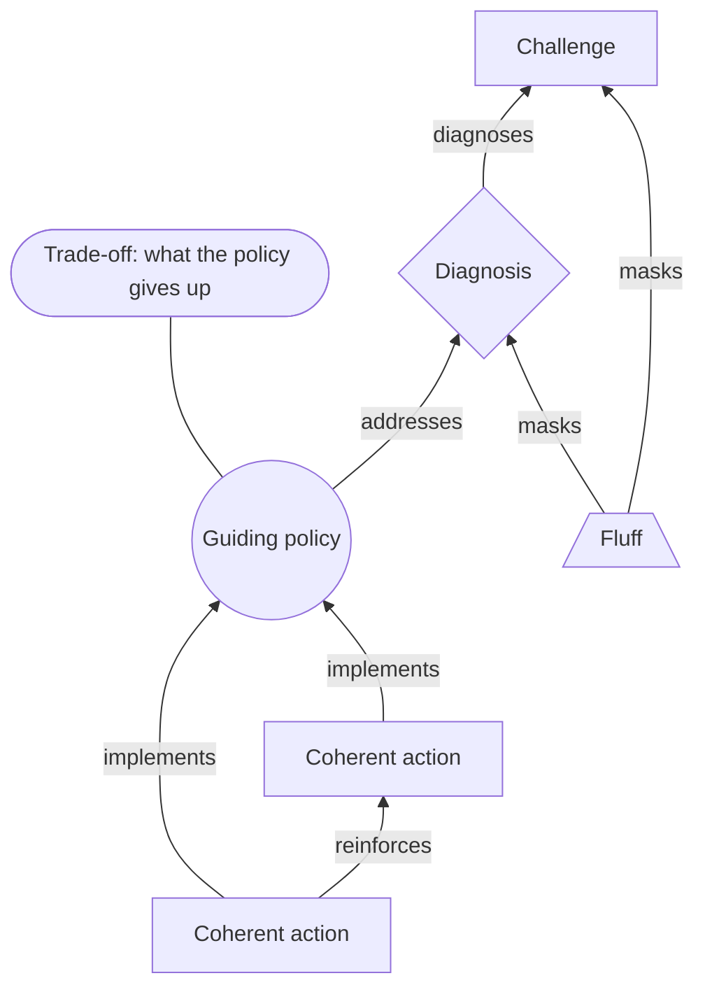

# Rumelt's Strategic Kernel

> Strips the slogans off a strategy and keeps only three things: a diagnosis that names the critical obstacle, a guiding policy that says how it will be met and what that costs, and coherent actions that carry the policy out and reinforce one another. Category: Strategic & Business Decomposition. Reference: [Richard Rumelt](https://en.wikipedia.org/wiki/Richard_Rumelt). [Open the 3D graph](./index.html) (needs internet for Three.js; on GitHub open via Pages or clone).

## What it decomposes

Richard Rumelt's *Good Strategy / Bad Strategy* (2011) takes apart an object that arrives already dressed: a strategy as its owner presents it, in a plan, a deck or a founder's account of why the company is built the way it is. What survives is the kernel, three parts and no more. A **diagnosis** names the critical obstacle and replaces a confusing situation with a simpler story about what is in the way. A **guiding policy** says how that obstacle will be met, and by saying so says what will not be done. **Coherent actions** are the resource commitments that carry the policy out and reinforce one another instead of competing.

The framework's bite comes from what it throws away. Rumelt's four hallmarks of bad strategy are fluff (abstraction dressed as insight), failure to face the challenge, mistaking goals for strategy, and bad strategic objectives — goals that neither address an obstacle nor can be acted on. Three of the four are things a document *contains* rather than things it lacks, so a decomposition that fills only the kernel's three boxes discards the evidence for the judgment it just made. This library keeps it: **fluff** is a slot of its own, and each of its nodes carries a `masks` edge to the challenge or diagnosis it stands in front of.

Without the kernel a strategy is judged on whether it sounds ambitious. With it, three questions become askable and each has a visible answer in the graph. Is an obstacle named anywhere, or are there only outcomes wished for? Does the policy give something up — Rumelt's test, because a policy that costs nothing has chosen nothing? Do the actions pull one way, or are they a budget list printed on one page?

## The slots



| Slot | What goes here | Typical provenance | Why that provenance |
|---|---|---|---|
| Challenge | The situation as reported, before any diagnosis: pressures, numbers, criticisms, what people said would happen. | fact | It is the part a source actually describes. An invented pressure means there is no strategy left to judge. |
| Fluff | Missions, visions, goals and claims of standing that are not strategy, kept so the reader sees what was removed. | fact | The slogan really was said, and can be quoted. That it is fluff is a reading, and that reading lives in the derived `masks` edge, not in the node. |
| Diagnosis | The critical obstacle, named. | derived | Speakers state situational diagnoses readily; the obstacle that actually binds is normally the thing they never say. |
| Guiding policy | The overall approach chosen to meet the obstacle, and the trade-off it accepts: what will not be done. | either | The rule is often stated out loud; the price it pays sometimes is; the joining of the two into one policy almost never. |
| Coherent action | A resource commitment that implements the policy and reinforces the other actions rather than competing with them. | either | Actions and numbers get reported. That several of them are one move, and that one of them strains another, is inferred. |

Two relations run outside the kernel's spine. `masks` carries a fluff node to what it displaces, and is what makes that slot analytical rather than decorative. `supported_by` runs from every derived node to the facts it rests on, always derived, and is what the viewer's grounding toggle shows.

The asymmetry between those two slots is this framework's provenance story in one line. **Fluff nodes are facts** — verbatim, quotable, said with conviction — while **the diagnosis underneath them is almost always derived**. The most confidently stated material in a source has the least strategic content, and the part the framework most needs is the part nobody says.

## Example 1: Apple, 1997: three objectives, or one rule

Condensed from Rumelt's account of the Apple turnaround in *Good Strategy / Bad Strategy* (2011), chapters 1 and 5, and written as a short text so the fact nodes can quote it; the three objectives stand for the goals-as-strategy plans of the period rather than quoting one document. Twenty nodes, fourteen fact and six derived; twenty-six edges, two fact and twenty-four derived.

### Source text

> In the summer of 1997 Apple was about ninety days from insolvency. Its share of the personal computer market was under four per cent, against a Windows-Intel standard that had already won the volume game, and the plan in circulation named objectives rather than obstacles: to regain lost market share, to return the company to profitability, and to reassert Apple as the industry's leader in innovation. Apple was selling more than a dozen Macintosh model families in overlapping configurations, together with the Newton handheld, printers and other peripherals, and it had licensed the Macintosh operating system to clone makers who sold to the same buyers Apple sold to. When Steve Jobs returned as interim chief executive he drew a two-by-two grid and said Apple would make four computers and nothing else: a desktop and a portable for consumers, a desktop and a portable for professionals. He ended the Newton, the printers and the clone licences, because none of them fed the four. He cut inventory and the number of distributors, moved manufacturing to contract assemblers, and opened a direct online store that sold Apple machines without a middleman. Asked in 1998 how a company with so small a share could survive in the long run against the scale of the Wintel machine, Jobs answered that he was going to wait for the next big thing.

### Decomposition

Challenge

- `c1` **Ninety days from insolvency** [fact] In the summer of 1997 Apple was roughly ninety days from running out of cash. "Apple was about ninety days from insolvency" (sentence 1)
- `c2` **Under four per cent share** [fact] Apple held under four per cent of the personal computer market, against a Windows-Intel standard that had already won the volume game. "Its share of the personal computer market was under four per cent" (sentence 2)
- `c3` **A dozen overlapping model families** [fact] Apple was selling more than a dozen Macintosh model families in overlapping configurations, together with the Newton handheld, printers and other peripherals. "selling more than a dozen Macintosh model families in overlapping configurations" (sentence 3)
- `c4` **Clones sold to the same buyers** [fact] Apple had licensed the Macintosh operating system to clone makers who sold to the same buyers Apple sold to. "it had licensed the Macintosh operating system to clone makers who sold to the same buyers Apple sold to" (sentence 3)

Fluff

- `f1` **Regain lost market share** [fact] The plan's first objective was to regain lost market share. "to regain lost market share" (sentence 2, the plan in circulation)
- `f2` **Return to profitability** [fact] The plan's second objective was to return the company to profitability. "to return the company to profitability" (sentence 2, the plan in circulation)
- `f3` **Reassert innovation leadership** [fact] The plan's third objective was to reassert Apple as the industry's leader in innovation. "to reassert Apple as the industry's leader in innovation" (sentence 2, the plan in circulation)

Diagnosis

- `d1` **Scope sized for a share Apple lacked** [derived 0.85] The critical obstacle was not a lack of ambition but a portfolio, a licensing programme and a distribution system sized for a company many times Apple's share; nothing in the plan could be attempted until scope was cut to what four per cent of the market could fund. Rationale: The scenario gives the product count, the clone licences and the cash position separately and never says what connects them. Reading them as one obstacle — scope exceeding scale — is precisely the diagnosis the plan omits, and it is what makes the cash deadline binding rather than merely alarming. Supported by `c1`, `c4`.
- `d2` **The volume game was lost** [derived 0.85] Apple could not beat the Windows-Intel standard on volume, so a market-share objective was a wish rather than a route; the reachable position was a small, profitable, differentiated one. Rationale: The text states the share and that the standard had won the volume game. That this makes the share objective unreachable, and that a small differentiated position is what remains, is the step the text does not take. Attached directly to fact `c2` by its `diagnoses` edge.
- `d3` **Clones split the one franchise** [derived 0.75] Licensing the operating system turned Apple's only proprietary asset into a commodity sold against Apple's own machines, so the clone programme subtracted from the franchise the plan wanted to grow. Rationale: The scenario says the clones sold to the same buyers. That this made the licences self-defeating rather than merely competitive, because the operating system was the only thing Apple owned that its rivals did not, is an inference. Supported by `c3`.

Guiding policy

- `g1` **Four computers and nothing else** [fact] Jobs's stated rule on his return: Apple would make four computers and nothing else. "Apple would make four computers and nothing else" (sentence 4, Jobs)
- `g2` **Wait for the next big thing** [fact] Asked how a company with so small a share could survive against Wintel's scale, Jobs answered that he was going to wait for the next big thing. "he was going to wait for the next big thing" (sentence 7, Jobs)
- `g3` **Concentrate on one platform** [derived 0.80] The approach underneath the rule was concentration: one operating system, one narrow line, and every resource pointed at the few things a four-per-cent company could still do better than anyone. Rationale: No sentence states a policy. It is the common shape of every action taken — the four-product line, the cancellations, the channel and manufacturing cuts — read back as the direction that generated them rather than as five separate decisions. Supported by `g1`.
- `g4` **Trade-off: stop contesting share** [derived 0.75] The policy's accepted cost was the objective the plan had led with. Apple would stop contesting the volume market, stop serving every segment and stop earning licence revenue, in exchange for a line it could fund and a company that survived to the next wave. Rationale: Rumelt's test for a guiding policy is what it gives up. The scenario lists cancellations but never states what was surrendered by making them; naming the abandoned share objective is what turns a list of cuts into a policy with a price. Supported by `c2`.

Coherent action

- `a1` **Consumer/pro, desktop/portable** [fact] The line was cut to a desktop and a portable for consumers and a desktop and a portable for professionals. "a desktop and a portable for consumers, a desktop and a portable for professionals" (sentence 4)
- `a2` **End Newton, printers, clones** [fact] Apple ended the Newton, the printers and the clone licences. "He ended the Newton, the printers and the clone licences" (sentence 5)
- `a3` **Cut inventory and distributors** [fact] Apple cut inventory and the number of distributors it sold through. "He cut inventory and the number of distributors" (sentence 6)
- `a4` **Move to contract assemblers** [fact] Manufacturing moved to contract assemblers. "moved manufacturing to contract assemblers" (sentence 6)
- `a5` **Open a direct online store** [fact] Apple opened a direct online store that sold its machines without a middleman. "opened a direct online store that sold Apple machines without a middleman" (sentence 6)
- `a6` **Each cut feeds the four** [derived 0.70] The cancellations, the channel cuts and the outsourcing are one move rather than five: every engineer, dollar and shelf released by killing a product line or a distributor tier is one the four remaining computers can use. Rationale: The scenario lists the actions in sequence and never says they are connected. Reading them as transfers into a single line, rather than as independent cost cuts, is the coherence test the framework applies and the reason the set counts as a strategy. Supported by `a2`, `a3`.

Two edges are facts, each quoting the scenario's own connective:

- `ce1` `a1` -> `g1` (implements) [fact] "Apple would make four computers and nothing else: a desktop and a portable for consumers, a desktop and a portable for professionals" (sentence 4, Jobs). The colon states the connection: the four-quadrant line is the content of the rule, not a separate decision.
- `ce2` `a2` -> `g1` (implements) [fact] "He ended the Newton, the printers and the clone licences, because none of them fed the four." (sentence 5). The scenario's own "because" ties the cancellations to the rule.

Twenty-four are derived. Three carry the fluff column to what it displaces:

- `ce3` `f1` -> `c2` (masks) [derived 0.80] The share objective restates the fact that share is low. It names no obstacle and no route, so it occupies the place where the diagnosis of the lost volume game should be.
- `ce4` `f2` -> `c1` (masks) [derived 0.75] Returning to profitability is the outcome the cash deadline demands; stating it as an objective hides that nothing in the plan changes the cost base that caused the deadline.
- `ce5` `f3` -> `c3` (masks) [derived 0.65] An innovation-leadership objective reads as a reason to keep every project alive, which is exactly the sprawl that made the company unfundable.

The kernel's own spine is derived end to end:

- `ce6` `d1` -> `c3` (0.85), `ce7` `d2` -> `c2` (0.85), `ce8` `d3` -> `c4` (0.75), all `diagnoses` [derived]
- `ce12` `g3` -> `d1` (0.85), `ce15` `g1` -> `d1` (0.80), `ce14` `g4` -> `d2` (0.75), `ce13` `g2` -> `d2` (0.70), all `addresses` [derived]. `ce15` attaches the stated rule to the unstated diagnosis; `ce13` records that waiting for the next big thing answers a lost volume contest, not a cash crisis.
- `ce18` `a3` (0.75), `ce19` `a4` (0.70), `ce20` `a5` (0.70), `ce21` `a6` (0.65), all `implements` into the derived policy `g3` [derived]
- `ce22` `a2` -> `a1` (0.80), `ce23` `a3` -> `a4` (0.70), `ce24` `a5` -> `a3` (0.70), all `reinforces` [derived], each naming the resource that moves: engineering and cash, demand predictability, channel volume.
- Grounding links, all `supported_by` [derived]: `ce9`, `ce10` from `d1` to `c1`, `c4` (0.85, 0.75); `ce11` from `d3` to `c3` (0.70); `ce16` from `g3` to `g1` (0.80); `ce17` from `g4` to `c2` (0.75); `ce25`, `ce26` from `a6` to `a2`, `a3` (0.70, 0.65).

### What the LLM added and why it helps

Hide the derived layer and the scenario is intact but strategically mute: four pressures, three objectives, a rule, a remark about waiting, five things that were done, and nothing that says what was in the way.

The diagnosis column is entirely inferred. `d1` (0.85) is the obstacle that makes the other facts one problem: scope sized for a share the company did not have. `d2` (0.85) turns a number and a market fact into a closed question — the volume contest is over — which makes the plan's first objective a wish rather than a target. `d3` (0.75) is the least forced and says so with its confidence.

In the policy slot the split is the point. `g1` is stated and sharp but is a rule about product count; `g3` (0.80) is the direction that would generate that rule and four decisions besides; `g4` (0.75) is the price, which the scenario never states. Naming the abandoned share objective is what makes `f1` legible as fluff rather than a reasonable aim: one sentence appears in the plan as a goal and in the kernel as the thing surrendered. `a6` (0.70) runs the coherence test — the five commitments are transfers into one line, not five economies — and the `reinforces` edges say which resource moves. Only two edges are facts, both resting on a connective the author supplied; every other link, including the obvious ones, is the LLM's and is dashed in the viewer for that reason.

## Example 2: from the TBPN transcripts: Max Levchin on Affirm: the mission, and the policy underneath it

Episode "Pop Mart, the history & economics, Max Levchin, Jim Belosic", 2025-08-29, [transcript](../../../tbpn-transcripts/transcripts/2025-08-29_pop-mart-the-history-economics-max-levchin-jim-belosic.md); line numbers refer to it. In one uninterrupted interview Levchin supplies every part of the kernel and, unusually, the fluff as well: two mission statements and two claims of superiority sit minutes away from a guiding policy whose trade-off he names out loud ("you have less margin and less opportunity for margin"), a stated industry diagnosis, and four resource commitments. It is the rare segment where slogan and strategy are both on the record, so the framework can show one being stripped off the other. Twenty-six nodes, twenty fact and six derived; thirty-two edges, six fact and twenty-six derived; no paraphrases.

### Facts (quoted)

Quotes keep the transcript's punctuation; `source_ref` is the speaker plus the line range in the file.

Challenge

- `c1` **Told: that's where the profit is** [fact] Levchin was told repeatedly that a lender without late fees and compounding interest could not survive, because that is where the industry's profit is and the whole industry depends on it. "And I was told over and over again by people like, this is stupid. One, that's where the profit is, but two, you can't survive. Like the whole industry depends on this." (Max Levchin, L5112-L5116)
- `c2` **Lending is a dirty industry** [fact] Levchin describes lending as the part of financial services you do not touch: a dirty industry that people with a choice stay away from. "like lending is kind of a dirty industry" (Max Levchin, L5094-L5096)
- `c3` **Rates would kill the model** [fact] The standing criticism the hosts put to him: the model will never work in a high interest rate environment. "The model will never work in a high interest rate environment, right?" (TBPN host, L4566)
- `c4` **Consumers wave off the asterisk** [fact] Consumers see a headline zero and discount the footnote; Levchin contrasts them with machines, which will not make that mistake. "the machines will not make the mistake that consumers make when they're like, oh, it's a big zero. I have the asterisk. I don't care about the asterisk." (Max Levchin, L5118)
- `c5` **Bad products get demoted by AI** [fact] Levchin's forecast for the market: a financial product that is not good for consumers will be naturally demoted by the next generation of search engines, which are the AI bots. "where if it's not good for consumers, it will be naturally demoted by the next generation of search engines, which are the AI bots." (Max Levchin, L5128-L5132)

Fluff

- `f1` **Mission: honest finance** [fact] The mission statement: to build honest financial products that improve lives. "Anyway, so our mission is to build honest financial products that improve lives." (Max Levchin, L5032)
- `f2` **Unchanged in fifteen years** [fact] Levchin notes with pride that the mission statement has not changed a word since the company started, almost fifteen years earlier. "So if you look at our mission statements, which I'm very proud to note has not changed a word since today we started the company." (Max Levchin, L5008)
- `f3` **In that domain, unmatched** [fact] A claim of standing rather than of direction: in underwriting, Affirm is unmatched, it has always been the strength, and it continues to win. "And so in that domain, we're unmatched and that's always been our strength and we continue to win" (Max Levchin, L4964)
- `f4` **Purism in mortgages and autos** [fact] The expansion ambition: apply the same level of purism to mortgages, banking, auto loans and all sorts of fun things. "there's tons of opportunity to apply the same level of purism that we brought to lending to other things, from mortgages to banking, to auto loans, to all sorts of fun things" (Max Levchin, L5124-L5128)

Diagnosis (the stated ones)

- `d1` **It's all about late fees** [fact] Levchin's own stated diagnosis of the industry: what makes lending something to stay away from is that it is ultimately all about late fees and compounding interest. "You want to maybe stay away from that because like ultimately it's all about late fees and compounding interest." (Max Levchin, L5104-L5106)
- `d2` **You cannot win on clever slogans** [fact] In a market this competitive you cannot compete on clever slogans and temporary promos; you have to perform year in and year out. "It's very hard to compete in a highly competitive market on things like clever slogans and temporary promos, like you have to perform day in and day out and year in, you're out." (Max Levchin, L4952-L4954)
- `d3` **A funder can walk at any time** [fact] The funding-side obstacle, stated: at any given time somebody may choose to no longer participate, which is why diversification is not optional. "You have to be because at any given time, somebody may choose to no longer participate." (Max Levchin, L4584-L4586)

Guiding policy (the stated ones)

- `g1` **No late fees, no compounding** [fact] The company was started specifically to have no late fees and no compounding interest, and to be on the opposite side of the things people hate. "We started the company specifically to not have late fees, to not have compounding interest to all the things that people hate, we want it to be on the opposite side." (Max Levchin, L5108-L5110)
- `g2` **Compete on underwriting depth** [fact] The competitive edge has always been underwriting: depth of understanding of the borrower, better use of data, better modelling, living at the edge of current research. "And so our competitive edge has always been underwriting, just depth of understanding of the borrower of the end customer, better usage of data, better modeling, kind of living in the cutting edge of whatever most interesting math thing that happened in the research world" (Max Levchin, L4956-L4960)
- `g3` **Extremely diversified funding** [fact] Affirm is a non-depository, non-bank lender, so all the capital it lends is sourced, and it keeps that sourcing extremely diversified. "So we're non-depository, non-bank lender, which means that our own capital or the capital that we lend out is some form of sourced. and there's multiple ways of doing it. We're extremely diversified in a source of capital." (Max Levchin, L4576-L4582)
- `g4` **Accepted cost: less margin** [fact] The price of the policy, in the words of the people watching it: less margin and less opportunity for margin, and that was going to be tough. "okay, you have less margin and less opportunity for margin. And boy, that's going to be tough." (Max Levchin, L5118)

Coherent action (the stated ones)

- `a1` **Lend only to those who can afford** [fact] Affirm will not lend money to someone who cannot afford it; the no-fee model means it can only lend to those who can. "In fact, we will not lend money to someone who cannot afford it. Our whole model is built around the idea of no late fees, no gimmicks, no compounding interest, which means that we can only lend money to those who can afford." (Max Levchin, L4916-L4920)
- `a2` **Securitise, warehouse lines** [fact] Affirm securitises loans regularly and runs a collection of warehouse lines against the receivables; together these make up its capital markets program. "we now are big enough where we securitize in a fairly regular basis, which means people buy our securities. that we securitize, and then we have a whole collection of what's called warehouse lines where you finance the receivables or you borrow against the receivables as a security. And so all of that comprises our capital markets program." (Max Levchin, L4598-L4608)
- `a3` **The card, up 120% year over year** [fact] The Affirm Card, launched a couple of years earlier, is growing at 120% year over year and is what carries the product into offline, in-home services purchases. "growing nicely in part that's because our card which we launched a couple of years ago, that's growing at 120% year over year." (Max Levchin, L4522-L4524)
- `a4` **Average ticket just under $300** [fact] The average ticket this quarter is just under $300, against roughly $900 at the time of the IPO. "So this quarter, our average ticket is just under $300." (Max Levchin, L4678)

Fact edges. Six, each joining two fact nodes and quoting the speaker's own statement of the connection.

- `te1` `d1` -> `c2` (diagnoses) [fact] "You want to maybe stay away from that because like ultimately it's all about late fees and compounding interest." (Max Levchin, L5104-L5106). The speaker's own "because" names the fee dependence as the reason lending is an industry to stay away from.
- `te2` `g1` -> `d1` (addresses) [fact] "You want to maybe stay away from that because like ultimately it's all about late fees and compounding interest. We started the company specifically to not have late fees, to not have compounding interest to all the things that people hate, we want it to be on the opposite side." (Max Levchin, L5104-L5110). One continuous turn states the obstacle and then states the policy as its opposite.
- `te3` `a1` -> `g1` (implements) [fact] "Our whole model is built around the idea of no late fees, no gimmicks, no compounding interest, which means that we can only lend money to those who can afford." (Max Levchin, L4918-L4920). The "which means" states that the affordability rule follows from the no-fee model.
- `te4` `g2` -> `d2` (addresses) [fact] "It's very hard to compete in a highly competitive market on things like clever slogans and temporary promos, like you have to perform day in and day out and year in, you're out. And so our competitive edge has always been underwriting" (Max Levchin, L4952-L4956). The "And so" ties the underwriting edge to the claim that slogans do not win this market.
- `te5` `g3` -> `d3` (addresses) [fact] "We're extremely diversified in a source of capital. You have to be because at any given time, somebody may choose to no longer participate." (Max Levchin, L4582-L4586). The "You have to be because" states the obstacle the diversification policy answers.
- `te6` `a2` -> `g3` (implements) [fact] "and then we have a whole collection of what's called warehouse lines where you finance the receivables or you borrow against the receivables as a security. And so all of that comprises our capital markets program." (Max Levchin, L4604-L4608). The speaker names securitisation and the warehouse lines as together comprising the capital markets program, which is the sourcing the diversification policy describes.

### Decomposition

Six derived nodes and twenty-six derived edges. Fact nodes are referenced by id.

Diagnosis (the obstacles underneath `d1`, `d2` and `d3`)

- `d4` **Profit pool is borrower error** [derived 0.80] The critical obstacle behind the stated one: in consumer credit the industry's margin is produced by borrower mistakes, so refusing fee and compounding revenue removes the profit pool itself rather than trimming a line item. Rationale: Levchin says the industry is all about late fees and that he was told the profit is there and that he could not survive without it. Putting those together as one obstacle — the revenue and the customer's error are the same thing — is not said, and it is what makes the policy costly rather than merely nice. Supported by `d1`; `diagnoses` fact `c1` directly. Carries an `idea` field, quoted under "Where the opportunity shows up".
- `d5` **Selection replaces fee income** [derived 0.75] With fee and compounding revenue renounced, the only remaining lever is who gets lent to: the binding constraint becomes underwriting accuracy, not distribution, brand or cost of funds. Rationale: Follows from the stated policy plus the stated claim that underwriting is the competitive edge, but the causal direction — that the edge is forced by the policy rather than chosen alongside it — is the inference. It explains why a firm with less margin invests most in modelling. Supported by `g2`, `g1`.
- `d6` **Nobody prices the asterisk** [derived 0.60] The obstacle that outlasts the others: the industry's margin depends on borrowers not pricing terms they cannot read. That asymmetry, not the fee itself, is what has no defence once reading is delegated to a machine. Rationale: Levchin states the consumer behaviour and that machines will not repeat it, and separately that products bad for consumers will be demoted by AI search. Naming the asymmetry itself as the obstacle — and therefore as the thing a competitor could attack directly — goes beyond either statement. Supported by `c5`; `diagnoses` fact `c4` directly. Carries an `idea` field, quoted under "Where the opportunity shows up".

Guiding policy

- `g5` **Forfeit fee pool, win it on selection** [derived 0.85] The policy stated as a trade-off: give up the revenue the industry runs on, accept a structurally lower margin, and buy the margin back by lending only where repayment can be predicted better than anyone else can predict it. Rationale: Levchin states the renunciation and, separately, the cost and the underwriting edge; he never states that they are one policy in which the second pays for the first. That joining is what makes the commitments coherent rather than a list of virtues. Supported by `g1`, `g4`, `g2`.

Coherent action

- `a5` **Down-market into small tickets** [derived 0.70] Read as a commitment rather than an outcome: the ticket has fallen from about $900 at IPO to under $300 while frequency rose, which is a deliberate move into small, repeat purchases where a fee-free product's advantage over a revolving card compounds fastest. Rationale: The transcript reports the ticket size and the card's growth as results. Treating the drift as a chosen commitment — and explaining why the no-fee policy is worth most at small, frequent tickets — is the inference; it is what makes the card and the ticket one action rather than two statistics. Supported by `a4`, `a3`.
- `a6` **Small tickets strain selection** [derived 0.55] The one place the action set pulls against itself: many small decisions per dollar lent is exactly where an underwriting advantage is hardest to hold and cheapest for a competitor to approximate, so the down-market push taxes the capability the whole policy rests on. Rationale: Nothing in the transcript raises a tension; Levchin presents the card and the falling ticket as unambiguous wins. The framework requires the coherence of the action set to be tested rather than assumed, and this is the one link where two commitments plausibly compete for the same scarce capability. Supported by `a3`, `g2`.

Derived edges. Four are `masks`, and they are where the fluff column earns its place:

- `te7` `f1` -> `c2` (masks) [derived 0.75] "Honest financial products that improve lives" is a statement of desire that would be signed by any lender in the dirty industry it is meant to distinguish itself from; it names no obstacle and forbids nothing, so it stands where the challenge should.
- `te8` `f2` -> `d2` (masks) [derived 0.70] Pride that the mission has not changed a word in fifteen years is offered as evidence of strategic constancy a few minutes after the speaker says markets are not won on slogans; the unchanged sentence hides that everything load-bearing did change.
- `te9` `f3` -> `d5` (masks) [derived 0.60] "We're unmatched and we continue to win" converts a capability that has to be re-earned every quarter into a settled property, which hides that the selection edge is the policy's single point of failure.
- `te10` `f4` -> `d6` (masks) [derived 0.55] Listing mortgages, banking and auto loans as opportunity treats the policy as portable; it passes over whether the asymmetry that makes the position defensible in point-of-sale credit exists in those markets at all.

The kernel's remaining links:

- `te11` `d4` -> `c1` (0.80), `te15` `d6` -> `c4` (0.60), both `diagnoses` [derived]. `te11` reframes the warning Levchin was given as the structure of the industry rather than as scepticism about his company; `te15` takes the asterisk behaviour to be the industry's revenue mechanism rather than a consumer failing.
- `te17` `g5` -> `d4` (0.85), `te18` `g5` -> `d5` (0.80), `te22` `g3` -> `c3` (0.70), all `addresses` [derived]. `te22` is the answer to the hosts' rate criticism that the transcript never connects: diversified, long-dated sourcing turns a rate move into a trickle rather than a shock.
- `te23` `a1` -> `g2` (0.75), `te25` `a5` -> `g5` (0.65), `te24` `a3` -> `g1` (0.60), all `implements` [derived]. `te24` reads the card as carrying the fee-free product into everyday offline spending, which the transcript reports without saying what it is for.
- `te26` `a1` -> `a2` (0.70), `te27` `a3` -> `a5` (0.70), `te28` `a2` -> `a1` (0.60), all `reinforces` [derived]: low loss rates make the securitisations sellable, the card makes small-ticket volume reachable, and a publicly priced loan book disciplines the underwriting it funds.
- The remaining eleven are grounding links, every one a derived `supported_by`: `te12` from `d4` to `d1` (0.80); `te13`, `te14` from `d5` to `g2`, `g1` (0.75, 0.70); `te16` from `d6` to `c5` (0.65); `te19`, `te20`, `te21` from `g5` to `g1`, `g4`, `g2` (0.85, 0.80, 0.80); `te29`, `te30` from `a5` to `a4`, `a3` (0.70, 0.65); `te31`, `te32` from `a6` to `a3`, `g2` (0.55, 0.55).

### What the LLM added

The counts are the shape a transcript normally has: twenty fact nodes against six derived, but six fact edges against twenty-six. A speaker hands you slogans, numbers and actions in quotable form; what he does not hand you is the structure — which pressure the policy answers, which action pays for which, what the whole thing costs.

The diagnosis slot is mixed on purpose. `d1`, `d2` and `d3` are diagnoses Levchin states, and real ones: fee dependence, a market that punishes slogans, funders who can walk. Each is *situational* — it describes the terrain and costs nothing to say. `d4`, `d5` and `d6` are the obstacles underneath, and none is spoken. `d4` (0.80) says the fee revenue and the borrower's error are one object, which is what makes the renunciation expensive rather than tasteful. `d5` (0.75) reverses an arrow the speaker leaves ambiguous: the underwriting edge is not a happy coincidence beside the no-fee policy, it is what the policy forces, which is why a lower-margin firm out-invests everyone in modelling. `d6` (0.60) is furthest from the transcript and its confidence says so. Speakers state situational diagnoses and rarely the binding one, so this is the normal shape here; an extraction that finds only stated diagnoses has stopped a layer too early.

The policy slot shows Rumelt's test running on live material. `g1` is the renunciation, stated; `g4` is the price, also stated, which is unusual — "you have less margin and less opportunity for margin" is the sentence most founders never say about their own strategy. What is missing is the join. `g5` (0.85) is the slot's only derived node and does one job: it puts the renunciation, the accepted cost and the compensating edge into a single policy in which the third pays for the first two. Without it the graph holds three admirable commitments; with it, a trade-off that can be checked against its stated parts.

In the action slot `a5` (0.70) makes one commitment out of two reported statistics, which is what turns them from results into strategy. `a6` (0.55) does what the framework demands and the speaker never will: it looks for the pair of actions that compete. Down-market volume multiplies the small decisions per dollar lent, which is where a selection advantage is thinnest, and that advantage is what the policy rests on. Nothing in the transcript hints at the tension, which is why it is worth writing down at 0.55.

Finally the fluff. All four fluff nodes are facts; every `masks` edge out of them is derived, 0.75 down to 0.55. Nobody disputes that the mission statement was said. What is contestable is that it stands where an obstacle should, and that claim sits on the edge, where a reader can weigh it, instead of inside the node.

### Where the opportunity shows up

The idea-bearing slot is the diagnosis (`idea_bearing_slot: "diagnosis"`). A diagnosis names an obstacle real for everyone in the market, not only for the speaker, so an obstacle nobody has organised around is an underserved need with its mechanism attached. Two nodes carry an `idea` field and both are derived, because a stated diagnosis is one the incumbent has already priced.

- `d4` **Profit pool is borrower error**, derived, confidence 0.80. Idea: "Because the industry's margin is the borrower's error, the underserved market is a no-asterisk version of the products where the error is largest - overdraft-priced deposit accounts, subprime auto, revolving retail cards - for a lender willing to earn its margin from selection instead." Read from the node: Affirm ran this play once, in point-of-sale credit, and the transcript names the products where the same asymmetry is larger and untouched. The confidence is high because the obstacle is assembled from three of Levchin's own statements; what is speculative is not the diagnosis but how far it travels.
- `d6` **Nobody prices the asterisk**, derived, confidence 0.60. Idea: "A machine-readable true-cost layer for consumer credit, publishing fee, penalty and compounding terms in a form an AI advisor can rank, would turn the asterisk into a comparison field and re-price every lender whose margin depends on it going unread." Read from the node: the asymmetry is the mechanism, and the transcript supplies the event that closes it — machines that will not wave off the footnote, and search that demotes what is bad for consumers. Sitting in the 0.50-0.65 band, plausible but contestable, because it joins a consumer-behaviour remark to a prediction about AI search that the speaker makes in a different breath.

`d5` (0.75) carries no idea field but frames the same opening from the supply side: underwriting accuracy is the market every no-asterisk product depends on. The three stated diagnoses carry none, which is the rule rather than an omission.

## Building a knowledge graph with this framework

### Node and edge types

Node types are the five slots: `challenge` and `fluff` hold what the source says about the situation and about itself; `diagnosis`, `guiding_policy` and `coherent_action` are the kernel proper. One strategy is one connected component with a guiding policy at its waist.

Edge types are the five relations plus the reserved grounding link. `diagnoses` runs diagnosis to challenge, naming the obstacle inside a reported situation. `addresses` runs policy to diagnosis, `implements` runs action to policy, and `reinforces` runs action to action, where it must name a resource that moves or it is decoration. `masks` runs fluff to what it displaces and is always derived — the slogan is a fact, the displacement is a reading. `supported_by` runs derived to fact, always derived, and every derived node here has at least one.

Facts carry `source_quote` and `source_ref`; derived nodes carry `confidence` and `rationale`; `entities` use the spellings in `tbpn-transcripts/extractions/`. The fact-edge test has a practical form here, because the kernel's layers are what speakers skip over: **an edge is a fact only when both endpoints are fact nodes and the quote contains the speaker's own connective** — "because", "which means", "and so", "you have to be because", or a colon that expands a rule into its content. All six fact edges in the TBPN example were found that way; the loosest (`te2`) rests on one continuous turn stating the obstacle and then the policy as its opposite. Adjacency alone does not qualify.

### Fact or derived: rules of thumb

- **Challenge.** Extracted, nearly always: pressures, numbers, criticisms, warnings the speaker reports receiving. A challenge node with no quote is an invented predicament and the whole graph inherits the error. Inferred only when a pressure is visible in the numbers but never named. Empty: there is no strategy here, only a description; stop.
- **Fluff.** Extracted, always, verbatim: missions, visions, goals, claims of being unmatched, expansion lists. The test is not whether the sentence is true but whether it forbids anything. Never mark fluff derived because you judge it empty; that judgment belongs on the `masks` edge. Empty: a source with no fluff is unusually disciplined, and worth noting.
- **Diagnosis.** Both, and expect the split. Speakers state *situational* diagnoses freely ("it's all about late fees", "you can't win on slogans"): extract those as facts. The *binding* obstacle — the one that makes the policy necessary rather than admirable — is almost always unstated, and inferring it is the reason to run this framework. Write it as one sentence naming a mechanism the policy can act on, not a restatement of the challenge, and check it by asking whether the policy below answers it. Band it honestly: assembled from the speaker's own statements, 0.70-0.85; leaning on industry knowledge the source does not supply, 0.50-0.65. Empty on both counts: the source has goals, not strategy, and that is the finding.
- **Guiding policy.** Both. The rule is often stated ("four computers and nothing else", "no late fees, no compounding interest"). The renunciation is stated occasionally, and when it is, keep it as its own fact node (`g4` in example 2): it is the scarcest material this framework meets. The trade-off node joining the renunciation to what pays for it is derived (`g5` in example 2, `g4` in example 1), and makes Rumelt's test checkable — a reader can ask whether the compensating edge is real and large enough. Empty: if nothing is given up, you are looking at goals; do not promote them.
- **Coherent action.** Both. Every stated resource commitment is a fact node — a line cut, a channel opened, a programme run. Add a derived action in two cases only: when a commitment is reported as a result rather than a choice (`a5`, a falling ticket read as a move down-market), the rationale saying why it is a choice; and when the set's coherence needs testing, either as one node saying the actions are one move (`a6` in the classic example) or one naming the pair that competes for the same scarce resource (`a6` here). Empty: the policy is an intention; say so rather than inventing implementation.

### Extraction recipe

```text
Decompose ONE strategy from <file>, lines <a>-<b>, with Rumelt's kernel.
1. Challenge: every reported pressure, number, criticism, warning or complaint
   about the situation, as a verbatim span of 5+ words (fact). No span, no node.
2. Fluff: every mission, vision, goal, expansion list or claim of standing,
   verbatim (fact). Test each: does it forbid anything? Could a direct
   competitor sign the same sentence? If it forbids nothing it is fluff, and
   the judgment goes on the masks edge, not on the node.
3. Diagnosis, stated: any sentence naming what is wrong with the situation or
   the industry - "the problem is", "the reason", "it's all about" (fact).
4. Diagnosis, binding: the obstacle underneath the stated ones, one sentence of
   the form "the thing in the way is X", such that the guiding policy below is
   an answer to X (derived). Expect this slot to be mostly derived; it is where
   the opportunity is read, so put the business reading in `idea` and keep the
   rationale about why the inference follows.
5. Guiding policy: the rule or approach as stated (fact); the renunciation or
   accepted cost as stated, if it is stated at all (fact); and one derived
   trade-off node joining the renunciation to whatever pays for it.
6. Coherent actions: each stated resource commitment, verbatim (fact). Add a
   derived action only for a commitment reported as a result rather than a
   choice, or to test the set's coherence.
7. Edges - diagnoses, addresses, implements, reinforces, masks. An edge is fact
   ONLY IF both endpoints are fact nodes AND the quote contains the speaker's
   own connective ("because", "which means", "and so", a colon expanding a
   rule). Adjacency is not a connective. Everything else is derived with a
   confidence. Every reinforces edge must name the resource that moves.
8. supported_by from every derived node to the facts it was built from, always
   derived. Then look once for a pair of actions competing for the same scarce
   capability; if one exists, give it a derived node.
Output one graph.json example: nodes [{id, slot, label <=40 chars, text,
provenance, source_quote+source_ref | confidence+rationale, idea?, entities}],
edges [{id, from, to, relation, provenance, confidence?, source_quote?,
source_ref?, rationale?}], idea_bearing_slot "diagnosis".
```

Afterwards: `node _meta/validate.mjs <dir>` for quotes, the paraphrase cap, confidences and derived-to-fact connectivity. Then five checks it cannot make. Every fluff node is a fact with a quote and no confidence. Every `masks` edge is derived and points at a challenge or diagnosis, never at a policy. At least one diagnosis is derived and the policy answers it — a policy that answers a challenge node directly means the diagnosis is missing, not optional. The trade-off node has a `supported_by` to a stated cost or renunciation, or it is dropped and the unstated price recorded. And no fact edge fails the connective test.

### Failure modes

- **Goals promoted to guiding policy.** The extractor repeats the hallmark the framework exists to catch, filing "return to profitability" or "improve lives" as strategy. Guard: a policy node must survive "what does this forbid?". If nothing, it is fluff with a `masks` edge.
- **Fluff marked derived because it is judged worthless.** Provenance answers who said it, not whether it is any good. Guard: the slogan is a fact with a quote; the judgment lives on the derived `masks` edge, whose confidence carries the doubt.
- **Diagnosis that restates the challenge.** "The problem is that margins are low" repeats a challenge node in other words and names no mechanism. Guard: the diagnosis must be actionable by the policy below it, or it is not the diagnosis.
- **Over-confident diagnosis.** The binding obstacle is asserted at 0.90 because it reads well. Guard: the bands — assembled from the speaker's statements, 0.70-0.85 (`d4`); leaning on outside knowledge or a prediction, 0.50-0.65 (`d6`).
- **Invented trade-off.** A renunciation the speaker never accepted, written in because the framework has a slot for it. Guard: the trade-off node needs a stated cost or renunciation to hang from. An unstated price is a finding, not a gap to fill.
- **Coherence assumed.** Every action gets a `reinforces` edge to every other and the set looks like a strategy by construction. Guard: each edge names the resource that moves, and the extraction looks once for the pair that competes.
- **Fact edges from adjacency.** Two sentences in a row about one subject become a stated connection. Guard: the quote must contain the connective, or the edge is derived. This framework's layers are what speakers leave implicit, so a graph with many fact edges is more likely wrong than well sourced.
- **Actions imported from what the model knows about the company.** Everything known about Affirm or Apple is available to it and none of it is in the passage. Guard: only what the source says; anything else is derived, with a rationale admitting it is field knowledge.
- **The business reading written into a rationale.** The inference and the opportunity become inseparable, and the confidence then rates the idea rather than the inference. Guard: the rationale says only why the inference follows; the opportunity goes in `idea`, and only in the idea-bearing slot.

## Related frameworks

- [Theory of Constraints](../theory-of-constraints/README.md): the same move on a process that the diagnosis is on a strategy. TOC elevates the constraint; the kernel asks what the policy gives up to get past it.
- [5 Whys](../five-whys/README.md): drills one causal chain under an incident. Prefer it when the object is a failure with a mechanism, the kernel when the object is a plan.
- [Issue & Hypothesis Trees](../issue-hypothesis-trees/README.md): decomposes a question before an answer exists; the kernel judges a strategy already asserted, and its diagnosis is often the hypothesis a tree would test first.
- [Wardley Mapping](../../04-sensemaking-and-complex-systems/wardley-mapping/README.md): positions a business's components on an evolving landscape, one of the few reliable ways to produce the diagnosis this framework needs and cannot supply itself.

[Library root](../../README.md).
