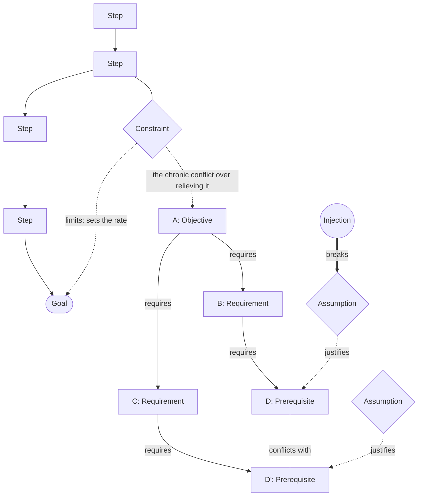

# Theory of Constraints & Evaporating Cloud

> Finds the single step that sets a system's throughput, then uses the Evaporating Cloud to break the chronic conflict guarding it by invalidating an unstated assumption rather than compromising. Category: Strategic & Business Decomposition. Reference: [Theory of constraints](https://en.wikipedia.org/wiki/Theory_of_constraints). [Open the 3D graph](./index.html) (needs internet for Three.js; on GitHub open via Pages or clone).

## What it decomposes

Eliyahu Goldratt's Theory of Constraints, set out as a novel in *The Goal* (1984), takes apart a system that produces something — a plant, a build programme, a queue of work — and holds that its output is set by one step and not by the average of all of them. From that follow the five focusing steps: identify the constraint, exploit it (get everything the current configuration allows out of it), subordinate everything else to it (stop optimising steps that already have spare capacity), elevate it (add capacity), and when it is broken go back to the first step, because the constraint has moved somewhere else. Three slots carry that view here: `goal`, `step`, `constraint`.

The other five slots are a second tool. The Evaporating Cloud is Goldratt's conflict resolution diagram: five boxes, a shared objective A that nobody disputes, two requirements B and C that are each necessary for A, and two prerequisites D and D' that would satisfy B and C respectively and cannot both be done. `objective`, `requirement`, `prerequisite`, `assumption` and `injection` are that diagram. The two tools sit on one page because in practice they arrive together. Identifying a bottleneck is rarely what stops an organisation; the bottleneck is usually protected by a chronic conflict about how to relieve it, in which each of the two obvious moves is blocked by a requirement nobody is willing to give up. Elevating the constraint is exactly the move that some other necessary condition forbids. The cloud is the tool for that conflict, and a constraint diagram without it names a problem the reader already knew about. Both examples below show both halves: the Bearington plant's constraint is the NCX-10 and its conflict is batch size; CoreWeave's constraint is speculative capital and its conflict is whether to build ahead of contracts or to haircut the demand signal.

The `assumption` slot is where the framework earns its keep. Each of the cloud's four arrows rests on a belief that is never stated, because to the people inside the system it is not a belief but the way things are — and one of the four is normally invalid. Finding it is what breaks the conflict, and an injection that denies it lets both requirements be met at once instead of traded off. That is what "evaporating" means, and the alternative is the failure mode the cloud exists to prevent: the compromise. Build a bit further ahead, haircut a bit less; batch a bit smaller, lose a bit more setup. A compromise leaves every assumption intact and buys a worse version of both requirements, and it is what you get whenever the assumptions are never written down. Without the framework the output is "there is a real trade-off here" and a negotiated midpoint. With it, the output is a list of four beliefs, each of which can be checked, and a named change that makes one of them false.

## The slots



| Slot | What goes here | Typical provenance | Why that provenance |
|---|---|---|---|
| `goal` | What the system exists to produce; throughput is measured against it, not against local activity. | either | Stated when somebody says what the system is for (`cg1`, `g1`, `g2`), implied when a speaker only says what he is measured on. |
| `step` | A stage in the flow of work. Every step but one has spare capacity. | fact | Speakers name their stages, and a stage you cannot quote is a stage you invented. In the TBPN example six step nodes are the candidate bottlenecks the speaker rules out on the record. |
| `constraint` | The single step that limits throughput; an hour lost here is an hour lost for the whole system. | derived | Normally inferred from symptoms: a queue in front, idle time behind, a schedule that slips whatever else is fixed. Both examples here are the exception — the scenario states it (`cc1`, `cc2`) and Venturo names his own (`c1`) — and when that happens the derived work moves to where the constraint goes next (`c2`). |
| `objective` | The shared objective both sides of the conflict want. | either | Usually stated, because it is the one thing nobody in the conflict disputes (`co1`, `o1`). |
| `requirement` | A necessary condition for the objective; neither side disputes it. | either | The content is normally stated, as a demand or a worry (`cb1`, `cb2`, `b1`, `creq`). The *necessity* is the inferred part, which is why every `requires` edge out of an objective is derived in both examples. |
| `prerequisite` | A wanted action that satisfies a requirement; the two prerequisites conflict. | either | Usually stated, because the prerequisites are what people argue about (`cd1`, `cd2`, `d1`, `d2`). |
| `assumption` | The unstated belief behind a requirement-to-prerequisite arrow; the one that is invalid breaks the conflict. | derived | Always derived, in both examples and as a rule. An assumption somebody states out loud has already been examined and is no longer what holds the conflict in place; the one that matters is invisible to the people inside it. This is the slot the framework exists for. |
| `injection` | The idea that invalidates an assumption and evaporates the cloud instead of compromising between the two sides. | derived | Derived by construction: an injection is a thing that does not exist yet but would work if it did. That is also why it is the natural idea-bearing slot. |

## Example 1: The Bearington plant: the NCX-10 and the batch-size cloud

Goldratt's plant from *The Goal*: two stations that cannot keep up set the whole plant's output, and the manager is told at once to cut cost per part and to cut lead time — a conflict that exists only because the plant runs one batch size for every station.

### Source text

> UniCo's Bearington plant makes assemblies to order and is three months late on nearly every one. Work flows from the milling machines through the NCX-10, a single computerised machining centre that replaced three older machines, then to heat treat, then to assembly and shipping. The NCX-10 and the heat-treat oven are the only stations that cannot keep up: parts pile up in front of them while every other station has idle time. Plant accounting measures each work centre on its own efficiency, so supervisors run the largest batches they can, and the NCX-10 is often set up for a part that is not needed for weeks. Division has told the plant manager that the plant exists to make money, and that it will be closed in three months unless it ships on time and at cost. He is told two things at once: keep cost per part down, and cut the lead time on late orders. To keep cost per part down he is expected to run large batches, so that setup time is spread over more parts. To cut lead time he must run small batches, because a part waits behind the whole batch before it moves on. The same batch size cannot be both large and small, and nobody at the plant will say which of the two orders takes precedence. Jonah tells him only that an hour lost at the NCX-10 is an hour lost for the whole plant.

After Eliyahu M. Goldratt, *The Goal* (1984); the scenario text is written for this example so that the fact nodes have something verbatim to quote.

### Decomposition

Twelve of the seventeen nodes are facts, none of them paraphrases; `source_ref` is the sentence number in the text above.

Goal

- `cg1` **Make money** [fact] The plant's goal, as division states it, is to make money; every local measure is only a proxy for it. "the plant exists to make money" (sentence 5)

Step

- `cs1` **Milling machines** [fact] Work enters at the milling machines, the first stage of the flow. "Work flows from the milling machines" (sentence 2)
- `cs2` **NCX-10 machining centre** [fact] The NCX-10, a single computerised machining centre that replaced three older machines, is the second stage. "the NCX-10, a single computerised machining centre that replaced three older machines" (sentence 2)
- `cs3` **Heat treat** [fact] Parts go from the NCX-10 to the heat-treat oven. "older machines, then to heat treat" (sentence 2)
- `cs4` **Assembly and shipping** [fact] Parts are assembled and shipped; this is where an order becomes revenue. "then to assembly and shipping" (sentence 2)

Constraint

- `cc1` **NCX-10 and heat treat cannot keep up** [fact] The NCX-10 and the heat-treat oven are the only stations that cannot keep up; parts pile up in front of them while every other station has idle time. "The NCX-10 and the heat-treat oven are the only stations that cannot keep up" (sentence 3)
- `cc2` **An hour lost at the NCX-10** [fact] Jonah's rule: an hour lost at the NCX-10 is an hour lost for the whole plant. It says nothing about an hour lost anywhere else. "an hour lost at the NCX-10 is an hour lost for the whole plant" (sentence 10)

Objective

- `co1` **Ship on time and at cost, or close** [fact] The objective both sides serve: the plant will be closed in three months unless it ships on time and at cost. "it will be closed in three months unless it ships on time and at cost" (sentence 5)

Requirement

- `cb1` **Keep cost per part down** [fact] One of the two things the plant manager is told at once: keep cost per part down. "keep cost per part down" (sentence 6)
- `cb2` **Cut lead time on late orders** [fact] The other thing he is told at once: cut the lead time on late orders. "cut the lead time on late orders" (sentence 6)

Prerequisite

- `cd1` **Run large batches** [fact] To keep cost per part down he is expected to run large batches, so that setup time is spread over more parts. "he is expected to run large batches, so that setup time is spread over more parts" (sentence 7)
- `cd2` **Run small batches** [fact] To cut lead time he must run small batches, because a part waits behind the whole batch before it moves on. "he must run small batches, because a part waits behind the whole batch before it moves on" (sentence 8)

Assumption — all four derived, none of them said by anyone in the scenario

- `ca1` **A setup hour anywhere is lost output** [derived 0.80] Large batches lower cost per part only if every setup hour is production capacity the plant loses. That holds at the NCX-10 and at heat treat; at a station with idle time a setup hour costs the plant nothing. Rationale: The text gives the practice (run the largest batches you can) and the accounting that rewards it, but never the belief that makes the practice pay. Sentence 3 says every other station has idle time, and sentence 10 gives the rule only for the NCX-10, so the belief is both unstated and false off the constraint.
- `ca2` **Batch size sets lead time everywhere** [derived 0.75] Small batches cut lead time only if the queue in front of each station shrinks with the batch. In front of the constraint the queue is set by the constraint's rate, not by the batch size. Rationale: Sentence 8 gives the mechanism (a part waits behind its whole batch) but assumes it dominates at every station. Sentence 3 says parts pile up in front of two stations only, which is what makes the assumption partial rather than simply wrong.
- `ca3` **Local efficiency measures plant cost** [derived 0.70] Cost per part measured at a work centre is treated as the plant's cost, so a requirement about plant economics is discharged by a local efficiency number. Rationale: Sentence 4 states the accounting practice but not the belief behind it. The step from 'the plant must ship at cost' to 'each work centre must be efficient' is the inference that makes cost per part a requirement at all.
- `ca4` **One batch size for every station** [derived 0.85] The conflict exists only because the plant sets a single batch size for the whole flow, so both requirements collide on one decision variable. Rationale: Sentence 9 states that the same batch size cannot be both large and small; it does not ask why there is only one batch size. Once the batch is allowed to differ by station the two prerequisites stop being alternatives.

Injection

- `ci1` **Batch large at the constraint only** [derived 0.80] Set the batch size per station instead of per plant: run large batches at the NCX-10 and heat treat, where a setup hour is an hour of plant output, and split batches everywhere else, where the setup costs idle time the plant was not selling. Both requirements are then met at once. Rationale: Applies Jonah's rule in sentence 10 to the batch-size decision. Because the rule is stated only for the NCX-10 and sentence 3 says every other station has idle time, the plant-wide setup logic in `ca1` fails off the constraint, and with `ca4` dropped the batch size can vary by station.

Edges. Seven of the twenty are facts, each joining two fact nodes and quoting the scenario's own connective.

- `cef1` `cs1` -> `cs2` (feeds) [fact] "Work flows from the milling machines through the NCX-10" (sentence 2)
- `cef2` `cs2` -> `cs3` (feeds) [fact] "replaced three older machines, then to heat treat" (sentence 2)
- `cef3` `cs3` -> `cs4` (feeds) [fact] "then to heat treat, then to assembly and shipping" (sentence 2)
- `cel2` `cc2` -> `cg1` (limits) [fact] "an hour lost at the NCX-10 is an hour lost for the whole plant" (sentence 10)
- `cer3` `cb1` -> `cd1` (requires) [fact] "To keep cost per part down he is expected to run large batches" (sentence 7)
- `cer4` `cb2` -> `cd2` (requires) [fact] "To cut lead time he must run small batches" (sentence 8)
- `cec1` `cd1` -> `cd2` (conflicts with, label "cannot both be") [fact] "The same batch size cannot be both large and small" (sentence 9)

Thirteen are derived. Two complete the throughput view: `cef4` `cs4` -> `cg1` (feeds, 0.75), rationale "Shipping is the point at which an order becomes money. The text names the goal and names shipping but never joins them."; `cel1` `cc1` -> `cg1` (limits, label "sets the rate", 0.80), rationale "Sentence 3 says two stations cannot keep up and sentence 1 says the plant is three months late; that the plant's output is therefore the rate of those two stations is the Theory of Constraints reading, not a statement in the text." Two are the cloud's top arrows: `cer1` `co1` -> `cb1` and `cer2` `co1` -> `cb2` (requires, 0.85 each), rationale "sentence 5 sets the objective and sentence 6 lists the two demands adjacently; that the first demand is a necessary condition for the objective rather than a preference is the cloud's reading." Five hang the assumptions on the arrows they justify: `cej1` `ca1` -> `cd1` (0.80), `cej2` `ca2` -> `cd2` (0.75), `cej3` `ca3` -> `cb1` (0.70), `cej4` `ca4` -> `cd1` and `cej5` `ca4` -> `cd2` (0.85 each). Two are the injection's denials: `ceb1` `ci1` -> `ca1` (breaks, label "invalid off NCX-10", 0.80) and `ceb2` `ci1` -> `ca4` (breaks, 0.80). Two are grounding links: `ces1` `ci1` -> `cc2` (0.80) and `ces2` `ci1` -> `cc1` (0.75).

### What the LLM added and why it helps

Hide the derived layer and the scenario is still all there: a flow of four stations, two that cannot keep up, a goal, an objective, two requirements, two prerequisites that cannot both be done, and — because seven of the twenty edges are facts — most of the arrows joining them. That is a property of written scenario prose, which states its own connectives: "To keep cost per part down he is expected to run large batches", "The same batch size cannot be both large and small". The cloud arrives with its arrows attached. Keep this number in mind for the second example.

What is missing from the fact layer is every reason. Nobody in the text says why large batches follow from cost per part, and that is the whole of the LLM's contribution: `ca1` through `ca4`, the four beliefs on the four arrows. `ca4` (0.85) is the structural one — the conflict is a conflict only because there is a single plant-wide batch size — and `ca3` (0.70) is the accounting one, the step from "the plant must ship at cost" to "each work centre must be efficient" that turns cost per part into a requirement at all.

`ca1` (0.80) is the invalid assumption, and the point of the example is *how* it is invalid. It is not simply false. A setup hour at the NCX-10 really is an hour of plant output gone, exactly as Jonah's rule (`cc2`) says. It is false at every station that has idle time, where the setup consumes capacity the plant was not selling anyway. An assumption that is half true is the kind that survives unexamined for years, because everybody who challenges it can be shown a case where it holds. Goldratt's own answer is `ci1` (0.80): batch large at the constraint only, split batches everywhere else, which denies `ca1` where it fails and drops `ca4` outright (`ceb1`, `ceb2`). Both requirements are then met at once. The compromise — a medium batch size everywhere — meets neither, and is what the plant would have settled on had nobody written the assumptions down.

## Example 2: from the TBPN transcripts: CoreWeave: the constraint is speculative capital, not power

Episode "Windsurf Chaos Aftermath, Nvidia Back In China, Richard Mille Deep Dive, Apple Buying $500M In Rare Earth Magnets", 2025-07-15, [transcript](../../../tbpn-transcripts/transcripts/2025-07-15_windsurf-chaos-aftermath-nvidia-back-in-china-richard-mille-deep-dive-apple-buying-500m-in-rare-earth-magnets-zak-kukoff-brian-venturo-tyler-cowen-aus.md); line numbers refer to it. CoreWeave co-founder Brian Venturo walks the compute build chain, rules out grid power, transformers, UPS and labour one by one, names speculative capital as the biggest constraint (L4856), and then states the cloud that constraint produces: build ahead from the balance sheet and risk the company, or haircut the demand signal and arrive still constrained (L3938-L3964). An operator naming his own binding constraint out loud, eliminating the popular candidates with evidence, and then stating the chronic conflict it produces gives both halves of this framework from one speaker in one interview. The conflict is about the constraint itself, which is the case the Evaporating Cloud was built for.

### Facts (quoted)

Fourteen of the twenty-one nodes and three of the twenty-nine edges are facts, none of them paraphrases. `source_ref` is the speaker plus the line range in the file.

Goal

- `g1` **Serve the labs' compute need** [fact] CoreWeave's first job is serving the customers and partners that got it here: the big AI labs and the hyperscalers, who have an insatiable need for compute infrastructure. "The first is serving the customers and partners that got us here. That's the big AI labs, it's the hyperscalers. It's the people that have an insatiable need for computer infrastructure." (Brian Venturo, L3868-L3876)
- `g2` **Unblock the customers' growth** [fact] Those customers are blocked from delivering to their next customer and from growing their user base because they do not have any GPUs; throughput here is measured in their unblocked growth. "They're the ones that are blocked from delivering to their next customer, from growing their user base, because they don't have any GPUs." (Brian Venturo, L3878-L3884)

Step

- `s_power` **Grid power from base load** [fact] Contrary to the shortage narrative, the data show a tremendous amount of power available from base load and load-following generation. "Everybody talks about how there's no power left in America. And if you actually look at the data, there's a tremendous amount of power available from base load and load following generation." (Brian Venturo, L4812-L4816)
- `s_transformers` **Transformers: inside the lead time** [fact] Electrical transformers are a problem, but they are not outside the lead-time window: they can be planned for. "transformers are a problem, but they're not outside the lead time window" (Brian Venturo, L4858-L4858)
- `s_ups` **UPS: only if needed tomorrow** [fact] Uninterruptible power supplies, like everything else in the build, are only a problem if you need them tomorrow. "UPS is everything's a problem if you need it tomorrow" (Brian Venturo, L4862-L4862)
- `s_labor` **Not enough electricians** [fact] There are not enough electricians in the world to build these data centres on the timelines the customers need. "there's not enough electricians in the world to go out and build these things and timelines these people need" (Brian Venturo, L3912-L3912)
- `s_build` **Data centre construction** [fact] The data hall itself has to be built, which is why operators are asking how to modularise data centre construction while the planes are already in the air. "How do you modularize the data center construction?" (Brian Venturo, L3912-L3912)
- `s_fiber` **Fiber between metros** [fact] Fiber capacity between metros is going to be an issue, though not necessarily an insurmountable one. "Fiber capacity between metros is going to be an issue." (Brian Venturo, L4786-L4786)

Constraint

- `c1` **Speculative capital is the constraint** [fact] The biggest constraint is speculative capital to build out to meet demand that is expected but not yet contracted. Every physical input is a problem only against a short enough clock. "it goes back to my point earlier that the biggest constraint is speculative capital to build out to meet demand that we expect." (Brian Venturo, L4856-L4856)

Objective

- `o1` **Solve it for them; you don't get both** [fact] Any problem can be solved with enough time or capital, and a lot of the time you do not get both, so the objective is choosing the right path to solve the customers' compute problem. "I can solve any problem with enough time or capital, right? And a lot of the times you don't get both. So it's choosing, you know, what's the right path to go?" (Brian Venturo, L3916-L3922)

Requirement

- `b1` **Build the gigawatts demand calls for** [fact] Everyone on the hyperscale side, and CoreWeave in its own seat, sees that a given number of gigawatts of data centre capacity has to be built; the demand signals are there, and the speculative capital is not. "we need to build x number of gigawatts data center capacity, right? Like we know the demand signals are there. But the capital and the speculative capital isn't there to do it." (Brian Venturo, L3938-L3942)
- `creq` **Do not put the company at risk** [fact] Building beyond what the balance sheet can carry, if the demand does not show up, puts the entire company at risk; survival bounds how far ahead CoreWeave can build. "any more than that, and the demand doesn't show up, and I put my entire company at risk." (Brian Venturo, L3950-L3952)

Prerequisite

- `d1` **Build ahead from the balance sheet** [fact] CoreWeave can go out and build X gigawatts of capacity for the next two or three years from its own balance sheet. "I can go out and I can build X gigawatts of capacity for the next two or three years, right? From my balance sheet." (Brian Venturo, L3944-L3948)
- `d2` **Haircut the demand signals** [fact] CoreWeave haircuts the demand signals it receives and builds only to a part of them, so that by the time the capacity arrives it is in the same constrained position it is in today. "so we're basically having to haircut the demand signals that we get, and only build to a certain extent of it, and then by the time we get out there, we're in the same constrained position we're in today." (Brian Venturo, L3956-L3964)

Fact edges. Three, each joining two fact nodes and quoting the turn in which Venturo states the connection himself.

- `el3` `c1` -> `b1` (limits, label "capital isn't there") [fact] "we know the demand signals are there. But the capital and the speculative capital isn't there to do it." (Brian Venturo, L3940-L3942)
- `el4` `c1` -> `d1` (limits) [fact] "the biggest constraint is speculative capital to build out to meet demand that we expect" (Brian Venturo, L4856-L4856)
- `ec2` `d1` -> `creq` (conflicts with, label "risks the company") [fact] "From my balance sheet. But any more than that, and the demand doesn't show up, and I put my entire company at risk." (Brian Venturo, L3948-L3952)

### Decomposition

Seven derived nodes and twenty-six derived edges. Fact nodes are referenced by id from the list above.

Constraint (`c1` is the stated one)

- `c2` **Break it: the constraint moves back** [derived 0.55] If the capital constraint were relieved, the binding step would move back into the physical chain: transformer and UPS lead times, electricians and peak-day power are inside the window only because nobody is building at the unhaircut rate. Rationale: The fifth focusing step: after a constraint is elevated the next one binds. Venturo says the physical inputs are not outside the lead-time window, which is a statement about today's build rate, not about the rate a fully funded industry would attempt. The step is a standard TOC reading, not something he says. Supported by `c1`, `s_transformers`.

Assumption — all four derived, none of them said by anyone in the interview

- `a1` **Only our own balance sheet can fund it** [derived 0.75] Capacity ahead of contracts can only be funded by the developer's own equity, so wanting the gigawatts built means wanting to carry the demand risk yourself. Rationale: Venturo moves from 'we need to build x gigawatts' straight to 'I can build X from my balance sheet' with nothing in between. The step is only valid if no other party will fund speculative capacity, which he never says and which the offtake and debt markets around him partly contradict.
- `a2` **Demand risk can only be avoided** [derived 0.70] The only lever for protecting the company is how much you build, because demand risk cannot be transferred to anyone else or priced into a contract. Rationale: Haircutting follows from 'don't risk the company' only if building less is the sole way to hold the risk down. Venturo states the haircut as forced ('having to'), which is exactly the shape of an unexamined assumption.
- `a3` **Capacity late is throughput lost** [derived 0.65] Capacity that is not standing when the demand arrives is throughput lost rather than deferred: the customer is blocked, goes elsewhere, and does not come back. Rationale: This is what makes 'build the gigawatts' a necessary condition rather than a preference. Venturo says customers are blocked without GPUs and that demand has grown by an order of magnitude repeatedly, but never that a missed window is lost for good.
- `a4` **Committed capital is exposed capital** [derived 0.80] The two courses conflict only because capital committed to speculative capacity is capital exposed to demand that may not arrive; a dollar of capacity is a dollar of risk. Rationale: The conflict is stated as forced ('you don't get both'), so the belief joining the two sides is left implicit. It is the tightest of the four assumptions: it is true of equity-funded capacity and false of capacity funded against a contract.

Injection — the idea-bearing slot; both nodes carry an `idea` field, quoted under "Where the opportunity shows up"

- `inj1` **Sell the capacity forward** [derived 0.60] Finance capacity against long-dated take-or-pay offtake from investment-grade buyers rather than against the developer's equity, so building ahead stops being a bet the builder alone carries and the demand signal can be built to unhaircut. Rationale: Directly denies `a1`: if the capital funding speculative capacity is repaid from a contract rather than from hoped-for demand, the requirement to build the gigawatts no longer entails putting the balance sheet at risk. Venturo's own facts supply the counterparties: solvent hyperscalers with insatiable, order-of-magnitude demand. Supported by `c1`, `d2`.
- `inj2` **Price the demand risk, don't avoid it** [derived 0.55] Put a price on the risk instead of shrinking the build: shortfall insurance and capacity guarantees on speculative gigawatts, which requires a GPU-hour to become a graded, indexed, deliverable good rather than a bilateral favour. Rationale: Denies `a2`: if demand risk can be sold to a party that can diversify it, protecting the company stops requiring a smaller build. It is the weaker injection because nothing in the transcript shows such a market exists; it is the precondition `inj1` needs and the reason `inj1` has not already happened. Supported by `creq`.

Derived edges. Six carry the flow, none of them stated as a sequence: `ef1` `s_power` -> `s_transformers` (feeds, 0.80), `ef2` `s_transformers` -> `s_ups` (0.75), `ef3` `s_ups` -> `s_labor` (0.70), `ef4` `s_labor` -> `s_build` (0.80), `ef5` `s_build` -> `s_fiber` (0.60, the weakest link: the fiber remark comes from a different part of the interview), `ef6` `s_fiber` -> `g1` (0.70). Three more are `limits`: `el1` `c1` -> `g1` (label "sets the rate", 0.85), rationale "Venturo names capital as the biggest constraint on building out to meet expected demand; that this therefore sets the rate at which the labs can be served is the Theory of Constraints step, and it is the whole point of the example."; `el2` `c1` -> `g2` (0.70); `el5` `c2` -> `s_power` (0.55), where the constraint moves next.

The cloud's own structure is four derived edges: `er1` `o1` -> `b1` (requires, 0.70), `er2` `o1` -> `creq` (0.85, "a company that has put itself at risk cannot go on solving anything for its customers"), `er3` `b1` -> `d1` (0.75, adjacency rather than a stated 'in order to'), `er4` `creq` -> `d2` (0.75, "the haircut follows the risk statement as its consequence ('so we're basically having to haircut'), but across a host's interjection, so it is read rather than quoted"). `ec1` `d1` -> `d2` (conflicts with, label "cannot both be", 0.85) is derived for the same reason: Venturo frames the choice as forced without naming the two options as a pair.

Five `justifies` edges hang the assumptions on the arrows: `ej1` `a1` -> `d1` (0.75), `ej2` `a2` -> `d2` (0.70), `ej3` `a3` -> `b1` (0.65), `ej4` `a4` -> `d1` and `ej5` `a4` -> `d2` (0.80 each). Two are the injections' denials: `eb1` `inj1` -> `a1` (breaks, label "invalid under offtake", 0.60) and `eb2` `inj2` -> `a2` (breaks, 0.55). Five are grounding links: `es1` `c2` -> `c1` and `es2` `c2` -> `s_transformers` (0.55 each), `es3` `inj1` -> `c1` and `es4` `inj1` -> `d2` (0.60 each), `es5` `inj2` -> `creq` (0.55).

### What the LLM added

Three fact edges out of twenty-nine, against seven out of twenty in the classic example. That contrast is the sharpest lesson on this page. Written scenario prose states its own connectives — "To keep cost per part down he is expected to run large batches", "The same batch size cannot be both large and small" — so the cloud arrives with its arrows attached. Diarised speech almost never does. Speakers state boxes and leave the arrows to the listener: Venturo says he needs the gigawatts, then says he can build X from the balance sheet, then says more than that risks the company, then says he is having to haircut. Every "therefore" between those four is supplied by the reader. On a transcript the cloud's structure is nearly all inference, and hiding the derived layer leaves a set of true statements with almost nothing joining them. That is not a defect in the extraction; it is the measurement of how much the framework is contributing.

On the throughput side the addition is modest and honest. The six steps are all facts, but the chain that makes them a flow is six derived `feeds` edges (0.60 to 0.80) read from how a data centre build works, not from anything said. `el1` (0.85) is the Theory of Constraints step proper: capital being the biggest constraint on building out is stated, but that it therefore sets the rate at which the labs get served is the framework's reading. `c2` (0.55) is the fifth focusing step applied to a source that has no reason to apply it — if the money arrived, transformers, UPS, electricians and peak-day power stop being inside the lead-time window, because "inside the window" was always a statement about today's build rate.

On the cloud side the addition is nearly everything except the boxes. The four assumptions (`a1` 0.75, `a2` 0.70, `a3` 0.65, `a4` 0.80) are the beliefs that make each arrow follow, and none is stated. `a4` is the tightest: a dollar of capacity is a dollar of risk, which is true of equity-funded capacity and false of capacity funded against a contract. `a1` is the one the interview walks straight past — from "we need to build x number of gigawatts" to "I can go out and I can build X gigawatts... from my balance sheet" with nothing in between, which is only valid if no other party will fund speculative capacity. Note what the framework does *not* do here: it does not conclude that Venturo is wrong. It converts a forced choice into four checkable statements, and the two injections then say what would have to become true for the choice to stop being forced.

### Where the opportunity shows up

The idea-bearing slot is the injection (`idea_bearing_slot: "injection"`), and the reason is structural rather than editorial. An injection is by construction a thing that does not exist yet but would work if it did — that is the definition of the slot, and it is also the definition of an opportunity. The assumptions say what the market currently believes; the injection says what instrument or capability would make one of those beliefs false. Both injection nodes carry an `idea` field.

- `inj1` **Sell the capacity forward**, derived, confidence 0.60. Idea: "A forward market in compute - standardised, tradable GPU-hour contracts underwritten by investment-grade offtakers - is the missing instrument that would let neoclouds build to the unhaircut demand signal." Read from the node: the constraint Venturo names is speculative capital, and capital is speculative only while the revenue behind it is hoped for rather than contracted. The counterparties already exist in his own account — solvent hyperscalers with insatiable demand — and what is missing is the contract that makes their demand financeable.
- `inj2` **Price the demand risk, don't avoid it**, derived, confidence 0.55. Idea: "Underwriting infrastructure for compute - a quality grade, delivery telemetry and shortfall insurance that make a GPU-hour financeable - is the underserved layer beneath every compute offtake contract." Read from the node: if demand risk can be sold to a party able to diversify it, protecting the company stops requiring a smaller build. This is the weaker of the two and the more fundamental: nothing in the transcript shows such a market exists, which is both why the confidence sits at 0.55 and why `inj1` has not already happened.

Both sit in the 0.50-0.65 band, plausible but contestable, and correctly so: each names an instrument that the source does not mention, and their support runs through `c1` and `d2` rather than through anything said about finance. `c2` (0.55) carries no `idea` field but marks where the next opportunity would be: if the capital constraint were broken, the binding step would move back into transformer lead times, electricians and peak-day power, and the physical-supply businesses would become the interesting ones again.

## Building a knowledge graph with this framework

### Node and edge types

Node types are the eight slots. One application of the framework is one connected component with two lobes: a throughput lobe (`goal`, `step` chain, `constraint`) and a cloud lobe (`objective`, two `requirement`s, two `prerequisite`s, the `assumption`s on the arrows, the `injection`s), joined by `limits` edges from the constraint into the cloud. Both examples use the `plane` layout with two labelled regions for exactly those lobes.

Edge types are the six relations plus the reserved grounding link. `feeds` runs step to step and from the last step to the goal. `limits` runs from a constraint to the goal, to a requirement, or to a prerequisite; it is the only relation that crosses between the two lobes, and in the TBPN example it is what makes the page one graph and not two (`el3`, `el4`). `requires` runs objective to requirement and requirement to prerequisite, and never skips a level. `conflicts_with` joins the two prerequisites; `ec2` shows the variant where a speaker states the conflict against the requirement rather than against the other prerequisite. `justifies` runs from an assumption to the arrow it underwrites, modelled as an edge to that arrow's target node, which is why `ca4` and `a4` each have two `justifies` edges: one belief holding both sides. `breaks` runs from an injection to the assumption it denies, and is the only outgoing relation an injection has besides grounding. `supported_by` runs from any derived node to the facts it rests on and is always derived.

Facts carry `source_quote` and `source_ref`, derived nodes `confidence` and `rationale`, and `entities` uses the spellings in `tbpn-transcripts/extractions/`. An edge is a fact only when both endpoints are fact nodes and one turn states the connection in words that can be quoted — which is why `er4` stays derived at 0.75 even though the transcript reads "so we're basically having to haircut": the "so" is separated from the risk statement by a host's interjection, so the connective is read rather than quoted.

### Fact or derived: rules of thumb

One provenance point deserves its own paragraph, because it changes how the budget is spent. The registry's typical provenance for `constraint` is `derived`, and rightly so: an LLM normally has to infer the bottleneck from symptoms, since a system's own participants argue about which step is limiting and usually name the one that complains loudest. In the TBPN example it is a fact. `c1` is Venturo naming his own constraint out loud, and the six preceding step nodes are him eliminating the popular candidates on the record — power, transformers, UPS, electricians. That inverts the usual work. Identification is free; the derived effort moves to `c2`, where the constraint goes once this one is relieved, which is the fifth focusing step and the thing nobody in an interview has any reason to say, and to the four assumptions in the cloud. So: **when a source names its own constraint, spend the inference budget on the cloud, not on rediscovering the bottleneck.** The corollary is worth holding too — a stated constraint is a claim, not a finding, and the derived layer is where it gets tested, which is exactly what `c2` and `el5` do.

- `goal`: extracted when someone says what the system is for, which is common in an interview's opening answer. Inferred from what the speaker treats as success when nobody states it, at 0.60 to 0.75, because a wrong goal makes every downstream throughput judgment wrong. Empty: do not build the throughput lobe at all; a flow with no goal has no throughput to be limited.
- `step`: extracted, always. A step you cannot quote is a step you invented, and inventing steps is how a plausible-looking flow gets built out of general knowledge about the industry. Empty: keep the cloud lobe and drop the flow; a cloud alone is still a valid decomposition.
- `constraint`: normally inferred from the symptom pair — work accumulating in front of it, spare capacity behind it — at 0.65 to 0.85, with the rationale naming the symptom. Extracted when a speaker names it, which is worth taking at face value and then testing. Empty: leave it empty and say so; a graph with a guessed constraint is worse than one with none.
- `objective`: normally extracted, because it is the thing both sides of the conflict agree on and therefore the thing nobody argues about on the record. Inferred at high confidence when the two requirements are stated and their common purpose is obvious. Empty: the two requirements probably belong to different clouds.
- `requirement`: the content is extracted; the necessity is inferred. Both examples state the demands and neither states that they are necessary conditions, so every `requires` edge from the objective is derived (0.70 to 0.85). Empty on one side: you have a decision, not a conflict, and the cloud does not apply.
- `prerequisite`: extracted, almost always, because the prerequisites are what people argue about. Inferred only when a speaker names an action without naming the requirement it serves. Both prerequisites must be actions, not outcomes; "ship on time" is a requirement, "run small batches" is a prerequisite.
- `assumption`: always derived. This is the slot the framework exists for, and it is empty in every source, because an assumption somebody has stated out loud has already been examined and is no longer what holds the conflict in place. Write one per `requires` arrow in the lower half of the cloud and at least one that spans both sides (`ca4`, `a4`), in the form "X follows from Y only if Z". Then ask which is invalid; the answer is often the one that is true in the place everyone looks and false everywhere else, which is why `ca1` survives at Bearington. Empty: not possible — if you cannot write the assumptions, the conflict is not real.
- `injection`: always derived, and only accepted if it has a `breaks` edge to a named assumption. An injection that reduces both prerequisites a little is a compromise, and a compromise is the outcome the cloud exists to prevent: it keeps every assumption intact and buys a worse version of both requirements. Confidence tracks whether the injection needs anything that does not exist (`inj2` at 0.55 needs a market; `ci1` at 0.80 needs only a policy change). Empty: leave the assumptions standing and say which one you would test first.

### Extraction recipe

```text
Decompose ONE system and its chronic conflict from <file>, lines <a>-<b>,
with the Theory of Constraints and the Evaporating Cloud.

THROUGHPUT LOBE
1. goal: what the system is for, in the speaker's words if he says it (fact),
   otherwise what he treats as success (derived, 0.60-0.75).
2. step: each stage of the flow that is named, as a verbatim span of 5+ words.
   No span, no node. Include the stages a speaker names in order to RULE OUT;
   they are steps, not constraints.
3. constraint: the one step that sets the rate. Fact if a speaker names it;
   otherwise derived, and the rationale must cite the symptom (queue in front,
   idle time behind, slippage that survives every other fix). At most one
   binding constraint. Add a second, derived and low-confidence, for where the
   constraint moves once this one is relieved (the fifth focusing step).
4. Edges: feeds along the flow, feeds from the last step to the goal, limits
   from the constraint to the goal.

CLOUD LOBE
5. objective (A): the outcome both sides want and neither disputes.
6. requirement (B, C): the two necessary conditions for A, one per side.
   The content is usually quoted; the necessity is your inference.
7. prerequisite (D, D'): the two actions that satisfy B and C and cannot both
   be done. Actions, not outcomes. Verbatim if stated.
8. assumption: for EACH arrow B->D and C->D', the unstated belief of the form
   "<prerequisite> follows from <requirement> only if <belief>". Always derived.
   Add one that spans both sides and explains why the two collide at all.
   Then mark which one you judge invalid, and say where it holds and where it
   fails - an assumption that is false everywhere was never load-bearing.
9. injection: the change that makes an invalid assumption false, with a breaks
   edge naming it. Must let BOTH requirements be met; if it only softens the
   two prerequisites it is a compromise, delete it. Put the business reading in
   the node's `idea` field, not in the rationale.
10. Edges: requires (A->B, A->C, B->D, C->D'), conflicts_with (D<->D'),
    justifies (assumption -> the arrow's target), breaks (injection ->
    assumption), limits from the constraint into whichever cloud box it binds.
    An edge is fact ONLY if both endpoints are facts AND one turn states the
    link, quoted verbatim; on a transcript expect almost none. supported_by
    from every derived node to its facts, always derived.

Output one graph.json example: nodes [{id, slot, label <=40 chars, text,
provenance, source_quote+source_ref | confidence+rationale, idea?, entities}],
edges [{id, from, to, relation, provenance, confidence?, source_quote?,
source_ref?, label?, rationale?}], idea_bearing_slot "injection".
```

Afterwards run `node _meta/validate.mjs <dir>` for quotes, the paraphrase cap and derived-to-fact connectivity, then five checks it cannot make. Exactly one constraint binds, and any second constraint node is the where-it-moves-next node and derived. Every assumption is written as a conditional whose falsity would let the requirement be met without the prerequisite, and is not a restatement of either box it sits between. Every injection has a `breaks` edge and would satisfy both requirements at once. Every `fact` edge's quote really contains the connective and not merely both endpoints. And the two prerequisites trace to *different* requirements — two things a speaker dislikes are not a cloud.

### Failure modes

- **Constraint by volume.** The step that is complained about most becomes the constraint. In this corpus that is power, which is exactly what Venturo argues against. Guard: require the symptom pair in the rationale (accumulation in front, spare capacity behind); a constraint node with neither is a topic, not a constraint.
- **Every step a constraint.** Six named difficulties become six constraint nodes and the framework says nothing. Guard: one binding constraint per flow per moment. A difficulty a speaker rules out (`s_transformers`, `s_ups`) is a step node, and the ruling-out is the evidence for the real constraint.
- **Compromise dressed as an injection.** "Build somewhat further ahead, haircut somewhat less" looks like a resolution and is the failure the cloud exists to prevent. Guard: no `breaks` edge to a named assumption, no injection. Then check it satisfies both requirements rather than partially satisfying each.
- **Assumption restates the box it sits under.** "He runs large batches because large batches are cheaper per part" is the arrow written twice. Guard: the assumption must be a general conditional that could be false while both boxes stay true, and its falsity must be enough to cut the arrow.
- **Assumption declared simply false.** Calling `ca1` false makes the example incoherent, because a setup hour at the NCX-10 really is lost output. Guard: state where the assumption holds and where it fails. An assumption that is false everywhere would have been noticed already; the load-bearing ones are true in the place everybody looks.
- **Invented conflict.** Two irritations a speaker mentions become D and D'. Guard: both prerequisites must trace up to different requirements and down to the same decision variable, and the source must show the choice being forced (`ec1`, `ec2`), even if the `conflicts_with` edge itself is derived.
- **Fact edges on a transcript.** A speaker's "so" is taken as a quoted connective when it sits across a turn boundary. Guard: the rule in SPEC section 3 — both endpoints fact, and the quote must contain the connective in one turn. `er4` is derived at 0.75 for exactly this reason. Three fact edges out of twenty-nine is a normal result, not a failure.
- **Over-confident injections.** An injection that requires a market, an instrument or a regulator that does not exist is written at 0.80. Guard: the confidence bands. An injection needing only a policy change inside the system sits at 0.75 to 0.85 (`ci1`); one needing an institution that has to be built sits at 0.50 to 0.60 (`inj1`, `inj2`).
- **The idea written into the rationale.** The opportunity and the inference become impossible to tell apart. Guard: the rationale says only why the inference follows from the quoted facts; the business reading goes in the node's `idea` field, and only in the injection slot.

## Related frameworks

- [5 Whys](../five-whys/README.md): both chase a single root cause, but Five Whys walks back a causal chain from one failure event, while this looks for the step that gates a flow — use Five Whys when something broke, this when nothing broke and output is still capped.
- [Rumelt's Strategic Kernel](../rumelt-strategy-kernel/README.md): diagnosis, guiding policy, coherent action. The constraint is a diagnosis and the injection a guiding policy; prefer Rumelt when the question is what the whole strategy should be, this when the question is why throughput will not rise.
- [Dialectical Decomposition](../../01-narrative-and-statement/dialectical-decomposition/README.md): the other framework built around a contradiction. A synthesis combines what is true in both sides; an injection dissolves the need to choose by making one side's justifying belief false. Prefer dialectic for a contested position, the cloud for a conflict inside one actor's own decision.

[Library root](../../README.md).
