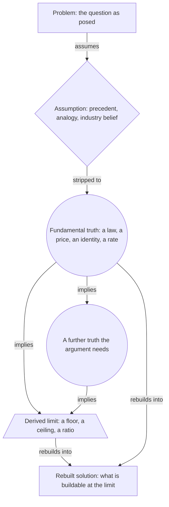

# First Principles Thinking

> Deletes the precedent and the analogy a question arrives with, keeps only what physics, arithmetic or a market price forces, and asks what the surviving limits allow you to build. Category: Engineering & Cognitive Problem Solving. Reference: [First principle](https://en.wikipedia.org/wiki/First_principle). [Open the 3D graph](./index.html) (needs internet for Three.js; on GitHub open via Pages or clone).

## What it decomposes

Aristotle's *arche* is the first basis from which a thing is known, a proposition not deduced from any other; Descartes' method of doubt is the modern ancestor. The engineering version reasons from physics, arithmetic and unit prices rather than from analogy and what the industry has always charged.

Its object is neither a system nor a failure but a question that arrives with an answer already attached. "Will grid storage ever be cheap?" is asked by someone who already knows the industry price; "Why solar and not nuclear?" by someone who already knows why nuclear is expensive. Five beats: state the question, name the borrowed belief inside it, delete the belief and see what is still standing, work out what the survivors force, rebuild on that bound instead of the precedent.

Two beats get skipped in practice, and they are the two the framework exists to force. Naming the assumption: a speaker who never says which belief is being removed has performed no deletion, so there is no before and no after, and "first principles" becomes a compliment rather than a procedure. And the arithmetic between the truths and the limit: everyone quotes the numbers and nobody divides them. Below, Casey Handmer gives two land prices, $500 an acre per season for agriculture and $100,000 to $200,000 a year under solar, then draws four consequences from a ratio he never computes. It is 200x to 400x, and it is the only quantity in that stretch of argument that matters.

Without those two beats the characteristic failure is analysis one level below the precedent: a cost-reduction programme on the incumbent machine, presented as a rebuild and inheriting the incumbent's floor.

## The slots



| Slot | What goes here | Typical provenance | Why that provenance |
|---|---|---|---|
| Problem | The question as posed, usually with an answer already attached. | fact | Asked out loud, and its wording is evidence for what the questioner takes for granted. |
| Assumption | The precedent, analogy or industry belief the reasoning removes. | either | Normally stated: a speaker has to name a belief to delete it. Inferred only for the frame inside the question, which nobody states because everybody shares it. |
| Fundamental truth | What survives the deletion: a physical law, a market price, an identity, a measured rate. | either | Stated when the speaker cites a number or mechanism, inferred when the argument needs a law he took for granted. Checked, never copied. |
| Derived limit | The bound the truths force: a cost floor, a land price, a ceiling on what a watt earns. | derived | The step whose arithmetic gets skipped. Extracted only when the speaker states the bound himself. |
| Rebuilt solution | What is buildable at the limit rather than the precedent, including what it rules out. | derived | A stated conclusion is a fact; the readings of it as something to build are the LLM's, and carry the `idea` field. |

## Example 1: What a battery pack is made of

The standard modern illustration, written here as a short scenario so that fact nodes quote a text that exists rather than a half-remembered interview. It follows the battery-pack argument popularised as the textbook case of first-principles reasoning (Elon Musk, 2012).

### Source text

> An investor tells a founder that grid-scale energy storage will never be cheap. The industry number, he says, is settled: battery packs cost about six hundred dollars per kilowatt-hour, they have always cost about that, and there is no reason to expect anything different. The founder asks a different question. What is a battery pack actually made of? It is cobalt, nickel, aluminium, carbon, some polymers for separation, and a steel can. She looks up what those materials cost on the London Metal Exchange, adds them up in the quantities a kilowatt-hour of cell needs, and gets about eighty dollars per kilowatt-hour. The rest, she says, is the shape someone has chosen to put the materials in. If you bought the metals on the exchange and combined them into the shape of a cell, you would have a battery for a fraction of what anyone quotes, so the question is not whether cheap storage is possible but which of the steps between the metal and the cell is the one worth attacking.

### Decomposition

Twelve nodes, seven of them facts. Ordered by level, the graph is a five-layer tree from the question down to the rebuild.

Problem

- `p1` **Will storage ever be cheap?** [fact] Whether grid-scale energy storage can ever become cheap. The question arrives with the answer already attached: an investor puts it as a settled no. "An investor tells a founder that grid-scale energy storage will never be cheap." (sentence 1)

Assumption

- `a1` **$600/kWh is the settled number** [fact] The industry price of a battery pack is about six hundred dollars per kilowatt-hour, it has always been about that, and nothing suggests it will change. "The industry number, he says, is settled: battery packs cost about six hundred dollars per kilowatt-hour, they have always cost about that, and there is no reason to expect anything different." (sentence 2)
- `a2` **Past price predicts future price** [derived 0.80] The unstated premise underneath the quoted number: that what packs have historically cost is evidence about what they can cost. Rationale: The investor offers price history as his whole argument ('they have always cost about that'), which only works if history bounds the achievable price. He never states that premise; it is what makes his sentence an argument rather than an observation. Supported by `a1`.

Fundamental truth

- `t1` **A pack is a list of materials** [fact] A battery pack is cobalt, nickel, aluminium, carbon, separator polymers and a steel can. Nothing else is in it. "It is cobalt, nickel, aluminium, carbon, some polymers for separation, and a steel can." (sentence 5)
- `t2` **The metals have a public spot price** [fact] Each of those materials trades on an exchange, so its cost is a published number rather than a matter of opinion. "She looks up what those materials cost on the London Metal Exchange" (sentence 6)
- `t3` **No law fixes what a pack must cost** [derived 0.85] No conservation law or physical constant sets the price of a pack. The price is a fact about a manufacturing process and a market, so the only irreducible term in it is the matter itself. Rationale: The scenario's whole move depends on this and never says it. Both the materials list and the exchange lookup are only interesting if the remaining cost is contingent; if some law forced $600, the decomposition would be pointless. Supported by `t1`.

Derived limit

- `c1` **Materials floor: about $80/kWh** [fact] Priced at the exchange in the quantities a kilowatt-hour of cell needs, the materials come to about eighty dollars per kilowatt-hour. Nothing can make a pack cost less than its matter. "adds them up in the quantities a kilowatt-hour of cell needs, and gets about eighty dollars per kilowatt-hour." (sentence 6)
- `c2` **$520 is process, not matter** [derived 0.90] About $520 of the $600 pack price is not material at all. It is mining margin, refining, cell fabrication, module and pack assembly, logistics, warranty and margin: the shape the materials have been put into. Rationale: Direct subtraction of the two stated numbers, $600 minus about $80, and the scenario names the remainder as 'the shape someone has chosen to put the materials in'. The split is forced once both numbers are on the table. Supported by `c1`, `a1`.
- `c3` **A floor is not a forecast** [derived 0.75] The $80 bounds the pack price from below and says nothing about how close a real process can get to it. It locates where to look, not what to expect. Rationale: Follows from what a lower bound is: the materials number is necessary, not sufficient. The scenario never draws the distinction, and the reader who misses it reads the floor as a price prediction, which is the standard misuse of the method. Supported by `c1`.

Rebuilt solution

- `r1` **Buy metal, build the cell's shape** [fact] Buy the metals on the exchange and combine them into the shape of a cell, and the pack costs a fraction of any quoted price. "If you bought the metals on the exchange and combined them into the shape of a cell, you would have a battery for a fraction of what anyone quotes" (sentence 8)
- `r2` **Attack the costliest step** [fact] The question stops being whether cheap storage is possible and becomes which of the steps between the metal and the cell is the one worth attacking. "so the question is not whether cheap storage is possible but which of the steps between the metal and the cell is the one worth attacking" (sentence 8)
- `r3` **The $520 gap is the market** [derived 0.70] Every step between the metal and the finished cell is a business that owns part of the $520. The gap between floor and price is a map of where the value sits and who currently collects it. Rationale: Reads the arithmetic of c2 as a market description rather than a cost breakdown: if the remainder is process, each process step is a place a company can stand. The scenario stops one step short of saying so. Supported by `r2`.

Edges. Three are facts, each quoting the scenario's own connective:

- `ce1` `p1` -> `a1` (assumes) [fact] "An investor tells a founder that grid-scale energy storage will never be cheap. The industry number, he says, is settled: battery packs cost about six hundred dollars per kilowatt-hour" (sentences 1-2)
- `ce6` `t1` -> `c1` (implies) [fact] "It is cobalt, nickel, aluminium, carbon, some polymers for separation, and a steel can. She looks up what those materials cost on the London Metal Exchange, adds them up in the quantities a kilowatt-hour of cell needs, and gets about eighty dollars per kilowatt-hour." (sentences 5-6)
- `ce7` `t2` -> `c1` (implies) [fact] "She looks up what those materials cost on the London Metal Exchange, adds them up in the quantities a kilowatt-hour of cell needs, and gets about eighty dollars per kilowatt-hour." (sentence 6)

Sixteen are derived. Ten carry a framework relation: `ce2` `p1` -> `a2` (assumes, 0.75); `ce3` `a1` -> `t1` (stripped_to, 0.85), rationale "The scenario replaces the price question with the materials question in the next breath but never says that the $600 reduces to this list; the substitution is the reader's."; `ce4` `a1` -> `t2` (stripped_to, 0.80); `ce5` `a2` -> `t3` (stripped_to, 0.70); `ce8` `c1` -> `c2` (implies, 0.90); `ce9` `t3` -> `c3` (implies, 0.75); `ce10` `c1` -> `r1` (rebuilds_into, 0.85); `ce11` `c2` -> `r2` (rebuilds_into, 0.80); `ce12` `c2` -> `r3` (rebuilds_into, 0.70); `ce13` `c3` -> `r2` (rebuilds_into, 0.70). The other six are the grounding links listed with the nodes above: `ce14` `a2` -> `a1` (0.80); `ce15` `t3` -> `t1` (0.80); `ce16` `c2` -> `c1` (0.90); `ce17` `c2` -> `a1` (0.90); `ce18` `c3` -> `c1` (0.75); `ce19` `r3` -> `r2` (0.70).

### What the LLM added and why it helps

Hide the derived layer and the scenario survives intact: a question, an industry price, a materials list, an exchange, an $80 number and two conclusions. What disappears is every joint between them. `a2` (0.80) is the premise that makes the investor's sentence an argument at all; unstated, "they have always cost about that" is a description of the past and there is nothing to delete. `t3` (0.85) says what the move depends on and nobody says: no law fixes the price, so the only irreducible term is the matter.

`c2` (0.90) is the subtraction the source stops short of, and note that it is `supported_by` `a1`, the assumption the reasoning rejects: a deleted belief can still supply a number, because deleting it means refusing it as a bound, not refusing to read it. `c3` (0.75) blocks the standard misreading, and `r3` (0.70) turns the same $520 from a cost breakdown into a market map.

## Example 2: from the TBPN transcripts: Casey Handmer: why solar and not nuclear, and why not from orbit

Episode "Dwarkesh Patel, Nadia Asparouhova, Augustus Doricko, Casey Handmer, Ishan Mukherjee, Mike Knoop; Trump pardons Milton, CoreWeave IPO winners", 2025-03-28, [transcript](../../../tbpn-transcripts/transcripts/2025-03-28_dwarkesh-patel-nadia-asparouhova-augustus-doricko-casey-handmer-ishan-mukherjee-mike-knoop-trump-pardons-milton-coreweave-ipo-winners.md); line numbers refer to it. Handmer (Terraform Industries, formerly NASA JPL, taught nuclear physics at Caltech) runs the method twice in one uninterrupted answer, L3228-L3458. He names the received explanation for nuclear's cost and deletes it in a sentence unusually explicit for a podcast ("even if NRC didn't exist tomorrow ... even if you could buy enriched uranium on amazon.com"), landing on thermodynamic hardware. Then he kills space-based solar not on launch cost, where that argument is normally had, but on a revenue-per-watt identity from Starlink. Both chains carry real numbers, and both rebuilds land on one object: a sheet of silicon on the ground.

### Facts (quoted)

Seventeen of the twenty-five nodes and five of the thirty-four edges are facts, none of them paraphrases. `source_ref` is the speaker plus the line range in the file.

Problem

- `q1` **Why solar and not nuclear?** [fact] The host asks why Handmer is bullish on solar rather than nuclear, and why solar is the thing he has made his life's work, noting that both are currently in fashion. "Why are you so bullish on solar and not maybe less bullish on nuclear? There's a lot of chatter and everyone loves both right now. But why is solar what you've chosen to kind of make your life's work here?" (Host, L3230-L3236)
- `q2` **Solar in space or on the ground?** [fact] The host asks what the long-run picture looks like: solar panels in space, or solar panels covering the earth. "Is it solar panels all over in space? Is it solar panels all over the earth?" (Host, L3342-L3344)

Assumption

- `a1` **Nuclear is expensive because of the NRC** [fact] The received explanation for nuclear's cost: the regulator and restricted access to enriched uranium. Handmer names it in order to delete it, hypothesising the NRC out of existence and uranium onto Amazon. "And that's even if NRC didn't exist tomorrow, right? Even if you could buy enriched uranium on amazon.com," (Casey Handmer, L3262-L3262)
- `a2` **Cost falls by first-of-a-kind learning** [fact] The standard energy-industry story that a technology gets cheap by grinding from first-of-a-kind through nth-of-a-kind units until economies of scale arrive. Handmer names it as the thing solar no longer needs. "So we don't have to theorize about, well, what is it going to take to get to, you know, first of a kind, second of a kind, hundredth of a kind, you know, start getting those economies of scale down in solar that's already happening." (Casey Handmer, L3300-L3304)
- `a4` **Mirrors and lasers can beam power down** [fact] The premise behind space-based solar power, which the host reports as an existing category: companies are building mirrors and lasers to send orbital power to the ground. "I've seen a couple of these companies that are using mirrors or lasers." (Host, L3412-L3412)

Fundamental truth

- `t1` **A reactor is a steam engine** [fact] A nuclear reactor is a heat source bolted to a steam plant, and steam turbines carry irreducible costs that drive the total up regardless of what is making the heat. "At the end of the day, nuclear reactors are steam engines. And steam engines operate on what's called the Brayton cycle. And there are certain irreducible costs associated with steam turbines and so on that just drive the cost up." (Casey Handmer, L3254-L3258)
- `t2` **Sunlight arrives free, every day** [fact] Sunlight falls on the earth every day at no cost, from a fusion reactor nobody has to build, maintain or license. "sunlight rains down on the earth every day for free. There's a fusion reactor up in the sky." (Casey Handmer, L3266-L3266)
- `t3` **Paper-thin silicon converts it** [fact] A layer of silicon thinner than a sheet of paper converts that sunlight into electricity, and silicon is enormously abundant on Earth. "it is possible to convert that into high grade energy in the form of electricity with a layer of silicon that's thinner than a sheet of paper, considerably thinner than a sheet of paper. The silicon is enormously abundant on the Earth." (Casey Handmer, L3268-L3272)
- `t4` **A terawatt a year, +30-40%** [fact] Factories worldwide already ship more than a terawatt of solar a year, with production rising 30 to 40 per cent annually and no sign of slowing. "There are factories worldwide now churning out more than a terawatt of solar per year with no signs of slowing down. If anything, production is increasing 30 to 40% per year," (Casey Handmer, L3276-L3282)
- `t5` **Revenue per watt, not watts** [fact] The same watt generated in orbit earns about a billion times more when it is spent amplifying radio into internet data than when it is spent transmitting raw power to the ground. Starlink is the working measurement of this. "And the revenue per watt of electricity used to transmit microwaves through Earth's atmosphere to the consumer, because it's chopped up and turned into internet data, as opposed to just raw power, is about a billion times higher." (Casey Handmer, L3430-L3434) Entities: Starlink.
- `t6` **Ground power sells at 10c/kWh** [fact] Delivered electricity on Earth sells for around ten cents a kilowatt-hour, which is the price any beamed-down gigawatt would have to compete with. "than it being attempting to transmit gigawatts of power down to power plants where we pay 10 cents a kilowatt hours or something like that." (Casey Handmer, L3442-L3446)

Derived limit

- `c1` **Nuclear's floor is coal, not zero** [fact] Even with the regulator deleted and fuel freely available, the steam-engine half of the plant means nuclear costs no less than coal. The floor is set by the turbine, not the licence. "it would still be the case that just the steam engine component is going to cost no less than coal." (Casey Handmer, L3262-L3264)
- `c2` **6% of Earth's surface is enough** [fact] About six per cent of the earth's surface under solar would give every person alive American-level energy, roughly twenty barrels of oil a year each: less land than grazing, row crops or forestry already use. "give every man, woman and child on earth the amount of energy we enjoy here in the United States, which is about 20 barrels of oil per person per year, with something like 6% of earth's surface under solar, which is much, much less than we currently use for grazing or for row crops or for forestry." (Casey Handmer, L3360-L3366)
- `c3` **Solar land: $100-200k vs $500/acre** [fact] Land is worth about five hundred dollars an acre per season in agriculture and about one to two hundred thousand dollars an acre per year under solar. "What's gonna happen is the net present value of land for agriculture is about 500 bucks per acre per season. But for solar, it's about 100 you know, 100 or 200 thousand dollars per year." (Casey Handmer, L3382-L3386)
- `c4` **Farmland loses the bid** [fact] If those panels power an AI datacentre that is a thousand times more economically productive than a human brain, farmland is outbid and ultimately paved over with solar. Handmer calls this the true AI doom scenario. "Now, if that's powering an AI, artificial super intelligence data center, which is a thousand times more economically productive than your terribly poorly evolved human brain, which has to sleep eight hours a day, and, you know, browse Twitter, then obviously, economically speaking, our farmland is ultimately going to get paved over with solar and we're going to starve to death." (Casey Handmer, L3386-L3394)

Rebuilt solution

- `r1` **Put it on the ground; it makes power** [fact] A commoditised product with no moving parts, needing no special skills or labour to install and operate, easier than planting corn: put it on the ground and it produces power. "It's a commoditized product. It has no moving parts. You don't need any special skills or labor to install and operate it. It's even easier to do than planting corn. You just put it on the ground and it spits out power," (Casey Handmer, L3306-L3314)
- `r3` **Orbital solar for orbital loads** [fact] There will be a lot of solar in space, but it will power things that are already in space. Nobody will be beaming power down to Earth any time soon. "We will obviously have a lot of solar in space, but I think mostly it'll be for powering applications in space. I don't think people are going to be beaming power down from space to the earth at any time, anytime soon." (Casey Handmer, L3402-L3408)

Fact edges. Five, each joining two fact nodes inside a single turn that states the connection. Note how thin this list is next to the seventeen fact nodes: Handmer supplies the propositions, but he mostly leaves the joins between them to the listener, which is where the derived edges below come from.

- `te1` `a1` -> `t1` (stripped_to) [fact] "And that's even if NRC didn't exist tomorrow, right? Even if you could buy enriched uranium on amazon.com, it would still be the case that just the steam engine component" (Casey Handmer, L3262-L3262)
- `te2` `t1` -> `c1` (implies) [fact] "it would still be the case that just the steam engine component is going to cost no less than coal." (Casey Handmer, L3262-L3264)
- `te3` `t2` -> `t3` (implies) [fact] "sunlight rains down on the earth every day for free. There's a fusion reactor up in the sky. Due to some like weird quantum effects and again, silicon trickery, it is possible to convert that into high grade energy in the form of electricity" (Casey Handmer, L3266-L3268)
- `te5` `t5` -> `t6` (implies) [fact] "The revenue per watt is a billion times higher with it being internet at a few hundred watts or whatever transmission power, than it being attempting to transmit gigawatts of power down to power plants where we pay 10 cents a kilowatt hours or something like that." (Casey Handmer, L3436-L3446)
- `te6` `c3` -> `c4` (implies) [fact] "But for solar, it's about 100 you know, 100 or 200 thousand dollars per year. Now, if that's powering an AI, artificial super intelligence data center, which is a thousand times more economically productive than your terribly poorly evolved human brain, which has to sleep eight hours a day, and, you know, browse Twitter, then obviously, economically speaking, our farmland is ultimately going to get paved over with solar and we're going to starve to death." (Casey Handmer, L3386-L3394)

### Decomposition

Eight derived nodes and twenty-nine derived edges. Fact nodes are referenced by id.

Assumption

- `a5` **Energy tech is ranked by its fuel** [derived 0.65] The frame inside the question itself: that choosing between nuclear and solar is choosing between fuels. Handmer's answer treats it as a choice between machines, which is why a fuel-level argument cannot settle it. Rationale: Nobody states this. It has to be named because the whole answer is a category switch: the question offers uranium against sunlight and the answer compares a turbine hall against a laminated sheet. Without naming the frame, the answer looks like a change of subject rather than a refusal of the premise. Reached from the fact layer through `q1` (edge `te9`).

Fundamental truth

- `t8` **PV skips the heat cycle** [derived 0.85] A photovoltaic cell converts photons to current directly. There is no boiler, turbine, condenser, working fluid or cooling loop, so none of the hardware that sets a thermal plant's floor exists in the bill of materials. Rationale: This is the pivot the argument turns on and Handmer never states it: he says a reactor is a steam engine and separately that a panel is a thin sheet of silicon, and leaves the reader to notice that the second one has no turbine in it at all. Without this step the two cost floors look like the same kind of number rather than floors set by different machines. Supported by `t1`; also reached from `t3` (edge `te14`).

Derived limit

- `c5` **A 200x to 400x gap per acre** [derived 0.90] The two land numbers differ by a factor of two hundred to four hundred, so on price alone no crop can outbid generation for an acre that can reach a grid connection. Rationale: Division of the two figures Handmer states: $100,000 to $200,000 against $500 gives 200x to 400x. The ratio is the operative quantity and he never says it, though every consequence he draws depends on it. Reached from `c3` (edge `te23`).
- `c6` **Licence reform cannot move the floor** [derived 0.80] Because the bound comes from the turbine island rather than from the fuel or the licence, no amount of licensing reform or fuel-market liberalisation moves it. Only a converter with no heat cycle in it does, which is what a photovoltaic panel is. Rationale: Combines the stated floor with the stated deletion: Handmer removes the regulator and the fuel constraint and finds the floor still there, which means neither was binding. Naming what would move it, a converter without a thermal cycle, is the step he leaves out. Reached from `t1` and `c1` (edges `te16`, `te17`) and from `t8` (`te15`).
- `c7` **Orbit's watt goes to the payer** [derived 0.85] Every watt generated in orbit is spent on its highest-revenue use. While communications pays around a billion times more per watt than electricity does, no orbital watt will ever be allocated to beaming power down. Rationale: Follows almost mechanically from the two stated numbers: a scarce watt in orbit is allocated by revenue, and a billion-to-one gap is not closed by engineering. Handmer states the ratio and states the conclusion but not the allocation argument that joins them. Reached from `t5` and `t6` (edges `te27`, `te28`). Entities: Starlink.

Rebuilt solution

- `r4` **Sell the acre's conversion option** [derived 0.60] The buildable thing between the two land prices is an instrument, not a panel: a way for a landowner to sell the option to convert an acre to generation, priced on interconnection queue position and grid access, without selling the farm. Rationale: The 200x to 400x gap of c5 exists because farmland is priced on crop yield while generation land is priced on grid access, and the two prices are attached to the same acre. Today only developers cross that gap, one bilateral lease at a time; the gap itself implies a tradable instrument, which nobody in the passage mentions. Supported by `c3`. Carries an `idea` field, quoted below.
- `r5` **Make food and watts bid openly** [derived 0.55] If farmland is going to be outbid, the buildable response is to let food and generation bid for the same acre explicitly: measured dual-use yield data, and a paid covenant not to convert, so the food value of an acre has a price to bid with. Rationale: Handmer states the collision and says it is something we should figure out how to forestall, but names no mechanism. The economics of c4 rule out persuasion: the only thing that stops a 200x bid is another bid, which means either the same acre produces both, or someone pays for it not to convert. Reached from `c4` (edge `te25`) and `c5` (`te26`). Carries an `idea` field, quoted below.
- `r6` **Screen on revenue per watt** [derived 0.65] The identity that killed space-based solar generalises into a one-line screen for any hardware that generates power somewhere expensive: compare the revenue per watt of the proposed product against the revenue per watt of the incumbent use of that same watt. Rationale: Handmer applies the test once, to space solar, and moves on. Stated generally it disqualifies a category rather than a company, and it is a different test from the one the sector normally runs, which is dollars per kilogram to orbit. Supported by `t5` and `r3`. Carries an `idea` field, quoted below.

Derived edges. Twenty-five carry a framework relation. Four `assumes` edges join the host's question to the beliefs inside it, every one crossing speakers: `te7` `q1` -> `a1` (0.70), rationale "Host and guest are different speakers, so the link is inferred: the question treats nuclear as a live alternative, which presupposes that its cost problem is the fixable regulatory one Handmer then deletes."; `te8` `q1` -> `a2` (0.60); `te9` `q1` -> `a5` (0.60); `te10` `q2` -> `a4` (0.70). Three `stripped_to` edges: `te11` `a2` -> `t4` (0.80); `te12` `a4` -> `t5` (0.75), rationale "The beaming premise is replaced by a question about what a watt in orbit is worth, which is a different quantity from the one the category normally argues about, dollars per kilogram to orbit."; `te13` `a5` -> `t8` (0.65). Ten `implies` edges: `te4` `t3` -> `t4` (0.75), rationale "Handmer puts abundance, manufacturing skill and a terawatt a year in three consecutive sentences with no connective between them, so the link from cheap abundant silicon to the observed production volume is read from narrative order rather than stated. It is the standard reading, but it is a reading."; `te14` `t3` -> `t8` (0.80); `te15` `t8` -> `c6` (0.75); `te16` `t1` -> `c6` (0.70); `te17` `c1` -> `c6` (0.85); `te18` `t2` -> `c2` (0.70); `te19` `t3` -> `c2` (0.65); `te23` `c3` -> `c5` (0.90, "Arithmetic on the two stated land prices."); `te27` `t5` -> `c7` (0.85); `te28` `t6` -> `c7` (0.85). Eight `rebuilds_into` edges: `te20` `t4` -> `r1` (0.80); `te21` `c2` -> `r1` (0.70); `te22` `c6` -> `r1` (0.60); `te24` `c5` -> `r4` (0.60); `te25` `c4` -> `r5` (0.60); `te26` `c5` -> `r5` (0.55); `te29` `c7` -> `r3` (0.80); `te30` `c7` -> `r6` (0.70).

Four are grounding links: `te31` `t8` -> `t1` (0.80); `te32` `r4` -> `c3` (0.75); `te33` `r6` -> `t5` (0.70); `te34` `r6` -> `r3` (0.65).

### What the LLM added

This example inverts the inversion, and it is worth saying so rather than papering over it. The expectation for this framework is that the assumption is stated and everything after it inferred. Here six of the seven fundamental truths and four of the seven derived limits are stated, so the example runs 17 fact / 8 derived, because Handmer is a physicist who reasons out loud, gives his numbers and states his floors.

That makes the "hide LLM-derived" toggle unusually informative. What remains with the derived layer hidden is a complete first-principles argument a human actually performed, twice, with the deletion (`a1` to `t1` via `te1`), the surviving truth and the floor `c1` all present as facts. The eight derived nodes are exactly the joints he skipped:

- `a5` (0.65), the fuel-versus-machine frame hidden inside the question: the only assumption nobody said, because nobody says the frame they share.
- `t8` (0.85), the pivot that a PV cell has no heat cycle at all. He says a reactor is a steam engine, says separately that a panel is a thin sheet of silicon, and leaves the reader to join them.
- `c5` (0.90), the 200x-400x land ratio he never divides, though four consequences hang off it.
- `c6` (0.80), that licence reform cannot move a turbine-set floor: the negative form of his own point, and the operative claim for anyone placing capital.
- `c7` (0.85), the allocation argument joining the revenue ratio to his conclusion. He gives the billion-to-one number and the verdict; the rule that a scarce watt goes to its highest-revenue use is the missing middle.
- `r4` (0.60), `r5` (0.55) and `r6` (0.65), the buildable readings: the only nodes doing something other than reconstructing his reasoning.

A slot's typical provenance is a prior, not a rule: a speaker who does the reasoning himself converts derived slots into facts, and manufacturing derived nodes to hit an expected ratio would have been the worse error.

One thing the LLM must not add, and here did not: a correction inside a quote. `t1` has Handmer saying steam engines run "the Brayton cycle", which is the gas-turbine cycle, so the quote stays verbatim and the node text asserts only the turbine-cost claim his argument rests on. See the failure modes.

### Where the opportunity shows up

The idea-bearing slot is the rebuilt solution (`idea_bearing_slot: "rebuilt_solution"`). Handmer's two stated rebuilds (`r1`, `r3`) are conclusions rather than openings; the three derived ones read the same limits as things that could be built.

- `r4` **Sell the acre's conversion option**, derived, confidence 0.60, read from `c5`. Idea: "A brokerage for solar and datacentre land options, underwriting interconnection queue position rather than soil quality, would let farmers monetise the conversion option on an acre without selling it, and would put a public price on a 200x gap that is currently arbitraged privately by developers."
- `r5` **Make food and watts bid openly**, derived, confidence 0.55, read from `c4` and `c5`. Idea: "Agrivoltaic yield measurement and a tradable non-conversion covenant are the missing market infrastructure for the farmland-versus-generation collision, which is currently a one-way, unpriced conversion with no instrument on the food side."
- `r6` **Screen on revenue per watt**, derived, confidence 0.65, read from `c7`. Idea: "Revenue per watt, benchmarked against the best competing use of the same watt, is a diligence screen that would disqualify a class of orbital and off-grid hardware pitches before term sheet, and nobody currently sells it as a tool or a dataset."

All three sit in the 0.50-0.65 band, plausible but contestable, because each generalises past what anyone in the passage said: `r6` is the strongest, lifting a stated identity out of its single application, and `r5` the weakest, proposing mechanisms for a collision the source merely worries about. The high-confidence derived nodes here (`c5` 0.90, `c7` and `t8` 0.85) carry no `idea` field, which is the normal shape: a bound forced by arithmetic is what everyone can check, and the openings live one step past it.

## Building a knowledge graph with this framework

### Node and edge types

Five node types, one per slot, on a tree rooted at the problem: `problem` at level 0, `assumption` 1, `fundamental_truth` 2, `constraint` 3, `rebuilt_solution` 4. The shape is layered but not a single path: one question can carry several assumptions, and a passage can run the method twice and land both rebuilds on the same layer, as here, where the nuclear chain (`a1`-`t1`-`c1`-`c6`-`r1`) and the orbit chain (`a4`-`t5`-`c7`-`r3`) share a speaker and a conclusion but no intermediate nodes.

Four relations plus grounding. `assumes` runs from the problem to a belief inside it, a fact edge only when the questioner names the belief in the same breath (classic `ce1`) and always derived across speakers (`te7` to `te10`). `stripped_to` runs from the deleted assumption to what stands after it and carries the method's whole move; it is a fact only when one turn performs the deletion in quotable words, as `te1` does. `implies` runs truth to truth or truth to limit: the arithmetic edge. `rebuilds_into` runs from a limit, or a truth strong enough to act on, to a solution. `supported_by` is always derived.

### Fact or derived: rules of thumb

Most frameworks in this library have the source stating the conclusion and the LLM supplying the reasoning: Toulmin's warrant, the 5 Whys root cause, the strategy kernel's diagnosis are all unstated. First principles runs the other way, and that inversion is the reason this page exists. The material being deleted, the precedent or analogy or industry number, is almost always a fact, because a speaker has to say a belief out loud in order to delete it. So the assumption slot, which sounds like the most interpretive of the five, is the most reliably extractable; and the derived-limit slot, which sounds like arithmetic anyone could do, is the one nobody writes down.

- **Problem**: extracted, essentially always, and its wording is evidence, because the frame that will be deleted is usually visible in it. Empty: a passage with no question is a set of claims; use Toulmin or MECE.
- **Assumption**: extracted, usually, and this is the framework's characteristic fact. Look for the sentence that names a belief in order to dismiss it, and for the counterfactual ("even if X didn't exist"), which is a deletion performed out loud. Inferred only for the frame the question carries (`a5`, 0.65) and the premise under a stated number (`a2` classic, 0.80), because without a named belief there is no before-and-after and the graph is just a list of true statements. Empty: nothing is being deleted, so this is not a first-principles passage, and manufacturing an assumption does not make it one.
- **Fundamental truth**: either, and the slot that needs checking rather than copying. Extracted when the speaker cites a law, a price, a rate or an identity (`t1` to `t6`); inferred when the argument needs a truth he took for granted, which is the highest-value inference here. `t3` classic (nothing physical fixes a price) and `t8` (a PV cell has no heat cycle) are pivots without which the chain does not connect. Empty: a deletion with nothing in its place is scepticism, not a decomposition.
- **Derived limit**: derived by default, because this is the arithmetic step speakers skip. Divide the numbers they state (`c5`, 0.90), subtract them (`c2` classic, 0.90), or name the bound the deletion just exposed (`c6`, 0.80); arithmetic on two quoted numbers earns the 0.90 band. Extracted when the speaker states the bound himself (`c1` to `c4`). Empty: state the bound qualitatively and drop a band rather than inventing a number, because a fabricated floor is indistinguishable from a real one.
- **Rebuilt solution**: either, and split deliberately. What the speaker says becomes possible is a fact (`r1`, `r3`, classic `r1`, `r2`); the readings of the limits as things to build are derived and carry the `idea` field. Keep the two apart, because an opportunity attributed to a speaker who did not state it is a fabricated quote with extra steps. Empty: the derived rebuilds stand alone at lower confidence.

Read the typical provenance as a prior, not a rule. If a slot marked derived comes out stated, keep it stated; if a slot marked fact is empty, leave it empty and say so in the rationale of whatever depends on it.

### Extraction recipe

```text
Decompose ONE stretch of reasoning in <file>, lines <a>-<b>, with First Principles.
1. Problem: the question as posed, verbatim, 5+ words. Note what answer it
   already carries in its wording; that is your first candidate assumption.
2. Assumption: every precedent, analogy, industry number or "that's just how
   this works" that the speaker names in order to remove it. Verbatim span =>
   fact node. Counterfactual constructions ("even if X did not exist", "we
   don't have to theorize about first-of-a-kind") are deletions performed out
   loud; take them. Add ONE derived assumption at most, for the frame inside
   the question that nobody states, and keep its confidence at 0.60-0.70.
   If no assumption can be named, stop: this is not a first-principles passage.
3. Fundamental truth: what stands after each deletion. Take stated laws,
   prices, rates and identities as fact nodes with their quotes. Then add the
   truths the argument needs but nobody said, especially the one that says what
   KIND of thing the object is (a list of priced materials; a converter with no
   heat cycle). Check every quoted physical claim against what you know: if it
   is wrong, keep the quote verbatim and write the node text to assert only the
   part that survives checking. Never silently correct a quote.
4. Derived limit: do the arithmetic the speaker skipped. Divide the two prices,
   subtract the two costs, state the floor the deletion just exposed. Confidence
   0.85-0.95 when it is arithmetic on quoted numbers; lower when it needs an
   unquoted input. A bound the speaker states himself is a fact node.
   Add a node saying what the bound is NOT (a forecast, a target) when a reader
   could mistake it for one.
5. Rebuilt solution: fact node for every rebuild the speaker states. Then the
   derived readings: what is buildable at the limit that nobody in the source
   proposed, and what the limit rules out. Put the underserved need or startup
   idea in the node's `idea` field, never in its rationale.
6. Edges assumes / stripped_to / implies / rebuilds_into. An edge is fact ONLY
   if both endpoints are fact nodes AND one turn states the connection, quoted
   verbatim. A deletion and its survivor in one sentence is a fact edge; two
   true statements in sequence are not. Everything else derived, with a
   confidence. `supported_by` from every derived node to the facts that force
   it, always derived.
Output one graph.json example: nodes [{id, slot, label <=40 chars, text,
provenance, source_quote+source_ref | confidence+rationale, idea?, entities,
level}], edges [{id, from, to, relation, provenance, confidence?, source_quote?,
source_ref?, rationale?}], idea_bearing_slot "rebuilt_solution".
```

Afterwards: `node _meta/validate.mjs <dir>` for quotes, the paraphrase cap and derived-to-fact connectivity, then five checks it cannot make. Every `stripped_to` edge must have a deletion at one end, not a topic change. Every derived limit must be recomputable from nodes in the graph, so name both inputs in the rationale and check both are present. Every path into an idea-bearing node must run through a `fundamental_truth` the incumbent's floor does not contain, or it is a cost-down proposal in the framework's clothes. Every quoted physical or economic claim must be checked, with the divergence recorded rather than corrected. And no node text may assert something its `source_quote` does not support: the validator only proves the quote exists.

### Failure modes

- **The cheaper-same-thing error.** The commonest misuse and the one this framework exists to prevent: an incremental cost reduction on the incumbent machine, relabelled as a rebuild. Modular construction, factory-built reactors, a learning curve run harder. Guard: a genuine rebuild changes what the bill of materials contains, not how efficiently the same bill is procured, so a `rebuilt_solution` must trace back through a `fundamental_truth` the incumbent's floor does not contain. The TBPN example demonstrates the distinction: `a2` is the first-of-a-kind to nth-of-a-kind learning-curve story, the cheaper-same-thing move applied to nuclear, and Handmer's answer is a different machine with no turbine in it. Trace `r1` back and it runs through `c6` and `t8`, which say the turbine is absent, not cheaper.
- **A quoted truth that is not true.** Handmer says steam engines run "the Brayton cycle"; steam plants run the Rankine cycle. Copying that into the node text enters a false claim as a fundamental truth; correcting the quote fabricates a source. Guard: a quoted physical claim is a fact about what the speaker said, never automatically a fact about the world, so the extraction keeps the quote verbatim and states in the node text only what survives checking. Hence `t1` asserts the irreducible cost of turbine plant and nothing about which cycle it runs.
- **No assumption named.** The graph opens with a problem and jumps straight to truths: every node true, no deletion anywhere, which is "first principles" as a badge in graph form. Guard: the slot is not optional. If no belief is named and none can be read off the question's wording, the passage is not a first-principles argument, and forcing it into the schema produces a shapeless graph that still passes the validator.
- **A convention mistaken for a truth.** A market wage, a regulated tariff or a quoted industry price put in `fundamental_truth`. These are the things the method deletes, and promoting one stops the decomposition a layer too high. Guard: ask what forces the number. Physics, arithmetic or a cleared exchange price makes it a truth (`t2` classic); custom, a regulator or a negotiation puts it in `assumption` (`a1` classic, the settled $600).
- **A floor read as a forecast or a target.** The materials number becomes a price prediction, the land ratio a business plan. A lower bound is necessary, not sufficient. Guard: this is what classic node `c3` exists for. Where a limit invites the misreading, give the caveat its own node and `supported_by` edge back to the bound.
- **Invented arithmetic.** A ratio computed from one quoted number and one remembered one, presented at 0.90 because it looks like arithmetic. Guard: the rationale names both inputs and both are fact nodes (`c5`). A supplied input caps confidence at 0.70 and enters as its own derived truth.
- **Slot confusion between limit and solution.** "Nuclear cannot beat coal" written as a rebuilt solution, "build solar" as a limit. Guard: a limit is a bound with a direction and, where possible, a number; a solution is something a person could go and do.
- **The idea written into the rationale.** Guard: the rationale says only why the inference follows; the opportunity goes in the `idea` field.

## Related frameworks

- [Functional Decomposition](../functional-decomposition/README.md): takes a system apart into parts and interface contracts, once you know what to build; first principles takes a price or a limit apart, to decide whether the incumbent's floor applies to you at all.
- [Inversion & Pre-Mortem](../inversion-premortem/README.md): the sibling deletion method, deleting success and asking what killed it. Inversion when the plan exists, first principles when it is inherited.
- [Theory of Constraints](../../02-strategic-and-business/theory-of-constraints/README.md): also organised around a binding limit, but it finds the bottleneck inside an existing system and exploits it, where first principles asks whether the limit is real or conventional.
- [5 Whys](../../02-strategic-and-business/five-whys/README.md): descends from an observed failure to a cause somebody owns and could change. Both have a stopping rule: 5 Whys stops at a changeable structure, first principles at something non-negotiable.

[Library root](../../README.md).
