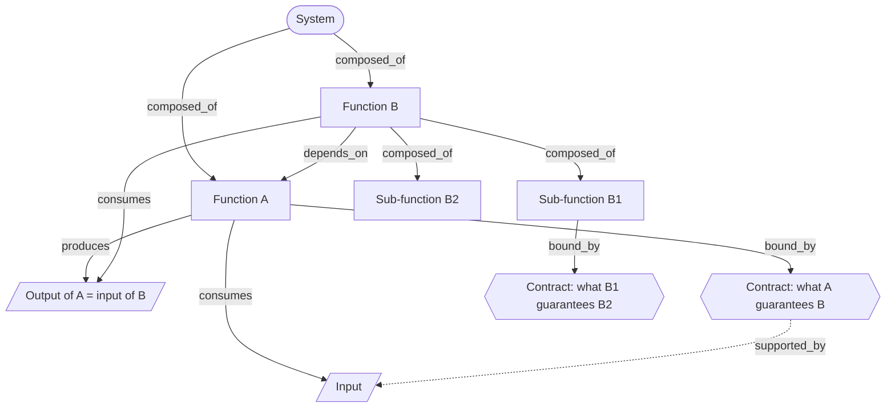

# Functional Decomposition

> Takes a whole apart into black boxes with one responsibility each, strict inputs and outputs, and an interface contract; the contract is the part nobody says out loud. Category: Engineering & Cognitive Problem Solving. Reference: [Functional decomposition](https://en.wikipedia.org/wiki/Functional_decomposition). [Open the 3D graph](./index.html) (needs internet for Three.js; on GitHub open via Pages or clone).

## What it decomposes

Functional decomposition takes apart any whole whose behaviour is produced jointly by parts, and insists that the parts be named by what they do. A batch job, a plant, a supply chain, an order-to-cash flow: in each case the output is a tree of boxes plus, for every box, what crosses its boundary inwards, what crosses outwards, and what it guarantees to whoever consumes its output. Three lineages converge on that answer: systems engineering's functional flow block diagrams, which define a function before allocating it to any component; DeMarco's and Yourdon's stepwise refinement, which splits a process into sub-processes with named data flows; and Parnas's correction of 1972, the one that makes the method worth using — decompose by what each box hides from the others, not by the steps of the flowchart, because the point of a boundary is that what sits behind it can change without anyone noticing.

Four of the five slots are the visible ones. `system` is the whole, `function` is a box with a single responsibility, and `input` and `output` are what crosses a boundary in each direction, an output of one box normally being the input of the next. A source that describes a system at all usually gives you these, because they are nouns you can point at. The fifth slot, `contract`, is different in kind: not a thing but a promise — quantity, rate, accuracy, timing, ordering — and a counterfactual, because it says what will still hold under any schedule, load or ordering the system permits. Nobody narrates counterfactuals. In an interview, or in a specification written before the failure, the guarantees are simply absent, and the system works because of an accident of execution order that everyone has mistaken for a rule. Both examples below end there: a payroll reordered to save twenty minutes that paid three hundred people the right gross and the wrong tax, and a data-centre developer that opened two switchgear factories because it could not buy a delivery date.

One more thing is inferred, and it is easy to miss because it looks stated: the hierarchy. Naming the boxes is not the same as stating the tree that contains them. In the classic example every `composed_of` edge is derived (`ce_c1` to `ce_c5`), even though the scenario says outright that the run is four steps and then names four activities — because no sentence says that validation is one of those four. In the TBPN example only three of ten `composed_of` edges are facts (`e_c1`, `e_c2`, `e_c3`); the other seven, including every parent-child link inside the transformer stack and the water loop, are the decomposition's own work. A speaker listing switchgear, transformers and chillers in one breath has given you a list, not a tree, and the difference matters because the tree is what says which box owns a problem. So: the boxes come free, the flows mostly come free, the tree is inference, and the contracts are almost pure inference.

## The slots



| Slot | What goes here | Typical provenance | Why that provenance |
|---|---|---|---|
| `system` | The whole being decomposed: the thing whose behaviour the functions jointly produce. | fact | A source that is describing a system says what it is describing. Both examples quote it (`cs`, `sys`). If you cannot quote the whole, you are decomposing something you chose rather than something the source discussed. |
| `function` | A black box with a single responsibility, named by what it does rather than by who staffs it or which vendor sells it. | either | Usually stated: nine of the ten function nodes in the TBPN example and four of the five in the classic are facts. Derived in exactly one case per example, and it is the same case both times — the parts are named and the box containing them is not (`cf5`, `f_electrical`). |
| `input` | What a function consumes: material, energy, data or money crossing the boundary inwards. | either | Every input node in both examples is a fact. Speakers say what goes in, because inputs are what they had to go and get. Inference is needed for the *assignment* of an input to a particular box (`ce_n5`, `e_n3`), not for the input itself. |
| `output` | What a function produces: what crosses the boundary outwards and becomes some other box's input. | either | Same as inputs: all six output nodes across the two examples are facts. Outputs are what the speaker is selling or delivering, so they get said. |
| `contract` | The guarantees a function makes to its consumers: quantity, rate, accuracy, timing, ordering. | derived | Almost always derived, and this is the framework's centre of gravity. Each example has exactly one fact contract (`cc4`, `c_water`) and in both cases it was said for a reason that has nothing to do with the downstream consumer — see the two "What the LLM added" sections. The other seven contract nodes are inferences. |

## Example 1: The fortnightly payroll run, and the promise nobody wrote down

A batch payroll decomposed into four steps with named inputs and outputs. The decomposition is clean and the run still broke, because the guarantee each step made to the next one existed only as an accident of execution order.

### Source text

> Northwind Foods runs its fortnightly payroll as a single batch job. The batch takes three inputs: the timekeeping export from the depots, the employee master file from HR, and the current tax tables. It produces four things: a payslip for every employee, a payment instruction file for the bank, a journal posting for the general ledger, and a statutory return for the revenue office. Inside, the run is four steps. Validation reads the timekeeping export and rejects any shift that has no matching employee or that overlaps another shift. Gross pay calculation turns validated shifts into gross amounts, applying the overtime and shift-premium rules. Deduction calculation takes gross pay and the tax tables and produces tax, pension and garnishment amounts. Disbursement takes net pay and produces the bank file and the payslips, and posts the journal. Each step reads only what the step before it wrote. Last quarter the run was changed so that deductions could be calculated before gross pay had finished, to save twenty minutes of wall clock time. Nothing in the specification said this was forbidden. The next run paid three hundred people the right gross and the wrong tax, and the general ledger did not balance against the bank file. The team's post mortem noted that nobody had ever written down what each step promised the next one.

A stepwise-refinement example in the tradition of DeMarco and Yourdon's structured analysis; the scenario text is written for this example so that the fact nodes have something verbatim to quote.

### Decomposition

Twelve of the sixteen nodes and fourteen of the thirty edges are facts, none of them paraphrases. `source_ref` is the sentence number in the text above.

System

- `cs` **Fortnightly payroll run** [fact] Northwind Foods runs its fortnightly payroll as a single batch job. This is the whole being decomposed. "Northwind Foods runs its fortnightly payroll as a single batch job" (sentence 1)

Function

- `cf1` **Validate shifts** [fact] Validation reads the timekeeping export and rejects any shift that has no matching employee or that overlaps another shift. "Validation reads the timekeeping export and rejects any shift that has no matching employee or that overlaps another shift" (sentence 5)
- `cf2` **Calculate gross pay** [fact] Gross pay calculation turns validated shifts into gross amounts, applying the overtime and shift-premium rules. "Gross pay calculation turns validated shifts into gross amounts, applying the overtime and shift-premium rules" (sentence 6)
- `cf3` **Calculate deductions** [fact] Deduction calculation takes gross pay and the tax tables and produces tax, pension and garnishment amounts. "Deduction calculation takes gross pay and the tax tables and produces tax, pension and garnishment amounts" (sentence 7)
- `cf4` **Disburse and post** [fact] Disbursement takes net pay and produces the bank file and the payslips, and posts the journal. "Disbursement takes net pay and produces the bank file and the payslips, and posts the journal" (sentence 8)
- `cf5` **Sequence the steps** [derived 0.70] A fifth function owns the order in which the four steps run and how much of one may overlap the next. The scenario never names it, but somebody changed it last quarter. Rationale: Sentence 10 says the run was changed so that deductions could be calculated before gross pay had finished. A change like that has to be made somewhere, and the scenario names four steps and no scheduler, so the function that owns step order is present in the system and absent from its description.

Input

- `ci1` **Timekeeping export** [fact] The timekeeping export from the depots: the shifts people actually worked. "the timekeeping export from the depots" (sentence 2)
- `ci2` **Employee master file** [fact] The employee master file from HR: who exists, at what rate, on what terms. "the employee master file from HR" (sentence 2)
- `ci3` **Current tax tables** [fact] The current tax tables, which set the rates deduction calculation applies. "and the current tax tables" (sentence 2)

Output

- `co1` **Payslip per employee** [fact] A payslip for every employee: the statement the employee receives. "a payslip for every employee" (sentence 3)
- `co2` **Bank payment file** [fact] A payment instruction file for the bank: the money actually leaving. "a payment instruction file for the bank" (sentence 3)
- `co3` **Ledger journal posting** [fact] A journal posting for the general ledger: the same money as the accounts see it. "a journal posting for the general ledger" (sentence 3)

Interface contract

- `cc4` **Read only the prior step's output** [fact] The one guarantee the scenario states: each step reads only what the step before it wrote. It is a rule about access, not about completeness, which is exactly why it was not enough. "Each step reads only what the step before it wrote" (sentence 9)
- `cc2` **One employee, no overlap** [derived 0.85] What validation promises gross pay calculation: every shift it passes on matches exactly one employee and overlaps no other shift, so the next step never has to check. Rationale: Sentence 5 states what validation rejects. Reading the rejection rule as a promise to the consumer is the inference, and it is the promise that lets gross pay calculation apply rates without re-checking identity or overlap. Supported by `ci2` (`ce_s3`, 0.80).
- `cc1` **Gross is final before deductions read** [derived 0.90] What gross pay calculation owes deduction calculation: by the time deductions reads a gross amount, that amount is complete and will not change. This is the guarantee the reordering broke. Rationale: Sentence 9 gives only an access rule, and sentence 12 says the reordered run produced the right gross and the wrong tax. A wrong tax on a right gross can only mean deductions read a gross that was still moving, so completeness at read time was a promise in force and never written; sentence 13 says so outright. Supported by `cc4` (`ce_s1`, 0.85) and `cf3` (`ce_s2`, 0.90).
- `cc3` **Bank file and journal agree** [derived 0.85] What disbursement owes everyone downstream: the payment instruction file and the journal posting describe the same money to the penny. Rationale: Sentence 12 reports that the general ledger did not balance against the bank file and treats that as a failure. It is only a failure if agreement between the two was guaranteed, and the scenario states no such guarantee anywhere. Supported by `co2` (`ce_s4`, 0.85).

Fourteen fact edges, each joining two fact nodes and quoting the scenario's own connective.

- `ce_n1` `cs` -> `ci1` (consumes) [fact] "The batch takes three inputs: the timekeeping export from the depots" (sentence 2)
- `ce_n2` `cs` -> `ci2` (consumes) [fact] "The batch takes three inputs: the timekeeping export from the depots, the employee master file from HR" (sentence 2)
- `ce_n3` `cs` -> `ci3` (consumes) [fact] "the employee master file from HR, and the current tax tables" (sentence 2)
- `ce_n4` `cf1` -> `ci1` (consumes) [fact] "Validation reads the timekeeping export" (sentence 5)
- `ce_n6` `cf3` -> `ci3` (consumes) [fact] "Deduction calculation takes gross pay and the tax tables" (sentence 7)
- `ce_p1` `cs` -> `co1` (produces) [fact] "It produces four things: a payslip for every employee" (sentence 3)
- `ce_p2` `cs` -> `co2` (produces) [fact] "a payslip for every employee, a payment instruction file for the bank" (sentence 3)
- `ce_p3` `cs` -> `co3` (produces) [fact] "a payment instruction file for the bank, a journal posting for the general ledger" (sentence 3)
- `ce_p4` `cf4` -> `co1` (produces) [fact] "Disbursement takes net pay and produces the bank file and the payslips" (sentence 8)
- `ce_p5` `cf4` -> `co2` (produces) [fact] "produces the bank file and the payslips" (sentence 8)
- `ce_p6` `cf4` -> `co3` (produces) [fact] "the bank file and the payslips, and posts the journal" (sentence 8)
- `ce_d1` `cf2` -> `cf1` (depends on) [fact] "Gross pay calculation turns validated shifts into gross amounts" (sentence 6)
- `ce_d2` `cf3` -> `cf2` (depends on) [fact] "Deduction calculation takes gross pay" (sentence 7)
- `ce_b1` `cs` -> `cc4` (bound by) [fact] "Each step reads only what the step before it wrote" (sentence 9)

Sixteen are derived. Five are the tree itself, every `composed_of` edge in the example:

- `ce_c1` `cs` -> `cf1` [derived 0.90] "Sentence 4 says the run is four steps and sentences 5 to 8 name four activities, but no sentence says that validation is one of the run's four steps. Matching the count to the names is the decomposition's own move."
- `ce_c2` `cs` -> `cf2` [derived 0.90] "Same inference as for validation: sentence 4 gives the count, sentence 6 gives the activity, and joining them into a parent-child relation is the reading, not the text."
- `ce_c3` `cs` -> `cf3` [derived 0.90] "Sentence 4 gives the count and sentence 7 gives the activity; that deduction calculation is a step of this run rather than a separate job is inferred from their adjacency."
- `ce_c4` `cs` -> `cf4` [derived 0.90] "Sentence 4 gives the count and sentence 8 gives the activity. Disbursement is also the step that writes the system's stated outputs, which is the strongest evidence that it sits inside the system rather than after it."
- `ce_c5` `cs` -> `cf5` [derived 0.70] "Sentence 10 shows that step order is configurable and was configured, so the run contains a box that owns order. The scenario counts four steps and does not count this one."

The other eleven:

- `ce_n5` `cf1` -> `ci2` (consumes) [derived 0.85] an unstated flow: matching a shift to an employee needs the master file of sentence 2.
- `ce_d3` `cf4` -> `cf3` (depends on) [derived 0.85] net pay is gross less deductions, arithmetic the scenario never states.
- `ce_d4` `cf5` -> `cf2` (depends on) [derived 0.60] "the dependency is the one that should have existed."
- `ce_b2` `cf1` -> `cc2` (bound by) [derived 0.85], `ce_b3` `cf2` -> `cc1` [derived 0.90], `ce_b4` `cf5` -> `cc1` [derived 0.80], `ce_b5` `cf4` -> `cc3` [derived 0.85] — the contracts hung on their owners.
- `ce_s1` to `ce_s4` (supported by) [derived 0.80 to 0.90] grounding links from the three derived contracts to their facts.

`ce_b4` is the one to look at. `cc1` is owned by `cf2`, the only box that knows when a gross amount has stopped changing, but it binds `cf5` as well, because the unnamed sequencer is "the box that can actually violate the guarantee, and it is the box that did."

### What the LLM added and why it helps

Hide the derived layer and the payroll is still legible: one system, four steps, three inputs, three outputs, the two dependencies the prose states in passing ("turns validated shifts into", "takes gross pay"), and one guarantee. What disappears is the tree and the promises. Losing the tree is recoverable — a reader can see that four activities and a four-step count belong together. Losing the promises is the failure the scenario is about.

The fact contract is the most instructive node on the page, because it looks like the thing that was missing and is not. `cc4` — "Each step reads only what the step before it wrote" — is a rule about *access*: which data a step may touch. The rule the reordering broke is a rule about *completeness*: by the time deductions reads a gross amount, that amount is final. That is `cc1`, derived at 0.90. The two are easy to confuse because under the original execution order they had the same effect: when steps run strictly one after another, reading only the previous step's output happens to mean reading a finished output. Decouple the order to save twenty minutes and the access rule still holds while the completeness rule silently does not. So `cc4` is not a counter-example to the claim that contracts are derived; it is the sharper version of it. What gets written down is the rule that is easy to write down and easy to check, and what stays unwritten is the rule the system actually depends on.

The other inference worth the space is `cf5`, "Sequence the steps", derived at 0.70: a fifth function that owns execution order, which the scenario never names even though somebody changed it. Put it in the graph, then look at `ce_b4`: the unnamed box turns out to be bound by the unwritten contract. That pairing is why an unnamed box is dangerous rather than merely untidy — you cannot hold a box to a guarantee when nobody has agreed the box exists. There was no owner to review the change against `cc1` and no specification saying it was forbidden, which the scenario states outright, so a twenty-minute optimisation was approved by a process with no representation of the thing it was about to break. The decomposition yields two questions the source text does not contain: who owns step order here, and what does each step promise the next one.

## Example 2: from the TBPN transcripts: Crusoe's AI factory: the boxes are stated, the guarantees are not

Episode "Elon Musk Is Leaving Washington, Meta Partners With Anduril, Kim Jong Un's Side Launch Goes Sideways", 2025-05-29, [transcript](../../../tbpn-transcripts/transcripts/2025-05-29_elon-musk-is-leaving-washington-meta-partners-with-anduril-kim-jong-uns-side-launch-goes-sideways-peter-rahal-john-andrew-entwistle-ashlee-vance-chase.md); line numbers refer to it. Crusoe Energy's Chase Lockmiller is asked what it actually takes to build a gigawatt AI campus and answers by walking the stack: the energy he sources, the transformer stack, the switchgear, the data halls, the closed-loop water circuit, and the software layer above it. He names the boxes and, unusually for conversational speech, states what goes into several of them and what comes out, which gives the `input` and `output` slots real facts to hold. He also supplies the framework's hardest slot by negation: he says switchgear is a long-lead bottleneck and that Crusoe started manufacturing it in-house, which is what a missing interface contract looks like from the buyer's side.

### Facts (quoted)

Eighteen of the twenty-three nodes and thirteen of the thirty-five edges are facts, none of them paraphrases. `source_ref` is the speaker plus the line range in the file.

System

- `sys` **Abilene AI factory** [fact] The whole being decomposed: an AI factory, a plant that manufactures intelligent outcomes from inputs sent by users. Crusoe's Abilene, Texas facility will consume 1.2 gigawatts of total power capacity. "It's like what we're building are these AI factories, right? So they're factories that manufacture intelligence. Factories that manufacture intelligent outcomes that are prompted by inputs from users." (Chase Lockmiller, L3114-L3120) Entities: Crusoe Energy.

Function

- `f_energy` **Source low-cost power** [fact] The first box in Crusoe's energy-first approach: find where low-cost, clean, abundant energy can be accessed and put the computing infrastructure there, rather than building where data centres already are. "where can we access low cost, you know, clean as much as we can, and abundant energy to power computing infrastructure?" (Chase Lockmiller, L2738-L2740) Entities: Crusoe Energy.
- `f_compute` **Run the racks in the data halls** [fact] The data halls hold racks of Nvidia chips with cold water flowing over them. This is the box that turns power into computation; everything else in the factory exists to keep it fed and cool. "cold water that flows into the rack and it flows over the chips through this copper pipe" (Chase Lockmiller, L3402-L3404) Entities: Nvidia.
- `f_cooling` **Remove heat in a closed loop** [fact] Crusoe's AI factories use a closed-loop architecture: the water that carries heat off the chips is the same water, circulating, rather than a fresh supply being consumed. "The way we've designed our AI factories is what's called a closed loop architecture." (Chase Lockmiller, L3400-L3400) Entities: Crusoe Energy.
- `f_software` **Managed infrastructure as a service** [fact] The top box of the stack: managed infrastructure as a service at the software layer, which is what a customer actually buys. Crusoe built this from the ground up alongside the energy and the buildings. "as well as managed infrastructure as a service at the software layer" (Chase Lockmiller, L3020-L3022) Entities: Crusoe Energy.
- `f_hv` **High-voltage transformers** [fact] High-voltage transformers are a big bottleneck and long lead time assets. A lot of that capacity gets built in China, but the supply chain is diverse enough that Lockmiller is not worried about the trade war. "high voltage transformers, but they are kind of long lead time assets." (Chase Lockmiller, L3282-L3282)
- `f_mv` **Medium-voltage transformers** [fact] There is a whole stack on the transformer side, and medium-voltage transformers are the next layer of it below the high-voltage ones. "There's a whole stack in the transformer side too. So like you have the medium voltage transformers." (Chase Lockmiller, L3284-L3286)
- `f_switchgear` **Switchgear: the breakers** [fact] Electrical switchgear is the electrical room holding all of the breakers that feed into the data halls. It is a major long lead time item and a bottleneck, and Crusoe started manufacturing it in-house in Tulsa and outside Denver. "It's electrical switch gear. This is basically like your electrical room that has all of the breakers that feed into the actual data halls" (Chase Lockmiller, L3300-L3306) Entities: Crusoe Energy.
- `f_coldplate` **Cold plate: chip to water** [fact] Inside the rack, heat exchanges from the silicon through the copper and into the water. This is the box that gets the heat off the chip. "you have this heat exchange between the silicon that goes through the copper and then to the water" (Chase Lockmiller, L3404-L3406) Entities: Nvidia.
- `f_chiller` **Outdoor chiller: water to air** [fact] A heat exchanger outside, like a massive maze of copper pipe, with air blown over it. Chillers are another big thing, alongside switchgear, in the list of bottlenecks. "That hot water then goes out to a heat exchanger that's a chiller that's outside." (Chase Lockmiller, L3410-L3410)

Input

- `i_prompts` **Prompts from users** [fact] The system's demand-side input: the prompts users send, which is what the factory converts into intelligent outcomes. "Factories that manufacture intelligent outcomes that are prompted by inputs from users." (Chase Lockmiller, L3118-L3120)
- `i_energy` **Curtailed wind and solar** [fact] Abilene has an abundance of wind and solar built on production tax credits, and not enough demand for it: power gets curtailed and sometimes sold at a negative price. That surplus is the factory's energy input. "Abilene is a market where there's an abundance of energy, a lot of wind particularly, and solar had been built on the back of production tax credit incentives" (Chase Lockmiller, L2804-L2806)
- `i_credit` **Infrastructure credit** [fact] Credit is the input that decides whether a factory of this size exists at all. The Abilene expansion's funding totals about fifteen billion dollars and was done in partnership with Blue Owl Capital. "credit is the unlock to all of this infrastructure getting built" (Chase Lockmiller, L3180-L3182) Entities: Blue Owl Capital, Crusoe Energy.
- `i_coldwater` **Cold water into the rack** [fact] Cold water flows into the rack. In a closed loop this is not a fresh supply: it is the same water coming back from the chiller. "you have cold water that flows into the rack" (Chase Lockmiller, L3402-L3402)

Output

- `o_intelligence` **Intelligent outcomes** [fact] What the factory manufactures: intelligence, in the form of outcomes prompted by users. Lockmiller sees no near-term shortage of demand for more of it. "they're factories that manufacture intelligence" (Chase Lockmiller, L3116-L3116)
- `o_hotwater` **Hot water out of the rack** [fact] Hot water is exhausted from the rack, carrying the heat the chips produced. It is the cold plate's output and the chiller's input. "and then hot water sort of exhausted from the rack" (Chase Lockmiller, L3406-L3408)
- `o_heat` **Heat exhausted to the air** [fact] Air is blown over the chiller and the heat gets exhausted out of the water. Heat, not water, is what actually leaves the system. "the heat basically gets exhausted out of the water" (Chase Lockmiller, L3418-L3418)

Interface contract

- `c_water` **Fill the loop once, not per hour** [fact] The one guarantee stated out loud, and it is made to the local community rather than to a downstream box: a building holds a million gallons, and it is filled one time, not consumed per hour. "So while we have one million gallons of water per building, we only fill it one time." (Chase Lockmiller, L3424-L3426) Entities: Crusoe Energy.

Thirteen fact edges. Each joins two fact nodes and quotes the turn in which Lockmiller states the connection.

- `e_c1` `sys` -> `f_energy` (composed of) [fact] "And we had done that from the ground up, all the way from energy data centers" (Chase Lockmiller, L3016-L3018)
- `e_c2` `sys` -> `f_software` (composed of) [fact] "all the way from energy data centers, as well as managed infrastructure as a service at the software layer" (Chase Lockmiller, L3018-L3022)
- `e_c3` `sys` -> `f_cooling` (composed of) [fact] "The way we've designed our AI factories is what's called a closed loop architecture." (Chase Lockmiller, L3400-L3400)
- `e_n1` `sys` -> `i_prompts` (consumes) [fact] "Factories that manufacture intelligent outcomes that are prompted by inputs from users." (Chase Lockmiller, L3118-L3120)
- `e_n2` `sys` -> `i_credit` (consumes) [fact] "credit is the unlock to all of this infrastructure getting built" (Chase Lockmiller, L3180-L3182)
- `e_n4` `f_coldplate` -> `i_coldwater` (consumes) [fact] "you have cold water that flows into the rack and it flows over the chips through this copper pipe" (Chase Lockmiller, L3402-L3404)
- `e_n5` `f_chiller` -> `o_hotwater` (consumes) [fact] "That hot water then goes out to a heat exchanger that's a chiller that's outside." (Chase Lockmiller, L3410-L3410)
- `e_p1` `sys` -> `o_intelligence` (produces) [fact] "they're factories that manufacture intelligence" (Chase Lockmiller, L3116-L3116)
- `e_p2` `f_coldplate` -> `o_hotwater` (produces) [fact] "you have this heat exchange between the silicon that goes through the copper and then to the water and then hot water sort of exhausted from the rack" (Chase Lockmiller, L3404-L3408)
- `e_p3` `f_chiller` -> `o_heat` (produces) [fact] "And then you blow air over it. You try to blow cold air over it. And then the heat basically gets exhausted out of the water." (Chase Lockmiller, L3414-L3418)
- `e_p4` `f_chiller` -> `i_coldwater` (produces, label "closes the loop") [fact] "And then you basically have cold water from that that then feeds right back into the system." (Chase Lockmiller, L3420-L3422)
- `e_d1` `f_compute` -> `f_switchgear` (depends on) [fact] "all of the breakers that feed into the actual data halls" (Chase Lockmiller, L3304-L3306)
- `e_b1` `f_cooling` -> `c_water` (bound by) [fact] "But in our case, we've designed it with a closed loop architecture that is like, you fill it one time, then you're done." (Chase Lockmiller, L3454-L3458)

### Decomposition

Five derived nodes: one function and four of the five contracts. Fact nodes above are referenced by id.

Function

- `f_electrical` **Step voltage down to the data hall** [derived 0.80] The box nobody names: whatever takes power at transmission voltage and delivers breaker-protected feeds at the data hall. Its three parts are all named; the function they jointly perform is not. Rationale: Lockmiller names high-voltage transformers, medium-voltage transformers and switchgear in sequence and calls them a whole stack, but never names the job they jointly do. The contents of the box are quoted; the box itself is the decomposition's inference, and it is the level at which the lead-time problem is actually owned. Grounded not by a `supported_by` edge but by direct links to its three fact children, `f_hv` (`e_c6`), `f_mv` (`e_c7`) and `f_switchgear` (`e_c8`). Entities: Crusoe Energy.

Interface contract

- `c_thermal` **Carry away a full rack of heat** [derived 0.80] What the cooling box owes the racks: remove the entire thermal load of a GB200-density rack, continuously, because at these densities there is no longer enough heat capacity to move that heat off the chip any other way. Rationale: Lockmiller states the physical fact that the new Nvidia architectures produce more heat than a traditional aluminium heat sink can move, and separately describes the closed loop, but never states what the loop guarantees. The guarantee is close to forced: a cooling box whose promise is weaker than the rack's heat output shuts the rack down. Supported by `f_compute` (`e_s2`, 0.80). Entities: Nvidia.
- `c_power` **Firm power whatever the wind does** [derived 0.65] What the energy box owes the data hall: continuous power at a contracted price, although its input is wind and solar that frequently gets curtailed. Somebody has to stand between an intermittent source and a load that cannot blink, and the transcript never says who. Rationale: The speaker states both that Abilene's surplus is wind and solar that frequently gets curtailed and that the facility will consume 1.2 gigawatts of total power capacity. A load of that size cannot follow the weather, so a firming guarantee has to exist between the two; he names neither the guarantee nor its owner. Supported by `i_energy` (`e_s3`, 0.80). Idea: "Firming as a product: a counterparty that sells a gigawatt-scale AI load a firm power guarantee on top of a curtailed renewable grid, taking the intermittency risk the developer currently absorbs by owning generation itself." Entities: Crusoe Energy.
- `c_switchgear` **A delivery date you can finance** [derived 0.70] What the switchgear and medium-voltage transformer boxes owe their consumer and nobody sells: a delivery date firm enough to underwrite a construction schedule against. Crusoe's answer was to stop buying switchgear and open its own factories in Tulsa and outside Denver. Rationale: Lockmiller says switchgear is a major long lead time item and definitely a bottleneck, and that Crusoe started manufacturing it in-house with two factories. A buyer that would rather not be a manufacturer integrating backwards is evidence that what is missing is a guarantee rather than a part, and he never states the guarantee because nobody offers one. Supported by `f_hv` (`e_s1`, 0.70). Idea: "A supplier of long-lead electrical gear that sells an underwritten delivery date rather than a part: lead-time insurance, or take-or-pay slots, on switchgear and medium-voltage transformers, for every data-centre developer too small to open a factory the way Crusoe did." Entities: Crusoe Energy.
- `c_uptime` **One tenant, one cluster, one term** [derived 0.70] What the compute box owes above it: a working cluster delivered to a single customer for the term the debt was raised against. Fifteen billion dollars of financing sits on one tenant's demand for one facility. Rationale: Lockmiller says the 1.2 gigawatt Abilene facility is for one customer and that its funding, about fifteen billion dollars, was completed with Blue Owl Capital. An asset financed against a single tenant must be guaranteeing availability to that tenant, but the term sheet is the one document the interview never reads out. Supported by `i_credit` (`e_s4`, 0.80). Entities: Blue Owl Capital, Crusoe Energy.

Twenty-two derived edges. Seven of the ten `composed_of` edges are among them, which is the tree being built rather than read:

- `e_c4` `sys` -> `f_compute` [derived 0.85] "Lockmiller never enumerates the factory's subsystems. That the data halls of racks are one box inside the AI factory is forced by the facts that the breakers feed into them and the water flows over their chips, but it is not stated."
- `e_c5` `sys` -> `f_electrical` [derived 0.80] "The parent box is itself an inference, so its membership in the system is too. What is stated is that transformers and switchgear are part of what it means to build this stuff out."
- `e_c6` `f_electrical` -> `f_hv` [derived 0.85] "Lockmiller introduces high-voltage transformers when asked what it takes to build the factory, then says there is a whole stack on the transformer side. Placing the high-voltage layer inside that stack is the reading."
- `e_c7` `f_electrical` -> `f_mv` [derived 0.90] "He says outright that there is a whole stack in the transformer side and that it contains the medium-voltage transformers; only the name of the containing function is supplied by the decomposition."
- `e_c8` `f_electrical` -> `f_switchgear` [derived 0.85] "Switchgear is named in the same breath as the transformer stack and described as the electrical room feeding the data halls, which places it at the bottom of the same voltage-stepping chain."
- `e_c9` `f_cooling` -> `f_coldplate` [derived 0.85] "The closed loop is stated as an architecture and the chip-to-water exchange is stated as a step of it; treating that step as a sub-function with its own boundary is the decomposition's move."
- `e_c10` `f_cooling` -> `f_chiller` [derived 0.90] "The chiller is described as receiving the loop's hot water and returning cold water, which makes it part of the loop rather than a consumer of it, but no sentence says so."

The other fifteen:

- `e_n3` `f_energy` -> `i_energy` (consumes) [derived 0.80] assigns Abilene's curtailed surplus to the energy box, a join Lockmiller never makes.
- `e_d2` `f_switchgear` -> `f_mv` [derived 0.75], `e_d3` `f_mv` -> `f_hv` [derived 0.80], `e_d4` `f_hv` -> `f_energy` [derived 0.80], `e_d5` `f_compute` -> `f_cooling` [derived 0.85], `e_d6` `f_software` -> `f_compute` [derived 0.80] (depends on) — the unstated series order of the build.
- `e_b2` `f_cooling` -> `c_thermal` [derived 0.80], `e_b3` `f_energy` -> `c_power` [derived 0.65], `e_b4` `f_switchgear` -> `c_switchgear` [derived 0.70], `e_b5` `f_mv` -> `c_switchgear` [derived 0.65], `e_b6` `f_compute` -> `c_uptime` [derived 0.70] (bound by) — the contracts hung on their owners.
- `e_s1` to `e_s4` (supported by) [derived 0.70 to 0.80] grounding links from each derived contract to the fact that makes it necessary.

Two are worth a note. `e_d5` is the strongest dependency, because Lockmiller states that there is not enough heat capacity to move the new chips' heat with an aluminium heat sink, which makes liquid cooling a precondition rather than an optimisation — but he never says so as a dependency. `e_b5` is one contract binding two boxes: he "groups switchgear and medium-voltage transformers as one long-lead problem".

### What the LLM added

Turn the derived layer off and the Abilene factory survives almost intact: eighteen of twenty-three nodes and thirteen of thirty-five edges remain, including the entire water loop as a closed circuit of quoted flows — cold water in (`e_n4`), hot water out (`e_p2`), hot water into the chiller (`e_n5`), heat to the air (`e_p3`), cold water back into the system (`e_p4`). That is an unusually rich fact skeleton for diarised speech, and it is why this episode was chosen: a builder asked how the thing is built talks in boxes and flows, which are exactly the slots this framework needs.

What he does not talk in is guarantees. Four of the five contracts are derived (`c_thermal` 0.80, `c_power` 0.65, `c_switchgear` 0.70, `c_uptime` 0.70), and the fifth proves the rule rather than breaking it. "We only fill it one time" appears in the transcript because a previous guest had said Abilene does not have enough water for these data centres and the hosts put that to him: `c_water` is a defence against an accusation, addressed to a community and a press narrative, not a promise to a downstream box. Set it beside the classic example's single fact contract and the pattern is clear — `cc4` is an access rule somebody wrote because it was easy to check, and `c_water` is a rebuttal. Neither is a guarantee published for a consumer. **A contract gets said out loud only when somebody is defending against an accusation or writing down an access rule; never as a guarantee to the box downstream.** Go looking for quoted contracts and you will come back with a rebuttal and a rule, having missed every guarantee the system actually runs on.

The second addition has the same shape as the classic example's, which is what makes the pair worth reading together. `f_electrical` (0.80) is an unnamed box whose three parts are all named and quoted: Lockmiller walks high-voltage transformers, medium-voltage transformers and switchgear in order, calls it "a whole stack in the transformer side", and never says what the stack is for. Name it — step transmission voltage down, deliver breaker-protected feeds at the hall — and a level appears at which the lead-time problem is owned, which is where the idea in `c_switchgear` lives. In the payroll too the parts were named, the containing function was not, and the unnamed box was the one bound by the contract nobody had written (`ce_b4`). A box you have not named is a box you cannot hold to a guarantee.

The third addition is easy to under-rate: the dependency chain `e_d2` to `e_d6`, none of it stated. It encodes that power must be secured before the transformers have anything to step down, that cooling precedes compute rather than accompanying it, and that the software layer has nothing to manage without racks. That chain converts a list of difficulties into a critical path, and answers a question the transcript does not: if one of these boxes is late, which of the others cannot start.

### Where the opportunity shows up

The idea-bearing slot is the interface contract (`idea_bearing_slot: "contract"`), and the reason is a claim worth stating plainly: **a function whose interface contract nobody owns is often a company waiting to exist.** A missing guarantee is not an inefficiency. It is a risk sitting on the wrong balance sheet, and somebody is already paying for it in capital, in schedule, or in vertical integration they never wanted. Two of the five contract nodes carry an `idea` field.

- `c_switchgear` **A delivery date you can finance**, derived, confidence 0.70. Idea: "A supplier of long-lead electrical gear that sells an underwritten delivery date rather than a part: lead-time insurance, or take-or-pay slots, on switchgear and medium-voltage transformers, for every data-centre developer too small to open a factory the way Crusoe did." The evidence is unusually direct for a derived node: Lockmiller says switchgear can be a major long lead time item and calls it a bottleneck twice, says Crusoe started manufacturing it in-house with factories in Tulsa and outside Denver, and groups medium-voltage transformers into the same problem, which is why `e_b5` binds this contract to two boxes. What is absent is any mention of a delivery guarantee, because none is on offer — the market sells parts with lead times, not dates with penalties. The confidence sits at 0.70 because the inference has two steps, neither stated: that the binding problem is the *variance* in delivery rather than the *absence* of supply, and that a guarantee is a sellable product rather than something only a manufacturer can provide.
- `c_power` **Firm power whatever the wind does**, derived, confidence 0.65. Idea: "Firming as a product: a counterparty that sells a gigawatt-scale AI load a firm power guarantee on top of a curtailed renewable grid, taking the intermittency risk the developer currently absorbs by owning generation itself." The evidence is two facts the speaker states minutes apart and never joins: Abilene's surplus is wind and solar that frequently gets curtailed, to the point of negative prices (`i_energy`), and the facility will consume 1.2 gigawatts of total power capacity. A load that size cannot follow the weather, so something stands between the two, and the transcript names neither the mechanism nor its owner. The confidence is the lowest of the five contracts and belongs in the 0.50 to 0.65 band: the guarantee is necessary, but its shape is not determined by anything said — storage, a peaker, a grid service, a financial hedge, or a curtailment tolerance negotiated into the tenant's contract would all satisfy it. A node that says a guarantee must exist here without saying what form it takes is a real finding and a weak specification, and the confidence should show that.

The other three contracts carry no idea and should not. `c_water` is a fact, and facts do not carry ideas in this schema. `c_thermal` (0.80) is clearly owned — Crusoe designed the loop, so promise and owner sit in the same company — and an owned guarantee is an engineering requirement, not a gap. `c_uptime` (0.70) is the near-miss: fifteen billion dollars of financing rests on it, which makes it the most valuable contract on the page, but it is almost certainly written down in a term sheet the interview never reads out. Unwritten and unowned are different conditions, and only the second is an opportunity.

The general detection rule both examples demonstrate is worth more than either individual idea. **When a buyer integrates backwards into making something it would rather buy, that is the signature of a missing guarantee rather than a missing part.** Crusoe did not open switchgear factories because no switchgear exists; it did so because no switchgear comes with a date it can build a schedule against. The energy box reads the same way: an energy-first strategy is a buyer who could not purchase firm power where it needed it, so it went and stood next to the generation instead. In both cases the acquired capability is a second-best response to an absent contract, and the first-best response — somebody selling the guarantee — is the business that does not exist yet. The test is mechanical enough to run over a corpus: find a company doing something outside its stated business, ask what it would rather have bought, and the answer is a contract.

## Building a knowledge graph with this framework

### Node and edge types

Node types are the five slots: `system`, `function`, `input`, `output`, `contract`. One application is one connected tree. The spine is `system` at level 0 with `function` nodes below it, nested as deep as the source supports; `input` and `output` nodes hang off whichever box consumes or produces them; `contract` nodes hang off the function that owes them. Both examples use the `plane` layout rather than `tree`, with fixed positions arranged in horizontal bands so the tree reads top-down: the system at the top, functions in the middle with nested boxes stepping down a row per level, inputs at the left edge and outputs at the right of the box they feed, and contracts in a band at the bottom. The classic example labels three regions — "The box that owns the order" around the system, "Four steps, strictly in order" around the four activities, and "Interface contracts — in the gaps" around the four contracts. The TBPN example keeps only the contracts region and adds two captions, "Closed cooling loop" beside the chiller and cold plate and "The box nobody names" beside the unnamed electrical box, with a dashed guide running from that caption to `f_electrical`.

Edge types are the five relations plus the reserved grounding link, and the directions matter because the engine draws arrows. `composed_of` runs parent to child. `consumes` runs function to input and `produces` runs function to output, both away from the box, so a box's flows fan out from it. `depends_on` runs from the box that cannot proceed to the box it is waiting on (`e_d1`: compute depends on switchgear, not the reverse). `bound_by` runs from a function to the contract it owes. `supported_by` runs from a derived node to a fact and is always derived.

Two modelling notes the examples make concrete. `input` and `output` are roles relative to a boundary, not intrinsic types, so a closed loop shows up as an output node being consumed and an input node being produced: `e_n5` has the chiller consuming `o_hotwater`, and `e_p4` has it producing `i_coldwater`, labelled "closes the loop". Do not duplicate the substance into a second node to make the slot tidy — the loop is the point. And one contract can bind two functions (`e_b5`), or bind the system rather than a single box when the source states it as a system-wide rule (`ce_b1`, `cs` -> `cc4`). Facts carry `source_quote` and `source_ref`, derived nodes `confidence` and `rationale`, and `entities` uses the spellings in `tbpn-transcripts/extractions/`.

### Fact or derived: rules of thumb

Start with the numbers, because the asymmetry is the whole story. Across both examples 30 of the 39 nodes are facts — every system, every input, every output, thirteen of fifteen functions — and of the nine derived nodes, seven are contracts and two are unnamed functions. Of the edges, 38 of 65 are derived, clustered in the tree (`composed_of`) and the guarantees (`bound_by`). **Sources state parts and flows; they do not state hierarchies or promises.** Budget the inference accordingly, and distrust an extraction that inverts this: derived inputs with quoted contracts means the model filled slots from general knowledge.

- `system`: extracted, essentially always; a source describing a system says what the system is. Inferred only when a speaker walks through parts without naming the whole, at 0.80 or above, since a container's name is rarely contentious. Empty: do not build the graph — a decomposition of a whole you chose is a decomposition of your own mental model.
- `function`: extracted by default, and a function node without a quotable span is usually the model reciting how such systems generally work. The exception is worth hunting: when the source names several parts and never the box containing them, add the container as derived at 0.70 to 0.85 and name in the rationale the children that forced it (`cf5`, `f_electrical`). Worth making, because the containing box is where responsibility lives — `ce_b4` is the classic example's punchline — and an unnamed box cannot be held to a guarantee. Empty: you have flows and no system; stop.
- `input`: extracted where the source says what goes in, which is often, because inputs are what the speaker had to go and get — power, credit, a file from HR. The inference is usually not the input but its *assignment*: which box consumes it (`ce_n5`, `e_n3`, derived at 0.80 to 0.85 with the input itself quoted). Empty for a box: leave it empty; unknown inputs are a finding about the source.
- `output`: as for input, with the same trap. An output names something that leaves the boundary, not the activity of the box: "validated shifts" is an output, "validation" is the function. A derived output is legitimate when a downstream box's input implies it, at 0.80 or above, but prefer one node for the substance plus a derived `produces` edge.
- `contract`: derived as a rule, and the rule has a mechanism behind it rather than being a habit — a guarantee is a counterfactual about permitted variation, and speech is about what happened. Write one contract per consumer relationship you can name, in the form "what X guarantees Y about quantity, rate, accuracy, timing or ordering", and make the rationale name both the consumer and the symptom — a bottleneck, a failure, an accusation, a financing — that the guarantee would explain. Confidence tracks how determined the guarantee's shape is: 0.85 to 0.90 when the symptom pins it down (`cc1`, where a right gross and a wrong tax can only mean one thing), 0.65 to 0.80 when the guarantee is necessary but its form is open (`c_power`). When the source does state a contract, read it twice before believing it covers what you think. Empty: never genuinely empty, only unstated — a decomposition with no contracts is a parts list.

### Extraction recipe

```text
Decompose ONE system from <file>, lines <a>-<b>, by function.

1. system: the whole the speaker is describing, as a verbatim span of 5+ words.
   No span, no graph - do not decompose a whole you chose yourself.
2. function: every box the source names, named by WHAT IT DOES (a verb phrase).
   Verbatim span required. Reject any box whose only available name is a team,
   a person, a vendor or a country: that is an org chart, not a decomposition.
   Then look for the MISSING container: if the source names several parts and
   never names the box that holds them, add it as derived (0.70-0.85) and cite
   the children that forced it. Depth 2 or 3 levels, no more.
3. input / output: what crosses each boundary. Verbatim where stated. Must be
   a thing (material, energy, data, money), never a restatement of the
   function's own name. An output of one box that feeds another is ONE node,
   consumed by the second box - that is how loops and chains are drawn.
4. contract: for each consumer relationship, the guarantee the producing box
   makes, about quantity, rate, accuracy, timing or ordering. Derived unless
   you can quote it. A derived contract is accepted only if it names (a) the
   consumer that is owed the guarantee and (b) a stated symptom - a bottleneck,
   a failure, an accusation, a financing, a backwards integration - that the
   guarantee would explain. No symptom, no contract node.
   If a contract IS stated, say what kind it is (access, consumption, price)
   and ask whether the guarantee the system depends on is a different one.
5. Edges: composed_of parent->child (expect these to be DERIVED: naming boxes
   is not stating the tree), consumes function->input, produces
   function->output, depends_on waiting-box->blocking-box, bound_by
   function->contract. An edge is fact ONLY if both endpoints are facts AND one
   turn states the link, quoted verbatim. supported_by from every derived node
   to its facts, always derived.
6. For any contract that is both missing and unowned, put the business reading
   in the node's `idea` field - one sentence naming what a counterparty could
   sell. Not in the rationale. Prefer contracts where a buyer has integrated
   backwards to supply itself.

Output one graph.json example: nodes [{id, slot, label <=40 chars, text,
provenance, source_quote+source_ref | confidence+rationale, idea?, entities}],
edges [{id, from, to, relation, provenance, confidence?, source_quote?,
source_ref?, label?, rationale?}], idea_bearing_slot "contract".
```

Afterwards run `node _meta/validate.mjs <dir>` for quote verification, the paraphrase cap and derived-to-fact connectivity, then six checks it cannot make. Every function name is a verb phrase that survives the rename test below. No two sibling functions could both claim the same responsibility. Every `input` and `output` node names a thing that crosses a boundary rather than the activity of the box beside it. Every derived contract names a consumer and a symptom. The tree is at most three levels deep and every `composed_of` edge's provenance was decided on its own evidence rather than copied from its siblings. And every `depends_on` edge would be false if reversed — if both directions read plausibly, you have drawn a composition or a data flow and labelled it a dependency.

### Failure modes

- **The org chart mistake.** The most common and the most damaging. An org chart, a vendor list or a list of national champions is offered as a functional decomposition, because both are trees of boxes and the source supplies the names free. The result can do none of the work: you cannot ask what a team guarantees, and a vendor's name says nothing about what crosses its boundary. Guard: **a function is defined by what it guarantees, not by who staffs it or which vendor sells it.** Apply the rename test — if the label can be replaced by a team or supplier name with no loss, it is not a function. The TBPN graph passes deliberately: `f_switchgear` is labelled by responsibility, the electrical room with the breakers feeding the data halls, even though Crusoe manufactures it, and `f_electrical` is named for the job rather than for its possible vendors. The scout rejected two otherwise promising passages for failing this test: a semiconductor stack enumerated only as Chinese company names, and a discussion of Intel Foundry's reporting lines. Both are trees; neither has a contract in it.
- **Inventing contracts.** `contract` is the derived slot, so a model told to fill it will produce plausible guarantees for every box — "the validator guarantees data quality" — with nothing behind them, and an invented guarantee is indistinguishable in form from a found one. Guard: a derived contract needs a consumer node and a stated symptom the guarantee would explain. `cc1` has `cf3` as consumer and a right gross with a wrong tax as symptom; `c_switchgear` has `f_compute` downstream, a named bottleneck, and a backwards integration. No consumer or no symptom, no node.
- **Decomposing by noun instead of by verb.** "Water", "power", "data" become boxes, and because nouns do not partition responsibilities the boxes overlap: two can each claim the same behaviour and neither can be changed safely. Guard: every function label is a verb phrase, and for each pair of siblings ask which owns a given change. If the answer is "either", merge them or redraw the boundary. `f_cooling` is "Remove heat in a closed loop", not "Water".
- **Inputs and outputs that restate the function.** The box is "Validate shifts", its input "shifts to validate", its output "validated shifts": three nodes, no information. Guard: an input or output must name something that exists independently of the box and could be handed to a different one. `ci1` is a timekeeping export from the depots and `o_hotwater` is hot water; both stay what they are under a different consumer.
- **A tree that keeps going.** Four and five levels are easy to generate, unreadable in the viewer, and usually the model's general knowledge rather than the source's content. Guard: two or three levels, as in both examples, plus the node budget in SPEC section 4. If the source genuinely supports more depth, make the lower subtree its own example.
- **`depends_on` used as `composed_of`.** A chain of peers gets drawn as a composition, or a sub-function gets a dependency on its parent, and the tree stops meaning anything: `composed_of` answers "what is this made of", `depends_on` answers "what must happen first". Guard: reverse the edge. A parent-child link is false reversed and so is a real dependency, but a chain drawn as composition reads fine both ways, which is the tell. The transformer stack carries both kinds between the same boxes on purpose — `e_c6` to `e_c8` compose it, `e_d2` to `e_d4` order it.
- **Provenance copied across siblings.** Having decided one `composed_of` edge is derived, the model marks the rest the same way without looking. The TBPN split is not arbitrary: `e_c1` to `e_c3` have a turn in which Lockmiller states the membership and the other seven do not. Guard: decide each edge on its own quote, and expect a mixture.

## Related frameworks

- [First Principles Thinking](../first-principles/README.md): both break a whole into parts that can be reasoned about separately, but first principles descends to physical or economic invariants and rebuilds upward, while this one stops at the boxes and asks what each promises. Prefer first principles when the question is whether the current design is necessary; prefer this when the design is given and you need to know where it will break.
- [Inversion & Pre-Mortem](../inversion-premortem/README.md): the complement on the same object. This framework finds the unwritten guarantees; a pre-mortem asks what happens when one of them fails. Enumerate the contracts first, then invert each to get a failure list grounded in the architecture rather than in imagination.
- [Theory of Constraints & Evaporating Cloud](../../02-strategic-and-business/theory-of-constraints/README.md): the other framework that reads a chain of boxes. It asks which box sets the rate; this one asks what the boxes promise each other. Both look at Crusoe's switchgear and see something real, and the difference is that a bottleneck suggests adding capacity while a missing contract suggests selling one.
- [MECE](../../02-strategic-and-business/mece/README.md): non-overlap is a property of a partition; single responsibility is the same property stated about one box. Use MECE to prove a set of categories covers the space without double-counting; use this when the boxes also have to exchange things and guarantee things to each other, which MECE says nothing about.

[Library root](../../README.md).
