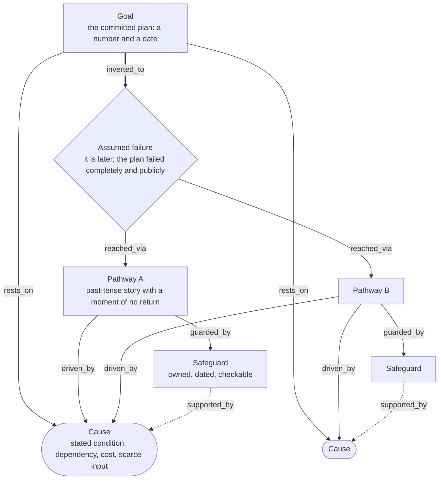

# Inversion & Pre-Mortem

> Asserts that the plan has already failed completely, then works backwards to every pathway that could have produced the failure and to the safeguard that would have blocked each one. Category: Engineering & Cognitive Problem Solving. Reference: [Pre-mortem](https://en.wikipedia.org/wiki/Pre-mortem). [Open the 3D graph](./index.html) (needs internet for Three.js; on GitHub open via Pages or clone).

## What this graph derived

Given that Blake Scholl of Boom Supersonic told TBPN that Superpower, a 42 megawatt gas turbine for data centres, will reach 200 megawatts in 18 months and two gigawatts a year from a second factory, on 300 million dollars and a last-ever equity round, with the cash funding the Overture airliner, applying Inversion & Pre-Mortem we derived that the plan is priced at the good case with no slack, that any turbine slip becomes an airliner slip because the equity door was publicly closed, and that one field failure could freeze the order book as the big factory opens; the opportunities that fall out are a 24-hour superalloy parts service, a delivery-and-uptime bond for unproven vendors, and pre-permitted turbine pads.

Given that the programme director of the Meridian billing replacement presents a 1 January go-live with the mainframe off by 31 March, records that the bank payments integration was never volume-tested, that half the old system's authors leave in November and that the vendor has no late-delivery penalty, then refuses to move the date and wins unanimous approval, applying Inversion & Pre-Mortem we derived that the unanimity is a driver of failure rather than reassurance, that the payments file breaking at live volume is the likeliest first failure, and that December's peak invoicing leaves no window to rehearse; the reader gains the three safeguards the room never took: a gated volume test, retained leavers, and written abort criteria.

## What it decomposes

The object is a plan that has been approved and not yet executed: dated, funded, usually announced. Two lineages meet in it — Jacobi's *invert, always invert*, which Munger turned into asking where you are going to die so you can avoid going there, and Gary Klein's pre-mortem procedure (*Harvard Business Review*, September 2007), which fixes the move into five steps: know the plan, assert the fiasco out loud, have everyone independently write down every reason for it, consolidate, then engineer safeguards. The mechanism is prospective hindsight — Mitchell, Russo and Pennington found in 1989 that imagining an outcome as already realised raises the ability to name correct reasons for it by roughly 30%.

What it forces into the open is a change of grammar. A risk register says a thing *might* happen and is free to stay a category — "execution risk", "market risk" — with a probability, an owner and nothing anyone can act on. The pre-mortem says the thing *did* happen, and a past-tense sentence has to name who did what in what order. Each story has to reach a moment where the plan could no longer be saved, the only part of a failure that is decidable in advance and the point a safeguard must sit before. It also changes who may speak: once failure is asserted as fact, naming a reason for it is a contribution rather than disloyalty, which is why it is run in the room that has just approved the plan.

Without it, optimism is priced into the schedule — an approved plan is sized to the case where the hard parts go well, so every named-but-unowned condition becomes a delay rather than an absorbed variance — and unanimity is read as evidence, when a room that records three unmitigated conditions and approves the plan without dissent has produced no information about whether it is sound. For this library the framework has one further property: it is the most derived-heavy here. The source hands over a plan and a few visible risks; the inversion, the pathways and the safeguards are all model reasoning.

## The slots



| Slot | What goes here | Typical provenance | Why that provenance |
|---|---|---|---|
| Goal | The plan or outcome being protected: what a named actor has committed to do, ideally with a number and a date. | either | The one slot a source reliably hands you. Plans are announced; that is what an announcement is for. |
| Assumed failure | The inverted statement: it is later and the plan has failed completely and publicly. Asserted, not predicted. | derived | A speaker with a plan almost never says it has failed. Fact only when the source is itself a pre-mortem — which is exactly the difference between the two examples below. |
| Failure pathway | One concrete story of how the failure happened, told in the past tense: actors, order, and a moment where the plan could no longer be saved. | derived | Always constructed. Even when every ingredient is quoted, the sequence and the timing are the model's, which is why no pathway in this graph sits above 0.65. |
| Cause | A driver of a pathway: a condition, dependency, cost, deadline or scarce input. | either | Often stated in the source as a constraint the speaker has already noticed and priced at zero. Those quotes are what keep the pathways honest. |
| Safeguard | The mandatory measure that blocks a pathway, written so that someone owns it and it can be checked. | derived | Never in the source, because the source has not yet imagined the failure. If a measure is already in the plan, it is a cause, not a safeguard. |

The graph keeps the registry's five slot ids and its four relations, and adds one, `rests_on`, from the plan to the conditions the source itself attaches to it. Without it the fact layer would be unreachable: a plan and its stated conditions would sit as unconnected islands. With it the skeleton is drawable, and every fact edge in either example is a `rests_on` except one.

## Example 1: The Meridian billing go-live: a pre-mortem on an approved plan

### Source text

> At the final steering meeting for the Meridian billing replacement, the programme director presents the plan. The new system goes live on 1 January, every customer on one platform, and the old mainframe is switched off on 31 March. The budget is 4.2 million pounds, of which 3.1 million has already been spent. The director notes three things for the record: the payments integration with the bank has never been run end to end at live volumes; two of the four engineers who wrote the old system leave in November; and the vendor's contract carries no penalty for late delivery. The finance sponsor observes that December is the busiest invoicing month of the year and asks whether January is the right date. The director answers that the date has been given to the board and to customers and will not move. Nobody in the room disagrees, and the plan is approved. Before the meeting closes the director sets one exercise: it is the following October, the programme has failed completely and publicly, and each of you has fifteen minutes to write down every reason why.

Written for this example around the pre-mortem procedure set out in Gary Klein, "Performing a Project Premortem", *Harvard Business Review*, September 2007.

### Decomposition

Eighteen nodes, nine facts and nine inferences; thirty-two edges, of which eight are facts.

Goal

- `k_golive` **Go live 1 January, all customers** [fact] The new billing system goes live on 1 January with every customer on one platform. "The new system goes live on 1 January, every customer on one platform" (sentence 2, the director's plan)
- `k_retire` **Old mainframe off on 31 March** [fact] The old mainframe is switched off on 31 March, three months after the go-live. "the old mainframe is switched off on 31 March" (sentence 2, the director's plan)

Assumed failure

- `k_fiasco` **October: it failed completely** [fact] It is the following October and the programme has failed completely and publicly; the team is asked to write down every reason why. "it is the following October, the programme has failed completely and publicly" (sentence 8, the director's closing exercise)
- `k_shape` **What complete failure means here** [derived 0.70] Complete and public failure for this programme means invoices going out wrong or not at all through the winter, the mainframe kept alive past 31 March, and the 4.2 million pound budget breached with the recovery still unfunded. Rationale: The exercise asserts failure but not its content. The three stated commitments (the January cutover, the March shutdown, the budget) are the only things that can visibly break, so the concrete shape of the fiasco is read off them; the word 'publicly' points at customer-visible invoicing rather than internal slippage. Supported by `k_retire`, `k_golive`.

Cause

- `k_untested` **Payments integration never volume-tested** [fact] The payments integration with the bank has never been run end to end at live volumes. "the payments integration with the bank has never been run end to end at live volumes" (sentence 4, noted for the record)
- `k_leavers` **Half the old-system authors leave** [fact] Two of the four engineers who wrote the old system leave in November, seven weeks before the cutover. "two of the four engineers who wrote the old system leave in November" (sentence 4, noted for the record)
- `k_nopenalty` **Vendor has no late-delivery penalty** [fact] The vendor's contract carries no penalty for late delivery, so the vendor's schedule risk is entirely the buyer's. "the vendor's contract carries no penalty for late delivery" (sentence 4, noted for the record)
- `k_december` **December is the peak invoicing month** [fact] December is the busiest invoicing month of the year, immediately before the go-live date. "December is the busiest invoicing month of the year" (sentence 5, the finance sponsor)
- `k_fixeddate` **The date will not move** [fact] The go-live date has been given to the board and to customers and will not move. "the date has been given to the board and to customers and will not move" (sentence 6, the director's answer)
- `k_nodissent` **Nobody disagreed; plan approved** [fact] Nobody in the room disagrees with the plan, and it is approved. "Nobody in the room disagrees, and the plan is approved" (sentence 7, the approval)
- `k_silence` **Unanimity is a driver, not a signal** [derived 0.55] The unanimous approval is not evidence that the plan is sound: three conditions were read out and none was assigned an owner, so silence is what leaves them unmanaged. Rationale: The text records the absence of disagreement, not its reason, and gives no owner or action for any of the three conditions. Reading unanimity as a cause rather than as reassurance is the pre-mortem's characteristic move and is contestable: the room may simply have judged the risks acceptable. Supported by `k_nodissent`.

Failure pathway

- `k_p1` **Payments break at live volume** [derived 0.65] In the first week of January the payments file to the bank fails at production volume, a defect nobody could reproduce in test; direct debits are missed and the failure is visible to customers before it is understood. Rationale: Assembles the one condition the director named as untested into a sequence with a moment of no return. The source states that the integration was never run at live volumes; it does not state that it fails, when, or that customers see it first, and three unstated steps is a story, not a reading. Grounded through `ke6` to `k_untested` and `ke7` to `k_december`.
- `k_p2` **The old system's authors are gone** [derived 0.65] When the January reconciliation disagrees with the mainframe, the two people who could explain the old system's behaviour left in November, so every discrepancy becomes a week of archaeology and the March shutdown slips. Rationale: Joins the stated November departures to the stated March shutdown, which the source never links. The inference is that reconciliation against a system nobody understands is the long pole; plausible, but the team may have documented the old system. Grounded through `ke8` to `k_leavers`.
- `k_p3` **No rehearsal window before the date** [derived 0.60] The only weeks in which a full dress rehearsal could have been run were December's, and December was consumed by peak invoicing on the old system, so the programme arrives at 1 January having never rehearsed the cutover. Rationale: Combines the peak-month fact with the fixed date to infer a missing rehearsal that the source never mentions. Nobody in the meeting says a rehearsal was planned or dropped; this is the pre-mortem supplying an omission rather than reading one. Grounded through `ke9` to `k_december` and `ke10` to `k_fixeddate`.
- `k_p4` **Red status overruled by the date** [derived 0.60] In mid-December the programme is amber-to-red, but the date has been given to the board and to customers, the vendor bears no cost for a slip, and no one in the approving room had registered a doubt, so the go-live is ordered anyway. Rationale: Three stated conditions (the immovable date, the penalty-free vendor contract, the unanimous approval) are read together as a decision rule that no single one of them states. Contestable: a board told of a red status might well have moved the date. Grounded through `ke11` to `k_fixeddate` and `ke12` to `k_nopenalty`.

Safeguard

- `k_s1` **Volume test with the bank, gated** [derived 0.75] Run the payments integration end to end against production-scale volumes with the bank before the code freeze, and make a passed volume test a written precondition for the go-live decision rather than a task on the plan. Rationale: Directly inverts the one condition the director named as untested. The safeguard is not in the source; the source records the gap and takes no action on it. Supported by `k_untested`.
- `k_s2` **Retain two authors through March** [derived 0.70] Retain the two departing engineers on a paid consultancy through 31 March, and require a written reconciliation runbook from them before November, so knowledge of the old system survives the cutover. Rationale: Blocks the departure pathway at the only point where it is cheap, before the November leaving date. Nothing in the source suggests retention was considered. Supported by `k_leavers`.
- `k_s3` **Written abort criteria and rollback** [derived 0.70] Agree in writing, now, the conditions under which the January date is abandoned, name the person who may call it, and rehearse the rollback to the mainframe; a date that cannot move needs an exit that can. Rationale: Answers the pathways that all pass through the same point: a fixed date, a vendor with nothing at stake and a room that did not object. Deciding the abort rule before the pressure arrives is the standard countermeasure and is nowhere in the source. Supported by `k_fixeddate`, `k_nopenalty`.

Eight edges are facts. Seven are `rests_on`, each quoting the sentence in which the plan and the condition are stated together: `kf1` `k_retire` -> `k_golive` ("The new system goes live on 1 January, every customer on one platform, and the old mainframe is switched off on 31 March.", sentence 2); `kf2` `k_golive` -> `k_december` ("The finance sponsor observes that December is the busiest invoicing month of the year and asks whether January is the right date.", sentence 5); `kf3` `k_golive` -> `k_fixeddate` ("The director answers that the date has been given to the board and to customers and will not move.", sentence 6); `kf4`, `kf5` and `kf6` from `k_golive` to `k_untested`, `k_leavers` and `k_nopenalty`, each quoting from "The director notes three things for the record:" through the condition in question (sentence 4); `kf7` `k_golive` -> `k_nodissent` ("Nobody in the room disagrees, and the plan is approved.", sentence 7). The eighth is the one that makes this example unusual: `kf8` `k_golive` -> `k_fiasco` (`inverted_to`) is a **fact** edge, because the director performs the inversion out loud — "Before the meeting closes the director sets one exercise: it is the following October, the programme has failed completely and publicly, and each of you has fifteen minutes to write down every reason why." (sentence 8).

Twenty-four edges are derived. The inversion of content: `ke1` `k_golive` -> `k_shape` (`inverted_to`, 0.70). The four routes: `ke2` -> `k_p1` (0.65), `ke3` -> `k_p2` (0.65), `ke4` -> `k_p3` (0.60), `ke5` -> `k_p4` (0.60), all `reached_via` from `k_fiasco`. Eight `driven_by` edges hang the pathways on the quoted conditions: `ke6` `k_p1` -> `k_untested` (0.80), `ke7` `k_p1` -> `k_december` (0.55), `ke8` `k_p2` -> `k_leavers` (0.80), `ke9` `k_p3` -> `k_december` (0.70), `ke10` `k_p3` -> `k_fixeddate` (0.60), `ke11` `k_p4` -> `k_fixeddate` (0.75), `ke12` `k_p4` -> `k_nopenalty` (0.60), `ke13` `k_p4` -> `k_silence` (0.60). Four `guarded_by` edges place the measures: `ke17` `k_p1` -> `k_s1` (0.80), `ke18` `k_p2` -> `k_s2` (0.75), `ke19` `k_p3` -> `k_s3` (0.60), `ke20` `k_p4` -> `k_s3` (0.75) — one safeguard closing two pathways is the normal shape, and it is what tells you which measure to buy first. Seven are grounding links: `ke14` `k_silence` -> `k_nodissent` (0.80), `ke15` `k_shape` -> `k_retire` (0.75), `ke16` `k_shape` -> `k_golive` (0.80), `ke21` `k_s1` -> `k_untested` (0.85), `ke22` `k_s2` -> `k_leavers` (0.85), `ke23` `k_s3` -> `k_fixeddate` (0.70), `ke24` `k_s3` -> `k_nopenalty` (0.60).

### What the LLM added and why it helps

Hide the derived layer and what is left is a minute-taker's record: a dated plan, six conditions attached to it, and an exercise that was set. True to the source, and not yet an analysis of anything. Every pathway and every safeguard is added — nine derived nodes, and twenty-four of the thirty-two edges.

The added reasoning does three things the meeting did not. It gives the fiasco content: `k_shape` (0.70) says what "failed completely and publicly" means against these commitments, and until that is written the exercise cannot be scored. It converts conditions into sequences: the director read out three conditions and moved on, and `k_p1` to `k_p4` each turn one or more into a dated story ending at a decision point — a payments file that fails in the first week of January, a rehearsal window eaten by December, a red status overruled in mid-December. None of that is quoted, which is why every pathway sits at 0.60 to 0.65 while the `driven_by` edges beneath run as high as 0.80: the ingredient is the source's, the story is the model's.

The third addition is the uncomfortable one. `k_silence` (0.55) reads the unanimous approval as a cause of failure rather than evidence of soundness — the lowest confidence here, correctly, because the text records the absence of disagreement and not its reason. It earns its place by explaining `k_p4`: a room with no registered doubt has nothing to point back to when the status turns red. The safeguards then make the exercise actionable, each with an owner and a check, and their confidences separate on the principle this framework uses throughout: `k_s1` at 0.75 directly inverts a gap the director named out loud, while `k_s3` at 0.70 answers a decision rule the meeting never states.

## Example 2: from the TBPN transcripts: Boom Supersonic bets the airliner on a gas turbine

Episode "Ellison's counter-offer, Chinese H200s, data centers in space (Aaron Ginn, Matt Kalish, Emil Michael, Blake Scholl, Naveen Rao, Ofir Ehrlich, Gorkem Yurtseven)", 2025-12-09, [transcript](../../../tbpn-transcripts/transcripts/2025-12-09_ellisons-counter-offer-chinese-h200s-data-centers-in-space-aaron-ginn-matt-kalish-emil-michael-blake-scholl-naveen-rao-ofir-ehrlich-gorkem-yurtseven-p.md); line numbers refer to it. Live from the Denver factory floor, Blake Scholl announces Superpower, a 42 MW aeroderivative gas turbine for data centres, and states the plan with numbers and dates: the first 200 MW in about 18 months, a second factory three times the size doing two gigawatts a year, 300 million dollars raised, Crusoe as launch customer, the turbine's cash funding the Overture airliner. He names the conditions it rests on, then does the exact opposite of a pre-mortem on camera — the odds move from "less than 50%" to "far greater", and supersonic flight is "basically inevitable at this point". That is the optimism the technique exists to invert, and the source stops precisely where the pre-mortem begins: twelve of the twenty-two nodes are facts, but only five of the thirty-eight edges are.

### Facts (quoted)

Goal

- `p_product` **Superpower: 42 MW gas turbine** [fact] Boom is shipping Superpower, a 42 megawatt natural-gas aeroderivative turbine for data centres, with Crusoe as the launch customer. "a product called superpower, 42 megawatts, natural gas. It's going into data centers. Crusoe is our launch customer." (Blake Scholl, L4116-L4118)
- `p_ramp` **First 200 MW in about 18 months** [fact] The Denver facility they are standing in will build the first 200 megawatts of turbines over roughly the next 18 months. "The facility we're standing in now is going to do the first 200 megawatts over the next about 18 months." (Blake Scholl, L4218-L4222)
- `p_factory` **Second factory: 2 GW a year** [fact] A second factory three times the size opens early next year and is to produce two gigawatts of turbines a year. "We're about to open early next year, another factory that is three times the size of this one. And that's what's going to be able to do two gigawatts a year." (Blake Scholl, L4356-L4358)
- `p_bridge` **Turbine cash funds Overture** [fact] Superpower is meant to make not just electricity but capital: the cash that finances development of the Overture supersonic airliner. "superpower makes not just electricity, it makes capital, and it makes the capital that finances the capital-dispensive development of the overture passenger airliner." (Blake Scholl, L4260-L4266)

Assumed failure: no fact nodes. This is the asymmetry the two examples are built to show, and it is discussed below.

Cause

- `c_demand` **Customers will take everything made** [fact] Scholl says customers will take as much as Boom can possibly make, as fast as it can make it. "We've got customers that are going to take as much as we can possibly make as fast as we can make it." (Blake Scholl, L4402-L4404)
- `c_capital` **300 million raised to do it** [fact] Boom has 300 million dollars of capital in hand to execute the ramp. "Today we've got the capital to go do that. How much capital? 300 million." (Blake Scholl with the hosts, L4406-L4410)
- `c_nomore` **Last equity round, ever** [fact] Scholl states that Boom is done fundraising and that this is the last equity round the company will ever have to do. "So we're done fundraising. This is the last equity around we ever have to deal." (Blake Scholl, L4424-L4426)
- `c_challenge` **Reliability and scale-up named hard** [fact] Scholl names the remaining work: getting the turbine to work, getting it to work reliably, and getting manufacturing up to scale. "And so there's going to be a lot of challenge and getting that to work, getting to work reliably, getting manufacturing up to scale." (Blake Scholl, L4394-L4398)
- `c_confidence` **Odds revised to 'basically inevitable'** [fact] Scholl says the turbine business moves Boom from less than a 50% chance of success to a far greater chance, and that supersonic flight is now basically inevitable. "So I think this takes us from, you know, less than 50% chance of success to a far greater chance of success. I think overture supersonic flight is basically inevitable at this point." (Blake Scholl, L4450-L4454)
- `c_leadtime` **Outside blades: six to nine months** [fact] A turbine blade sent to a traditional supplier takes six, maybe nine months to come back, from digital design to hardware. "if we take a turbine blade and we send it to a traditional supplier to be made, it's going to take six, maybe nine months for us to get that part back, going from digital design to hardware." (Blake Scholl, L4518-L4526)
- `c_machinist` **Not enough great CNC machinists** [fact] Boom is hiring as fast as it can find people, and Scholl says it is hard to find enough great CNC machinists. "It's hard to find enough great CNC machinist." (Blake Scholl, L4650-L4650)
- `c_permits` **Permission-based approach to building** [fact] Scholl names a permission-based rather than freedom-to-innovate approach to building, which he says carries huge delays and huge costs, as a problem bigger than energy production. "we have a permission-based approach to building, not a freedom to innovate approach to building." (Blake Scholl, L4576-L4606)

Five edges are facts, all of them `rests_on`, and each quotes a connective inside one turn:

- `fe2` `p_ramp` -> `c_capital` [fact] "We've got customers that are going to take as much as we can possibly make as fast as we can make it. Today we've got the capital to go do that." (Blake Scholl, L4402-L4406)
- `fe3` `p_bridge` -> `p_product` [fact] "we can now take that same engine core, put a power turbine on it, and get to profitability years faster" (Blake Scholl, L4252-L4256)
- `fe4` `c_nomore` -> `p_bridge` [fact] "to have raised the round that lets us ship the revenue, new product that then produces the cash to fund the rest of the stuff. So we're done fundraising." (Blake Scholl, L4422-L4424)
- `fe5` `p_factory` -> `p_ramp` [fact] "So this is basically the first unit of what we will copy paste into the facility that will do 2 gigawatts per year." (Blake Scholl, L4270-L4270)
- `fe6` `p_bridge` -> `c_challenge` [fact] "the single biggest challenges we had were how do we prove that we have a reliable engine, and where do we get all the money to do it? And running the sting on the ground proves the engine is reliable, and it literally prints the cash that we need to go develop the airplane." (Blake Scholl, L4442-L4448)

### Decomposition

Assumed failure

- `fail` **2028: both programmes stalled** [derived 0.70] It is 2028. Superpower shipped a fraction of the promised megawatts years late, the two-gigawatt factory stands underused, Boom is raising equity it said it would never need again, and Overture has slipped out of sight because the cash that was to fund it never arrived. Rationale: The inversion is the method's mandated first move, so the node must exist; what it says is read off the stated commitments, since the 18-month ramp, the two-gigawatt factory, the closed equity door and the airliner it funds are the only things that can visibly fail. The 2028 date and the ordering of the collapse are a judgement, and the source asserts the opposite outcome. Supported by `p_factory`; inverted from `p_ramp` and `p_bridge`.

Cause

- `c_optimism` **The plan is priced at the good case** [derived 0.60] The stated confidence is itself a driver: an 18-month ramp, a second factory and a closed equity round are all sized to the case where the hard work turns out to be easy mode, so the plan carries no schedule or capital slack. Rationale: Reads the stated odds revision and the 'easy mode' framing as an input to the plan rather than as commentary on it. Scholl states the confidence and states the commitments; that the second causes the first to be under-slacked is an inference, and a founder may be publicly confident while planning privately for the bad case. Supported by `c_confidence`, `c_challenge`.

Failure pathway

- `path_ramp` **The 200 MW ramp slips a year** [derived 0.60] The first units take longer than planned: hot-section parts that turn in a day in Denver still queue behind machines and machinists that cannot be hired fast enough, permits for the second building slip, and 18 months becomes 30, so the ramp arrives after the customers have signed elsewhere. Rationale: Assembles four separately stated constraints (part turnaround, scarce machinists, permission-based building, manufacturing scale-up) into one schedule failure. Each ingredient is quoted; the assembly and the doubling of the timeline are not in the source, and Scholl argues the opposite. Grounded through `te7` to `c_leadtime`, `te8` to `c_machinist`, `te9` to `c_permits` and `te10` to `c_challenge`.
- `path_customer` **Launch customer's own build slips** [derived 0.55] Crusoe is the only customer named, and its demand comes from the same AI capex cycle that funds Boom; when that cycle pauses, or Crusoe dual-sources to an incumbent for financing reasons, the two-gigawatt factory's fixed cost lands years before its revenue does. Rationale: Nobody in the source hints at demand risk; Scholl says the opposite, that customers will take everything Boom can make. Concentration on a single named counterparty exposed to the same cycle is the model's own reading of the announcement and is entirely contestable. Grounded through `te12` to `c_demand`.
- `path_field` **A field failure freezes the order book** [derived 0.65] A turbine fails in service at a live data centre in year two. The engine is new, the operator's uptime commitments are not, and while the root cause is chased every prospect waits for someone else to go first, so orders stop at exactly the moment the second factory comes online. Rationale: Scholl names reliability as one of the two biggest challenges, so the ingredient is stated; the failure in service, its timing against the factory opening and the freeze in the order book are the model's construction. Grounded through `te14` to `c_challenge` and `te15` to `c_confidence`.
- `path_bridge` **Turbine slip stops the airliner too** [derived 0.65] Because the airliner is funded out of turbine cash and the equity door was publicly closed, any turbine delay converts one to one into an Overture delay; the company must either reopen a round it said it would never need or slow the programme the turbine was built to accelerate. Rationale: The coupling is stated outright, and so is the decision to stop raising equity; that the coupling propagates failure in both directions, rather than only cash in one, is the inference. Pre-mortems on each programme separately would miss it. Grounded through `te16` to `c_nomore`, `te17` to `c_capital` and `te18` to `c_confidence`.

Safeguard

- `s_parts` **Guarantee the 24-hour part turn** [derived 0.60] Make the in-house 24-hour turn on hot-section parts a contractual capacity commitment rather than a happy property of one building: a second machining cell on a separate site and one qualified external supplier held on retainer, so a single machine, fire or permit cannot stop the ramp. Rationale: Attacks the schedule pathway at the input Scholl himself identifies as the industry's binding constraint. Redundancy for an advantage that currently exists in exactly one building is nowhere in the source. Supported by `c_leadtime`. Idea: "The six-to-nine-month industry lead time for hot-section parts is a market: a rapid-turn superalloy parts service, printing, heat-treating and machining turbine blades in 24 hours, sold to every turbine and engine builder that sold off its own supply chain."
- `s_bond` **Bond delivery and uptime to customers** [derived 0.55] Sell the turbine with a delivery-and-uptime bond: a third party underwrites the schedule and the availability so a data-centre developer can buy from an unproven vendor without carrying the whole risk, which also removes the reason a launch customer would quietly dual-source. Rationale: Addresses the customer-concentration and field-failure pathways at the same point, the buyer's inability to price a new vendor's risk. Contestable as a safeguard because the bond costs money the plan has not budgeted, and nothing in the source suggests customers asked for one. Supported by `c_challenge`, `c_demand`. Idea: "Behind-the-meter power is bottlenecked on trust, not turbines: an underwriting product that bonds delivery dates and uptime for new energy-hardware vendors would let data-centre developers buy from anyone but GE and Rolls-Royce."
- `s_firewall` **Ring-fence airliner from turbine cash** [derived 0.65] Separate the two programmes financially before the coupling is tested: fund Overture to a named milestone from the round already raised, and write down in advance the trigger, the size and the terms of the equity raise that the public 'never again' commitment would otherwise delay past the point of usefulness. Rationale: The coupling and the closed equity door are both stated; the safeguard is to decide the exception now rather than under distress. Standard practice for a programme funded by another programme's cash flow, and absent from the source. Supported by `c_nomore`, `p_bridge`.
- `s_permit` **Pre-permitted sites off the shelf** [derived 0.55] Take the permission-based approach Scholl names as a constraint off the critical path by pre-clearing air and interconnect permits for the first deployment sites and for the second factory before the machines are ordered, so the schedule is set by manufacturing rather than by a queue. Rationale: Turns a general complaint about American permitting into a specific measure on this plan's critical path. Speculative in that the source never says permits are on Boom's critical path, only that they slow anyone building physical things. Supported by `c_permits`. Idea: "Pre-permitted, grid-adjacent turbine pads sold as a shelf product, with air and interconnect approvals already granted, would let a data-centre developer buy months rather than wait in a permitting queue."

Thirty-three edges are derived. One is a `rests_on` that failed the fact test: `fe1` `p_ramp` -> `c_demand` (0.70) — Scholl asserts the demand and, separately, the 200 MW ramp, but never says the ramp depends on the demand holding, so joining them is the model's reading. Two inversions: `te1` `p_ramp` -> `fail` (0.70) and `te2` `p_bridge` -> `fail` (0.70), the second being what makes the failure complete rather than a slip. Four routes, all `reached_via` from `fail`: `te3` -> `path_ramp` (0.60), `te4` -> `path_customer` (0.55), `te5` -> `path_field` (0.65), `te6` -> `path_bridge` (0.65). Twelve `driven_by` edges attach the pathways to the quoted conditions: `te7` (0.70), `te8` (0.60), `te9` (0.50), `te10` (0.70) and `te11` -> `c_optimism` (0.60) under `path_ramp`; `te12` (0.60) and `te13` -> `c_optimism` (0.55) under `path_customer`; `te14` (0.75) and `te15` (0.55) under `path_field`; `te16` (0.75), `te17` (0.60) and `te18` (0.55) under `path_bridge`. `te9`, at 0.50, is the weakest link in the example and says so in its rationale: Scholl calls permitting a problem for anyone building physical things, never a problem on Boom's own critical path. Five `guarded_by` edges: `te19` `path_ramp` -> `s_parts` (0.65), `te20` `path_ramp` -> `s_permit` (0.55), `te21` `path_customer` -> `s_bond` (0.55), `te22` `path_field` -> `s_bond` (0.60), `te23` `path_bridge` -> `s_firewall` (0.65). Nine are grounding links: `te24` (0.75) and `te25` (0.70) under `c_optimism`; `te26` `fail` -> `p_factory` (0.70); `te27` `s_parts` -> `c_leadtime` (0.80); `te28` (0.65) and `te29` (0.60) under `s_bond`; `te30` (0.80) and `te31` (0.80) under `s_firewall`; `te32` `s_permit` -> `c_permits` (0.70).

### What the LLM added

The numbers are the story. Twelve of twenty-two nodes are facts, so more than half the graph is quoted — but only five of thirty-eight edges are. Turn the derived layer off and you are looking at a press release: a product, a ramp, a factory, a funding round, a purpose, and eight conditions the founder volunteered, joined by five dependencies he stated in one breath each. Everything that makes it a pre-mortem is added — the assumed failure, four pathways, four safeguards, every `reached_via`, `driven_by` and `guarded_by`.

That is the honest shape of this framework applied to public speech, and it is why the two examples are deliberately asymmetric on one slot. In the classic, `k_fiasco` is a **fact** node in `assumed_failure`, because the source is itself a pre-mortem: the director asserts the fiasco out loud, and `kf8`, the edge carrying the inversion, is a fact edge quoting him. Here the same slot has no fact at all, because Scholl does the opposite on camera, so `fail` (0.70) exists because the method mandates it and not because anyone said it. That pair answers the question "when is the assumed failure a fact?" — only when the room has already run the exercise; everywhere else it is the first thing the model must supply, against a source asserting the opposite.

The added reasoning also produces what no single quote contains. `c_optimism` (0.60) reads the stated confidence as an *input* to the plan rather than commentary on it, the same move as `k_silence` and priced in the same low band. `path_bridge` (0.65) exists only because both programmes are in one graph: Scholl states the coupling between turbine cash and airliner development as a strength, and the inference is that a coupling propagates failure in both directions, not just cash in one, which two separate pre-mortems would each miss. The confidence discipline then holds throughout: no pathway above 0.65, because a pathway is a constructed narrative even when every ingredient is quoted, and all four safeguards at 0.55 to 0.65, because not one inverts a gap Scholl explicitly conceded — unlike `k_s1` at 0.75, which inverts the director's own admission that the payments path was never volume-tested.

### Where the opportunity shows up

The idea-bearing slot is **safeguard**, deliberately: a safeguard is a measure somebody would have to buy, and one a well-funded company cannot buy off the shelf is a product that does not exist yet. Three of the four carry an idea, at the confidence of the node they are read from — low, because none of them is in the source.

- `s_parts` (0.60): "The six-to-nine-month industry lead time for hot-section parts is a market: a rapid-turn superalloy parts service, printing, heat-treating and machining turbine blades in 24 hours, sold to every turbine and engine builder that sold off its own supply chain." Read from the safeguard that makes Boom's in-house 24-hour part turn redundant rather than a single-site advantage, and grounded in `c_leadtime`, the only quantified constraint Scholl gives about the rest of the industry.
- `s_bond` (0.55): "Behind-the-meter power is bottlenecked on trust, not turbines: an underwriting product that bonds delivery dates and uptime for new energy-hardware vendors would let data-centre developers buy from anyone but GE and Rolls-Royce." The underserved need is the buyer's, not the seller's — a data-centre developer who wants a new vendor's price and an incumbent's risk profile has nowhere to go — which is why this one reads as a market rather than as a Boom to-do.
- `s_permit` (0.55): "Pre-permitted, grid-adjacent turbine pads sold as a shelf product, with air and interconnect approvals already granted, would let a data-centre developer buy months rather than wait in a permitting queue." The weakest of the three, and honestly so: it extends a general complaint about permitting to a specific product, and its pathway edge `te9` is the lowest-confidence edge in the graph at 0.50.

`s_firewall` carries no idea, correctly: ring-fencing one programme's funding from another's cash flow is governance a company does for itself, not something anyone sells. That is the test — a safeguard becomes an idea only when the party who needs it cannot build it alone.

## Building a knowledge graph with this framework

### Node and edge types

Node types are the five slots: `goal`, `assumed_failure`, `pathway`, `cause`, `safeguard`. One pre-mortem is one connected component: goals at the top, a single assumed failure (or two nodes, one asserting it and one giving it content), pathways beneath, causes beneath those, safeguards hanging off the pathways they block. Two financially coupled plans still give one component, because the coupling is what the interesting pathway runs along.

Edge types: `inverted_to` (goal to assumed failure), `reached_via` (assumed failure to pathway), `driven_by` (pathway to cause), `guarded_by` (pathway to safeguard), `supported_by` (derived node to fact, always derived), and one addition beyond the registry's four, `rests_on`, which runs from the plan, or from a claim the speaker makes about it, to a condition the source itself ties to it — a dependency the plan needs, like the capital in `fe2`, or a constraint it collides with, like the peak invoicing month in `kf2`. Without it this framework would have no fact layer: every other relation starts at a node the model invented, since there is no failure to reach and no pathway to drive until the inversion has been performed, so the "hide LLM-derived" view would be a scatter of unconnected quotes. With `rests_on` the skeleton is a real graph — seven fact edges in the classic, five in the TBPN example — and it tells you where to look, because the conditions a speaker volunteers about their own plan are the ingredients the pathways are made of.

The provenance rule for edges is strict: an edge is a fact only when both endpoints are fact nodes *and* one turn states the connection in quotable words. `fe1` is the instructive failure — both endpoints are quoted facts in the same passage, yet it is derived, because Scholl never says the ramp depends on the demand holding. Adjacency is not a connective.

### Fact or derived: rules of thumb

- **Goal**: extracted, nearly always — announcements exist to state plans. Give every commitment with a number or a date its own node: pathways attach to different ones, and the assumed failure has to negate them all. Infer a goal only when the plan is scattered across turns, and mark it `paraphrase` rather than stitching a quote. No stated goal, no pre-mortem: stop.
- **Assumed failure**: derived by default, at 0.65 to 0.75 — the method's mandated first move, so the node exists whether or not the source cooperates, and the confidence carries the date and the ordering of the collapse, which you chose. It is a **fact** in one situation only: the source is itself a pre-mortem and someone asserts the fiasco out loud, as in `k_fiasco`. Even then, split it, because the assertion is a fact and its content is not (`k_fiasco` plus `k_shape` at 0.70). When the source asserts the *opposite*, record that as a fact in the `cause` slot (`c_confidence`); it does not excuse you from writing the failure node, and it must not raise that node's confidence.
- **Cause**: either, and most of the extraction is here. Harvest every condition, dependency, cost, deadline, scarce input or bottleneck the speaker names, as verbatim spans — eight in the TBPN example, six in the classic. They keep the pathways honest; a pathway with no quoted cause under it is fiction. Derived causes are the ones nobody says about themselves: unanimity read as a driver (`k_silence`, 0.55), confidence read as missing slack (`c_optimism`, 0.60). Cap those at 0.65, each with a `supported_by` edge to the behaviour it reinterprets.
- **Pathway**: always derived, and **never above 0.65** — a rule, not a feel, because the sequence, the timing and the moment of no return are the model's even when every ingredient is quoted. Use 0.65 when the story starts from a condition the speaker named as a live problem (`path_field`, `k_p1`), 0.60 when it assembles stated constraints into a sequence nobody drew (`path_ramp`, `k_p3`), 0.55 when the source explicitly denies the risk (`path_customer`). Ground each through `driven_by` edges to fact causes.
- **Safeguard**: always derived, never extracted; a measure already in the plan is a cause, and this slot holds what is missing. Two bands, and the split is the point: one that directly inverts a gap the source explicitly named sits at **0.70 to 0.75** (`k_s1`, `k_s2`, `k_s3`), one that invents a mechanism nobody mentioned at **0.55 to 0.65** (all four TBPN safeguards). Write each so a person owns it and a date checks it; a safeguard nobody could buy is a wish.

**When a slot is empty in the data.** An empty `assumed_failure` and an empty `safeguard` are this framework's normal condition, and filling them is the work. An empty `cause` slot is not: given a plan with no stated conditions, do not extract, because every pathway would rest on general industry knowledge rather than on anything the speaker said. The test is countable — at least three fact nodes in `cause`, each with a verbatim span, before any pathway is written. Likewise, if you cannot write a safeguard for a pathway that names an owner and a check, delete the pathway: it is either too vague to be a story or the assumed failure restated.

### Extraction recipe

```text
Run a pre-mortem over ONE plan stated in <file>, lines <a>-<b>.

1. GOAL. Every commitment the speaker states with a number, a date or a named
   outcome. Fact, verbatim span of 5+ words each. Keep them as separate nodes.
   No stated plan -> stop, this passage is not a pre-mortem candidate.
2. CAUSE (stated). Every condition, dependency, cost, deadline, scarce input,
   bottleneck or admitted difficulty the speaker names about this plan, as
   verbatim spans. Include the speaker's own confidence claims. Minimum three,
   or stop. These are the ingredients; nothing below may use an ingredient
   that is not here or explicitly marked as an inference.
3. RESTS_ON edges. Link goal to cause, and goal to goal, wherever the source
   states the dependency. Fact ONLY when both endpoints are facts AND one turn
   states the link in quotable words; adjacency in the same passage is not a
   connective -> derived, 0.60-0.75.
4. ASSUMED FAILURE. Assert it: "It is <date well past the last commitment>.
   <Plan> has failed completely and publicly." Negate every goal from step 1,
   in the order they would visibly break. Derived 0.65-0.75, unless the source
   itself performs the inversion, in which case the assertion is a fact node
   and its content a second derived node. inverted_to edges from the goals.
5. PATHWAYS, 3 to 5. Each is a past-tense story: who did what, in what order,
   and the moment at which the plan could no longer be saved. Each must consume
   at least one CAUSE from step 2. Derived, confidence 0.55-0.65, NEVER above
   0.65. Not a category: if the text would still make sense with the actors and
   dates removed, it is a risk heading, rewrite it.
   reached_via from the assumed failure; driven_by to every cause it consumes,
   with per-edge confidence reflecting how directly the source names that cause.
6. CAUSE (inferred). Only drivers the speaker would not say about themselves:
   silence read as a driver, confidence read as missing slack. Derived <=0.65,
   each with supported_by to the quoted behaviour it reinterprets.
7. SAFEGUARDS, one per pathway (a safeguard may block two). Each names an owner
   and a check and is dated before the pathway's moment of no return. Derived:
   0.70-0.75 if it directly inverts a gap the source named out loud, 0.55-0.65
   if it invents a mechanism nobody mentioned. guarded_by from the pathway,
   supported_by to the facts it rests on.
8. IDEA. On safeguard nodes only, and only where the party who needs the
   measure could not build it alone: one sentence naming the underserved need
   or product. Governance a company does for itself carries no idea.

Output one graph.json example: nodes [{id, slot, label <=40 chars, text,
provenance, source_quote+source_ref | confidence+rationale, idea?, entities}],
edges [{id, from, to, relation, provenance, confidence?, source_quote?,
source_ref?, rationale?}], idea_bearing_slot "safeguard".
```

Afterwards run `node _meta/validate.mjs <dir>` for quotes, the paraphrase cap, derived-to-fact connectivity and the `idea` rule, then five checks it cannot make. No pathway above 0.65. Every pathway consumes at least one fact cause through a `driven_by` edge. Every pathway text contains an actor, a time and a point of no return — read it aloud in the past tense and see whether it survives. Every safeguard names who acts and what would show it was done. And the assumed failure negates every goal, not just the nearest: `te1` and `te2` both exist because inverting the milestone alone gives a slip rather than a failure.

### Failure modes

- **Inventing a pathway and quoting it as if it were a risk the speaker named.** The most damaging error here, because the pathway is fluent and the transcript is long. Guard: a fact node needs a verbatim span, a pathway is derived by construction with no exceptions, and its ingredients live in separate `cause` nodes with their own quotes. If you cannot point at the `driven_by` edge and the quote at its far end, the pathway is not grounded.
- **A pathway inheriting the confidence of the cause it starts from.** `c_challenge` is a quoted admission that reliability is hard; that does not make `path_field` a 0.85 claim. Guard: the 0.65 ceiling is absolute, and the strong number belongs on the `driven_by` edge (`te14`, 0.75), where it says the pathway uses that cause correctly rather than that the story is true.
- **Risk categories instead of stories.** "Execution risk", "market risk", "supply chain risk" — headings that survive with the actors and dates removed, which is how to detect them. Guard: every pathway text contains an actor, an order and a moment of no return, or it is a category and belongs merged into a cause. `path_ramp` names the queue, the doubling from 18 months to 30, and the customers signing elsewhere.
- **Safeguards nobody owns and nothing checks.** "Improve testing", "manage the vendor relationship", "monitor demand". Guard: each names the party, the artefact and the date — a passed volume test as a written precondition for the go-live decision, a reconciliation runbook before November. If it cannot be failed, it is not a safeguard.
- **The pre-mortem that argues with the speaker,** raising the assumed failure's confidence because the founder called the outcome inevitable. Guard: confidence measures inferential support, not disagreement. `fail` sits at 0.70 because the commitments it negates are quoted, and Scholl's opposite assertion is its own fact node (`c_confidence`), a driver rather than a rebuttal.
- **Safeguards flattened onto one confidence,** all at 0.70 because they all sound sensible. Guard: apply the split, and if the speaker never conceded the gap, the safeguard cannot be in the upper band.
- **The `rests_on` edge marked fact because both ends are quoted.** Guard: the edge needs a connective inside one turn. `fe2` earns it ("Today we've got the capital to go do that"); `fe1` does not.
- **One goal, one inversion.** Inverting only the nearest milestone produces a delay rather than a failure, and the coupled pathway disappears. Guard: `inverted_to` from every goal that could visibly break, and check the failure text negates each of them.
- **The idea written into the rationale.** Guard: `rationale` explains only why the inference follows from the quoted facts; the opportunity goes in `idea`, on safeguard nodes only, and only when the party who needs the measure could not build it alone.

## Related frameworks

- [First Principles Thinking](../first-principles/README.md): same category, opposite direction — it rebuilds a plan upward from what must be true, where the pre-mortem attacks a finished plan from the far end. Prefer it when the question is whether the thing is possible; the pre-mortem once it is committed and the question is what will kill it.
- [5 Whys](../../02-strategic-and-business/five-whys/README.md): goes backwards from a failure that has already happened, one causal step at a time, to a root cause. Prefer it when there is wreckage to inspect; the pre-mortem when there is not, which is why its chains are broader, shallower and entirely derived.
- [Ishikawa (Fishbone) Diagram](../../02-strategic-and-business/ishikawa-fishbone/README.md): also retrospective, and files candidate causes into fixed categories rather than stories. Prefer the fishbone for coverage of a known problem's cause space; the pre-mortem when you need dated narratives with a moment where intervention was possible.
- [Rumelt's Strategy Kernel](../../02-strategic-and-business/rumelt-strategy-kernel/README.md): diagnosis, guiding policy and coherent action, applied before commitment. Prefer the kernel to judge whether the plan addresses the right obstacle; the pre-mortem afterwards, for what a coherent plan still gets killed by.

[Library root](../../README.md).
