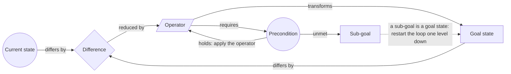

# Means-Ends Analysis

> Measures the distance between where you are and where you want to be, picks the operator that shrinks the biggest difference, and promotes every unmet precondition into a goal of its own. Category: Engineering & Cognitive Problem Solving. Reference: [Means–ends analysis](https://en.wikipedia.org/wiki/Means%E2%80%93ends_analysis). [Open the 3D graph](./index.html) (needs internet for Three.js; on GitHub open via Pages or clone).

## What it decomposes

Newell, Shaw and Simon built the loop into the General Problem Solver in 1957 and set it out in *Human Problem Solving* (1972): compare the current state with the goal state, name the difference, select an operator known to reduce a difference of that kind, test the operator's preconditions, and when one fails, make that precondition a goal and run the same loop on it. The object is neither an argument nor a system nor a failure but a route between two described states, which puts the framework in planning rather than explanation.

It forces four things open, unequally. The goal has to be precise enough that you could tell whether you had arrived, which speakers do willingly, because a target is a good thing to announce. The difference has to be named as a *kind* of gap, because the kind selects the operator: distance is reduced by a vehicle, ignorance by a telephone, missing capability by neither. The operator has to be named, the easiest slot of all, since plans are made of actions. Then the precondition — what must already be true before the operator can be applied at all — and the promotion of an unmet precondition into a goal one level down. Those two carry the work and both are usually invisible. An operator can be available and not applicable, which are different things, and nobody says "I am now creating a sub-goal"; they simply start talking about the sub-problem, and the listener has to notice that the subject changed because a requirement was violated.

Without the structure a plan becomes a list of operators — buy machines, raise debt, raise equity, automate the factory — each item real, none attached to a named gap, so nobody can say which one is load-bearing. The serious failure is the precondition nobody checks: plans rarely fail at the step everybody knew was hard, they fail at the step that was never in the plan because no operator in it had its requirements written down. The framework's own misuse is worth naming in the same breath. Means-ends analysis hill-climbs: it reduces whichever difference is nearest, which makes it wrong exactly when the route to the goal runs away from the goal first — the Tower of Hanoi move that lifts a disc off the target peg, the missionaries-and-cannibals crossing that rows somebody back to the wrong bank. Read naively, a temporary increase in distance looks like a wrong move and the only working plan gets rejected. The slot that absorbs the rest of the damage is the difference: "the battery is dead" is a current state, and becomes a difference only when you say what it is a gap between.

## The slots



| Slot | What goes here | Typical provenance | Why that provenance |
|---|---|---|---|
| Current state | Where things are now: the position, the numbers, the inventory of what exists before anything is applied. | fact | States get narrated. A speaker making the case for a plan leads with where he stands, usually with a figure attached. |
| Goal state | Where things should be, stated precisely enough that you could tell whether you had arrived. | either | Normally stated outright, because a target is an announcement. Inferred only for a goal a promotion creates and nobody phrases. |
| Difference | The gap that matters most between current and goal, named in a way that selects an operator. | derived | A prior, not a rule, and the TBPN example breaks it three times out of five: speakers state the headline gap when arguing for a plan. What stays derived is the gap nobody computes and the gap that exists only after a promotion. |
| Operator | An action known to reduce a difference of that kind. | either | In practice almost always a fact. Plans are lists of operators, so the slot extracts itself; all nine operators below are quoted. |
| Precondition | What must already be true before an operator can be applied at all. | derived | The slot the source almost never fills. A precondition is invisible until violated, and even then the source reports the violation as a state rather than as a requirement. |
| Sub-goal | An unmet precondition promoted to a goal of its own, which restarts the whole loop one level down. | derived | The promotion is never narrated. Its evidence is indirect — someone starts solving the sub-problem, or funds it — and the new goal is read off that behaviour. |

## Example 1: Getting a boy to nursery school

The textbook illustration, written out here as a short scenario so that fact nodes quote a text that exists. Retold from the nursery-school illustration of means-ends analysis in Newell and Simon, *Human Problem Solving* (1972), the standard exposition of the General Problem Solver's loop.

### Source text

> A father has to get his four-year-old son to nursery school this morning. He is at home with the boy, the school is three miles away across town, and the session starts in forty minutes. His car is in the driveway and it is the only thing he owns that covers three miles in ten minutes. The car will not start; the battery is dead. The auto repair shop six blocks away stocks batteries and will install one the same day, which is what the car needs to start. Nobody has told the shop anything, so it has no idea that a battery is wanted. To tell the shop anything he has to reach it, and the telephone on the kitchen wall reaches the shop, which opens at eight. He picks up the telephone and dials.

### Decomposition

Fifteen nodes, seven of them facts, and the split falls along slot lines exactly as the registry predicts: every current state, the goal and every operator is quoted; every difference, every precondition and both sub-goals are derived.

Current state

- `c1` **At home, forty minutes left** [fact] The father is at home with the boy. The school is three miles away across town and the morning session starts in forty minutes. "He is at home with the boy, the school is three miles away across town, and the session starts in forty minutes." (sentence 2)
- `c2` **The car will not start** [fact] The car is in the driveway and it will not start, because the battery is dead. "The car will not start; the battery is dead." (sentence 4)
- `c3` **The shop has not been told** [fact] The repair shop has been told nothing, so it has no idea that a battery is wanted. "Nobody has told the shop anything, so it has no idea that a battery is wanted." (sentence 6)

Goal state

- `g1` **Son at nursery school** [fact] The boy is at nursery school this morning. That is the state the whole chain exists to reach. "A father has to get his four-year-old son to nursery school this morning." (sentence 1)

Difference

- `d1` **Three miles of distance** [derived 0.90] The difference that matters between the two states is distance: three miles a four-year-old cannot cover in the time left. Not money, not permission, not information. Rationale: The scenario gives a position, a destination and a clock, and never names the gap between them. Distance is the reading that makes the car relevant; if the difference were named as information or as money, a different operator would be selected and the rest of the chain would not follow. Supported by `c1`.
- `d2` **No cranking current** [derived 0.85] Between the car as it is and the car the drive operator needs there is one difference: a dead battery delivers no current to the starter. Rationale: The scenario names the dead battery as a state, not as the difference between two states. Reading it as the difference is what makes replacing the battery, rather than pushing the car or calling a taxi, the operator the chain selects.
- `d3` **A difference of information** [derived 0.80] Between what the shop knows and what it must know there is a difference of information. It is not a difference of distance or of money, so neither the car nor a cheque reduces it. Rationale: The scenario never classifies the gap. Classifying it as information is what selects a telephone: the same naming step as d1, performed on a gap of a completely different kind, which is how the method keeps working as it descends.

Operator

- `o1` **Drive the car across town** [fact] Driving the car covers the three miles. It is the only thing the father owns that reduces a difference of this size in the time available. "His car is in the driveway and it is the only thing he owns that covers three miles in ten minutes." (sentence 3)
- `o2` **Shop fits a new battery** [fact] The auto repair shop six blocks away stocks batteries and will install one the same day, which is what the car needs to start. "The auto repair shop six blocks away stocks batteries and will install one the same day, which is what the car needs to start." (sentence 5)
- `o3` **Telephone the shop** [fact] The telephone on the kitchen wall reaches the shop, which opens at eight. Picking it up applies the operator. "the telephone on the kitchen wall reaches the shop, which opens at eight" (sentence 7)

Precondition

- `p1` **The car has to start** [derived 0.90] Before the drive operator can be applied the car has to start. The operator is available and not applicable, which are different things. Rationale: Means-ends analysis tests an operator's preconditions before applying it. The dead battery is only a blocker once you have said that driving needs a running car; the scenario states the dead battery and never states the requirement it violates. Supported by `c2`.
- `p2` **The shop has to know** [derived 0.90] Before the shop can fit a battery it has to know that one is wanted. The scenario records that it does not; the requirement is what turns that into a blocker. Rationale: An operator that belongs to somebody else carries a precondition of consent or instruction, and the scenario states only the shop's ignorance. Naming the requirement is what produces the third level; reading sentence 6 as a complaint produces nothing. Supported by `c3`.
- `p3` **Someone has to pick up** [derived 0.70] Before the telephone operator can work the shop has to be open and someone has to answer. The scenario says the shop opens at eight and never says what time it is. Rationale: The opening hour is stated as colour, and it is actually a precondition that the text leaves untested: forty minutes before a nursery session may well be before eight. Flagging it is the honest end of the chain, because the method stops at the first precondition it cannot check rather than at the first one it can satisfy. Supported by `o3`.

Sub-goal

- `s1` **Sub-goal: a car that runs** [derived 0.90] The unmet precondition is promoted to a goal in its own right: get the car into a state where it starts. The compare-difference-operator loop now runs on this goal instead. Rationale: This is the recursive step the method is named for, and it is never said out loud: the scenario moves from the dead battery to the repair shop as though no new goal had been created. Without the promotion there is no second level and no explanation of why a repair shop is suddenly relevant to nursery school. Supported by `c2`.
- `s2` **Sub-goal: a shop that knows** [derived 0.85] The second unmet precondition becomes the second sub-goal, one level deeper: get the fact that a battery is wanted from the father's head into the shop. Rationale: The same promotion as s1, applied to p2. It is worth making explicit because the recursion is the framework's whole claim: the machinery that handled a three-mile drive handles a missing sentence without changing shape. Supported by `c3`.

Edges: twenty-three, two of them facts. Both fact edges are `transforms`, and both quote a sentence in which the scenario states what an operator does to a state:

- `ce15` `o2` -> `c2` (transforms, label "fixes") [fact] "The auto repair shop six blocks away stocks batteries and will install one the same day, which is what the car needs to start." (sentence 5)
- `ce16` `o3` -> `c3` (transforms, label "informs") [fact] "To tell the shop anything he has to reach it, and the telephone on the kitchen wall reaches the shop, which opens at eight." (sentence 7)

Fifteen derived edges carry a framework relation. Six `differs_by`, each joining a state to the gap it is one end of: `ce1` `c1` -> `d1` (0.90); `ce2` `g1` -> `d1` (0.90), rationale "A difference is defined by both states; the goal supplies the destination end of the three miles."; `ce6` `c2` -> `d2` (0.85); `ce7` `s1` -> `d2` (0.80), the edge that makes the first sub-goal the goal end of the second-level gap; `ce11` `c3` -> `d3` (0.85); `ce12` `s2` -> `d3` (0.80). Three `reduced_by`, the operator-selection step: `ce3` `d1` -> `o1` (0.85), rationale "Sentence 3 says the car covers the distance but never says that the car is therefore the operator for this gap; that selection is the method's step."; `ce8` `d2` -> `o2` (0.85); `ce13` `d3` -> `o3` (0.85). Three `requires`: `ce4` `o1` -> `p1` (0.90); `ce9` `o2` -> `p2` (0.90); `ce14` `o3` -> `p3` (0.70). Two `becomes_subgoal`, the promotions: `ce5` `p1` -> `s1` (0.90), rationale "The promotion step: an unmet precondition is re-entered as a goal, which is the only reason the repair shop enters a story about nursery school."; `ce10` `p2` -> `s2` (0.85). One derived `transforms`: `ce17` `o1` -> `g1` (0.85), derived rather than fact because the scenario never completes the drive.

Six are grounding links, listed with the nodes above: `ce18` `p1` -> `c2` (0.90); `ce19` `p2` -> `c3` (0.90); `ce20` `p3` -> `o3` (0.70); `ce21` `s1` -> `c2` (0.85); `ce22` `s2` -> `c3` (0.85); `ce23` `d1` -> `c1` (0.90).

Read level by level, the graph is the same five-node loop three times: `c1` and `g1` give `d1`, which selects `o1`, which requires `p1`, which becomes `s1`; then `c2` and `s1` give `d2`, which selects `o2`, which requires `p2`, which becomes `s2`; then `c3` and `s2` give `d3`, which selects `o3`, which requires `p3`. The page draws those three passes as three horizontal bands, labelled the original goal, the sub-goal of a car that runs, and the sub-goal of a shop that knows.

### What the LLM added and why it helps

Hide the derived layer and seven nodes remain: three states, one goal, three operators, and the two fact edges saying that a battery fixes a car and a telephone informs a shop. It is a coherent inventory and it is not a plan. Nothing in it explains why an auto repair shop appears in a story about a nursery school, because everything that would explain it — the three differences, the three preconditions, the two promotions — is inference.

Those come in three kinds, and the recipe below treats them differently. The classifications (`d1` 0.90, `d2` 0.85, `d3` 0.80) take a state the scenario reports and say what *kind* of gap it represents, which is what selects the operator; confidence drops as the gap gets further from a quoted quantity, from three stated miles to an unquantified shortfall of information. The requirements (`p1` 0.90, `p2` 0.90, `p3` 0.70) say what each operator needs, which the scenario never does: it reports the dead battery and the shop's ignorance as facts about the world and leaves the reader to see that each one violates something. The promotions (`s1` 0.90, `s2` 0.85) are the recursion itself, the step no source says out loud.

One node earns its low confidence by refusing to finish. `p3` (0.70) reads "which opens at eight", a detail offered as colour, as an untested precondition, and the chain stops there with no operator attached because the text never says what time it is. That is the honest shape of a means-ends graph: it ends at the first precondition it cannot check, not the first one it can satisfy.

## Example 2: from the TBPN transcripts: Hadrian: four times the factory, and a workforce money cannot buy

Episode "Astronomer CEO affair at Coldplay concert, Juul approved by the FDA, is AI causing historic crashouts (Chris Power, Jeremie Eliahou, Chris Best, Alex Mashrabov)", 2025-07-17, [transcript](../../../tbpn-transcripts/transcripts/2025-07-17_astronomer-ceo-affair-at-coldplay-concert-juul-approved-by-the-fda-is-ai-causing-historic-crashouts-chris-power-jeremie-eliahou-chris-best-alex-mashra.md); all line numbers refer to it. Chris Power of Hadrian joins live from the Reindustrialize summit on the morning his funding is announced, and he gives this framework the two states it needs in consecutive sentences: Factory 2 in Los Angeles with revenue up 10x, and Factory 3 in Arizona at four times the size. He then names the operators that are supposed to close the gap and, unusually, names one precondition out loud and says that money cannot satisfy it, which is exactly the moment a precondition becomes a sub-goal.

Twenty-four nodes, sixteen facts and eight inferences; thirty-eight edges, nine facts and twenty-nine inferences, of which eight are grounding links. The ratio is the opposite of what the registry expects, and the reason is specific rather than accidental: a founder pitching a plan states his states, his differences and his operators, and states none of his requirements.

### Facts (quoted)

Sixteen fact nodes and nine fact edges, none of them paraphrases. Every `source_ref` is Chris Power plus the line range in the file.

Current state

- `cs1` **Factory 2 in LA, revenue up 10x** [fact] Hadrian's second factory is in Los Angeles and scaled revenue tenfold last year, which is why capacity is now the binding issue. "So last year in factory two in LA, you know, we scaled revenue 10 X last year." (Chris Power, L3734-L3736) Entities: Hadrian, Chris Power.
- `cs2` **Primes' suppliers: 60% on time** [fact] A prime contractor spending a billion dollars a year sees its suppliers deliver on time 60% of the time, often three to five months late. "a lot of the primes have a billion dollars in spend a year and their suppliers are delivering on time, 60% and they're often three to five months late." (Chris Power, L4046-L4052) Entities: Hadrian.
- `cs3` **No one can find the workforce** [fact] In submarines, shipbuilding and munitions the binding constraint is not the cost of the work but that nobody can find people to do it. "it's not about automation to make things cheaper. It's just no one can find the workforce." (Chris Power, L3974-L3976) Entities: Hadrian.
- `cs4` **We hollowed out the talent base** [fact] The starting state of the workforce sub-goal: the talent base was hollowed out over decades of offshoring, so the skills are not there to be recruited. "It is really a we hollowed out the talent base. We don't have a lot of the talent anymore." (Chris Power, L4140-L4142) Entities: Hadrian.
- `cs5` **Factory software 30 years behind** [fact] Manufacturing software is thirty years behind the rest of Silicon Valley, which Power offers to software engineers as a reason to come and work on it. "for software engineers, manufacturing software is 30 years behind the rest of Silicon Valley." (Chris Power, L4180-L4182) Entities: Hadrian.

Goal state

- `gs1` **Factory 3 in Arizona, 4x LA** [fact] The goal state is a third factory in Arizona, four times the size of the Los Angeles facility, filled with machines. "to buy more machines and put them in factory three in Arizona, which is gonna be four times the size of our facility in LA." (Chris Power, L3740-L3744) Entities: Hadrian.
- `gs2` **A program from one aircraft to 20** [fact] The customer-side goal: a new program of record scaling from one aircraft to twenty, with no other supplier able to keep up. "we're scaling a new program of record and no one else can keep up. We're going from one aircraft to 20." (Chris Power, L4036-L4040) Entities: Hadrian.

Difference

- `df1` **Obviously need more capacity** [fact] Power states the top-level difference himself: after 10x revenue growth the gap between what Factory 2 produces and what demand asks for is capacity. "And so obviously need more capacity." (Chris Power, L3736) Entities: Hadrian.
- `df3` **Schedule and capacity, not cost** [fact] Power names what customers are actually paying to close: schedule, capacity and stability, rather than unit cost. One missing part stops a line at millions of dollars a day. "people are really coming to us for the schedule and the capacity and stability versus cost." (Chris Power, L4056-L4058) Entities: Hadrian.
- `df4` **No scaled workforce at any price** [fact] The difference that no amount of capital reduces: a billion dollars cannot hire two thousand welders, because the scaled workforce no longer exists in the country. "because you could give me a billion dollars and say, go hire 2,000 welders, and we can no longer have that scaled workforce in the country." (Chris Power, L3986-L3992) Entities: Hadrian.

Operator

- `op1` **Scale up machining in Factory 3** [fact] The first operator: put the machining capacity of four LA factories on the floor in Arizona, across every machining format. "So we'll scale up machining in factory three, four times the size" (Chris Power, L3866-L3868) Entities: Hadrian.
- `op2` **Morgan Stanley capacity instrument** [fact] A debt instrument from Morgan Stanley, raised specifically to expand factory capacity rather than to fund the company. "And Morgan Stanley is providing us this huge instrument as well to expand factory capacity." (Chris Power, L3718-L3722) Entities: Hadrian, Morgan Stanley.
- `op3` **A $260M equity round** [fact] An equity round of $260 million, led by the investors Power names as Founders Fund and Lux (the transcript garbles the names), announced the morning of the interview. "are leading a huge $260 million round into Hadrian." (Chris Power, L3714) Entities: Hadrian, Founders Fund, Chris Power.
- `op4` **Automated factories** [fact] Automating the factory is presented not as a way to make parts cheaper but as the only available operator once the labour difference cannot be reduced by hiring. "So automated factories are sometimes the only way to win in these critical domains." (Chris Power, L3994-L3996) Entities: Hadrian.
- `op5` **Advanced mfg plus new workforce** [fact] The compound operator Power actually proposes: Hadrian's model of advanced manufacturing combined with a new industrial workforce, not one or the other. "So you have to use our model of advanced manufacturing combined with this new industrial workforce that we're so grateful to work with." (Chris Power, L3978-L3982) Entities: Hadrian.
- `op6` **Software and robotics for 10x** [fact] The operator for the workforce sub-goal: use software and robotics to make the workforce that does exist ten times more productive. "And the only way to do that is use software and robotics to enable this workforce to be 10 times more productive." (Chris Power, L4144-L4146) Entities: Hadrian.

Fact edges. Nine, each joining two fact nodes inside a single stretch of Power's own speech that states the connection:

- `fe1` `cs1` -> `df1` (differs_by, label "so") [fact] "So last year in factory two in LA, you know, we scaled revenue 10 X last year. Wow. And so obviously need more capacity." (Chris Power, L3734-L3736)
- `fe2` `df1` -> `op1` (reduced_by) [fact] "And so obviously need more capacity. So we're gonna use all of the factory financing capital to buy more machines and put them in factory three in Arizona" (Chris Power, L3736-L3742)
- `fe3` `df1` -> `op2` (reduced_by) [fact] "And Morgan Stanley is providing us this huge instrument as well to expand factory capacity." (Chris Power, L3718-L3722)
- `fe4` `op1` -> `gs1` (transforms) [fact] "So we're gonna use all of the factory financing capital to buy more machines and put them in factory three in Arizona, which is gonna be four times the size of our facility in LA." (Chris Power, L3738-L3744)
- `fe5` `cs2` -> `df3` (differs_by) [fact] "they're often three to five months late. So that is less about cost. And that's more about, I want a stable supply chain that I don't want to have to worry about. Cause if you have one part missing, your manufacturing line goes down and then it's millions of dollars a day. Right? So people are really coming to us for the schedule and the capacity and stability versus cost." (Chris Power, L4052-L4058)
- `fe6` `cs3` -> `df4` (differs_by) [fact] "It's just no one can find the workforce. So you have to use our model of advanced manufacturing combined with this new industrial workforce that we're so grateful to work with. That's the power, because you could give me a billion dollars and say, go hire 2,000 welders, and we can no longer have that scaled workforce in the country." (Chris Power, L3976-L3992)
- `fe7` `df4` -> `op4` (reduced_by) [fact] "because you could give me a billion dollars and say, go hire 2,000 welders, and we can no longer have that scaled workforce in the country. So automated factories are sometimes the only way to win in these critical domains." (Chris Power, L3986-L3996)
- `fe8` `df4` -> `op5` (reduced_by) [fact] "So you have to use our model of advanced manufacturing combined with this new industrial workforce that we're so grateful to work with. That's the power, because you could give me a billion dollars and say, go hire 2,000 welders, and we can no longer have that scaled workforce in the country." (Chris Power, L3978-L3992)
- `fe9` `op6` -> `cs4` (transforms, label "the only way") [fact] "It is really a we hollowed out the talent base. We don't have a lot of the talent anymore. And the only way to do that is use software and robotics to enable this workforce to be 10 times more productive." (Chris Power, L4140-L4146)

Note what is in that list and what is not. Three `differs_by` edges and three `reduced_by` edges are quoted, which means Power does the framework's first two steps out loud: he states a gap and he attaches an action to it, in the same breath, with "so" as the connective. No `requires` edge is quoted, and no `becomes_subgoal` edge, because there is nothing to quote.

### Decomposition

Eight derived nodes and twenty-nine derived edges. Fact nodes are referenced by id.

Difference

- `df2` **4x of floor, 20x of demand** [derived 0.75] The two numbers never meet in the conversation. Floor space and machines go up four times; the program they serve goes up twenty times. The missing factor of five has to come from output per machine and per person, not from more building. Rationale: Arithmetic on two stated quantities that are fifteen minutes apart in the interview: Factory 3 is 'four times the size of our facility in LA' and the program is 'going from one aircraft to 20'. Nobody divides them. The quotient is what makes automation a requirement rather than a preference, and it is the one number that decides whether the plan closes the gap. Supported by `gs1`; reached also from `gs2` and `cs1`. Entities: Hadrian.
- `df5` **The tooling gap on the floor** [derived 0.70] Between the software an automated factory needs and the software the industry actually has there are thirty years. That gap, not the robots, is what stands between the existing workforce and a tenfold gain. Rationale: Power states the thirty-year lag as a recruiting pitch in a different part of the conversation from the 10x productivity claim. Putting them together turns a fact about an industry into the difference that blocks his own operator: you cannot deploy software that is not written. Reached from `cs5` and from `sg2`. Entities: Hadrian.

Precondition

- `pc1` **Machines bought without equity** [derived 0.85] Before the floor can be filled at this rate, the capital equipment has to be paid for out of something other than equity, because equity is reserved for headcount and products. Rationale: Power states the allocation rule as a preference ('we don't want to use equity dollars to scale'), not as a gate. Read as a precondition it explains the shape of the whole financing: a 4x factory cannot be bought with dilution at a tolerable price, so a separate machine-financing instrument has to exist before the scale-up operator can run. Supported by `op2`. Entities: Hadrian, Morgan Stanley.
- `pc2` **A workforce money cannot buy** [derived 0.90] Both operators require people who can run an advanced factory: machinists, welders, quality inspectors, operators. The precondition is unmet and, by Power's own statement, unbuyable at any price. Rationale: Power states the labour shortage and states the automation response, but never puts the requirement between them: an automated factory still needs trained people, so automation reduces the headcount the operator needs without removing the precondition. Treating it as a precondition rather than as background is what turns it into a goal with an owner. Supported by `df4` and `cs3`. Carries an `idea` field, quoted below. Entities: Hadrian.
- `pc3` **Software nobody has written yet** [derived 0.70] Before software and robotics can make a workforce ten times more productive, that software has to exist for the processes being automated: machining, welding, castings, inspection. Rationale: Follows from the two stated facts, the 10x-productivity operator and the thirty-year software lag, neither of which is presented as bearing on the other. The precondition is what explains why a manufacturing company is hiring software engineers at all. Supported by `cs5`. Carries an `idea` field, quoted below. Entities: Hadrian.

Sub-goal

- `sg1` **Sub-goal: finance the machines** [derived 0.80] The capital precondition promoted to a goal of its own: find an instrument that buys CapEx without touching equity. This is the one sub-goal in the interview that is already solved. Rationale: The Morgan Stanley instrument only makes sense as the answer to a goal nobody states. Naming the sub-goal is what distinguishes it from the equity round: two operators, two different sub-goals, one of which buys steel and one of which buys people. Supported by `op2`. Entities: Hadrian, Morgan Stanley.
- `sg2` **Sub-goal: the industrial workforce** [derived 0.85] The labour precondition promoted to a goal Hadrian pursues itself: build the new industrial workforce, and use equity dollars rather than debt to do it. Rationale: Power's phrasing gives this away twice: the round is 'more importantly' about the new industrial workforce, and equity dollars are earmarked 'to hire more people'. Neither sentence says a sub-goal has been created, but a company that allocates a separate instrument to a precondition has promoted it. Supported by `op5`. Entities: Hadrian, Chris Power.
- `sg3` **Sub-goal: write the floor software** [derived 0.70] The software precondition promoted to a goal two levels down from the original one. Hadrian takes it on internally; nobody in the conversation suggests it can be bought. Rationale: The third promotion in the chain, and the one with the weakest stated support: Power advertises the software opportunity to engineers rather than describing a program. Naming it as a sub-goal is what shows how far the original capacity goal has recursed. Supported by `cs5`. Carries an `idea` field, quoted below. Entities: Hadrian.

Derived edges. Twenty-one carry a framework relation. Six `differs_by`, three of them pointing at the quotient nobody computes: `de1` `gs2` -> `df2` (0.80); `de2` `gs1` -> `df2` (0.75), rationale "The 4x factory is the other number; the difference is the ratio between them."; `de3` `cs1` -> `df2` (0.70); `de11` `cs4` -> `df4` (0.80), derived although both ends are facts, because Power gives the hollowed-out talent base in one passage and the workforce difference in another; `de17` `sg2` -> `df5` (0.65), the recursion edge that makes the workforce sub-goal the goal end of the tooling gap, and the lowest-confidence edge in the example; `de18` `cs5` -> `df5` (0.80). Four `reduced_by`: `de4` `df2` -> `op4` (0.75), rationale "If floor space grows 4x while demand grows 20x, the remaining factor has to come from output per machine and per person, which is what automation is for. Power never connects the automation argument to the capacity arithmetic; he reaches automation from the labour shortage instead."; `de9` `df3` -> `op1` (0.70); `de10` `df3` -> `op5` (0.70); `de19` `df5` -> `op6` (0.75). Four `requires`, and every one of them is an inference because the source contains no requirement at all: `de5` `op1` -> `pc1` (0.85); `de12` `op4` -> `pc2` (0.90), rationale "An automated factory reduces how many people an operator needs; it does not remove the requirement for trained ones. The requirement is nowhere stated."; `de13` `op5` -> `pc2` (0.85); `de20` `op6` -> `pc3` (0.70). Three `becomes_subgoal`, the promotions: `de6` `pc1` -> `sg1` (0.85); `de14` `pc2` -> `sg2` (0.90), rationale "The promotion that organises the whole interview: Power calls the new industrial workforce the more important half of the announcement, which is what a company does with a precondition it has decided to own."; `de21` `pc3` -> `sg3` (0.70). Four derived `transforms`, each attaching an operator to the state or sub-goal it changes: `de7` `op2` -> `sg1` (0.80); `de8` `op1` -> `gs2` (0.70); `de15` `op3` -> `sg2` (0.70), rationale "Equity dollars are earmarked for hiring people rather than for CapEx, which makes the round the operator for the workforce sub-goal: 'We wanna use equity dollars to hire more people to build more products for our customers'."; `de16` `op6` -> `sg2` (0.80).

Eight are grounding links, listed with the nodes above: `sb1` `df2` -> `gs1` (0.75); `sb2` `pc1` -> `op2` (0.85); `sb3` `pc2` -> `df4` (0.90); `sb4` `pc2` -> `cs3` (0.85); `sb5` `pc3` -> `cs5` (0.80); `sb6` `sg1` -> `op2` (0.80); `sb7` `sg2` -> `op5` (0.85); `sb8` `sg3` -> `cs5` (0.70).

The chain recurses twice. The original goal is capacity: `cs1` and `gs1`/`gs2` give `df1` and `df2`, which select `op1`, `op2` and `op4`. One level down, `pc2` becomes `sg2`, the industrial workforce, whose own current state is `cs4` and whose operators are `op3`, `op5` and `op6`. One level further, `pc3` becomes `sg3`, the floor software, whose current state is `cs5` and whose difference is `df5` — the same depth the nursery-school chain reaches, arrived at from a factory expansion rather than a school run.

### What the LLM added

The honest finding in this example is a pattern, not a single inference: **the operators are named and their preconditions are not.** All six operators are quoted. All three preconditions are derived. Six `differs_by` and `reduced_by` edges are quoted; not one `requires` edge is. A founder announcing a round says what he is going to do and what each action is for, and says nothing about what each action needs in order to work, because requirements are not announcements. That asymmetry is where plans quietly fail, and it is the reason this framework earns a page: its schema has a slot for exactly the thing the source omits.

The registry expects the difference slot to be derived, and here it mostly is not, so it is worth saying plainly rather than dressing up. Three of the five differences are facts — `df1` ("And so obviously need more capacity."), `df3` (customers buy "the schedule and the capacity and stability versus cost") and `df4` (a billion dollars cannot hire 2,000 welders) — because Power is making a case, and a case is built by naming gaps. The two derived differences are the ones nobody states. `df2` (0.75) divides two figures fifteen minutes apart in the interview: four times the floor against twenty times the program. Nobody takes that quotient, and it is the number that decides whether the plan closes the gap at all, because a factor of five has to come from output per machine and per person rather than from more building. `df5` (0.70) is the gap that only exists once the workforce has become a goal in its own right: thirty years of missing software standing between the workforce that exists and a tenfold-productive one.

Then the two kinds of inference the source structurally cannot supply. The requirements: `pc1` (0.85) reads an allocation preference — equity is not for scaling — as a gate, which is what makes a separate machine-financing instrument necessary rather than clever. `pc2` (0.90) is the highest-confidence inference in the example and sits in the gap between two statements Power makes one after the other: nobody can find the workforce, so automate. Automation reduces how many people the operator needs; it does not remove the need for trained ones, and the requirement is never put between the two sentences. `pc3` (0.70) explains why a manufacturing company is hiring software engineers at all. And the promotions: `sg1` (0.80), `sg2` (0.85) and `sg3` (0.70), none of them announced, each read off behaviour rather than words — a dedicated debt instrument, an equity round earmarked for hiring, a recruiting pitch to engineers. `sg2` carries the highest-confidence promotion edge in the example (`de14`, 0.90) because allocating a separate instrument to a precondition is what owning it looks like; `sg3` carries the lowest (`de21`, 0.70) because all that supports it is a pitch.

Hide the derived layer and what remains is true to the source and unmistakably a pitch: states, targets, gaps, and six things the company is going to do. What vanishes is every requirement and every level of recursion, which is to say the part of the plan that could fail.

### Where the opportunity shows up

The idea-bearing slot is the precondition (`idea_bearing_slot: "precondition"`), and the reason follows from the finding above. An unmet precondition that nobody in the source owns is a gap in somebody's plan; when the same gap sits under the plans of a whole industry, it is a business. Two preconditions carry an `idea` field. The sub-goals carry none: a promoted precondition is a precondition somebody has decided to solve, and the idea it implies is already read from the precondition it was promoted from, so repeating it one slot down would count the same opening twice.

- `pc2` **A workforce money cannot buy**, derived, confidence 0.90, supported by `df4` and `cs3`. Idea: "A training-and-placement pipeline that delivers machinists, welders and quality inspectors to advanced factories on a contracted schedule is a business whose price is already quoted: primes losing millions of dollars a day to 60% on-time delivery are paying for schedule, not for cheap labour."
- `pc3` **Software nobody has written yet**, derived, confidence 0.70, supported by `cs5`. Idea: "Machine-level software for the shop floor is a greenfield category by the operator's own admission: scheduling, tooling, quality and traceability for machining, welding and castings, sold to the factories whose automation plans are all gated on the same missing layer."

Read as candidates, they rank in the order their confidences suggest, and for the reason the confidence scale gives. `pc2` at 0.90 is nearly forced by what Power says: he states that a billion dollars cannot buy two thousand welders, and the willingness to pay is quoted in the same interview by a different number, the prime contractor losing millions of dollars a day when one part is missing. The demand side is not a generalisation here; it is two quotes. `pc3` at 0.70 is a standard reading rather than a forced one — the thirty-year lag is stated, the 10x-productivity operator is stated, and the inference that joins them is the kind most careful readers would share. The recursion itself — `pc3` promoted to `sg3` two levels below the original goal — is worth noticing without being an idea: a sub-goal appearing two levels down inside one company's plan is probably appearing two levels down inside every comparable company's plan, each paying to solve it privately. Nothing in the transcript says that, and it is exactly the claim a second episode could confirm or kill; until then it is a reason to take `pc3` seriously rather than a product of its own.

Note which nodes carry no idea. `pc1`, the capital precondition, is a real requirement at 0.85 and it is already served: Morgan Stanley sold the product. A precondition with a named supplier is not an opening, and the difference between `pc1` and `pc2` is the whole test — one had an instrument waiting, one has Power saying that money does not help.

## Building a knowledge graph with this framework

### Node and edge types

Six node types, one per slot: `current_state`, `goal_state`, `difference`, `operator`, `precondition`, `subgoal`. The graph is not a tree and not a chain. It is one five-node loop, repeated once per level of recursion, with the levels stitched together by a single relation.

Five relations plus grounding, exactly as in `graph.json`:

- `differs_by` runs from a state to the difference it is one end of, and it is used twice per difference, once from the current state and once from the goal. This is the relation that makes the recursion visible, because at every level below the first the goal end is a sub-goal node (`ce7`, `ce12` in the classic; `de17` in TBPN). It is a fact edge only when one turn states gap and state together, which in practice means a "so" (`fe1`).
- `reduced_by` runs difference to operator: the selection step. A fact edge when the speaker attaches the action to the gap himself (`fe2`, `fe3`, `fe7`, `fe8`), derived when the two halves are stated apart and the join is the reader's (`de4`, `de9`).
- `requires` runs operator to precondition. Across both examples, all seven are derived. Treat a fact `requires` edge as a pleasant surprise, not an expectation.
- `becomes_subgoal` runs precondition to sub-goal: the promotion, always derived, and the edge whose confidence should track how visible the promotion is. An allocated budget earns 0.85 to 0.90; a rhetorical gesture earns 0.70.
- `transforms` runs from an operator to whatever state it changes — the goal it achieves (`ce17`, `fe4`), the sub-goal it satisfies (`de7`, `de15`, `de16`), or the current state it repairs (`ce15`, `ce16`, `fe9`). It is the only relation that can be a fact edge in both directions of the page's left-to-right reading, because a source that says "a battery is what the car needs to start" has stated a transformation without stating a plan.
- `supported_by` runs from any derived node to the facts that force it, and is always derived. For preconditions it points at the state that shows the requirement unmet (`ce18`, `sb3`); for sub-goals it points at the trace of somebody working on them (`sb6`, `sb7`).

Layout follows the structure: the page puts current state, difference, operator, precondition and goal on a means-to-end axis running left to right, and recursion depth on the vertical axis, so each level of promotion is one band lower.

### Fact or derived: rules of thumb

The provenance column in the registry is a prior. In this framework two of its entries are reliable, two are reliably wrong in the other direction, and one needs watching.

- **Current state**: extracted, nearly always, and usually with a number attached. Take the narrowest span that carries the quantity. A sub-goal's own current state is often stated far away from the sub-goal (`cs4`, `cs5` are in a later answer than the goal they sit under), so search the whole passage before marking it derived. Empty: if nothing describes the present, there is no difference to compute, and the passage is an aspiration rather than a plan.
- **Goal state**: extracted, usually, because targets get announced. Two goals in one passage is normal and not a defect: `gs1` is Hadrian's own target and `gs2` is the customer program it serves, and the interesting difference (`df2`) is the ratio between them. Infer a goal only for a sub-goal, where the new goal exists but nobody phrases it.
- **Difference**: the registry says derived; read it as either. A speaker arguing for a plan states his headline gaps (`df1`, `df3`, `df4`), and forcing those into the derived column to match the prior would be a fabrication in the other direction. Two kinds stay derived and they are the valuable ones: the arithmetic nobody does between two stated numbers (`df2`, 0.75), and the gap that only exists after a promotion (`df5`, 0.70; `d2` and `d3` in the classic). Empty: if no gap can be named between the two states, do not invent one — check whether you have actually got two states or one state stated twice.
- **Operator**: extracted, effectively always. All nine operators in both examples are quoted, and an operator you have to infer is usually a sign that you are reading a diagnosis rather than a plan. Empty: a difference with no operator attached is a legitimate output; leave it open rather than supplying an action the source never proposed.
- **Precondition**: derived, and this is the framework's most valuable inference. The source reports the violation, not the requirement: it says the battery is dead, not that driving needs a running car; it says nobody can find the workforce, not that an automated factory still needs trained people. The inference is worth making because it is the only thing that converts a narrated obstacle into a named gate with an owner, and because it is where the `idea` field lives. Work from the operator, not from the obstacle: ask what has to be true for this action to be applicable, then look for the fact that shows it is not. Empty: if no precondition can be named, the operator is applicable and the level terminates — which is a finding, not a gap.
- **Sub-goal**: derived, always, because no source narrates a promotion. Read it off behaviour: a separate budget, a dedicated instrument, a hire, a team, a new thread of conversation on the sub-problem. The inference is worth making because without it the graph has no levels, and a graph with no levels cannot show how far a plan has had to recurse — which, as `sg3` argues, is itself a market signal. Empty: a precondition that nobody anywhere is working on is still a precondition; leave it unpromoted and say so, rather than inventing a sub-goal to make the recursion look deeper.

### Extraction recipe

```text
Decompose ONE plan in <file>, lines <a>-<b>, with Means-Ends Analysis.
Work level by level and stop when you run out of evidence, not when the
structure looks full.

LEVEL 0
1. Goal state: what the speaker says should be true, verbatim, 5+ words. Keep
   the number in the quote. Several goals are allowed if the source has
   several; do not merge them.
2. Current state: what is true now, verbatim, with its number.
3. Difference: a gap between 1 and 2, named as a KIND of gap (capacity,
   distance, information, capability, schedule, money) so that it selects an
   operator. If the speaker names the gap, it is a FACT node, even though this
   slot's prior is derived. Then look for the gap nobody names: divide or
   subtract the numbers the source states in different places, and enter the
   result as a derived node whose rationale names both inputs and where each
   was said. Cap it at 0.75 when the two quantities were not stated together.
4. Operator: every action the speaker proposes for that gap, verbatim. Attach
   each to the difference it reduces with `reduced_by`.
5. Precondition: for EACH operator, ask what must already be true before it
   can be applied, then search the source for the fact that shows whether it
   holds. Enter the requirement as a derived node; `supported_by` the fact
   that shows it unmet. Never enter a precondition with no fact bearing on it:
   either find the fact or drop the node. Confidence 0.85-0.90 when the source
   states the violation, 0.70 when you are reading an aside as a requirement.
6. For each unmet precondition, look for evidence that somebody has taken it
   on: a budget, an instrument, a hire, a team, a stretch of talk about the
   sub-problem. If you find it, promote the precondition to a `subgoal` node
   (`becomes_subgoal`), confidence set by how concrete the evidence is.
   If you find nothing, STOP the branch and leave the precondition unpromoted.

RECURSE
7. Treat each sub-goal as the goal state of a new level and run steps 2-6
   again: its own current state (often stated elsewhere in the passage), its
   own difference, its own operators, its own preconditions. Two levels of
   recursion is a rich result; stop at three.

EDGES
8. differs_by (both states -> difference), reduced_by, requires,
   becomes_subgoal, transforms (operator -> the state it changes). An edge is
   FACT only when both endpoints are fact nodes AND one turn states the
   connection, quoted verbatim; a "so" between a gap and an action is the
   usual case. Everything else derived with a confidence. supported_by from
   every derived node to its facts, always derived.
9. Put the underserved need or startup idea in the `idea` field of the
   precondition (or sub-goal) it is read from, never in a rationale, and never
   on a precondition that already has a named supplier in the source.

Output one graph.json example: nodes [{id, slot, label <=40 chars, text,
provenance, source_quote+source_ref | confidence+rationale, idea?, entities}],
edges [{id, from, to, relation, provenance, confidence?, source_quote?,
source_ref?, rationale?, label?}], idea_bearing_slot "precondition".
```

Afterwards run `node _meta/validate.mjs <dir>` for quotes, the paraphrase cap and derived-to-fact connectivity, then five checks it cannot make. Every operator must have an incoming `reduced_by` from a named difference, or it is an announcement rather than a step in a plan. Every precondition must have a `supported_by` edge to a fact bearing on whether it holds. Every sub-goal must be reachable from a precondition by `becomes_subgoal`, and must serve the goal above it — a sub-goal that drifts is worse than a missing one. Every derived difference computed from two numbers must name both, and both must be fact nodes in the graph. And no node text may assert something its `source_quote` does not support: the validator proves the quote exists, not that the sentence around it is fair.

### Failure modes

- **Hill-climbing on the nearest difference.** The framework's own documented weakness, inherited straight from the General Problem Solver: it reduces whichever gap is closest to hand, so it walks into every problem where the route to the goal must first increase the distance. Tower of Hanoi needs a disc moved off the target peg; missionaries and cannibals needs somebody rowed back to the wrong bank. The extraction version of the error is selecting the operator that shrinks the most visible gap and dropping the one that shrinks the blocking gap. Guard: rank differences by what blocks the goal, not by what is nearest or loudest, and keep a difference that an operator makes *worse* as its own node rather than discarding it. A plan that gets worse before it gets better is the normal shape of a plan, not a contradiction in the graph.
- **Slot confusion between a difference and a current state.** "The car will not start" and "no one can find the workforce" are states; the graph has them as `c2` and `cs3`. A difference names two ends and a dimension: no cranking current between the car as it is and the car the operator needs (`d2`); no scaled workforce at any price, against the workforce an automated factory would need (`df4`). Guard: if the sentence is true on its own, it is a state. If it is only true relative to something else, it is a difference, and the rationale has to name the something else. The same test sorts a goal from a difference: a goal is a state you want, not a gap.
- **Invented preconditions.** The easiest fabrication in this framework, because the slot is always derived and the schema invites filling it. A plausible-sounding requirement with nothing in the source bearing on it passes the validator and poisons everything downstream, since a promoted precondition becomes a sub-goal and a whole fictional level. Guard: every precondition needs a `supported_by` edge to a fact that speaks to whether it holds; no fact, no node. Where the source is thin, cap the confidence at 0.70 and say in the rationale what is missing — `p3` (0.70) flags an untested opening hour and `pc3` (0.70) rests on a recruiting pitch, and both say so.
- **Promoting everything, or nothing.** Promote every precondition and the graph recurses until the validator's node cap stops it, each level thinner than the last. Promote none and the framework has been reduced to a gap analysis. Guard: a promotion needs evidence that somebody is working on the sub-goal, and the depth reached should be reported as a finding. Both examples here recurse twice, which is what two levels of real evidence looks like.
- **Over-confident promotions.** A `becomes_subgoal` edge at 0.90 on the strength of a rhetorical flourish. Guard: tie the confidence to the concreteness of the evidence. `de14` earns 0.90 because a separate instrument and an earmarked equity round are allocation decisions; `de21` gets 0.70 because all Power does is advertise the problem to engineers.
- **The idea written into the rationale, or onto a served precondition.** Two versions of the same mistake. Guard: the rationale says only why the inference follows, and the `idea` field holds the opportunity. Before attaching an idea, check whether the source already names a supplier for that precondition — `pc1` has Morgan Stanley and carries no idea, while `pc2` has Power saying a billion dollars would not help, and carries one.

## Related frameworks

- [Pólya's 4-Step Method](../polya-four-step/README.md): the same lineage and the outer shell. Pólya's "devise a plan" is a phase; means-ends analysis is the loop that runs inside it. Use Pólya when the problem statement itself is unclear, means-ends when the two states are clear and the route is not.
- [Functional Decomposition](../functional-decomposition/README.md): decomposes the thing to be built into parts and interface contracts; means-ends decomposes the route to it. A precondition is not a component, and confusing the two produces an org chart where a plan should be.
- [Inversion & Pre-Mortem](../inversion-premortem/README.md): attacks the same blind spot from the other end. The unmet precondition nobody owns is precisely what a pre-mortem surfaces as a cause of failure, so the two frameworks disagree usefully: if inversion finds a failure path that means-ends has no precondition for, a slot was left empty.
- [Theory of Constraints & Evaporating Cloud](../../02-strategic-and-business/theory-of-constraints/README.md): also organised around what blocks throughput, but it looks for one binding constraint inside a running system and exploits it. Prefer it when the system already works and is merely slow; prefer means-ends when the goal is a state nobody has reached yet and the question is what route gets there.

[Library root](../../README.md).
