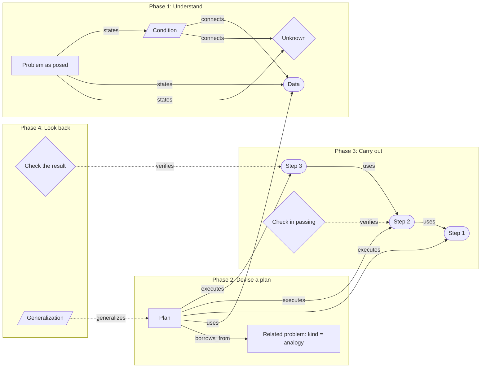

# Pólya's 4-Step Method

> Understand the problem, devise a plan, carry out the plan, look back: four phases that force the unknown, the data and the condition into the open before anyone calculates. Category: Engineering & Cognitive Problem Solving. Reference: [How to Solve It](https://en.wikipedia.org/wiki/How_to_Solve_It). [Open the 3D graph](./index.html) (needs internet for Three.js; on GitHub open via Pages or clone).

## What it decomposes

George Pólya's *How to Solve It* (1945) takes apart the act of answering a question rather than the question's subject matter. The object is a problem that has an answer — a quantity to find, a construction to produce — and the decomposition is temporal: understand the problem (what is the unknown, what are the data, what is the condition connecting them), devise a plan by way of a related problem already solved, carry it out step by step checking each step, then look back — check the result, check the argument, ask whether the method will do for another problem. The phases are four questions about the solver's own position, and the framework's claim is that people fail at problems mostly by answering them in the wrong order.

What it forces into the open is specific. The unknown has to be named as one thing, so that you can tell whether you have reached it. The data have to be listed separately from the condition, because the data are what you may use and the condition is the relation any answer must respect; conflating them is how a solver ends up with a formula that consumes every given number and means nothing. The plan has to be named before the first step. And every step has to be checkable on its own: the third-phase question is "can you see clearly that the step is correct", one step at a time, not "is the answer plausible" at the end.

Without it two failures are near-universal, and both examples below show them. The first is answering before understanding: a number is produced from whatever datum is nearest to hand, and only afterwards does anyone ask what the answer depends on. The second is skipping the fourth phase. That is the page's thesis, and it is in the data rather than asserted: **in both examples the Look back phase contains no fact nodes at all.** In Pólya's classroom dialogue and in a live business broadcast alike, hide the derived layer and the fourth column goes empty — nobody checks the result against a case they already know, nobody says what method they just used. That is what the fact/derived toggle is for here.

One structural note. The four phases are scaffolding, not content: the `phase` slot is `structural: true`, its nodes carry `provenance: "schema"`, and so do the `in_phase` edges attaching content to them. Schema items are neither facts nor inferences, are drawn grey, stay visible when derived items are hidden, and are excluded from every count below — when this page says the classic example has eight fact and eight derived nodes, the four phase boxes are not among the twenty.

## The slots



Every content node also carries one `in_phase` edge to its phase box; those grey edges are omitted from the diagram to keep it readable.

| Slot | What goes here | Typical provenance | Why that provenance |
|---|---|---|---|
| `phase` | Understand, Plan, Carry out, Look back. Four fixed boxes, identical in every application. | schema | Scaffolding: the phases exist because Pólya says so, not because a source mentions them. Excluded from the counts. |
| `problem` | The problem as posed, in the words in which it arrives. | fact | If nobody posed it there is nothing to decompose. Quoted verbatim in both examples (`cp1`, `tp1`). |
| `unknown` | The one quantity or object sought. | either | Usually posed as a question, and a fact in both examples (`cu1`, `tu1`). Inferred when speakers argue toward an answer without saying what would count as one. |
| `data` | The givens: numbers, objects, and the notation and figure the solver has put on paper. | fact | Givens are quotable almost by definition. Note the judgment here: Pólya's instruction to draw a figure and introduce notation is filed in `data` (`cd2`) — material the solver produced and the later steps consume, with no separate slot for it. |
| `condition` | How the unknown and the data are connected; the relation any answer must respect. | either | Stated in a textbook problem, which is written to contain it (`cc1`). On a transcript it is what nobody says: `tc1` is a fact only because a host remarks on it in passing, and both `connects` edges out of it stay derived. |
| `plan` | The approach chosen, plus the related problem it borrows from (`attrs.kind = "analogy"`). | derived | Normally the largest inference on the page: sources state problems and answers and leave the route out. The TBPN example is the exception — stated aloud in full (`tpl1`, fact), then never executed. |
| `step` | A verifiable step in carrying out the plan. | derived | Derived whenever the work was not done on the record, the common case. Steps that *are* facts tend to be ones taken before any plan existed (`cs0`, `ts0`, `ts0b`). |
| `check` | How a step or the result is verified. | derived | Derived in Look back, always. The only fact checks here sit in Carry out and both are refusals: a guess killed by a counterexample (`ck0`), an estimate rejected with no reason (`tk0`). |
| `generalization` | The heuristic or result that transfers to another problem. | derived | Neither source attempts it, so all four are inferences. Also the idea-bearing slot, which is why the opportunity here lives entirely in the derived layer. |

## Example 1: The diagonal of a rectangular parallelepiped

Pólya's own worked example: the teacher's questions extract the unknown, the data and the condition, the student produces the related problem but cannot use it, and the plan, the steps and the whole fourth phase are supplied by the solver.

### Source text

> Find the diagonal of a rectangular parallelepiped whose length, width and height are known. The teacher asks what the unknown is. The student answers: the length of the diagonal of a parallelepiped. What are the data? The length, the width and the height of the parallelepiped. What is the condition? The diagonal is the segment joining two opposite corners, so its length must be determined by the three edges and nothing else. The student draws a box, marks the three edges a, b and c, and draws the diagonal from one corner to the corner furthest from it. Asked whether he knows a related problem, he answers that the diagonal of a rectangle is found from its two sides. Asked whether that helps here, he says he does not yet see how a plane figure helps with a solid. He guesses that the answer is a plus b plus c, and sees at once that this cannot be right, because the diagonal of a square of side one would then be two.

After George Pólya, *How to Solve It* (1945), Part I; the dialogue is written for this example so that the fact nodes have something verbatim to quote.

### Decomposition

Twenty nodes: four schema phase boxes, eight facts, eight derived. No paraphrases; `source_ref` is the sentence number above.

Phase — scaffolding, excluded from the counts

- `cph_understand` **Understand the problem** [schema] Phase 1. What is the unknown, what are the data, what is the condition. Polya's rule: you cannot answer a question you do not understand.
- `cph_plan` **Devise a plan** [schema] Phase 2. Find the connection between the data and the unknown, usually by way of a related problem already solved, or an auxiliary element.
- `cph_carry` **Carry out the plan** [schema] Phase 3. Execute the steps and check each one as you go. Can you see clearly that the step is correct.
- `cph_look` **Look back** [schema] Phase 4. Examine the solution obtained: check the result, check the argument, and ask whether the method can be used for another problem.

Problem

- `cp1` **Diagonal of a parallelepiped** [fact] Find the diagonal of a rectangular parallelepiped whose length, width and height are known. "Find the diagonal of a rectangular parallelepiped whose length, width and height are known." (sentence 1)

Unknown

- `cu1` **Unknown: the diagonal's length** [fact] The unknown, named in answer to the teacher's first question: the length of the diagonal of a parallelepiped. "the length of the diagonal of a parallelepiped" (sentences 2-3)

Data

- `cd1` **Given: length, width, height** [fact] The data: the length, the width and the height of the parallelepiped. Three numbers, and nothing else is given. "The length, the width and the height of the parallelepiped" (sentence 5)
- `cd2` **Figure drawn, edges a, b, c** [fact] The figure and the notation, which Polya counts as part of understanding the problem: a box is drawn, its three edges are marked a, b and c, and the diagonal is drawn from one corner to the corner furthest from it. "The student draws a box, marks the three edges a, b and c" (sentence 8)

Condition

- `cc1` **Three edges fix the diagonal** [fact] The condition: the diagonal is the segment joining two opposite corners, so its length must be determined by the three edges and nothing else. "its length must be determined by the three edges and nothing else" (sentence 7)

Plan

- `ca1` **Related: diagonal of a rectangle** [fact, `attrs.kind = "analogy"`] The related problem the student produces when asked: the diagonal of a rectangle is found from its two sides. It has the same kind of unknown, one dimension lower. "the diagonal of a rectangle is found from its two sides" (sentence 9)
- `cpl1` **Pythagoras twice, face diagonal** [derived 0.90] Introduce an auxiliary element, the diagonal of the base rectangle. It splits the solid problem into two plane problems, each of them the related problem: Pythagoras in the base, then Pythagoras in the vertical right triangle standing on it. Rationale: The source states the related problem and states that the student cannot use it: he 'does not yet see how a plane figure helps with a solid' (sentence 10). The bridge between them - draw the base diagonal and the solid becomes two right triangles - is exactly what the dialogue withholds, and it is close to forced once the figure, the notation and the related problem are all on the table. Supported by `ca1` via `ceb1`.

Step

- `cs0` **First guess: a + b + c** [fact] A step taken before any plan exists: the student guesses that the answer is a plus b plus c. "He guesses that the answer is a plus b plus c" (sentence 11)
- `cs1` **Face diagonal e, e² = a² + b²** [derived 0.90] In the base rectangle the diagonal e satisfies e squared = a squared + b squared, by the Pythagorean theorem applied at the right angle between the edges a and b. Rationale: Forced by the plan together with the notation already in the source: the base is a rectangle of sides a and b, so its diagonal is fixed by the related problem the student himself named. The source never performs the step. Supported by `cd2` via `ceu2`.
- `cs2` **Right triangle on the base: e, c** [derived 0.90] The edge c is perpendicular to the base, so e and c are the legs of a right triangle whose hypotenuse is the diagonal d that was sought. Rationale: Follows from what a rectangular parallelepiped is, which the problem statement names but never unpacks. The perpendicularity is the permission to apply the related problem a second time, and it is the step that makes the plan work rather than merely sound plausible. Supported by `cd2` via `ceu3`.
- `cs3` **d = √(a² + b² + c²)** [derived 0.92] Therefore d squared = e squared + c squared = a squared + b squared + c squared, and the diagonal is the square root of the sum of the squares of the three edges. Rationale: Substitution of the two previous steps, arithmetic once they are granted. It is the answer to the unknown the source poses and never reaches. Supported by `cu1` via `cesb1`.

Check

- `ck0` **Unit square refutes the guess** [fact] The check that kills the guess on the spot: for a square of side one the guess would make the diagonal two. "the diagonal of a square of side one would then be two" (sentence 11)
- `ck1` **Dimensions: degree one in length** [derived 0.80] Check the result by dimension: the expression is homogeneous of degree one in length, so the diagonal comes out in the units of the edges, and scaling every edge by k scales d by k. Rationale: Polya's 'can you check the result' applied to the formula the steps produce. The dialogue checks only the rejected guess, so every test of the answer itself is the reader's inference, not the source's. Supported by `cd1` via `cesb2`.
- `ck2` **Special cases: c = 0, a = b = c** [derived 0.85] Check the result against answers already known: with c = 0 the formula collapses to the diagonal of a rectangle, which is the related problem; with a = b = c it gives a times the square root of three, the diagonal of a cube. The expression is also symmetric in a, b and c, as the box is. Rationale: Each case is an answer that is known independently and that the formula has to reproduce, and the c = 0 case closes the loop back to the related problem stated in sentence 9. None of it happens in the dialogue. Supported by `ca1` via `ceu6`.

Generalization

- `cg1` **Auxiliary element: 3-D to 2-D** [derived 0.85] The method rather than the formula is what transfers: when a problem in three dimensions resists, introduce an auxiliary element that reduces it to a problem in two dimensions you have already solved. Rationale: Generalises the plan that the steps executed. Polya's fourth phase asks whether the method can be used for another problem; the dialogue ends before that question is put. Supported by `ca1` via `cesb3`.
- `cg2` **Same argument in n dimensions** [derived 0.80] The same two-step argument runs in any number of dimensions: the diagonal of an n-dimensional box is the square root of the sum of the squares of its edges, by induction on the same auxiliary element. Rationale: The steps never used the fact that there are exactly three edges, only that one edge is perpendicular to the plane of the others, so the argument iterates. The source does not mention the extension. Supported by `cd1` via `cesb4`.

Edges. Forty-one: sixteen `in_phase` schema edges, six facts, nineteen derived. The six fact edges each join two fact nodes and quote the dialogue's own connective:

- `ces1` `cp1` -> `cu1` (states) [fact] "The teacher asks what the unknown is. The student answers: the length of the diagonal of a parallelepiped." (sentences 2-3)
- `ces2` `cp1` -> `cd1` (states) [fact] "What are the data? The length, the width and the height of the parallelepiped." (sentences 4-5)
- `ces3` `cp1` -> `cc1` (states) [fact] "What is the condition? The diagonal is the segment joining two opposite corners, so its length must be determined by the three edges" (sentences 6-7)
- `cec1` `cc1` -> `cu1` (connects) [fact] "its length must be determined by the three edges and nothing else" (sentence 7)
- `cec2` `cc1` -> `cd1` (connects) [fact] "The diagonal is the segment joining two opposite corners, so its length must be determined by the three edges" (sentence 7)
- `cev0` `ck0` -> `cs0` (verifies, label "refutes") [fact] "He guesses that the answer is a plus b plus c, and sees at once that this cannot be right, because the diagonal of a square of side one would then be two." (sentence 11)

The nineteen derived edges. One is the borrowing: `ceb1` `cpl1` -> `ca1` (borrows_from, label "same unknown, 2-D", 0.90), rationale "The plan is the related problem applied twice. Sentence 10 says explicitly that the student cannot see the link, so the link is the inference." Three hang the steps on the plan: `cee1` `cpl1` -> `cs1` (executes, 0.92), `cee2` `cpl1` -> `cs2` (0.90), `cee3` `cpl1` -> `cs3` (0.90). Seven are `uses`: `ceu0` `cd2` -> `cd1` (0.85, the edges marked a, b, c are the three given lengths), `ceu1` `cs0` -> `cd1` (0.80, the guess consumes the givens), `ceu2` `cs1` -> `cd2` (0.90), `ceu3` `cs2` -> `cd2` (0.85), `ceu4` `cs2` -> `cs1` (0.92), `ceu5` `cs3` -> `cs2` (0.92), `ceu6` `ck2` -> `ca1` (0.80, the c = 0 case consumes the related problem as a known answer). Two verify the result: `cev1` `ck1` -> `cs3` (0.85), `cev2` `ck2` -> `cs3` (0.85). Two generalize: `ceg1` `cg1` -> `cpl1` (0.85, "names what the plan did in a form that does not mention boxes"), `ceg2` `cg2` -> `cs3` (0.80, "extends the result, not the method"). Four are grounding links: `cesb1` `cs3` -> `cu1` (0.90), `cesb2` `ck1` -> `cd1` (0.80), `cesb3` `cg1` -> `ca1` (0.85), `cesb4` `cg2` -> `cd1` (0.80).

### What the LLM added and why it helps

Hide the derived layer and the first phase survives intact: five fact nodes and five fact edges — problem, unknown, data, figure, condition, and the arrows joining them. That is what a well-posed textbook problem is, a phase-1 decomposition written out in advance. Phase 2 keeps the related problem the student produces when asked (`ca1`); phase 3 keeps the guess and its refutation (`cs0`, `ck0`); phase 4 keeps nothing.

The LLM's contribution is the middle and the end. `cpl1` (0.90) is the plan, and its confidence is high for an unusual reason: the source names the gap it leaves. Sentence 10 has the student saying he does not see how a plane figure helps with a solid, which makes filling it a short inference rather than a leap. `cs1` to `cs3` (0.90, 0.90, 0.92) are the execution the dialogue never performs, and `cs2` is load-bearing: it says the third edge is perpendicular to the base, the only thing in the argument that is not the related problem, hidden inside the word "rectangular" in sentence 1.

The second addition is the whole fourth phase. `ck1` (0.80) checks by dimension; `ck2` (0.85) checks against answers known independently — with c = 0 the formula must collapse to the related problem, with a = b = c to the diagonal of a cube; `cg1` (0.85) and `cg2` (0.80) say what transfers. What these four do that nothing in the fact layer does is connect the answer back to the question: `ceu6` runs from `ck2` to `ca1`, closing a loop the source opened in sentence 9. Keep one number for the comparison below: six of the forty-one edges here are facts, each a connective the prose states in so many words.

## Example 2: from the TBPN transcripts: What is six gigawatts of AMD chips worth?

Episode "OpenAI AMD deal, DevDay reactions, xAI's Memphis datacenter (Doug O'Laughlin, Celine Halioua)", 2025-10-06, [transcript](../../../tbpn-transcripts/transcripts/2025-10-06_openai-amd-deal-devday-reactions-xais-memphis-datacenter-doug-olaughlin-celine-halioua.md); line numbers refer to it. A host states the unknown out loud — "Can you estimate the dollar value of that if it's MI 40, 450 equivalence?" (L1690-L1692) — the givens are read from the Wall Street Journal and recalled from an analyst, and the plan is verbalised in order: watts per chip, divide into six gigawatts, multiply by price. What makes the episode fit is the order in which that happens. A dollar estimate is produced at L1460, two hundred and thirty lines before anyone asks what the answer depends on. A second, incompatible estimate appears at L1694-L1696 and is rejected flat, with no reason, at L1696-L1698. Only then is the method stated in full, at L1698-L1712 — after which the show takes an ad read, moves to the next article, and never executes it. The four phases are visible here precisely by which of them the conversation skipped.

### Facts (quoted)

Twenty-three nodes: four schema phase boxes, twelve facts, seven derived. No paraphrases; `source_ref` is speaker plus line range. The phase boxes (`tph_understand`, `tph_plan`, `tph_carry`, `tph_look`) are the same scaffolding as in example 1, with identical text, and are not repeated here.

Problem

- `tp1` **6 GW of AMD chips committed** [fact] The problem as posed, in units of power: under the terms of the deal OpenAI committed to purchasing six gigawatts worth of AMD chips. Entities: OpenAI, AMD. "Under the terms of the deal, OpenAI committed to purchasing six gigawatts worth of AMD chips." (host reading the WSJ, L1394-L1398)

Unknown

- `tu1` **Unknown: dollar value of 6 GW** [fact] The unknown, put by a host to the show's researcher: what is six gigawatts of AMD chips worth in dollars, if the chips are MI-450 equivalents? Entities: AMD, AMD MI-450. "six gigawatts of AMD chips. Can you estimate the dollar value of that if it's MI 40, 450 equivalence?" (host to Tyler, L1690-L1692)

Condition

- `tc1` **Orders denominated in energy** [fact] The condition, noticed in passing: GPU orders are now quoted in energy demand, so any dollar figure has to be reached through a conversion from power to chips. "we're now just referring to GPU orders based on their energy demands" (host, L1400-L1402)

Data

- `td1` **Tens of billions per gigawatt** [fact] A given from AMD itself: the plan costs tens of billions of dollars per gigawatt of computing capacity. The two companies did not disclose the overall expected cost. Entities: AMD. "AMD said it costs tens of billions of dollars per gigawatt of computing capacity" (host reading the WSJ, L1458)
- `td2` **$50B per gigawatt, recalled** [fact] A second per-gigawatt price, recalled by the researcher from an analyst: around fifty billion dollars per gigawatt. The attribution is unintelligible in the transcript and the number is never sourced on air. "he said it's like around 50 billion per gigawatt" (Tyler, L1694)
- `td3` **1 GW MI-450 starts H2 next year** [fact] The ramp: OpenAI will begin with one gigawatt worth of MI-450 chips in the second half of next year, so the six gigawatts arrives in stages. Entities: OpenAI, AMD MI-450. "open AI is going to begin with one gigawatt worth of MI 450 chips starting in the second half of next year to run its AI models." (host, L1600-L1602)
- `td4` **AMD: tens of billions by 2027** [fact] A given from the other side of the deal: Lisa Su told investors the agreement would give AMD tens of billions of dollars of revenue by 2027. Entities: AMD, Lisa Su. "would give AMD tens of billions of dollars of revenue by 2027" (host reading the WSJ on Lisa Su's investor call, L1676-L1678)

Plan

- `tpl1` **Plan: watts per chip, then price** [fact] The plan, stated out loud and in order: find the energy use of a single MI-450, divide six gigawatts by it to get the number of chips, then multiply by the price of a chip. Entities: AMD MI-450. "what is the energy use of a single MI-450, and then divide that by six gigawatts to get me, like, how many chips are they going to buy, and then what's the price of the chip, so multiply that" (host, L1698-L1712)
- `ta1` **Related: 1 GW ≈ 800,000 homes** [fact, `attrs.kind = "analogy"`] The same episode performs the conversion for electricity rather than for silicon: a new plant capable of generating over a gigawatt, enough to power around 800,000 homes. Entities: XAI, Elon Musk. "capable of generating over a gigawatt of electricity enough to power around 800,000 homes" (host reading the WSJ on xAI in Memphis, L1744)

Step

- `ts0` **Estimate 1: almost $100B** [fact] The first estimate, produced from AMD's per-gigawatt figure before anyone had asked what the answer depended on: almost a hundred billion dollars. Entities: AMD. "So we're looking at almost a hundred billion dollar deal" (host, L1460)
- `ts0b` **Estimate 2: $400B?** [fact] The second estimate, produced from the recalled fifty billion per gigawatt: a four hundred billion dollar deal. "Wait, so this is like a 400 billion dollar deal?" (host, L1694-L1696)

Check

- `tk0` **“That's totally wrong”** [fact] The host rejects his own second estimate at once, without saying what is wrong with it or what would replace it. "I think, wait, that's totally wrong" (host, L1696-L1698)

Fact edges. Five, each joining two fact nodes and quoting the connective inside one turn; three of them are `uses`, which is why that relation exists on this page:

- `tes1` `tp1` -> `tu1` (states) [fact] "six gigawatts of AMD chips. Can you estimate the dollar value of that" (host, L1690)
- `teu0` `ts0` -> `td1` (uses, label "so") [fact] "tens of billions of dollars per gigawatt of computing capacity. So we're looking at almost a hundred billion dollar deal" (host reading the WSJ, then the host, L1458-L1460)
- `teu1` `ts0b` -> `td2` (uses) [fact] "50 billion per gigawatt? Wait, so this is like a 400 billion dollar deal?" (host, L1694-L1696)
- `tev0` `tk0` -> `ts0b` (verifies, label "rejects") [fact] "so this is like a 400 billion dollar deal? I think, wait, that's totally wrong" (host, L1694-L1698)
- `teu2` `tpl1` -> `tp1` (uses) [fact] "divide that by six gigawatts to get me, like, how many chips are they going to buy" (host, L1706-L1708)

### Decomposition

Seven derived nodes and eighteen derived edges; the remaining nineteen are `in_phase` scaffolding. Fact nodes are referenced by id.

Step — the three the stated plan asks for and nobody takes

- `ts1` **Step not taken: watts per chip** [derived 0.85] Establish the power draw of one MI-450 as deployed, measured at the rack so that cooling and networking are inside the number. This is the first input the stated plan asks for. Rationale: The plan at L1698-L1712 names this as its first input and nobody supplies it; the semiconductor analyst in the next segment is asked about where the power will come from instead (L2286). Measuring at the rack rather than at the die is forced by the data: six gigawatts is facility power, so the divisor has to be facility power per accelerator. Supported by `tpl1` via `tee1`.
- `ts2` **Step not taken: chip count** [derived 0.85] Divide six gigawatts of committed capacity by the per-accelerator draw to get the number of MI-450s the order covers. Rationale: Second step of the stated plan, never carried out in the episode. The quoted plan inverts its own division ('divide that by six gigawatts'), which is another reason the step has to be reconstructed rather than read off. Supported by `tpl1` via `tee2`.
- `ts3` **Step not taken: count × price** [derived 0.82] Multiply the accelerator count by the price of one MI-450 to get the dollar value of the six-gigawatt commitment, which is the unknown as posed. Rationale: Third step of the stated plan and the one that would answer the question at L1690-L1692. Derived because the multiplication is never performed and no unit price is ever stated by anyone on the show. Supported by `tu1` via `tesb1` and `tpl1` via `tee3`.

Check — the two nobody performs

- `tk1` **Two estimates differ fourfold** [derived 0.90] The two figures already on the table are incompatible: about a hundred billion read off 'tens of billions per gigawatt', and four hundred billion asserted from fifty billion per gigawatt, which would in any case give three hundred billion across six gigawatts. At most one of them survives. Rationale: Both estimates are facts in the source. That they exclude each other, and that fifty billion times six gigawatts is three hundred billion rather than four hundred, is arithmetic the episode never performs. This is Polya's 'examine the result' applied to two results at once. Supported by `ts0` via `tev1` and `ts0b` via `tev2`.
- `tk2` **Check against AMD's guidance** [derived 0.75] Bound the per-gigawatt price with AMD's own disclosure. Tens of billions of dollars of revenue by 2027 cannot sit under a six-gigawatt order priced at fifty billion per gigawatt unless most of the capacity lands after 2027, is bought through cloud partners, or is priced far below the recalled figure. Rationale: Uses the revenue guidance at L1676-L1678 and the phased start at L1600-L1602 as an independent bound on the per-gigawatt number at L1694. The source states all three and never puts them side by side. Supported by `td4` via `teu5`, `td3` via `teu6`, and `ts0b` via `tev3`.

Generalization — the idea-bearing slot; both nodes carry an `idea` field, quoted below

- `tg1` **Convert the unit before pricing** [derived 0.70] The heuristic that transfers: when an order is denominated in a unit you cannot price - gigawatts, tokens, square feet of fab - do not estimate in that unit. Convert it into countable physical things first, price the things, and treat the conversion rate itself as the thing being estimated. Rationale: Generalises the plan the host states and never executes (L1698-L1712) together with the conversion the same episode performs for electricity but not for silicon (L1744). Polya's fourth phase; the episode never reaches it, so all of it is inference. Supported by `ta1` via `tesb2` and `tpl1` via `teg1`.
- `tg2` **The fourfold spread is the gap** [derived 0.60] The size of the disagreement is itself the finding. A live fourfold spread on the headline value of an agreement both parties call definitive says the conversion layer between energy, silicon and dollars is missing rather than merely unpublished. Rationale: Reads the contradiction found in tk1 as a market fact rather than a slip. Contestable, since the spread could be ordinary day-one noise; the evidence for the stronger reading is that nobody closes it on air with a semiconductor analyst waiting in the next segment. Supported by `ts0` via `tesb3`.

Derived edges. Two give the Understand phase the structure no speaker gives it: `tec1` `tc1` -> `tu1` (connects, 0.80), rationale "the host's remark at L1400-L1402 says orders are quoted in energy; that this is what stands between the question and an answer in dollars is the framework's reading, not a claim anyone makes"; `tec2` `tc1` -> `td1` (connects, 0.80), "the per-gigawatt price is usable only because the order is denominated in power. The source puts the two facts three hundred lines apart and never joins them." One is the borrowing: `teb1` `tpl1` -> `ta1` (borrows_from, label "same conversion", 0.55), "converting a gigawatt into 800,000 homes is the already-solved version of the conversion the plan needs. The link crosses two segments and two speakers' material, and nobody on air draws it." Three hang the unexecuted steps on the stated plan: `tee1` `tpl1` -> `ts1` (executes, 0.90), `tee2` `tpl1` -> `ts2` (0.90), `tee3` `tpl1` -> `ts3` (0.85). Two chain the steps: `teu3` `ts2` -> `ts1` (uses, 0.90), `teu4` `ts3` -> `ts2` (0.90). Five are the checks and what they consume: `tev1` `tk1` -> `ts0` (0.90), `tev2` `tk1` -> `ts0b` (0.90), `tev3` `tk2` -> `ts0b` (0.75), `teu5` `tk2` -> `td4` (uses, 0.80), `teu6` `tk2` -> `td3` (0.70). Two generalize: `teg1` `tg1` -> `tpl1` (0.70), `teg2` `tg2` -> `tk1` (0.60). Three are grounding links: `tesb1` `ts3` -> `tu1` (0.85), `tesb2` `tg1` -> `ta1` (0.65), `tesb3` `tg2` -> `ts0` (0.60).

### What the LLM added

Start with the count, because it inverts the classic example. Twelve of the nineteen content nodes here are facts, against eight of sixteen in the dialogue: a live broadcast is *richer* in phase-1 material than Pólya's textbook problem, because the hosts read a filing aloud and then add an analyst's number, a ramp schedule and a revenue guidance. What the fact layer does not contain is a single thing in Look back — and only five of the forty-two edges.

Where the derived nodes sit is the finding. They cluster in the phases the speakers skipped: three steps the stated plan asks for and nobody takes (`ts1`, `ts2`, `ts3` at 0.85, 0.85, 0.82), two checks nobody performs (`tk1` 0.90, `tk2` 0.75), and the whole of Look back (`tg1` 0.70, `tg2` 0.60). The toggle is therefore a map of the conversation's shape: facts pile up on the left, where the question is posed and the givens are read out, and the derived layer fills in rightwards, thinning in confidence as it goes — 0.90 for arithmetic on two quoted figures, 0.85 for a step the plan itself names, 0.60 for a claim about the market.

Two additions deserve singling out. `tk1` (0.90) is the highest-confidence inference on the page and it is pure arithmetic: both estimates are facts, and that they exclude each other — and that fifty billion times six gigawatts is three hundred billion rather than the four hundred the host says — is something nobody on air works out. It is the check the fourth phase exists to force, and it takes one line. What it supplies matters more than the number: the fact layer's rejection (`tk0`, "that's totally wrong") is a refusal with no content, and `tk1` is what a refusal with content looks like. `tk2` (0.75) is the other shape a Look-back check takes, bounding the answer with a figure from elsewhere — the revenue guidance (`td4`) and the phased one-gigawatt start (`td3`) are both facts, three hundred lines from the estimate they constrain, and putting them next to it is the inference.

One line of `ts2`'s rationale generalises beyond this episode. The stated plan inverts its own division — "divide that by six gigawatts", where the host means divide six gigawatts by the per-chip draw — unmistakable to a listener and wrong as written. That is one reason `ts2` has to be reconstructed rather than read off the quote: an extractor that copies the plan's wording inherits the inversion and produces nonsense, while one that reconstructs from the quantities gets it right and pays with a confidence below 1.

### Where the opportunity shows up

The idea-bearing slot is `generalization`, and the choice follows from the framework rather than from taste. A generalization is the one slot whose content is about *other* problems — Pólya's fourth question is whether the method can be used again — so it is where a specific sizing question becomes a statement about what the market is missing. It is also, in both examples, the slot with no facts in it. On this page the opportunity lives entirely in the derived layer by construction, which is worth knowing before trusting it.

- `tg1` **Convert the unit before pricing**, derived, confidence 0.70. Idea: "AI infrastructure is announced in gigawatts but underwritten in accelerators and dollars, so a per-gigawatt bill of materials - watts, racks, accelerators and price per accelerator generation - is a product that analysts, lenders and reporters on this beat currently rebuild by hand for every announcement." Read as a candidate: the node is a heuristic about units, and the underserved need it implies is the reference data the heuristic needs in order to be applied. The episode demonstrates the need twice, once by stating a plan whose first input nobody has, and once by performing the same conversion easily for electricity (`ta1`, a gigawatt to 800,000 homes) because for electricity that conversion rate is common knowledge.
- `tg2` **The fourfold spread is the gap**, derived, confidence 0.60. Idea: "The spread itself is the product: a live, dated measure of how far apart the credible readings of an announced deal sit - a hundred billion against four hundred - is a signal an underwriter, a lender or a trader would pay for on its own, before any single number is settled." Read as a candidate: where `tg1` names the reference data that would close the gap, this one names the gap as a product in its own right — a disagreement index, not a bill of materials — so the two are complements rather than the same idea at two confidences. It reads the contradiction in `tk1` as a market signal rather than a slip, which is why it sits in the 0.50-0.65 band — the spread could be ordinary day-one noise, and the only evidence for the stronger reading is that nobody closes it on air with a semiconductor analyst waiting in the next segment.

Taken together they are the same opportunity at two confidences: the heuristic at 0.70 says what is needed, the market claim at 0.60 says how badly. Neither is in the source, and the check that makes both sayable (`tk1`, 0.90) is itself an inference. That is the honest summary of what this framework yields on a transcript: the opportunity sits in the phase nobody executes, so it is always derived, and its confidence is bounded by the quality of the Look-back checks beneath it.

## Building a knowledge graph with this framework

### Node and edge types

Nine node types, one per slot, laid out as four columns headed by the `phase` nodes: schema boxes (`cph_*`, `tph_*`) with fixed text, no quote, no confidence, drawn grey, excluded from the counts, with one `in_phase` edge (also schema) from every content node. Both examples use the `plane` layout with three dashed guides between the phases. The other eight map to phases like this: `problem`, `unknown`, `data`, `condition` in Understand; `plan` in Devise a plan, holding two kinds of node distinguished by `attrs.kind` — the plan proper and the related problem (`attrs.kind = "analogy"`); `step` plus an in-passing `check` in Carry out; `check` and `generalization` in Look back. `check` straddles two phases on purpose: which phase it sits in is the difference between "can you see that this step is correct" and "can you check the result".

Eight relation types, of which two are additions to the six in the registry. Both were necessary, for different reasons:

- **`states`** runs from the problem as posed to the unknown, the data or the condition it states. Without it the Understand phase has no internal structure: four or seven fact nodes in a column with nothing joining them, and no way to tell a given the problem statement supplies from one a speaker added later. With it the classic example gets three fact edges (`ces1`, `ces2`, `ces3`), exactly the teacher's three questions, and the TBPN example one (`tes1`), the moment a host turns a filing into a question.
- **`uses`** runs from a step or a plan to what it consumes: a datum, a quantity from the problem, or the output of an earlier step. Without it the two fact steps in the TBPN example cannot be joined to the data the speakers visibly derive them from — "tens of billions of dollars per gigawatt... So we're looking at almost a hundred billion dollar deal" is one turn stating one connection, and no registry relation could carry it. Three of that example's five fact edges are `uses` (`teu0`, `teu1`, `teu2`), so dropping it would discard most of its fact edges and leave both estimates floating free of the numbers that produced them. `uses` also carries step-to-step dependency (`ceu4`, `ceu5`, `teu3`, `teu4`), which makes a chain of steps a chain and not a list.

The registry's slot ids are unchanged; only the relation list grew. The other six are the registry's own: `connects` (condition to unknown, condition to data), `borrows_from` (plan to analogy), `executes` (plan to step), `verifies` (check to what it tests, with an optional `label` for polarity: "refutes", "rejects"), `generalizes` (generalization to plan or result), and `supported_by` (derived node to fact, always derived).

The edge provenance rule bites hard here: an edge is a fact only when both endpoints are facts and one turn states the connection in quotable words. `tev0` qualifies, one speaker joining his own estimate to his own rejection; `tec1` and `tec2` do not, though both endpoints are facts, because condition and datum sit three hundred lines apart and nobody joins them.

### Fact or derived: rules of thumb

One rule dominates. **The fact/derived boundary in this framework tracks the phase, not the content.** Understand is nearly all fact, because posing a problem is a speech act and speech acts are quotable. Look back is nearly all derived, because examining a result is work and nobody does it aloud. The middle two phases vary, and the variation is the diagnosis: a stated plan with no steps (TBPN) and an unstated plan with no steps (classic) are different failures, and the graph should tell them apart.

- `phase`: always schema, four nodes, fixed text. Never quote a speaker into a phase node; a host saying "let's figure out the method first" is content and belongs in `plan`. Empty: impossible — an empty column is the framework's most useful output.
- `problem`: extracted. If you cannot quote the problem as posed, you are applying the framework to something that was never a problem, which is the commonest misuse. Empty: stop and pick another framework.
- `unknown`: normally extracted, because a problem is usually posed as a question. One node per application — two unknowns means two applications. Inferred at 0.70 to 0.85 when speakers argue toward an answer without saying what would count as one, with the rationale naming what they treat as the target. Empty: do not invent one; an argument with no unknown is a Toulmin or Minto object.
- `data`: extracted, one node per datum so that `uses` edges have somewhere to land. Include material the solver produced rather than received — a figure, a notation, a table on screen (`cd2`) — and say so in the node text, since there is no separate slot for it. Empty: the problem is not solvable as posed, which is itself a finding.
- `condition`: extracted in a textbook problem, inferred on a transcript, and the slot where extractors over-reach. It is the relation the answer must respect, not a difficulty and not a business constraint. `tc1` is a fact only because a host remarked in passing that orders are quoted in energy; that this is what stands between the question and an answer is the derived part, which is why `tec1` and `tec2` sit at 0.80 under a fact node. Empty: write it derived at 0.60 to 0.80 from the units on each side.
- `plan`: derived by default, and high-confidence when the source names its own gap (`cpl1` at 0.90, because sentence 10 says what the student cannot see). Extracted when somebody states a method — rarer than it sounds, and worth taking at face value and then testing, since `tpl1` is a fact that inverts its own division. A stated plan is a claim about a method, not a correct one.
- `step`: derived whenever the work was not done on the record. Write it as an instruction with no invented numbers: `ts1`, `ts2`, `ts3` carry no figures, because none were available, and a derived step that quietly supplies a watts-per-chip number is a fabricated fact wearing a confidence score. Extracted when a speaker calculates aloud, including before any plan existed (`cs0`, `ts0`, `ts0b`) — such a step gets no `executes` edge, because no plan produced it. Empty: that is the result, and usually the most interesting thing on the page.
- `check`: derived in Look back, effectively always. Two shapes are worth writing every time: internal consistency across the results in hand (`tk1`, arithmetic on two quoted numbers, 0.90), and a bound from an independent figure in the source (`tk2`, `ck2`). Fact checks do occur, and in both examples they are refusals — `ck0` refutes a guess with a counterexample, `tk0` rejects an estimate with no reason at all. Record the difference: "that's totally wrong" is evidence about the conversation, not about the number.
- `generalization`: always derived, because naming the method you just used is the step that gets skipped. Phrase it without the source problem's objects — `cg1` says "auxiliary element", not "box"; `tg1` says "a unit you cannot price", not "gigawatts" — and test whether it could be handed to someone working on a different problem. The business reading goes in `idea`, never in the rationale. Empty: never on a TBPN example; a source that reaches no answer still licenses a heuristic about why, at 0.55 to 0.70.

### Extraction recipe

```text
Decompose ONE problem-solving episode from <file>, lines <a>-<b>, with Polya's
four-step method. The episode must contain a question that has an answer.

SCAFFOLDING (first, always, identically)
0. Emit four phase nodes - Understand, Devise a plan, Carry out, Look back -
   with slot "phase", provenance "schema", no quote, no confidence. Give every
   content node exactly one in_phase edge to its phase, provenance "schema".
   Phase nodes are NOT counted as facts or inferences.

PHASE 1 - UNDERSTAND (expect mostly facts)
1. problem: the problem as posed, verbatim, 5+ words. No quote, no graph.
2. unknown: the one thing sought. Exactly one node. Fact if someone asks for
   it; else derived 0.70-0.85 naming what the speakers treat as the target.
3. data: one node per given quantity, object, schedule or price, each with its
   own quote. Include material the solver produced (a figure, a notation) and
   say so in the node text.
4. condition: what any answer must respect, in units. Fact only if a speaker
   states the relation; otherwise derived 0.60-0.80.
5. Edges: states (problem -> unknown | data | condition), fact when the posing
   turn can be quoted; connects (condition -> unknown, condition -> data),
   derived unless one turn states the link.

PHASE 2 - PLAN (expect one or two nodes)
6. plan: the method, as a sequence of named operations. Fact if stated aloud -
   and if it is, quote it exactly even when its arithmetic is garbled, then
   reconstruct the correct operations as derived steps in phase 3.
7. analogy: a separate plan node with attrs.kind = "analogy" for the related
   or simpler problem already solved, ANYWHERE in the chunk - including a
   different segment about a different subject. Fact when the source states
   it; the borrows_from edge joining it to the plan is derived, with
   confidence falling with distance (same turn 0.85-0.90, other segment or
   other speaker 0.50-0.65).
8. Edges: borrows_from (plan -> analogy), uses (plan -> data | problem).

PHASE 3 - CARRY OUT
9. step: one node per operation. Fact if performed on the record. Derived for
   each operation the plan names and nobody performs - write it as an
   instruction with NO invented numbers, confidence 0.80-0.90.
10. check in passing: a test applied to a single step (fact if someone applies
    it, including a refutation or a bare rejection).
11. Edges: executes (plan -> each derived step; never to a step taken before
    the plan existed), uses (step -> step for dependencies, step -> data),
    verifies (check -> step). Order nodes by dependency, NOT by transcript
    position.

PHASE 4 - LOOK BACK (expect no facts)
12. check the result: at least two. (a) Internal consistency: do the results
    already in hand agree, and does each one's own arithmetic hold. (b) An
    independent bound from a figure elsewhere in the source. Cite the line
    ranges of every figure consumed.
13. generalization: the heuristic that transfers, phrased without the source
    problem's objects. One or two nodes, derived, 0.55-0.85. Put the business
    reading in the `idea` field only.
14. Edges: verifies (check -> step | result), uses (check -> data it consumes),
    generalizes (generalization -> plan | result), supported_by from every
    derived node to the facts beneath it.

Output one graph.json example: nodes [{id, slot, label <=40 chars, text,
provenance, source_quote+source_ref | confidence+rationale, attrs?, idea?,
entities}], edges [{id, from, to, relation, provenance, confidence?,
source_quote?, source_ref?, label?, rationale?}],
idea_bearing_slot "generalization".
```

Afterwards run `node _meta/validate.mjs <dir>` for the quotes, the paraphrase cap and derived-to-fact connectivity, then six checks it cannot make. Every phase node is `schema` and no content node is. Look back holds no fact node unless you can quote someone testing the result or naming the method — and if you have one, read the quote again, because a restatement of the answer is not a check. No derived step contains a number that is not in the source or computed from ones that are. Every `executes` edge runs from a plan to a step the plan's own words name, and no step preceding the plan has one. Exactly one `unknown`. And every `uses` edge points from consumer to consumed, the direction error that silently reverses a dependency chain.

### Failure modes

- **Filling Look back from general knowledge.** The LLM knows the Pythagorean theorem and roughly what AI capex costs, so it writes a check or a generalization and marks it `fact`, destroying the finding the page exists for. Guard: Look back is derived by default; a fact node there needs a quote, inside one turn, of a speaker testing the result or naming the method. Both examples have none, which is the expected result rather than a gap.
- **Reading transcript order as the plan's order.** An estimate appears at L1460 and the method at L1698, so an extractor that orders by position makes `ts0` a step executing `tpl1`. Guard: `executes` edges are licensed by the plan's content, not by adjacency. A step produced before the plan existed is a fact node in Carry out with no incoming `executes` edge (`cs0`, `ts0`, `ts0b` have none), and that absence is the diagnosis.
- **Inheriting the source's broken arithmetic.** The stated plan says "divide that by six gigawatts" when it means the reverse; copying the wording yields a step that computes nothing. Guard: quote the plan verbatim as a fact, reconstruct the operation as a derived step, note the inversion in the rationale (`ts2`). The same guard catches four hundred billion where the numbers give three hundred.
- **Numbers invented to complete a step.** "About 1.4 kW per accelerator, so roughly 4.3 million chips" reads as competent and is a fabricated fact with a confidence attached. Guard: a derived step names the operation and its inputs, never a value the source lacks. If every input is missing the step is still worth writing — that it cannot be taken is the finding.
- **The analogy and its use collapsed into one judgment.** Either the related problem is marked derived because nobody called it an analogy, or `borrows_from` is marked fact because the related problem was quoted. Guard: the split both examples make. A stated related problem is a fact node with `attrs.kind = "analogy"`; that it helps with *this* problem is a derived edge whose confidence measures distance — 0.90 in the classic, where the dialogue says the student cannot see how a plane figure helps with a solid, 0.55 in the TBPN example, where the conversion is performed for electricity in another segment.
- **Condition used as a junk drawer.** Anything difficult about the situation gets filed there: supply constraints, a counterparty's credit, a timeline. Guard: the condition must be a relation between the unknown and the data, such that you can ask of a candidate answer whether it satisfies it. "Orders are denominated in energy" passes, "power is scarce in America" does not.
- **Plan and step confusion.** The plan is split into three plan nodes, or three steps are merged into the plan; either way the `executes` edges disappear, and with them the ability to see an unexecuted plan. Guard: one plan node per application stating the method, one step node per operation — three named operations, three step nodes, most of them derived.
- **Schema drift in the counts.** Phase nodes counted as facts, or an `in_phase` edge given a confidence, and the statistics stop meaning anything. Guard: only the `phase` slot may carry `provenance: "schema"`, schema items carry no quote, confidence or rationale, and every count in the prose excludes them. The viewer's stats line is the check.
- **Generalization as a summary.** "The AMD deal is worth between one hundred and four hundred billion dollars" is the Carry-out phase in the fourth phase's clothes. Guard: a generalization must not name the source problem's objects and must be usable by someone working on something else. If removing the proper nouns leaves nothing, it was a summary.

## Related frameworks

- [First Principles Thinking](../first-principles/README.md): interrogates the givens — which are real limits, which are inherited precedent — where Pólya takes them as given and asks for a route. Prefer it when the data are suspect, Pólya when they are trusted and the path is missing.
- [Functional Decomposition](../functional-decomposition/README.md): decomposes an artefact into the functions its parts perform. Prefer it when the object is a system with parts, Pólya when the object is a question with an answer.
- [Inversion & Pre-Mortem](../inversion-premortem/README.md): the fourth phase's scepticism moved earlier — what will be wrong with the plan, rather than what is wrong with the answer. Since Look back is the phase nobody executes, a pre-mortem is the practical substitute.
- [5 Whys](../../02-strategic-and-business/five-whys/README.md): also a chain descending from a statement, but running backwards from a failure to its cause, where Pólya runs forwards from data to an unknown. Prefer it when something broke and you want the cause, Pólya when nothing broke and you want a number.

[PDCA / Deming Cycle](../../04-sensemaking-and-complex-systems/pdca-deming/README.md), in Sensemaking & Complex Systems, is the closest relative: the same four phases applied to a process rather than a problem, with Act in the part of Look back — skipped for the same reason.

[Library root](../../README.md).
