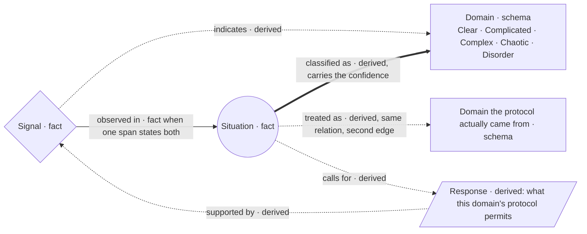

# Cynefin Framework

> Sorts situations by the kind of causality they have — Clear, Complicated, Complex, Chaotic, or Disorder — so that each one gets the decision protocol its domain allows instead of the one the organisation prefers. Category: Sensemaking & Complex Systems. Reference: [Cynefin framework](https://en.wikipedia.org/wiki/Cynefin_framework). [Open the 3D graph](./index.html) (needs internet for Three.js; on GitHub open via Pages or clone).

## What this graph derived

Given TBPN's Flight 10 recap and its reading of David Senra on how Elon Musk attacks cost at SpaceX, setting a fixed Mars window, a $3M cooling quote, a four-bolt spec and a cracked engine skirt side by side, applying the Cynefin Framework we derived that the window is a rule to categorise against, the quote a bundle to unpick, the bolts answerable only by flying two, and the skirt call about decision latency; the opportunities are assurance sold apart from hardware, inherited-requirement auditing, pre-delegated decision authority, and a per-part domain scoreboard for hard-tech diligence.

Given Meridian Foods' Monday review, where the operations director sends an invoice queue, an intermittent line fault, an unexplained plant-based launch and an allergen recall to one Gantt chart, applying the Cynefin Framework we derived that the invoices want the handbook, the line fault is worth a week of instrumentation, the plant-based line needs cheap regional probes not a fourth replan, and the recall was right to act first; the reader gains the exposed assumption that one chart can carry four kinds of causality, and the July argument named as Disorder that only splitting can end.

## What it decomposes

Dave Snowden's framework (IBM Institute of Knowledge Management, 1999; written up for managers in Snowden and Boone, "A Leader's Framework for Decision Making", *Harvard Business Review*, November 2007) takes apart an object most methods accept whole: the agenda. Its material is the set of situations an organisation is carrying at one time — a queue, a machine fault, a launch, an incident, a market — and it sorts them by the one property that changes what may legitimately be done about them, the kind of causality each one has. **Clear**: cause and effect are self-evident and stable, so the answer is written down. **Complicated**: they are knowable but not visible, so expertise finds an answer, possibly several defensible ones. **Complex**: they cohere only in retrospect, so no advance analysis produces the answer. **Chaotic**: there is no usable cause and effect, and the situation moves faster than any analysis of it. **Disorder**: nobody agrees which of the four they are in, so each person acts from the domain they prefer.

What the framework forces into the open is the protocol. Each domain licenses one ordering of the same few verbs and forbids the rest: sense–categorise–respond in Clear, sense–analyse–respond in Complicated, probe–sense–respond in Complex, act–sense–respond in Chaotic. The ordering is not a matter of temperament — in a Complex space the information a plan would need does not exist yet, so probing is not a timid version of analysing, it is the only way to manufacture the input analysis requires. Each domain also fails in its own way, and the Clear one matters most below: its categories outlive the conditions that made them true.

Without the framework an organisation owns one protocol and runs everything through it, and the damage is asymmetric. A Clear item put through analysis is merely slow. A Complex item put through analysis produces the signature the first example shows: the plan slips, the slip is read as a planning error, a better plan is produced, no experiment is run. The reverse error has a cliff under it — a rule that stops holding does not become Complicated, it drops you into Chaotic. And the classification is a judgment about the relationship between an observer and a situation, not a label intrinsic to the problem, so it can be wrong and argued about — which is why it is an edge carrying a confidence here, not a property on a node.

## The slots



| Slot | What goes here | Typical provenance | Why that provenance |
|---|---|---|---|
| Domain | Clear, Complicated, Complex, Chaotic, Disorder. Each is a kind of causality plus the decision protocol that kind of causality permits. | schema | A domain is not a claim about the source; it is part of the framework. The same five boxes appear in every Cynefin graph ever drawn, so they carry no quote, no confidence and no rationale, are drawn grey, stay visible when derived items are hidden, and are excluded from the fact/derived counts. |
| Situation | A decision, market, launch or incident being classified, taken from the source as the speakers describe it. | fact | It is what the source is actually about. An invented situation makes everything downstream a judgment about nothing. |
| Signal | A quoted observation that tells you which domain a situation is in: is cause and effect visible, do the experts agree, is the answer only available after you try something, is there time to analyse at all. | fact | Speakers hand these over constantly without knowing they are diagnostic — "nobody on site knows why", "most were obsolete". That the observation *is* diagnostic is the inference, and it lives on the `indicates` edge. |
| Response | What the matching protocol prescribes: categorise, analyse, probe, or act. | derived | The source shows what was done, not what the domain permits. This is the framework's output and the slot where the opportunity is read. |

Five nodes in every example are schema, never facts and never inferences. This is the one place the library's binary rule would otherwise break: "Complex" is not stated in the transcript and is not inferred from it either — it is a fixture of the framework, like the axes of a Wardley map. Marking it `fact` would invent a quote; marking it `derived` would put a confidence on a definition.

That leaves the framework's distinctive shape: **facts go in as nodes, the judgment sits on an edge, the prescription comes out as a node.** Situations and signals are quoted. The classification is a derived *edge*, relation `classified_as`, carrying its own `confidence` and `rationale` rather than being a field on the situation node. Storing the domain as a node property is how this framework usually gets digitised, and it destroys the only interesting thing in it: a property cannot carry a confidence or be contradicted by a second property of the same kind. An edge can.

The response is a derived node, because the domain licenses it and the source rarely states it. Two consequences follow. First, `observed_in`, the one relation here beyond the registry's three. `indicates` runs signal → domain and is always derived, because calling an observation diagnostic of a kind of causality is the framework's judgment. The plainer link — this observation belongs to that situation — is often stated in a single span, and discarding it would leave the facts-only view a scatter of unconnected quotes. So `observed_in` is a fact edge when one span states both and derived when the link must be made across turns; it is what keeps the source-true skeleton connected.

Second, the `treated as` edge. Because the classification is an edge, a situation can carry two: the domain its causality puts it in, and a second `classified_as` edge labelled "treated as" pointing at the domain whose protocol was actually applied. The gap between them is the framework's output.

## Example 1: Meridian Foods: four items on one Monday agenda

A composite of the standard teaching cases used with Cynefin (Snowden and Boone, *HBR*, November 2007): a rule-governed back-office queue, an expert-diagnosable machine fault, an emergent product launch, and a recall crisis, put on one agenda so that one protocol can be applied to all four and the results compared. Twenty-one nodes, five schema, eleven fact and five derived; thirty edges, five fact and twenty-five derived.

### Source text

> Meridian Foods, a mid-size manufacturer, holds its Monday operations review, and four items are on the agenda.
>
> The first is invoice exceptions. About three percent of supplier invoices fail the automated match each week. The cause is known, the correction is written down in the finance handbook, and a clerk who follows it clears the queue by Wednesday.
>
> The second is an intermittent fault on packaging line four. The line stops about twice a shift and nobody on site knows why. Two of the maintenance engineers disagree about the cause, and the maintenance lead says a week of instrumented testing will settle which of them is right.
>
> The third is the plant-based line the company launched in March. Sales are flat in two regions and triple the forecast in a third, and the brand team cannot say why. Shoppers have been using the product in ways nobody designed it for.
>
> The fourth is an allergen mislabel found on a pallet that shipped on Friday. Stores open in twelve hours, nobody yet knows how much of the batch is affected, and the recall hotline is already ringing.
>
> The operations director sends all four items to the programme office, which puts each one on a single Gantt chart with a named owner, a fixed milestone and a monthly steering review. By June the invoice queue is clean and the packaging fault has been found and fixed. The plant-based plan has slipped three times; each slip produces a replanning exercise and a new forecast, and not one regional test has been run. The recall was handled by a director who ignored the chart, called the stores herself and asked her questions afterwards. At the July review the team argues about whether the plant-based line needs a better plan or no plan at all, and each manager argues from the kind of problem he is used to.

### Decomposition

Domain — scaffolding, identical in both examples, excluded from the counts

- `d_clear` **sense, categorise, respond** [schema] Cause and effect are self-evident and stable, so the right answer is known and written down. Protocol: sense, categorise, respond, applying best practice. Failure mode: the categories outlive the conditions that made them true.
- `d_complicated` **sense, analyse, respond** [schema] Cause and effect are knowable but not self-evident; expertise or analysis finds the answer, and there may be several defensible answers. Protocol: sense, analyse, respond, applying good practice. Failure mode: expert entrainment, where the analysis only confirms the discipline it came from.
- `d_complex` **probe, sense, respond** [schema] Cause and effect cohere only in retrospect, so no amount of analysis in advance produces the answer. Protocol: probe with safe-to-fail experiments, sense what emerges, respond. Failure mode: imposing a plan and then treating the first slip as a planning error.
- `d_chaotic` **act, sense, respond** [schema] There is no usable cause and effect and the situation moves faster than any analysis of it. Protocol: act to establish order, sense where stability is returning, then respond. Failure mode: waiting for the review the clock does not allow.
- `d_disorder` **no domain agreed** [schema] Nobody knows which domain the situation is in, so each person acts from the domain they are most comfortable in. The only move is to break the situation into parts and move each part to a domain where it can be handled.

Situation

- `c_invoice` **3% of invoices fail the match** [fact] Three percent of supplier invoices fail the automated match every week, a recurring back-office exception queue. "About three percent of supplier invoices fail the automated match each week." (sentence 2)
- `c_line4` **Line four stops twice a shift** [fact] An intermittent fault stops packaging line four about twice a shift, and nobody on site knows the cause. "an intermittent fault on packaging line four. The line stops about twice a shift and nobody on site knows why." (sentences 4-5)
- `c_plant` **Plant-based: flat, flat, triple** [fact] The plant-based line launched in March is flat in two regions and at triple forecast in a third, and the brand team cannot explain the pattern. "the plant-based line the company launched in March. Sales are flat in two regions and triple the forecast in a third, and the brand team cannot say why." (sentences 7-8)
- `c_recall` **Allergen mislabel on a pallet** [fact] An allergen mislabel is found on a pallet that has already shipped, with stores opening in twelve hours. "an allergen mislabel found on a pallet that shipped on Friday" (sentence 10)
- `c_argue` **Better plan, or no plan at all?** [fact] At the July review the team cannot agree whether the plant-based line needs a better plan or no plan at all, and each manager argues from the kind of problem he is used to. "the team argues about whether the plant-based line needs a better plan or no plan at all, and each manager argues from the kind of problem he is used to" (sentence 18)

Signal

- `c_handbook` **Written down in the handbook** [fact] The cause of the exceptions is known, the correction is documented, and a clerk following the document clears the queue on a predictable schedule. "The cause is known, the correction is written down in the finance handbook, and a clerk who follows it clears the queue by Wednesday." (sentence 3)
- `c_disagree` **Two engineers disagree; test it** [fact] Two maintenance engineers hold different theories of the cause, and the maintenance lead puts a price on settling it: one week of instrumented testing. "Two of the maintenance engineers disagree about the cause, and the maintenance lead says a week of instrumented testing will settle which of them is right." (sentence 6)
- `c_unexpected` **Used in ways nobody designed** [fact] Shoppers are using the product in ways the company did not design it for, so the behaviour driving the numbers was not in anyone's model. "Shoppers have been using the product in ways nobody designed it for." (sentence 9)
- `c_hours` **Stores open in twelve hours** [fact] Nobody knows the scope of the affected batch, the hotline is already ringing, and the clock runs out before any analysis could finish. "Stores open in twelve hours, nobody yet knows how much of the batch is affected, and the recall hotline is already ringing." (sentence 11)
- `c_gantt` **All four onto one Gantt chart** [fact] Every item, regardless of what kind of problem it is, is given a named owner, a fixed milestone and a monthly steering review. "puts each one on a single Gantt chart with a named owner, a fixed milestone and a monthly steering review" (sentence 13)
- `c_slips` **Three slips, no regional test** [fact] The plant-based plan has slipped three times, each slip producing a replan and a new forecast, while not one regional test has been run. "The plant-based plan has slipped three times; each slip produces a replanning exercise and a new forecast, and not one regional test has been run." (sentence 15)

Response

- `c_r_cat` **Apply the handbook, move on** [derived 0.85] Clear protocol: sense the exception, categorise it against the handbook, respond. The only management question worth asking is whether the rule still matches the conditions, because that is the one way this domain fails. Rationale: The scenario states that the cause is known and the correction documented, which is the defining condition of the Clear domain; sense-categorise-respond follows from the classification, and the expiry question is the failure mode the framework attaches to it. Supported by `c_handbook`.
- `c_r_an` **Buy the week of instrumentation** [derived 0.80] Complicated protocol: sense, analyse, respond. The week of instrumented testing is the correct purchase because the answer exists and the disagreement is about which expert holds it, not about whether anyone can. Rationale: Expert disagreement that a defined experiment can settle is Cynefin's marker for the Complicated domain rather than the Complex one; the scenario states the price of the analysis but does not draw the conclusion that it is the right spend. Supported by `c_disagree`.
- `c_r_probe` **Three cheap regional probes** [derived 0.75] Complex protocol: probe, sense, respond. Run several small parallel regional tests designed to be safe to fail, watch which pattern amplifies, and commit behind the one that holds. A fourth replan produces a new forecast and no new information. Rationale: The scenario reports three slips, no test and an unexplained demand pattern, which is exactly the signature Cynefin predicts when a Complex situation is run on a Complicated protocol; the prescribed probe is the framework's answer and is not in the text. Supported by `c_slips`, `c_unexpected`.
- `c_r_act` **Act now, sense after** [derived 0.80] Chaotic protocol: act to establish order, then sense. Calling the stores before the scope of the batch is known is the correct move in this domain, and the chart's monthly review is irrelevant to it. Rationale: The scenario reports the director acting before analysing and the outcome holding, and Cynefin prescribes act-sense-respond when the clock is shorter than any possible analysis; the judgment that this was right rather than reckless is the inference. Supported by `c_hours`.
- `c_r_split` **Split the agenda item by item** [derived 0.65] Disorder protocol: stop arguing about the whole and break it into parts, then move each part to the domain where it can be handled. The plant-based line holds a Clear supply question, a Complicated pricing question and a Complex demand question, and only the third is what the argument is about. Rationale: Each manager arguing from his habitual problem type is Cynefin's description of Disorder; the decomposition prescribed here is the framework's remedy and the scenario never performs it. Supported by `c_argue`.

Fact edges. Five, every one an `observed_in` whose quote contains both the situation and the observation in a single span.

- `ce1` `c_handbook` -> `c_invoice` [fact] "About three percent of supplier invoices fail the automated match each week. The cause is known, the correction is written down in the finance handbook" (sentences 2-3)
- `ce2` `c_disagree` -> `c_line4` [fact] "The line stops about twice a shift and nobody on site knows why. Two of the maintenance engineers disagree about the cause" (sentences 5-6)
- `ce3` `c_unexpected` -> `c_plant` [fact] "the brand team cannot say why. Shoppers have been using the product in ways nobody designed it for." (sentences 8-9)
- `ce4` `c_hours` -> `c_recall` [fact] "an allergen mislabel found on a pallet that shipped on Friday. Stores open in twelve hours, nobody yet knows how much of the batch is affected" (sentences 10-11)
- `ce6` `c_slips` -> `c_plant` [fact] "The plant-based plan has slipped three times; each slip produces a replanning exercise and a new forecast" (sentence 15)

Twenty-five are derived. One more `observed_in`: `ce5` `c_gantt` -> `c_plant` (0.90) — the chart is stated to cover all four items, so it covers this one, but the source never singles it out.

Six `indicates` edges carry a quoted observation to the domain it is diagnostic of, and they are what make the classification readable rather than asserted:

- `ce7` `c_handbook` -> `d_clear` (0.90): a known cause with a written correction a non-expert can apply is the textbook marker of Clear.
- `ce8` `c_disagree` -> `d_complicated` (0.85): experts who disagree but agree on an experiment that would settle it means the answer is knowable.
- `ce9` `c_unexpected` -> `d_complex` (0.85): use the designers did not anticipate means the behaviour driving the outcome was outside every model.
- `ce10` `c_slips` -> `d_complex` (0.75): repeated slips that each produce a replan instead of new information are the signature of a plan imposed on an emergent space.
- `ce11` `c_hours` -> `d_chaotic` (0.85): unknown scope plus a deadline shorter than any possible analysis.
- `ce12` `c_gantt` -> `d_complicated` (0.80): a named owner, a fixed milestone and a monthly review is the Complicated protocol turned into a procedure.

Seven `classified_as` edges, five of them the classification proper and two labelled "treated as":

- `ce13` `c_invoice` -> `d_clear` (0.90): stable cause, documented correction, no judgment required.
- `ce14` `c_line4` -> `d_complicated` (0.85): the cause is not visible but is knowable by instrumented analysis.
- `ce15` `c_plant` -> `d_complex` (0.80): demand flat in two regions and triple in a third for reasons nobody can state, driven by unanticipated use, is emergent.
- `ce17` `c_recall` -> `d_chaotic` (0.85): unknown scope, an irreversible shipment and twelve hours.
- `ce19` `c_argue` -> `d_disorder` (0.80): the July argument is not about the evidence but about which kind of problem this is.
- `ce16` `c_plant` -> `d_complicated` **"treated as"** (0.90): the programme office gave the launch a fixed milestone and a monthly steering review, the Complicated protocol applied to a Complex situation.
- `ce18` `c_recall` -> `d_complicated` **"treated as"** (0.70): the recall went onto the same chart; the director's success came from ignoring that assignment, not from it.

Five `calls_for` edges run each situation to its response — `ce20` (0.85), `ce21` (0.80), `ce22` (0.75), `ce23` (0.80), `ce24` (0.65) — each following from the classification above it. The remaining six are grounding links, all `supported_by`: `ce25`, `ce26` from `c_r_probe` to `c_slips`, `c_unexpected` (0.80, 0.80); `ce27` from `c_r_an` to `c_disagree` (0.85); `ce28` from `c_r_act` to `c_hours` (0.85); `ce29` from `c_r_cat` to `c_handbook` (0.90); `ce30` from `c_r_split` to `c_argue` (0.75).

### What the LLM added and why it helps

Hide the derived layer and eleven quoted facts remain around five grey boxes that mean nothing yet: five situations, six observations, and no statement anywhere about what kind of problem any of them is.

Everything that makes this a Cynefin analysis is derived. The `indicates` edges do the diagnostic work, taking an observation the scenario reports as colour ("nobody on site knows why", "used in ways nobody designed for") and naming what it is evidence of. The `classified_as` edges commit, with a confidence: 0.90 for the invoice queue, where the scenario all but says "Clear", down to 0.80 for the plant-based line, where emergence has to be read off a demand pattern. The responses then state what each domain permits, which the scenario never does — the week of instrumentation is priced in the text but never endorsed, and the three parallel regional probes appear nowhere at all.

The payload is the pair of "treated as" edges. `ce16` (0.90) records that the plant-based launch, classified Complex at 0.80, was handled on the Complicated protocol: named owner, fixed milestone, monthly steering review. `ce18` (0.70) records the same assignment made to a Chaotic recall. Because both ride the same relation as the classification, the mismatch is geometry rather than commentary — two dashed arrows leaving one situation for different quadrants. The scenario's outcomes then audit it: the two items whose domain matched their protocol came out fine by June, the Complex item produced three replans and no test, and the Chaotic item was saved by a director who ignored the chart.

## Example 2: from the TBPN transcripts: SpaceX after Starship Flight 10: four cost decisions, four kinds of causality

Episode "SpaceX launch deep dive reactions (Josh Reeves, Keller Cliffton, Will Brown, Julia Steinberg, Olivia Moore, Flo Crivello)", 2025-08-27, [transcript](../../../tbpn-transcripts/transcripts/2025-08-27_spacex-launch-deep-dive-reactions-josh-reeves-keller-cliffton-will-brown-julia-steinberg-olivia-moore-flo-crivello.md); line numbers refer to it. The hosts walk through Flight 10 and then read David Senra's account of how Elon Musk attacks cost at SpaceX, and within about four hundred lines they put a situation from every domain side by side: an eighteen-month Mars transfer window whose causality is fixed and public, a three-million-dollar cooling system whose price experts can itemise, a flight deliberately configured to break parts because the answer is not knowable in advance, and two cracks found in an engine skirt the day before a launch. It also contains the framework's central failure in the speakers' own words — engineers answering "no" from a specification where the only available answer is to pull two bolts and see what breaks. Twenty-four nodes, five schema, fourteen fact and five derived; thirty-seven edges, four fact and thirty-three derived; no paraphrases. Note that the facts run through two layers of reporting: the hosts reading the Wall Street Journal and a podcast, quoted as the hosts said them, which is what the `source_ref` on each node records.

### Facts (quoted)

The five `domain` nodes are identical to Example 1 and are not repeated. Quotes keep the transcript's punctuation; `source_ref` is the speaker plus the line range in the file.

Situation

- `i_window` **March Mars transfer window** [fact] Musk wants an uncrewed Starship at Mars next year, and the transfer window that allows it opens about every eighteen months: hit March 2026 or wait until 2028. "there's a March transfer window that only comes up, I think, every 18 months or so. So it's really critical to hit it in 26, or else you've got to wait until 2028" (TBPN host, L312-L316)
- `i_cooling` **$3M air cooling system** [fact] An engineer priced the air cooling system for Falcon 9 at three million dollars; Musk asked what a house air conditioner costs, and the team bought commercial units and modified the pumps. "when an engineer told Elon the air cooling system for the Falcon 9 would cost $3 million," (TBPN host reading David Senra's How Elon Works, L352)
- `i_cranes` **$2M pair of cranes** [fact] A pair of cranes to lift rockets was quoted at two million dollars, a price justified by the Air Force safety regulations the team was shown. "Elon saved money by questioning the requirements when he asked his team why it would cost $2 million to build a pair of cranes." (TBPN host reading David Senra's How Elon Works, L466-L468)
- `i_flight10` **Flight 10 as a stress test** [fact] SpaceX deliberately configured the Flight 10 mission to stress test parts of the Starship spacecraft rather than to fly the safest possible profile. "experiment with its design, SpaceX set up Tuesday's mission to stress test parts of the Starship Spacecraft" (TBPN host reading the Wall Street Journal, L260-L262)
- `i_bolts` **Why four bolts? Whose spec?** [fact] Walking the line, Musk questions a specification that calls for four bolts and asks who set it and whether two would do. "Why do we have to have four bolts there? Who set that specification? Can we do it with two?" (TBPN host quoting David Senra quoting Elon Musk, L396-L400)
- `i_skirt` **Two cracks in the engine skirt** [fact] The day before a launch, a final inspection found two small cracks in the engine skirt of the rocket's second stage. "a final inspection revealed two small cracks in the engine skirt of the rocket's second stage" (TBPN host reading David Senra's How Elon Works, L532-L534)
- `i_vibes` **Vibes going in were rough** [fact] Before the flight the public read on SpaceX was an argument between stock explanations: Musk distracted by politics, or Musk too focused on AI companions. "the vibes going into this were rough, honestly. Lots of people with the Elon's been distracted by politics take. Lots of people with the Elon too focused on AI romantic companions take." (TBPN hosts, L98-L102)

Signal

- `g_qualified` **Probably tested for aerospace** [fact] The host itemises what the three million dollars buys: aerospace qualification testing, a team to make it work reliably, and a set of nice-to-haves. "But like if you're spending $3 million on the air cooling system, like it probably has been tested in aerospace environment. It probably comes to the team to help you get it working reliably. There's probably lots of nice to haves that go into that." (TBPN host, L362-L366)
- `g_obsolete` **Most regs were obsolete** [fact] The two million dollar crane price rested on Air Force safety regulations, and most of those regulations turned out to be obsolete; the Air Force revised them and the cranes cost three hundred thousand. "He was shown all the safety regulations imposed by the Air Force. Most were obsolete." (TBPN host reading David Senra's How Elon Works, L474-L476)
- `g_ducttape` **Will duct tape work? Tinfoil?** [fact] The host states the question the flight was flown to answer: how cheap can the vehicle be made, and what happens if you try the cheapest thing. "the calculus here is like, how cheap can you make this thing? If you use duct tape, will that work? Will you use tinfoil?" (TBPN host, L266-L268)
- `g_debris` **Debris: we didn't need it** [fact] Watching parts shed during ascent, the hosts note they cannot say where the debris came from, and conclude only afterwards that it was not needed. "There's just a bunch of debris. That's not what we want to see. Where did the stuff come from? We clearly didn't need it." (TBPN hosts over the launch video, L66-L72)
- `g_tryit` **We'll try it. See if it fails.** [fact] Asked whether two bolts would do, the team answers no from the specification; Musk's answer is to run the article and find out. "They would say no. He said, we'll try it. See if it fails." (TBPN host quoting David Senra quoting Elon Musk, L402-L406)
- `g_usualplan` **Usual plan: replace the engine** [fact] Everyone at NASA assumed the launch would stand down for weeks, because the standard procedure for cracks in the engine skirt is to replace the entire engine. "Everyone at NASA assumed we'd be standing down from the launch for a few weeks. The usual plan would be then to replace the entire engine." (TBPN host reading David Senra's How Elon Works, L534-L538)
- `g_decisions` **20% wrong, but if I don't, we die** [fact] Musk estimated a hundred command decisions a day on the factory floor, accepted that at least a fifth would be wrong, and said the company dies if he does not make them. "At least 20% are going to be wrong, he said, but we're going to alter them later. But if I don't make decisions, we die." (TBPN host reading David Senra's How Elon Works, L418-L420)

Fact edges. Four, all `observed_in`, each a single span carrying both the situation and the observation.

- `te1` `g_ducttape` -> `i_flight10` [fact] "set up Tuesday's mission to stress test parts of the Starship Spacecraft. We certainly saw that on display with the parts flying all over the place, seeking to give engineers information to continue developing the vehicle. Basically, the calculus here is like, how cheap can you make this thing?" (TBPN host reading the Wall Street Journal, then commenting, L262-L268)
- `te2` `g_tryit` -> `i_bolts` [fact] "Why do we have to have four bolts there? Who set that specification? Can we do it with two? They would say no. He said, we'll try it. See if it fails." (TBPN host quoting David Senra quoting Elon Musk, L396-L406)
- `te3` `g_obsolete` -> `i_cranes` [fact] "when he asked his team why it would cost $2 million to build a pair of cranes. These are cranes. They're supposed to lift rockets. He was shown all the safety regulations imposed by the Air Force. Most were obsolete." (TBPN host reading David Senra's How Elon Works, L466-L476)
- `te4` `g_usualplan` -> `i_skirt` [fact] "a final inspection revealed two small cracks in the engine skirt of the rocket's second stage. That's the piece of the bottom. Everyone at NASA assumed we'd be standing down from the launch for a few weeks." (TBPN host reading David Senra's How Elon Works, L532-L536)

### Decomposition

Five derived nodes and thirty-three derived edges. Fact nodes are referenced by id.

Response — the idea-bearing slot

- `r_categorize` **Window is fixed: categorise** [derived 0.80] Clear protocol: sense, categorise against the known rule, respond. Orbital mechanics is the one item on this list with no judgment in it, so the programme's scarce variance budget belongs on the items where cause and effect are not yet visible. Rationale: The window is set by celestial mechanics independently of anything SpaceX decides, which is the defining condition of the Clear domain; the episode states the constraint and the deadline pressure but never draws the allocation conclusion. Supported by `i_window`.
- `r_unbundle` **Unbundle the assurance you buy** [derived 0.65] Complicated protocol: sense, analyse, respond. Three million dollars is not a price but a bundle of qualification testing, reliability support and nice-to-haves, and the analytic move is to price each element separately and buy only the ones this flight needs. Rationale: The host itemises the bundle himself without concluding that it can be unpicked; Cynefin's Complicated domain says an expert-knowable answer exists, so the move is to decompose the price rather than to probe it or to pay it. Supported by `g_qualified`. Carries an `idea` field, quoted under "Where the opportunity shows up".
- `r_probe` **Probe the spec, not its owner** [derived 0.70] Complex protocol: probe, sense, respond. Whether four bolts are needed cannot be answered from the document that specifies four bolts, so the only move that produces information is to fly an article with two and watch it hold or fail. Rationale: The episode shows the engineers answering from the specification and Musk answering with a test; Cynefin names the second the Complex protocol and predicts the first, a defence of a requirement whose originating conditions nobody present can state. The prescription generalises the single case the hosts report. Supported by `g_tryit`, `g_obsolete`. Carries an `idea` field.
- `r_act` **Pre-delegate the hour-long call** [derived 0.60] Chaotic protocol: act to establish order, then sense. With a launch hours away the binding constraint is decision latency, not engineering judgment, so the capability to buy in advance is delegated authority and a pre-costed reversal path rather than a faster review. Rationale: The episode reports the decision taking under an hour against an expectation of weeks, and a separate passage gives the decision regime it came from: a hundred calls a day with a fifth expected to be wrong. Cynefin's act-sense-respond explains why that works here, but the inference that the transferable asset is pre-delegation rather than speed is ours. Supported by `g_usualplan`, `g_decisions`. Carries an `idea` field.
- `r_triage` **Split the programme, then judge** [derived 0.55] Disorder protocol: break the object into parts and move each part to a domain where it can be handled. The pre-flight argument is unresolvable because it treats one programme as one object, when its transfer window is Clear, its supplier pricing Complicated and its flap loads Complex. Rationale: Each take the hosts report explains the whole programme from a single frame, which is what Cynefin calls arguing from your preferred domain; the remedy of decomposing the object before classifying it is never said in the episode. Supported by `i_vibes`. Carries an `idea` field.

Three `observed_in` edges had to be inferred across turns rather than quoted:

- `te5` `g_debris` -> `i_flight10` (0.85): the debris is shed during the ascent the hosts are watching, but the connection to the stress-test configuration is made 190 lines later by a different source.
- `te6` `g_qualified` -> `i_cooling` (0.90): the host is plainly itemising the three million dollar part just described, but the two statements are separated by the Gwen Shotwell exchange and the six thousand dollar comparison.
- `te7` `g_decisions` -> `i_skirt` (0.55): the hundred-decisions-a-day passage describes the regime in which a call like the skirt trim gets made, but the episode never connects the two stories.

Eight `indicates` edges turn quoted remarks into diagnoses of causality:

- `te8` `g_ducttape` -> `d_complex` (0.85): asking whether duct tape would work is an admission that the answer is not available from analysis.
- `te9` `g_debris` -> `d_complex` (0.80): knowing a part was unnecessary only after watching it fall off is retrospective coherence, Cynefin's defining marker.
- `te10` `g_tryit` -> `d_complex` (0.80): one party can only answer from the document and the other only by running the test; when the document's authority is what is in question, the answer exists nowhere but in the probe.
- `te11` `g_qualified` -> `d_complicated` (0.80): a price that decomposes into testing, support and optional extras is knowable by expertise.
- `te12` `g_obsolete` -> `d_complicated` (0.70): whether a regulation still applies is answerable, and it was in fact answered by examining the rules and negotiating with the Air Force.
- `te13` `g_obsolete` -> `d_clear` **"rule outlived its conditions"** (0.80): regulations applied by category long after the conditions that produced them had gone is exactly how Cynefin says the Clear domain fails, and it is why the price looked like a fact.
- `te14` `g_usualplan` -> `d_clear` (0.85): a standard procedure invoked by everyone present without analysis of this particular crack is the Clear protocol.
- `te15` `g_decisions` -> `d_chaotic` (0.80): accepting a known error rate because the alternative is not deciding is act-sense-respond stated outright.

Ten `classified_as` edges, seven the classification proper and three labelled "treated as":

- `te16` `i_window` -> `d_clear` (0.90): the window's cause and effect are fixed, public and independent of the programme — nothing to analyse and nothing to probe, only a date to categorise against.
- `te17` `i_cooling` -> `d_complicated` (0.80): what an adequate cooling system costs is knowable by comparison and analysis, which is what Musk's question to Gwen Shotwell performed.
- `te18` `i_cranes` -> `d_complicated` (0.70): which Air Force requirements still had a reason behind them was discoverable by examination and negotiation.
- `te20` `i_flight10` -> `d_complex` (0.85): a flight configured to stress parts to failure in order to give engineers information is a probe by construction.
- `te21` `i_bolts` -> `d_complex` (0.75): nobody in the exchange can say why the specification says four, so the margin it encodes is unknown and the true load limit is only discoverable by testing it.
- `te23` `i_skirt` -> `d_chaotic` (0.60): cracks found the day before a launch leave no time for the structural analysis that would settle the question, and the cost of the default is weeks. A reader could defend Complicated instead, which is why the confidence is low.
- `te25` `i_vibes` -> `d_disorder` (0.70): the pre-flight argument was not about evidence but about which story explained the programme, each commentator reasoning from his preferred frame.
- `te19` `i_cranes` -> `d_clear` **"treated as"** (0.85): the team answered the cost question by showing the regulations, which is sense-categorise-respond applied to a question the rulebook could not settle.
- `te22` `i_bolts` -> `d_clear` **"treated as"** (0.85): the engineers' answer is no, read off the specification as a category — the Clear protocol applied to the one question in the episode that only a probe can answer.
- `te24` `i_skirt` -> `d_clear` **"treated as"** (0.80): everyone assumed the usual plan, replace the engine and stand down, which is a category lookup rather than a judgment about these two cracks.

Five `calls_for` edges carry each situation to its response — `te26` (0.80), `te27` (0.65), `te28` (0.70), `te29` (0.60), `te30` (0.55) — each following from the classification above it; `te28` additionally rests on the mismatch with the protocol actually applied. The remaining seven are grounding links, all `supported_by`: `te31`, `te32` from `r_probe` to `g_tryit`, `g_obsolete` (0.85, 0.75); `te33` from `r_unbundle` to `g_qualified` (0.85); `te34`, `te35` from `r_act` to `g_usualplan`, `g_decisions` (0.80, 0.70); `te36` from `r_categorize` to `i_window` (0.90); `te37` from `r_triage` to `i_vibes` (0.70).

### What the LLM added

The counts say what a transcript normally gives you: fourteen fact nodes against five derived, but four fact edges against thirty-three. Speakers hand over situations and vivid observations in quotable form; what they never hand over is the sorting — which kind of causality each situation has, and therefore which protocol was available. Turn the derived layer off and the page is seven situations and seven observations beside five grey boxes, with four quoted links and every diagnosis gone.

Turn it on and three things appear. The `indicates` layer reads the hosts' asides as evidence: "will duct tape work?" becomes a statement that the minimum is not calculable, "we clearly didn't need it" becomes retrospective coherence. `te13` shows why this layer is an edge and not a tag: the obsolete regulations say the crane question is Complicated (0.70) *and* that its price looking like a fact is the Clear domain's failure mode (0.80).

Second, the confidences do real work. The transfer window is 0.90 because orbital mechanics owes nothing to anyone's judgment. The cracked skirt is 0.60: a structural engineer might genuinely settle it, so Complicated is defensible, and what pushes it to Chaotic is the clock rather than the physics.

Third and most valuable, the protocol mismatch. **Three of the seven situations carry a second `classified_as` edge labelled "treated as", all three pointing at Clear**: the cranes (0.85), the bolts (0.85) and the engine skirt (0.80). Each time the answer came out of a rulebook — Air Force regulations, a four-bolt specification, NASA's standard procedure — and each time the rulebook was a category lookup standing in for a judgment it could not make. The bolts are the cleanest instance: classified Complex at 0.75, treated as Clear at 0.85, with the fact edge `te2` holding both answers in one quoted span — "They would say no. He said, we'll try it. See if it fails."

Seen that way the cost-cutting theme is one move repeated: Musk is not negotiating prices, he is re-classifying situations out of Clear. A price defended by a regulation, a count by a specification, a stand-down by a procedure — each a category whose originating conditions nobody present can state, and in each case the prescribed response, analyse or probe, recovered most of the line item the category had been protecting. That generalisation is nowhere in the transcript; it is what the five derived nodes and the three "treated as" edges add.

### Where the opportunity shows up

The idea-bearing slot is the response (`idea_bearing_slot: "response"`), because a response node is the gap between what a domain permits and what an organisation actually does, and a gap that recurs across an industry is a market. Four of the five carry an `idea` field; the Clear one does not, which is the pattern to expect — when the rule genuinely fits, there is nothing to sell.

- `r_probe` **Probe the spec, not its owner**, derived, confidence 0.70. Idea: "Nobody sells inherited-requirement auditing: a firm that systematically re-probes the specifications carrying a hardware programme's cost, the way SpaceX did with bolt counts and Air Force crane rules, would be selling a share of the 85 to 98 percent savings this episode reports on individual line items." Read from the node: the episode supplies two instances, both with the saving attached, and both answered from a rulebook on the first pass. The confidence sits in the 0.70-0.85 band because the mechanism is quoted twice; what is inferred is that the practice is repeatable by someone other than its founder.
- `r_unbundle` **Unbundle the assurance you buy**, derived, confidence 0.65. Idea: "Assurance sold separately from hardware is an underserved market: qualification, instrumentation and reliability support offered as a service would let a programme buy a six thousand dollar commercial unit and only the aerospace confidence it actually needs." Read from the node: the host itemises the three million dollars into testing, reliability support and nice-to-haves, which is a product description of something nobody sells unbundled. Contestable at 0.65 because the bundle may be inseparable for regulatory reasons the episode does not discuss.
- `r_act` **Pre-delegate the hour-long call**, derived, confidence 0.60. Idea: "Hardware teams have no tooling for decision latency: pre-delegated authority with blast radius and reversal cost computed in advance is what lets a programme trim a cracked skirt in an hour instead of standing down for weeks, and it is sold nowhere." Read from the node: the episode gives both halves — a decision made in under an hour against a weeks-long default, and the standing regime of a hundred calls a day with a fifth expected wrong — but joins them nowhere, which is why both the node and the idea sit at 0.60.
- `r_triage` **Split the programme, then judge**, derived, confidence 0.55. Idea: "Hard-tech diligence lacks an instrument that separates a programme's fixed-schedule risk from its emergent-engineering risk, and a per-part domain scoreboard would price launch and defence companies better than the single narrative their coverage trades on." Read from the node: the pre-flight "vibes" argument is a market pricing one object it should be pricing in parts. The lowest confidence on the page, and honestly so: it generalises from one episode's commentary to an analytic product.

Read together they are one thesis with four price tags: the transferable asset here is not Musk's frugality but the discipline of asking which domain a question is in before answering it, and every place an organisation answers a Complex question from a rulebook is a place where someone could sell the probe instead.

## Building a knowledge graph with this framework

### Node and edge types

Four node types, one of which is furniture. `domain` nodes are the five fixtures, `provenance: "schema"`, identical in every example, excluded from the counts, needing no quote, confidence or rationale. `item` nodes are situations and `signal` nodes are observations, normally facts. `response` nodes are prescriptions, always derived.

Four relations plus the reserved grounding link. `observed_in` runs signal → situation and is the only one here that can be a fact edge: a fact when one span states the observation as part of the situation, derived when the two are separated by turns or speakers. `indicates` runs signal → domain, always derived. `classified_as` runs situation → domain, always derived, and carries the confidence; a *second* `classified_as` edge labelled "treated as" records the domain whose protocol was actually applied. `calls_for` runs situation → response and `supported_by` runs response → fact, both always derived.

Because the classification is an edge, fact edges are few by construction — five of thirty in the classic example, four of thirty-seven in the TBPN one. A Cynefin graph with many fact edges has almost certainly smuggled a classification in as a quote.

### Fact or derived: rules of thumb

- **Domain.** Always `schema`, always all five, always the same text. Never turn a speaker's "this is complex" into a domain node: that sentence is a *signal*, and the classification it supports is still a derived edge. Creating only the domains an example uses is also a mistake — the empty quadrants are information, and Disorder is where an unresolvable argument goes.
- **Situation.** Extracted, nearly always: a thing the source is visibly about, with a span of five or more words — a decision taken, a price questioned, an incident found, a market argued over. Infer one only when several facts plainly describe an object nobody names. Aim for four to seven spanning more than one domain, because a single-situation Cynefin graph cannot show a contrast.
- **Signal.** Extracted, always. Scan for four questions: is cause and effect visible, do the experts agree, can the answer only be had by trying, is there time to analyse at all. The best signals are asides nobody intends as diagnosis ("nobody on site knows why", "most were obsolete"). That a signal points at a domain is never part of the node. A situation with no signal can still be classified, but the classification then rests on nothing a reader can inspect, so cap it at 0.65.
- **Classification.** Always a derived edge, never a node property, banded honestly: 0.85 to 0.95 when the domain is nearly forced (a physical constraint, a documented rule, a probe by construction), 0.70 to 0.85 for the standard reading, 0.50 to 0.65 when a rival domain is defensible — and then name that rival, as `te23` does at 0.60. When the protocol applied in the source does not match, add the second `classified_as` edge labelled "treated as" rather than weakening the first.
- **Response.** Always derived: the protocol's verb plus the concrete move here, never a restatement of the domain's definition, with `supported_by` edges to the signals that fixed the classification. If the source states the right move (Musk's "we'll try it"), the stated part stays a signal and the response says what the protocol prescribes generally. An empty response slot means the graph classified without concluding, the one thing this framework must not do.
- **One honest limitation.** Both examples use plane layout, where a situation's quadrant position *is* its classification. In the facts-only view the `classified_as` edges vanish but the placement does not: the situations still sit inside domains a derived judgment put them in. The panels stay correct — a fact node shows its quote, and nothing claims the domain is sourced — and the alternative, placing situations neutrally, destroys the one thing a Cynefin page must do, which is look like the Cynefin diagram. So in this framework the facts-only view understates how much of the picture is inference.

### Extraction recipe

```text
Classify the situations in <file>, lines <a>-<b>, with Cynefin.
0. Create the five domain nodes verbatim from the schema: Clear, Complicated,
   Complex, Chaotic, Disorder, each provenance "schema", no quote, no
   confidence, no rationale. Do not add, rename or omit any of them.
1. Situations: every decision, price, incident, launch or market the speakers
   are actually discussing, as a verbatim span of 5+ words (fact). Aim for
   four to seven spanning more than one domain. No span, no node.
2. Signals: every observation bearing on causality, verbatim (fact). Scan for
   the four questions - is cause and effect visible; do the experts agree; is
   the answer only available after trying; is there time to analyse at all.
   Include asides and jokes; they are the best signals in a transcript.
3. observed_in edges, signal -> situation. FACT only if one span states the
   observation as part of the situation. Otherwise derived with a confidence.
4. indicates edges, signal -> domain, ALWAYS derived. The rationale must name
   which Cynefin marker the observation matches. A signal may indicate two
   domains (one for the question, one for the failure mode) - use two edges.
5. classified_as edges, situation -> domain, ALWAYS derived, one per situation,
   with a confidence in the bands: 0.85-0.95 forced, 0.70-0.85 standard
   reading, 0.50-0.65 a rival domain is defensible (name it in the rationale).
   NEVER write the domain as a field on the situation node.
6. Protocol mismatch: for each situation, ask what protocol was actually
   applied in the source. If it is not the domain you classified, add a SECOND
   classified_as edge, label "treated as", pointing at the domain the applied
   protocol belongs to, with its own confidence and rationale. This step is the
   output of the analysis; do not skip it when the answer is "the rulebook".
7. Responses: one derived node per situation, the domain's verbs plus the
   concrete move here (categorise against the rule / analyse or decompose /
   probe with safe-to-fail tests / act then sense / split the object and
   re-classify the parts). calls_for edges, situation -> response, derived.
8. supported_by from each response to the signals that fixed its
   classification, always derived. Then put the business reading in `idea` on
   response nodes only, one sentence, and keep it out of the rationale.
Output one graph.json example: nodes [{id, slot, label <=40 chars, text,
provenance, source_quote+source_ref | confidence+rationale, idea?, entities}],
edges [{id, from, to, relation, provenance, confidence?, source_quote?,
source_ref?, label?, rationale?}], idea_bearing_slot "response".
```

Afterwards: `node _meta/validate.mjs <dir>` for quotes, the paraphrase cap, confidences and derived-to-fact connectivity. Then five checks it cannot make. Exactly five domain nodes, all `schema`, none carrying a quote or confidence. No situation node with a domain written into its `text` or its id. Every situation with exactly one unlabelled `classified_as` edge, every extra one labelled "treated as". Every `indicates` and `classified_as` edge derived — if one is a fact, a classification has been smuggled in as a quote. And at least one situation per example in a different domain from the protocol applied to it, or the analysis has found nothing worth drawing.

### Failure modes

- **The domain stored as a property.** The extractor writes `"domain": "complex"` on the situation, or bakes it into the label, and the graph's central judgment becomes unquestionable and unweighable. Guard: the classification is a `classified_as` edge with a confidence and a rationale; nothing about a domain ever appears on a situation node, and a domain node never takes a quote or a confidence.
- **Domain inflation.** Complexity is flattering and drama reads as chaos, so every hard problem lands left of centre. Guard: Complex needs a quoted marker of retrospective coherence or unanticipated behaviour (`g_debris`, `c_unexpected`), and Chaotic needs a quoted clock shorter than any possible analysis ("Stores open in twelve hours"). Expert disagreement a defined experiment would settle is Complicated (`ce8`, 0.85).
- **Disorder left empty.** Every situation gets classified and nobody notices the argument in which each party reasons from a different domain. Guard: look for a dispute about which kind of problem this is rather than about the evidence (`c_argue`, `i_vibes`), usually the most actionable node on the page.
- **The mismatch never found.** Every situation gets one tidy classification, the graph says "four problems, four kinds", and the reader learns nothing actionable. Guard: step 6 of the recipe is mandatory. Three of seven TBPN situations carry a "treated as" edge; a graph with none is either a very well-run organisation or an incomplete analysis.
- **Over-confident classification.** 0.90 everywhere, because domains read as self-evident once named. Guard: the bands, plus naming the rival domain — if you cannot say which other domain a careful reader might pick, you have not looked (`te23`, 0.60, names Complicated).
- **Response nodes that restate the domain.** "This is Complex so probe, sense, respond" repeats the schema and prescribes nothing. Guard: name the concrete move — three parallel regional tests, a week of instrumentation, pre-delegated authority with a costed reversal path.
- **Hindsight laundered into the classification.** The source reports what happened and the extractor classifies so the outcome looks inevitable. Guard: classify on signals available *before* the outcome. `c_r_act` is the edge case and admits it in its rationale.
- **The business reading written into the rationale.** The confidence then rates the opportunity instead of the inference. Guard: the rationale says only why the domain follows from the signals; the opportunity goes in `idea`, on response nodes only.

## Related frameworks

- [Wardley Mapping](../wardley-mapping/README.md): maps the landscape a business sits in; Cynefin classifies the kind of problem one situation is. Prefer Wardley for what to build or buy, Cynefin for which protocol is even allowed. Both put the contestable judgment on an edge rather than in a coordinate.
- [OODA Loop](../ooda-loop/README.md): the cycle you run once the domain is known, and the better tool when tempo against an opponent is the subject. Cynefin first decides whether orienting is possible at all before acting — its Complicated/Chaotic distinction.
- [Theory of Constraints](../../02-strategic-and-business/theory-of-constraints/README.md): finds the one constraint in a system that behaves predictably. Prefer TOC when the system is ordered; prefer Cynefin first, to check it is ordered enough for a constraint to hold still.
- [5 Whys](../../02-strategic-and-business/five-whys/README.md): drills a causal chain under an incident, which presumes the incident is Complicated. Cynefin is the check before running it: in a Complex space the chain built in retrospect is a story, not a cause.

[Library root](../../README.md).
