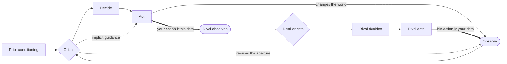

# OODA Loop

> Breaks a contest into the cycle each side runs, observe, orient, decide, act, and treats Orientation, the unstated model that filters what gets seen, as the hinge; the side whose loop closes first acts on a world its rival has not finished understanding. Category: Sensemaking & Complex Systems. Reference: [OODA loop](https://en.wikipedia.org/wiki/OODA_loop). [Open the 3D graph](./index.html) (needs internet for Three.js; on GitHub open via Pages or clone).

## What this graph derived

Given that on TBPN's 2 December 2025 episode the hosts relayed Ben Thompson, Gavin Baker and Eric Seufert on Gemini 3 beating OpenAI's best model on benchmarks, ChatGPT's daily actives down 6% in two weeks, Altman's code-red memo, and Mark Chen saying benchmarks left OpenAI confident, applying the OODA Loop we derived that Google is operating inside OpenAI's decision cycle, that OpenAI grades rivals on benchmark parity so usage moves unseen, that OpenAI's unstated prior treats monetisation as a subscription question, and that Gemini flipped desktop, not mobile; the opportunity that falls out is independent switching and retention telemetry for assistants, a neutral attribution and brand-safety layer for answers, and a subscription-native assistant that owes nothing to a sponsor.

Given a scenario in which an F-86 Sabre meets a MiG-15 over the Yalu in 1951, the MiG better on paper but the Sabre pilot seeing first, declining the climb and reversing on light controls until the two-handed MiG overshoots and is shot from behind, with Sabres killing MiGs at ten to one, applying the OODA Loop we derived that the Sabre pilot reads the fight as transitions rather than envelopes, that each reversal expires the picture the MiG pilot is still working from, and that the MiG pilot's correct answers arrive one move late; what the reader gains is the unstated orientation on each side, above all the envelope-plus-doctrine model that made the climb the obvious choice.

## What it decomposes

John Boyd built this out of Korean air combat, where the F-86 Sabre beat the MiG-15 at roughly ten to one while losing on every performance number. What it takes apart is a contest between two actors over time: both run the same four stages, and the unit of analysis is the pair of cycles, not the cycle. The popular rendering — four boxes in a row, repeat — drops everything Boyd put in: orientation fed by prior conditioning and reaching back to change what is observed, an implicit-guidance path from orientation straight to action with no decision in between, and the whole thing drawn twice, because one loop's action is the other loop's observation.

Orientation is the hinge, and it is the only slot reliably missing from the data — a fact that should govern how the framework is applied to text. What an actor observed and what he did are normally on the record; the model that filtered the observation almost never is, because to the people inside it it is not a belief but the way things are. Deriving it is the whole value of applying OODA to a transcript. Strip the slot out and what remains is a timeline; the framework's contribution is the claim that a specific unstated model made a specific observation produce a specific decision, at a confidence you can argue with.

The second thing it forces is a comparison. One loop is a diagram; two loops running against each other is the framework, and both graphs show it where the actors touch — `ce08` and `ce09` in the classic example, `te09` and `te10` in the TBPN one, the edges where one actor's action is literally the other's observation. Cycle time is the payload, and easy to get wrong. Boyd's claim is not "be fast" but "operate inside the adversary's loop": change the environment faster than he can re-orient, so his decisions, each correct when taken, arrive answering a world that has already moved. Without the framework you get "the better product won"; with it, an asymmetry in units and a named reason the slower side's correct moves stopped working.

## The slots



| Slot | What goes here | Typical provenance | Why that provenance |
|---|---|---|---|
| `actor` | Who is running the loop. At least two, because one loop has nothing to be faster than. | fact | Actors are named on the record; a contest whose sides you have to infer is not a contest you found in the source. Both examples name both sides (`c_sabre`, `c_mig`, `g_actor`, `o_actor`). |
| `observation` | What the actor saw, and the aperture through which he could see it. Outside data plus the consequences of his own earlier actions. | fact | Quotable almost always, because seeing is reportable: a canopy, a benchmark table, a 6% decline. The aperture belongs in this slot because it decides what never arrives at all (`c_s_ap`, `c_m_ap`, `o_obs_bench`). |
| `orientation` | The mental model, prior bet or cultural conditioning that filters the observation and tells the actor what it means. | derived | **The hinge, and the only slot reliably missing from the data.** An orientation is invisible to the people inside it, so it is almost never stated and deriving it is the point of the exercise. When a speaker does state part of it, split the slot the way SPEC section 3 prescribes: `o_or_stated` is a *fact* node here (Mark Chen's after-the-fact admission that they focused too much on reasoning), while `o_or_bench` and `o_or_subs` are the derived halves nobody states. One slot, two provenances. |
| `decision` | What the actor chose: the hypothesis he is about to test. | either | Stated when there is a memo, a reversal or an interview (`o_dec_personalize`, `o_dec_pretrain`, `c_s_dec`); otherwise reconstructed from the action that followed (`g_dec_compute`), which is the one slot whose derived form carries no date. |
| `action` | What the actor did, and the mechanism that let him do it at that speed. | fact | The best-attested slot, because actions are the only part of a rival's loop you can observe directly. They are also the worst guide to his orientation, which is why reading an orientation straight off an action is the characteristic failure here. |
| `feedback` | How the action changed what this actor or his adversary observes next, and at what tempo. | derived | The cross-actor connections are sometimes quoted (`te09`, `te10`, `ce08`, `ce09`), but the *tempo reading* — that one side is operating inside the other's cycle — is always an inference, because it is a claim about the relation between two loops and no participant is positioned to make it (`f_inside_loop`, `c_s_fb`, `c_m_fb`). |

## Example 1: Korea, 1951: the F-86 Sabre against the MiG-15

Boyd's own case, and the cleanest available demonstration that a worse aircraft with a faster loop beats a better aircraft with a slower one.

### Source text

> Over the Yalu in the spring of 1951, an F-86 Sabre and a MiG-15 meet at thirty thousand feet. On paper the MiG is the better fighter: it climbs faster, it accelerates better in a zoom, and its ceiling is several thousand feet above the Sabre's. The Sabre has two things the MiG does not: a full bubble canopy with an unobstructed view, and hydraulically boosted controls that stay light at speed. The MiG pilot sits behind a heavily framed canopy, flies on manual controls that grow heavy as the air loads up, and has been briefed on the ground to fight to a plan. The Sabre pilot sees the MiG first and keeps it in sight through the turn. The MiG pilot picks the Sabre up late, holds it through the first turn, and loses it the moment the Sabre reverses. He knows his aircraft out-climbs the Sabre, so he decides to use the climb to break away upward. The Sabre pilot decides not to match the climb and to force a quick series of reversals instead. He rolls hard one way, and before the MiG has settled into the turn he rolls hard the other way. The MiG pilot hauls his aircraft through the first turn with both hands on the stick and is still in it when the Sabre has already gone the other way. He overshoots, and the Sabre pilot takes the shot from behind him. Across the war Sabres destroyed MiGs at a ratio of roughly ten to one, although the MiG climbed better and flew higher.

After John Boyd's reading of Korean air combat, which became Energy-Maneuverability theory and the briefing *Patterns of Conflict*; the scenario text is written for this example so that the fact nodes have something verbatim to quote.

### Decomposition

Fourteen of the nineteen nodes are facts, none of them paraphrases; `source_ref` is the sentence number above. The three orientation nodes and two of the three feedback nodes are the derived layer.

Actor

- `c_sabre` **F-86 Sabre pilot** [fact] The F-86 Sabre pilot: the actor whose loop the left ring traces, flying the aircraft that is worse on paper. "an F-86 Sabre and a MiG-15 meet at thirty thousand feet" (sentence 1)
- `c_mig` **MiG-15 pilot** [fact] The MiG-15 pilot: the actor with the better aircraft and the slower loop. "an F-86 Sabre and a MiG-15 meet at thirty thousand feet" (sentence 1)

Observation

- `c_s_ap` **Full bubble canopy** [fact] His aperture: a full bubble canopy with an unobstructed view. It decides what can reach him at all, before anything is interpreted. "a full bubble canopy with an unobstructed view" (sentence 3)
- `c_s_see` **Sees the MiG first, keeps it in sight** [fact] He sees the MiG before the MiG sees him, and keeps it in sight through the turn. "The Sabre pilot sees the MiG first and keeps it in sight through the turn" (sentence 5)
- `c_m_ap` **Framed canopy, manual stick, briefing** [fact] His aperture and his script: a heavily framed canopy, manual controls that grow heavy as the air loads up, and a brief given on the ground telling him how the fight should go. "The MiG pilot sits behind a heavily framed canopy, flies on manual controls that grow heavy as the air loads up, and has been briefed on the ground to fight to a plan" (sentence 4)
- `c_m_env` **Knows he out-climbs the Sabre** [fact] What he knows about the envelope: his aircraft out-climbs the Sabre, accelerates better in a zoom and has the higher ceiling. "He knows his aircraft out-climbs the Sabre" (sentence 7)
- `c_m_lose` **Late to see, loses him on reversal** [fact] He picks the Sabre up late, holds it through the first turn, and loses it the moment the Sabre reverses. "The MiG pilot picks the Sabre up late, holds it through the first turn, and loses it the moment the Sabre reverses" (sentence 6)

Orientation — all three derived, none of them stated by anyone in the scenario

- `c_s_or1` **A fight is a series of transitions** [derived 0.75] The Sabre pilot reads the fight as a sequence of transitions from one state to the next, not as a comparison of top speeds and ceilings. Whoever finishes a transition first is fighting an opponent whose picture is already out of date. Rationale: Nothing in the scenario says how either pilot understands the fight. This reading is forced on us by his decision in sentence 8: a pilot who thought the fight was a contest of envelope would have tried to match the climb, and he explicitly declines to. Boyd's fast-transient idea is the name for the alternative. Supported by `c_s_boost`.
- `c_s_or2` **Reversals cost him less than the MiG** [derived 0.70] He also orients on an asymmetry in price rather than in performance: with boosted controls a reversal costs him a light pull, and on the MiG's manual controls the same reversal costs two hands and a beat of delay. Rationale: Sentence 3 gives his hydraulics and sentence 4 gives the MiG's manual controls, but the scenario never puts the two side by side or says that either pilot noticed. The comparison is the inference, and it is what makes a series of reversals a plan rather than a waste of energy. Supported by `c_s_boost`, `c_m_ap`.
- `c_m_or` **The better envelope wins the fight** [derived 0.75] He orients on the performance envelope and on the plan he was given: the aircraft that climbs higher and faster wins, and the fight should be flown the way it was briefed. Rationale: The scenario never states his beliefs. It states the ground brief (sentence 4) and a decision (sentence 7) that answers a performance question rather than a tempo question. An envelope-plus-doctrine orientation is the model that makes that decision the obvious one, and it is also what leaves him nothing to do when the fight stops being about the envelope. Supported by `c_m_ap`, `c_m_env`.

Decision

- `c_s_dec` **Force reversals, not the climb** [fact] He decides not to match the climb and to force a quick series of reversals instead. "The Sabre pilot decides not to match the climb and to force a quick series of reversals instead" (sentence 8)
- `c_m_dec` **Break away upward on the climb** [fact] He decides to use the climb to break away upward. "so he decides to use the climb to break away upward" (sentence 7)

Action

- `c_s_boost` **Hydraulic controls stay light** [fact] The mechanism that sets his tempo: hydraulically boosted controls that stay light at speed, so one more reversal is nearly free. "hydraulically boosted controls that stay light at speed" (sentence 3)
- `c_s_roll` **Rolls one way, then the other** [fact] He rolls hard one way, and before the MiG has settled into the turn he rolls hard the other way. "He rolls hard one way, and before the MiG has settled into the turn he rolls hard the other way" (sentence 9)
- `c_s_shot` **Takes the shot from behind** [fact] The MiG overshoots and the Sabre pilot takes the shot from behind him. "He overshoots, and the Sabre pilot takes the shot from behind him" (sentence 11)
- `c_m_act` **Hauls the first turn with two hands** [fact] He hauls his aircraft through the first turn with both hands on the stick and is still in it when the Sabre has already gone the other way. "The MiG pilot hauls his aircraft through the first turn with both hands on the stick and is still in it when the Sabre has already gone the other way" (sentence 10)

Feedback

- `c_s_fb` **Reversals expire the MiG's picture** [derived 0.80] The loop closes on the adversary rather than on himself: every reversal makes the observation the MiG pilot is still working from false, so the MiG's orientation never gets to finish. Rationale: Sentence 6 states that the MiG pilot loses the Sabre the moment it reverses and sentence 10 that he is still in the first turn when the Sabre has gone the other way. That the reversal is therefore operating on the MiG's observation, not merely on the geometry of the fight, is the framework's reading of those two facts. Supported by `c_m_lose`, `c_ratio`.
- `c_m_fb` **His answers arrive one move late** [derived 0.75] Each of his actions is a correct answer to the situation that existed when he started it. By the time it arrives, the Sabre has moved, so his loop is spent producing answers to a fight that has already gone. Rationale: Read off sentences 9, 10 and 11: the reversal comes before he has settled, he is still in the turn, and he overshoots. That the overshoot is a timing failure of his loop rather than a flying error is the inference, and it is why the better aircraft loses. Supported by `c_m_act`, `c_ratio`.
- `c_ratio` **Roughly ten to one** [fact] The outcome over the war: Sabres destroyed MiGs at a ratio of roughly ten to one, although the MiG climbed better and flew higher. "Across the war Sabres destroyed MiGs at a ratio of roughly ten to one, although the MiG climbed better and flew higher" (sentence 12)

Fact edges. Seven of the thirty-six, each quoting the scenario's own connective; the first two are the cross-actor pair that makes this one graph instead of two.

- `ce08` `c_s_roll` -> `c_m_lose` (feeds back, label "loses sight") [fact] "loses it the moment the Sabre reverses" (sentence 6)
- `ce09` `c_m_act` -> `c_s_shot` (feeds back) [fact] "He overshoots, and the Sabre pilot takes the shot from behind him" (sentence 11)
- `ce16` `c_m_env` -> `c_m_dec` (informs, label "so") [fact] "He knows his aircraft out-climbs the Sabre, so he decides to use the climb to break away upward" (sentence 7)
- `ce22` `c_s_see` -> `c_sabre` (performed by) [fact] "The Sabre pilot sees the MiG first" (sentence 5)
- `ce23` `c_s_dec` -> `c_sabre` (performed by) [fact] "The Sabre pilot decides not to match the climb" (sentence 8)
- `ce26` `c_m_lose` -> `c_mig` (performed by) [fact] "The MiG pilot picks the Sabre up late" (sentence 6)
- `ce27` `c_m_act` -> `c_mig` (performed by) [fact] "The MiG pilot hauls his aircraft through the first turn with both hands on the stick" (sentence 10)

Twenty-nine are derived. Ten carry the Sabre's loop: `ce01` `c_s_ap` -> `c_s_see` (informs, 0.80, the canopy is the unstated reason he sees first), `ce02` `c_s_see` -> `c_s_or1` (informs, 0.75), `ce03` `c_s_see` -> `c_s_or2` (informs, 0.70), `ce04` `c_s_or1` -> `c_s_dec` (shapes, 0.80), `ce05` `c_s_or2` -> `c_s_dec` (shapes, 0.70), `ce06` `c_s_dec` -> `c_s_roll` (executes, 0.85, adjacent sentences with no stated connective), `ce07` `c_s_boost` -> `c_s_roll` (informs, 0.80, the mechanism is never joined to the act), `ce31` `c_s_or1` -> `c_s_roll` (shapes, 0.60) — the implicit-guidance edge, rationale "the second roll comes too fast for a fresh decision, so orientation is driving the hand directly. Contestable, and kept because the framework exists to make the path visible" — plus `ce10` `c_s_roll` -> `c_s_fb` (feeds back, 0.80) and `ce30` `c_s_shot` -> `c_ratio` (feeds back, 0.70, one engagement generalised to the war's ratio). Six carry the MiG's loop: `ce13` `c_m_ap` -> `c_m_lose` (informs, 0.80), `ce14` `c_m_ap` -> `c_m_or` (informs, 0.75, the ground brief as conditioning), `ce15` `c_m_env` -> `c_m_or` (informs, 0.75), `ce17` `c_m_or` -> `c_m_dec` (shapes, 0.75), `ce18` `c_m_dec` -> `c_m_act` (executes, 0.80), `ce19` `c_m_act` -> `c_m_fb` (feeds back, 0.75). Four are attributions the text leaves to pronoun resolution or that follow an inferred node: `ce24` (0.95), `ce28` (0.95), `ce25` and `ce29` (0.90 each, "the orientation is inferred, so its attribution to this actor is inferred with it"). Nine are grounding links: `ce11` `c_s_fb` -> `c_m_lose` (0.80), `ce12` `c_s_fb` -> `c_ratio` (0.70), `ce20` `c_m_fb` -> `c_m_act` (0.75), `ce21` `c_m_fb` -> `c_ratio` (0.70), `ce32` `c_s_or1` -> `c_s_boost` (0.80), `ce33` `c_s_or2` -> `c_s_boost` (0.80), `ce34` `c_s_or2` -> `c_m_ap` (0.75), `ce35` `c_m_or` -> `c_m_ap` (0.80), `ce36` `c_m_or` -> `c_m_env` (0.75).

### What the LLM added and why it helps

Hide the derived layer and the scenario survives almost intact, including — because written prose states its own connectives — the two edges where the fight joins. `ce08` and `ce09` are the load-bearing facts: the scenario does not merely put the roll before the MiG losing sight, it says the roll is why he loses it. That is the adversarial structure available with no inference at all, and the test to apply to a candidate source: no edge where one actor's action is the other's observation, no contest.

What the fact layer cannot give is why either man chose what he chose, and that is the whole derived contribution: `c_s_or1` (0.75), `c_s_or2` (0.70) and `c_m_or` (0.75), each reverse-engineered from a stated decision as the model that makes it the obvious choice rather than a whim. Both orientations are reasonable, which is what makes the example instructive. The MiG pilot's envelope reading is correct about the aircraft — he really does out-climb the Sabre (`c_m_env`), and the scenario's own "so" joins that to his decision (`ce16`). It is an inference about the wrong variable, which leaves him nothing to do once the fight stops being about envelopes. The Sabre pilot's transitions reading wins not because it is cleverer but because it is paired with a mechanism that makes it cheap to act on (`c_s_boost`, grounded at `ce32`).

The second addition is the tempo reading, `c_s_fb` (0.80) and `c_m_fb` (0.75). The text gives an overshoot, which an instructor would call a handling error; `c_m_fb` calls it a timing failure of a loop, because his action is a correct answer to a situation that has expired by the time it arrives. With `c_s_fb` — the reversal's real target is the other man's picture, not the geometry — the two are Boyd's claim, and `ce31` is the mechanism it needs: the second roll is too fast for a fresh decision, so orientation reaches the hand directly. Both are grounded on `c_ratio` (`ce12`, `ce21`), the number they exist to explain.

## Example 2: from the TBPN transcripts: Code red: Gemini 3 lands inside OpenAI's loop

Episode "Code Red, AWS CEO Joins, Tae Kim Tells All (Matt Garman, Tae Kim, Tarek Mansour, Matt Mullenweg, Jason Fried)", 2025-12-02, [transcript](../../../tbpn-transcripts/transcripts/2025-12-02_code-red-aws-ceo-joins-tae-kim-tells-all-matt-garman-tae-kim-tarek-mansour-matt-mullenweg-jason-fried.md); line numbers refer to it. It is the only moment in the corpus where both sides of a rivalry close their loops on each other across two turns: ChatGPT's 2022 launch drives Google's own code red, a decade of TPU work and Gemini 3; Gemini 3 then drives OpenAI's code red, a usage decline, a Slack memo and a public promise. What makes it usable rather than merely topical is that the cycle-time asymmetry is stated in units — a decade of silicon (`g_act_tpu`) against an answer due "now, not at some future date" (`f_respond_now`) — which is what Boyd's framework needs and transcripts almost never give.

### Facts (quoted)

Seventeen of the twenty-three nodes and eleven of the forty-three edges are facts, none of them paraphrases. `source_ref` gives the speaker and the line range; where a host is reading another analyst aloud it names both, because the fact is that this was said on the show, not that the analyst is right.

Actor

- `g_actor` **Google** [fact] Google, the actor running the faster loop in this round: it answered ChatGPT with a model of its own and struck the first blow of this cycle. "So Google strikes back. The first Google blow was Gemini 3" (host reading Ben Thompson, L2188-L2188)
- `o_actor` **OpenAI** [fact] OpenAI, the actor whose loop is now running on the back foot: this, the hosts are told, is why OpenAI is in code red. "He says, this is why OpenAI is in code red" (host reading Gavin Baker, L1632-L1632)

Observation

- `g_obs_chatgpt` **2022: ChatGPT launches, Bard pops** [fact] The previous turn of Google's loop, which is the one that matters here: at the ChatGPT launch in 2022, with Bard popping, Sundar Pichai was reported to have called a code red of his own. He later said he did not use that exact term. "people were claiming that he had used the phrase code red, and he back in 2022 at the chat GPT launch when Bard was popping" (host, L2218-L2220)
- `g_obs_compute` **More compute is the deciding factor** [fact] What Google reads off its own releases: repeatedly, Gemini reaffirms that the most important factor in catching up or moving ahead is more compute. "repeatedly Gemini reaffirms that the most important factor in catching up or moving ahead is more compute" (host reading Ben Thompson, L2228-L2228)
- `g_obs_split` **Desktop switched, mobile did not** [fact] What Google observes after acting: when Gemini 3 launched, people switched to it on desktop but stayed on ChatGPT on mobile. "when Gemini 3 launched, they switched to Gemini 3 on desktop, but they stayed using ChatGBTVT on mobile" (host, L2666-L2670)
- `o_obs_gemini` **Has seen Gemini 3** [fact] OpenAI has seen Gemini 3 and is both moved and not. "It says OpenAI has seen Gemini 3 and is both moved and not" (host reading Ashley Vance, L1186-L1186)
- `o_obs_bench` **On benchmarks, felt quite confident** [fact] How the rival's release looked through OpenAI's own instrument: looking purely at the benchmarks, its research chief says, they actually felt quite confident. "And just looking purely at the benchmarks, you know, we actually felt quite confident" (Mark Chen, L1198-L1198)
- `o_obs_dau` **ChatGPT daily actives down 6%** [fact] The signal the benchmark table does not contain: in the two weeks since Gemini launched, ChatGPT's unique daily active users on a seven-day average are down 6%. Web traffic data, the host notes, to be clear. "in the two weeks since the Gemini launched. ChatGPET unique, daily active users, a 7-day average are down 6%" (host reading Gavin Baker, L1634-L1638)

Orientation — the stated half only; see the Decomposition for the two derived halves

- `o_or_stated` **Focused too much on reasoning** [fact] The half of OpenAI's orientation that is said out loud, after the fact: they focused a little too much on reasoning, and their pre-training muscle wasn't there. "Mark Chen was talking about how they kind of focused a little too much on reasoning and their pre-training muscle wasn't there" (Tae Kim, L4846-L4850)

Decision

- `o_dec_subs` **Monetise only via subscriptions** [fact] The standing decision that the episode calls a dereliction of business duty: no ads product for ChatGPT three years after launch, while the company signs deals for over a trillion dollars of compute. "OpenAI's refusal to launch and iterate on an ads product for chat GPT, now three years old, is a dereliction of business duty" (host reading Eric Seufert, L2972-L2974)
- `o_dec_personalize` **Memo: personalise ChatGPT** [fact] The first answer, inside the company: in an internal Slack memo Altman directed more employees to focus on improving features of ChatGPT, such as personalizing the chat bot for more than 800 million people. "he was directing more employees to focus on improving features of ChatGPT, such as personalizing the chat bot for more than 800 million people" (host, L1288-L1292)
- `o_dec_pretrain` **Go back to pre-training** [fact] The second answer, and a reversal of the bet it had been running: now they have to go back to pre-training. "And now they're like, okay, we have to go back to pre-training" (Tae Kim, L4866-L4866)

Action

- `g_act_tpu` **Started TPUs a decade ago** [fact] The enabling action was taken ten years before the release it enabled: Google started its work on TPUs a decade ago, which is why the host's advice to everyone else is to stick with Nvidia. "so Google started its work on TPUs a decade ago" (host reading Ben Thompson, L2228-L2228)
- `g_act_gemini` **Shipped Gemini 3** [fact] Google shipped Gemini 3, which scored better than OpenAI's state-of-the-art model on a host of benchmarks, even if real-world usage was a bit more uneven. "The first Google blow was Gemini 3, which scored better than OpenAI's state-of-the-art model on a host of benchmarks" (host reading Ben Thompson, L2188-L2190)
- `g_act_ads` **Monetised search in under two years** [fact] The precedent behind Google's monetisation reflex: it started monetizing search less than two years after its public launch, and that revenue has underwritten everything since. "That Google started monetizing search less than two years after its public launch" (host reading Eric Seufert, L2964-L2964)
- `o_act_chen` **Chen: models at that level, soon** [fact] The action taken in public while the internal answer is still being built: OpenAI has models internally that perform at the level of Gemini 3 and is pretty confident it will release them soon, with better successors after. "we have models internally that perform at the level of Gemini 3, and we're pretty confident that we will release them soon" (Mark Chen, L1200-L1200)

Feedback

- `f_respond_now` **Everyone must respond now** [fact] One release reset the clock for everybody: everyone needs to respond to Gemini, and they need to respond now, not at some future date when their chips are good enough. "everyone needs to respond to Gemini, and they need to respond now, not at some future date when their chips are good enough" (host reading Ben Thompson, L2216-L2216)

Fact edges. Eleven. Read the first four first: all leave `g_act_gemini`, which is what an action looks like when it is simultaneously the rival's observation.

- `te08` `g_act_gemini` -> `g_obs_split` (feeds back, label "desktop only") [fact] "when Gemini 3 launched, they switched to Gemini 3 on desktop, but they stayed using ChatGBTVT on mobile" (host, L2666-L2670)
- `te09` `g_act_gemini` -> `o_obs_gemini` (feeds back) [fact] "It says OpenAI has seen Gemini 3 and is both moved and not" (host reading Ashley Vance, L1186-L1186)
- `te10` `g_act_gemini` -> `o_obs_dau` (feeds back, label "2 weeks, -6%") [fact] "in the two weeks since the Gemini launched. ChatGPET unique, daily active users, a 7-day average are down 6%" (host reading Gavin Baker, L1634-L1638)
- `te11` `g_act_gemini` -> `f_respond_now` (feeds back, label "respond now") [fact] "everyone needs to respond to Gemini, and they need to respond now, not at some future date when their chips are good enough" (host reading Ben Thompson, L2216-L2216)
- `te19` `o_obs_gemini` -> `o_dec_pretrain` (informs, label "because") [fact] "So Open AI knows that pre-training still works because Gemini 3 had great pre-training results and Cloud Opus 4.5 did" (Tae Kim, L4868-L4870)
- `te33` `g_act_gemini` -> `g_actor` (performed by) [fact] "So Google strikes back. The first Google blow was Gemini 3" (host reading Ben Thompson, L2188-L2188)
- `te34` `g_act_tpu` -> `g_actor` (performed by) [fact] "so Google started its work on TPUs a decade ago" (host reading Ben Thompson, L2228-L2228)
- `te35` `g_act_ads` -> `g_actor` (performed by) [fact] "That Google started monetizing search less than two years after its public launch" (host reading Eric Seufert, L2964-L2964)
- `te38` `o_obs_dau` -> `o_actor` (performed by) [fact] "this is why OpenAI is in code red in the two weeks since the Gemini launched" (host reading Gavin Baker, L1632-L1634)
- `te39` `o_obs_gemini` -> `o_actor` (performed by) [fact] "It says OpenAI has seen Gemini 3 and is both moved and not" (host reading Ashley Vance, L1186-L1186)
- `te40` `o_dec_subs` -> `o_actor` (performed by) [fact] "OpenAI's refusal to launch and iterate on an ads product for chat GPT, now three years old" (host reading Eric Seufert, L2972-L2974)

### Decomposition

Six derived nodes and thirty-two derived edges. Fact nodes are referenced by id from the list above.

Orientation — three of the six derived nodes, and the slot the framework exists for. `g_orient`, `o_or_bench` and `o_or_subs` all carry an `idea` field, quoted under "Where the opportunity shows up".

- `g_orient` **A model is a feature of an ads machine** [derived 0.70] Google orients on a stack it owns end to end: its own silicon, its own distribution and a search franchise that has been monetised since the beginning. On that model a frontier model is a feature of a business that already prints money, so being second for a while costs it very little. Rationale: Nobody in the episode states Google's model of the contest. It is read off three facts that are stated: a decade of in-house silicon, search monetised inside two years, and the claim that compute decides the race. Those three only add up to a strategy if the model is a feature of the distribution-and-revenue machine rather than the product being sold. Supported by `g_act_tpu`, `g_act_ads`.
- `o_or_bench` **Benchmark parity means no threat** [derived 0.70] The filter on OpenAI's observation: a rival release is assessed as a benchmark comparison, so a model it can match on benchmarks reads as not a threat, even while the usage numbers move against it. Rationale: Nobody states the filter, and the research chief's own words are evidence of it rather than a statement of it: purely on benchmarks they felt quite confident, while the hosts are reading a 6% decline in daily actives off the same two weeks. The orientation is the thing that makes those two facts compatible inside one company. Supported by `o_obs_dau` (and fed by the stated half, `o_or_stated`, through `te14`).
- `o_or_subs` **The business is a subscription** [derived 0.60] OpenAI's second unstated prior: monetisation is a subscription question. Attention that arrives without a subscription is therefore not revenue, which is how three years pass with no ads product and a degraded experience for most users. Rationale: Inferred from a stated absence and a stated comparison: an insistence on monetizing solely via subscriptions, no ads product three years in, set against Google monetising search inside two years. A prior is the cheapest explanation of an absence that persists while a rival's opposite choice is visible and working; contestable because the episode gives the critique, not the belief. Supported by `o_dec_subs`, `g_act_ads`.

Decision

- `g_dec_compute` **Compete on total compute** [derived 0.80] Google's choice: make the axis of competition sheer size and the total compute behind a model, on silicon it owns, rather than a cleverer training trick. Rationale: Not stated as a decision, but it is the only hypothesis that both the decade of TPU work and Gemini 3's stated advantage, its sheer size and the vast amount of compute that went into it, are instances of. The decision is reconstructed backwards from two actions a decade apart. Supported through its `executes` edges to `g_act_tpu` and `g_act_gemini`.

Feedback

- `f_inside_loop` **Google is inside OpenAI's loop** [derived 0.75] The asymmetry that makes this a tempo story and not a model comparison: Google's answer to what it saw in 2022 was a decade of silicon, and OpenAI's answer to what it saw in 2025 is due now. The side whose enabling work is already finished sets the clock the other side has to keep. Rationale: Built from three stated facts: the TPU programme is a decade old, everyone must respond to Gemini now rather than later, and OpenAI's answers arrive inside weeks as a memo, a public promise and a reversal back to pre-training. That this is one side operating inside the other's decision cycle, rather than simply shipping a better model, is Boyd's reading of the pattern and not a claim anyone in the episode makes. Supported by `f_respond_now`, `g_act_tpu`, `o_dec_pretrain`.
- `f_mobile` **The mobile surface did not flip** [derived 0.60] The blow landed on one surface only. The desktop habit moved and the mobile habit did not, so the release that reset everyone's clock left the incumbent's most defensible ground untouched. Rationale: The split itself is stated; reading it as the limit of the action's effect, rather than as a lag that will close on its own, is the inference. It is the feedback Google's own loop has to absorb next, and the reason a 6% dip is not a rout. Supported by `g_obs_split`.

Derived edges. Seven carry Google's loop: `te01` `g_obs_chatgpt` -> `g_orient` (informs, 0.70, "that it hardened into a model of the contest rather than a one-off scramble is inferred"), `te02` `g_obs_compute` -> `g_orient` (informs, 0.75, the compute claim is an analyst's reading, not Google's stated belief), `te03` `g_obs_compute` -> `g_dec_compute` (informs, 0.85, close to forced), `te04` `g_orient` -> `g_dec_compute` (shapes, 0.75, both ends inferred), `te05` `g_dec_compute` -> `g_act_tpu` (executes, 0.70, "runs backwards in time, as reconstructed decisions do"), `te06` `g_dec_compute` -> `g_act_gemini` (executes, 0.80), `te07` `g_act_tpu` -> `g_act_gemini` (informs, 0.80, label "a decade earlier", the silicon is what let the release be the biggest rather than the cleverest).

Eight carry OpenAI's: `te12` `o_obs_gemini` -> `o_obs_bench` (informs, 0.80, the step from seeing to measuring), `te13` `o_obs_bench` -> `o_or_bench` (informs, 0.80, "that it comes from treating the benchmark table as the test of threat is the inference the orientation slot exists for"), `te14` `o_or_stated` -> `o_or_bench` (informs, 0.65) — the edge that joins the stated half of the orientation to the unstated half, "a lab that knows it over-indexed on reasoning is a lab whose scoreboard was the reasoning benchmarks" — `te15` `o_obs_dau` -> `o_dec_personalize` (informs, 0.75, the decline and the memo are adjacent in the segment but no speaker joins them), `te16` `o_or_bench` -> `o_act_chen` (shapes, 0.80), the implicit-guidance edge: "the public answer is a benchmark answer, made before any new model exists, which is an orientation reaching the action with no decision in between"; `te17` `o_or_bench` -> `o_dec_pretrain` (shapes, 0.65, contestable: the reversal is the filter finally breaking), `te18` `o_or_subs` -> `o_dec_subs` (shapes, 0.70), `te20` `o_dec_personalize` -> `o_act_chen` (executes, 0.55, explicitly speculative and kept because the action slot needs filling on this side).

Three are the tempo readings: `te21` `o_act_chen` -> `f_inside_loop` (feeds back, 0.65, "an answer that is a promise of a future release is the clearest symptom of a loop running behind another's"), `te22` `g_act_gemini` -> `f_inside_loop` (feeds back, 0.75), `te23` `g_obs_split` -> `f_mobile` (feeds back, 0.75). Five are attributions that follow an inferred node or a pronoun: `te36` `g_orient` -> `g_actor` (0.85), `te37` `g_dec_compute` -> `g_actor` (0.90), `te41` `o_or_bench` -> `o_actor` (0.85), `te42` `o_act_chen` -> `o_actor` (0.90), `te43` `o_dec_personalize` -> `o_actor` (0.90).

Nine are grounding links: `te24` `f_mobile` -> `g_obs_split` (0.85), `te25` `f_inside_loop` -> `f_respond_now` (0.80), `te26` `f_inside_loop` -> `g_act_tpu` (0.80, "the enabling move was finished before the contest began"), `te27` `f_inside_loop` -> `o_dec_pretrain` (0.70), `te28` `g_orient` -> `g_act_tpu` (0.80), `te29` `g_orient` -> `g_act_ads` (0.75), `te30` `o_or_bench` -> `o_obs_dau` (0.70, "the 6% decline is the fact the benchmark filter failed to register, and so the evidence that the filter exists"), `te31` `o_or_subs` -> `o_dec_subs` (0.80), `te32` `o_or_subs` -> `g_act_ads` (0.65, the cross-actor contrast that makes a three-year absence a prior rather than a schedule).

### What the LLM added

Eleven fact edges out of forty-three is unusually many for a transcript, and four of them leave one node, `g_act_gemini`, because a release is an event whose effects several people describe: the desktop-only switch (`te08`), OpenAI seeing it (`te09`), the 6% decline (`te10`), the claim that everyone must now respond (`te11`). A loop framework gets its connectives free when the source is commentary on a public event, because commentary is mostly about what an action caused. The orientation slot gets nothing.

Hide the derived layer and what remains is coherent: two companies, six observations, four actions, three stated decisions, one stated half-orientation, and the cross-actor edges that make it a contest. What it does not contain is a single reason. `g_orient` (0.70), `o_or_bench` (0.70) and `o_or_subs` (0.60) are the reasons, and the provenance split inside the slot repays a close look. `o_or_stated` is a *fact* in the orientation slot — Chen's own after-the-fact admission that they focused too much on reasoning and the pre-training muscle wasn't there — and `te14` (0.65) joins it to the derived half: SPEC section 3 working as intended, a partly stated slot split rather than blurred, with a confidence on the join. The admission is also narrower than the inference. It is about a research priority; `o_or_bench` is about an *instrument*, what the company measures a rival with, which is what let confidence and a 6% decline coexist in one building for two weeks. `te30` grounds it on the decline, not on the quote, which keeps it from restating the admission.

The second addition is the one the framework is for. `f_inside_loop` (0.75) takes three stated facts — a decade of TPU work (`g_act_tpu`), "respond now, not at some future date" (`f_respond_now`), a reversal back to pre-training inside weeks (`o_dec_pretrain`) — and says they are one thing: Google's answer to what it saw in 2022 took a decade, OpenAI's answer to what it saw in 2025 is due now. That is cycle time as a fact about the contest rather than a slogan about speed, and checkable because both terms are in units; where a transcript gives only one, the node should not be written. Two weak points deserve naming. `te20` (0.55) is the thinnest edge here, the memo executed as Chen's promise. `f_mobile` (0.60) is the counterweight — the blow landed on desktop only — and since a framework about tempo invites triumphalism, it is where the graph argues with its own headline.

### Where the opportunity shows up

The idea-bearing slot is `orientation` (`idea_bearing_slot: "orientation"`), and the reading is specific enough to be a method. An orientation is a filter, defined as much by what it excludes as by what it admits, so a blind spot in one actor's orientation is an opening a third party can build against: what the model cannot register stays unmeasured, unpriced and unbuilt-for, and because orientations are invisible from inside, it persists while the consequences are visible to everyone else. All three derived orientation nodes carry an `idea` field, and the three ideas are distinct: one is read from the winner's constraint, one from the loser's missing instrument, one from the loser's monetisation gap.

- `g_orient` **A model is a feature of an ads machine**, derived, confidence 0.70. Idea: "If the model is a feature of an ads machine, every answer Google's assistant gives must eventually be reconciled with the search franchise that pays for it, so the wedge is a subscription-native assistant whose answers carry no obligation to a sponsor: the incumbent's own orientation is the constraint a challenger sells against." Read from the node: this is the rare case where the idea comes from the *winner's* orientation — the model that makes Google patient is the same model that ties its assistant to the search business, and a challenger can sell against that tie.
- `o_or_bench` **Benchmark parity means no threat**, derived, confidence 0.70. Idea: "A lab that grades rivals on benchmarks has no instrument for the thing that actually moved, per-surface habit and retention, so the underserved product is independent switching and retention telemetry for assistants, the usage scoreboard that the labs' own eval culture will not build." Read from the node: the missing instrument is the opportunity, and the episode demonstrates the gap rather than asserting it — the hosts had to reach for third-party web traffic data to see a 6% decline (`o_obs_dau`), and the 6% was itself the boundary of what that data could tell them.
- `o_or_subs` **The business is a subscription**, derived, confidence 0.60. Idea: "Assistant attention is being created far faster than it is being monetised, and the holder of it refuses the obvious instrument: the opening is the neutral demand and measurement layer, attribution and brand safety for answers, which an ads-averse lab will not build and an incumbent will keep for itself." Read from the node: the opening is bounded on both sides, which is what makes it a market rather than a gap — one party will not build it and the other will not share it.

The confidences behave as the bands require: the two at 0.70 rest on a stated fact the orientation failed to register (`te30`) or on facts that cohere only under that model (`te28`, `te29`), and `o_or_subs` sits at 0.60 because an absence has more than one explanation.

## Building a knowledge graph with this framework

### Node and edge types

Node types are the six slots. One application is **two** connected loops, not one: each loop node attaches to its actor by `performed_by`, and the graph is a single component only because of the cross-actor edges. Both examples use the `ring` layout, one captioned ring per actor, with the shared feedback nodes between the rings — `f_inside_loop` and `c_ratio` are properties of the contest, not of either side.

Edge types are the five relations plus the reserved grounding link. `informs` runs observation to orientation, observation straight to decision where there is no deliberation to model (`ce16`, `te03`, `te19`), aperture to observation (`ce01`), and the join between the stated and unstated halves of one orientation (`te14`). `shapes` runs orientation to decision and — the part most extractions omit — orientation directly to action, Boyd's implicit guidance, where the tempo is too high for a fresh decision (`ce31` at 0.60, `te16` at 0.80). `executes` runs decision to action. `feeds_back` runs from an action to whatever is observed next and carries the adversarial content: inside one loop (`te08`, `ce10`), across to the rival's observation (`ce08`, `ce09`, `te09`, `te10`), into a shared feedback node (`te11`, `te22`, `ce30`). `performed_by` runs from a loop node to its actor, a fact whenever the speaker names the company or the pilot. `supported_by` runs from any derived node to its facts, always derived; on an orientation node it is the audit trail you check when you suspect it was read off the action it explains.

Facts carry `source_quote` and `source_ref`, derived nodes `confidence` and `rationale`, and `entities` uses the spellings in `tbpn-transcripts/extractions/`.

### Fact or derived: rules of thumb

Two rules of thumb are specific to OODA and should be settled first.

**A reconstructed decision has no date.** `te05` runs `g_dec_compute` -> `g_act_tpu`, so the decision node points backwards in time at an action taken a decade earlier. That looks wrong and is correct: the episode never dates the decision, so all the graph can say is which actions it explains, and the earliest is the TPU programme. A derived decision is dated only by a range, no later than the earliest action it explains, and inventing a date to make the arrow point forward would fabricate a fact. Keep the edge, lower the confidence (0.70 against `te06`'s 0.80), and say in the rationale that it runs backwards.

**Spend the inference budget on orientation.** Observations, actions and actors are normally quotable, decisions often are, cross-actor feedback edges sometimes are; orientation almost never is. A graph whose derived nodes spread evenly over the six slots has usually invented observations it could have quoted.

- `actor`: extracted, always. Two or more, each with at least one action in the source — an actor you only infer is a party you made up. Empty on one side: not an OODA moment; use a single-actor cycle framework.
- `observation`: extracted. Include the *aperture* as its own node (`c_s_ap`, `o_obs_bench`): the instrument an actor looks through decides what never reaches him, and is usually stated even when nothing else about his thinking is. Inferred only when an action makes it unavoidable, 0.60 to 0.75. Empty: you have a rumour about a decision, not a loop.
- `orientation`: derived as a rule, and the slot the framework exists for. Write it as a standing model — "this actor reads the situation as X" — not a restatement of the decision, and support it with a fact that is *not* the action it explains (`te30`, `ce32`). When part of it is stated, split: fact node for the stated part, derived node for the rest, joined by `informs` (`te14` at 0.65). 0.70 to 0.80 when a stated decision is hard to explain otherwise, 0.55 to 0.65 when inferred from an absence (`o_or_subs`). Never empty: a graph with no orientation node is a timeline.
- `decision`: either. Extracted from a memo, a reversal or a stated choice (`o_dec_pretrain`, `c_s_dec`); reconstructed otherwise as the one hypothesis several actions are instances of (`g_dec_compute`, 0.80), with the date rule above. Unreconstructable: run orientation straight to action with `shapes` — implicit guidance, not a gap.
- `action`: extracted, always; an action you cannot quote is the most damaging invention here, because every tempo claim is measured off the actions. Include the *mechanism* that set the speed (`c_s_boost`, `g_act_tpu`) and the *precedent* that set the reflex (`g_act_ads`). Empty for an actor: drop that actor rather than inferring what he did.
- `feedback`: derived, mostly. The cross-actor link can be a fact when a speaker states it (`ce08`, `te10`), and when it is, that edge is the most valuable thing in the source. The tempo reading on top is always derived (`f_inside_loop`, `c_m_fb`): a claim about two loops at once, which no participant is positioned to make. Write it only when both terms of the asymmetry are on the record in units. Empty: the graph is still valid; the cycles have not visibly touched yet.

### Extraction recipe

```text
Decompose ONE contest between TWO actors from <file>, lines <a>-<b>,
with Boyd's OODA loop. Two loops, not one.

0. actor: name both sides, verbatim (fact). Each must have at least one
   quotable action in this span. If only one side acts here, STOP and say
   this span is not an OODA moment.

FOR EACH ACTOR, in this order:
1. observation: what he saw, as verbatim spans of 5+ words (fact). Include
   the APERTURE - the instrument, canopy, dashboard or scoreboard through
   which he looks - as its own observation node; it decides what never
   arrives. Include observations that are consequences of his own prior
   actions.
2. orientation: the standing model that made those observations mean what
   they meant. ALWAYS DERIVED unless a speaker states it, in which case
   SPLIT: a fact node for the stated part, a derived node for the rest,
   joined by `informs`. Form: "this actor reads the contest as X".
   Must be supported by at least one fact that is NOT the action it
   explains. Not a restatement of the decision. Put the business reading
   in the node's `idea` field, never in the rationale.
3. decision: the hypothesis he chose to test. Fact if stated; else the one
   hypothesis several actions are instances of (derived, 0.70-0.85). A
   reconstructed decision has NO date: its `executes` edge may point at an
   action taken years earlier - keep it and say so in the rationale.
4. action: what he did, verbatim (fact). Add the MECHANISM that set his
   tempo and the PRECEDENT that set his reflex as action nodes; they are
   what make a cycle-time claim checkable.
5. Edges inside the loop: informs (observation -> orientation, or
   observation -> decision where there was no deliberation), shapes
   (orientation -> decision, AND orientation -> action where the tempo
   left no room for a decision: Boyd's implicit guidance - write at least
   one of these or say why there is none), executes (decision -> action),
   performed_by (every loop node -> its actor).

THEN, ACROSS THE TWO LOOPS:
6. feeds_back from each action to what is observed next: to this actor's
   own later observation AND to the rival's observation. A cross-actor
   feeds_back edge is `fact` when one turn states the connection, quoted.
   If you cannot find at least one cross-actor link, fact or derived, you
   have two timelines, not a contest.
7. feedback nodes: the tempo reading. Write one only if BOTH terms of the
   asymmetry are on the record in units (e.g. "a decade" against "now").
   Derived, 0.65-0.80. Add a counterweight node for where the action did
   NOT land (surface, segment, geography) if the source gives one.
8. supported_by from every derived node to its facts, always derived.

Output one graph.json example: nodes [{id, slot, label <=40 chars, text,
provenance, source_quote+source_ref | confidence+rationale, idea?,
entities}], edges [{id, from, to, relation, provenance, confidence?,
source_quote?, source_ref?, label?, rationale?}],
idea_bearing_slot "orientation".
```

Afterwards run `node _meta/validate.mjs <dir>` for quotes, the paraphrase cap and derived-to-fact connectivity, then five checks it cannot make. Every actor has an action and every loop node a `performed_by` edge. At least one `feeds_back` edge crosses between the actors. Every orientation node has a `supported_by` edge to a fact other than the action it explains. Every backwards-running `executes` edge says so in its rationale. And every tempo claim cites two units: an elapsed time on one side, a deadline on the other.

### Failure modes

- **The four-box conveyor.** OODA flattened into a process diagram, the version indistinguishable from PDCA. Guard: require the shape Boyd drew — at least one `shapes` edge from orientation straight to action (`ce31`, `te16`), and orientation supported by prior conditioning (`ce14`, `te01`), not only by the current observation.
- **One loop.** A single actor's cycle is extracted and the rival appears as scenery; the result is a timeline with extra vocabulary. Guard: two `actor` nodes, each with a quotable action, and at least one cross-actor `feeds_back` edge.
- **Orientation read off the action.** "He rolled twice, therefore he believed in rolling twice" is circular and unfalsifiable, and it is the characteristic failure here, because actions are the best-attested slot. Guard: the orientation must predict something beyond the action it was read from, and have a `supported_by` edge to a different fact (`te30` points at the 6% decline, not at Chen's quote).
- **Orientation smuggled in as a fact.** An inference about what a company believes gets a quote that does not state it, usually by paraphrasing a critic into the company's voice. Guard: a verbatim quote makes it a fact node in the slot, like `o_or_stated`, and the inferred remainder a separate derived node.
- **Speed mistaken for tempo.** "Google moved faster" becomes a feedback node and the framework has contributed nothing, since the faster side is obvious from the outcome. Guard: both terms in units. `f_inside_loop` is writable only because `g_act_tpu` gives a decade and `f_respond_now` gives "now, not at some future date".
- **A decision invented to fill the slot.** Every actor gets one because the framework has four boxes, and the weakest gets the confidence of the strongest. Guard: a decision is quoted, or reconstructed with an `executes` edge to a stated action, and the confidence records which (`te20`, 0.55).
- **Moralising the loser.** The slower actor's orientation written as stupidity makes the graph useless for finding openings: a belief nobody sensible would hold is not one anybody is acting on. Guard: the rationale must say what made the model reasonable and what it failed to register — which is also where the ideas come from.
- **The idea written into the rationale.** Guard: the rationale says only why the inference follows from the quoted facts; the business reading goes in `idea`, and only in the orientation slot.

## Related frameworks

- [PDCA / Deming Cycle](../pdca-deming/README.md): the cooperative, single-actor cousin. Both are cycles with a learning step, but PDCA improves a process you own and its clock is set by how fast you can measure; OODA is adversarial — two actors, tempo against each other, the clock set by the rival. Prefer PDCA when the obstacle is your own process, OODA when someone is on the other side of the board.
- [Cynefin Framework](../cynefin/README.md): use it to establish that you are in the complex or chaotic domain where acting to learn is correct, then OODA to run the contest inside it.
- [Systems Thinking](../systems-thinking/README.md): the other framework here built on feedback. Prefer it when the dynamics would persist with no opponent, OODA when the delay matters because somebody is exploiting it.
- [Inversion / Pre-mortem](../../03-engineering-and-cognitive/inversion-premortem/README.md): the natural follow-on. Once the rival's orientation is written down, a pre-mortem asks what it predicts he will do to you — and your own orientation is the first thing to invert.

[Library root](../../README.md).
