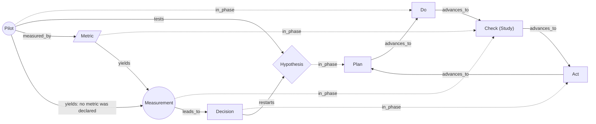

# PDCA / Deming Cycle

> Turns a change into an experiment: a prediction written before the work, a trial small enough to be wrong in, a comparison against the prediction, and a decision to standardise or turn the cycle again. Category: Sensemaking & Complex Systems. Reference: [PDCA](https://en.wikipedia.org/wiki/PDCA). [Open the 3D graph](./index.html) (needs internet for Three.js; on GitHub open via Pages or clone).

## What it decomposes

PDCA takes apart a change. Not a problem, not an argument, not a system: one deliberate alteration to a process or a product, and the question of whether anybody learned anything from making it. It splits that change into four things which are easy to confuse when they arrive as one story — what was expected to happen and why, what was actually run and on whom, what the result was read against, and what was decided as a result. Each is separately checkable, and the framework's value is that it makes the missing one visible.

Three things get forced into the open: a prediction stated before the work and specific enough to be wrong, not "this should help" but a magnitude and a mechanism; a boundary on the trial — one line, one shift, five days, one team — so that a bad outcome costs little and a good one can be attributed to the change rather than to everything else that happened that month; and a measure agreed in advance, because a measure chosen after the result is a measure chosen to fit it. The Act phase then has three honest exits: standardise exactly as far as the trial reached, adjust and turn the cycle again, or abandon. Without the cycle a change is simply a thing that happened, narrated afterwards by whichever number looked best, and the organisation accumulates activity instead of knowledge.

The history is an argument about the third step. Walter Shewhart published a three-step cycle in 1939 — specification, production, inspection — and insisted it be drawn as a circle rather than a line, since each pass revises the specification. Deming taught a four-step version in Japan from 1950, splitting Shewhart's inspection into a comparison and a decision, which is the form that became Plan-Do-Check-Act. Late in life Deming pressed for Study in place of Check, and his reason is useful to anyone extracting this framework from text: "check" invites the reading *did we do the work?*, which is inspection, whereas the step the cycle needs is *what did we predict, and what happened instead?* The phase node here is labelled "Check (Study)" for that reason, and PDCA's commonest misuse — a project-status ritual where Check reports completion — is the misuse Deming was trying to rename his way out of.

That argument becomes this framework's provenance thesis. People narrate what they did and what happened, so the pilot, the measurement and usually the decision are stated outright and are facts. What they almost never state is what the pilot was supposed to prove. The hypothesis has to be derived, and doing so is this framework's sharpest contribution, because a pilot with no recoverable hypothesis is not an experiment — it is just work that happened, and no result it produced is evidence of anything. The companion finding is that the Check phase is usually thin: a source reports that something launched and what number followed, and leaves out what the number was supposed to beat. Both are visible in the TBPN example below, where both hypothesis nodes are inferences and the pivot decision is quoted verbatim.

## The slots



| Slot | What goes here | Typical provenance | Why that provenance |
|---|---|---|---|
| Phase | Plan, Do, Check and Act: the four positions of the cycle itself. | schema | Scaffolding that exists before any source is read. No quote, no confidence, no rationale; drawn as neutral grey markers; still visible when derived items are hidden; excluded from the fact/derived counts. The source decides which phase fills and which stays thin, never whether the phase exists. |
| Hypothesis | What is expected to happen and why. | either | A fact in a disciplined cycle, where the prediction is written down before the trial. Almost never stated in the wild, which makes this the slot an LLM most often has to derive — and the slot whose absence means the thing was not an experiment. |
| Pilot | The contained trial actually run: which change, on which population, for how long. | fact | Normally extracted, because people narrate what they did. A pilot nobody described is an invented fact. |
| Metric | What the trial was read against. | fact | A fact when it was agreed before the trial or deliberately taken; derived when numbers are reported and no measure was ever declared. |
| Measurement | The observed value or outcome, including a refusal or a verdict from the pilot's users. | fact | Usually stated, and often the only part of the cycle that is. |
| Decision | Standardise, adjust and run again, or abandon. | either | The stated decision is a fact; the rule it standardises and the decision the measurement implies but nobody took are derived, and that is where the opportunity sits. |

The `phase` slot is the library's structural exception (`structural: true`, `provenance: "schema"`), and it does real work rather than decoration. Every content node carries an `in_phase` edge to its phase and the four markers carry `advances_to` edges to each other, so the loop is drawn by the schema layer and survives the facts-only view intact: hide the derived layer and you still see four phases, and you can see which of them is empty. The phases are not a timeline of the narration, either. Deming's Plan phase includes studying the current process, so a baseline measurement belongs in Plan even though it is a measurement, and a reconstructed prediction belongs in Plan even though it was reconstructed long afterwards.

One further design decision concerns the Check phase, and it is deliberate rather than an oversight. Where a speaker jumps straight from the trial to a number with no measure in between, the graph carries a `yields` edge **from the pilot to the measurement**, marked `fact` and quoted (`te_y1f`, `te_y3f` in the TBPN example), alongside the derived chain pilot → metric → measurement. Hide the derived layer and the metric nodes vanish while the numbers remain, wired directly to the trial that produced them: a Check phase holding values with nothing to read them against. An empty or one-node Check phase in the facts-only view is not a defect in the extraction. It is a true statement about the source.

## Example 1: Packing line seal failures: one pilot on one shift

A synthetic scenario in the genre Deming taught from 1950 and Shewhart's 1939 cycle before it: a predicted effect, a small-scale trial, a comparison against the prediction, and a standard rewritten only for what was tested.

### Source text

> Improvement note, packing department, week 14.
>
> Twelve per cent of the biscuit cartons coming off Line 2 fail the seal test, and the department has been re-sealing them by hand for a year.
>
> The engineer's reading of the data is that the sealing jaws run too cool when the line is fast, so she expects that raising the jaw temperature by fifteen degrees will cut seal failures to under three per cent without scorching the film.
>
> Rather than change all six lines, the team ran the higher temperature on Line 2 only, on the night shift, for five production days, and logged every carton.
>
> The night shift runs Line 2 slower than the day shift does.
>
> The two measures agreed before the trial were the seal failure rate per thousand cartons and the number of cartons rejected for scorched film.
>
> Over the five days the seal failure rate fell from twelve per cent to two point one per cent, and four cartons in ten thousand were rejected for scorching, against a baseline of one in ten thousand.
>
> The team wrote the new temperature into the standard work instruction for Line 2 and scheduled the same five-day trial on Line 5, where the film is thinner and scorches more easily.

### Decomposition

Seventeen nodes: ten facts, three inferences, four schema markers. Thirty-two edges: five facts, ten inferences, seventeen schema. No paraphrases.

Phase (schema: the same four markers appear in both examples, with no quote and no confidence, and are excluded from the counts)

- `ph_plan` **Plan** [schema] Plan: state what is expected to happen and why, and decide in advance what would count as evidence.
- `ph_do` **Do** [schema] Do: run the change on a small scale, contained so that a bad result costs little and a good result can be traced to the change.
- `ph_check` **Check (Study)** [schema] Check, which Deming later renamed Study: compare what happened with what was predicted, using the measures agreed beforehand.
- `ph_act` **Act** [schema] Act: standardise the change, adjust it and run the cycle again, or abandon it - and then turn the cycle.

Hypothesis

- `c_hyp` **+15 degrees cuts failures under 3%** [fact] The engineer expects that raising the jaw temperature by fifteen degrees will cut seal failures to under three per cent without scorching the film, because the jaws run too cool when the line is fast. "so she expects that raising the jaw temperature by fifteen degrees will cut seal failures to under three per cent without scorching the film" (sentence 3)
- `c_dassume` **Assumed: it holds on the day shift** [derived 0.68] The trial ran on the night shift, which runs Line 2 slower than the day shift does. That the same setting works at day-shift speed is assumed by the standardisation, not tested by it. Rationale: The stated mechanism is that the jaws run too cool when the line is fast; the trial ran only on the slower shift, so the faster condition the mechanism names was never the one measured. The inference is a gap in the cycle, not a claim about the result. Supported by `c_slow`, `c_dec1`.
- `c_dhyp5` **Line 5 hypothesis: thinner film** [derived 0.74] The next turn of the cycle tests whether the same fifteen degrees holds where the film is thinner, which the memo says scorches more easily. That prediction is not written down; scheduling the trial implies it. Rationale: A trial is scheduled on Line 5 and the memo gives the reason the line differs (thinner film, scorches more easily). The hypothesis under test follows from the pairing, but nobody states it as an expectation. Supported by `c_dec2`.

Pilot

- `c_pilot` **Line 2, night shift, five days** [fact] Rather than change all six lines, the team ran the higher temperature on Line 2 only, on the night shift, for five production days, logging every carton. "Rather than change all six lines, the team ran the higher temperature on Line 2 only, on the night shift, for five production days, and logged every carton." (sentence 4)
- `c_slow` **Night shift runs Line 2 slower** [fact] The night shift runs Line 2 slower than the day shift does, so the pilot is contained in speed as well as in line, shift and duration. "The night shift runs Line 2 slower than the day shift does." (sentence 5)

Metric

- `c_met1` **Seal failure rate per 1,000** [fact] The seal failure rate per thousand cartons, one of the two measures agreed before the trial began. "The two measures agreed before the trial were the seal failure rate per thousand cartons" (sentence 6)
- `c_met2` **Cartons rejected for scorching** [fact] The number of cartons rejected for scorched film: the measure that watches for the harm the change could do, agreed before the trial alongside the measure of the benefit. "the number of cartons rejected for scorched film" (sentence 6)

Measurement

- `c_base` **12% of cartons fail the seal test** [fact] Twelve per cent of the cartons coming off Line 2 fail the seal test, and the department has been re-sealing the failures by hand for a year. This is the baseline the Plan phase starts from. "Twelve per cent of the biscuit cartons coming off Line 2 fail the seal test, and the department has been re-sealing them by hand for a year." (sentence 2) — filed in the Plan phase, not Check: studying the current process is part of Plan.
- `c_meas1` **12% fell to 2.1%** [fact] Over the five days the seal failure rate fell from twelve per cent to two point one per cent, beating the prediction of under three per cent. "Over the five days the seal failure rate fell from twelve per cent to two point one per cent" (sentence 7)
- `c_meas2` **Scorching 1 to 4 per 10,000** [fact] Four cartons in ten thousand were rejected for scorching, against a baseline of one in ten thousand: the harm the second measure was watching for did occur. "four cartons in ten thousand were rejected for scorching, against a baseline of one in ten thousand" (sentence 7)

Decision

- `c_dec1` **Standardise on Line 2** [fact] The team wrote the new temperature into the standard work instruction for Line 2: the change is standardised exactly as far as the pilot reached, and no further. "The team wrote the new temperature into the standard work instruction for Line 2" (sentence 8)
- `c_dec2` **Run the same trial on Line 5** [fact] The team scheduled the same five-day trial on Line 5, where the film is thinner and scorches more easily, rather than rolling the setting out to the remaining lines. "scheduled the same five-day trial on Line 5, where the film is thinner and scorches more easily" (sentence 8)
- `c_dtrade` **Accepted trade: 4x scorch, 6x seal** [derived 0.86] Standardising accepted a fourfold rise in scorching rejects, one to four per ten thousand, as the price of cutting seal failures roughly sixfold. The memo records both numbers and neither weighs them. Rationale: Arithmetic on the two measured values plus the fact that the team standardised anyway: 12 per cent to 2.1 per cent is close to a sixfold cut, one to four per ten thousand is a fourfold rise, and accepting the second to get the first is the judgement the decision encodes. Supported by `c_meas2`, `c_dec1`.

Fact edges. Five, each joining two fact nodes with the memo's own connective quoted:

- `ce_base_hyp` `c_base` -> `c_hyp` (leads_to, "reads the data") [fact] "The engineer's reading of the data is that the sealing jaws run too cool when the line is fast" (sentence 3)
- `ce_mb1` `c_pilot` -> `c_met1` (measured_by, "agreed before") [fact] "The two measures agreed before the trial were the seal failure rate per thousand cartons" (sentence 6)
- `ce_mb2` `c_pilot` -> `c_met2` (measured_by, "agreed before") [fact] "The two measures agreed before the trial were the seal failure rate per thousand cartons and the number of cartons rejected for scorched film" (sentence 6)
- `ce_y1` `c_met1` -> `c_meas1` (yields) [fact] "the seal failure rate fell from twelve per cent to two point one per cent" (sentence 7)
- `ce_y2` `c_met2` -> `c_meas2` (yields) [fact] "four cartons in ten thousand were rejected for scorching, against a baseline of one in ten thousand" (sentence 7)

Derived edges. Ten, five of them grounding links:

- `ce_tests` `c_pilot` -> `c_hyp` (tests) [derived 0.92] The pilot changes exactly the variable the prediction names, by the amount it names; that the trial is the test of that prediction is forced by the pairing even though no sentence says so.
- `ce_lt1` `c_meas1` -> `c_dec1` (leads_to) [derived 0.85] The measured 2.1 per cent beats the predicted three per cent, and the standardisation follows in the next sentence; the memo never writes the because, so the link is a standard reading of adjacency plus the prediction being met.
- `ce_lt2` `c_meas2` -> `c_dtrade` (leads_to) [derived 0.80] The scorching result is the only reason a trade-off has to be weighed at all; the decision to standardise in spite of it is what makes the judgement visible.
- `ce_lt3` `c_meas1` -> `c_dtrade` (leads_to) [derived 0.80] The benefit side of the accepted trade is the sixfold cut in seal failures, so the trade-off judgement hangs on this measurement as much as on the scorching one.
- `ce_rs` `c_dec2` -> `c_dhyp5` (restarts) [derived 0.76] Scheduling a second trial rather than rolling out is the cycle turning again; the hypothesis the new turn will test has to be reconstructed from the reason the memo gives for picking Line 5.
- Grounding links, all `supported_by`: `ce_sb1` `c_dtrade` -> `c_meas2` (0.86), `ce_sb2` `c_dtrade` -> `c_dec1` (0.80), `ce_sb3` `c_dassume` -> `c_slow` (0.68), `ce_sb4` `c_dassume` -> `c_dec1` (0.65), `ce_sb5` `c_dhyp5` -> `c_dec2` (0.74).

The seventeen schema edges are the thirteen `in_phase` edges filing content onto its phase (`ip1`-`ip13`) and the four `advances_to` edges that close the loop (`cyc1`-`cyc4`).

### What the LLM added and why it helps

This example is the disciplined mirror image of the TBPN one. The prediction is written before the trial and names a mechanism, a magnitude and a side effect to watch. The trial is bounded four ways — one line out of six, one shift, five days, every carton logged. Two measures are agreed before the trial, one for the benefit and one for the harm the change could do. And the standard is rewritten exactly as far as the pilot reached: Line 2 only, with a second trial scheduled rather than a rollout. Ten of the seventeen nodes are facts, and the facts-only view is a complete cycle: all four phases occupied, both measures wired to both measurements, both decisions in Act.

What the LLM adds is therefore small, which is itself the finding. `ce_tests` at 0.92 is the highest-confidence inference on either example and the cheapest: the pilot changes exactly the variable the prediction names, by the amount it names, so the edge is nearly forced — yet no sentence asserts it, and without it the graph has a prediction and a trial lying side by side with nothing saying they are about each other. That edge is what makes the trial an experiment in the data model rather than only in the reader's head.

The two derived hypotheses are the more interesting additions, because neither is a prediction the memo made. `c_dassume` (0.68) is a gap: the stated mechanism is that the jaws run too cool *when the line is fast*, and the trial ran only on the slower shift, so the condition the mechanism names was never the one measured. The standardisation is narrower than it looks, and a reader now knows which untested condition belongs in the next cycle. `c_dhyp5` (0.74) reconstructs the next turn's prediction from the reason given for choosing Line 5, and `ce_rs` (0.76) records the cycle turning. Both sit in the Plan phase with the baseline `c_base`, which is where Deming puts the study of the current process.

`c_dtrade` (0.86) is arithmetic plus a judgement: the memo records a sixfold cut in seal failures and a fourfold rise in scorching rejects and weighs neither, so standardising anyway *is* the weighing, and naming it turns two numbers into a decision someone can disagree with. One fact edge deserves a flag. `ce_base_hyp` joins the baseline to the hypothesis on the strength of "The engineer's reading of the data", which says the engineer read the data without quite saying that this data produced this prediction. It passes the rule — two fact endpoints, one span carrying the connective — but it is the weakest fact edge here, and a stricter reading would demote it to derived at about 0.85.

## Example 2: from the TBPN transcripts: Ramp Labs: two turns of one cycle on Ramp Sheets

Episode "Reviewing the best AI apps, Anthropic unveils Claude 4.5 Opus (Doug DeMuro, Sholto Douglas, Quinn Slack, Alex Stauffer, Alex Shevchenko)", 2025-11-24, [transcript](../../../tbpn-transcripts/transcripts/2025-11-24_reviewing-the-best-ai-apps-anthropic-unveils-claude-45-opus-doug-demuro-sholto-douglas-quinn-slack-alex-stauffer-alex-shevchenko.md); line numbers refer to it. Alex Shevchenko and Alex Stauffer of Ramp Labs narrate a complete improvement cycle twice over: a contained pilot on one named population, a refusal, a deliberate re-measurement with a hard number, a stated pivot, and then a second turn whose Check phase is nothing but reported reach. Both of PDCA's provenance lessons are in one segment — the decision is quoted, the hypothesis never is.

Twenty-four nodes: fourteen facts, six inferences, four schema markers. Forty-eight edges: four facts, twenty inferences, twenty-four schema. No paraphrases. The phase markers are the same four schema nodes listed under Example 1 and are excluded from both counts.

### Facts (quoted)

Hypothesis

- `f_exp` **Started out as an experiment** [fact] Ramp Sheets began as an experiment inside Ramp Labs, which runs everything as an experiment. The source states that an experiment was run; it never states what the experiment predicted. "Well, originally this started out as an experiment, as everything within Ramp Labs is." (Alex Shevchenko, L5046)
- `f_belief` **Wanted to see how people used it** [fact] Before the public release the team's stated expectation was that they had built a cool tool and wanted to see how people would play with it. No outcome is predicted. "we thought we built a pretty cool tool and just wanted to see how people would play around with it." (Alex Stauffer, L5130)

Pilot

- `f_contained` **Contained to Ramp's finance team** [fact] The variations were tried on one population: Ramp's own internal finance team. The Do phase is contained to users the team sits next to. "We've been trying out different variations of this, actually, just to try to help our own internal finance team." (Alex Shevchenko, L5048)
- `f_iterations` **Many iterations** [fact] The product reached its current form through many iterations: the cycle turned repeatedly before the spreadsheet existed. "This has gone, as I said, through many iterations." (Alex Shevchenko, L5050)
- `f_pilot1` **Process mining from video** [fact] The first thing built was process mining: documenting the finance team's workflows from video so the team could hand them to software engineers. "This initially was like process mining to document some of their workflows from video so that they can communicate better between each other into software engineers." (Alex Shevchenko, L5052-L5054)
- `f_pilot2` **Zapier and Retool automations** [fact] From the mined processes the team built Zapier and Retool workflows to automate the finance team's work, and pushed the finance team to use them. "And then we tried to take that piece and create like Zapier and, like retool workflows based on them to try to automate and we tried to get them to use it" (Alex Shevchenko, L5056-L5058)
- `f_release` **Released publicly last week** [fact] The spreadsheet was released publicly the week before the interview, open to anyone rather than to a contained set of users, and the response was immediate. "So we released it last week and then the response was overwhelming." (Alex Stauffer, L5132)

Metric

- `f_look` **Sampled their Loom recordings** [fact] After the rejection the team went back to the Loom recordings the finance team had given them and sampled random points in them. This is the one measure in the source that was deliberately taken. "we like took a step back and tried to look through the looms of like all the information that they were giving to us" (Alex Shevchenko, L5062-L5064)

Measurement

- `f_reject` **Too black box, no visibility** [fact] The finance team refused the automations: too black box, unusable, no visibility into what they did. "and they were like no this is too black box we can't really use this we need visibility into it" (Alex Shevchenko, L5060)
- `f_99` **99% of Looms were a spreadsheet** [fact] Sampling random points in the recordings, 99 per cent of the time the screen showed a spreadsheet: the work the automations were replacing already happened in one. "we jumped through like random locations and 99% of the time when you like open their loom it's like in a spreadsheet" (Alex Shevchenko, L5064-L5066)
- `f_numbers` **2M impressions, thousands of users** [fact] A week after release: two million impressions and thousands of users joined immediately. "There are 2 million impressions, thousands of users joined immediately." (Alex Stauffer, L5134)
- `f_demand` **Demand from firms w/o finance team** [fact] The people using it include founders, VCs and small-business owners who do not have a large finance team: a population Ramp's internal pilot never contained. "there is a real demand here, especially with founders, VCs, small businesses, especially owners of small businesses, they don't actually have a large finance team, right?" (Alex Shevchenko, L5170-L5174)

Decision

- `f_decide1` **Pivot to a spreadsheet interface** [fact] The team decided to meet the finance team where it already worked and build a spreadsheet interface instead of an automation layer. "so we decided we should like really meet them where they work and have a spreadsheet interface for this." (Alex Shevchenko, L5066-L5068)
- `f_ship` **Shipped shareable links** [fact] On the day of the interview the team shipped shareable links, with templates and an integration with Ramp's own spending data named as what comes next. "We actually shipped shareable links today." (Alex Shevchenko, L5188)

Fact edges. Only four, and which four is the whole lesson of this example:

- `te_y1f` `f_pilot2` -> `f_reject` (yields, "and they were like no") [fact] "we tried to get them to use it and they were like no this is too black box we can't really use this we need visibility into it" (Alex Shevchenko, L5058-L5060)
- `te_y2` `f_look` -> `f_99` (yields) [fact] "tried to look through the looms of like all the information that they were giving to us and we jumped through like random locations and 99% of the time" (Alex Shevchenko, L5062-L5064)
- `te_lt1` `f_99` -> `f_decide1` (leads_to, "so we decided") [fact] "when you like open their loom it's like in a spreadsheet so we decided we should like really meet them where they work" (Alex Shevchenko, L5066-L5068)
- `te_y3f` `f_release` -> `f_numbers` (yields, "the response was") [fact] "So we released it last week and then the response was overwhelming. There are 2 million impressions, thousands of users joined immediately." (Alex Stauffer, L5132-L5134)

Two of the four run straight from a pilot to a number with no metric in between (`te_y1f`, `te_y3f`). That is the thin Check phase made structural rather than described: in the facts-only view those two edges are what the Check phase has, and what they show is a result attached to a trial with no measure in the middle.

### Decomposition

Hypothesis

- `h1` **Derived: automate and they adopt** [derived 0.72] The unstated prediction the first pilot was testing: that if the finance team's own workflows were mined from video and rebuilt as Zapier and Retool automations, the team would adopt them and stop doing the work by hand. Rationale: The speaker says an experiment was run and describes exactly what was built and that they tried to get the finance team to use it. A pilot aimed at adoption implies the prediction that adoption would follow; the prediction itself is never said, which is why it has to be reconstructed before the refusal can count as a result. Supported by `f_exp`, `f_contained`.
- `h2` **Derived: generalises beyond Ramp** [derived 0.66] The unstated prediction of the second turn: that a spreadsheet which needed no Google or Excel account would be used outside Ramp's own finance team, by people who are not Ramp customers. Rationale: The stated plan is only to see how people play with the tool, yet the release was deliberately open to non-customers and the measurements reported afterwards are all reach. The prediction being tested is legible from the design of the release and from what the team chose to count. Supported by `f_belief`.

Metric

- `m1` **Derived metric: would they use it?** [derived 0.70] The measure the first pilot was actually read against: whether the finance team used the automations. No target and no number, so a refusal is the whole of the result. Rationale: The only outcome reported for the automations is that the users would not use them, and the speaker frames the pilot as trying to get them to use it. Adoption by the pilot population is therefore the implicit measure, reconstructed because none was declared. Supported by `f_pilot2`.
- `m3` **Derived metric: reach, no target** [derived 0.62] The measure the public release was read against: volume of reach - impressions, users joined, sheets created. Nothing was compared with a prediction, so no number here could have come out wrong. Rationale: Three quantities are reported and no threshold, baseline or expectation accompanies any of them. Naming reach as the implicit metric is what exposes the gap: the Check phase of this turn cannot falsify anything, which is the honest finding about it. Supported by `f_release`.

Decision

- `d_rule` **Standardise: ship into the surface** [derived 0.62] The rule the pivot standardises for the next bet: ship into the surface the measurement says the work already happens on, rather than asking the users to move to a new one. Stated as one product decision, not yet as a standard. Rationale: The team measured where the work happened, found one answer at 99 per cent, and changed the product to sit there. Reading that as a repeatable rule rather than a one-off fix is the generalisation the Act phase exists to make, and the source stops one step short of making it. Supported by `f_decide1`. Carries an `idea` field, quoted under "Where the opportunity shows up".
- `d_segment` **Act on the segment that showed up** [derived 0.58] The decision the measurements point to and the team has not taken: aim the product at the population the release found - founders, VCs and owners of small businesses with no finance team - rather than at the finance team it was built for. Rationale: The pilot population was Ramp's own finance team; the adopters named after release have no finance team at all, and the speaker calls that real demand. Treating the new population as the target is a decision the Act phase owes the measurement, and the source names only features as next steps. Supported by `f_numbers`. Carries an `idea` field, quoted under "Where the opportunity shows up".

Derived edges. Twenty, seven of them grounding links.

The first turn: `te_t1` `f_pilot1` -> `h1` (tests, 0.70) "Process mining is the first half of the thing being tried; linking it to the reconstructed prediction is an inference, because the speaker names no prediction for it to test."; `te_t2` `f_pilot2` -> `h1` (tests, 0.75) "the edge that makes the pilot an experiment rather than a build"; `te_mb1` `f_pilot2` -> `m1` (measured_by, 0.70), no measure having been declared; `te_y1` `m1` -> `f_reject` (yields, 0.75), derived because the measure it reads from is itself an inference; `te_lt2` `f_reject` -> `f_decide1` (leads_to, 0.80) — the refusal is what sent the team back to the recordings, so it drives the pivot as much as the 99 per cent does, and the source states the second link and not this one.

The turn between turns: `te_rs` `f_decide1` -> `h2` (restarts, 0.68), a reading of the narrative order rather than a stated sequence.

The second turn: `te_t3` `f_release` -> `h2` (tests, 0.66); `te_mb2` `f_release` -> `m3` (measured_by, 0.62), reach inferred from the three quantities the team chose to report; `te_y3` `m3` -> `f_numbers` (yields, 0.70); `te_y4` `m3` -> `f_demand` (yields, 0.60) — who the adopters turned out to be is the part of the reach result that carries the market information; `te_lt3` `f_numbers` -> `f_ship` (leads_to, 0.60), plausible rather than stated, since no reason is given for the feature; `te_lt4` `f_99` -> `d_rule` (leads_to, 0.62); `te_lt5` `f_demand` -> `d_segment` (leads_to, 0.58).

Grounding links, all `supported_by`: `te_sb1` `h1` -> `f_exp` (0.72), `te_sb2` `h1` -> `f_contained` (0.70), `te_sb3` `h2` -> `f_belief` (0.66), `te_sb4` `d_rule` -> `f_decide1` (0.62), `te_sb5` `d_segment` -> `f_numbers` (0.58), `te_sb6` `m1` -> `f_pilot2` (0.70), `te_sb7` `m3` -> `f_release` (0.62).

The twenty-four schema edges are twenty `in_phase` edges and the four `advances_to` edges of the loop.

### What the LLM added

Hide the derived layer and fourteen quoted facts remain, in a cycle complete in Do and Act and broken in Plan and Check. Plan keeps two fact nodes that predict nothing: Ramp Labs runs everything as an experiment (`f_exp`), and the team thought it had built a cool tool and wanted to see how people would play with it (`f_belief`). Both are real and neither is a hypothesis. Check keeps four numbers and verdicts and exactly one measure — `f_look`, the Loom sampling — with two fact edges skipping the measure entirely. That is the picture the transcript supports, and it is the normal picture: people say what they built and what happened, not what they expected or what they would have counted as failure.

The six inferences are therefore concentrated in the two thin phases, and the hypothesis nodes change the reading most. `h1` (0.72) reconstructs the first pilot's prediction from what was built and from the stated attempt to get the finance team to use it. Without it, `f_reject` — "too black box we can't really use this" — is a complaint; with it, the refusal is a falsified prediction and the cycle has produced knowledge rather than a setback. `h2` (0.66) is weaker on purpose: the team's stated expectation was only to see how people would play with the tool, so the prediction has to be read off the design of the release (open to non-customers) and off what the team chose to count afterwards. The gap between the two confidences is information — the first pilot had an aim, the second had an audience.

The two derived metrics are the other contribution, and they are uncomfortable by design. `m1` (0.70) names adoption as the measure the automations were read against, which is generous: no target existed, so a refusal was the whole of the result. `m3` (0.62) names reach — impressions, users joined, sheets created — and states the consequence plainly: nothing was compared with a prediction, so no number reported here could have come out wrong. Two million impressions is a large number and not a result. Naming the implicit metric is what lets a reader see that, and the graph keeps the fact edges that bypass it (`te_y1f`, `te_y3f`) so the facts-only view shows the bypass rather than hiding it. The exception is the pair the team earned: `f_look` and `f_99` are both facts, because sampling random points in the recordings was a measurement someone deliberately took, and 99 per cent could have come back as nine.

What the LLM did *not* do matters as much. `f_decide1` is quoted verbatim — "so we decided we should like really meet them where they work" — and `te_lt1` carries "so we decided", one of the cleanest stated causal connectives in the corpus, so the Act phase of the first turn needs no inference at all. The inferences in Act are the two things the team did not say: the rule the pivot implies for the next bet (`d_rule`), and the decision the post-release measurements point to and nobody has taken (`d_segment`). That asymmetry — a quoted decision beside an unstated hypothesis — is this framework's whole provenance thesis in one interview.

### Where the opportunity shows up

The idea-bearing slot is the decision (`idea_bearing_slot: "decision"`), and the reason is structural: PDCA's Act phase is where a measured result becomes a rule, and a rule the source stops short of stating is precisely a claim that is supported by evidence and not yet acted on. Two derived decision nodes carry an `idea` field. Both are candidate ideas rather than conclusions, and their confidences are low enough to say so.

- `d_rule` **Standardise: ship into the surface**, derived, confidence 0.62. Idea: "Finance and back-office AI sells better as a spreadsheet that writes the model than as an agent that replaces the spreadsheet: the wedge is the surface the work is already recorded on, which is checkable by sampling recordings of the work." Read from the node: the team sampled where the work happened (`f_look`), got one answer at 99 per cent (`f_99`), and moved the product there (`f_decide1`). The idea is the generalisation — one sampled population is evidence for a rule about the next bet, which is exactly the step the Act phase exists to take and the source does not take. At 0.62 it is contestable in the obvious way: Ramp's finance team may not be every back office, and the sample was of Looms the team itself had asked for.
- `d_segment` **Act on the segment that showed up**, derived, confidence 0.58. Idea: "An underserved segment: founders, VCs and small-business owners with no finance team who need a pro-forma or budget model in minutes and today pay a consultant thousands for a one-off template - a templated, instantly generated model layer priced for people who will never hire an analyst." Read from the node: the pilot population was Ramp's own finance team, the adopters named after release have no finance team at all (`f_demand`), and the speaker calls that real demand. The decision the measurement owes is to retarget; the source names only features as next steps (`f_ship`). At 0.58 this is the weaker of the two and the more actionable: it rests on one speaker's characterisation of who showed up, with no segmentation behind it, but the population it names is the one the original cycle never contained.

Both ideas come from the same place — a measurement that outran the hypothesis it was taken under. That is the general shape to look for when ranking these graphs: not the largest number in the Check phase, but a measurement whose population, surface or magnitude does not match the prediction the pilot was testing, sitting next to an Act phase that has not yet absorbed it. `f_ship` carries no `idea`, correctly: shipping shareable links is the team's own next step, already taken.

## Building a knowledge graph with this framework

### Node and edge types

Six node types, one of them scaffolding. Four `phase` nodes (`provenance: "schema"`, `structural: true`, no quote, no confidence, excluded from the counts) are emitted before the source is read and are identical in every example, so cycles stay comparable across episodes. The content types are `hypothesis` (Plan), `pilot` (Do), `metric` and `measurement` (Check), and `decision` (Act).

Seven relations. `in_phase` files a content node onto its phase and `advances_to` closes the loop between the four markers; both are `schema`, for the same reason the phase nodes are. `tests` runs pilot to hypothesis and is the edge that makes a trial an experiment. `measured_by` runs pilot to metric. `yields` runs metric to measurement, and — where no metric was ever declared — pilot to measurement directly. `leads_to` runs measurement to decision, and baseline to hypothesis inside Plan. `restarts` runs the decision of one turn to the hypothesis of the next, which is how a multi-turn narrative stays one graph instead of two. `supported_by` runs every derived node to the facts it rests on and is always derived.

The double use of `yields` is a deliberate storage decision. A Check phase whose metric is an inference must not look, in the facts-only view, like one whose metric was agreed in advance. So both paths exist: the inferred chain (pilot `measured_by` metric, metric `yields` measurement) and the quoted shortcut (pilot `yields` measurement), the first derived and the second fact. Toggle the derived layer off and the metric disappears while the number stays attached to the trial — a finding, not a hole.

### Fact or derived: rules of thumb

- **Phase.** Schema, always: four fixed markers, emitted before reading, never quoted, never given a confidence, never counted. Never add a fifth and never rename one to match a source's vocabulary. The only thing the source decides is which phases fill.
- **Hypothesis.** Derived far more often than not, and this is the call that matters. Extract it only when a span states an expected outcome *before* the trial, with enough content to be wrong: "she expects... under three per cent" (`c_hyp`) qualifies. A statement of intent or mood does not — "we thought we built a pretty cool tool and just wanted to see how people would play around with it" is a fact in this slot (`f_belief`) that predicts nothing, so the prediction becomes a separate derived node. Infer it from what was built, who it was aimed at and what the team chose to count; band 0.60-0.75, because you are reading an intention off a design. It is worth making because everything downstream depends on it: with no hypothesis, a refusal is a complaint and a number is trivia. If it is genuinely unrecoverable, say so and call the result an activity log rather than a cycle.
- **Pilot.** Extracted, essentially always; people narrate what they did. Put the containment — which population, which surface, how long — in the node text, because the Act phase is checked against it later. Where a source describes several turns, emit one pilot node per trial rather than a summary node, and let `restarts` carry the sequence. A pilot nobody described is an invented fact, however certain you are something must have been built.
- **Metric.** A fact only when the measure was agreed before the trial (`c_met1`, `c_met2`) or deliberately taken as a measurement act (`f_look`). Derived when numbers appear and no measure was ever declared, with a rationale naming what was reported *instead* of a target. Inferring it is worth the effort because it exposes the gap: once reach is named as the implicit metric (`m3`, 0.62), it is visible that no value of it could have disappointed anyone. Keep the confidence at 0.60-0.70, since you are reconstructing a yardstick from the marks it supposedly made. An empty Check phase is an acceptable output and a real result about the source.
- **Measurement.** Extracted, nearly always, and read broadly: a number, a verdict, a refusal, a population that turned up. `f_reject` is a measurement even though nobody measured anything — it is the value the trial returned. Infer one only where a source implies an outcome it never states, which is rare and usually a sign the Check phase should stay thin.
- **Decision.** The stated decision is a fact, and usually the best-quoted node in the graph ("so we decided..."). Derive two further kinds: the rule a one-off fix implies for the next bet (`d_rule`), and the decision the measurement points to that nobody took (`d_segment`). Both belong here with their `idea` field, both in the 0.55-0.65 band, because the evidence supports them and the source's silence argues against them. Also derive the trade a decision accepts when two measurements point opposite ways (`c_dtrade`, 0.86). If Act is empty the cycle did not close: record that rather than inventing an intention.

### Extraction recipe

```text
Build ONE PDCA cycle from <file>, lines <a>-<b>. One cycle may have several
turns; keep it one graph and join the turns with `restarts`.

1. Phases: emit exactly four schema nodes - ph_plan "Plan", ph_do "Do",
   ph_check "Check (Study)", ph_act "Act" - with provenance "schema", no
   quote, no confidence. Add `advances_to` edges plan->do->check->act->plan,
   also provenance "schema".
2. Pilot (Do): every contained trial the speakers say they RAN, as fact nodes
   with a verbatim span of 5+ words. Record the containment in the text: which
   change, which population, which surface, how long. No span, no node.
3. Measurement (Check): every value, verdict, refusal or outcome reported, as
   fact nodes with spans. A refusal counts. A baseline counts, and files in
   Plan, not Check.
4. Metric (Check): emit a FACT metric node only where a span shows the measure
   was agreed before the trial or deliberately taken. Otherwise emit a DERIVED
   metric naming the measure the result was implicitly read against, with
   confidence 0.55-0.70 and a rationale saying what was reported instead of a
   target. Then ALSO emit the quoted shortcut: pilot -[yields, fact]->
   measurement, so the facts-only view shows the number with no measure.
5. Hypothesis (Plan): for each turn, ask what this pilot would have had to
   predict for its result to be a result. Emit it as DERIVED (0.60-0.75) unless
   a span states an expected outcome before the trial. A statement of intent,
   mood or ambition is a fact node in this slot that predicts nothing - keep it
   and add the derived prediction separately. If no hypothesis is recoverable
   at all, say so in the rationale of the turn's `tests` edge and do not invent
   a number.
6. Decision (Act): the stated decision is a fact with its span. Then derive
   (a) the rule the decision implies for the next bet, and (b) the decision the
   measurements point to that nobody took. Put the underserved need, market
   shift or startup idea in the node's `idea` field, never in the rationale,
   and keep the node's `text` a decision.
7. Edges: `tests` pilot->hypothesis, `measured_by` pilot->metric, `yields`
   metric->measurement (and pilot->measurement per step 4), `leads_to`
   measurement->decision and baseline->hypothesis, `restarts` decision->next
   hypothesis. Mark an edge `fact` ONLY IF both endpoints are fact nodes AND
   one turn states the connection, quoted verbatim ("so we decided", "and they
   were like no"). Everything else is derived with a confidence.
8. `in_phase` from every content node to its phase, provenance "schema".
9. `supported_by` from every derived node to the fact nodes it rests on.

Output one graph.json example: nodes [{id, slot, label <=40 chars, text,
provenance, source_quote+source_ref | confidence+rationale, idea?, entities}],
edges [{id, from, to, relation, provenance, confidence?, source_quote?,
source_ref?, rationale?, label?}], idea_bearing_slot "decision".
```

Afterwards run `node _meta/validate.mjs <dir>` for quotes, confidences and grounding, then six checks it cannot make. Every turn has exactly one hypothesis and at least one `tests` edge into it. Every measurement is reachable from a pilot, through a metric or by the quoted shortcut. Every fact metric can point at the span that shows the measure pre-dated the result. Hiding the derived layer leaves four phases, a Do phase that still narrates what was run, and an Act phase that still carries what was said — if it leaves an empty Do or Act, the extraction is wrong, whereas an empty Check is allowed and meaningful. Every decision's scope is no wider than the pilot's containment, or there is a derived hypothesis naming the untested condition. And no rationale carries the business idea, which belongs in `idea`.

### Failure modes

- **Check as inspection.** The phase fills with "we shipped it", "the migration completed", "the team used it for a month" — progress reported as measurement. This is the exact failure Deming renamed the step to prevent. Guard: a measurement must be a value or a verdict that could have come out otherwise. "We released it last week" is a pilot (`f_release`); "2 million impressions" is a measurement (`f_numbers`).
- **Quoting a hypothesis that does not exist.** An LLM asked to fill Plan will stitch a prediction out of fragments and attach a span to it. Guard: the verbatim-quote check, plus the rule that a fact hypothesis needs an expected outcome stated before the trial. When in doubt, derive it — a 0.70 inference with a rationale is honest, a fabricated quote is not.
- **Over-confident hypotheses.** A reconstructed prediction at 0.90 because it is obvious what they must have been thinking. Guard: cap reconstruction at 0.75. Above 0.85 belongs only to cases where the source states the expectation and the only inference is which trial it attaches to (`ce_tests`, 0.92).
- **Back-filling a metric to make Check look full.** Inventing "adoption rate" or "engagement" as a fact because every experiment must have had one. Guard: fact metrics need a span showing the measure pre-dated or was independent of the result; everything else is derived, and the pilot-to-measurement fact edge stays in place so the bypass is visible in the facts-only view.
- **Mistaking a big number for a result.** Two million impressions reads as success, so the cycle gets recorded as validated. Guard: a measurement is a result only relative to a declared measure. Where none exists, the metric is derived, the Check phase is thin, and the graph should say so (`m3`, 0.62) rather than dressing the number up.
- **Treating the phases as content.** Quoting a speaker's "so then we planned it" onto the Plan node, or dropping a phase because the source skipped it. Guard: phases are schema — grey, uncounted, unquoted, always four. What the source decides is which phase is empty, and an empty phase is the finding.
- **Collapsing several turns into one cycle.** Two pilots, two results and one averaged hypothesis, which hides the fact that the first prediction failed. Guard: one hypothesis per turn, `restarts` from the decision of turn *n* to the hypothesis of turn *n+1*. A pivot ends a cycle; it is not a mid-cycle adjustment.
- **Standardising wider than the pilot.** The Act node inherits the scope the speaker's enthusiasm implies rather than the scope the trial covered. Guard: compare the decision's scope with the pilot's containment, and where they differ emit a derived hypothesis naming the untested condition (`c_dassume`, 0.68) instead of widening the decision.
- **Fact-marking `leads_to` because the causation is obvious.** Guard: obviousness is not provenance. `te_lt1` is a fact because a speaker says "so we decided"; `te_lt2` is equally real and derived at 0.80 because nobody said it. High confidence is where the obviousness goes.
- **Putting the idea in the rationale, or in the node text.** The Act phase invites it, since a derived decision and a business idea sound alike. Guard: the node's `text` stays a decision, the `rationale` stays the reasoning, and the opportunity goes in `idea` — only on derived nodes, only in the idea-bearing slot.

## Related frameworks

- [OODA Loop](../ooda-loop/README.md): the other cycle in this category. Prefer OODA when the question is tempo under contention — who re-orients faster while someone else is moving; prefer PDCA when you control the clock and the point is that one change was tested against a prediction.
- [Pólya's Four Steps](../../03-engineering-and-cognitive/polya-four-step/README.md): the same four-beat shape aimed at a problem rather than a process, and its Look Back step is PDCA's Check. Prefer Pólya for solving something once, PDCA for changing something that will keep running.
- [5 Whys](../../02-strategic-and-business/five-whys/README.md): root-cause analysis, and the natural supplier of the Plan phase. Prefer it to decide *what* to pilot; PDCA then tests whether fixing that cause does what you predicted.
- [Theory of Constraints](../../02-strategic-and-business/theory-of-constraints/README.md): finds the one step that governs throughput. Prefer it to aim the cycle — a disciplined PDCA run on a non-bottleneck is rigorous work that changes nothing.

[Library root](../../README.md).
