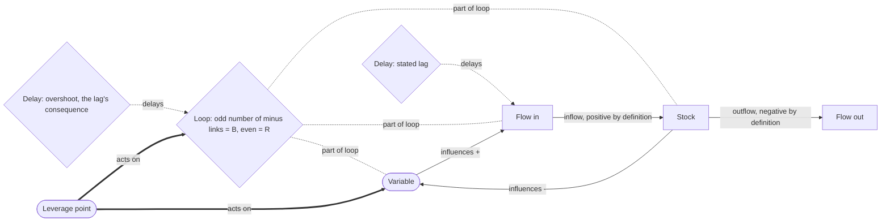

# Systems Thinking

> Explains behaviour over time from structure: stocks that accumulate, flows that fill and drain them, closed feedback loops that are reinforcing or balancing, and the delays that make a corrected system oscillate. Category: Sensemaking & Complex Systems. Reference: [Systems thinking](https://en.wikipedia.org/wiki/Systems_thinking). [Open the 3D graph](./index.html) (needs internet for Three.js; on GitHub open via Pages or clone).

## What it decomposes

Systems thinking takes apart *behaviour over time* — a boom, a glut, an oscillation, a collapse that keeps recurring — and holds that the behaviour comes from structure rather than from the events that fill it. The machinery comes from Jay Forrester's industrial-dynamics group at MIT, set out in *Industrial Dynamics* (1961): name the accumulations, name the rates that change them, find the closed chains of influence among them, and the shape of the behaviour follows. Donella Meadows gave the vocabulary its plain-language form in *Thinking in Systems* (2008) and its intervention theory in the 1999 essay "Leverage Points: Places to Intervene in a System"; Peter Senge turned the recurring loop shapes into archetypes in *The Fifth Discipline* (1990); John Sterman's *Business Dynamics* (2000) is the working manual. Six slots carry the view here: `stock`, `flow`, `variable`, `loop`, `delay`, `leverage_point`.

What the framework forces you to make explicit is the closure and the sign. A causal story is a line: demand rose, so orders rose, so inventory emptied. A system is a circle, and a circle has an arithmetic. Each influence link carries a polarity — `+` when more of the cause means more of the effect, `-` when more means less — and the polarity of the loop is the product of its links. An **odd** number of negative links makes the loop **balancing**: it senses a gap and closes it. An **even** number, including zero, makes it **reinforcing**: whatever happens is amplified, in both directions, which is why the loop that produces a boom produces the bust. That is the framework's one piece of real machinery, and it is why a loop node here is a conclusion rather than a label. Delays are the second half: a balancing loop with no lag settles, and one whose correction arrives long after the gap was sensed cannot, because the correction keeps arriving for a gap that has closed. Overshoot is a property of lag inside a balancing loop, not of the people operating it.

Without the framework you get three predictable errors. A chain is mistaken for an explanation: every step is true and it still cannot say what happens next, because it never returns to where it started. The behaviour is blamed on the actors, when the point of the Beer Game is that every player behaves sensibly and the oscillation happens anyway. And the intervention goes to a parameter. Meadows ranks interventions so that this last error is visible: parameters 12 (weakest), buffers 11, physical stock-and-flow structure 10, delays 9, balancing-loop strength 8, reinforcing-loop gain 7, information flows 6, rules 5, self-organisation 4, goals 3, paradigms 2, transcending paradigms 1. The cheap and obvious lever is almost always in the bottom third.

## The slots



The diagram is one closed loop with one negative link, so it is balancing; change `S -- influences -` to `+` and the same three nodes become a reinforcing loop. Nothing else moves.

| Slot | What goes here | Typical provenance | Why that provenance |
|---|---|---|---|
| `stock` | An accumulation: inventory, backlog, cash, installed capacity, grid headroom. It changes only through its flows, and it is what gives a system memory. | either, fact in practice | Nine of ten stock nodes are facts: speakers describe accumulations constantly without calling them stocks, so the work is recognition. The one derived stock, `cs_pipeline`, is the accumulation nobody tracks — which is why the Beer Game is lost. |
| `flow` | A rate that fills or drains a stock: orders per week, shipments, free cash flow, capex. | either, fact in practice | All ten are facts; people state rates. What must be inferred is which stock a flow fills or drains (`ce_ship_ware`, `e_fcf_cash`) — obvious to a modeller, invisible in speech. |
| `variable` | An auxiliary quantity that influences a flow without accumulating: perceived demand, price, scarcity, sentiment. | either, fact in practice | All eight are facts. Variables are what speakers argue about; the contribution is putting them in a circle, not finding them. |
| `loop` | A closed chain of influence, named and signed: R for reinforcing, B for balancing. | derived, always | Eight of eight are derived, a rule rather than a sample: nobody says "these four statements close on each other and the product of their signs is positive". In the TBPN example most of the loops' own arrows are quotable fact edges while every loop node is derived — the data gives you the arrows, the framework gives you the circle and its sign. |
| `delay` | A lag between cause and effect, and — separately — what that lag does to the loop it sits inside. | split by provenance, on purpose | Stated lags are facts: `cd_order`, `cd_ship` and `d_lead` quote the speakers' own numbers. That a lag inside a balancing loop converts correction into oscillation is the framework's general result, so `cd_overshoot` and `d_overshoot` are derived. Collapsing the two launders an inference into a quote. |
| `leverage_point` | Where a small intervention changes the system's behaviour, placed on Meadows' hierarchy. | derived, always | All five are derived and none could be otherwise: a leverage point is a counterfactual intervention, and a source that had already made it would not be describing the problem. Idea-bearing slot here. |

## Example 1: The Beer Distribution Game: a one-step rise in demand, an eight-week lag, and a glut

Three tiers of one beer supply chain, each seeing only its own books, respond to a single permanent step up in customer demand. Nobody behaves irrationally, nobody lies, and every team still ends with inventories many times where they started.

### Source text

> In the Beer Distribution Game, a board game used in management classes since the 1960s, three players run one supply chain for a single brand of beer: a retailer, a wholesaler and a brewery. The retailer sells to customers from a case inventory on the shelf and orders replacements from the wholesaler. The wholesaler ships from its own warehouse inventory and orders from the brewery, and the brewery brews. Every order takes two weeks to reach the player upstream, and every shipment takes two more weeks to arrive, so eight weeks pass between a retailer's order and the beer landing on his shelf. Each player sees only his own inventory, his own incoming orders and his own backlog; nobody sees what the end customer is actually buying. In week five, customer demand doubles once, from four cases a week to eight, and then stays flat at eight for the rest of the game. The retailer's shelf inventory falls for several weeks and he cannot tell whether the rise will continue, so he orders more than he needs, to refill the shelf and to cover the backlog he has already accumulated. When the orders are larger than his own shipments, the wholesaler runs out of warehouse inventory and ships only part of what is asked for, so the retailer's backlog grows and his next order is larger still. The wholesaler sees a large order, reads it as a surge in demand, and orders more than that from the brewery. The brewery adds capacity and brews to the order book it can see. Around week twenty the accumulated orders all arrive at once, inventories across the chain reach many times their starting level, every player cancels, and the brewery is left with beer nobody ordered. Almost every team produces this oscillation and almost every team is surprised by it; the customer demand curve, shown to them afterwards, is a single step.

After the MIT Beer Distribution Game, developed in Jay Forrester's industrial-dynamics group and popularised by Peter Senge, *The Fifth Discipline* (1990), and John Sterman, *Business Dynamics* (2000). The scenario text above was written for this page, so that the fact nodes have something verbatim to quote; `source_ref` is the sentence number in it.

### Decomposition

Fourteen of the twenty-one nodes are facts, none of them paraphrases.

Stock

- `cs_shelf` **Retailer shelf inventory** [fact] The cases standing on the retailer's shelf. Customers are served out of it and replacements arrive into it, so it is the stock whose level the retailer is trying to defend. "The retailer sells to customers from a case inventory on the shelf" (sentence 2)
- `cs_ware` **Wholesaler warehouse inventory** [fact] The wholesaler's own warehouse stock. He ships the retailer's orders out of it and the brewery's output comes into it. "The wholesaler ships from its own warehouse inventory" (sentence 3)
- `cs_backlog` **Retailer backlog** [fact] Orders the retailer has placed or promised and not yet been able to satisfy. It accumulates while shipments fall short and it is added on top of the next order. "to cover the backlog he has already accumulated" (sentence 7)
- `cs_glut` **Chain-wide inventory glut** [fact] The end state: inventories across all three tiers many times their starting level, every player cancelling, and beer at the brewery that nobody ordered. "inventories across the chain reach many times their starting level, every player cancels" (sentence 11)
- `cs_pipeline` **Orders in the pipeline** [derived 0.85] Beer already ordered and not yet arrived. It is a real accumulation that nobody in the game tracks, which is why the same need is ordered more than once. Rationale: The text gives the two-week order lag, the two-week shipping lag and the fact that around week twenty the accumulated orders all arrive at once. Anything that takes time in transit is by definition accumulating somewhere; naming that accumulation as a stock is the systems reading, and the text never does it.

Flow

- `cf_demand` **Customer demand: 4 to 8 cases** [fact] The only exogenous input to the whole game: customer demand doubles once in week five, from four cases a week to eight, and then stays flat. "customer demand doubles once, from four cases a week to eight" (sentence 6)
- `cf_order` **Retailer's ordering rate** [fact] Cases the retailer orders from the wholesaler each week. He orders more than current sales, because he is refilling the shelf and covering the backlog at the same time. "he orders more than he needs, to refill the shelf" (sentence 7)
- `cf_ship` **Shipments to the shelf** [fact] Cases actually leaving the wholesaler and arriving at the retailer. When the warehouse is empty the wholesaler ships only part of what was asked for. "ships only part of what is asked for" (sentence 8)
- `cf_wsorder` **Wholesaler's ordering rate** [fact] Cases the wholesaler orders from the brewery. He orders more than the large order he has just received, because he is refilling his own warehouse as well. "orders more than that from the brewery" (sentence 9)
- `cf_brew` **Brewing rate, capacity added** [fact] The brewery's output. It adds capacity and brews to the order book it can see, which is the wholesaler's inflated order and not the customer's eight cases. "The brewery adds capacity and brews to the order book it can see" (sentence 10)

Variable

- `cv_perceived` **Perceived demand upstream** [fact] What the wholesaler believes end demand to be. He sees a large order and reads it as a surge in demand, so the retailer's replenishment decision becomes the wholesaler's demand signal. "reads it as a surge in demand" (sentence 9)
- `cv_visibility` **Each player sees only his own tier** [fact] The information each player has: his own inventory, his own incoming orders, his own backlog. Nobody sees what the end customer is buying. "Each player sees only his own inventory, his own incoming orders and his own backlog" (sentence 5)
- `cv_uncertainty` **Is the rise permanent?** [fact] The retailer cannot tell whether the rise in demand will continue, so he hedges upward. The uncertainty is about the future, not about the data he has. "he cannot tell whether the rise will continue" (sentence 7)

Feedback loop — all three derived, and none of them stated anywhere in the text

- `cl_b1` **B1 Retailer refills shelf** [derived 0.85] Balancing. Shelf inventory falls, so the retailer orders more (-); more orders pull more shipments (+); shipments refill the shelf (+). One negative link, so the loop corrects a gap instead of widening it. It is the loop the retailer believes he is operating, and it takes eight weeks to close. Rationale: All three links are stated in the text (sentence 7 for falling inventory driving larger orders, sentences 2, 3 and 8 for orders being shipped onto the shelf), but the text never says they form a circle, and the sign arithmetic that makes it balancing rather than reinforcing is the framework's own. Members (`part_of_loop`): `cs_shelf`, `cf_order`, `cf_ship`.
- `cl_b2` **B2 Tier-by-tier correction** [derived 0.80] Balancing, and the slowest loop in the game: the retailer's order becomes the wholesaler's perceived demand (+), which becomes the wholesaler's order (+), which becomes brewing and new capacity (+), which eventually reaches the shelf (+) and relieves the shortage (-). The same corrective loop as B1, running through three sets of books and three sets of lags. Every tier is also running its own small correction on its own stock at the same time (shipments drain the warehouse, which limits shipments), so B2 is a loop of loops and its total lag is the sum of theirs. Rationale: The text walks the chain link by link in sentences 9 and 10 and states that everything arrives at once around week twenty. Recognising the chain as one long feedback loop whose lag is the sum of the tiers' lags, rather than a sequence of separate decisions, is the inference. Members: `cf_order`, `cv_perceived`, `cf_brew`.
- `cl_r1` **R1 Shortage spiral** [derived 0.85] Reinforcing. Backlog raises the retailer's order (+); the larger order empties the warehouse (-); an empty warehouse means partial shipments (+); partial shipments grow the backlog (-). Two negative links, so the loop amplifies: the shortage produces the ordering behaviour that deepens the shortage. The same four arrows also form a balancing loop whenever the warehouse has stock, because then the larger order simply clears the backlog; R1 dominates only while the wholesaler is short, which is what makes the spiral episodic rather than permanent. Rationale: Sentences 7 and 8 state every one of the four links, including the return arrow from short shipments back to a larger next order. What the text does not say is that these four statements close on each other, nor that two negative links make the circle reinforcing rather than self-limiting. Members: `cs_backlog`, `cf_order`, `cs_ware`.

Delay — two stated, one inferred

- `cd_order` **Order lag: two weeks per tier** [fact] Every order takes two weeks to reach the player upstream, so each tier is acting on information about a fortnight old. "Every order takes two weeks to reach the player upstream" (sentence 4)
- `cd_ship` **Eight weeks order to shelf** [fact] Eight weeks pass between a retailer's order and the beer landing on his shelf: two weeks for each order hop and two more for each shipment. "eight weeks pass between a retailer's order and the beer landing on his shelf" (sentence 4)
- `cd_overshoot` **Lag makes B1 overshoot** [derived 0.90] Because the correction in B1 takes eight weeks and the retailer keeps ordering in the meantime, the loop cannot settle: it overshoots, and the overshoot is then corrected by cancellation, which undershoots. The oscillation is a property of the lag, not of the players. Rationale: The text gives the lag (sentence 4), the continued ordering during it (sentences 7 and 8) and the simultaneous arrival and glut (sentence 11), plus the observation that almost every team produces the same oscillation and is surprised by it. That a balancing loop with a long lag relative to its own response time must oscillate is the general result the example illustrates, and no player in the scenario says it. Supported by `cd_ship`, `cs_glut`.

Leverage point

- `clp_info` **Show every tier the end demand** [derived 0.85] Give all three players the customer sell-through number every week. Nothing physical changes: the lags, the capacity and the decision rules all stay as they are, and the amplification in B2 still collapses, because the wholesaler's perceived demand stops being the retailer's replenishment decision. Rationale: Sentence 5 says nobody sees what the end customer is buying and sentence 12 says the demand curve is a single step when shown afterwards. Those two together locate the whole oscillation in a missing information flow rather than in the physical chain, which is Meadows' sixth leverage point and much higher than tinkering with the lags. Acts on `cv_visibility`, `cv_perceived`.
- `clp_rule` **Order against the pipeline** [derived 0.80] Change the ordering rule so that beer already on its way is subtracted before the next order is placed. The same need is then ordered once instead of four times, which removes the amplification in R1 without removing the delay. Rationale: Follows from cs_pipeline: if orders in transit are a real accumulation and the decision rule ignores them, the same shortfall is ordered repeatedly. The text describes the behaviour (he orders more than he needs, every week, while nothing arrives) but never names the rule that produces it. A decision rule is Meadows' fifth leverage point, above the physical structure of the chain. Acts on `cf_order`, `cs_pipeline`.

Fact edges. Ten of the thirty-six, each joining two fact nodes and quoting the scenario's own connective. The `label` field carries the polarity.

- `ce_demand_shelf` `cf_demand` -> `cs_shelf` (outflow) [fact] "The retailer sells to customers from a case inventory on the shelf" (sentence 2)
- `ce_shelf_order` `cs_shelf` -> `cf_order` (influences, `-`) [fact] "The retailer's shelf inventory falls for several weeks and he cannot tell whether the rise will continue, so he orders more than he needs" (sentence 7)
- `ce_unc_order` `cv_uncertainty` -> `cf_order` (influences, `+`) [fact] "he cannot tell whether the rise will continue, so he orders more than he needs" (sentence 7)
- `ce_backlog_order` `cs_backlog` -> `cf_order` (influences, `+`) [fact] "the retailer's backlog grows and his next order is larger still" (sentence 8)
- `ce_order_ware` `cf_order` -> `cs_ware` (influences, `-`) [fact] "When the orders are larger than his own shipments, the wholesaler runs out of warehouse inventory" (sentence 8)
- `ce_ware_ship` `cs_ware` -> `cf_ship` (influences, `+`) [fact] "the wholesaler runs out of warehouse inventory and ships only part of what is asked for" (sentence 8)
- `ce_ship_backlog` `cf_ship` -> `cs_backlog` (influences, `-`) [fact] "ships only part of what is asked for, so the retailer's backlog grows" (sentence 8)
- `ce_order_perceived` `cf_order` -> `cv_perceived` (influences, `+`) [fact] "The wholesaler sees a large order, reads it as a surge in demand" (sentence 9)
- `ce_perceived_wsorder` `cv_perceived` -> `cf_wsorder` (influences, `+`) [fact] "reads it as a surge in demand, and orders more than that from the brewery" (sentence 9)
- `ce_wsorder_brew` `cf_wsorder` -> `cf_brew` (influences, `+`) [fact] "orders more than that from the brewery. The brewery adds capacity and brews to the order book it can see" (sentences 9 to 10)

Twenty-six are derived. Four are the stock-and-flow accounting the text never states: `ce_ship_shelf` `cf_ship` -> `cs_shelf` (inflow, 0.90), `ce_ship_ware` `cf_ship` -> `cs_ware` (outflow, 0.85, "Standard stock-and-flow accounting: what the wholesaler ships must leave his warehouse"), `ce_brew_ware` `cf_brew` -> `cs_ware` (inflow, 0.80) and `ce_order_ship` `cf_order` -> `cf_ship` (influences `+`, 0.85, the order being the signal shipped against). Three hang on `cs_pipeline` and exist only because it was recognised as a stock: `ce_order_pipe` (inflow, 0.85), `ce_pipe_ship` (influences `+`, 0.80) and `ce_pipe_glut` `cs_pipeline` -> `cs_glut` (influences `+`, 0.85, "The glut is the pipeline emptying itself into the tiers"). One is the information link: `ce_vis_perceived` `cv_visibility` -> `cv_perceived` (influences `-`, 0.80), "adjacent in the text but never asserted". Three place the delays: `ce_dorder_wsorder` `cd_order` -> `cf_wsorder` (0.85), `ce_dship_ship` `cd_ship` -> `cf_ship` (0.90) and `ce_dover_b1` `cd_overshoot` -> `cl_b1` (0.85) — the overshoot attaches to the loop rather than to any single arrow, "because the oscillation is a property of the delay acting inside the balancing loop". Nine are `part_of_loop` memberships (0.80 to 0.85): `ce_pl_b1_shelf`, `ce_pl_b1_order`, `ce_pl_b1_ship` into `cl_b1`; `ce_pl_b2_order`, `ce_pl_b2_perceived`, `ce_pl_b2_brew` into `cl_b2`; `ce_pl_r1_backlog`, `ce_pl_r1_order`, `ce_pl_r1_ware` into `cl_r1`. Note that `cf_order` belongs to all three, "which is why one rule change affects both" R1 and B1. Four are `acts_on` from the two leverage points (0.80 to 0.85): `ce_lp_info_vis`, `ce_lp_info_perc`, `ce_lp_rule_order`, `ce_lp_rule_pipe`. Two are grounding links from `cd_overshoot` (`ce_dover_sup1`, `ce_dover_sup2`, 0.90 each).

### What the LLM added and why it helps

Do the arithmetic for R1 by hand, because it is the clearest case on the page. Follow four fact edges round: `ce_backlog_order` (backlog up, order up, `+`), `ce_order_ware` (order up, warehouse down, `-`), `ce_ware_ship` (warehouse down, shipments down, `+`), `ce_ship_backlog` (shipments down, backlog up, `-`). The chain returns to where it started, so it is a loop; it has two negative links, an even number, so the product of the signs is positive and the loop is **reinforcing**. All four arrows are quoted from sentences 7 and 8 — nothing was added to the data. What was added is that the four statements close on each other, and the multiplication that turns the closure into a prediction: a shortage producing the ordering behaviour that deepens the shortage does not settle on its own. `cl_r1` is that conclusion, at 0.85.

The same procedure on B1 gives the opposite answer from the same kind of evidence. `ce_shelf_order` is `-` (shelf falls, orders rise), `ce_order_ship` is `+`, `ce_ship_shelf` is an inflow and therefore positive by definition. One negative link, an odd number, so the loop is **balancing** — the thermostat the retailer thinks he is operating. B2 is the same circle drawn the long way: `ce_order_perceived` `+`, `ce_perceived_wsorder` `+`, `ce_wsorder_brew` `+`, `ce_brew_ware` inflow, `ce_ware_ship` `+`, `ce_ship_shelf` inflow, then `ce_shelf_order` `-` closes it. One negative again, balancing again, now with three tiers of lag in the path. Two balancing loops and one reinforcing loop share the single variable `cf_order` — the structural statement the scenario cannot make about itself.

The rest of the derived layer does two jobs. `cs_pipeline` (0.85) names the stock nobody is looking at, and three edges follow from it; without it the glut has no mechanism, only a date. `cd_overshoot` (0.90) applies the general result: the facts are an eight-week lag and a simultaneous arrival, and the addition is that a balancing loop slower than its own response time *must* oscillate. Hide the derived layer and what remains is true to the text — five accumulations, five rates, three pieces of information, two stated lags, ten quoted arrows — and it cannot tell you what week twenty looks like. The leverage points are where the payoff lands: `clp_info` (0.85) changes nothing physical and `clp_rule` (0.80) changes one line of a decision rule. Neither touches the eight weeks, and both outrank any amount of buffer stock.

## Example 2: from the TBPN transcripts: The AI compute buildout: reinforcing loops against one slow brake

Episode "OpenAI AMD Deal, DevDay Reactions, xAI's Memphis Datacenter (Doug O'Laughlin, Celine Halioua)", 2025-10-06, [transcript](../../../tbpn-transcripts/transcripts/2025-10-06_openai-amd-deal-devday-reactions-xais-memphis-datacenter-doug-olaughlin-celine-halioua.md); line numbers refer to it. Semiconductor analyst Doug O'Laughlin walks through the week OpenAI signed about half a trillion dollars of chip and cloud commitments.

A hype cycle is the one kind of business story that contains closed loops rather than a causal chain, and this episode is an unusually complete one. The speakers state the return arrow of the circular-financing loop out loud (enthusiasm for Nvidia stock is the backstop for the deals that feed it), state the arms-race loop as an OPEC defection problem, state the supply-elasticity brake (supply comes out of the woodwork), put a long lead time on that brake, and describe one completed overshoot-and-correct cycle at Microsoft. Almost every influence arrow is quotable; not one of the five loops is named as a loop.

### Facts (quoted)

Sixteen of the twenty-five nodes and ten of the forty-seven edges are facts, none of them paraphrases. `source_ref` is the speaker plus the line range in the file.

Stock

- `s_gpu` **Compute deployed: 10 GW** [fact] Installed AI compute capacity. The Nvidia deal alone is meant to deploy up to 10 gigawatts of it; this is the stock the whole buildout is filling. "use the cash from NVIDIA to buy NVIDIA chips and deploy up to 10 gigawatts of computing power in AI data centers" (host reading the news report, L1660-L1666)
- `s_commit` **Committed orders** [fact] The backlog of announced commitments: about $10B to Broadcom, $100B to Nvidia, $300B to Oracle and roughly $20B to CoreWeave. It is OpenAI's obligation and its vendors' revenue at the same time. "what's the headline number here it's a hundred billion 10 billion to broadcom a hundred billion to invidia and 300 billion to Oracle 20 billion ish to core weave as well" (host, L1682-L1688)
- `s_cash` **Hyperscaler cash** [fact] The cash pile the buildout is being paid out of. Meta's stood at about $77 billion at the end of last year, the example the speakers use for the whole group. "Meta's cash on hand at the end of last year was around $77 billion." (host, L2464)
- `s_slack` **Unused grid headroom** [fact] The grid is built for the highest and lowest day, not for 100% production, so average utilisation leaves a large amount of existing capacity unused. It is a stock of power that is already paid for. "the grid is actually not built for 100% production. So there's a lot of slack in the grid itself because it's actually built for the highest day and the lowest day" (Doug O'Laughlin, L2302-L2306)
- `s_debt` **Unused debt capacity** [fact] None of the hyperscalers carry meaningful leverage, so their borrowing capacity is an untouched reservoir. Microsoft trades at a five-basis-point premium to Treasuries. "the thing that's also really interesting is none of the hypers are levered at all" (Doug O'Laughlin, L2384)

Flow

- `f_vendor` **Nvidia's $100B into OpenAI** [fact] Vendor equity flowing into the customer: Nvidia said it would invest $100 billion in OpenAI over the next decade, and OpenAI plans to spend the cash on Nvidia chips. "NVIDIA announced that it would invest $100 billion in Open AI over the next decade" (host reading the news report, L1658)
- `f_fcf` **Free cash flow $200-250B** [fact] The inflow: roughly $200 to $250 billion a year of hyperscaler free cash flow, which is both the capex budget and the thing that would service any debt raised against it. "We're talking quite a bit of capital is available to do this, like a surprising amount. I want to say on an annual basis, something like 250, maybe even, yeah, 200 billion" (Doug O'Laughlin, L2380-L2382)
- `f_drain` **Cash draining into capex** [fact] The outflow: Meta's cash fell from about $77 billion to $47 billion in six months and is expected to keep dropping through the year. "As of the end of June, it was down to $47 billion and just will continue to drop throughout the year" (host, L2466)
- `f_lease` **Leasing rate** [fact] The rate at which capacity is committed. Microsoft said yes to every leasing opportunity in 2023, then imposed a top-down pause, and is now having to pick the pieces back up. "this giant buildout in 23 where they said yes to every single leasing opportunity possible. And then they, like, there was a top down pause. And now they're starting to pick up the pieces" (Doug O'Laughlin, L2560-L2564)
- `f_gen` **New generation online** [fact] Power supply entering the system in response to the demand: gas gen, gas turbines and what the speaker calls clever pockets of energy coming up to fulfil the need. "we're starting to see stuff like gas gen, gas turbines, like all these different, like, little clever pockets of energy are coming up to then fulfill the need" (Doug O'Laughlin, L2348-L2350)

Variable

- `v_enthusiasm` **Nvidia stock enthusiasm** [fact] The market's appetite for Nvidia equity, which the reporting describes as the financial backstop for the entire AI market rather than as a consequence of it. "the market seemingly endless enthusiasm for NVIDIA stock is providing a financial backstop for the entire AI market" (host reading the news report, L1664-L1668)
- `v_share` **Market share lost** [fact] The share a firm loses when a rival spends. The speaker's prediction is that once Meta and Google get into the game in earnest, the others realise their business model is under attack. "all of a sudden they're going to be like whoa this is attacking my business model and I'm losing market share" (Doug O'Laughlin, L2588-L2592)
- `v_price` **Oracle undercuts price** [fact] Price as a competitive weapon: Oracle comes in at a lower price and levers its whole balance sheet to do it, taking business Microsoft had been conservative about. "We'll come in at a lower lower price. Like I'm just going to lever my entire balance sheet for it" (Doug O'Laughlin voicing Oracle, L2572-L2574)
- `v_scarcity` **US power scarcity** [fact] The perceived shortage of power: grids are not keeping up and the speaker says outright that the United States is running out of power. "we're running out of power in the United States" (Doug O'Laughlin, L2342)
- `v_sentiment` **Hostility blocks sites** [fact] Non-technical public sentiment against AI, showing up as data centres getting blocked and as a roadblock at several stages of the buildout. "you're seeing data centers just getting kind of like blocked" (host relaying a chat question, L2676-L2678)

Delay

- `d_lead` **Long power lead times** [fact] The lag on the supply side: the long lead time items need both capital and time to arrive, and the speaker expects grids breaking to be a 2026 story. "all these long lead time things need so much capital and time to get there" (Doug O'Laughlin, L2510; grids breaking as a 2026 story at L2334-L2338)

Fact edges. Ten, each joining two fact nodes and quoting the turn in which a speaker states the connection; the `label` field carries the polarity.

- `e_vendor_commit` `f_vendor` -> `s_commit` (inflow) [fact] "Open AI plans to use the cash from NVIDIA to buy NVIDIA chips" (host reading the news report, L1660-L1662)
- `e_commit_gpu` `s_commit` -> `s_gpu` (influences, `+`) [fact] "to buy NVIDIA chips and deploy up to 10 gigawatts of computing power in AI data centers" (host reading the news report, L1660-L1666)
- `e_enth_vendor` `v_enthusiasm` -> `f_vendor` (influences, `+`) [fact] "the deal highlighted how the market seemingly endless enthusiasm for NVIDIA stock is providing a financial backstop for the entire AI market" (host reading the news report, L1662-L1668)
- `e_drain_cash` `f_drain` -> `s_cash` (outflow) [fact] "Meta's cash on hand at the end of last year was around $77 billion. As of the end of June, it was down to $47 billion" (host, L2464-L2466)
- `e_fcf_debt` `f_fcf` -> `s_debt` (influences, `+`) [fact] "I was just doing the math on 250 billion in free cash flow. If that's used to service 5% coupon payments, that's $5 trillion in notional debt, like value" (host, L2416-L2418)
- `e_price_share` `v_price` -> `v_share` (influences, `+`) [fact] "I'll essentially steal all your business if you let me. We'll come in at a lower lower price" (Doug O'Laughlin, L2570-L2574)
- `e_share_lease` `v_share` -> `f_lease` (influences, `+`) [fact] "this is attacking my business model and I'm losing market share. And that's when the other guys come back in a big way" (Doug O'Laughlin, L2590-L2594)
- `e_scarcity_gen` `v_scarcity` -> `f_gen` (influences, `+`) [fact] "even though we say we're running out of power, when you have this big demand response, supply comes out of the woodwork" (host, L2344-L2346)
- `e_gen_scarcity` `f_gen` -> `v_scarcity` (influences, `-`) [fact] "little clever pockets of energy are coming up to then fulfill the need" (Doug O'Laughlin, L2348-L2350)
- `e_sentiment_lease` `v_sentiment` -> `f_lease` (influences, `-`) [fact] "you're seeing data centers just getting kind of like blocked uh that feels like it potentially you know it's certainly going to be a roadblock at a bunch of different stages of this build-out" (host relaying a chat question, L2676-L2680)

Note what those last three are. `e_scarcity_gen` and `e_gen_scarcity` are the two arrows of loop B1, and both are quoted verbatim, with opposite signs, from two adjacent turns. The loop itself is still an inference.

### Decomposition

Nine derived nodes and thirty-seven derived edges. Fact nodes are referenced by id from the list above.

Feedback loop — all five derived, which is the rule and not an artefact of this episode

- `l_r1` **R1 Vendor financing** [derived 0.75] Reinforcing. Nvidia's equity funds OpenAI's purchases (+); the purchases are Nvidia's committed revenue (+); that revenue is what the market is enthusiastic about (+); the enthusiasm is the backstop that funds the next investment (+). No negative links, so the circle amplifies in both directions, including downward. Rationale: Two of the loop's three arrows are quoted facts (e_vendor_commit and e_enth_vendor), including the return arrow at L1664-L1668 where the enthusiasm is described as the backstop for the market; only e_commit_enth, the step from the committed backlog to the equity enthusiasm, is inferred. What no speaker says is that these statements close on each other. Doug calls the vendor financing circular and scary at L2006 but treats it as a worrying feature rather than as a loop with a sign; the inference is that it is a reinforcing loop, which is why a fall in Nvidia's multiple is not just bad news for Nvidia. Members: `f_vendor`, `v_enthusiasm`, `s_commit`.
- `l_r2` **R2 Capex arms race** [derived 0.80] Reinforcing. Capacity committed by one firm (+) lets it undercut on price (+), which costs a rival market share (+), which forces the rival to commit capacity too (+), which puts the first firm's share at risk. The speaker's own analogy is OPEC: the cartel holds until somebody defects, and then nobody can stay out. Rationale: The speaker states the whole circle in one breath at L2586-L2594, including the return arrow from lost share back to spending. The derived part is reading it as a closed reinforcing loop whose equilibrium is all-in spending rather than as a prediction about two particular companies, and attaching Oracle's price undercut and Microsoft's pause to the same loop as instances of it. Members: `f_lease`, `v_price`, `v_share`.
- `l_b1` **B1 Supply finds a way** [derived 0.80] Balancing. Compute buildout raises power scarcity (+), scarcity calls forth new generation (+), and new generation relieves the scarcity (-): the main cycle is `e_scarcity_gen` then `e_gen_scarcity`, one negative link, so the loop corrects. B1 has two paths with very different speeds, and the fast one is a two-edge sub-loop hung off `f_gen` rather than part of the main cycle: existing grid headroom feeds generation (`e_slack_gen`) and generation drains that headroom (`e_gen_slack`), which is why `s_slack` is listed as a member; the slow path builds new plant behind the lead time `d_lead`. It is the loop that limits the boom, and the fast half of it runs out first. Rationale: Both of the loop's own arrows are stated: L2344-L2346 for scarcity calling forth supply, L2348-L2350 for that supply fulfilling the need, and L2352 restates the principle. The inference is the closure and the polarity, and the consequence that follows from the polarity: a balancing loop with the lead times of L2510 inside it cannot hold the boom in check in the short run. Written as edge lists the loop is two cycles, `v_scarcity` -> `f_gen` -> `v_scarcity` (`e_scarcity_gen`, `e_gen_scarcity`) and the sub-loop `f_gen` -> `s_slack` -> `f_gen` (`e_gen_slack`, `e_slack_gen`); `s_slack` belongs to B1 through the second, and `e_pl_b1_slack` is kept at a lower confidence for that reason. Members: `v_scarcity`, `f_gen`, `s_slack`.
- `l_r3` **R3 Scarcity builds grid** [derived 0.65] Reinforcing, and easy to miss because it runs through the same arrows as B1. Deployed compute raises scarcity (+), scarcity calls forth generation (+), and the generation that arrives is what lets the next tranche of committed capacity come online (+). No negative links, so the scramble for power expands the power system, which permits a larger buildout than the one that started the scramble. Rationale: All three arrows exist in the data (`e_gpu_scarcity`, `e_scarcity_gen`, `e_gen_gpu`), and the speaker states the third one himself when he says behind-the-meter gas is going to be the big driver to get these data centres online. The inference is that they close, and that because the cycle carries no negative link it is reinforcing rather than part of the brake. This is the classic relieve-the-limit pattern: the same supply response that balances scarcity in B1 raises the ceiling the system can grow into. Held at 0.65 because the closure depends on `e_gen_gpu`, which rests on a pronoun. Members: `s_gpu`, `f_gen`.
- `l_b2` **B2 Social licence** [derived 0.55] Balancing, and the weakest loop here. The buildout raises public hostility (+), and hostility blocks sites and slows the buildout (-). The speaker expects it to lose, because the administration and everybody else is on board. Rationale: The return arrow is stated (hostility is already blocking data centres, L2676-L2680); the forward arrow from the scale of the buildout to the hostility is adjacent rather than asserted, and the loop's gain is explicitly doubted by the speaker at L2682-L2692. Kept at low confidence because a balancing loop that is currently weak is still the one a regulator can strengthen, which makes its absence from the picture more misleading than its presence. Members: `v_sentiment`, `f_lease`.

Delay (`d_lead` is the stated one)

- `d_overshoot` **Brake lags the loops** [derived 0.75] R1 and R2 act at the speed of a press release; B1 acts at the speed of a gas turbine order. A balancing loop that is slower than the reinforcing loops it is meant to restrain does not prevent the overshoot, it dates it. Microsoft's 2023 yes-to-everything, top-down pause and forced re-entry is one completed cycle of exactly that. Rationale: Built from three stated facts: the lead times at L2510, the speed at which commitments are being announced, and the Microsoft boom-pause-restart at L2560-L2564. The general result, that a delay inside the only balancing loop converts correction into oscillation, is the framework's and not the speaker's. He predicts a continued boom; this node says a boom of this shape has a characteristic end, which is a stronger claim than anything in the transcript and is priced at 0.75 accordingly. Supported by `d_lead`, `f_lease`.

Leverage point — the idea-bearing slot; `lp_rule` and `lp_info` carry an `idea` field, `lp_delay` deliberately does not

- `lp_rule` **Rules: interruptible load** [derived 0.60] Change the contract rather than the hardware. A data centre that is allowed to sip from the grid off-peak and run behind the meter at peak can be served from headroom that already exists, instead of waiting for new generation. The binding constraint moves from megawatts to the interconnection rule. Rationale: Rests on s_slack (the grid is built for the extremes, so average utilisation leaves a lot unused) together with the speaker's own description of sipping from the grid and behind-the-meter gas at L2316-L2322. Rules sit fifth in Meadows' hierarchy, above information flows and far above adding capacity, because this intervention changes who may use the existing stock rather than enlarging it. Held at 0.6 because the transcript gives the physical possibility but nothing about whether the tariffs and interconnection queues would permit it. Acts on `s_slack`, `l_b1`; supported by `v_scarcity`.
- `lp_info` **Info: look-through exposure** [derived 0.70] R1 is invisible to the people funding it. A look-through exposure engine that nets out the circular equity, prepayments and offtakes across Nvidia, OpenAI, AMD, Oracle and the neoclouds would put a number on how much of each company's value depends on the same dollar. Rationale: The transcript states the gap explicitly: a host tries to build a DCF for OpenAI, finds he would have to build one for AMD too, and gives up with all these circular transactions (L2206-L2214); Doug answers that it is a little bit of vibe based investing. Information flows are Meadows' sixth-order leverage point, and a reinforcing loop nobody can measure is the canonical case for one, because the loop's gain is what determines how far it unwinds. Acts on `v_enthusiasm`, `l_r1`; supported by `s_commit`.
- `lp_delay` **Delays: build more turbines** [derived 0.65] The obvious intervention is to shorten the lag: more turbines, more transformers, more generation. It works, and Meadows ranks it ninth, near the bottom, because it only changes how fast an unchanged structure responds. It is also where all the capital is already going, which is why it is the least interesting of the three. Rationale: Included as the control case for the hierarchy. The transcript shows the whole market already acting on this lever (gas gen, turbines, recommissioned nuclear, Oklo), and the speaker still says it is going to take a lot of time and that grids are breaking. A leverage point everyone is already pulling is not an opportunity, which is why this node carries no idea field while lp_rule and lp_info do. Acts on `d_lead`, `f_gen`.

Derived edges. Seven close the loops or carry the stock-and-flow accounting nobody stated: `e_commit_enth` `s_commit` -> `v_enthusiasm` (influences `+`, 0.70) is the arrow that closes R1 — "that the committed backlog drives the equity enthusiasm, rather than merely coinciding with it, is the inference that closes R1"; `e_lease_gpu` `f_lease` -> `s_gpu` (inflow, 0.80) is the arrow that closes both R2 and B2; `e_fcf_cash` `f_fcf` -> `s_cash` (inflow, 0.75), "discussed eighty lines apart and never joined"; `e_lease_drain` `f_lease` -> `f_drain` (influences `+`, 0.75); `e_cash_lease` `s_cash` -> `f_lease` (influences `+`, 0.65, a generalisation across speakers and firms); `e_debt_lease` `s_debt` -> `f_lease` (influences `+`, 0.70); `e_gen_gpu` `f_gen` -> `s_gpu` (influences `+`, 0.70, power availability gating how much committed capacity becomes deployed compute, and the arrow that closes R3).

Four run from the deployed-compute stock out into the rest of the system and are the forward arrows of R2, B1 and B2: `e_gpu_price` `s_gpu` -> `v_price` (influences `+`, 0.60, "this is the contestable link in R2"), `e_gpu_scarcity` `s_gpu` -> `v_scarcity` (influences `+`, 0.75, "implied throughout and stated nowhere in one span"), `e_gpu_sentiment` `s_gpu` -> `v_sentiment` (influences `+`, 0.60, a cross-speaker inference). Two more treat the headroom as a stock that depletes: `e_slack_gen` `s_slack` -> `f_gen` (influences `+`, 0.65) and `e_gen_slack` `f_gen` -> `s_slack` (outflow, 0.60) — "headroom used is headroom gone, so the cheap supply response drains its own source and B1 weakens as it operates".

Two place the delays, `e_dlead_gen` `d_lead` -> `f_gen` (delays, 0.80) and `e_dover_lease` `d_overshoot` -> `f_lease` (delays, 0.75); thirteen are `part_of_loop` memberships (0.55 to 0.80) — `e_pl_r1_vendor`, `e_pl_r1_enth`, `e_pl_r1_commit` into `l_r1`; `e_pl_r2_lease`, `e_pl_r2_price`, `e_pl_r2_share` into `l_r2`; `e_pl_b1_scarcity`, `e_pl_b1_gen`, `e_pl_b1_slack` into `l_b1`; `e_pl_r3_gpu`, `e_pl_r3_gen` into `l_r3`, which is why `f_gen` is a member of a brake and an accelerator at once; `e_pl_b2_sent`, `e_pl_b2_lease` into `l_b2`, the last two at 0.55 because the loop they join is the doubtful one; six are `acts_on` from the three leverage points (0.60 to 0.70): `e_lp_rule_slack`, `e_lp_rule_b1`, `e_lp_info_enth`, `e_lp_info_r1`, `e_lp_delay_dlead`, `e_lp_delay_gen`; and four are grounding links (`e_dover_sup1`, `e_dover_sup2`, `e_lp_rule_sup`, `e_lp_info_sup`, 0.60 to 0.80).

### What the LLM added

Ten fact edges out of forty-seven, and they are not scattered: they sit on the loops. Take B1 and do the arithmetic with nothing but quotes. `e_scarcity_gen` is `+`, from a host saying "supply comes out of the woodwork". `e_gen_scarcity` is `-`, from Doug one turn later: "clever pockets of energy are coming up to then fulfill the need". Two links, one of them negative, an odd number, so the loop is **balancing**. Both arrows are in the transcript. The circle is not, the sign is not, and the consequence of the sign is not. That is the split this page is about, in two edges.

R1 runs the same way to the opposite answer: `e_vendor_commit` (inflow, fact), `e_commit_enth` (`+`, derived 0.70), `e_enth_vendor` (`+`, fact). No negative links, so **reinforcing** — and reinforcing loops run both ways: a fall in Nvidia's multiple does not merely hurt Nvidia, it removes the backstop that funds the purchases that are Nvidia's revenue. R2 is four links, `e_lease_gpu` (inflow), `e_gpu_price` (`+`), `e_price_share` (`+`), `e_share_lease` (`+`): zero negatives, reinforcing, and the speaker supplies the mechanism himself with the OPEC analogy. B2 is `e_gpu_sentiment` (`+`), `e_sentiment_lease` (`-`), `e_lease_gpu` (inflow): one negative, balancing, weak. R3 is the one that is easy to miss, because it reuses two of B1's own arrows: `e_gpu_scarcity` (`+`), `e_scarcity_gen` (`+`), `e_gen_gpu` (`+`) — zero negatives, reinforcing. The same supply response that balances scarcity in B1 raises the ceiling in R3, which is the relieve-the-limit pattern and the reason a brake that works can still leave the system bigger each cycle. So: three reinforcing loops, two balancing loops, and both brakes slower or weaker than the engines. Nobody says that, and it is not a judgment about anyone's opinion — it is what the signs and the lags add up to.

The weak points are worth naming. `e_gpu_price` at 0.60 is the link in R2 nobody states; `e_gpu_sentiment` at 0.60 is a cross-speaker inference and `l_b2` at 0.55 inherits it; `l_r1` sits at 0.75 because its closing arrow `e_commit_enth` is the one a sceptic can reasonably refuse. Confidence is doing its job: loops whose arrows are all quoted (`l_b1`, `l_r2`) at 0.80, the loop with one inferred arrow at 0.75, the loop with an inferred arrow and a speaker arguing against its strength at 0.55. Hide the derived layer and what is left is accurate, quotable and useless for prediction: five accumulations, five rates, five variables, one stated lead time, ten arrows each connecting two of them. No circle, no sign, no overshoot, no intervention.

### Where the opportunity shows up

The idea-bearing slot is `leverage_point`, and Meadows' hierarchy is what makes it an idea slot rather than a suggestion box. Her ranking says where an intervention bites: a parameter change is weak because the structure that produced the behaviour is untouched, while a change to who can see what, or to what the rules permit, changes the behaviour without changing any physical thing. The commercial reading is one step further: **a high-ranking leverage point that nobody is acting on is close to a business; one everybody is already acting on is not, however high it ranks.** Two of the three nodes here carry an `idea` and one deliberately does not.

- `lp_rule` **Rules: interruptible load**, derived, confidence 0.60. Idea: "An underwriter and broker for interruptible, load-following compute capacity, financing behind-the-meter generation against the peak-to-off-peak spread that nobody currently prices." Read from the node: the facts say the grid is built for the extremes, so there is headroom that is already paid for (`s_slack`), and that the United States is running out of power (`v_scarcity`). Both cannot be true of the same megawatts unless the binding constraint is the rule about who may draw when, not the generation. The node acts on `s_slack` and on `l_b1`, which is to say it speeds up the only brake in the system. At 0.60 the physical possibility is in the transcript and the regulatory one is not, which is exactly the band for a contestable reading.
- `lp_info` **Info: look-through exposure**, derived, confidence 0.70. Idea: "A look-through exposure and counterparty-netting service for circular AI infrastructure deals, sold to credit and equity underwriters who currently cannot price the same dollar appearing on four balance sheets." Read from the node: R1 is a reinforcing loop and its gain determines how far it unwinds, and the transcript shows a professional investor abandoning a valuation because he cannot trace the circularity (L2206-L2214). An information flow is Meadows' sixth-order lever, and the underserved need is specific: the instrument that would let somebody price the loop they are already inside.
- `lp_delay` **Delays: build more turbines**, derived, confidence 0.65, **no `idea` field, on purpose**. Shortening the lag works, and Meadows ranks it ninth, near the bottom, because it changes only how fast an unchanged structure responds. It is also where the entire market's capital is already going — gas gen, turbines, recommissioned nuclear, Oklo — and the speaker still says grids are breaking and it is going to take a lot of time. The contrast with the two nodes above is the point of the slot. All three are real leverage points; only two are openings.

## Building a knowledge graph with this framework

### Node and edge types

Node types are the six slots. One application is one connected component: a stock-and-flow skeleton (`stock`, `flow`, `variable` joined by `inflow`, `outflow` and signed `influences` edges), `loop` nodes naming the cycles in that skeleton, `delay` nodes on the arrows or loops they act on, and `leverage_point` nodes pointing at what they would change.

Edge types are the six relations plus the reserved grounding link. `inflow` and `outflow` run from a flow to a stock and carry polarity in their direction — inflow positive, outflow negative — which is why neither needs a `label`. `influences` is the general signed link and **must** carry `label: "+"` or `label: "-"`; an unlabelled one is unfinished, because the loop arithmetic cannot be done without it. `part_of_loop` runs from a member node to the loop node, which is how a loop is held without a hyperedge: the loop node carries the polarity conclusion in its `text`, and the cycle is recoverable by following the signed edges among its members. `delays` runs from a delay node to the flow it slows (`e_dlead_gen`) or, when the claim is about oscillation rather than one arrow, to the loop (`ce_dover_b1`). `acts_on` runs from a leverage point to what it changes. `supported_by` runs from a derived node to its facts and is always derived.

Facts carry `source_quote` and `source_ref`, derived nodes `confidence` and `rationale`, and `entities` uses the spellings in `tbpn-transcripts/extractions/`. An edge is a fact only when both endpoints are facts and one turn states the connection in quotable words — which is why an identity as obvious as `e_fcf_cash` stays derived at 0.75: its two ends are discussed eighty lines apart and never joined.

### Fact or derived: rules of thumb

The split is unusually clean here, and it is the page's thesis. Across both examples, twenty-seven of the twenty-eight `stock`, `flow` and `variable` nodes are facts, and all twelve `loop` and `leverage_point` nodes are derived. That is no coincidence of these two sources: **speakers describe accumulations and rates constantly without naming them, and essentially never state a closed chain of influence.** Budget accordingly — recognising stocks and flows is cheap and should be quoted; closing the circle and signing it is where the inference goes.

- `stock`: extracted, nearly always. Look for nouns with a level: inventory, backlog, cash, headroom, capacity. The test is whether it would still exist if every flow stopped. Derive one only when the accumulation is real and nobody is tracking it (`cs_pipeline`, 0.85) — valuable precisely because its invisibility is causing the behaviour. Empty: no stock, no dynamics; use a causal-chain framework instead.
- `flow`: extracted, nearly always, because people state rates. What you infer is which stock it fills or drains, and that inference is worth making even when it feels trivial: those identities are what make the skeleton closable into loops at all (`ce_ship_ware`, `e_fcf_cash`), at 0.60 to 0.90 depending on whether the source names both ends. Empty: a stock with no flow is a fact about a number, not a system.
- `variable`: extracted. Perceived demand, price, sentiment and scarcity are what speakers argue about. The common error is promoting one to a stock; if nothing accumulates it is a variable, and `cv_perceived` is the clean case — a level at every moment, no memory.
- `loop`: derived, always, and where the framework earns its keep. Infer one only when you can name each link as an existing edge and walk the cycle back to its starting node, then let the arithmetic set the label. It is worth the effort because it is the only thing in the graph that predicts behaviour: a reinforcing loop says the system has no equilibrium in the direction it is moving, a balancing loop says where it is heading. Confidence tracks the weakest arrow — `l_b1` 0.80, `l_r1` 0.75, `l_b2` 0.55. Empty: if nothing closes, keep the skeleton and say so. A system with no loop is a pipeline, and that is a finding.
- `delay`: split, and the split is load-bearing. A lag a speaker states is a fact (`cd_order`, `cd_ship`, `d_lead`), quoted with its number. The *consequence* — that a balancing loop containing it overshoots rather than settling — is the framework's general result and always derived (`cd_overshoot` 0.90, `d_overshoot` 0.75). Keep them separate even for one lag: the inference turns a logistics fact into a prediction about shape, and that prediction is the part a reader may dispute. Empty: no stated lag, no overshoot node.
- `leverage_point`: derived, always, and the only slot that may carry an `idea`. Write one per loop you would change, name its Meadows rank in the `rationale`, and say what it does *not* change (`clp_info` changes no physical thing, `lp_rule` no megawatts). Include one low-ranking lever as a control (`lp_delay`, delays, ninth), without an `idea` when the market is already pulling it. Confidence tracks what the source does not establish: 0.80 to 0.85 when only a decision rule must change (`clp_rule`, `clp_info`), 0.60 to 0.70 when an institution, tariff or market must exist (`lp_rule`, `lp_info`). Empty: name the loop you would most want to weaken and say you have no lever for it.

### Extraction recipe

```text
Decompose ONE system's behaviour over time from <file>, lines <a>-<b>,
with stocks, flows, feedback loops, delays and leverage points.

SKELETON (expect almost all of this to be quotable; if it is not, you are
inventing a model rather than extracting one)
1. stock: every accumulation named, as a verbatim span of 5+ words. Test: would
   it still exist if every rate went to zero? Inventory, backlog, cash,
   headroom, installed capacity yes; "growth" and "demand" no.
2. flow: every rate named, verbatim. Then attach each to its stock with inflow
   or outflow. The attachment is normally DERIVED even when both ends are
   quoted, because speech does not state accounting identities.
3. variable: every influencing quantity that does not accumulate - price,
   perceived demand, sentiment, scarcity, share. Verbatim.
4. influences edges: for each pair the source links, add one edge with
   label "+" or "-". NO UNLABELLED influences EDGE. An edge is fact only if
   both endpoints are facts AND one turn states the link, quoted verbatim.

LOOPS (always derived)
5. Enumerate the cycles in the skeleton. A cycle is a path of influences,
   inflow and outflow edges that returns to its starting node. If nothing
   returns, there is no loop: stop and say so.
6. For each cycle worth naming, count the negative links, treating inflow as
   + and outflow as -. ODD = balancing (B), EVEN INCLUDING ZERO = reinforcing
   (R). Write the sign arithmetic into the node's text, link by link, so the
   label is checkable. Name it R1, R2, B1, B2.
7. part_of_loop edges from each member node to the loop node. Confidence =
   the weakest arrow in the cycle, not the average.

DELAYS (split)
8. Every lag a speaker states with a number or a duration: a FACT node, quoted,
   plus a delays edge onto the flow it slows.
9. If a stated lag sits inside a balancing loop, add a SEPARATE derived node
   for the consequence - oscillation, overshoot, a correction that arrives for
   a gap that has closed - with a delays edge to the LOOP, and supported_by
   edges to the stated lag and to any observed overshoot. Never merge 8 and 9.

LEVERAGE POINTS (always derived, the idea-bearing slot)
10. One per loop you would change. Name Meadows' rank in the rationale
    (parameters 12, buffers 11, physical structure 10, delays 9, balancing-loop
    strength 8, reinforcing-loop gain 7, information flows 6, rules 5,
    self-organisation 4, goals 3, paradigms 2). Say what it leaves untouched.
11. Include one low-ranking lever as a control case, and give it NO idea field
    if the source shows the market already pulling it.
12. acts_on edges to the nodes or loops it changes; supported_by to the facts
    that make it worth doing. Put the business reading in the node's `idea`
    field, never in the rationale.

Output one graph.json example: nodes [{id, slot, label <=40 chars, text,
provenance, source_quote+source_ref | confidence+rationale, idea?, entities}],
edges [{id, from, to, relation, provenance, label "+"/"-" on influences,
confidence?, source_quote?, source_ref?, rationale?}],
idea_bearing_slot "leverage_point".
```

Afterwards run `node _meta/validate.mjs <dir>` for quotes, the paraphrase cap and derived-to-fact connectivity, then five checks it cannot make. Every `influences` edge has a `+` or `-` label. Every loop node's stated polarity equals the parity of the negative links on the cycle its members form — do the multiplication by hand, per loop, or the label is decoration. Every cycle actually closes: if the last arrow is missing, the loop is a chain and must be deleted rather than rounded up. Every stated lag is a fact node and every overshoot claim a separate derived node. And every leverage point names its Meadows rank and what it leaves unchanged, with an `idea` only where the source does not already show the whole market acting.

### Failure modes

- **A chain called a loop.** Three true arrows in a row become "the AI capex feedback loop" and nothing returns to the start. This is the most common misuse by a wide margin, because a chain reads like an explanation. Guard: the cycle must be writable as an ordered list of edge ids whose last `to` equals the first `from`. If you cannot write it, delete the loop node.
- **Polarity asserted, not computed.** A loop is called reinforcing because it sounds like a spiral, or balancing because it sounds like a brake. Guard: count the negative links and put the count in the node's text, as `cl_r1` and `cl_b1` do. R1 is reinforcing even though both its negative arrows sound corrective on their own — which is why the arithmetic beats the reading.
- **Loops invented from one aside.** A speaker mentions two things in one sentence and a four-arrow loop is built on it. Guard: the source must supply each arrow as its own statement, and the loop's confidence is the weakest of them. `l_b2` at 0.55 is an honest thin loop; anything thinner should be dropped, not priced.
- **A stated lag treated as a stated conclusion.** "Every order takes two weeks" is quoted, and the overshoot claim is then written as a fact node with that quote attached. The quote says nothing about oscillation. Guard: the `delay` split is mandatory — fact node for the lag, separate derived node for what it does, `supported_by` between them.
- **A parameter tweak dressed as a leverage point.** "Build more generation", "raise the buffer": real interventions, at ranks 9 to 12, and what everyone is already doing. Guard: name the Meadows rank and what the intervention leaves untouched. A lever that changes only a number is admissible as a control case (`lp_delay`) but never as the opportunity, and carries no `idea` when the market is already pulling it.
- **Slot confusion between stock and variable.** An unquoted accumulation is added because the loop needs a node, or sentiment and price get boxes and inflows. Guard: a stock has memory, so a quantity that changes the instant its inputs do is a variable. Getting this wrong breaks the arithmetic, because a stock integrates its inflow and so adds a lag the loop does not otherwise have.
- **Fact edges on a transcript.** A speaker's "so" spanning two turns is taken as a quoted connective. Guard: SPEC section 3 — both endpoints fact, one turn containing the connective. Ten out of forty-seven is a good result for diarised speech.
- **The idea written into the rationale.** The confidence then prices the business case rather than the inference. Guard: the rationale says only why the inference follows from the quoted facts; the business reading goes in the `idea` field, on a `leverage_point` node only.

## Related frameworks

- [Theory of Constraints & Evaporating Cloud](../../02-strategic-and-business/theory-of-constraints/README.md): one limiting step against a whole circulation. Prefer it when throughput is capped and you want the bottleneck; prefer this when the behaviour is a cycle no single step explains.
- [5 Whys](../../02-strategic-and-business/five-whys/README.md): a linear causal chain against a closed loop. When the fifth why points back at the first answer there is no root cause, only a circle with a lag in it — the Beer Game exactly.
- [Ishikawa Fishbone](../../02-strategic-and-business/ishikawa-fishbone/README.md): categories of cause against dynamics over time. Use the fishbone for a one-off defect; switch here when a cause turns out to be downstream of the outcome it was meant to explain.
- [Wardley Mapping](../wardley-mapping/README.md): structure across evolution rather than across accumulation. Map when the question is what to build or buy; model the loops when it is what the system does next.

[Library root](../../README.md).
