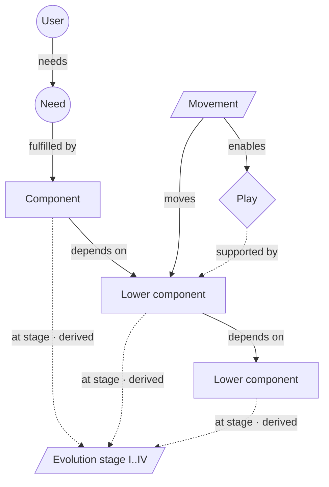

# Wardley Mapping

> Anchors on a user, runs their need down a value chain, and spreads that chain across an evolution axis, so a component sitting at the wrong stage becomes a move you can see. Category: Sensemaking & Complex Systems. Reference: [Wardley map](https://en.wikipedia.org/wiki/Wardley_map). [Open the 3D graph](./index.html) (needs internet for Three.js; on GitHub open via Pages or clone).

## What this graph derived

Given that Poolside's Eiso Kant told TBPN on 16 October 2025 that frontier intelligence is a commodity sold as tokens behind an API, that his defense customers need it running in air-gapped, ATO-bound sites, and that at 250 megawatts of powered data-centre shell there is no one left to call, applying Wardley Mapping we derived that intelligence is finishing its slide into a metered utility, that the powered shell is the one component stuck at custom-built while demand outruns supply, and that Poolside's truckable skid is a first repeatable unit; the opportunity that falls out is selling factory-built data-hall skids as a standard product, and a vendor-neutral layer taking any frontier model into air-gapped and edge environments.

Given a tea shop owner's notes that customers want a good cup of tea served fast, that tea, cups and power are bought in for pennies, and that staff still spend the first hour of every morning boiling and descaling kettles identical to every rival's, applying Wardley Mapping we derived that hot water is the one component the shop still makes by hand while everything beneath it is already bought in, that the kettle has become an undifferentiated commodity, and that hot water is heading for metered utility; what the reader gains is the exposed assumption that the morning ritual is unavoidable, and two plays: buy hot water on tap, and compete on the tea, the blend and the room.

## What it decomposes

Simon Wardley's map takes apart a business, a product or a stack. Its object is the chain of things that must exist for one user to get one need met, plus a verdict on how industrialised each is. The vertical axis is the value chain: the higher a component sits, the more visible it is to the user. The horizontal axis is evolution, in four stages — Genesis, Custom-built, Product (including rental), Commodity (including utility) — along which a component travels left to right, from a one-off nobody knows how to build to something metered and bought without thought.

Three things are forced into the open. First, an anchor: the map means nothing without a named user whose need everything below exists to serve. Second, a chain that runs all the way down, past the interesting layers to the boring ones, because the constraint usually lives in a layer nobody thinks about. Third, and least comfortable, a stage for every component — a verdict about the market rather than the team's roadmap, and one that can be wrong in a checkable way.

Without it, capabilities are a list on a slide, all apparently equal, and the two standard errors follow: building what should be bought, buying what should be built. Commoditisation gets discussed as a mood ("AI is commoditising") rather than as a disputable claim about one named component. The payoff is the reverse: a component with real demand and no purchasable supply is the shape of an underserved market, which is why the play slot is where the ideas come from — and why this framework's central provenance rule is the one below. The components a source names are facts; where each one sits on the evolution axis is a judgement someone made.

## The slots



| Slot | What goes here | Typical provenance | Why that provenance |
|---|---|---|---|
| User | The person or organisation the map is anchored on. | either | Usually named by a speaker saying who he sells to; inferred when only the need is discussed. |
| Need | What that user needs, in the user's terms. | either | Often stated as a benefit ("increase revenue"); inferred when the speaker only names his product. |
| Component | A capability, practice or piece of the stack the need depends on. | fact | A component nobody named is invented; the map is only as good as the chain the source walks. |
| Evolution stage | Genesis, Custom-built, Product (+rental), Commodity (+utility). | schema | Scaffolding: the four bands of the x axis, identical in every map; no quote, no confidence, excluded from the counts. |
| Movement | A predicted shift of a component along the axis. | derived | A prediction is reasoning about climatic patterns, even when a speaker gestures at it. |
| Play | The move the map suggests: build, buy, commoditise, exit, wait. | derived | The map's output, read off the positions. A fact when a speaker states his own play on air. |

The rule that matters most here concerns `at_stage`. That a shop uses kettles is a fact; that kettles are at the Product stage is a derived judgement, recorded as an explicit `at_stage` edge with its own `confidence` and `rationale`, never silently baked into the component's x coordinate. The x position on the page renders that edge, nothing more. Hide the derived layer and every `at_stage` edge disappears, leaving the value chain above four empty stage markers — precisely what the source alone supports. Most Wardley graphs get this wrong by storing evolution as a number on the node, at which point the map's most contestable claim becomes the one thing nobody can question.

## Example 1: The tea shop: a value chain from the customer down to the wall socket

Wardley's teaching map, written as a shop owner's notes so the fact nodes have something to quote. (Original scenario for this library, after the canonical "cup of tea" map, *Wardley Maps* chapter 2.)

### Source text

> Notes from the owner of a high-street tea shop, written before a strategy review.
>
> Our customers come in for one thing: a good cup of tea, served fast. To make one we need tea, hot water and a cup. The hot water comes from a kettle, and the kettle needs water and power. We buy the tea from a wholesaler and the cups from a catering supplier; both arrive the next day and cost pennies. The kettle is a commercial model we picked out of a catalogue, and we bought four of them. Power comes out of the wall and we pay by the unit; nobody here thinks about it. What we do think about is that our staff spend the first hour of every morning boiling, refilling and descaling kettles, and that every tea shop on this street does exactly the same thing with the same equipment.

### Decomposition

Seventeen nodes: nine facts, four inferences, four schema markers. Twenty-four edges: eight facts, sixteen inferences.

User

- `u1` **Walk-in customers** [fact] The people who walk into the shop. The whole map is anchored on them: every component below exists only because they want something. "Our customers come in for one thing" (shop owner's notes, sentence 2)

Need

- `n1` **A good cup of tea, served fast** [fact] The customer's need, stated in the customer's terms: a good cup of tea, quickly. Not "a kettle" and not "hot water". "a good cup of tea, served fast" (shop owner's notes, sentence 2)

Component

- `c_hot` **Hot water** [fact] Hot water at the counter, on demand. The shop produces it rather than buying it. "The hot water comes from a kettle" (shop owner's notes, sentence 4)
- `c_tea` **Tea leaves** [fact] Tea bought in from a wholesaler, delivered next day at a price the owner describes as pennies. "We buy the tea from a wholesaler" (shop owner's notes, sentence 5)
- `c_cup` **Cups** [fact] Cups bought from a catering supplier, next-day delivery, negligible unit cost. "the cups from a catering supplier; both arrive the next day and cost pennies" (shop owner's notes, sentence 5)
- `c_kettle` **Kettles** [fact] Four commercial kettles chosen from a catalogue: one of several substitutable models on the market. "The kettle is a commercial model we picked out of a catalogue, and we bought four of them." (shop owner's notes, sentence 6)
- `c_staff` **Staff boiling and descaling** [fact] The manual practice of boiling, refilling and descaling kettles: an hour of staff time every morning. "our staff spend the first hour of every morning boiling, refilling and descaling kettles" (shop owner's notes, sentence 8)
- `c_water` **Mains water** [fact] Water from the mains, needed by the kettle. "the kettle needs water and power" (shop owner's notes, sentence 4)
- `c_power` **Electric power** [fact] Electricity from the wall, metered and billed by the unit; nobody in the shop thinks about it. "Power comes out of the wall and we pay by the unit; nobody here thinks about it." (shop owner's notes, sentence 7)

Evolution stage (schema: the same four markers in every map, no quote and no confidence)

- `s1` **Genesis** [schema] Genesis: the component is novel and uncertain; it is built by hand because nothing to buy exists yet.
- `s2` **Custom-built** [schema] Custom-built: the component is understood well enough to build deliberately, but every instance is bespoke.
- `s3` **Product/rental** [schema] Product: competing, substitutable versions can be bought or rented; the differences are features, not existence.
- `s4` **Commodity/utility** [schema] Commodity or utility: the component is undifferentiated, metered and bought without thought.

Movement

- `m1` **Hot water → metered utility** [derived 0.60] Hot water stops being something the shop makes with kettles and staff time and becomes something it draws from a plumbed-in boiler tap, metered like water and power. Rationale: Everything hot water depends on (kettle, water, power) is already Product or Commodity, and the only remaining custom part is an hour of manual labour a day. Wardley's climatic pattern is that such a component keeps industrialising; the counter-argument is that a tea shop's scale may never justify the plumbing, so this stays contestable.
- `m2` **Kettles → undifferentiated** [derived 0.70] The kettle finishes its slide from product to commodity: every shop on the street already runs the same equipment, so the model chosen stops mattering. Rationale: The owner notes that every tea shop on the street uses the same equipment, which is the signature of a component whose feature differences no longer decide anything. That is the Product-to-Commodity transition in Wardley's terms.

Play

- `p1` **Buy hot water on tap** [derived 0.60] Plumb in a metered boiler tap, retire the kettles and the morning ritual, and spend the reclaimed hour on the counter. Rationale: If hot water is heading for utility, the shop can stop being the thing that industrialises it and simply buy the industrialised version, converting a fixed morning labour cost into a metered one.
- `p2` **Compete above the utility line** [derived 0.65] Accept that everything below the counter is bought in and identical to the competition, and differentiate on the tea, the blend and the room instead. Rationale: The map has nothing in Genesis and almost everything in Product or Commodity, so no advantage can come from the lower value chain; the only uncharted space left is what the customer actually experiences.

Fact edges. Eight, each joining two fact nodes with the owner's own connective quoted:

- `ce1` `u1` -> `n1` (needs) [fact] "Our customers come in for one thing: a good cup of tea, served fast." (sentence 2)
- `ce2` `n1` -> `c_tea` (fulfilled_by) [fact] "To make one we need tea, hot water and a cup." (sentence 3)
- `ce3` `n1` -> `c_hot` (fulfilled_by) [fact] the same span (sentence 3)
- `ce4` `n1` -> `c_cup` (fulfilled_by) [fact] the same span (sentence 3)
- `ce5` `c_hot` -> `c_kettle` (depends_on) [fact] "The hot water comes from a kettle, and the kettle needs water and power." (sentence 4)
- `ce6` `c_kettle` -> `c_water` (depends_on) [fact] "the kettle needs water and power" (sentence 4)
- `ce7` `c_kettle` -> `c_power` (depends_on) [fact] the same span (sentence 4)
- `ce8` `c_kettle` -> `c_staff` (depends_on) [fact] "our staff spend the first hour of every morning boiling, refilling and descaling kettles" (sentence 8)

Derived `at_stage` edges. Seven, one per component, each carrying the placement that the page draws as an x position:

- `cs1` `c_tea` -> `s4` [derived 0.80] Bought from a wholesaler, next-day, at pennies: substitutable supply at a metered price is the commodity signature.
- `cs2` `c_cup` -> `s4` [derived 0.85] Catering-supplier cups delivered next day for pennies are undifferentiated and bought without thought.
- `cs3` `c_kettle` -> `s3` [derived 0.90] "A commercial model we picked out of a catalogue" is close to the definition of the Product stage: competing, substitutable versions chosen on features.
- `cs4` `c_water` -> `s4` [derived 0.90] Mains water is metered, ubiquitous and invisible to the buyer: the utility end of the axis.
- `cs5` `c_power` -> `s4` [derived 0.95] "Comes out of the wall and we pay by the unit; nobody here thinks about it" is the textbook description of a utility.
- `cs6` `c_hot` -> `s2` [derived 0.70] The shop assembles hot water itself from kettles, water, power and labour rather than buying it, which puts the component itself at Custom-built even though all of its parts are industrialised.
- `cs7` `c_staff` -> `s2` [derived 0.70] A manual in-house practice that every shop repeats independently is custom-built: it is deliberate and understood, but nobody sells it as a product.

The remaining nine derived edges: `cm1` `m1` -> `c_hot` (moves, 0.60), `cm2` `m2` -> `c_kettle` (moves, 0.70), `cm3` `m1` -> `p1` (enables, 0.60), `cm4` `m2` -> `p2` (enables, 0.60); and five grounding links, `cg1` `m1` -> `c_staff` (0.65), `cg2` `m2` -> `c_kettle` (0.70), `cg3` `p1` -> `c_power` (0.60), `cg4` `p2` -> `c_tea` (0.60), `cg5` `p1` -> `c_staff` (0.60).

### What the LLM added and why it helps

Hide the derived layer and the map collapses into the owner's notes: a customer, a need, seven components wired by "we need", "comes from" and "needs", and four stage markers with nothing attached. Every horizontal position is gone, because every position is an `at_stage` edge and every `at_stage` edge is derived. That is the honest picture: the owner wrote what he buys and does, never that kettles are at Product and power at Commodity.

The seven placements are the first thing the LLM adds, and their confidences are not decoration. Power at 0.95 is nearly forced: metered, billed by the unit, unthought-of. Kettles at 0.90 rest on a phrase — chosen from a catalogue — that is almost the definition of the Product stage. Hot water at 0.70 is the interesting one: every input to it is industrialised, yet the component itself sits at Custom-built, because the shop assembles it in-house with labour and nobody sells it. That gap between an industrialised substrate and a hand-made output is the signature of a component about to move, which is what `m1` predicts at 0.60 and `p1` proposes acting on.

`m2` (0.70) reads a fact about the street — every shop uses the same equipment — as evidence of a stage transition, an inference rather than a restatement. `p2` (0.65) reads the whole map instead of any single node: nothing in Genesis, almost everything at Product or Commodity, therefore no advantage below the counter. The empty Genesis band is visible on the page in both the default and facts-only views, and it is a finding rather than a gap: a map with nothing uncharted on it has no source of new value in its own value chain, which is exactly why the play has to move up to the tea, the blend and the room. The reader gains a decision with its reasoning attached, and a place to disagree: challenge `cs6` and both `m1` and `p1` lose their footing.

## Example 2: from the TBPN transcripts: Poolside's stack: intelligence is a commodity, the shell underneath it is not

Episode "Google's AI Breakthrough in Cancer, Protein Powders Exposed (Marc Benioff, Eiso Kant, Dante Vaisbort, Alice Bentinck, Eric Seufert, Pim de Witte)", 2025-10-16, [transcript](../../../tbpn-transcripts/transcripts/2025-10-16_googles-ai-breakthrough-in-cancer-protein-powders-exposed-marc-benioff-eiso-kant-dante-vaisbort-alice-bentinck-eric-seufert-pim-de-witte.md); line numbers refer to it.

In one uninterrupted interview (L4128-L4494) Eiso Kant names every layer of Poolside's value chain from the knowledge workforce down to grid power, with an industrialisation verdict on most of them: intelligence is "a commodity", tokens behind an API are "your commodity business", the RL environment was hand-built over two and a half years, GPU capacity is rented but sold out into 2027, and at 250MW of powered shell "there's no one you can call". A map needs exactly that combination of an anchored value chain and stage evidence, and it is rare to hear a supplier call his own product a commodity on air.

Twenty-three nodes: fourteen facts, five inferences, four schema markers. Thirty-five edges: seven facts, twenty-eight inferences. No paraphrases. The stage markers `s1`-`s4` are the same schema nodes listed under Example 1; being scaffolding, they are excluded from both counts.

### Facts (quoted)

User

- `u1` **The knowledge workforce** [fact] The user Poolside anchors on: enterprises and the knowledge workforce inside them, in the world's most high-consequence environments. "And from day zero, we wanted to be for the world's, frankly, knowledge workforce. We wanted to be for the enterprise. We wanted to be for the world's most high-consequence environments." (Eiso Kant, L4248-L4252)
- `u2` **Defense and government** [fact] The first customer segment Poolside sold into, chosen because nobody else was there. "But when we weren't at the frontier, we kind of decided to cut our teeth in a go-to-market area, which was really no one else was out, which was defense and government." (Eiso Kant, L4258-L4260)

Need

- `n1` **Grow revenue or cut cost** [fact] What the enterprise buyer actually needs: something that raises revenue or improves the cost basis. Not tokens. "You want to be in a business that either increases someone's revenue, right or improves their cost basis like it helps them grow their business" (Eiso Kant, L4426-L4428)
- `n2` **Run it in high-consequence places** [fact] The defense and government need: the model has to run in air-gapped environments, GovClouds and places that require an ATO, down to workstations and Humvees. "all the way to like the larger models and like air gaped environments or guff clouds or places where you needed ATOs." (Eiso Kant, L4270)

Component

- `c1` **Coding agents** [fact] The product the need is served through first: coding agents, chosen because developers adopt earliest. "Not just with coding agents, by the way, that's been really our starting point. It was our view that's where the market was first going to go adopt." (Eiso Kant, L4274-L4276)
- `c2` **Enterprise deployment stack** [fact] The stack built alongside the model so it can be deployed anywhere the customer is: workstations, Humvees, air-gapped sites, GovClouds, ATOs. "And so kind of our first customers were not just building the model, but also putting all the crazy enterprise stack to be able to deploy it anywhere." (Eiso Kant, L4264-L4266)
- `c3` **Tokens behind an API** [fact] The delivery form of intelligence and, in Kant's words, the commodity business: selling tokens through an API, where only cost and scale matter. "You're just selling your tokens behind an API, and that's your commodity business." (Eiso Kant, L4238)
- `c4` **Frontier intelligence** [fact] The foundation model itself. Kant calls intelligence a commodity produced by only a handful of companies, with no large differences between models at the limit. "And in that world, intelligence in our view is a commodity. It's actually a commodity that gets created by only a small number of companies because it is sheer amount of resources and kind of compounding efforts that go into it." (Eiso Kant, L4226-L4230)
- `c5` **RL environment** [fact] Two and a half years of hand-building: a million real-world code bases in which agents can run hundreds of billions of tasks. Nobody sells this. "years building what I believe is the largest RL environment in the world. It's a million real world code basis where our agents can do hundreds and hundreds of billions of tasks." (Eiso Kant, L4302-L4304)
- `c6` **GPU compute** [fact] More than 40,000 GB300s brought online through a partnership with CoreWeave, after 10,000 H200s in the preceding two and a half years. "And we got really excited because we found the path to partner with CoreWeave that brought online more than 40,000 GB300s really quickly." (Eiso Kant, L4340)
- `c7` **Powered data-centre shells** [fact] The layer Kant names as the real bottleneck: bringing chips and power together into powered shells that are actually online. At 50MW he could call someone last year; at 250MW, he says, there is no one you can call. "The actual bottleneck is bringing it all together and actually having powered shells like data centers online. Because, well, last year I could call someone for 50 megawatts and I could kind of, you know, get it within six to nine months. If I needed to call someone for 250 megawatts, guys, there's no one you can call." (Eiso Kant, L4380-L4384)
- `c8` **Modular skids on a flatbed** [fact] Poolside's answer to the shell problem: a data hall decomposed into an electrical skid, a cooling skid and a compute skid, manufactured off-site and sized to a flatbed truck. "So a data center for a GPU compute is effectively three layers. It's an electrical skid. It's a cooling skid and it's a compute skid. And you actually designed them that they fit on the back of a flatbed truck." (Eiso Kant, L4488-L4494)
- `c9` **Grid power and gas** [fact] Energy: 400-kilovolt grid electricity and, on Poolside's own land, six gigawatts of gas turned into electricity by turbines. "There's a lot of like 400-kilovolt electricity that comes off the grid. There's a lot of sources of energy in the United States." (Eiso Kant, L4374-L4376)

Play

- `pl1` **Own the vertical stack** [fact] The play Kant states outright: because the layers that matter are energy, compute and intelligence, and the shell layer cannot be bought, Poolside owns the whole stack. "And so we understood that we had to own that vertical stack entirely if we were going to be able to secure our future." (Eiso Kant, L4392)

Fact edges. Seven, each joining two fact nodes with the connection stated in one turn and quoted:

- `te1` `n2` -> `c2` (fulfilled_by) [fact] "And so kind of our first customers were not just building the model, but also putting all the crazy enterprise stack to be able to deploy it anywhere. Like literally, and workstations and Humveys. all the way to like the larger models and like air gaped environments or guff clouds or places where you needed ATOs." (Eiso Kant, L4264-L4270)
- `te2` `c1` -> `c4` (depends_on) [fact] "hopefully those products just get better for the customers as the underlying intelligence improves" (host (Jordi Hayes), L4404-L4406)
- `te3` `c3` -> `c4` (depends_on) [fact] "And so I think as a foundation model company, you're in two businesses. You're on one hand in what I often refer to internally is that the barrels of oil business, right? You're just selling your tokens behind an API, and that's your commodity business." (Eiso Kant, L4234-L4238)
- `te4` `c4` -> `c5` (depends_on) [fact] "it was going to be clear that coding was going to be the first domain where we could do that through reinforcement learning because we could simulate it. So we spent the last two and a half years building what I believe is the largest RL environment in the world." (Eiso Kant, L4298-L4302)
- `te5` `c4` -> `c6` (depends_on) [fact] "So we needed a lot of GPUs very fast because we saw now that, hey, we had gotten to a point where our models had gotten so good now that we knew if we'd skilled them up, we'd be on track to be at where the frontier was going to be." (Eiso Kant, L4332-L4336)
- `te6` `c6` -> `c7` (depends_on) [fact] "So the true bottleneck in our industry is not chips, and it's not energy. There's a lot of like 400-kilovolt electricity that comes off the grid. There's a lot of sources of energy in the United States. And while it's the limit it is the bottleneck, it's not the immediate bottleneck. The actual bottleneck is bringing it all together and actually having powered shells like data centers online." (Eiso Kant, L4372-L4380)
- `te7` `c7` -> `c8` (depends_on) [fact] "So a data center for a GPU compute is effectively three layers. It's an electrical skid. It's a cooling skid and it's a compute skid." (Eiso Kant, L4488-L4492)

Only seven of the thirteen value-chain edges qualify as facts, and one of the seven is a judgement call. `te2` joins two of Kant's fact nodes, but the connective is spoken by the host rather than the guest, in Kant's presence and unchallenged. The rule requires that one speaker's turn state the connection, not that it be the speaker who supplied both endpoints, so this passes — but it is the weakest fact edge on the map, and a stricter reading would demote it to derived at about 0.85. Everything not in this list is derived, including dependencies obvious to any reader, because Kant names the two ends in different breaths.

### Decomposition

Movement

- `m1` **Intelligence → utility** [derived 0.80] Frontier intelligence and the tokens it is sold as finish crossing into the commodity band: priced per unit, bought on cost and scale, with no meaningful difference between suppliers. Rationale: Kant states the destination himself, twice, and gives the mechanism: at the limit there are no large differences between foundation models, so the buyer is left with cost and scale, which is what a utility competes on. He is a supplier predicting his own product's commoditisation, which is unusual enough to take seriously. Supported by `c3`; moves `c4`.
- `m2` **Powered shells → product** [derived 0.70] The 250MW powered shell stops being a bespoke, multi-billion-dollar, fifteen-year negotiation and becomes something orderable: a repeatable unit with a lead time and a price. Rationale: Kant describes the exact conditions under which a component industrialises: demand far exceeding supply, no vendor to call, and a first attempt at a repeatable unit (the truckable skid) already being manufactured. Wardley's pattern is that componentisation of this kind precedes the Product stage; the open question is whether the incumbents keep it bespoke. Supported by `c8`; moves `c7`.
- `m3` **Rented compute unclogs** [derived 0.55] Frontier-scale GPU rental stops being sold out and returns to an orderable product with normal lead times, once the 2026-27 shells land. Rationale: Kant says the scale of compute he needed is sold out through 2026 and into 2027, which prices a shortage with an end date rather than a permanent condition. Whether supply actually catches demand is exactly the contested part, so this stays in the plausible-but-contestable band. Supported by `c6`; moves `c6`.

Play (`pl1` is the stated one, quoted above)

- `pl2` **Sell the shell as a product** [derived 0.60] Turn the truckable electrical, cooling and compute skids into a product other people can order, instead of an internal answer to Poolside's own supply problem. Rationale: Kant says that at 250MW there is no one to call, and separately that Poolside has designed a repeatable, factory-built, road-legal unit for itself. The gap between a component in demand and a component nobody sells is where a product business fits; the risk is that the skid design is only economic at Poolside's own scale. Supported by `c7`, `c8`. Carries an `idea` field, quoted under "Where the opportunity shows up".
- `pl3` **Productise deployment** [derived 0.60] If the model layer is a commodity, the defensible position is the bespoke layer above it: the stack that gets a frontier model into an air-gapped site, a GovCloud, an ATO, a workstation or a Humvee. Rationale: Kant treats intelligence as a commodity and the enterprise deployment stack as something his first customers had to have built for them, which is the standard shape of an underserved market: high, stated demand and no purchasable version. The counter-argument is that accreditation work may be irreducibly per-customer. Supported by `c2`, `n2`. Carries an `idea` field, quoted under "Where the opportunity shows up".

Derived `at_stage` edges. Nine, one per component; these and only these set the horizontal positions on the page:

- `ts1` `c1` -> `s3` Product [derived 0.70] Earlier in the same segment the host lists codex, cloud code, windsurf and cursor as the field; several substitutable offerings competing on features is the Product stage.
- `ts2` `c2` -> `s2` Custom-built [derived 0.75] Built by Poolside for its own first customers, per environment, with nothing named that could have been bought instead: custom-built.
- `ts3` `c3` -> `s4` Commodity [derived 0.85] Kant calls tokens behind an API his commodity business outright and says the only things that matter there are cost and scale.
- `ts4` `c4` -> `s3` Product [derived 0.70] Kant calls intelligence a commodity, but in the same breath says it is created by only a small number of companies because of the sheer resources required. A handful of substitutable suppliers competing on capability is the Product stage; his "commodity" is better read as where the component is going than where it is, which is what movement `m1` records.
- `ts5` `c5` -> `s1` Genesis [derived 0.75] A one-of-a-kind artefact built over two and a half years, described as the largest in the world, with no vendor mentioned: genesis.
- `ts6` `c6` -> `s3` Product [derived 0.80] GPU capacity is rented from a named vendor under a commercial partnership, which is the rental half of the Product stage; the sold-out supply keeps it short of utility.
- `ts7` `c7` -> `s2` Custom-built [derived 0.85] "If I needed to call someone for 250 megawatts, guys, there's no one you can call" states that no product form of this component exists at the size required; what is available is a bespoke fifteen-year lease.
- `ts8` `c8` -> `s1` Genesis [derived 0.65] The skid decomposition is Poolside's own design, described as unusual and not covered in the press; novel and unproven puts it at genesis, though modular data halls exist elsewhere in the industry, which is why this is the least certain placement on the map.
- `ts9` `c9` -> `s4` Commodity [derived 0.90] Grid electricity is metered and abundant in Kant's own account ("there's a lot of sources of energy in the United States"), which is the utility end of the axis.

Derived value-chain edges. Six, where Kant names both ends but never in one breath:

- `te8` `u1` -> `n1` (needs) [derived 0.80] Kant names the enterprise as the user in one passage and the revenue-or-cost-basis test in another; joining the two is the reader's inference, not a sentence he says.
- `te9` `u2` -> `n2` (needs) [derived 0.85] The air-gapped, GovCloud and ATO requirements are described as what the first customers needed, and those customers are defense and government; the link is one step of joining.
- `te10` `n1` -> `c1` (fulfilled_by) [derived 0.70] Coding agents are named as the starting product and the revenue-or-cost test as the business Poolside wants to be in, but nowhere does Kant say that the agents are how that need is met.
- `te11` `c2` -> `c4` (depends_on) [derived 0.90] The deployment stack exists to put the model somewhere, which the source states as a pairing ("not just building the model, but also...") rather than as a dependency.
- `te12` `c7` -> `c9` (depends_on) [derived 0.90] A powered shell is by definition a shell plus power, and Kant names energy as one of the three layers that matter, but he never states the dependency in a single span.
- `te13` `c5` -> `c6` (depends_on) [derived 0.60] Running hundreds of billions of agent tasks in a simulated environment consumes compute; Kant discusses the two separately and never connects them.

Movement and play edges. Six: `tm1` `m1` -> `c4` (moves, 0.80), `tm2` `m2` -> `c7` (moves, 0.70), `tm3` `m3` -> `c6` (moves, 0.55), `tm4` `m1` -> `pl1` (enables, 0.75, "Kant draws the line himself: if intelligence is a barrel of oil someone else will deliver, you compete on cost and scale, hence infrastructure and vertical integration"), `tm5` `m2` -> `pl2` (enables, 0.60), `tm6` `m1` -> `pl3` (enables, 0.60, "Commoditisation of the layer below is what makes the layer above worth productising: the value moves to whatever is still bespoke").

Grounding links, all derived `supported_by`: `tg1` `m1` -> `c3` (0.85), `tg2` `m2` -> `c8` (0.70), `tg3` `m3` -> `c6` (0.55), `tg4` `pl2` -> `c7` (0.65), `tg5` `pl2` -> `c8` (0.60), `tg6` `pl3` -> `c2` (0.60), `tg7` `pl3` -> `n2` (0.60).

### What the LLM added

The fact layer here is unusually rich — Kant walks his value chain from the knowledge workforce down to 400-kilovolt grid power, and states one play himself — and on its own it is still a ladder with no horizontal dimension. Hide the derived items and all nine `at_stage` edges vanish with the six inferred dependencies, leaving seven quoted dependencies, four users and needs, one stated play, and four empty stage markers. Placement is the LLM's first contribution: nine judgements, each with its own confidence.

Four fact nodes come loose in that view, and it is worth knowing why before reading it as a bug. `u1` and `n1` float because Kant names the enterprise user in one passage and the revenue-or-cost test in another, so `te8` and `te10` are inferences; `c9` floats because a powered shell needing power is so obvious that nobody says it (`te12`, 0.90); `pl1` floats because the only edge into a play is `enables`, and the movement that enables it is derived. A Wardley map assembled from quotes alone is a chain with four orphans, which is a fair summary of what one interview gives you.

`ts4` is the most instructive edge on either map. Kant says in terms that intelligence is a commodity, and the map still puts frontier intelligence at Product (`s3`), at 0.70. The reason is in the same breath: intelligence "gets created by only a small number of companies because it is sheer amount of resources and kind of compounding efforts that go into it". A handful of well-capitalised suppliers competing on capability is the Product stage; commodity means undifferentiated, metered and bought without thought, which is what he predicts rather than what he describes. His word is therefore recorded as the destination, in movement `m1` at 0.80, and not as the position — a speaker's stage vocabulary is a claim to weigh against the market structure he himself describes, and splitting it across two nodes lets a reader dispute the reading without losing the quote. `c3`, tokens behind an API, does sit at Commodity (0.85): the delivery form really is bought on cost and scale, while the intelligence behind it is not yet.

The play slot is derived here, as usual, with one exception: `pl1` is a fact, because Kant states his own move on air ("we had to own that vertical stack entirely"). A stated play is rare, and it changes what the derived plays must do. `pl2` and `pl3` (both 0.60) are not paraphrases of his move but the moves his map makes available to someone else: he owns the stack because no vendor sells the shell layer, and `pl2` proposes being that vendor; he treats the deployment stack as overhead his customers forced on him, and `pl3` observes that a bespoke layer above a commoditising one is where value collects. Both are read off positions rather than off anything he said, which is why they sit in the contestable band with counter-arguments in their rationales.

### Where the opportunity shows up

The idea-bearing slot is the play (`idea_bearing_slot: "play"`), for a structural reason: a component at the wrong stage — stated demand at scale, no purchasable supply — *is* an underserved market, and the play is where that mismatch becomes a move. Two derived nodes carry an `idea` field.

- `pl2` **Sell the shell as a product**, derived, confidence 0.60. Idea: "Factory-built, truckable 2MW data-hall skids sold as a standard product would serve every AI company that needs 50-250MW but cannot sign a fifteen-year, multi-billion-dollar lease." Read from the node: `ts7` puts powered shells at Custom-built at 0.85 on the strength of "there's no one you can call", while `c8` shows a repeatable, road-legal unit already designed inside one buyer. Demand at Genesis-to-Custom supply is the gap; the risk in the rationale is that the skid may only pay at Poolside's own scale.
- `pl3` **Productise deployment**, derived, confidence 0.60. Idea: "A vendor-neutral deployment layer that takes any frontier model into air-gapped, ATO-bound and edge environments would sell to every lab that wants defense revenue without building the compliance stack itself." Read from the node: `ts2` puts the deployment stack at Custom-built at 0.75, `n2` is the quoted demand, and `m1` says the layer beneath it is commoditising. The counter-argument, stated in the rationale, is that accreditation may be irreducibly per-customer.

Both sit at 0.60, contestable, and both rest on an `at_stage` judgement rather than on anything a speaker asserted — the honest position for an idea read off a map. `pl1` carries no `idea`, correctly: it is Poolside's own move, already made. `m3` (0.55) yields no play at all; a shortage with an end date is a timing observation, not a market. When ranking these graphs for opportunities, the number that matters is the confidence on the `at_stage` edge underneath the play: `pl2` rests on a 0.85 placement, which is what makes a 0.60 idea worth acting on.

## Building a knowledge graph with this framework

### Node and edge types

Node types are the six slots: `user` and `need` at the top, a `component` DAG beneath them ordered by visibility, `movement` and `play` hanging off the components they concern, and four `stage` nodes that are pure scaffolding (`structural: true`, `provenance: "schema"`, no quote, no confidence, not counted). Edges: `needs` (user to need), `fulfilled_by` (need to the highest components), `depends_on` (component to a lower, less visible one), `at_stage` (component to one of `s1`-`s4`, always derived), `moves` (movement to component), `enables` (movement to play), `supported_by` (derived to fact, always derived).

`at_stage` carries the framework's whole lesson, so the storage decision is worth stating. Evolution is *not* a property of a component node and *not* an x coordinate written on it; it is a derived edge with `confidence` and `rationale`. The `pos` field renders that edge for the plane layout — the two must agree, but the edge is the claim and `pos` only its picture; store it on the node instead and the confidence, the reasoning and the ability to hide it are all lost. Every component here has exactly one `at_stage` edge, and the fact/derived toggle removes all of them at once.

Two rendering notes for a Wardley-literate reader of the 3D page. The `play` nodes are drawn in a strip below the four evolution bands, behind a dashed guide labelled "plays read off the map", because a play is a decision the map argues for, not a component with a position on it; their horizontal placement is spacing, not a stage claim. And second: `moves` runs movement to component, so the arrowhead lands on the component, and since each movement cone is drawn in the band the component is heading for, that one arrow points right to left, against the direction of evolution. The cone's position carries the prediction and its label states the direction ("Intelligence &rarr; utility"); the arrow only says which component the movement is about. An arrow drawn from the component towards its destination would read better, but it would mean reversing the relation and losing the subject of the prediction.

### Fact or derived: rules of thumb

- **User.** Extracted when a speaker names who he sells to ("we wanted to be for the enterprise"). Inferred when only a product is discussed; worth doing, because an unanchored map cannot be read — every stage judgement is implicitly "for whom". If genuinely absent, do not invent a persona: say so, and call the result a supply-chain sketch.
- **Need.** Extracted when stated in the user's terms ("increases someone's revenue... or improves their cost basis"). Inferred when the speaker names only his product, the need being that product's purpose one level up; worth it because `fulfilled_by` stops the top of the chain being a catalogue. Empty: one generic need under the user, and lower confidence above the component layer.
- **Component.** Extracted, essentially always. A component nobody named is an invented fact, however obviously it must exist; the exception is one named only by what it does, whose quote is that description. Where the chain has a hole (Kant never names networking, cooling water or land), leave it: a missing rung is information about the interview.
- **Evolution stage.** Schema, always: four fixed markers, identical in every map so maps stay comparable. Never treat them as content and never add a fifth.
- **`at_stage`.** Derived, always, and the rule most implementations break. Extraction gives the evidence — how the component is acquired, from how many suppliers, at what price granularity, with how much thought — and the placement is that evidence read against the four stage definitions. Confidence tracks how directly the two match: 0.85-0.95 when the source describes acquisition in almost the stage's own words (`cs5`, `ts9`, `ts3`), 0.70-0.85 for a standard reading (`cs3`, `ts6`, `ts7`), 0.50-0.70 when the evidence is thin or the stage is contested (`ts8` at 0.65). A speaker's own stage vocabulary is evidence about his beliefs, not the market: quote it in the rationale, and where it conflicts with the structure he describes, record the tension as a movement (`ts4` against `m1`).
- **Movement.** Derived, always, even when a speaker predicts it, because a prediction is reasoning about climatic patterns rather than an observation. Two grounds justify one: the component's inputs are industrialised while the component itself is hand-made (`m1`), or demand exceeds supply and a repeatable unit is appearing (`m2`). Confidence 0.55-0.80; above 0.85 it is usually a placement in disguise.
- **Play.** Derived, normally, and the idea-bearing slot. Read it off the map, not the transcript: high demand at Custom-built suggests build-or-sell, Commodity suggests buy and stop caring, a chain with nothing left of Product says compete above the line. A fact when the speaker states his own move on air (`pl1`), carrying no `idea` — his move is not the reader's opportunity. Empty is acceptable: a map with no defensible play is a finding.

### Extraction recipe

```text
Build ONE Wardley map from <file>, lines <a>-<b>.
1. User: who the speaker says the offering is for (fact if named, else derived).
2. Need: what that user wants, in the user's terms, not the supplier's.
3. Components: every capability, practice or layer the speaker NAMES, as fact
   nodes with a verbatim span of 5+ words. No span, no node. Do not add layers
   the speaker did not mention, however obvious.
4. Value chain edges: needs / fulfilled_by / depends_on, the more visible
   component always the higher one. Mark an edge `fact` ONLY IF both endpoints
   are fact nodes AND one turn states the connection, quoted verbatim. A
   speaker naming both ends in different breaths is `derived` with a
   confidence.
5. Stages: emit the four schema nodes s1 Genesis, s2 Custom-built,
   s3 Product(+rental), s4 Commodity(+utility). provenance "schema".
6. at_stage: for EACH component, one derived edge to exactly one stage, with
   confidence and a rationale that cites the acquisition evidence (built by
   hand / bespoke per instance / bought or rented from competing vendors /
   metered and unthought-of). Never write evolution onto the node. A speaker
   calling something "a commodity" is a claim to weigh, not a placement.
7. Movement: where the inputs are industrialised but the component is not, or
   demand exceeds supply and a repeatable unit is appearing. Derived, 0.55-0.80,
   with the counter-argument in the rationale. `moves` -> the component.
8. Play: read off the positions, not off the transcript. `enables` from the
   movement. Put the underserved need or startup idea in the node's `idea`
   field, never in the rationale. A play the speaker states himself is a fact
   node with no `idea`.
9. supported_by from every derived node to the fact nodes it rests on.
Output one graph.json example: nodes [{id, slot, label <=40 chars, text,
provenance, source_quote+source_ref | confidence+rationale, idea?, entities}],
edges [{id, from, to, relation, provenance, confidence?, source_quote?,
source_ref?, rationale?}], idea_bearing_slot "play".
```

Afterwards run `node _meta/validate.mjs <dir>` for quotes, confidences and grounding, then five checks it cannot make: every component has exactly one `at_stage` edge and none carries a stage as a property; every component's `pos[0]` falls inside the band its `at_stage` edge points to; hiding derived items leaves a chain still true to the source, with the four stage markers empty; every `depends_on` runs from a more visible component to a less visible one; and no rationale carries the business idea, which belongs in `idea`.

### Failure modes

- **Placing on x by time.** New things left, old right. Guard: evolution is not age. A component invented last year that three vendors sell is at Product; a fifty-year-old practice still hand-built in every shop is at Custom-built (`c_staff`). Rationales cite acquisition evidence, not dates.
- **Placing on x by adoption.** Popular means industrialised. Guard: ubiquity is a symptom, not the test. Coding agents are widely adopted and still at Product (`ts1`): the offerings differ and buyers choose between them.
- **Placing on x by preference.** Our differentiator goes left, the boring parts right. Guard: ask what it costs to acquire and from how many suppliers. `ts4` is the worked case: the map contradicts the founder using his own words.
- **Taking "it's a commodity" as a placement.** Guard: quote the phrase, then test it against the market structure the same speaker describes. Where they disagree, the placement follows the structure and his word becomes a `movement`.
- **Reading y as importance.** Strategic components float to the top. Guard: y is visibility to the user, nothing else. Grid power is the most load-bearing component on the Poolside map and sits at the bottom, because no buyer thinks about it.
- **A value chain with no anchor user.** Guard: place nothing until a `user` and a `need` exist. Without them "commodity" has no referent: a component is industrialised only relative to somebody's need.
- **Inventing components to complete the chain.** Networking, cooling, land: certainly present, never named. Guard: the verbatim quote check, and the rule that a hole is reported, not filled.
- **Fact-marking edges the speaker did not connect.** An obvious dependency (`te11`, `te12`, both 0.90) marked fact because it cannot be wrong. Guard: obviousness is not provenance. Both endpoints stated plus a quotable connective, or the edge is derived — high confidence is where the obviousness goes.
- **Movements that are placements.** "This will become a commodity" applied to something already at Commodity. Guard: a movement must name a stage the component is not at, and give a mechanism; if it cannot, the placement was wrong.
- **Plays paraphrasing the speaker.** Guard: a derived play must be readable from positions alone, available to someone other than the speaker, and carry a counter-argument. A move the speaker states is a fact node (`pl1`) with no `idea`.

## Related frameworks

- [Theory of Constraints](../../02-strategic-and-business/theory-of-constraints/README.md): both hunt the one layer that governs the system. TOC finds the throughput bottleneck in a flow, Wardley the component whose stage is wrong; in Kant's map they are the same node (`c7`).
- [First Principles](../../03-engineering-and-cognitive/first-principles/README.md): decomposes to irreducibles and rebuilds. Prefer it for what a thing is made of and must cost; Wardley for who else can supply each part.
- [Systems Thinking](../systems-thinking/README.md): stocks, flows and feedback over time. Prefer it when the question is why a system oscillates; Wardley gives a dated snapshot with a direction of travel.
- [Cynefin](../cynefin/README.md): sorts a situation as clear, complicated, complex or chaotic to pick a response. Cynefin sorts the problem, Wardley the components inside it.

[Library root](../../README.md).
